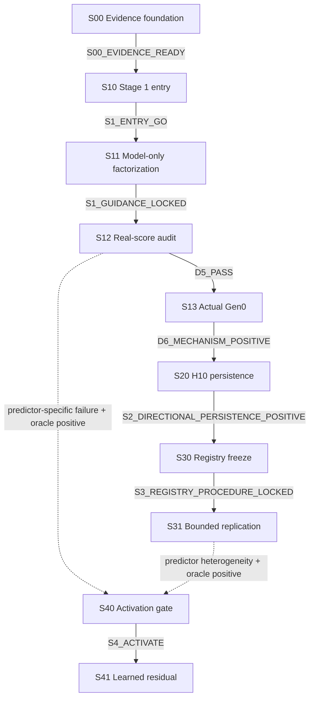

# Ductile Factorized Guidance — Active Checkpoint Index

> **Active-state authority banner：**本研究目前是 `pre_empirical / foundation_complete`。S00已以fresh `protocol/v1/`、effective `successor-001` lock、raw-direct evidence、原verifier FULL重驗與formal closeout完成，scientific outcome為`positive`。S10 dependency已解除但仍`not_started`；尚無S10 lock、GPU／mapping evidence或Stage 1 outcome。
>
> **唯一 active 導航入口：**本 README。`legacy/` 內的 M00–M09 仍是 dead-protocol archive，不能提供 schema、hash、lock、registry、criterion、fixture、test或 PASS evidence；S00 positive只支持CPU-only evidence foundation。
>
> **S00 execution／closeout視圖：**`protocol/v1/README.md`只描述immutable
> execution-authority view（E）：baseline
> `60775f12843bee9f95cb0bef4e91de8bc4dc9dc3`＋exact 29 implementation
> blobs＋exact兩份Plan-B，三份authority projection使用baseline bytes。本頁則是
> post-PASS closeout-projection view（C）之一；不要在C直接呼叫historical outcome
> writers，它們必須在任何寫入前以`bound_hash_mismatch`拒絕。請依
> [S00 formal report](reports/staged/s00-foundation-verification-report.md)重建E並
> 執行green verification；該重建依賴baseline Git object與兩份exact ignored
> Plan-B，不保證standalone source-tarball portability。

## 1. Authority order

1. [Research charter](../surrogate-dse-plan.md)：scope、claim ladder、non-goals、failure taxonomy。
2. [Experiment plan](../ductile-origami-warmstart-experiment-plan.md)：公式、samples、seeds、thresholds、data floors、splits、time caps、checkpoint DAG與acceptance IDs。
3. 本頁索引的 checkpoint design：implementation handoff、maximum boundary、artifact/evidence binding。
4. Checkpoint effective lock：把 committed authority、Plan-B、exact whitelists、inputs、fixtures與seeds綁成不可變執行實例。
5. Checkpoint formal report：只記錄已驗證 evidence、outcome、failure ID與closeout，不得反向修改前四層。

任何下層衝突都由較高層決定。`milestone`／`step` 只有在指向本頁 checkpoint ID 時才是 alias，不會形成另一套 lifecycle。

## 2. Active checkpoint index

| ID | Responsibility | Design | Execution | Checkpoint | Scientific outcome | Lock | Formal report |
| --- | --- | --- | --- | --- | --- | --- | --- |
| S00 | Evidence／lineage／checkpoint-resume foundation | `approved` | `completed` | `CHECKPOINT_COMPLETE` | `positive` | `effective (successor-001)` | [report](reports/staged/s00-foundation-verification-report.md) |
| S10 | Stage 1 access／artifact／mapping／noise gate | `approved` | `not_started` | `DESIGN_APPROVED` | `not_evaluated` | `absent` | `reports/staged/s10-stage1-entry-gate-report.md` |
| S11 | Stage 1 model-only factorization／guidance lock | `approved` | `gated` | `DESIGN_APPROVED` | `not_evaluated` | `absent` | `reports/staged/s11-stage1-model-only-factorization-report.md` |
| S12 | Stage 1 real-score／ranking／oracle audit | `approved` | `gated` | `DESIGN_APPROVED` | `not_evaluated` | `absent` | `reports/staged/s12-stage1-real-score-audit-report.md` |
| S13 | Stage 1 actual Gen0 mechanism | `approved` | `gated` | `DESIGN_APPROVED` | `not_evaluated` | `absent` | `reports/gen0-factorization-mvp-report.md` |
| S20 | Stage 2 fixed H10 persistence | `approved` | `gated` | `DESIGN_APPROVED` | `not_evaluated` | `absent` | `reports/short-horizon-persistence-report.md` |
| S30 | Stage 3 held-out registry／procedure freeze | `approved` | `gated` | `DESIGN_APPROVED` | `not_evaluated` | `absent` | `reports/staged/s30-heldout-registry-freeze-report.md` |
| S31 | Stage 3 two-cluster bounded replication | `approved` | `gated` | `DESIGN_APPROVED` | `not_evaluated` | `absent` | `reports/bounded-regime-replication-report.md` |
| S40 | Stage 4 trigger／data-sufficiency gate | `approved` | `gated` | `DESIGN_APPROVED` | `not_evaluated` | `absent` | `reports/staged/s40-stage4-activation-report.md` |
| S41 | Stage 4 learned residual analysis | `approved` | `gated` | `DESIGN_APPROVED` | `not_evaluated` | `absent` | `reports/learned-residual-surrogate-report.md` |

Designs：

- [S00 — Evidence contract、lineage 與 observability](s00-evidence-contract-lineage-observability-design.md)
- [S10 — Stage 1 entry access／mapping gate](s10-stage1-entry-access-mapping-gate-design.md)
- [S11 — Stage 1 model-only factorization](s11-stage1-model-only-factorization-design.md)
- [S12 — Stage 1 real-score audit](s12-stage1-real-score-ranking-oracle-audit-design.md)
- [S13 — Stage 1 actual Gen0](s13-stage1-actual-gen0-mechanism-design.md)
- [S20 — Stage 2 H10 persistence](s20-stage2-h10-persistence-design.md)
- [S30 — Stage 3 registry freeze](s30-stage3-heldout-registry-freeze-design.md)
- [S31 — Stage 3 bounded replication](s31-stage3-bounded-replication-design.md)
- [S40 — Stage 4 activation gate](s40-stage4-surrogate-activation-gate-design.md)
- [S41 — Stage 4 learned residual](s41-stage4-learned-residual-analysis-design.md)

## 3. Strict dependency DAG



- S00的post-audited positive closeout已驗證`S00_EVIDENCE_READY -> S10`；這只解除
  S10 planning dependency，不代表S10已有lock、ready或started。
- `S1_ENTRY_DEGRADED_PROXY`、two-size mode、H5 pilot、single-cluster pilot或任何縮減不會自動形成 outgoing edge；必須先停在 `blocked-awaiting-user-decision`。
- S12／S31 只有 parent 明列的 predictor-specific、oracle-positive evidence可送入 S40。
- S40 沒有合法 trigger時不執行，由上游 report記 `not_activated`；不替 S40 建假 report或commit。

## 4. 分離的狀態詞彙

`design_status` 只描述設計：`draft | approved | superseded`。

`execution_status` 只描述執行：`not_started | gated | ready | running | blocked | completed | cancelled`。

`checkpoint_state` 描述 orchestration／closeout：`DESIGN_APPROVED | LOCKED_READY | RUNNING | VERIFIED_PENDING_CLOSEOUT | CHECKPOINT_COMPLETE | BLOCKED`。

`scientific_outcome` 只描述科學判讀：`not_evaluated | positive | negative | inconclusive | blocked | not_activated | skipped_by_gate`。

`lock_state` 只描述 effective lock：`absent | effective | superseded`。

這些欄位不可互相代用。Technical `PASS` 只會進入 `VERIFIED_PENDING_CLOSEOUT`；只有 formal report、parent hunk、`CLOSEOUT_ACK`、isolated commit與post-commit audit全過，才是 `CHECKPOINT_COMPLETE`。

## 5. Future checkpoint lifecycle

每次只處理一個 active checkpoint：

1. 讀取 committed repository rule、skill、charter、parent plan與checkpoint design revisions。
2. 將 design 的 maximum boundary縮成 exact path/symbol implementation whitelist與delivery whitelist。
3. 由兩個獨立 planner建立 Plan-A與frozen Plan-B。
4. 建立 effective lock；lock生效前不得產生 outcome-bearing evidence。
5. Fresh implementer依Plan-A實作，fresh verifier依Plan-B獨立驗證。
6. `CHANGES_REQUIRED`只修 active checkpoint並重驗；consequential design issue先走 `design-discussion`。
7. Technical `PASS`只進入`VERIFIED_PENDING_CLOSEOUT`。
8. 建立self-contained formal report，同步更新parent的checkpoint-specific hunk、current design status，以及本README的verified lifecycle projection。
9. 原verifier執行closeout audit並明確給`CLOSEOUT_ACK`。
10. Exact-path isolated commit與post-commit audit成功後，才標`CHECKPOINT_COMPLETE`並考慮下一條edge。

Verified lifecycle projection只可更新當前checkpoint row、該closeout直接解析的outgoing edge／downstream state，以及事實性banner prose；不得預寫下游結果，也不得藉此修改criteria、thresholds、strict DAG或claim authority。2026-07-25核准的pre-execution authority amendment補齊此同步責任；本頁現只投影已closeout的S00與直接解除dependency、仍`not_started`的S10。

Positive、negative與inconclusive在evidence integrity完整時都照常report、closeout與commit。Durable `BLOCKED`不是完成；`skipped_by_gate`／`not_activated`只由上游checkpoint記錄，不建立自己的report或commit。

## 6. Report、blocker與skip policy

- 每份 active design只有一個 formal report path。
- 唯一預註冊 blocker memo是 S10 的 `reports/gen0-factorization-blocker-memo.md`，只用於 hard access／artifact／mapping blocker。
- S40 data insufficiency是科學 negative，寫入 S40 formal report；不使用 data-insufficiency blocker memo。
- Outcome evidence已開始後，即使中途失敗，也不得退回 blocker memo來避開 formal negative／inconclusive report。
- 現在不建立任何空白 report、placeholder lock、假 hash或compatibility stub。

## 7. Downgrade review gate

以下狀況一律先產生decision packet並停在`blocked-awaiting-user-decision`：

- `DEGRADED_PROXY`；
- two-size／reduced-regime mode；
- `S2_H5_RESOURCE_BOUNDED_PILOT`；
- single-cluster Stage 3 pilot；
- 任何減少workloads、runs、seeds、metrics、validation、acceptance或scope的替代方案。

Decision packet必須列出原設計、目標證據、已完成／缺失工作、root cause、downgrade對power／comparability／claim的影響、保留原設計的替代方案與建議。Diagnostic partial run不會完成checkpoint或解鎖下游。

## 8. From-scratch S00 bootstrap

本設計 bundle不建立`protocol/`。未來只有 S00 execution可首次建立：

```text
protocol/
└── v1/
    ├── README.md
    ├── study-contract.yaml
    ├── amendment-ledger.jsonl
    ├── schemas/
    └── locks/
        └── s00-foundation-lock.json
```

- Genesis使用全新identity，`parent_lock: null`。
- 不得包含 M00 version、hash、criterion、registry、path或migration provenance。
- 先實作schema／validator／lock writer與fresh deterministic fixtures，但在lock生效前不產生outcome evidence。
- S00 lock綁定committed charter、parent plan、S00 design、rule/skill revisions、Plan-B、exact whitelists、fixtures/seeds與report target。
- Evidence開始後若schema、fixture或whitelist改變，必須append amendment／建立新lock並重跑，不能覆寫。
- Git history中的舊`protocol/`內容不能作template、compatibility target或PASS evidence。

S00開始前仍需另行取得ordinary baseline commit授權，把本次intentional protocol deletions與authority/design bundle固定為stable committed baseline；那個baseline commit不是S00 closure。

## 9. Legacy archive

`legacy/`保留M00–M09歷史正文，但所有active-looking metadata都已改成`historical_*`。Successor只表示主題關聯，不表示artifact、criterion、schema、lock、hash、registry、test或outcome migration。

- [M00](legacy/m00-study-contract-observability-design.md)
- [M01](legacy/m01-step0-integration-gate-design.md)
- [M02](legacy/m02-guidance-plumbing-design.md)
- [M03](legacy/m03-exp0a-cold-headroom-design.md)
- [M04](legacy/m04-exp0b-widening-gate-design.md)
- [M05](legacy/m05-expc-ranking-oracle-design.md)
- [M06](legacy/m06-exp1-injection-b-design.md)
- [M07](legacy/m07-exp2-a-safe-b-factorial-design.md)
- [M08](legacy/m08-exp3-multishape-design.md)
- [M09](legacy/m09-overall-confirmation-design.md)

任何從legacy URL進入的讀者都必須返回本README，再由active checkpoint index取得權威。
