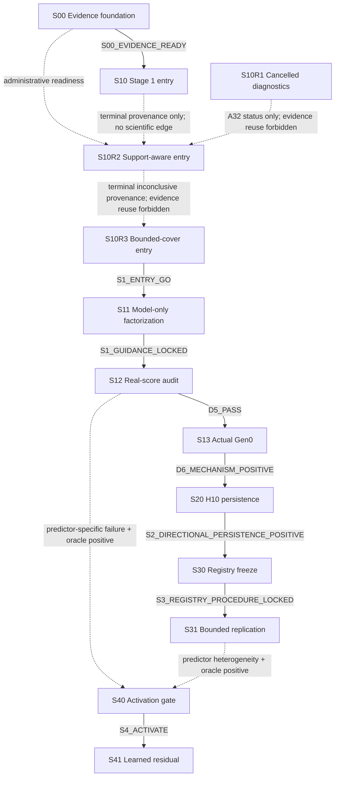

# Ductile Factorized Guidance — Active Checkpoint Index

> **Active-state authority banner：**本研究目前是
> `pre_empirical / s10r3_design_approved`。S00是durable positive，
> S10是durable `negative / S1_ENTRY_BLOCKED / edge=null`，兩者不變。User-authorized
> A32已在safe boundary取消S10R1：operational
> `cancelled / BLOCKED`、scientific `not_evaluated`、`edge=null`，沒有scientific
> report且不是`CHECKPOINT_COMPLETE`；generation 0／1只作diagnostic lineage並
> 禁止重用。A33另授權identity-only retirement；bulk artifacts不再保留。新的
> sibling S10R2已由fresh verifier technical `PASS`，scientific outcome為
> `inconclusive / FT-INCONCLUSIVE / edge=null`；本次closure commit與post-audit後
> projection為`CHECKPOINT_COMPLETE`。A33 retirement
> post-audit已通過；A34核准prospective calibration boundary，A35再將R2 repair
> round上限由3提高為6且不重置已消耗rounds；A36另將不影響workload、stopping、
> evidence integrity或scientific result的resource-accounting缺口定為non-blocking
> caveat，不要求resource-only rerun；A37 prospectively取消internal resource target
> 與cumulative ledger作blanket hard gate，改為record＋notify＋continue，只有
> material safety／availability／completion／evidence boundary才暫停。A38已核准
> R3 sibling S10R3，S10R2保持immutable inconclusive/null；只有S10R3的post-audited
> `S1_ENTRY_GO`可啟動S11。A44把所有prospective R0–R3 repair cap統一為6 rounds，
> 並把experiment-design user gate與非設計dual-agent預授權分開。
>
> **唯一 active 導航入口：**本 README。`legacy/` 內的 M00–M09 仍是 dead-protocol archive，不能提供 schema、hash、lock、registry、criterion、fixture、test或 PASS evidence；S00 positive只支持CPU-only evidence foundation。
>
> **S00 execution／closeout視圖：**`protocol/v1/README.md`只描述immutable
> execution-authority view（E）：baseline
> `60775f12843bee9f95cb0bef4e91de8bc4dc9dc3`＋exact 29 implementation
> blobs＋exact兩份Plan-B，三份authority projection使用baseline bytes。本頁則是
> post-PASS closeout-projection view（C）之一；不要在C直接呼叫historical outcome
> writers，它們必須在任何寫入前以`bound_hash_mismatch`拒絕。請依
> [S00 formal report](reports/staged/s00-foundation-verification-report.md)重建E並
> 執行green verification；該重建依賴baseline Git object與兩份exact ignored
> Plan-B，不保證standalone source-tarball portability。

## 1. Authority order

1. [Research charter](../surrogate-dse-plan.md)：scope、claim ladder、non-goals、failure taxonomy。
2. [Experiment plan](../ductile-origami-warmstart-experiment-plan.md)：公式、samples、seeds、thresholds、data floors、splits、time caps、checkpoint DAG與acceptance IDs。
3. 本頁索引的 checkpoint design：implementation handoff、maximum boundary、artifact/evidence binding。
4. Durable machine-readable frozen contract與checkpoint effective lock：在evidence前把
   committed authorities、criteria/matrix、resources、Plan-B、exact whitelists、
   inputs、fixtures與seeds綁成不可變執行實例。
5. Compact positive gate record或terminal formal report：只記verified evidence、
   outcome、edge與closeout，不得反向修改前四層。

Execution governance另以commit
`b0561d2c9216a58a9d71b8e839c47efaa51f9c00`為mandatory floor；它規範risk tier、
tranche／closure、cumulative budgets與state projection，但不能靜默改上列scientific
hypothesis、criterion、edge或timebox。

任何下層衝突都由較高層決定。`milestone`／`step` 只有在指向本頁 checkpoint ID 時才是 alias，不會形成另一套 lifecycle。

## 2. Active checkpoint index

| ID | Responsibility | Design | Execution | Checkpoint | Scientific outcome | Lock | Formal report |
| --- | --- | --- | --- | --- | --- | --- | --- |
| S00 | Evidence／lineage／checkpoint-resume foundation | `approved` | `completed` | `CHECKPOINT_COMPLETE` | `positive` | `effective (successor-001)` | [report](reports/staged/s00-foundation-verification-report.md) |
| S10 | Stage 1 access／artifact／mapping／noise gate | `approved` | `completed` | `CHECKPOINT_COMPLETE` | `negative` | `effective (successor-003)` | [report](reports/staged/s10-stage1-entry-gate-report.md) |
| S10R1 | Cancelled nominal-boundary recovery diagnostics | `approved` | `cancelled` | `BLOCKED` | `not_evaluated` | `superseded` | none (A32 operational record only) |
| S10R2 | Stage 1 support-aware entry recovery | `approved` | `completed` | `CHECKPOINT_COMPLETE` | `inconclusive` | `effective` | [report](reports/staged/s10r2-stage1-support-aware-entry-report.md) |
| S10R3 | Stage 1 bounded-cover entry recovery | `approved` | `not_started` | `DESIGN_APPROVED` | `not_evaluated` | `absent` | `reports/staged/s10r3-stage1-bounded-cover-entry-report.md` |
| S11 | Stage 1 model-only factorization／guidance lock | `approved` | `gated` | `DESIGN_APPROVED` | `not_activated` | `absent` | `reports/staged/s11-stage1-model-only-factorization-report.md` |
| S12 | Stage 1 real-score／ranking／oracle audit | `approved` | `gated` | `DESIGN_APPROVED` | `not_evaluated` | `absent` | `reports/staged/s12-stage1-real-score-audit-report.md` |
| S13 | Stage 1 actual Gen0 mechanism | `approved` | `gated` | `DESIGN_APPROVED` | `not_evaluated` | `absent` | `reports/gen0-factorization-mvp-report.md` |
| S20 | Stage 2 fixed H10 persistence | `approved` | `gated` | `DESIGN_APPROVED` | `not_evaluated` | `absent` | `reports/short-horizon-persistence-report.md` |
| S30 | Stage 3 held-out registry／procedure freeze | `approved` | `gated` | `DESIGN_APPROVED` | `not_evaluated` | `absent` | `reports/staged/s30-heldout-registry-freeze-report.md` |
| S31 | Stage 3 two-cluster bounded replication | `approved` | `gated` | `DESIGN_APPROVED` | `not_evaluated` | `absent` | `reports/bounded-regime-replication-report.md` |
| S40 | Stage 4 trigger／data-sufficiency gate | `approved` | `gated` | `DESIGN_APPROVED` | `not_evaluated` | `absent` | `reports/staged/s40-stage4-activation-report.md` |
| S41 | Stage 4 learned residual analysis | `approved` | `gated` | `DESIGN_APPROVED` | `not_evaluated` | `absent` | `reports/learned-residual-surrogate-report.md` |

Designs：

- [S00 — Evidence contract、lineage 與 observability](s00-evidence-contract-lineage-observability-design.md)
- [S10 — Stage 1 entry access／mapping gate](s10-stage1-entry-access-mapping-gate-design.md)
- [S10R1 — Cancelled recovery diagnostic record](s10r1-stage1-valid-support-entry-recovery-design.md)
- [S10R2 — Stage 1 support-aware entry recovery](s10r2-stage1-support-aware-entry-recovery-design.md)
- [S10R3 — Stage 1 bounded-cover entry recovery](s10r3-stage1-bounded-cover-entry-recovery-design.md)
- [S11 — Stage 1 model-only factorization](s11-stage1-model-only-factorization-design.md)
- [S12 — Stage 1 real-score audit](s12-stage1-real-score-ranking-oracle-audit-design.md)
- [S13 — Stage 1 actual Gen0](s13-stage1-actual-gen0-mechanism-design.md)
- [S20 — Stage 2 H10 persistence](s20-stage2-h10-persistence-design.md)
- [S30 — Stage 3 registry freeze](s30-stage3-heldout-registry-freeze-design.md)
- [S31 — Stage 3 bounded replication](s31-stage3-bounded-replication-design.md)
- [S40 — Stage 4 activation gate](s40-stage4-surrogate-activation-gate-design.md)
- [S41 — Stage 4 learned residual](s41-stage4-learned-residual-analysis-design.md)

## 3. Strict dependency DAG



- S00的post-audited positive closeout已驗證`S00_EVIDENCE_READY -> S10`。S10已完成
  actual-guidance／live-unreserved H4／mapping boundary，並以完整可重現的
  `FT-BLOCKED-MAPPING` negative branch形成`S1_ENTRY_BLOCKED`。沒有outgoing edge；
  Direct evidence、successor lifecycle與claim boundary見
  [S10 formal report](reports/staged/s10-stage1-entry-gate-report.md)；早期
  [blocker memo](reports/gen0-factorization-blocker-memo.md)只保留為historical
  recovery evidence。
- R12曾核准S10R1；A32後續在quiescent safe boundary取消該execution。
  [S10R1 record](s10r1-stage1-valid-support-entry-recovery-design.md)固定為
  `cancelled / BLOCKED / not_evaluated / edge=null`，不建立report或completion；
  stochastic non-discovery不是scientific inconclusive或absence proof。A33只把
  physical artifacts改為identity-only retention；tombstone與
  [retirement manifest](retirements/s10r1-diagnostic-retirement.json)保留lineage。
- 新[S10R2 design](s10r2-stage1-support-aware-entry-recovery-design.md)是sibling，不是
  S10R1 successor。S00 readiness、S10 terminal provenance與A32 status只作
  administrative prerequisites；虛線不是scientific edge，且S10R1 evidence reuse
  forbidden。S10R2已closeout為inconclusive/null。A38新增
  [S10R3](s10r3-stage1-bounded-cover-entry-recovery-design.md)；S10R2對它只提供
  immutable terminal provenance，不提供formal evidence。S10R3是唯一新的
  `S1_ENTRY_GO`來源。
- `S1_ENTRY_DEGRADED_PROXY`、two-size mode、H5 pilot、single-cluster pilot或任何縮減不會自動形成 outgoing edge；必須先停在 `blocked-awaiting-user-decision`。
- S12／S31 只有 parent 明列的 predictor-specific、oracle-positive evidence可送入 S40。
- S40 沒有合法 trigger時不執行，由上游 report記 `not_activated`；不替 S40 建假 report或commit。

## 4. 分離的狀態詞彙

`design_status` 只描述設計：`draft | approved | superseded`。

`execution_status` 只描述執行：`not_started | gated | ready | running | blocked | completed | cancelled`。

`checkpoint_state` 描述 orchestration／closeout：`DESIGN_APPROVED | LOCKED_READY | RUNNING | VERIFIED_PENDING_CLOSEOUT | CHECKPOINT_COMPLETE | BLOCKED`。

`scientific_outcome` 只描述科學判讀：`not_evaluated | positive | negative | inconclusive | blocked | not_activated | skipped_by_gate`。

`lock_state` 只描述 effective lock：`absent | effective | superseded`。

這些欄位不可互相代用。Technical `PASS` 只會進入 `VERIFIED_PENDING_CLOSEOUT`；只有 formal report、parent hunk、`CLOSEOUT_ACK`、isolated commit與post-commit audit全過，才是 `CHECKPOINT_COMPLETE`。

`scientific_gate`是不能合併或繞過的outcome／claim／authority edge；
`execution_tranche`可讓相容adjacent gates共享planner、implementer、verifier、run root
與repair ledger；`closure_unit`可共享terminal report/update/staged audit/commit，但
不能改gate order或把outcomes混成一個。`live_run_state`保存working-tree／partial
進度；`committed_projection_state`只在closure commit與post-commit audit後更新。

## 5. Governance tranches與future lifecycle

| Execution tranche | Risk tiers | Scientific gates | Closure unit |
| --- | --- | --- | --- |
| `T-S10R2` | S10R2=`R2` | S10R2 | `CU-S10R2` standalone |
| `T-S10R3` | S10R3=`R3` | S10R3 | `CU-S10R3` standalone |
| `T-S1-MECHANISM` | S11/S12=`R2`, S13=`R1` | S11 → S12 → S13 | `CU-S1-MECHANISM` |
| `T-S20` | S20=`R1` | S20 | `CU-S20` standalone |
| `T-S3-REPLICATION` | S30=`R2`, S31=`R1` | S30 → S31 | `CU-S3-REPLICATION` |
| `T-S4-LEARNED-RESIDUAL` | S40=`R2`, S41=`R1` | S40 → S41 | `CU-S4-LEARNED-RESIDUAL` |

每個tranche依序處理dependency-ready scientific gates：

1. 讀取 committed repository rule、skill、charter、parent plan與checkpoint design revisions。
2. 將 design 的 maximum boundary縮成 exact path/symbol implementation whitelist與delivery whitelist。
3. 在任何outcome evidence前建立durable machine-readable frozen contract、驗證
   human/machine parity並seal effective lock。
4. 依`b0561d2c92`治理floor鎖risk tier與repair/thread hard caps；resource planning
   依A37保留known usage及measurement boundary作best-effort provenance，跨generation、
   successor、replacement、new root不刪除／補造，但不單獨debit successor entry。
5. Planner／implementer／fresh verifier依risk tier與frozen contract執行。
6. `CHANGES_REQUIRED`只修 active checkpoint並重驗；consequential design issue先走 `design-discussion`。
7. Technical `PASS`只進入`VERIFIED_PENDING_CLOSEOUT`。
8. Internal positive gate只seal其design指定的compact durable gate record，依verified
   frozen edge在同tranche繼續；它不刪除scientific gate，也不提前把closure unit標
   `COMPLETE`。
9. Internal negative／inconclusive立即產生該gate planned terminal report並停止；
   final gate report整合所有先前compact records。
10. Terminal staged audit、`CLOSEOUT_ACK`、exact-path isolated commit與post-commit
    audit全過後，才更新`committed_projection_state`與closure unit。

Verified projection只可更新terminal record直接解析的rows／edges與事實性banner；
不得預寫下游結果或修改criteria。Durable operational`BLOCKED`不是scientific
completion；`skipped_by_gate`／`not_activated`不建立假report。

## 6. Report、blocker與skip policy

- 每份 active design只有一個 formal report path。
- 唯一預註冊 blocker memo是 S10 的 `reports/gen0-factorization-blocker-memo.md`，只用於 hard access／artifact／mapping blocker。
- S10R1依A32取消，沒有scientific report、blocker memo或completion；舊planned report
  path不得建立。
- S10R2唯一formal report是
  `reports/staged/s10r2-stage1-support-aware-entry-report.md`，且不覆寫S10 report。
- S10R3唯一formal report是
  `reports/staged/s10r3-stage1-bounded-cover-entry-report.md`；現在不得建立placeholder。
- S40 data insufficiency是科學 negative，寫入 S40 formal report；不使用 data-insufficiency blocker memo。
- Outcome evidence已開始後，即使中途失敗，也不得退回 blocker memo來避開 formal negative／inconclusive report。
- S11／S12／S30／S40 internal positive使用各design指定compact gate record；若
  internal terminal negative／inconclusive，使用各自planned report；S13／S31／S41
  final report整合prior records。
- 現在不建立任何空白 report、placeholder lock、假 hash或compatibility stub。

### 6.1 2026-07-28 A32／S10R2 authority amendment

- Append-only S10R1 governance chain的user-authorized A32 event是live basis；本次不
  修改該chain或任何`agent_run`內容。
- A32在quiescent safe boundary取消S10R1。Generation 0已atomic retire／seal；
  generation 1未建立effective L0、selection、mapping、GPU、noise、decision或formal
  outcome，且沒有相關writer／flock。
- S10R1固定為`cancelled / BLOCKED / not_evaluated / edge=null`，沒有scientific
  report、completion或reuse authority。
- 新sibling S10R2是R2 standalone tranche／closure；S11 dependency重指唯一
  `S10R2:S1_ENTRY_GO`。
- S11–S41 scientific gates、edges、criteria與numerical timeboxes完整保留；execution
  tranches新增tiered governance與cumulative resource accounting。
- 本次只修改列名的documentation／authority files，不建立protocol code／tests、
  report、commit或push。Working-tree projection是`live_run_state`；future exact-path
  authority commit與post-audit前，`committed_projection_state`仍以
  `b0561d2c9216a58a9d71b8e839c47efaa51f9c00`為baseline。

### 6.2 2026-07-28 A33 S10R1 artifact retirement

- 兩位fresh `gpt-5.6-sol/xhigh` reviewers經獨立首輪、一輪cross-examination與同一
  final candidate後均`AGREE`：S10R1約34 GB ignored tree與19個untracked old-code
  paths沒有合法S10R2／S11 consumer，應由compact identity tombstone取代。
- 第一階段先commit
  [retirement manifest](retirements/s10r1-diagnostic-retirement.json)的
  `authorized_pending_cleanup`與本authority；第二階段只按exact allowlist清理並將
  manifest更新為`retired_post_audited`。不使用broad cleanup，也不碰S00／S10、
  actual YAML、source objects、S10R2+ authority或unrelated worktree changes。
- Cleanup不改S10R1 state／outcome／edge，也不reset歷史resource accounting。
  S10R2在新的resource decision明列carry-over／reset／cap前保持operational
  `BLOCKED / not_evaluated / edge=null`。
- 後續strict順序是：
  `resource relock -> S10R2 -> S11 -> S12 -> S13 -> S20 -> S30 -> S31`；
  S40／S41仍只在既定trigger與data gate成立時啟動。

### 6.3 2026-07-28 A34 prospective resource boundary

- Fresh reviewers`/root/s10r2_next_plan_a`與`/root/s10r2_next_plan_b`以相同
  `gpt-5.6-sol / xhigh` evidence完成獨立首輪、一輪cross-examination與同一final
  candidate，兩方均`AGREE`。
- Historical cutoff固定為`d66edf7ac81cb76825b988e1ea9a65264dfeb0f6`；
  3151 chunks、threads`>=10`、repairs`>=11`與其餘resource `UNKNOWN`全部保留。
  A33釋放空間不是historical reset。
- Authority commit post-audit後，`T-S10R2`取得prospective 5 new threads／3 new
  repairs；`T-S1-MECHANISM`先reserve同樣5/3，只有S10R2 GO後activate，S11→S13內
  不再reset，且S13仍受R1最多2 repairs。這是A34 historical boundary；prospective
  repair caps後由A44統一supersede為6。
- S10R2→S13共享新的prospective 7 hands-on days、1.4 pre-empirical days與5 GiB
  transient ceiling。先做outcome-blind calibration；具單位wall／CPU／GPU caps、
  confirmed GPU allocation、buffer、contract parity與effective lock全數成立後才
  `LOCKED_READY`。
- Numeric relock前S10R2仍是`BLOCKED / not_evaluated / edge=null`。本authority不改
  workload、criteria、outcome matrix、claim或DAG，也不授權formal evidence、push、
  dependency install、container lifecycle mutation或downgrade。

### 6.4 2026-07-29 A36 resource-accounting materiality

- Resource telemetry預設是operational safety／planning control，不是scientific
  outcome criterion。只有direct cap-exceed／safety evidence、label-dependent
  stopping／selection、required workload不完整或scientific evidence不可驗證時才
  blocking。
- S10R2 fixed schedule與append-only evidence完整，headline
  `inconclusive / FT-INCONCLUSIVE`已由fresh independent process重現；沒有early
  stop、schedule drift、label-driven selection或direct cap-exceed evidence。
  Validator-child以外的wall／CPU缺口因此依A36列non-blocking caveat，不要求只為
  資源記帳重跑。
- 既有contract、lock、terminal ledger、support classification與decision保持
  immutable；fresh verifier需依A36重新出具technical verdict，formal report需揭露
  caveat與measurement boundary。
- A36不創造scientific edge。S10R2仍為
  `inconclusive / FT-INCONCLUSIVE / edge=null`，不能啟動S11；後續正式研究需新的
  entry recovery authority。

### 6.5 2026-07-29 A37 prospective resource-progress priority

- 使用者明確要求resource ledger若不影響整體實驗，就不要過度在意並以完整研究進度
  為優先。Fresh reviewers`/root/resource_rule_review_a`與
  `/root/resource_rule_review_b`以相同`gpt-5.6-sol / xhigh`及repo evidence完成
  獨立立場、一輪cross-examination與一輪final；雙方均`AGREE`。
- Resource usage預設是operational planning metadata，不是scientific estimand、
  acceptance criterion或successor-entry debit。Known usage及parent／child／inclusive
  boundary以best effort保留；`UNKNOWN`不補造、不寫成0。
- Missing telemetry、`>2x` projection、internal day／wall／CPU／GPU／storage／
  throughput／pre-empirical target crossing與historical cumulative consumption只需
  record＋notify。Long-running work開始前通知，但通知不是approval gate；完整frozen
  workload繼續。
- 只有direct或materially indicative evidence連到unsafe continuation、external／
  platform／allocation限制、實際資源不足、完整workload／verification／closure／
  artifact preservation無法完成、optional／label-dependent stopping、workload／
  claim change、evidence不可驗證，或labels前明確凍結的scientific resource boundary
  時，才safe-boundary pause。Bare `UNKNOWN`、internal target或cumulative total不是
  material evidence。
- A37 prospectively supersedes internal resource planning target作blanket hard pause及
  cumulative successor debit的舊文字；scientific sample／execution caps、repair／
  thread caps、downgrade／evidence／claim gates不變。Future machine contract必須採
  相同語意。
- S10R2 A36、contract、lock、ledger、artifacts、formal report及
  `inconclusive / FT-INCONCLUSIVE / edge=null`完全immutable；不做resource-only
  rerun，也不因此啟動S11。

### 6.6 2026-07-29 A38 S10R3 bounded-cover entry

- S10R2以frozen exact-ten selector觀察到90個mandatory atoms、greedy cover 18，
  因而正確closeout為`inconclusive / FT-INCONCLUSIVE / edge=null`。A38不重開或
  重標它；舊18只作design diagnostic。
- Fresh reviewers`/root/s1_recovery_design_a`與`/root/s1_recovery_design_b`完成兩輪
  cross-examination及一輪evidence-backed final。使用者以「全部核准」核准共同的
  bounded-K scientific package、三項execution-authority解析、五路徑authority
  commit與後續`implement-verify-loop`；不授權push。
- 新S10R3固定fresh registry、disjoint seeds與append-only ledger。S10R1 artifacts及
  S10R2 rows／support／targets／cover／seeds／mapping／GPU／noise／decision全部禁止
  作formal evidence。
- Discovery仍是global `32×512`加最多15個conditional targets各`32×512`，
  total max `512 chunks / 262,144 draws`；無early stop、extension或seed retry。
- Mandatory set仍是
  `prelocked_candidate_atoms ∩ supported_witnessed`。Selector固定：

  ```text
  C_greedy = deterministic_greedy_set_cover_v2_bounded_k20的full-cover cardinality
  K        = max(10, C_greedy)
  K_max    = 20
  ```

  `C_greedy`不稱minimum。Fresh witnesses少於10或`C_greedy>20`即
  inconclusive/null，不得labels後改solver、draw、seed或cap。
- Mapping A/B各exact `3K` rows，最多60 rows/pass；anchors為sorted hashes的
  `{0,floor((K-1)/2),K-1}`。Correctness仍9 cells、noise仍63 cells，S11–S13
  scientific workload、threshold、claim與internal edges不變。
- R3角色配置為two planners、one adversarial auditor、Main implementation與one
  fresh verifier；連同兩位design reviewers為`6/6` threads，沒有replacement
  headroom。A44後repair最多6 rounds，rounds 1–3完整carry over。
- `12669 wall-s / 65285 CPU-s / 2901 GPU-s / 2 GiB`只作A37 planning estimates。
  GPU／ROCm command只在existing `perlee`；每phase直接選目前free eligible gfx942，
  不需reservation或exclusivity，但必須鎖定identity、foreign-PID rejection、
  interruption與append-only resume。
- 只有post-audited `S10R3:S1_ENTRY_GO`啟動S11；其他outcome都保持edge null。

### 6.7 2026-07-30 A44 universal six-round repair與goal persistence

- 所有prospective R0–R3 repair cap都是6 rounds；已消耗rounds不重置，第7輪仍需
  新human authority。S10R3因此由`3/3`改為`3/6`。
- Experiment-design ambiguity仍由兩個獨立agents完成bounded cross-examination，
  並將unified recommendation或dissent交使用者決定後才恢復affected path。
- 非設計阻塞、多個contract-preserving repairs或同一finding兩輪無material progress，
  可由兩個獨立agents裁決；共同non-destructive、contract/authority-preserving
  結論已預授權直接執行。沒有thread headroom時resume既有獨立non-implementer roles。
- 普通`CHANGES_REQUIRED`、可修復test/process failure與nonmaterial resource-accounting
  variance不再提前terminalize可完成的goal。本authority不改scientific criteria、
  schedule、outcome／edge、claim，也不授權push、downgrade、destructive operation、
  dependency install或container mutation。

## 7. Downgrade review gate

以下狀況一律先產生decision packet並停在`blocked-awaiting-user-decision`：

- `DEGRADED_PROXY`；
- two-size／reduced-regime mode；
- `S2_H5_RESOURCE_BOUNDED_PILOT`；
- single-cluster Stage 3 pilot；
- 任何減少workloads、runs、seeds、metrics、validation、acceptance或scope的替代方案。

Decision packet必須列出原設計、目標證據、已完成／缺失工作、root cause、downgrade對power／comparability／claim的影響、保留原設計的替代方案與建議。Diagnostic partial run不會完成checkpoint或解鎖下游。

## 8. From-scratch S00 bootstrap

本設計 bundle不建立`protocol/`。未來只有 S00 execution可首次建立：

```text
protocol/
└── v1/
    ├── README.md
    ├── study-contract.yaml
    ├── amendment-ledger.jsonl
    ├── schemas/
    └── locks/
        └── s00-foundation-lock.json
```

- Genesis使用全新identity，`parent_lock: null`。
- 不得包含 M00 version、hash、criterion、registry、path或migration provenance。
- 先實作schema／validator／lock writer與fresh deterministic fixtures，但在lock生效前不產生outcome evidence。
- S00 lock綁定committed charter、parent plan、S00 design、rule/skill revisions、Plan-B、exact whitelists、fixtures/seeds與report target。
- Evidence開始後若schema、fixture或whitelist改變，必須append amendment／建立新lock並重跑，不能覆寫。
- Git history中的舊`protocol/`內容不能作template、compatibility target或PASS evidence。

S00開始前仍需另行取得ordinary baseline commit授權，把本次intentional protocol deletions與authority/design bundle固定為stable committed baseline；那個baseline commit不是S00 closure。

## 9. Legacy archive

`legacy/`保留M00–M09歷史正文，但所有active-looking metadata都已改成`historical_*`。Successor只表示主題關聯，不表示artifact、criterion、schema、lock、hash、registry、test或outcome migration。

- [M00](legacy/m00-study-contract-observability-design.md)
- [M01](legacy/m01-step0-integration-gate-design.md)
- [M02](legacy/m02-guidance-plumbing-design.md)
- [M03](legacy/m03-exp0a-cold-headroom-design.md)
- [M04](legacy/m04-exp0b-widening-gate-design.md)
- [M05](legacy/m05-expc-ranking-oracle-design.md)
- [M06](legacy/m06-exp1-injection-b-design.md)
- [M07](legacy/m07-exp2-a-safe-b-factorial-design.md)
- [M08](legacy/m08-exp3-multishape-design.md)
- [M09](legacy/m09-overall-confirmation-design.md)

任何從legacy URL進入的讀者都必須返回本README，再由active checkpoint index取得權威。
