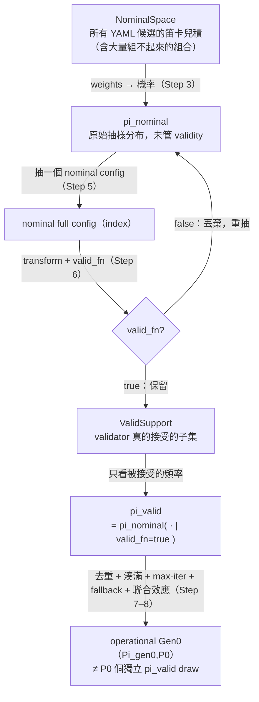

# QA-02 — Ductile Gen0 與 nominal／valid support

> **文件角色：**這是從 [實驗白話導讀 hub](../../ductile-origami-warmstart-experiment-guide.md) 拆分出來的白話導讀主題檔，方便在單一主題上持續討論。它不是 experiment authority，也不是 contract、lock 或 report，不會取代正式的 charter、experiment plan、checkpoint design、lock 或 report。
>
> **衝突處理：**若本檔與正式文件衝突，以 [research charter](../../surrogate-dse-plan.md)、[experiment plan](../../ductile-origami-warmstart-experiment-plan.md)、[active checkpoint index](../README.md) 及各 checkpoint design 為準。
>
> **2026-08-04 current status override：**S10R3 已 terminal negative；S10R4 已 retired／not evaluated；S11 已 sealed `LOCKED_READY`。沒有 S11/S12 result、effective checkpoint lock、report 或 edge；最新狀態仍須對照 active checkpoint index、formal artifacts 與 Git history。

---

## 前言：這份文件在回答什麼

整條研究線最後想做的事，是把 Formocast 對 kernel config 的效能預測，變成 Ductile GA 抽第 0 代（**Gen0**，初始族群）時的偏好。要做到這件事，得先看懂 Ductile 到底怎麼把 Gen0 生出來——否則把 guidance 注在錯的地方，整個實驗都會錯位。

這裡有兩個一開始很容易搞混、但一定要先分清楚的落差：

1. **「介面吃什麼」的落差。** Ductile 的抽樣介面**不是**接收「請多抽這個完整 config」，而是接收「這個 gene（參數）的每個候選值，各自應該多常被抽到」——也就是 per-gene 的機率向量。所以任何 guidance 最後都得攤成「逐參數、逐候選值的機率」才能餵進去。
2. **「列了 ≠ 抽得到」的落差。** YAML 把某個 value 列為候選，只代表它是**名義上**的選項；它能不能真的和其他參數組成一個**合法**的 config，是另一回事。Ductile 在抽樣時會用一個 validator（`valid_fn`）把不合法的組合擋掉。於是「YAML 列出的候選空間」和「抽樣真正碰得到的合法空間」並不相同，兩者之間隔著一層 validity 過濾。

這份文件就是要把這兩件事講到看得懂：**§5** 逐步拆解 Ductile 實際建立 Gen0 的流程（從讀 YAML 到形成初始族群），**§6** 建立一組概念工具——nominal space、valid support，以及三個必須分開看待的抽樣分布（`pi_nominal`、`pi_valid`、operational Gen0）——好讓後面 QA-03 談的 factorization 與 guidance injection 有正確的地基。

**邊界宣告：**本檔只講「Gen0 怎麼被抽出來」與「合法空間的概念」。至於「怎麼把 Formocast 分數拆成 per-gene 機率」（factorization）、trusted set、shrinkage、`p1 = 0.20·p0 + 0.80·q` 這類 guidance 機制，屬於 [QA-03](qa-03-s11-factorization-and-metric-design.md)，本檔只在需要時指過去，不重述。基礎名詞（whole config、gene、group、weight、Gen0…）見 [QA-01](qa-01-terminology-design.md)。

---

## 5. Ductile 實際建立 Gen0 的流程

下面把 Ductile 從「讀設定檔」到「交出一個初始族群」的完整過程拆成 10 步。抽樣的實際實作在 `projects/hipblaslt/tensilelite/Tensile/ductile/core/space.py`（`SearchSpace`）與同目錄的 `population.py`（`Individual`／`IndividualSet`／`Population`）。

### Step 1：解析 YAML

一切從讀設定檔開始。Ductile 把 YAML 拆成幾類資訊，決定「要搜什麼、怎麼搜」：

- **problem type**：要算哪一種 GEMM（含 batched／grouped 等變體）。
- **sizes**：要在哪些 problem size 上量測。
- **ForkParameters**：可以獨立抽樣的可調參數（例如 `DepthU`）。
- **Groups**：綁成一整包、要一起選的參數集合（例如 `group_0`）。
- **candidate order** 與 **weights**：候選值的順序，以及（若有）它們的抽樣權重。
- **validation 設定**：用來判斷一個完整 config 合不合法的規則。

這一步只是「把要搜的東西讀進來」，還沒有任何抽樣發生。

### Step 2：建立 SearchSpace

Ductile 把讀進來的搜尋空間包成一個 `SearchSpace` 物件。這裡有個關鍵的**雙層設計**：每個 search-space key（可能是 ungrouped gene 例如 `DepthU`，也可能是 grouped categorical key 例如 `group_0`）內部**不直接存實際 values，而是存候選的 index**（0、1、2…）。

```text
外層（人看得懂的值）  DepthU: [32, 64, 128, 256, 512, 1024]
內層（抽樣真正用的）  DepthU: [ 0,  1,   2,   3,   4,    5 ]   ← 存 index
map（還原用）        index 3 → 256
```

為什麼要多這一層？因為抽樣時只需要「從 N 個候選裡挑一個位置」，用整數 index 最單純、最快；等真的要判斷合法性或評估時，再透過內部的 map（`SearchSpace.transform()`）把 index config 還原成實際 value config。抽樣期間全程操作 index，需要真值時才翻譯回來。

### Step 3：weights 轉 probabilities

Ductile 內建 generic 的加權抽樣機制。對於**有 weight vector 的 key**，它把 weight 轉成一組抽樣機率：

```text
p ∝ exp(-weight_beta × (weight − minimum_weight))
p = p / sum(p)
```

其中 `weight_beta` 是控制「偏好強弱」的溫度參數（預設約 `0.25`）；式子裡先把每個 weight 減掉該 key 的最小 weight（這就是 normalized 的意思，讓最小 weight 對齊到 0），再取指數。白話結論很直覺：

- **weight 越小 → 機率越大 → 越常被抽；**
- **weight 越大 → 機率越小 → 越少被抽。**

對於**沒有 weight 的 key**，就用 uniform（每個候選機率相同）。目前 actual YAML 主要替 `group_0` 提供 weights，其餘多數 residual gene 是 uniform（weight 與 guidance 的意義見 [QA-01 §4.4](qa-01-terminology-design.md)）。

### Step 4：解析 initial population size

GA 先收到 requested `pop_size`（本實驗名義上是 **64**），但這個數字**不一定等於實際抽出來的族群大小**。Ductile constructor 會依 search-space 的 cardinality（尤其是最大的 categorical key，例如有近萬個候選的 `group_0`）決定 resolved population `P0`：如果最大 key 的候選數比 requested population 還大，Ductile 可能在早期世代把 population 撐大。

這帶來一條紀律：**正式執行必須記錄實際的 `P0`，不能用 nominal 64 去假設成本或推導後續統計。**（見 [QA-01 §4.8](qa-01-terminology-design.md)。）

### Step 5：Nominal draw

真正的抽樣從這裡開始。每一次抽樣，就是**替每個 key 各挑一個 index**：

```text
group_0             選一個 candidate（index）
DepthU              選一個 value（index）
PrefetchGlobalRead  選一個 value（index）
WorkGroupMapping    選一個 value（index）
...
```

實作上，`sample_chunk` 對每個 key 呼叫 `rng.choice(候選數, p=該 key 的機率)`（沒給機率就 uniform），把每個 key 挑到的 index 湊成一個 `Individual`。所有 key 各挑一個，就形成一個 **nominal full config**——「名義上完整」的一組參數。之所以叫「nominal」，是因為此刻還沒問過它合不合法。

### Step 6：valid_fn

有了一個 nominal full config（此刻還是 index 形式），Ductile 先用 `transform()` 把 index **還原成實際 values**，再把還原後的完整 config 丟給 `valid_fn` 判斷：

- 回傳 `true`：這是一個合法組合，**保留**；
- 回傳 `false`：這個組合不合法，**丟棄並繼續抽**。

順序很重要——**先 index→value 還原，再驗證**；`valid_fn` 看到的一律是人看得懂的實際參數組合，不是 index。也要記住 `valid_fn` 只判斷「工程上組不組得起來」，**不判斷效能好壞、也不保證後面編得出 kernel**（這點在 §6 與「常見誤解」會再強調）。

### Step 7：去重與填滿 population

即使是合法的 config，也可能在抽樣中被**重複抽到**（尤其當某些值機率偏高時）。Ductile 用 `IndividualSet`（一個帶容量上限的 `set`）來去重：同一個 config 抽到兩次，只會留下一份（`Individual` 以其 values 做 hash 判斷是否相同）。

抽樣是一輪一輪跑的：每輪產生一批候選（大約是「還差幾個」的倍數），通過 `valid_fn` 的丟進 set，直到——

- **收集到足夠多不同的合法 config**（塞滿容量 `P0`），或
- **到達 max iterations 上限**（上限約為 `max_iters × P0 × iter_mul`，`max_iters` 預設 100）。

如果跑到上限還湊不滿 `P0`，Ductile 會拋出 `MaxIterationsReached`——這就是**填不滿時的 fallback 行為**：不是悄悄用少一點的族群硬跑，而是明確報錯。這個「湊不滿就報錯」的性質，正是 §6.5 說 Gen0 不等於「P0 個獨立抽樣」的原因之一。

### Step 8：形成 Gen0

收集到的這一批「合法、且彼此不重複」的完整 config，就是 **initial population（Gen0）**。到此為止，抽樣階段結束——注意 Gen0 是在 crossover、mutation、selection/survival **之前**就先固定下來的。

### Step 9：評估

Gen0 交給 evaluator，對每個 config 依序：

- generate kernel（產出組語）；
- compile（`amdclang++` 編譯）；
- correctness（正確性檢查）；
- GPU benchmark（實機量測）；
- 計算 fitness。

值得先知道：不是每個合法 config 都能一路走完——有些會卡在 codegen 或編譯而流失。研究因此把 config 分成 **Fraw → Fexec → Fscore** 三層漏斗（合法的／編得出的／評得了分的），並嚴格區分「工程流失」與「模型缺值」。這套三層漏斗的定義與用意屬於 [QA-03 §0.2](qa-03-s11-factorization-and-metric-design.md)，此處只點到為止。

### Step 10：後續世代

只有在 `n_gen > 1` 時，GA 才會繼續往下跑後續世代：

- survival（存活淘汰）；
- selection（選親代）；
- mating（交配 / crossover）；
- mutation（突變）；
- 下一代評估。

本研究關注的重點是 Gen0，因為 warm-start 的 guidance 就是注在這一代的抽樣分布上。

### 5.1 一個小型 worked example：走一遍 Step 5–8

用一個縮小的搜尋空間，把「抽 → 驗 → 去重 → 湊滿」整條走一次會更清楚。假設只有兩個 key、目標 `P0 = 3`：

```text
搜尋空間（已轉成 index）
  A: [a0, a1]        機率 [0.5, 0.5]（uniform）
  B: [b0, b1, b2]    機率 [0.7, 0.2, 0.1]（有 weight，偏好 b0）

規則（valid_fn）：組合 (a1, b2) 不合法，其餘皆合法。
```

抽樣過程可能長這樣：

```text
draw 1 → (a0, b0)  valid ✓  → set = { (a0,b0) }
draw 2 → (a1, b2)  valid ✗  → 丟棄，繼續
draw 3 → (a0, b0)  valid ✓  但重複  → set 不變 = { (a0,b0) }
draw 4 → (a1, b1)  valid ✓  → set = { (a0,b0), (a1,b1) }
draw 5 → (a0, b1)  valid ✓  → set = { (a0,b0), (a1,b1), (a0,b1) }   ← 湊滿 P0=3
```

於是 Gen0 = `{ (a0,b0), (a1,b1), (a0,b1) }`。這個小例子已經顯示三件事，正好是 §6 要正式化的：`(a1,b2)` 這個名義候選組合永遠進不了族群（validity 把它切掉了）；`b0` 雖然 nominal 機率最高，卻因為重複與去重，不一定在最終族群裡出現最多次；而最終這 3 個 config，並不是 3 次「彼此獨立」的抽樣結果——它們受到「不能重複、要湊滿」的聯合限制。

---

## 6. Nominal space、valid support 與 operational Gen0

§5 講的是「怎麼抽」。這一節把它背後的三個空間／分布講清楚，因為研究要量的「Formocast 訊號到底有沒有用」，就架在這幾個概念上。

### 6.1 Nominal search space

**Nominal space** 就是 YAML 中所有候選值的笛卡兒積（Cartesian product）：

```text
NominalSpace = 所有 YAML candidate combinations
```

它是「把每個 key 的候選清單，機械式地全部組合起來」得到的集合。關鍵在於：**YAML 列出某個 value，只表示它是名義候選，並不保證它能和其他 values 組成一個合法 solution。** Nominal space 是最寬鬆、最大的那個空間，裡面塞滿了很多實際上根本組不起來的組合。

### 6.2 Valid support

**Valid support** 是 nominal space 裡「validator 真的會接受」的那個子集合：

```text
ValidSupport = { x ∈ NominalSpace | valid_fn(x) == true }
```

它才是 Ductile 抽樣時真正可能保留下來的範圍。一個 nominal 組合會被判為不合法，通常是因為底層工程約束彼此打架，例如：

- **MacroTile 與 WorkGroup 尺寸不相容**；
- **DepthU 與 K／MatrixInstruction 對不上**；
- **vector width 不符合資料排列**；
- **LDS／VGPR／occupancy 超出硬體限制**；
- **GSU／LSU／prefetch 的約束衝突**；
- **dtype／transpose／architecture 不支援該組合**；
- **solution resolution 根本無法完成**。

換句話說，nominal space 是「理論上寫得出來的組合」，valid support 是「工程上站得住腳的組合」，後者通常遠小於前者。

### 6.3 `pi_nominal`

`pi_nominal` 是**由 YAML 與 weights 定義的原始抽樣分布**——也就是 §5 Step 3 那組機率直接決定的分布，**尚未考慮 validity**。它回答的是「如果不管合不合法，每個組合被抽到的機率是多少」。

### 6.4 `pi_valid`

`pi_valid` 是「在 nominal 分布下抽樣，但只看被 validator 接受的那些 occurrence」所形成的**條件分布**：

```text
pi_valid(x) = pi_nominal(x | valid_fn(x) = true)
```

這裡有個很重要、也很反直覺的效應：**validity rejection 會改寫實際的出現頻率。** 就算兩個 value 的 nominal 機率一模一樣，只要其中一個 value 幾乎都只能搭配成無效組合，它在 valid support 裡就會變得非常罕見。

**Worked example。** 假設某個 gene 有兩個值 `v_A`、`v_B`，nominal 機率相同（各 0.5）。但因為和其他參數的相容性不同：

```text
含 v_A 的組合  →  90% 通過 valid_fn
含 v_B 的組合  →  只有 10% 通過 valid_fn
```

那麼在通過驗證、真正留下來的合法 config 裡，`v_A` 對 `v_B` 的出現比例大約是 `0.5×0.9 : 0.5×0.1 = 9 : 1`。也就是說，**nominal 上 50/50 的兩個值，在 `pi_valid` 裡卻變成約 90/10。** 這正是為什麼「YAML 給的機率」不能直接當成「族群裡的實際頻率」——validity 這層過濾會把分布整個扭一遍。

### 6.5 `Pi_gen0,P0`

那麼真正的 Gen0 分布 `Pi_gen0,P0`（抽出 `P0` 個 config 的族群分布）等於「`P0` 個獨立的 `pi_valid` draw」嗎？**不等於。** Gen0 在 `pi_valid` 之上，還疊了好幾層會改變分布的機制（都來自 §5 Step 7–8）：

- **duplicate removal（去重）**：同一個 config 只留一份，所以高機率的值不會靠「被抽很多次」灌進族群，出現次數被壓平。
- **population fill（湊滿）**：族群是「一直抽到湊滿 `P0` 為止」，這是一個帶停止條件的過程，不是固定次數的獨立抽樣。
- **max iterations（迭代上限）**：抽太久湊不滿就停（甚至報錯），罕見但合法的組合可能因此更難進來。
- **fallback sampling**：湊不滿時的行為（`MaxIterationsReached`）會改變「能不能拿到完整族群」的結果。
- **joint population effects（聯合效應）**：「彼此不能重複」使得族群裡的 config **不是互相獨立**的——一個被選走，就影響了其餘名額。

因為這些扭曲，研究刻意把「模型長什麼樣」和「sampler 實際吐什麼」**分成三條路線各自量測**，不混為一談：

- 用 `pi_valid` 建立 **model marginals**（模型端的理論邊際分布）；
- 用 exact 的 `SearchSpace.sample(P0)` **replay**，看 operational sampler 實際的行為；
- 用正式 Gen0 populations，測真實的 endpoint。

三者都對得起來，結論才算穩；任何一條和另兩條矛盾，就要回去查是哪一層機制造成的落差。

### 6.6 一張圖看懂三個分布怎麼串起來



### 6.7 常見誤解

這一節把幾個最容易踩的直覺陷阱點出來，逐一破除。

- **誤解一：「YAML 列了某個 value，它就一定會出現在 Gen0。」**
  不對。一個 value 若幾乎只能搭出無效組合，它在 `pi_valid` 裡就極罕見（§6.4），再加上族群名額有限，很可能在某次 Gen0 裡**一次都沒出現**。名義候選 ≠ 保證入選。

- **誤解二：「Gen0 就是抽 `P0` 次、每次獨立。」**
  不對。去重、湊滿、迭代上限、fallback、以及「不能重複」的聯合限制，都讓 Gen0 不是獨立同分布的抽樣結果（§6.5）。要看 sampler 的真實行為，必須用 `SearchSpace.sample(P0)` replay，不能拿 `pi_valid` 的獨立抽樣去近似。

- **誤解三：「`valid_fn` 是品質／效能 gate，通過就代表這個 config 好。」**
  不對。`valid_fn` 只判斷「工程上組不組得起來」。通過的 config 仍可能在後面 **codegen 失敗、編譯失敗、正確性不過、或效能很差**。合法只是入場券，不是成績單。效能訊號是 Formocast／實機 benchmark 的事，不是 validator 的事。

- **誤解四：「nominal 機率高的值，在族群裡出現次數也一定最多。」**
  不一定。nominal 機率高只影響「被抽到的頻率」，但去重會把「重複抽到」的部分砍掉，validity 又會依相容性重新分配（§6.4）。最終族群裡誰多誰少，是 `pi_valid` 疊上去重與湊滿之後的結果，不能只看 `pi_nominal`。
