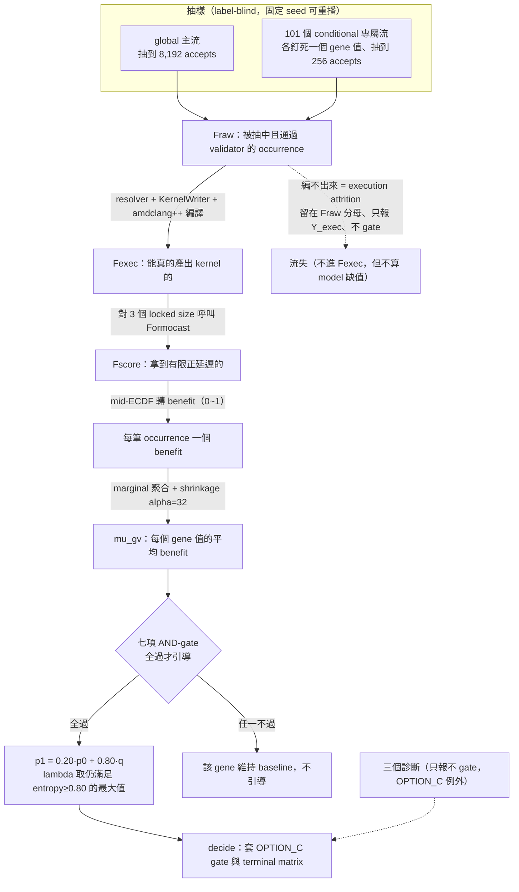

# QA-03 — S11 factorization 與 metric

> **文件角色：**這是從 [實驗白話導讀 hub](../../ductile-origami-warmstart-experiment-guide.md) 拆分出來的白話導讀主題檔，方便在單一主題上持續討論。它不是 experiment authority，也不是 contract、lock 或 report，不會取代正式的 charter、experiment plan、checkpoint design、lock 或 report。
>
> **衝突處理：**若本檔與正式文件衝突，以 [research charter](../../surrogate-dse-plan.md)、[experiment plan](../../ductile-origami-warmstart-experiment-plan.md)、[active checkpoint index](../README.md) 及各 checkpoint design 為準。
>
> **2026-08-04 current status override：**S10R3 已 terminal negative；S10R4 已 retired／not evaluated；S11 已 sealed `LOCKED_READY`。沒有 S11/S12 result、effective checkpoint lock、report 或 edge；最新狀態仍須對照 active checkpoint index、formal artifacts 與 Git history。

> **S11 current note：**本檔頂部「Current S11 mechanism」段反映 sealed `LOCKED_READY`（2026-08-04）的 CURRENT design，比下方由舊 §8 遷入的 8,192-frame 敘述新；兩者衝突時以 current 段與正式 s11 design／authority contract 為準。

---

## 前言：這份文件在回答什麼

S11 是整條研究線第一個真正「動手做 factorization」的 checkpoint。在讀機制細節前，先把它要解決的問題講清楚。

Formocast（一個 physics-based 的 GPU kernel 延遲模擬器）可以看**一整組完整的 kernel 參數**，預測它跑起來大概多快。但 Ductile 的 Gen0（初始族群）抽樣介面**不是**接收「請多抽這個完整 config」，而是接收「這個 gene（參數）的每個候選值，各自應該多常被抽到」。這兩者中間有一道落差：Formocast 給的是「整組的分數」，Ductile 要的是「每個參數各自的偏好」。

**Factorization（因子分解）就是把「整組分數」拆成「每個參數各自偏好」的那個動作。** 而 S11 的核心科學問題是：

> 把 whole-config 的 Formocast 訊號，拆成 per-gene（逐參數）的抽樣機率後，還剩多少真正有用的資訊？如果拆完就失真了，訊號是消失在哪一層？

整個 S11 全程是 **label-blind（不看真實 GPU 結果）**：選哪些 gene、給多少權重，只能用 Formocast 的預測分數，絕不能碰真實 GFLOPS。這是為了避免「用結果反推設計」的污染，把「模型有沒有用」這件事跟「真實量測」嚴格隔開（真實量測要等到後面的 S12）。

下面 §0 是目前 sealed `LOCKED_READY`（2026-08-04）的 CURRENT 機制，逐段展開講清楚；§8 是較早的歷史敘述，保留作背景，衝突以 §0 為準。

---

## 0. Current S11 mechanism（as sealed `LOCKED_READY`, 2026-08-04）

本段依 sealed S11 實作程式碼（`protocol/v1/s11/` 與 native adapter）整理，是目前的 CURRENT 機制。下方 §8 是由舊導讀遷入的較早敘述，兩者衝突時以本段與正式 [S11 design](../s11-stage1-model-only-factorization-design.md) 及 authority contract 為準。

### 0.0 一張圖看懂 S11 的資料流



### 0.1 Formocast 實際怎麼跑模擬

Formocast 不是經驗公式、也不是 ML 模型，而是 `origami` 內的 physics/analytical simulator（它是什麼、跟 Origami estimation 差在哪，見 [QA-06](qa-06-origami-formocast-ecosystem-design.md)）。它一次只做一件事：吃一組完整參數，吐一個預測延遲。每次評分：

- 輸入一個 `ProblemInfo`：矩陣 M／N／NumBatches／K、`dataType=BFloat16`、`gfx942`。這是「要算哪個 GEMM、在哪張卡上」。
- 輸入一個 `SizeMapping`：一整組 kernel 參數（macroTile、matrixInstruction、depthU、globalSplitU、grvwA/B… 約 35 個欄位）。這是「用哪一種 kernel 設定去算」。
- 呼叫 `origami::Formocast::predictedPerformance()`，取回 `microSeconds`（預測延遲，**越低越好**）。

它對 **3 個 locked size**（在 experiment plan 事先鎖定的三個 problem size）各跑一次。任何一個回傳非有限值或 ≤0 就直接報錯——**不容許用 proxy 公式頂替**，因為那會讓「模型訊號」摻進非模型的成分。實作見 [native adapter](../protocol/v1/s11/native_formocast_runtime_adapter.cpp)。

**什麼是 locked size、為什麼只有 3 個？** 一個 size 就是一個 GEMM 的 problem shape（要算多大的矩陣乘法），用 `[M, N, batch, K]` 描述。「locked」指這三個 shape 在實驗開始前就寫死、封在 experiment plan 裡、中途不能改——這是「先鎖規則、事後不能改」紀律的一部分，確保量測邊界固定可稽核。本研究鎖定的三個是：

| # | `[M, N, batch, K]` | 大致性質 |
| --- | --- | --- |
| 1 | `[8, 8, 1, 128]` | 極小 M/N、K 中等 → 小 tile／memory-bound 情境 |
| 2 | `[256, 256, 1, 1024]` | 中等方陣 |
| 3 | `[2304, 1024, 1, 214336]` | 大 M/N、K 極大 → compute-bound 大問題 |

刻意選跨度很大的小/中/大三個，是想在有限預算內涵蓋不同效能 regime。這帶來一個**重要邊界**：

- **S11 全程只在這 3 個 size 上量測**——一個 gene 值在這 3 個 size 上好，不代表在別的 shape 上也好。
- **「3 個 size」是決策的條件觀測，不是統計樣本數**：別把它當成 n=3。每個 config 對 3 個 size 各打一分，再用 `max` reducer 收成 1 個 benefit（§0.3）；真正的統計樣本數是 config 的筆數（§0.6 的 8,192／256），不是 size 數。
- **跨 shape 是否複現，是後面 Stage 3（S30/S31）的事**：它會在新的、預先註冊的 held-out cluster（不同 size regime）上重跑整套配方（見 [QA-04](qa-04-downstream-checkpoints-s12-s41-design.md)）。所以 S11 的結論只在這 3 個 size 的邊界內成立。

### 0.2 三層漏斗 Fraw → Fexec → Fscore，以及 execution attrition

一筆候選 config 從「被抽到」到「能被評分」要過三層，每層留下的集合有專屬名字。理解這三層，是理解後面所有 metric 的前提。

- **Fraw（raw occurrence）**：被 sampler 抽中、且通過 Ductile validator（`valid_fn`）的 occurrence。也就是「至少是一個合法的完整 config」。
- **Fexec（executable）**：在 Fraw 之上，還要能通過 resolver、被 KernelWriter 產出 kernel、並被 `amdclang++` 成功編譯。也就是「不只合法，還真的編得出組語」。
- **Fscore（scoreable）**：在 Fexec 之上，Formocast 對它的 3 個 size 都回傳有限正延遲，能算出 benefit。也就是「拿得到模型分數」。

**execution attrition（執行流失）** 指的是「進了 Fraw、但卡在 Fexec 這一關（resolver／codegen／編譯失敗）而掉出去」的那些 occurrence。S11 對它的處理有一個關鍵設計，必須看懂：

- 流失的 occurrence **仍留在 Fraw**（分母不縮），只是不進 Fexec。
- 流失比例記為 `Y_exec = |Fexec| / |Fraw|`，**只回報、不 gate**（不會因為流失高就判失敗）。
- 最重要的一點：execution attrition **絕不**被當成「Formocast 沒有訊號（model missingness）」。

為什麼要把這兩件事嚴格分開？因為「編不出 kernel」是**工程層的流失**，跟「模型對這個 config 給不出分數」是**兩回事**。如果把工程流失混進「模型缺值」，就會誤判成「Formocast 在這區沒用」，而其實只是編譯器那關卡掉了。這個三層分離正是從 S10R4 學到的教訓（raw／exec／score 要分層）。三層漏斗的實作見 `populations.py` 的 `build_populations`。

### 0.3 Fscore 分數怎麼來：mid-ECDF benefit transform

拿到 Formocast 延遲後，**不能直接用原始延遲去平均**。原因是三個 size 的延遲量級差很多（大矩陣天生跑很久、延遲數字大；小矩陣延遲數字小）。直接平均會被大數字淹沒，等於只看大 size。

解法是把「絕對延遲」換成「相對排名」，這個轉換叫 **mid-ECDF**（mid-rank empirical CDF）。對某一個 size，做法是：

1. 把這筆 occurrence 的延遲，和整個族群在同一個 size 的所有延遲一起排名。
2. 算它的 percentile：`percentile = (mid-rank − 0.5) / N`，其中 N 是族群筆數。「mid-rank」是遇到平手時取中點名次，避免相同延遲互相偏袒。
3. `size_benefit = 1 − percentile`。延遲越低（排名越前）→ percentile 越小 → benefit 越高（越接近 1）。

**Worked example**：某 occurrence 在 size A 的延遲，贏過族群裡 90% 的其他 config → percentile ≈ 0.10 → `size_benefit ≈ 0.90`。也就是「benefit 是它贏過族群多少比例」，是一個 0~1 的相對排名，**不是「快幾 %」的絕對量**。

一筆 occurrence 有 3 個 size，所以會有 3 個 `size_benefit`。最後用一個 pinned（寫死不可改）的 **`max` reducer** 取其中最大值，得到這筆 occurrence 唯一的 `benefit`（0~1，越高越好）。用 `max` 而非平均，代表「只要在任一 size 上很強，就算它強」——這跟多目標 GA「保專精者」的精神一致。實作見 `statistics.py` 的 `midrank_latency_benefits`（它會強制 reducer 必須是 `max`、size 必須是 3）。

conditional 的 occurrence 拿去和**同一個 terminal global ECDF** 比，確保所有 benefit 都在同一把尺上（§0.6 再談 global 與 conditional）。

### 0.4 factorization 到底怎麼做：marginal 聚合（不是「固定其他參數」）

這是全 S11 最容易誤會、也最需要看懂的一段。

要評「gene `g` = 值 `v`」到底好不好，**不是**把其他參數固定住、只變這一個。而是**marginal（邊際）聚合**：把**所有「g 剛好等於 v」的完整 config**都撈出來（這些 config 的其他參數是**隨機變動**的），取它們 benefit 的平均。白話說，就是「在其他參數隨機的情況下，g=v 這一堆 config 平均表現多好」。

實際用的不是純平均，而是帶 **shrinkage（收縮）** 的平均：

```text
mu_gv = (sum_b_gv + 32 * global_mean_g) / (n_gv + 32)
```

- `sum_b_gv`：所有 g=v 的 occurrence 的 benefit 總和。
- `n_gv`：這些 occurrence 的筆數（樣本數）。
- `global_mean_g`：整個族群的平均 benefit（全域基準）。
- `alpha = 32`（寫死、不可改）：收縮強度。

**shrinkage 在做什麼？** 它相當於「先塞 32 筆分數等於全域平均的假樣本，再算平均」。當某個值的真實樣本 `n_gv` 很少時（例如只有 5 筆），這 32 筆假樣本會把 `mu_gv` 強力拉回全域平均，避免「小樣本剛好抽到幾個高分就得到極端權重」。當 `n_gv` 很大時（例如 500 筆），這 32 筆影響就被稀釋，`mu_gv` 貼近真實平均。

**Worked example**：某罕見值只有 4 筆、benefit 都碰巧是 0.9，全域平均是 0.5。純平均會給 0.9（危險，過度樂觀）；shrinkage 後 `mu = (4×0.9 + 32×0.5)/(4+32) = (3.6+16)/36 ≈ 0.54`，被拉回接近全域平均。若同一個值有 400 筆、平均 0.9，則 `mu = (360+16)/432 ≈ 0.87`，幾乎保留真實高分。

**但 marginal 聚合有一個先天的 bias 來源，必須誠實記住：confounding（混淆）。** 因為聚合時其他參數是隨機的，如果值 `v` 在資料裡常常和「其他好參數」一起出現，那些好參數的功勞會被算到 `v` 頭上，讓 `mu_gv` 虛高。這不是實作 bug，而是 marginal 這個方法本身的性質——也正是 §0.7 那三個診斷存在的理由。實作見 `statistics.py` 的 `shrinkage_mean` 與 `gene_marginals`。

### 0.4a 同個 `v` 的 config 分數都不同，要怎麼比？離散太大怎麼辦？

這是讀完 §0.4 最常冒出的疑惑：既然 `g = v` 出現在很多不同 config 裡、每個 config 因為**其他參數不同**而得到不同 benefit，那「`v` 的 benefit」到底怎麼定義、又怎麼跟別的值比？如果同一個 `v` 底下的分數散得亂七八糟怎麼辦？

**先修正一個方向**：你不會去比「`v` 底下第 3 個 config vs 第 5 個 config」。**`mu_gv` 本身就是「`v` 的 benefit」的定義**——它是「所有 `g = v` 的 occurrence 的 benefit，取（帶 shrinkage 的）平均」。之所以能這樣平均，正是因為聚合時其他參數隨機變動（§0.4），「別的參數帶來的高高低低」在平均時互相抵銷，剩下的才是「`v` 這個選擇本身平均帶來多少好處」。所以「比較同個 gene 的不同值」＝比較 `mu_{g,v1}` vs `mu_{g,v2}` vs …，而這些值之間的差距有個名字：`S_g = max_v(mu_gv) − min_v(mu_gv)`（gene 內最好值與最差值的差）。**`S_g` 才是被拿去判斷「這個 gene 值不值得引導」的量。**

要把問題講清楚，得先分開兩個東西：

- **訊號（signal）**：值與值之間平均的差距，就是 `S_g`。
- **雜訊（noise）**：同一個 `v` 底下、config 彼此的離散程度（within-value dispersion）——也就是你擔心的那個「散得亂」。

`mu_gv` 這個平均值的**可信度**取決於「雜訊」與「樣本數」的比值（標準誤大致隨 `√(離散 / n_gv)` 縮小）。離散越大、樣本越少，`mu_gv` 就越不可信。

**關鍵洞見：這套方法不會去「修掉」離散，而是去「偵測」離散，一旦離散大到蓋過訊號，就直接判這個 gene 不能引導、退回 baseline。** §0.7 那七項 AND-gate 整套，本質上就是一個「訊號 vs 雜訊」的過濾器。用一個小數字例子（gene = DepthU，值 v1=32、v2=64，各抽到 5 筆）對照兩種情況：

低離散（有乾淨訊號）：

```text
v1=32 的 benefit：[0.40, 0.60, 0.50, 0.55, 0.45]  → mean 0.50
v2=64 的 benefit：[0.60, 0.90, 0.70, 0.80, 0.75]  → mean 0.75
```

每個 config 分數都不同（因為別的參數在變），但兩個值的平均是 0.50 與 0.75，`S_g = 0.25`，差距明顯。

高離散（訊號被雜訊淹沒）：

```text
v1=32 的 benefit：[0.10, 0.90, 0.50, 0.20, 0.80]  → mean 0.50
v2=64 的 benefit：[0.20, 0.95, 0.40, 0.15, 0.90]  → mean 0.52
```

兩個平均只差 `S_g = 0.02`，但每個 cell 內部從 0.1 抖到 0.95。這種情況會被逐道 gate 攔下來：

- `S_g ≥ 0.05`：0.02 直接過不了訊號下限。
- **permutation test**：把 benefit 的 label 隨機打亂，看「純靠離散 + 隨機能不能碰巧做出一樣大的 `S_g`」。離散這麼大時，隨手一亂就能造出比 0.02 大的差距 → 觀測值打不贏隨機的 P95 → 判無真訊號。**這就是「離散太大怎麼辦」的直接機制。**
- **bootstrap stability**：重抽重算時 `mu_gv` 抖動大 → 信賴區間半寬超過 0.025；或 best/worst 一直對調 → recurrence 過不了 0.90。

所以答案是：離散大到蓋過訊號時，系統**寧可不引導**（退回 baseline uniform），也不願用一個被雜訊淹沒的假訊號去誤導 GA。

最後要老實說一個界線：上面對付的是**隨機離散**（靠樣本數與檢定壓得住）。但有一種離散是**結構性的**、大樣本也壓不掉——例如 `v` 剛好常跟「其他好參數」共現（confounding），或「`v` 好不好」其實取決於別的參數（interaction）。這類離散不是雜訊而是偏差，正是 §0.9 三個診斷（arm-sensitivity、additivity/reconstruction）的守備範圍。

### 0.4b benefit 分數到底評估了什麼？（以及它「單獨」能推出什麼）

這一小節澄清兩個很常見、且方向相反的誤解。

**誤解一：benefit 是不是「這個值被採用／出現的比例」？不是。** 「這個值在多少 config 裡出現」是 **`n_gv`（頻率／出現次數）**，它只被拿去當 support gate 與 shrinkage 的分母（§0.6a）。**benefit 完全不是頻率**——回顧 §0.3，benefit 是「這個 config 的 Formocast **延遲**在族群裡的 mid-ECDF **排名**」（贏過多少比例的 config），`mu_gv` 則是「`g=v` 那些 config 的**平均排名 benefit**」。兩者獨立：一個值可能很常出現（`n_gv` 大）但平均很慢（`mu_gv` 低），反之亦然。

- **`n_gv`** = `g=v` 出現幾次（頻率）。
- **`mu_gv`** = `g=v` 時，平均而言 config 跑得多快（相對排名）。

**誤解二（其實是正確直覺）：kernel 效能不是常常「特定 gene 配特定參數才好」嗎？這個逐 gene 分數抓得到嗎？抓不到——而且這是本方法刻意的侷限。** GEMM kernel 的效能確實常由**參數搭配（交互作用）**主導（例如某個 `DepthU` 只有配某些 MacroTile 才好，§3.4 的複合 gene 就是為此存在）。而 `mu_gv` 是「把其他參數**平均掉**」的邊際量，它**刻意丟棄**了「`v` 配誰才好」的交互作用資訊。更甚者，§0.4a 的 confounding 會讓分數被搭配「污染」：`v` 若常跟好隊友共現，隊友的功勞會被算到 `v` 頭上。所以「這分數會不會被『它平常跟誰一起出現』影響」——**你的直覺完全對**，機制就是 confounding。

這不是被忽略的 bug，而是**明知故犯、且有專門診斷去量**：§0.9 的 **additivity/reconstruction** 診斷就是在測「把各 gene 邊際加回去，能不能還原 Formocast 對整組 config 的排名」；還原度低 → 訊號主要在交互作用裡 → factorization 不適用，S11 會誠實報出來。

**那從這個分數「單獨」能得到什麼結論？** 一個**很窄但明確**的東西：

> 一個 first-order、main-effect、Formocast 預測下、把隊友平均掉後的「單一 gene 值偏好」——平均而言，把某個 gene 往 `v` 偏一點，會不會讓 Gen0 的起始品質變好。

它的用途就只是**暖啟動一個 gene 的初始抽樣機率**（§0.8 的 `p1`）。**不能**從它得到：「`v` 在真實 GPU 上比較快」（要 S12）、「`v` 配某某參數才好」（交互作用被平均掉）、「是 `v` **造成**了 benefit」（confounding，相關 ≠ 因果）、「最好的整組 config 長怎樣」（那是 whole-config 問題）。

**為什麼還要做這個看似很弱的東西？** 因為 Ductile 的 Gen0 hook **只吃 per-gene 機率**（見 §0.11、[QA-06](qa-06-origami-formocast-ecosystem-design.md)），研究問題本來就被限定成「whole-config 訊號 factorize 到 per-gene 後**還剩多少**」。交互作用那部分**不是靠 S11 抓**，而是**留給 GA 本身**——crossover 去重組好搭配、benchmark 去淘汰壞的，在 Gen0 之後重新發現。S11 只負責給一個「有根據的起跑點」，並用 diagnostics 誠實量出 factorization 丟了多少。

### 0.5 residual gene、conditional value、global：三個抽樣角色

- **residual gene（殘差 gene）**：扣掉既有 grouped/weighted guidance（例如已被 GEKO 加權的 `group_0`）之後，那些 ungrouped、目前 unweighted（走 uniform）、且候選值 >1 的自由參數，才是 S11 有資格引導的對象。registry 確認共 **27** 個 eligible residual gene。
- **candidate / conditional value**：一個 gene 的一個取值。針對「某 gene 的某個值」會開一條**專屬抽樣流**，把該 gene 釘死在那個值、其他參數照 baseline 隨機抽，確保這個值一定拿得到足夠樣本。registry 確認共 **101** 個 conditional stream。
- **global（主流）**：所有 gene 都按 baseline 機率隨機抽的主抽樣流，提供整體 ECDF 基準與自然分布下的樣本。

### 0.6 抽樣數量怎麼定、為什麼要分 global／conditional

- **global**：抽到 **8,192 個 accepts**（硬上限 65,536 chunks × 每 chunk 512 draws = 33,554,432 draws；抽不滿就是 inconclusive，不准 reseed 或延長）。
- **每個 conditional value**：抽到 **256 個 accepts**（約 262,144 draws）；至少要 **128** 才算 support 足夠。
- 這些數字都是**先驗鎖定（pre-registered）**的，不是看了結果才調——避免「看到數字才改門檻」這種事後合理化。

**為什麼要分 global 與 conditional？** 因為 global 主流自然會偏向「常被抽到的值」，罕見值在 global 裡樣本太少、估不準。conditional 專屬流就是去補這個洞：把罕見值釘死、專門為它抽夠 256 筆，讓每個候選值都有公平的樣本量。

抽樣本身用**固定 seed 的 PCG64** 加 baseline 機率 `p0`（`rng.choice(..., p=baseline_probabilities)`），所以是**決定性、可重播**的——同一個 seed 一定抽出同一批。真正的 bias 風險不在抽樣端（那是決定性的），而在**估計端**（§0.4 講的 marginal confounding、以及倖存者偏差），由 §0.7 的診斷偵測。另外有 **label firewall** 保證整個抽樣與評分過程完全不看真實 GFLOPS。實作見 `sampling.py`。

**一個常見誤會：這不是在「跑 GA」。** S11 借用的是 Ductile 的**抽樣器與合法性檢查**（`rng.choice` + `valid_fn`），但**沒有跑真正的 GA 演化**——沒有世代（generation）、沒有 crossover／mutation／selection／survival。它概念上像「只做 Gen0 的初始抽樣」，而且目的是**收集 label-blind 的分析樣本**，不是演化出好解。真正的 GA 演化要到 S13 之後（把 §0.8 的 `p1` 拿去初始化 Gen0、再跑 GA）才發生。

### 0.6a global 與 conditional 的分數怎麼合併：是 pool，不是加權平均

一個很自然的疑問：global 抽的分數和 conditional 抽的分數，是用什麼「權重」混起來算 `mu_gv` 的？**答案是：沒有權重，兩者直接 pool 成一個 multiset，每個 occurrence 算一票。** 從 `populations.py` 的 `value_cell` 看，對某個值 `v`：

```text
Dscore = Gscore + Cscore          # global 裡 g=v 的 + conditional 裡 g=v 的，直接串接
n_gv   = |Dscore|
sum_b  = Σ benefit over Dscore
mu_gv  = (sum_b + 32·global_mean_g) / (n_gv + 32)   # 見 §0.4
```

所以「global vs conditional 的占比」不是一個要另外調的權重，而**就是** `|Gscore_gv| : |Cscore_gv|` 的比例，逐值不同：

- **罕見值**：global 幾乎抽不到（`|Gscore_gv|` ≈ 0），它的 `mu_gv` 幾乎全由 conditional 的 ~256 筆決定。
- **常見值**：global 本來就抽到很多，再加 conditional 的 256，兩邊都有貢獻、甚至 global 占多數。

有兩個**故意不對稱**的設計要記住：

- **`support_gv` 只數 conditional**（`len(craw)`）：§0.7 那個「≥128」的 gate 是在檢查「conditional 有沒有抽夠」，跟 global 貢獻多少無關。
- **shrinkage 的 `global_mean_g` 只用 global、結構上排除 conditional**：因為 conditional 為了補罕見值而**人為過度抽樣**，若讓它進全域平均會污染基準線。所以基準只信自然分布（global），conditional 只用來補「某個值自己的 cell」。

換句話說，唯一的「加權」其實是 shrinkage 那 32 筆假樣本（權重 `32/(n_gv+32)`），不是 global 與 conditional 之間的調配。

### 0.7 一個 gene 要能引導，必須通過七項 AND-gate

先講清楚門檻的邏輯：這是 **AND-gate**——七項**每一項都要過**，該 gene 才能引導，**不是**加權平均、也不是「大部分過就算」。任一項不過，該 gene 就維持 baseline、不引導。這樣設計是為了「寧可不引導，也不要用一個不穩的訊號去誤導 GA」。

| Metric | 白話意義 | 擋掉哪種假訊號 | 門檻 |
| --- | --- | --- | --- |
| `support_gv` | 該值 conditional 樣本數 | 樣本太少、估計不可信 | ≥128 |
| `Cscore_occ_gv` | 該值可評分覆蓋率（能拿到分數的比例） | 大量流失導致的殘缺估計 | ≥0.95 |
| `S_g`（sensitivity） | gene 內 best 值與 worst 值的 `mu` 差距 | 這個 gene 根本沒差別（引導它沒意義） | ≥0.05 |
| permutation test | 隨機重排 label 後 `S_g` 是否仍這麼大（own-null + familywise max-null，各 2000 次） | 差距只是隨機雜訊碰出來的 | 觀測值 strict > 隨機的 P95 |
| bootstrap stability | best/worst 值的排名穩不穩 | 換一批樣本就翻盤的脆弱結論 | CI 半寬 ≤0.025 **且** recurrence ≥0.90 |
| size direction | 3 個 size 的方向是否一致 | 只在某個 size 好、換 size 就反向 | ≥2/3 一致 |
| entropy floor | 引導後分布會不會塌成獨尊一值 | 過度集中、失去探索 | normalized entropy ≥0.80 |

其中 permutation test 值得多解釋一句：它把 benefit 的 label 隨機打亂 2000 次，看「打亂後還能不能碰巧產生一樣大的 `S_g`」。`own-null` 是跟自己這個 gene 的打亂比；`familywise max-null` 是跟「所有受測 gene 打亂後的最大值」比（更嚴格，控制多重比較）。只有觀測值嚴格大於這些隨機分布的 P95，才算真的有訊號。實作見 `workflow.py`。

### 0.8 全過之後：機率怎麼組出來

一個 gene 七項全過後，才把它的 `mu_gv` 轉成實際的抽樣機率：

- 對 trusted values 算 `q = softmax(lambda × mu_gv)`——mu 越高的值，機率越大。**softmax 只作用在 trusted values**；untrusted 的值只拿得到底線的 `0.20·p0`。
- 最終機率是 `p1 = 0.20·p0 + 0.80·q`，可以理解成 **20% 均勻探索 + 80% Formocast 偏好**。保留 20% 均勻，是為了不讓 GA 完全被先驗綁死、仍保有探索空間。
- `lambda`（在 {0, 0.25, 0.5, …, 8} 這 33 個值裡選）取「**所有 guided gene 都仍滿足 entropy≥0.80 的最大值**」。lambda 越大，機率越集中到高 mu 的值；取「仍滿足 entropy 下限的最大 lambda」等於「在不過度集中的前提下，盡量貼近 Formocast 的偏好」。所有 guided gene 共用同一個 lambda。

實作見 `guidance.py`。

### 0.9 三個診斷與 OPTION_C shrinkage gate

因為 §0.4 講的 marginal 有先天 bias，S11 附三個診斷去偵測它。三個診斷都是 **label-blind、且原則上「只報告、不 gate」**（唯一例外是 OPTION_C，見下）：

- **shrinkage alpha=0 敏感度**：`mu_gv` 裡的 `32·global_mean` 收縮項，在樣本少時會把估計拉向全域平均。這個診斷再算一次**不收縮**的版本（`Σbenefit / n`），看該 gene 的 guided／best-worst／lambda 決策**會不會翻轉**。若會翻轉，代表這個決策是被 shrinkage「撐」出來的、本身不穩。
- **additivity / reconstruction（效度）**：交叉驗證「把各 gene 的邊際加回去，能不能還原 Formocast 對整組 config 的排名」。若還原度低，代表訊號主要藏在**參數的交互作用**裡，拆成邊際會失真——這正好是 factorization 最大的風險。
- **arm-sensitivity / survivorship / per-size margin**：分別偵測 confounding（換一種抽樣分布後，best/worst 會不會變）、倖存者偏差（用 `Y_exec_gv` 看是不是「編得出來的那些剛好比較好」造成的假象）、以及提醒「延遲差是 Formocast 模型量出來的、不是真實實測」。

**OPTION_C shrinkage gate** 是唯一會動到科學判定的診斷。「alpha=0 敏感度」原本只報告，但「要不要升成關卡」有爭議，於是用 **decision-loss simulation** 裁決：用**已知正確答案**的合成資料，比較 alpha=32 與 alpha=0 誰的決策錯得少。faithful 實作（走真實 selection path、用 estimator-independent 的真值）在預設 panel 得出 **OPTION_C** 這個結論：

> 若一個 gene 的決策在去掉 shrinkage 後會翻轉，就**不准**它供正向 edge；若**全部** guided gene 都翻轉，整個 S11 判 `FT-INCONCLUSIVE`。

這是三個診斷裡唯一會改變 terminal 判定矩陣的地方。

### 0.10 七個正式階段

S11 的執行拆成七個正式階段，嚴格單向：**每階段只讀前一階段封好的產物、只寫自己那份，都要先過 `admit_formal_command` 授權**。這保證階段之間不會互相污染、且可稽核。

| 階段 | 讀什麼、做什麼 | 交接產物 |
| --- | --- | --- |
| global-discovery | 跑主抽樣到 8,192 accepts，建 global ECDF 的原料 | `s11-global-prefix.json` |
| conditional-discovery | 101 個 stream 各自釘死一個值、抽到 256 accepts | `s11-conditional-prefixes.json` |
| qualify | 讀抽樣結果，過 resolver + KernelWriter + `amdclang++` 編譯，定出 `Fexec`（此處產生 execution attrition） | `s11-qualifications.json` |
| score | 對 executable 身分的 3 個 size 呼叫 native Formocast，定出 `Fscore` | `s11-native-scores.json` |
| analyze | 算 benefit／`mu_gv`、跑全部七項 model test、算三個診斷、建 `p1`、套 OPTION_C gate | `s11-analysis.json` + `s11-guidance.json` |
| decide | 套 first-match terminal matrix：positive `S1_GUIDANCE_LOCKED` ／ `FT-INCONCLUSIVE` ／ no-guidance | `s11-decision.json` |
| reproduce | 用兩個 fixed half 各自獨立重建，檢查 categorical decision projection 是否一致 | `s11-reproduction.json` |

### 0.11 baseline 與 Formocast 的分工：取樣 vs 評分

讀到這裡有一個容易混淆的點必須釐清：**S11 內部到底是「用 baseline 抽樣」還是「用 Formocast 抽樣」？** 答案是——抽樣用 baseline，Formocast 只負責打分；兩者是正交的兩個角色，只在「算 benefit」那一步交會。把 S11 想成一個設計過的觀察實驗就清楚了：

| | 角色 | 在資料流的位置 | 類比 |
| --- | --- | --- | --- |
| **baseline `p0` 抽樣** | 決定**看哪些** config（sampling design） | 最前端的抽樣（`Fraw` 之前） | 問卷的抽樣框：決定去問哪些人 |
| **Formocast** | 決定**看到的 config 有多好**（scorer） | 中段的評分（`Fexec → Fscore`） | 對每個受訪者打的那個分數 |

對照 §0.0 的漏斗圖：baseline 只出現在最前面的 `rng.choice(..., p=baseline_probabilities)`（固定 seed），Formocast 在這步完全沒參與；Formocast 只出現在中段對 executable config 的評分，它不決定誰被抽到。`mu_gv` 就是把「baseline 抽到的一堆 config」與「Formocast 給的分數」聚合起來的結果——一個是取樣、一個是量測。

**為什麼抽樣用 baseline，而不是用 Formocast 去引導？** 三個理由：

- **保住「其他參數隨機」的邊際前提**：`mu_gv` 的定義（§0.4）是「`g = v` 時、其他參數**隨機**下的平均 benefit」。這個隨機必須是 baseline 的自然隨機。若改用 Formocast 引導抽樣，「其他參數」就會偏向 Formocast 喜歡的搭配，`mu_gv` 量到的變成「`v` 配上模型偏好的隊友時有多好」，邊際估計被引導本身 confound 掉。
- **避免用模型證明模型自己（circularity）**：S11 的目的是**檢驗** Formocast 訊號經 factorization 後還剩多少，不是**使用**它。先用 Formocast 挑要看哪些 config、再用 Formocast 打分，等於只觀察它本來就看好的區域，無法公正評估。
- **確保罕見值也有樣本**：若讓 Formocast 引導，它不喜歡的值會被嚴重 under-sample、連 `mu` 都估不出來。S11 反其道而行——用 baseline 跑 global，再開 101 條 conditional stream 把每個值各釘死、強制抽夠（§0.6），確保每個候選值都有公平樣本量。

**那 `p1 = 0.20·p0 + 0.80·q` 呢？那不是用 `mu_gv` 去抽嗎？** 這裡要分清楚：**`p1` 是 S11 的「輸出」，不是 S11 內部的抽樣機率。** S11 自己從頭到尾都用 baseline 抽、Formocast 評；`p1`（把 `mu_gv` 經 softmax 成 `q`、再跟 `p0` 混）是 factorization 算完後**交棒出去的產物**，它要生效是在**未來的 Gen0**（S13「actual Gen0 sampler mechanism」真的拿去初始化 GA 族群），而不是在 S11 內部。所以因果順序是「baseline 抽 → Formocast 評 → 估出 `mu_gv` → 打包成 `p1`（輸出）」，`mu_gv`／`p1` 是**結果**、baseline 是**輸入**，兩者不會在 S11 內部形成回路。

最後補一個界線：Formocast 在 S11 是合法使用的 scorer，但它給的仍只是「模型認為的好壞」，不是真相。S11 全程 label-blind 指的是**真實 GFLOPS** 被完全擋在外面（那要等 S12）。就算 `mu_gv` 乾淨、七項 gate 全過，也只證明「Formocast 的邊際訊號在模型空間裡穩」；它對真實 GPU 到底有沒有用，要 S12 用 real GFLOPS 才算數（Formocast 為何只是預測、與 estimation 的差別見 [QA-06](qa-06-origami-formocast-ecosystem-design.md)）。

---

## 8. S11：Factorization 與 guidance lock

> **HISTORICAL note：**以下 §8 是舊導讀敘述，保留作背景；current 機制以上方 §0 為準。

S11 是真正執行 factorization 的 checkpoint。

### 8.1 Global valid-occurrence frame

- 固定canonical first 8,192 accepted occurrences作inferential frame；
- duplicate occurrences 保留；
- first4,096與固定兩個4,096 halves只read-only，不能停止或emit outcome；
- atomic chunk固定512 nominal slots；cap是65,536 chunks／33,554,432 draws；
- dedup 只用來減少 mapping/Formocast 重算，analysis 時恢復 multiplicity。

Planning只使用historical`114 / 262,144` acceptance rate：

```text
p_plan = 114 / 262,144 = 57 / 131,072 ~= 0.00043487548828125
draws_for_8192 = 8,192 / p_plan = 1,073,741,824 / 57 ~= 18,837,575.85964912
chunks_for_8192 = draws_for_8192 / 512 = 2,097,152 / 57 ~= 36,792.14035087719
margin_chunks = 1.5 * chunks_for_8192 = 1,048,576 / 19 ~= 55,188.21052631579
global_cap_chunks = next_power_of_two(margin_chunks) = 65,536
global_cap_draws = 65,536 * 512 = 33,554,432
```

Cap時少於8,192 accepts是inconclusive，不能reseed或extension。Historical rows只作planning，
不進S11 evidence。

### 8.2 Conditional top-up

對每個 eligible `(gene, value)`：

- 固定該 value；
- 其他 keys 按 nominal probabilities 抽；
- 通過同一 valid_fn；
- 固定512 chunks／262,144 nominal draws；
- target canonical first256 accepted；
- 128只read-only；cap-terminal 128–255 prefix只測一次；
- 少於128是support-insufficient；不能pool global rows、reseed或extension。

Global與conditional exact cell是：

```text
Graw_gv   = {o in Fraw_global   : X_g(o)=v}
Gexec_gv  = {o in Fexec_global  : X_g(o)=v}
Gscore_gv = {o in Fscore_global : X_g(o)=v}
Draw_gv   = Graw_gv   multiset-union Fraw_cond(g,v)
Dexec_gv  = Gexec_gv  multiset-union Fexec_cond(g,v)
Dscore_gv = Gscore_gv multiset-union Fscore_cond(g,v)

support_gv = |Fraw_cond(g,v)|
Cscore_occ_gv = |Dscore_gv| / |Dexec_gv|
n_gv = |Dscore_gv|
sum_b_gv = sum_{o in Dscore_gv} benefit(o)
global_mean_g = [sum_{o in Fscore_global} benefit(o)] / |Fscore_global|
```

Global rows不給conditional support credit；conditional rows不進global yield、coverage、ECDF、
`Uexec`或future D5。

### 8.3 Model benefit

對terminal global `Fscore`每個locked size，以occurrence-weighted latency mid-ECDF轉成
benefit。Lower latency較好：

```text
r_s(o) = [W_<(L_s(o)) + 0.5 * W_=(L_s(o))] / W
b_s(o) = 1 - r_s(o)
benefit(o) = sealed_actual_size_reducer({b_s(o) for every locked size s})
```

Conditional rowsquery同一global ECDF；all sizes of one occurrence是一個analysis block。

### 8.4 Shrinkage conditional mean

概念公式：

```text
mu_gv = (sum_b_gv + 32 * global_mean_g) / (n_gv + 32)
S_g = max_{v in T_g}(mu_gv) - min_{v in T_g}(mu_gv)
```

Shrinkage 避免小樣本 value 因偶然高分得到極端權重。

### 8.5 Gene eligibility

一個 gene 要接受 guidance，需同時滿足：

- 每 value support ≥128；
- model coverage ≥95%；
- sensitivity `S_g ≥ 0.05`；
- 2,000 次permutations；每replicate有一份shared-global occurrence permutation，conditional
  部分則每gene pool恰有一份independently domain-separated permutation，再依該gene各value
  的fixed observed cell counts分配；observed `S_g` strict勝own-null與familywise max-null
  Type-7 P95；ties fail；禁止per-conditional-cell permutation；
- 2,000 次 bootstrap 半寬 ≤0.025；
- best/worst pair 重現率 ≥90%；
- 至少 2/3 sizes 方向一致。

Family statistic是`M_r=max_{g in Gtest}S_gr*`；2,000 replicates的Type-7 P95是
`0.95*x_(1900)+0.05*x_(1901)`。兩個固定halves各自重建global reference並exact比較完整
semantic tuple：每value的`Dexec_gv/Dscore_gv/n_gv/Cscore_occ_gv/mu_gv`、trust與guided
states／reasons、`T_g`、actual-YAML-order best／worst tie-break及best／worst、per-size
directions、每一項model-test result、own/familywise pass、同一positive global lambda、每gene
guidance probabilities、shuffle mapping及canonical guidance hash。它們不是independent
replication。

### 8.6 Probability construction

```text
epsilon = 0.20
alpha = 32
```

最終 probability 可理解成：

```text
20% uniform exploration
+ 80% Formocast preference
```

所有 guided genes 共用 global lambda，且 normalized entropy 必須 ≥0.80。

### 8.7 轉回 Ductile weights

研究先產生想要的 probability：

```text
p_g(v)
```

再轉成 Ductile 可接受的 cost weight：

```text
w_g(v) = -log(p_g(v)) / weight_beta
```

經 Ductile 自己的 weight→probability conversion 後，必須 round-trip 回原本的 probability。
