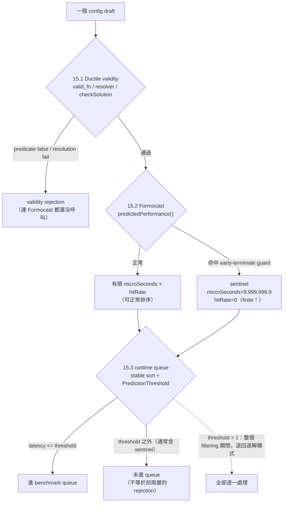

# QA-05 — Controls 與 Formocast rejection layers

> **文件角色：**這是從 [實驗白話導讀 hub](../../ductile-origami-warmstart-experiment-guide.md) 拆分出來的白話導讀主題檔，方便在單一主題上持續討論。它不是 experiment authority，也不是 contract、lock 或 report，不會取代正式的 charter、experiment plan、checkpoint design、lock 或 report。
>
> **衝突處理：**若本檔與正式文件衝突，以 [research charter](../../surrogate-dse-plan.md)、[experiment plan](../../ductile-origami-warmstart-experiment-plan.md)、[active checkpoint index](../README.md) 及各 checkpoint design 為準。
>
> **2026-08-04 current status override：**S10R3 已 terminal negative；S10R4 已 retired／not evaluated；S11 已 sealed `LOCKED_READY`。沒有 S11/S12 result、effective checkpoint lock、report 或 edge；最新狀態仍須對照 active checkpoint index、formal artifacts 與 Git history。

---

## 前言：這份文件在回答什麼

這份檔講兩件容易搞混、但一定要分清楚的事：

1. **實驗的四個 arm（U／G／F／S）與其中的 shuffle 對照組**：為什麼光看「F 勝過 G」還不夠、非得再加一個 same-entropy shuffle 對照才能下結論。
2. **三種完全不同的「rejection（被剔除）」**：一個候選 config 在管線裡可能在三個不同層被剔除，這三種的意義天差地遠，混為一談會導致完全錯誤的結論。

先把四個 arm 講清楚，後面才好談對照。研究比較四種 Gen0 初始化方式：

- **U（uniform）**：完全均勻抽樣，不用任何 guidance。
- **G（existing guidance）**：只用 YAML／GEKO 既有的 group weights（例如已被加權的 `group_0`），是現況 baseline。
- **F（Formocast guidance）**：在 G 之上，再加 Formocast factorization 算出的 residual-gene guidance（本研究的 treatment）。
- **S（shuffled control）**：在 G 之上，加一個「機率分布形狀跟 F 完全一樣、但把標籤打亂」的 residual guidance。

`F` 是想證明有用的東西，`S` 是用來抓假象的對照組——這正是 §9 的主題。

---

## 9. Same-entropy shuffled control

### 9.1 為什麼需要這個對照組

假設實驗跑完，發現 `F`（Formocast guidance）確實勝過 `G`（既有 baseline）。這能不能直接說「Formocast 有用」？**不能。** 因為 `F` 相對 `G` 改變了兩件事，而不是一件：

1. 它讓抽樣分布**變得更集中**（不再均勻鋪開，而是偏向某些值）。
2. 它宣稱把高機率**放到了「正確」的值**上（Formocast 認為好的值）。

問題是，光是「分布變集中」這件事本身，就可能讓 `F` 看起來比 `G` 好——原因跟「Formocast 猜得準不準」完全無關：

- search space 變集中，反覆抽到少數幾個 config；
- diversity（多樣性）改變；
- duplicates（重複）比例改變。

換句話說，`F` 勝 `G` 可能只是「集中效應（concentration/entropy effect）」的副產品，而不是「Formocast 真的把高機率放對地方」。要把這兩個效應拆開，就需要一個「同樣集中、但沒放對地方」的對照組——這就是 `S`。

### 9.2 shuffle 對照組怎麼構造

核心手法：**保留 `F` 完全相同的機率 multiset，只是把這些機率重新貼到不同的值上。** 用一個例子看最清楚。假設某個 gene 在 `F` 下的機率是：

```text
Values: A    B    C    D
F:      55%  25%  15%  5%
```

`S` 拿**同一組數字** `{55%, 25%, 15%, 5%}`，但用一個「預先鎖定、且保證不是原順序」的 permutation 重新分派：

```text
Values: A    B    C    D
S:      15%  55%  5%   25%
```

因為用的是同一組數字，`F` 和 `S` 的下列性質**完全相同**：

- entropy（亂度）；
- concentration（集中度）；
- epsilon floor（那 20% 均勻底線）；
- cardinality（候選數）；
- guided gene 的數量；
- existing group weights（既有 group 權重）。

唯一的差別只有一個：

- `F`：高機率放在 **Formocast 認為好**的值上。
- `S`：同樣的高機率，被一個 deterministic non-identity permutation（決定性、保證非原序的重排）**打亂**到別的值上。

**一個關鍵紀律：shuffle 必須在看到 real GFLOPS 之前就鎖定**（label firewall）。否則就能事後挑一個「剛好特別差」的 shuffle 來墊高 `F`，那是作弊。鎖定在前，才保證 `S` 是公正的對照。

### 9.3 怎麼解讀 F、S、G 三者的比較

有了 `S`，四種結果各自代表什麼、以及**不代表**什麼：

- **F > G 且 F > S**：這才是支持「Formocast 方向正確」的證據。因為 `F` 不只贏過 baseline，還贏過「同樣集中但亂放」的對照——代表贏的來源是「放對位置」，不只是「變集中」。
- **F > G 但 F ≈ S**：很可能只是 concentration/entropy 效應。`F` 贏 baseline 的部分，`S` 也做得到，所以無法歸功於 Formocast 猜得準。
- **F ≤ S**：Formocast 沒有證明比「亂貼 label」更好——這是對 treatment 不利的訊號。
- **F、S、G 三者都接近**：可能 residual 效應本來就很小、existing guidance 已經飽和，或者 validity/dedup 把差異洗掉了。

最後補一個技術細節：**nominal entropy（名目亂度）相同，不保證 realized population entropy（實際族群亂度）完全相同**。因為抽樣後還有 validity 過濾與去重，實際落地的分布會偏移。所以除了比 `F`/`S`/`G` 的結果，還要一併回報 validity、duplicates、realized frequencies 與 diversity，才能確認對照是公平的。

---

## 15. Formocast rejection、early termination 與 runtime queue

這一節是全檔最重要、也最容易出錯的地方。一個候選 config 從「被抽出」到「進入 benchmark queue」，中間有**三個完全不同的層**會把它剔除。這三種「被剔除」意義天差地遠，**絕不能全部叫做 "Formocast rejection"**。



下面逐層說明。核心結論先講：這三種狀態必須分成三個獨立欄位記錄——`ductile_validity_status`、`formocast_model_status`、`runtime_queue_status`——不能全叫 rejection。

### 15.1 Ductile validity rejection（發生在 Formocast 之前）

這一層在**呼叫 Formocast 之前**就把 config 剔除，三種情況：

- Python `valid_fn` 回傳 false（config 本身不合法）；
- solution resolution failure（resolver 無法把 config 展開成唯一的可執行 solution）；
- C++ `checkSolution` 的 hardware／problem／task predicate 為 false（例如硬體不支援、problem 條件不符）。

關鍵：**這些 config 根本沒有 Formocast score**——Formocast 連跑都沒跑。所以它們**不能**被稱為 "Formocast rejection"。這一層對應 `SolutionIterator.cpp` 的 `checkSolution`（hardware/problem/task predicate），以及 branch `origin/ductile_integration` 的 `ductile_backend.py` `_validate_solution`。

### 15.2 Formocast early-terminate sentinel（模型主動放棄估計）

這一層是 Formocast **有被呼叫、但它自己決定不做完整模擬**。正常情況下 `predictedPerformance()` 會回傳 predicted `microSeconds`、`hitRate`，以及 tile／DepthU／GSU／loop／memory／math 等模型中間資訊。但遇到某些 guard 條件，它會**跳過完整 simulation**，直接回傳一個哨兵值（sentinel）：

```text
microSeconds = 9,999,999.9
hitRate = 0
```

從 `formocast_simulator.cpp` 的 `predictedPerformance()` 查證到的實際 guard 條件（命中任一個就回 sentinel）：

- `GlobalSplitU == 0`；
- MacroTile 相對 problem 過小（underflow）：`M < 128 && MT0 - M >= 16`，或 N 方向的對應條件；
- MacroTile 相對 problem 過大（oversize）：`M >= 128 && MT0 - M >= 32`，或 N 方向的對應條件；
- BF16／Half 的 K／DepthU／MatrixInstruction 組合不適合（例如 `K >= 64 && depthU <= 32`、`K <= 32 && depthU > 32`、`K > 32 && depthU > K` 等，再搭配 NumBatches 與 MI 條件）；
- DirectToLds 與 tile 不相容：`DirectToLdsA && M < MT0`，或 `DirectToLdsB && N < MT1`；
- derived PLR=0（`loopCnt < LocalSplitU` 導致 PrefetchLocalRead 被推成 0）。

**這裡有一個最容易踩的教學點：`9,999,999.9` 是一個有限浮點數。**

```text
isfinite(9999999.9) == true
```

它**不是** NaN、不是 Inf、也不是 exception，而是一個刻意選的哨兵值，語意是「模型沒有提供正常估計、請把它當成極差」。舊的 S10 helper 只用「是否 non-finite」來判定被拒與否，因此**會漏掉這個 finite sentinel**——把「模型放棄估計」誤當成「模型給了一個（極大的）正常延遲」。這正是為什麼新版一定要把 `formocast_model_status` 獨立成一欄。

補一句邊界：這幾個 guard **不是窮舉**。有些不理想的組合不會命中 guard、會回一個正常但偏差的預測；guard 只攔截這幾類明確不該模擬的情況。

### 15.3 Runtime PredictionThreshold exclusion（排序後沒進 queue）

這一層發生在最後：runtime 對所有通過 `checkSolution` 的 solution 做排序與篩選，決定誰進 benchmark queue。流程（`SolutionIterator.cpp` 的 `AllSolutionsIterator::preProblem`）：

1. 對每個合法 solution 呼叫 Formocast，取 predicted `microSeconds`；
2. 依 predicted latency 做 **stable sort**（穩定排序）；
3. 依 `PredictionThreshold` 取一個 percentile cutoff，latency 在 cutoff 以內的才進 queue。

兩個關鍵細節：

- **threshold > 1 會整個關掉 prediction filtering**：程式在入口就 short-circuit，退回「逐一處理每個 solution」的模式，等於不做 Formocast 篩選。
- **sentinel 通常排在最後，但「排最後」不等於「被排除」**：sentinel 的 `microSeconds=9,999,999.9` 會讓它 sort 到隊尾，但它是否被排除完全取決於 threshold。若 threshold=1.0（100%），連 sentinel 都會進 queue；若 threshold=0.0，只有最快那個進。

所以「排在隊尾」和「被 runtime 排除」是兩件事，不能畫等號。

### 15.4 為什麼一定要分三欄

把上面三層收束成一句話：**同樣是「這個 config 沒進 benchmark」，原因可能是它根本不合法（15.1）、可能是模型主動放棄估計（15.2）、也可能是它合法且有分數但被 threshold 切掉（15.3）。** 這三者對「Formocast 到底有沒有用」的推論意義完全不同。若全部混叫 rejection，就會把「工程不合法」「模型放棄」「排序落選」攪在一起，得到錯誤結論。因此必須分成三個獨立狀態欄：

- `ductile_validity_status`（15.1）；
- `formocast_model_status`（15.2）；
- `runtime_queue_status`（15.3）。

---

## 16. 為什麼 valid-support discovery 用 CPU，不用 GPU

一個常見疑問：既然有 GPU，為什麼 support discovery 這一步是用 CPU 慢慢跑？

答案是**這一步找的東西根本不適合 GPU**。discovery 找的是「符合 Ductile 規則的合法 config」，而**不是**「跑得最快的 config」。判斷一個候選合不合法，每個候選要做的是：

- Python config construction（建資料結構）；
- Ductile validation（規則檢查）；
- solution resolution（展開成 solution）；
- object／dict 操作；
- KernelWriter initialization；
- rejection taxonomy（分類為什麼被拒）；
- ledger／provenance（記錄血緣）。

這些是大量的分支判斷、可變資料結構與 host-side 邏輯——正是 CPU 擅長、GPU 不擅長的（GPU 擅長的是同質的大量數值運算）。而且多數候選連合法 solution 都建不出來，根本沒有 kernel 可以丟上 GPU benchmark。

若硬要 GPU 化，等於要把整個 Python/Ductile validator 重寫成 GPU kernel，還得證明它和 pinned CPU validator 逐位元一致——工程成本極高，又會因為 branch divergence（分支發散）而無法真正加速。比較實際的加速方向是 bounded CPU parallelism（有上限的 CPU 平行），但必須保持 deterministic 的 ledger／order／lock 語意（否則就不可重播）。

---

## 17. 「YAML 合法候選」不等於「一定有 valid config」

最後澄清一個貫穿整個 S10 系列的觀念：合法性其實有**很多層**，YAML 列出一個候選值只保證最前面兩層。

1. 數值在允許範圍內；
2. YAML 把它列為 candidate；
3. 至少存在一個完整 joint config（跟其他參數搭配後）通過 `valid_fn`；
4. 能 resolution／generate／compile；
5. GPU correctness 通過；
6. 效能好。

**YAML candidate 只直接支持第 1、2 層。** 第 3 層以後都要靠真實的 joint validation 才知道。

用 `DepthU=1024` 當例子：它是 actual YAML 裡最大的 DepthU 候選，不是隨便亂寫的數字（第 1、2 層成立）。但它能不能和其他參數組成一個合法的完整 config（第 3 層），仍需要 joint validation。舊的 conditional stream 每次都把 DepthU 釘死在 1024、其他隨機抽，結果 zero-hit——這**不是**「1024 很少被抽到」，而是「在那些 draws 裡，其他參數的搭配沒有形成 accepted joint config」。

而且最重要的紀律：**這仍然不能從 stochastic zero（隨機沒抽到）推導出 support 為零。** 沒觀察到不等於不存在；要證明「不存在」需要 finite exhaustive enumeration 或 sound constraint proof（見 [QA-08](qa-08-faq-and-historical-snapshots.md) 的 support 三態）。這正是 S10R1 當初栽的跟頭。
