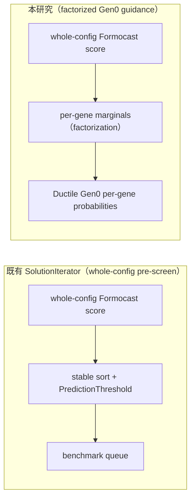

# QA-06 — Origami／Formocast ecosystem

> **文件角色：**這是從 [實驗白話導讀 hub](../../ductile-origami-warmstart-experiment-guide.md) 拆分出來的白話導讀主題檔，方便在單一主題上持續討論。它不是 experiment authority，也不是 contract、lock 或 report，不會取代正式的 charter、experiment plan、checkpoint design、lock 或 report。
>
> **衝突處理：**若本檔與正式文件衝突，以 [research charter](../../surrogate-dse-plan.md)、[experiment plan](../../ductile-origami-warmstart-experiment-plan.md)、[active checkpoint index](../README.md) 及各 checkpoint design 為準。
>
> **2026-08-04 current status override：**S10R3 已 terminal negative；S10R4 已 retired／not evaluated；S11 已 sealed `LOCKED_READY`。沒有 S11/S12 result、effective checkpoint lock、report 或 edge；最新狀態仍須對照 active checkpoint index、formal artifacts 與 Git history。

---

## 前言：這份文件在回答什麼

「Origami」「Origami estimation」「Formocast」這三個名字很容易被當成同一個東西，實際上它們是「一個框架 + 兩個預測後端」的關係。搞混它們會導致兩個常見誤解：以為「本研究沒選 Origami＝Origami 不能整合」，或以為「Formocast 一定比 estimation 準」。這份檔要把三者辨析清楚，並回答一個核心問題：**為什麼一個「固定 tile、只調 residual gene」的研究，非得選 Formocast 當 primary scorer，而把 Origami estimation 降成 reference？**

---

## 22. Origami library、Origami estimation 與 Formocast

最重要的第一步，是把「library（整個框架）」和「library 裡的 prediction backend（預測後端）」分開。

### 22.1 一張圖先看懂三者關係

```text
Origami library（shared/origami）
│
├─ 對外 API／共用基礎設施
│  ├─ problem_t
│  ├─ hardware_t
│  ├─ config_t
│  ├─ rank_configs()
│  └─ select_config()
│
├─ prediction_mode = estimation（預設）
│  └─ Origami 快速 analytical estimation model
│
└─ prediction_mode = simulation
   └─ compute_formocast_latency()
      └─ origami::Formocast::predictedPerformance()
```

用一句話定位三者：

- **Origami library** 是整個軟體套件與 API——資料結構、ranking/selection 基礎設施，底下掛著多個 prediction backend。
- **Origami estimation** 是這個 library 裡的**快速 analytical 預測模式**，也是 `config_t.prediction_mode` 的預設值。
- **`origami::Formocast`** 是**同一個 library** 的 namespace／source tree 底下、針對 TensileLite 的較細 simulation backend。

所以「本研究沒把 Origami 選成 primary model」這句話，正確的理解是：**沒有把 Origami estimation mode 選成 formal primary treatment**——而**不是**「Origami library 不能整合」。Origami library 的資料結構與 API 仍然存在，而且 Formocast 本身就住在 `origami` namespace 裡。這個區分後面 §22.9 會再強調。

相關程式：

- [Origami public types](../../../../shared/origami/include/origami/types.hpp)
- [Origami public API](../../../../shared/origami/include/origami/origami.hpp)
- [Origami GEMM estimation/simulation dispatch](../../../../shared/origami/src/origami/gemm.cpp)
- [Formocast simulator](../../../../shared/origami/src/simulator/tensilelite/formocast_simulator.cpp)

### 22.2 Origami library 是什麼

Origami library 位於 `shared/origami/`，是一個「把 problem、hardware、候選 kernels 接進來，再用某種 prediction mode 排名」的完整框架。它提供的東西包括：共用的 problem／config／hardware 資料結構、C++ 與 Python API、GEMM analytical prediction、Attention prediction、StreamK grid/reduction 選擇、WGM／staggerU heuristics、config ranking／top-k／best-config selection，以及 Formocast simulation backend。

典型的 public API（見 `origami.hpp`）長這樣：

```text
rank_configs(problem, hardware, configs)
select_config(problem, hardware, configs)
select_topk_configs(problem, hardware, configs)
```

它們的輸入是一個 `problem_t` + 一個 `hardware_t` + 一組 `config_t`，輸出是每個 config 的預估 latency 與排序結果。官方範例與 API 說明可參考 [Origami README](../../../../shared/origami/README.md)、[Origami API 與資料結構導讀](../../../origami/api-and-usage.md)、[Origami 生態與 Formocast 關係](../../../origami/ecosystem-and-formocast.md)。

### 22.3 Origami estimation mode 是什麼

`config_t.prediction_mode` 的預設是 `prediction_modes_t::estimation`。estimation 是一個**快速的 analytical model**：它不逐指令模擬完整 TensileLite kernel，而是用一副精簡的物理骨架估算。步驟大致是——依 problem／config／hardware 算 grid、occupancy、workgroup mapping；分別估 compute latency 與 L2／MALL／HBM memory latency；主迴圈取 `max(compute, memory)`；再加上 prologue、epilogue、loop overhead 與 reduction；最後對所有 configs 排序。概念公式：

```text
estimated latency
= max(compute latency, memory latency) × loop/timestep count
  + prologue
  + epilogue
  + reduction
  + calibrated overheads
```

它的優點是快、deterministic、適合 runtime selection、支援較通用的 config/backend 模型、不需要 benchmark 每個 config。它的限制——也是本研究最在意的一點——是**模型較粗**：它主要依賴 MacroTile、MatrixInstruction、occupancy、WGM、cache hints、vector width、problem／hardware 這些**通用欄位**，而**不會在 estimation path 讀取 `config.tensile()` 裡的 backend-specific `tensile_params_t`**。詳細模型見 [Origami latency model](../../../origami/latency-model.md)。

### 22.4 Formocast simulation mode 是什麼

當 `config.prediction_mode == prediction_modes_t::simulation` 時，Origami 的 `gemm::compute_total_latency()` 會改走 `compute_formocast_latency()` 這個 adapter。它做的事是：把 `problem_t` 轉成 Formocast 的 `ProblemInfo`；把 `config_t` 及 `config.tensile()` 轉成 Formocast 的 `SizeMapping`；設定 hardware architecture；呼叫 `origami::Formocast::predictedPerformance()`；取回 `PredictedPerformance`；把其中的 `microSeconds` 當成該 config 的 latency。

Formocast 比 estimation 拆得細很多，它會逐項模擬：initial cost、prefetch、unrolled loop、LocalRead／GlobalRead／LocalWrite、MFMA／math cycles、wait/stall、L1/L2/L3/HBM access、tail loop、GSU／LSU overhead、store、occupancy。而且直接呼叫 `origami::Formocast` 時，輸出不只一個 latency，還包含 `microSeconds`、`hitRate`、MT0／MT1、DepthU、GSU／LSU、loop count、memory/math breakdown、cache hit information 等一整組 simulation 中間資訊。

### 22.5 Estimation 與 simulation 的輸入／輸出差異

兩者需要的**共同輸入**是一樣的：problem dimensions M/N/K/batch、transpose、dtype、hardware architecture／characteristics、MacroTile、MatrixInstruction、occupancy、workgroup mapping、global/vector widths。

差別在**額外輸入與輸出的細緻度**。estimation 的輸出核心只是「一個預估 latency」，外層 `rank_configs` 再依 latency 排序，輸出 `prediction_result_t { latency, config }`。Formocast simulation 的原生輸出則是更完整的 `PredictedPerformance { microSeconds, hitRate, tile/depth/GSU/LSU/loop fields, math/memory/cache breakdown, ... }`。但要注意：若是**從 Origami 的通用 `compute_total_latency()` API 進入** simulation mode，外層目前只取 `microSeconds` 回傳作 ranking——那些豐富的 breakdown 欄位在通用 API 路徑上並沒有被往外傳。

### 22.6 Estimation 忽略、Formocast 會讀的 Tensile-specific metadata

這是整份檔最關鍵的技術事實。`types.hpp` 對 `tensile_params_t` 的註解白紙黑字寫著：這些是 Tensile／TensileLite-specific parameters，**供 Formocast simulation model 使用；estimation-based model 會忽略**。

目前 `tensile_params_t` 包含的欄位：`depth_u`、`global_split_u`、`global_accumulation`、`local_split_u`、`direct_to_vgpr_a`／`direct_to_vgpr_b`、`direct_to_lds_a`／`direct_to_lds_b`、`num_loads_coalesced_a`／`num_loads_coalesced_b`、`wave_num`、`wave_group_m`／`wave_group_n`、`prefetch_global_read`、`math_clocks_unrolled_loop`、`swizzle_a`／`swizzle_b`、`workgroup_mapping_xcc`、`workgroup_mapping_xcc_group`、`global_split_u_coalesced`、`global_split_u_wgm_round_robin`。

Formocast 會把這些 backend metadata，再結合 `config_t` 的一般欄位（MacroTile、MatrixInstruction、occupancy、WorkGroupMapping、GRVWA／GRVWB、GWVWD、VectorWidthA／B）一起放進 `SizeMapping` 做模擬。**estimation 只用後面那組一般欄位，前面那組 `tensile_params_t` 它完全不讀。** 這個差異對本研究至關重要，下一節說明為什麼。

### 22.7 為什麼 fixed-tile residual-gene 研究選 Formocast primary

先回顧本研究的處境：它**保護既有的 `group_0`**。很多大範圍的幾何資訊——MacroTile、MatrixInstruction、WorkGroup、部分 GSU／tile 組合——已經被 grouped candidate 和 existing weights 處理掉了。研究真正想探索的 residual gene，反而是那些更細的 TensileLite execution parameter：DepthU、PrefetchGlobalRead、DirectToVgpr／DirectToLds、WGM／WGM XCC、vector/read widths、split-K method、wave group、load coalescing、exact loop math clocks。

現在把 §22.6 的事實接上來，就能看出關鍵——用一個 **worked example**：

> 假設有兩個完整 config，MacroTile 相同、MatrixInstruction 相同、occupancy 相同，**只差 `tensile_params_t` 裡的一個 residual value**（例如一個 `DepthU=32`、另一個 `DepthU=64`；或一個 `PrefetchGlobalRead=1`、另一個 `=2`）。
>
> - **Origami estimation**：它只讀 MacroTile／MI／occupancy／WGM 這些一般欄位——而這些在兩個 config **完全一樣**。`DepthU`／`PrefetchGlobalRead` 屬於它不讀的 `tensile_params_t`。結果：兩個 config 映射到**幾乎相同的 estimation input**，得到**相同或打平（tie）的分數**。
> - **Formocast**：它把 `depth_u`／`prefetch_global_read` 透過 `SizeMapping` 放進 simulation，兩個 config 得到**不同的 `PredictedPerformance`**，因此能分辨誰好誰壞。

這個差異是決定性的。per-gene factorization 需要「同一個 gene 的不同 value 之間有分數差異（sensitivity）」才有東西可學；如果 scorer 對 residual gene 的不同值給出 tie，factorization 就**沒有可用的 sensitivity**，等於白做。所以固定 tile 之後，只有能讀 `tensile_params_t` 的 Formocast 才有機會辨識「哪個 residual config 比較好」。

因此本研究的角色分工是：

- **Formocast**：formal primary whole-config scorer（正式主要打分者）。
- **Origami estimation**：sensitivity／ranking reference（參考基準）。
- **真實 GPU GFLOPS**：最終 judgment（最終裁判）。

但要強調：這**不表示 Formocast 一定比較準**。它只是「有機會分辨 residual gene」，而它到底準不準，仍必須通過後面的層層檢驗——coverage、sensitivity、D5 real-score ranking、prior-mass、same-entropy shuffled（見 [QA-05](qa-05-controls-and-formocast-rejection-layers-design.md)）、actual Gen0。

### 22.8 為什麼 Origami estimation 只作 reference

把 estimation 降成 reference 而非 treatment，主要原因不是它「不能接」，而是本研究問題的 **discrimination requirement（辨識力要求）**。

當 fixed tile／group 已經鎖住後，estimation 最擅長的訊號（MacroTile／MI／粗粒度 compute-memory）大多已經被固定住不動了；而 residual gene 的變化主要落在 estimation 不讀的 `tensile_params_t`。於是多個不同的 residual config 可能映射成相同的 estimation input，score 打平，讓 per-gene factorization 拿不到可用的 sensitivity。

即便如此，把 estimation 保留成 reference 仍有用——它可以回答三個有價值的問題：快速 analytical model 是否仍看得到 residual ranking？Formocast 那些額外 metadata 是否真的提供了更多 discrimination？若兩者排序其實相近，較便宜的 estimation 是不是就夠了？

那為什麼不乾脆把 estimation 也做成一個正式 treatment arm？因為本輪刻意不擴大 scope：多一個 arm 會增加 samples 和 GPU judgment 成本、稀釋「Formocast factorization 是否有用」這個主問題，而且在還沒證明 entry／support／mapping 可信之前擴張是本末倒置。

### 22.9 Origami estimation 能不能接到 Ductile factorization hook

**技術上可以。** 這點要講清楚，因為它常被誤解。

Ductile 的 per-gene hook 本身**不要求** scorer 一定是 Formocast。factorization 需要的抽象介面只是一個「吃完整 config、吐一個純量 benefit/latency」的函式：

```text
score(full_config, problem, hardware) -> scalar benefit/latency
```

所以完全可以把 scorer 換成 Origami estimation：由 `problem_t + hardware_t + config_t` 經 `compute_total_latency()` / `rank_configs()` 得到 whole-config estimated latency，再走同一套 per-gene marginalization，產出 per-gene probabilities / Ductile weights。也就是說，estimation 一樣能：對每個 valid full config 產生 latency → 轉成 benefit rank → 計算 `mu_gv` → 通過同一 gene stability gate → 轉成 probabilities → 透過同一 Ductile weights hook 注入 Gen0。

真正的限制不在「能不能接」，而在「接了有沒有意義」：

> 如果 estimation 根本不讀某個 residual gene 對應的 metadata，那些不同 value 會得到相同或近似的 score，factorization 雖然「跑得起來」，但**產不出有意義的 guidance**。

所以要嚴格區分兩句話——它們完全不同，本研究只支持前者：

- **not selected**：本輪基於模型辨識力、scope 與成本，沒有把 estimation 選為 formal primary treatment。（本研究支持這句。）
- **cannot integrate**：API／hook 結構上無法接入。（本研究**不**支持這句——結構上完全接得進去。）

### 22.10 什麼情況下未來值得把 Origami estimation 變成 formal arm

如果研究對象或條件改變，estimation 就可能值得升成正式 arm，例如：研究對象改成 MacroTile／MatrixInstruction／StreamK 這些 estimation 看得見的 gene；Origami estimation 新增並實際使用更多 backend metadata；model-only audit 證明它在 residual space 有足夠的 score diversity；需要測「快速 analytical scorer 能否以更低成本達到類似的 prior」；有足夠資源加入另一個 model arm 與對應的 shuffled control；或研究問題本身改成「Formocast simulation vs Origami estimation 的 cost/accuracy trade-off」。

但只要未來要加入，就**必須在看到 real labels 之前**重新預註冊：scorer revision、input mapping、eligibility、factorization、control、sample size、claim boundary。**不能**看完 Formocast 結果後，再用同一個 judgment pool 臨時補一個 Origami arm——那會破壞 label firewall。

### 22.11 現有 SolutionIterator 已經怎麼整合 Formocast

一個很重要的事實：Formocast 早就被接進 TensileLite tuning 了，所以本研究**不能**宣稱「首次把 Formocast 接到 TensileLite」。`SolutionIterator.cpp` 已經直接做這件事：include Formocast simulator header；對 solution 執行 `checkSolution`；從 problem 建 `ProblemInfo`；從 `ContractionSolution::getSizeMapping()` 建 Formocast `SizeMapping`；從 hardware 取 architecture；呼叫 `formocast.setProblem(...)` / `setSolution(...)` / `setHardware(...)` / `predictedPerformance()`；取 `microSeconds`；stable sort；依 `PredictionThreshold` 建 benchmark queue。

這已經是一個 whole-config pre-screen（用整組 config 的預測分數，事先篩掉不值得 benchmark 的）。那本研究到底新增了什麼？差別在 **intervention 的位置**：



兩者用**相近的模型輸入**（都是 whole-config Formocast score），但介入的位置不同：既有整合是「score → 直接篩 benchmark queue」；本研究是「score → 拆成 per-gene marginals → 變成 Ductile Gen0 的 per-gene 抽樣機率」。本研究真正要回答的新問題因此是：**能不能把現有的 whole-config prediction，再 factorize 成 Ductile 初始族群的 per-gene residual guidance？**（factorization 的完整機制見 [QA-03](qa-03-s11-factorization-and-metric-design.md)。）

### 22.12 簡單對照總結

```text
Origami library
= 對外 API、資料結構、ranking/selection infrastructure，以及多個 prediction backends

Origami estimation
= 快速、分析式、較通用；預設模式；不讀 tensile_params_t

origami::Formocast
= 較慢、較細、TensileLite-specific simulation；讀取更多 backend metadata

本研究 primary
= Formocast whole-config score

本研究 reference
= Origami estimation ranking/sensitivity

能否接同一 Ductile hook？
= 兩者都可以；差別在 scorer 看不看得到 residual genes、是否能產生有意義的 score variation
```

延伸閱讀：

- [Origami vs Formocast 內部對照](../../../internal_docs/origami-vs-formocast.md)
- [Origami ecosystem and Formocast](../../../origami/ecosystem-and-formocast.md)
- [Origami API 與使用方式](../../../origami/api-and-usage.md)
- [Origami latency model](../../../origami/latency-model.md)
