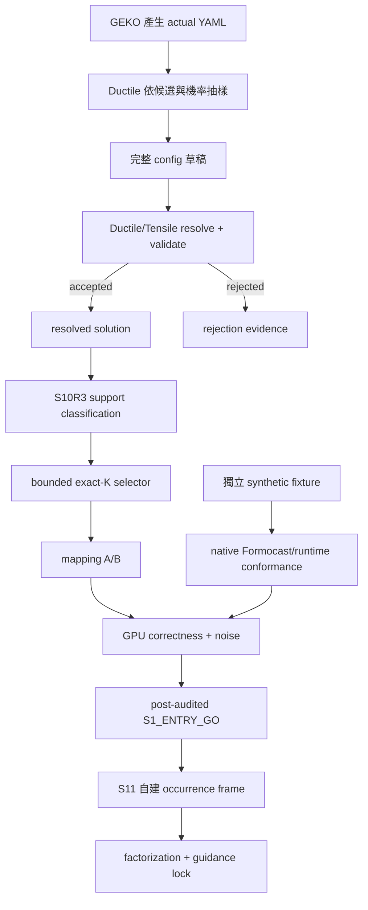

# QA-08 — FAQ 與歷史快照（S10R2／S10R3）

> **文件角色：**這是從 [實驗白話導讀 hub](../../ductile-origami-warmstart-experiment-guide.md) 拆分出來的白話導讀主題檔，方便在單一主題上持續討論。它不是 experiment authority，也不是 contract、lock 或 report，不會取代正式的 charter、experiment plan、checkpoint design、lock 或 report。
>
> **衝突處理：**若本檔與正式文件衝突，以 [research charter](../../surrogate-dse-plan.md)、[experiment plan](../../ductile-origami-warmstart-experiment-plan.md)、[active checkpoint index](../README.md) 及各 checkpoint design 為準。
>
> **2026-08-04 current status override：**S10R3 已 terminal negative；S10R4 已 retired／not evaluated；S11 已 sealed `LOCKED_READY`。沒有 S11/S12 result、effective checkpoint lock、report 或 edge；最新狀態仍須對照 active checkpoint index、formal artifacts 與 Git history。

> **HISTORICAL：**本檔的 §7（S10R2 support-aware entry 設計）與 §21（S10R2 實作快照），以及 §23 內的 S10R3 專題問答，僅保留 historical explanation，**不是 current entry**。S10R2 以 inconclusive／edge null 結束；S10R3 為 terminal negative；current 入口與狀態以 active checkpoint index 為準。

---

## 7. S10R2：第一版 support-aware entry（歷史設計）

本節保留 S10R2 的核心概念作歷史背景。Current successor S10R3 保留 support 三態與固定
discovery 原則，但把 exact-ten selector 改成最多 20 筆的 bounded exact-K。差異與後續用途
整理在 §23 的 S10R3 專題問答；正式規則以
[S10R3 design](../s10r3-stage1-bounded-cover-entry-recovery-design.md)
為準。

### 7.1 為什麼不再強迫所有名義邊界？

舊 S10R1 固定 `DepthU=1024` 後跑了大量 draws 仍沒有 accepted config。

這不證明 1024 不存在，但顯示：

- YAML candidate 不等於 valid-support member；
- 強迫每個 extreme value 成為 mapping gate，可能讓整個研究卡在一個幾乎不可達的值；
- 研究會偏離「Formocast factorization 是否有用」的核心問題。

### 7.2 三態 support classification

每個 candidate value只能是：

#### `supported_witnessed`

至少一個包含該 value 的完整 config 通過同一 validator，並保存完整 witness/provenance。

#### `support_unobserved`

在固定抽樣 schedule 中沒有看到 witness，但沒有 complete proof。

這只能表示：

> 本次沒有觀察到。

不能表示：

> 這個 value 不存在。

#### `support_proven_absent`

只有以下證據才能成立：

- finite exhaustive enumeration；
- sound constraint proof；
- independently validated complete equivalent proof。

### 7.3 對 residual gene 的影響

若一個 residual gene 有任何 value 不是 `supported_witnessed`：

- 整個 gene 不允許進 S11 guidance；
- baseline YAML semantics 不變；
- 不阻止 support 完整的其他 genes；
- 不因單一 extreme value自動阻擋 entry。

### 7.4 固定 discovery schedule

- chunk size：512 draws；
- global：固定 32 chunks／16,384 draws；
- global 不可 early stop；
- global 完成後，從 sealed diagnostic registry 中挑前 15 個仍 unobserved targets；
- 每個 conditional target 固定 32 chunks／16,384 draws；
- conditional 也不可 early stop或延長；
- 總上限：512 chunks／262,144 draws；
- 第 6 個 global chunk、3,072 draws 是第一次 resource reforecast boundary。

### 7.5 Candidate atom registry

第一筆 formal draw 前，L0 要固定每一個 candidate value 的：

- deterministic atom ID；
- exact typed value；
- value hash；
- YAML pointer/blob；
- grouped／ungrouped；
- weighted／unweighted；
- source symbol/blob；
- diagnostic role；
- conditional priority。

S10R2 registry 目前有：

- 30 ordered axes；
- 10,024 candidate rows；
- 101 prelocked residual candidate atoms；
- 107 conditional diagnostic atoms。

### 7.6 Exact-ten corpus

Mandatory mapping atoms只能是：

```text
prelocked_candidate_atoms ∩ supported_witnessed
```

再由 deterministic greedy set-cover 選 exact 10 distinct config hashes。

規則包括：

- 最大化新增 mandatory coverage；
- 固定 first-occurrence order；
- 固定 config-hash tie-break；
- 少於 10 witnesses則 inconclusive；
- 需要超過 10 configs才能 cover 也 inconclusive；
- 不得第 11 筆；
- 不得 replacement；
- 不得用 Formocast／GFLOPS 挑選。

### 7.7 Mapping

Exact ten × 3 sizes，執行 A/B 兩次：

```text
10 configs × 3 sizes × 2 passes = 60 mapping rows
```

要求：

- 30/30 每 pass 完整；
- A/B byte/semantic parity；
- required fields 有 provenance；
- 不猜 occupancy、effective GSU 等 metadata；
- mapping failure = 0；
- 不替換 config。

### 7.8 Sentinel/helper conformance

Random exact-ten corpus不必碰巧命中 sentinel。

另用固定 synthetic whole-cohort fixture，直接驗證：

- pinned native `Formocast::predictedPerformance()`；
- pinned `SolutionIterator::checkSolution`；
- pinned `AllSolutionsIterator::preProblem` queue path；
- exact early-terminate pair；
- guard order；
- stable sort；
- threshold index/value；
- queue prefix。

### 7.9 GPU correctness與noise

Exact-ten 按 hash 排序，index 0、4、9 是 anchors。

先跑：

```text
3 anchors × 3 sizes = 9 correctness cells
```

全部通過後再跑：

```text
3 anchors × 3 sizes × 7 repeats = 63 noise cells
```

目標：

```text
config-level repeat CV P95 <= 0.5%
```

### 7.10 S10R2 outcome

- 全部通過：`positive / S1_ENTRY_GO -> S11`
- Mapping 可重現失敗：`negative / FT-BLOCKED-MAPPING`
- Generate/compile/smoke/correctness 失敗：`negative / FT-BLOCKED-CORRECTNESS`
- Support／exact-ten／noise 不足：`inconclusive / FT-INCONCLUSIVE`
- Harness/schema/native helper 缺陷：`CHANGES_REQUIRED / not_evaluated`
- Resource preflight 不通過：operational `BLOCKED / not_evaluated`

---

## 21. S10R2 當時的實作與執行現況（歷史快照）

本節保存 2026-07-29 的 S10R2 pre-evidence 狀態，不是 2026-08-01 的 S10R3 live status。
S10R3 概念與資料用途見 §23；需要即時 process/chunk 數時應重新查核 live artifacts。

### 21.1 最新 durable Git 位置

本文件建立時，本地 branch HEAD：

```text
51c7667212bf40f0e893fc026ee65450d06d72ff
study: reseal S10R2 pre-evidence lock
```

重要 commits：

- `b0561d2c92`：tiered agent governance；
- `24d9ef2ba1`：S10R2 support-aware authority；
- `d66edf7ac8`：S10R1 artifact retirement；
- `f29ace7911`：S10R2 resource relock calibration authority；
- `bfe700ca76`：A35 repair budget提高至6；
- `8b94bb7db1`：第一次 pre-evidence seal，後來因 prelabel test repair superseded；
- `51c7667212`：重新 seal S10R2 pre-evidence lock。

### 21.2 S10R2 已有的 implementation

- `protocol/v1/run_s10r2_entry.py`
- `protocol/v1/s10r2/` package
- frozen contract
- schema
- native Formocast/runtime adapter
- candidate-atom registry
- size registry
- effective pre-evidence lock
- synthetic/offline tests

### 21.3 已完成的 pre-evidence 工作

- resource calibration；
- candidate registry 建立；
- native helper clean build；
- client build calibration；
- mapping/correctness/GPU fixed-cost calibration；
- numeric relock；
- adversarial audits；
- pre-evidence lock reseal。

### 21.4 還沒有的 formal evidence

- support classification；
- exact-ten corpus；
- formal mapping corpus；
- sentinel conformance evidence；
- correctness evidence；
- noise evidence；
- decision；
- positive compact gate record；
- formal report。

因此目前仍是：

```text
scientific_outcome = not_evaluated
edge = null
```

### 21.5 下一個合法步驟

第一次 seal 後曾修正一項 prelabel lifecycle test，因此重新 seal。

下一步應是：

1. 對 `51c766...` 的新 lock執行 fresh read-only post-seal audit；
2. 驗證 present-lock lifecycle branch；
3. 確認 formal evidence authorization；
4. 確認沒有 writer、outcome artifacts或 unrelated drift；
5. post-seal audit PASS 後，才能開始正式 CPU support discovery。

任何 support、mapping、Formocast、GPU correctness/noise label都不能在 post-seal audit 前產生。

---

## 23. 常見問答

### Q1：S10R2 已經 positive 了嗎？

沒有。S10R2 已正式 closeout 為 `inconclusive / FT-INCONCLUSIVE / edge=null`；它沒有啟動 S11。

### Q2：有 effective lock 是否等於可以宣稱結果？

不等於。Lock只表示規則與輸入已封存。還要 post-seal audit、正式 evidence、fresh verification、report、closure commit與post-commit audit。

### Q3：目前是在跑 CPU 還是 GPU實驗？

這是會變動的 live state。本輪 S10R3 討論發生時，active formal 工作仍在 CPU valid-support discovery，尚未把 mapping、GPU correctness、noise 或 decision 寫成 terminal scientific result。讀者必須以最新 live artifacts 重新查核，不能把這句當永久狀態。

### Q4：為什麼不直接跑 S11？

因為 S11 只有在 post-audited `S10R3:S1_ENTRY_GO` 後才可啟動。S10、S10R1 與 S10R2 都沒有這條 edge。

### Q5：為什麼 S10 technical PASS卻 scientific negative？

Technical PASS表示流程正確、證據完整、negative decision可重現；scientific negative表示 entry criterion沒通過。兩者回答不同問題。

### Q6：S10R1 zero-hit能否證明 DepthU=1024不存在？

不能。Stochastic non-discovery只能是 diagnostic/unobserved；absence需要complete proof。

### Q7：Formocast sentinel是不是 GPU量到10秒？

不是。`9,999,999.9` 是模型 early-terminate 特殊值，不是真實 GPU latency。

### Q8：Same-entropy shuffled為什麼重要？

它控制「抽樣變集中」本身的效果。只有 F持續勝過S，才支持Formocast把高機率放到正確 labels。

### Q9：Residual gene是不是誤差 residual？

不是。它是 existing group/weight guidance 之外剩下的 ungrouped、unweighted、free genes。

### Q10：Canonical config是不是最佳config？

不是。Canonical只表示用固定 bytes/hash識別，可重現、可去重、不可偷換。

### S10R3 專題問答：這個入口實驗到底在做什麼？

以下整理 2026-08-01 這輪討論中反覆出現的問題。先記住最簡單的比喻：

> S10R3 是驗橋，S11 是設計導航，S12／S13 才開始檢查導航是否真的帶來更好的路線。



#### Q11：S10R3 真的是必要且重要的實驗嗎？

在目前研究 claim 下，它是必要的 entry validation，但不是最後用來證明 Formocast 有效的
performance experiment。

它的重要性是避免後面把不同問題混在一起：

- Ductile 根本無法接受某些 joint configs；
- Ductile solution 到 Formocast input 的欄位接錯；
- native runtime 對 sentinel、validity、sort 或 threshold 的解讀不同；
- GPU kernel 無法 generate、compile 或產生正確結果；
- Formocast ranking 本身真的沒有用。

如果跳過入口驗證，S11 或 S12 失敗時，很難判斷是模型失敗還是資料管線接錯。

但「必要」不代表每一分鐘 CPU 搜尋都會直接提高 kernel performance。S10R3 的主要產物是
可信的 measurement boundary 與 failure localization，不是 speedup，也不是 production
readiness。正式 scope 可對照
[S10R3 hypothesis與claim boundary](../s10r3-stage1-bounded-cover-entry-recovery-design.md#L113-L119)。

#### Q12：S10R3 搜尋到的內容，後面會怎麼使用？

不同 evidence 有不同消費者，不能全部叫做「訓練資料」：

| S10R3 產物 | 誰產生 | 下一個消費者 | 實際用途 | 不代表什麼 |
| --- | --- | --- | --- | --- |
| Accepted config occurrence | Ductile validator | Support classifier | 證明該完整 config 及其 values 至少有一個 fresh witness | 不代表效能好 |
| Rejected draw | Ductile validator | Audit/rejection taxonomy | 解釋沒有 witness 的直接原因並驗證 runner 沒有靜默丟資料 | 不進 S11 ranking frame |
| Support state | S10R3 classifier | Selector與S11 eligibility logic | 分成 witnessed、unobserved、proven absent | Stochastic zero 不證明不存在 |
| Final exact-K configs | Deterministic selector | Mapping A/B與GPU entry checks | 用少量但有覆蓋力的 configs 驗收資料橋接與執行邊界 | 不是最佳 configs |
| Native fixture transcript | Fixed synthetic fixture與compiled adapter | Verifier | 驗證真正 Formocast/runtime helper semantics | 不是 GPU performance |
| `S1_ENTRY_GO` | S10R3 decision + fresh verification | S11 dependency gate | 授權 S11 啟動自己的資料收集 | 不等於 guidance 已有效 |

Support 三態的實作入口可看
[classify_support](../protocol/v1/s10r3/support.py#L491-L526)。

#### Q13：被 selector 選到的 configs 後續拿來做什麼？

Selector 選的不是最快 configs，而是一組「驗收樣本」。選擇規則只看哪些
`supported_witnessed` mandatory atoms 尚未被覆蓋，不讀 Formocast score 或 real GFLOPS。

S10R3 先計算 greedy cover 所需的 `C_greedy`：

```text
K = max(10, C_greedy)
K <= 20
```

`K` 是最後 config 數；如果 cover 只需要 8 個 configs，仍補到 10。如果需要 18 個，便用
18；超過 20 則不能假裝完成。規則見
[bounded exact-K selector](../s10r3-stage1-bounded-cover-entry-recovery-design.md#L247-L270)。

Final K configs 的用途是：

1. 每個 config 與三個固定 problem sizes 配對。
2. Mapping pass A 產生 `3K` rows。
3. Fresh mapping pass B 再產生 `3K` rows。
4. A/B 比較 config、solution、`SizeMapping`、Formocast input 與 provenance。
5. 從排序後 config hashes 取預鎖 anchors 做 GPU correctness 與 noise。

一個 row 是「一個 config + 一個 problem size」的 mapping 記錄，不是 timing repetition。
例如 `K=18` 時，每個 pass 有 `18 configs × 3 sizes = 54 rows`；A/B 合計 108 rows。

#### Q14：S11 只會使用 S10R3 篩選出的 exact-K configs 嗎？

不會。這是最容易誤解的地方。

- S10R3 exact-K corpus：驗收 mapping/conformance 與 entry boundary。
- S11 occurrence frame：S11 自己收集、保留 multiplicity 的正式 model-only 分析資料。

Multiplicity 是同一 config 被 sampler 重複抽到的次數。S11 不能只保留 unique config，因為
重複次數本身代表抽樣分布的 operational mass。

Current S11 design 明定：

- S10R3 exact-K 只能作 entry fixture；
- S11 自建 4,096／8,192 accepted-occurrence frame；
- conditional support 使用 128／256 accepted occurrences；
- S10R3 rows 不能取代 S11 frame。

這個邊界見
[S11 future lock與outputs](../s11-stage1-model-only-factorization-design.md#L145-L165)
及 [A38 dependency amendment](../s11-stage1-model-only-factorization-design.md#L253-L271)。

#### Q15：既然不直接剪掉 parameters，為什麼要花時間做 support discovery？

因為 S10R3 的目標是 certification，不是 pruning。

- Certification 問：「後續的測量與 guidance 是否建立在合法、可重現的入口上？」
- Pruning 問：「哪些 candidates 可以從 search space 移除或永久降權？」

這兩個問題需要不同證據。S10R3 可以間接省下成本：它避免把 GPU 時間花在錯誤 mapping、
不合法 configs 或無法解釋的 pipeline failure 上。但它不保證減少 S11 的 frame，也不會自動
縮小 baseline YAML。

因此，如果期待的回報是「刪掉大量 parameters」，S10R3 本身確實不會達成。那需要另一個
明確以 operational pruning、constraint proof 或 conditional validity 為 estimand 的
checkpoint。

#### Q16：「檢查 Ductile → Formocast mapping 是否可靠」實際怎麼做？

Mapping 是把 Ductile/Tensile 的 resolved solution 轉成 Formocast 需要的欄位。它不是把
整個 Python object 原封不動傳過去，而是取出 `depthU`、MacroTile、matrix instruction、
vector widths、occupancy 與其他明確欄位。

實際流程是：

1. Experiment adapter 讀取被 selector 鎖定的 raw config。
2. 它呼叫 pinned Ductile/Tensile resolver 建立 solution。
3. 它實際 generate kernel metadata，不能用手填 proxy 跳過。
4. 它從 pinned `MasterSolutionLibrary.SizeMapping` 取得 Formocast fields。
5. 每個 required field 保存 source path與hash provenance。
6. Pass A 與 fresh pass B 比較完全相同的 logical projection。

Experiment-side resolver 可從
[mapping resolver](../protocol/v1/s10r3/mapping.py#L160-L225)
開始讀；batch 與 A/B parity 分別在
[run_mapping_batch](../protocol/v1/s10r3/mapping.py#L384-L421)
和
[verify_mapping_parity](../protocol/v1/s10r3/mapping.py#L437-L477)。

#### Q17：如果程式具有確定性，為什麼還要跑 mapping A/B？

A/B 不是兩套獨立 mapping algorithm，而是同一 implementation 的兩次 fresh execution。
它檢查的是「聲稱 deterministic 的程式在真實執行環境是否真的重現」。

它能抓到：

- global state 或 cache 汙染；
- initialization order 依賴；
- unstable serialization；
- solution index/order 漂移；
- resume artifact 意外影響第二次執行。

它抓不到「兩次都做出相同錯誤」的 common-mode bug。因此 A/B 仍需要 source provenance、
synthetic oracle、fault injection、native conformance 與 fresh verifier；A/B 不是 correctness
proof 的全部。

#### Q18：Ductile config 和 Ductile solution 差在哪裡？GEKO weights 又在哪裡？

可以用「點餐單 → 廚房可執行工單」理解：

- **Actual YAML** 是完整菜單與抽樣規則。
  - 它包含 candidate lists、groups、existing weights 及 problem settings。
  - [DepthU candidate list](../protocol/v1/inputs/s10-generated.yaml#L49-L60)
    列出 `32` 到 `1024`。
  - [Ductile weights block](../protocol/v1/inputs/s10-generated.yaml#L24894-L24901)
    目前只對 `group_0` 提供 positional weights。
- **Ductile config** 是 sampler 從菜單抽出的一張完整點餐單。
  - 它為每個 gene 選一個 value。
  - 例如選到 `DepthU=256`，並同時選出 MacroTile、vector width 等其他值。
  - 它仍可能因 joint constraints 不合法。
- **Ductile solution** 是 resolver 展開、補齊 derived fields 並通過 validation 後的可執行
  kernel 描述。
  - 它包含 problem type、ISA、constants、derived metadata與kernel structures。
  - 它是 mapping、code generation 與後續 compilation 的輸入。
  - 它還不是最後的 GPU binary，也不代表 kernel correctness/performance 已通過。

GEKO 與 Ductile 仍是兩個不同 remote feature branches 的 source authorities。GEKO 產生這次
actual YAML 的 candidate/group/weight snapshot；Ductile 消費 YAML，將可用 weights 轉成
probabilities並抽 config，再將 config resolve成 solution。不是「GEKO 每次直接送一個
solution 給 Ductile」。

#### Q19：Mapping 程式是誰寫的？它是 GEKO 或 Ductile 內建的嗎？

目前 S10R3 mapping adapter 是本研究 checkpoint 的 experiment-side integration code，
由 S10R3 implementer 寫來連接 pinned Ductile/Tensile representation 與 Formocast input。
它不是 GEKO 自己產生的 mapping，也不是可以脫離 checkpoint contracts 任意使用的 upstream
generic truth。

它仍盡量避免自行發明 semantics：

- solution 由 pinned Ductile/Tensile resolver 產生；
- required fields 從 pinned `MasterSolutionLibrary.SizeMapping` 讀取；
- source/blob/hash被記錄；
- guessed or unresolved fields fail closed。

因此 reviewer 要驗證的不只是「程式作者是誰」，而是每一個欄位是否能回到 authoritative
source，以及替換 source/helper 時 tests 是否會失敗。

#### Q20：「Native Formocast/runtime 測試補強」是什麼？為什麼它有補強作用？

Python mapping A/B 只證明兩次 mapping 輸出一致；它不能單獨證明真正 C++ consumer 會用同樣
方式解讀欄位。

Native conformance 會編譯並執行 actual C++ path：

- 呼叫 `origami::Formocast::predictedPerformance()`；
- 建立 runtime solution cohort；
- 呼叫 `AllSolutionsIterator::preProblem`；
- 檢查 invalid solution 排除、stable sort、tie、threshold與queue prefix；
- 綁定 source、binary、adapter、toolchain與argv identity。

Adapter 中的實際 Formocast 呼叫在
[predict](../protocol/v1/s10r3/native_formocast_runtime_adapter.cpp#L153-L165)，
runtime queue 在
[runtimeQueue](../protocol/v1/s10r3/native_formocast_runtime_adapter.cpp#L167-L204)。

它使用獨立、固定、score-blind 的 synthetic fixture，因為 random exact-K configs 不保證會
自然涵蓋 sentinel、tie 或所有 threshold branch。Fault tests 還會故意替換 helper、adapter、
guard order 或 queue semantics，確認 harness 能 fail closed。

它補強的是 integration semantics，不是 prediction accuracy。Native test通過仍不能證明
Formocast ranking正確、kernel更快或 production ready；這些是後續 real-GFLOPS checkpoints
的問題。

#### Q21：S10R3 對後續實驗最具體的幫助是什麼？

S10R3 交付給後續的不是「一小批最佳 config」，而是五個邊界：

1. **Support boundary**
   - 哪些 candidate values 至少有 fresh valid witness。
   - 哪些仍只是 `support_unobserved`。
2. **Mapping boundary**
   - Ductile solution 是否能無猜測地轉成 Formocast input。
3. **Native semantics boundary**
   - Actual C++ predictor與runtime queue是否按照 frozen interpretation 工作。
4. **Execution boundary**
   - Selected anchors 是否能 generate、compile、正確執行且 noise 可接受。
5. **Authority edge**
   - 只有上述條件都依 contract通過並 post-audited，才產生 `S1_ENTRY_GO`。

S11 接著在這個已驗收的橋上建立自己的 occurrence frame、factorization與weights；S12/S13
再檢查 model ranking與actual Gen0 mechanism。這就是為什麼 S10R3 的價值主要是降低錯誤
結論風險，而不是直接減少後續樣本數。

#### Q22：一個 value 沒有 witness，就凍結整個 gene，會不會太極端？

會。這是 current S10R3/S11 authority 選擇的保守 all-or-nothing policy，不是唯一可行的
技術方案。

它的理由是：只要同一 gene 還有 value 缺少 mapping/support evidence，便不讓 Formocast
重新分配該 gene 的任何機率，避免研究者看到結果後只挑容易處理的 values。

它的代價也很明確：假設 `DepthU=32` 到 `512` 都有 witness，只有 `1024` unobserved，整個
DepthU 仍不能接受 guidance。這會浪費已有資訊，甚至讓 S11 沒有 guidable gene。

因此這輪討論另建立了非權威草案
[value-level bounded guidance amendment proposal](../archive/s10r3-s11-value-level-guidance-amendment-proposal.md)。
它目前是 `DRAFT_PENDING_DESIGN_DISCUSSION`，不修改正在執行的 S10R3 或 approved S11。

#### Q23：為什麼不直接把這類 value 的機率 hardcode 成很低或零？

先釐清一個事實：Actual YAML 的 existing weights 目前只對 `group_0` 提供，`DepthU` 是
currently unweighted residual gene。把 `DepthU=1024` 設成低機率或零不是沿用一個既有 GEKO
per-value probability，而是新增研究 policy。

直接設成零有很強的含義：它把 stochastic non-discovery 轉成 operational pruning。除非有
complete absence proof，否則可能排除極稀有但合法的 joint context。

較溫和的候選是 trust-region mixture：

```text
p1(v) = (1 - alpha) * p0(v) + alpha * gW(v)
```

- `v`：一個 candidate value，例如 `DepthU=1024`。
- `p0(v)`：baseline probability。
- `gW(v)`：只在已有 witness values 上正規化的 Formocast probability；unobserved value為零。
- `alpha`：預先鎖定的 guidance strength，介於零與一；越大代表模型影響越強。
- `p1(v)`：guided arm 最終 probability，所有 values 合計必須是一。

只作數學示例：若 `p0(1024)=1/6`、`alpha=0.5` 且 `1024` unobserved，則：

```text
p1(1024) = 0.5 * (1/6) + 0.5 * 0 = 1/12
```

它從約 16.7% 降為約 8.3%，但不歸零。`alpha=0.5` 只是例子，不是已核准常數。

這個方案能讓 witnessed values 接受 bounded guidance，同時保留 unobserved value 的非零
floor。但它會改變 S11 eligibility、sampling distribution與 scientific estimand，必須經
正式雙 reviewer design discussion、使用者核准、contract更新與 fresh seal；不能在看到
結果後偷偷套用。

#### Q24：讀者最可能卡在哪裡？

這輪問題反映的不是單一名詞不懂，而是五個 mental models 疊在一起：

1. **把 support discovery 當成 optimizer。**
   - 實際上它先做 certification；它不是找最快 config。
2. **把 GEKO weights 當成 whole-config instructions。**
   - 實際上 YAML 同時包含 groups、candidate lists與部分 weights；Ductile仍要抽出完整 config。
3. **把 candidate value、config、solution 當成同一物件。**
   - Candidate value是單一選項；config是所有選項的完整組合；solution是展開並驗證後的
     kernel 描述。
4. **把 deterministic 當成 correct。**
   - A/B 一致只能排除部分 nondeterminism；兩次仍可能一致地做錯，所以還需要 native path、
     provenance、fault tests與GPU correctness。
5. **把 operational rarity 當成 mathematical absence。**
   - 大量 zero-hit 強烈支持「在目前 sampling law 下極罕見」，但 complete absence仍需要
     exhaustive或sound proof。

最後用一句話重新對齊：

> S10R3 驗證「能不能可信地研究」；S11 建立「模型建議怎麼抽」；S12／S13 才回答「這個建議是否真的有用」。

---

