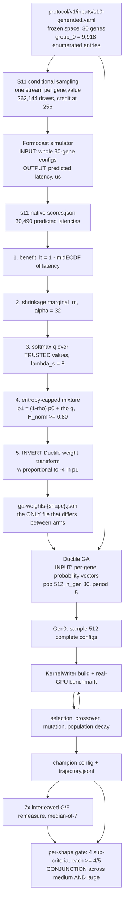

# Presentation outline — S14 closing report (Formocast Gen0 guidance × Ductile GA)

> **SYNC RULE.** This file is paired with [`outline.zh-Hant.md`](outline.zh-Hant.md). **Every change must
> be applied to both in the same edit** — slide titles, page order, numbers, and content alike. The two
> must always have the same `### P<n>` headings in the same order. **This English file is authoritative
> on conflict**; numbers, identifiers, paths, amendment tokens and evidence labels stay in English in
> both. (Owner-directed 2026-08-13, same convention as `report-source-index.md` / `.zh-Hant.md`.)

> **What this document is.** A **working outline** for the closeout presentation. It is **not** a closure
> report and states **no gate verdict of its own**. `reports/README.md` rule 3 reserves `*-report.md`
> naming under `reports/` for gate closure reports (one per `scientific_gate`, filename == that gate's
> `formal_report_path`); this file is deliberately `outline.md`. The only document that may state
> "did S14 pass" is `reports/staged/full-ga-baseline-vs-guided-outcome-report.md`
> (currently `report_status: DRAFT-SCAFFOLD`, `scientific_outcome: not_evaluated`).
>
> **Audience assumption — stated up front so it is easy to redirect.**
> **Internal technical review for the ~2026-08-20 closeout. Assumes GPU / GEMM literacy
> (MFMA, LDS, prefetch, occupancy, GFLOP/s) but *no* familiarity with this study** — no prior knowledge of
> Ductile, Formocast, GEKO, S11/S14, the locks, or the amendment ledger. Every study-specific term is
> defined on first use.
>
> **Date:** 2026-08-13. **Sources current as of:** `report-source-index.md` last updated 2026-08-13.

## Section map — also the content of the agenda slide, if one is used

| # | section | pages | what it answers |
|---:|---|---|---|
| 1 | **Question & Verdict** | P1–P2 | What was asked, what the answer is, and what may *not* be claimed |
| 2 | **The Two Tools** | P3–P5 | What Ductile and Formocast are, what each consumes, how they connect |
| 3 | **What Can Be Tuned** | P6–P7 | The 27 free genes, the 3 grouped genes, and what was held fixed |
| 4 | **Experiment Design** | P8–P11 | Shapes, gene selection, the bridge, and the Gen0 cap — each with its rationale |
| 5 | **How Success Was Judged** | P12–P14 | The four-part gate, the four measured quantities, and the noise controls |
| 6 | **Results** | P15–P16 | medium and large, against the gate |
| 7 | **Problems & Future Work** | P17–P19 | The measurement defect, the overwrite, and what remains unmeasured |

**Ordering note (2026-08-13).** Section 5 was moved to sit *after* Section 4 rather than before it. The
gate was previously defined seven pages before the results scored against it, which asked the audience to
hold four sub-criteria and a tolerance band in memory across the whole design block. It now sits
immediately before Results. One small forward reference is created in exchange: P8's shape table shows
`η_s`, which is defined on P13.

**The measurement defect stays in Section 7, after the results** (owner decision) — work to characterise
it is continuing, so the treatment is left as-is rather than restructured around a provisional finding.

## Page budget — deviation note

**19 pages** (suggested budget was 20). One deviation, on requester instruction: the **results block is
2 pages instead of 3** — the dedicated `tiny`-as-null-control page is dropped. Tiny's null-control content
is **not lost**: it is folded into **P13 (tolerance band)**, which is where it does its actual argumentative
work in the sources (§3.8.1 uses tiny's byte-identical zero-treatment arms to *falsify* the empirical
margin). All other blocks are unchanged: title+exec 2, Ductile & Formocast 3, parameters 2, metrics 3,
experiment design 4, results 2, problems 2, future work 1.

## Standing rules for every slide (put these in the speaker notes, not on the slides)

1. **Every quantitative claim carries its source** (`file § / artifact path`), so any slide can be
   back-traced. Sources are written into this outline in `[...]` after each number.
2. **Never write "no effect."** The permitted negative wording is: *"the amended sparse prior, as
   configured, did not meet the pre-registered directional gate."* [index §4, §3.4c.4]
3. **`NOT_EVALUATED ≠ no effect`** — appears explicitly on P13, P15, P17. [index banner, §5c.3]
4. **Never quote large's 5/5 non-regression on its own.** It is one sub-criterion of a failed
   conjunction, and it is 3/5 under the empirical margin. [index §7.2a; design §13.5; large annex §11.2]
5. **No deployment / adoption / generalisation / cross-architecture / end-to-end-speedup claim.**
   [index §4, charter §8.6]
6. **Nine items are `PENDING_HUMAN_DECISION`** (index §9.3). Anything downstream of them is
   **provisional** and carries a `PROVISIONAL — pending owner decision #N` tag on the slide.
7. Evidence labels used consistently: `[MODEL-ONLY]`, `[BASELINE GPU]`, `[GUIDED GPU]`, `[CODE AUDIT]`.
   [index §0]

---

### P1 — Does a Formocast Gen0 Prior Help Ductile?

**Content**

- Title: *"Does a Formocast-derived Gen0 prior improve a Ductile GA search on real GPUs? — S14 closeout."*
- One-line framing of the experiment: **per-shape single-objective GA, two arms, 5 paired seeds.**
  - **Arm G (baseline):** Gen0 samples every free gene from a **uniform** `p0`.
  - **Arm F (guided):** Gen0 samples **activated** free genes from a Formocast-derived, entropy-capped
    `p1`; everything else identical. [formal report §1; index §3.4b.4]
- **Status banner box** (verbatim on the slide, because it governs how everything after it is read):
  - capped `P0 = 512` campaign **COMPLETE** on all three shapes — baseline 15/15, guided 15/15, 7×
    remeasure done on medium, large, tiny. [index §1, §1 status paragraph]
  - native `P0 = 11,405` addendum: **medium COMPLETE** (5/5 GA + 5/5 remeasure); **large IN PROGRESS**
    (5 baseline seeds in Gen0 sampling, no trajectory rows; guided arm not started). [index §1;
    `s14-large-report.md` §10]
  - The single formal report is a **DRAFT-SCAFFOLD**, `scientific_outcome: not_evaluated`; **nine owner
    decisions are open**. [formal report frontmatter; index §9.3]
- Presenter's contract, said out loud: *"This deck reports counts, measurements and their sources. Where
  the record is unresolved I will say `PENDING_HUMAN_DECISION` or `NOT_EVALUATED`, and I will not round
  those into a conclusion."*

**Visual:** no chart. A 3-row status strip (capped / native-medium / native-large) with
green–amber–grey state chips.

---

### P2 — Verdict: Gate Not Met on Untainted Criteria

> **This is the single most important slide in the deck. If the audience remembers one page, it must be
> this one. Do not let the framing get compressed away.**

**Content — four blocks, in this order:**

1. **The gate is a conjunction, and it fails on sub-criteria the measurement defect cannot reach.**
   Table (the headline artefact of the whole deck):

   | shape | Gen0 best | gen-10 best | AUC | final champion `F/G>1` | required |
   |---|---:|---:|---:|---:|---|
   | **medium** (capped) | 3/5 | 3/5 | 3/5 | 2/5 (campaign 1) | ≥4/5 each |
   | **large** (capped) | **1/5** | **2/5** | 3/5 | 3/5 | ≥4/5 each |

   [formal report §3.1; index §9.1; `s14-medium-report.md` §5.1/§5.2; `s14-large-report.md` §4.4]
   The formal report's own version of this table also carries **medium's final ratio as `NOT_EVALUATED`**
   and a non-gated tiny row (3/5 · 2/5 · 2/5 · 1/5, calibration only). [formal report §3.1]
   - **Gen0, gen-10 and AUC are read from `trajectory.jsonl`, never through the 7× remeasure**, so the
     medium instrument defect (P17) **cannot touch them**. [index §5c, §9.1; medium annex §5.1]
   - **The verdict sentence, verbatim from the formal report §3.1** (put it on the slide in the original
     and in translation): 「**兩個 confirmatory shape 的四項連言都不成立,且是在三個「量測缺陷碰不到」的分項上
     就不成立。**」 — *"The four-way conjunction fails on both confirmatory shapes, and it fails on three
     sub-criteria the measurement defect cannot reach."*
   - Therefore the gate is **NOT MET on both confirmatory shapes regardless of how the medium endpoint
     is eventually adjudicated.** Mark: `PROVISIONAL — the claim-ladder wording is owner decision #6 (D3)`.
     The **counts themselves are measured facts**; only the formal wording is pending. The formal report
     still carries `report_status: DRAFT-SCAFFOLD` / `scientific_outcome: not_evaluated`, and states that
     the outcome label is filled at closure by `CU-S14-OUTCOME` **only after** the pending items are ruled.
     [formal report frontmatter, §3.1, §3.4; index §9.2 D3, §9.3]
2. **Three things that must never be said.** Big, plain, on the slide:
   - ✗ "no effect" → ✓ *"did not meet the pre-registered directional gate"*.
   - ✗ large "passed" / quoting **5/5 non-regression** alone → it is 1 of 4 sub-criteria in a failed
     conjunction, **3/5 under the empirical margin**, and its pinned `η_large` was never validated
     against the measurements it gates. [index §7.2a; large annex §5.1, §11.2]
   - ✗ any deployment / adoption / generalisation wording. [index §4]
3. **medium's final endpoint is a third state: `NOT_EVALUATED / instrument-invalid` — neither pass nor
   fail.** 46.4 % of campaign-1 medium repeats are dropouts, so the median of 7 is a mode lottery.
   [medium annex frontmatter + §5.2; index §7.1a, §9.2]
4. **What *is* claimable, positively.** Two model-space findings that do not depend on the contested
   instrument:
   - **Sparsity is real and reducer-independent:** of 27 free genes, **0 / 2 / 5** are guidable on
     tiny / medium / large; the aggregate max-reducer independently surfaces only 3 of 26 testable genes.
     [index §3.5, §7.3.1 item 1]
   - **Gen0 mechanism:** the prior moves the Gen0 **centre** (+2.0 % median, 4/5 seeds) while the GA
     selects on the Gen0 **extreme** (−2.8 % median, 1/5 seeds) — opposite directions on the same runs.
     [index §7.2.1; large annex §6.1]

**Visual:** the 2×4 counts table as the hero; a red "must not say" box; a small green "may say" box.

---

### P3 — Two Tools, Two Input Formats

**Content**

- **Ductile** = the GA-based design-space explorer inside TensileLite
  (`projects/hipblaslt/tensilelite/Tensile/ductile/`). It searches kernel configurations and benchmarks
  each one on a **real GPU**. Fitness = measured GFLOP/s, normalised per size by a reference `R_s`.
  [index §3.1.1; `algorithm/ga.py`]
- **Formocast** = an analytic **performance simulator** (`formocast_simulator.cpp`) that returns a
  **predicted latency in microseconds** for a config, with **no GPU involved**. [index §3.6.2, §5a]
- **The input-format contrast — put this side by side, it is the crux of the whole plumbing:**

  | | **Formocast** | **Ductile** |
  |---|---|---|
  | consumes | **whole configs** — one complete 30-gene kernel config at a time | **per-gene probability vectors** — one distribution per gene, then it samples configs itself |
  | returns | predicted latency (µs), or a sentinel `9,999,999.9` when it refuses to model | a champion config + a per-generation `trajectory.jsonl` |
  | evidence label | `[MODEL-ONLY]` | `[BASELINE GPU]` / `[GUIDED GPU]` |
  | source | `formocast_simulator.cpp:568–645`; `s11-native-scores.json` (30,490 predicted latencies) | `core/space.py:57`; `algorithm/ga.py:145–146` |

- **Why this matters:** Formocast's answer is *per-config*; Ductile's question is *per-gene*. Everything
  in the bridge (P10) exists to convert one into the other, and that conversion is where the entropy
  floor, the trusted-value gate, and the weight-transform inversion all live.
- **Ductile does NOT take probabilities directly.** Its config field is called `weights`, and
  `ga.py:145–146` applies `w → exp(−0.25·(w − w.min()))` then renormalises — **a lower weight yields a
  higher sampling probability**. Feeding `p1` in directly would *invert* the guidance. Flag this here and
  resolve it on P10. [index §3.4b.2]
- **Sampling is per-individual and independent across genes:**
  `ind = Individual({k: rng.choice(s, p=p.get(k, None)) for k, s in sizes.items()})` — every individual
  independently draws a value for **all 30 genes**, producing a complete config.
  [`core/space.py:57`; index §3.2a]

**Visual:** two facing input-format cards (Formocast ← whole config; Ductile ← 30 probability vectors)
with the `weights` sign-inversion warning as a red footnote.

---

### P4 — Ductile's GA: 30 Generations, Two Decay Laws

> Requested emphasis: give the evolution design more room than the rest of the block.

**Content**

- **Pinned horizon and population** (all `[CODE AUDIT]` from
  `Tensile/ductile/config/defaults.yaml` + `algorithm/ga.py`):
  `n_gen = 30`, `pop_size = 512`, `soo = False`, native early stop `period = 5`, `tol = 0.0008`,
  `div_thr = 0.5`, `max_iters = 250`, `weight_beta = 0.25`,
  selection = tournament (k=2), crossover = UX (prob 0.9), elitism 0.05.
- **Gen0 inflation.** If any gene's candidate count `max_sp_sz` exceeds `pop_size`, the constructor
  inflates Gen0 to `int(max_sp_sz × 1.15)` = `int(9,918 × 1.15)` = **11,405**. [`ga.py:112–118`]
  - The `×1.15` is an **undocumented magic constant** — no comment, no doc anywhere in the ductile tree.
    Its only nearby text is the warning string at `ga.py:114`. [index §3.2a]
  - It buys **≈1.15 draws per group_0 candidate**, i.e. `1 − e^{−1.15}` ≈ **68.3 %** coverage — near-full
    coverage would need ≈91,266 draws (coupon collector). Do not describe 11,405 as "covering the space."
- **Two independent population-decay laws — the headline of this slide.**

  | law | code | installed when | floor | sticky? |
  |---|---|---|---:|---|
  | **law 1** | `ga.py:116` `int(_pop_size + (sz − _pop_size)/2)` | only when `max_sp_sz > pop_size` (the inflation case) | **512** | no |
  | **law 2** | `ga.py:291` `int(_pop_size/2 + (sz − _pop_size/2)/1.25)` | as soon as any generation reports `diversity < div_thr = 0.5` | **256** | **yes — overwrites law 1 permanently, no path back** |

  Applied at the end of every generation: `ga.py:293`.
- **Three consequences to state explicitly:**
  1. Law 1 is **not** "halve the population" — it halves only the *excess above* 512:
     `11,405 → 5,958 → 3,235 → 1,873 → 1,192 → 852 → 682 → 597 → 554 → 533 → 522 → 517 → 514 → 513 → 512`
     — ~14 generations, i.e. **roughly half the 30-generation horizon is spent unwinding the inflated
     Gen0** under native settings. [index §3.2b]
  2. In our capped runs (`DUCTILE_FORCE_P0=1`), law 1 is **never installed** — but **law 2 still engages.**
  3. **Measured crossover generation = 6, in every S14 large run, in both arms:**

     | gen | 1 | 5 | **6** | 10 | 15 | 21 |
     |---|---:|---:|---:|---:|---:|---:|
     | diversity, baseline seed 24001 | 0.568 | 0.515 | **0.492** | 0.417 | 0.345 | 0.322 |
     | diversity, guided seed 24001 | 0.560 | 0.508 | **0.491** | 0.412 | 0.329 | 0.316 |
     | evals that generation | 489 | 507 | 507 | 349 | 277 | 252 |

     Post-gen-6 eval counts (457, 418, 384, 349, …, 252) track law 2's sequence (460, 419, 386, 360, …)
     to within the valid-candidate rate. [index §3.2b; `stage3_*/seed_24001/large/*optimization.log`]
     Native medium decays 11,405 → … → 258 by gen 29. [medium annex §1.6]
  4. **It is not an arm-level confounder** — same generation, near-identical trajectories in both arms.
     But it *does* mean **AUC must be integrated against cumulative evaluations, not generation index**
     (carried to P13/P12).
- **Fail-open halving — a governance item, not a performance note.** `ga.py:625–632`:
  ```python
  try:    pop = self.space.sample(self.pop_size, p=self.probs)
  except MaxIterationsReached as e:
      n_sampled = e.args[1]
      p = self.probs if n_sampled > 0 else None      # <-- guidance silently dropped if nothing sampled
      pop = self.space.sample(self.pop_size // 2, p=p, iter_mul=4, reuse=True)
  ```
  `MaxIterationsReached` is raised by `core/space.py:157` when fewer than `size` valid individuals were
  produced. The retry **halves the population**, and if *zero* individuals were sampled it **falls back to
  `p = None`, i.e. uniform — nulling the treatment**. Say plainly: this branch did **not** fire in our runs
  (`Max iterations reached` ×0 in all 10 native medium logs [medium annex §1.4]); it is reported because a
  silent fail-open on the treatment channel is the kind of thing a closeout must have checked.
- **⚠ Two `ga.py` copies.** All `ga.py:NNN` citations resolve against the **repo** copy
  (`projects/.../ductile/algorithm/ga.py`, 756 lines). The runs executed the **engine** copy
  (`agent_run/260807-s14-baseline-run/engine/.../ga.py`, 346 lines), whose content at those line numbers
  differs; `DUCTILE_FORCE_P0` exists **only** in the engine copy (`engine .../ga.py:112`). A line-by-line
  divergence map is **`NOT_EVALUATED`**. [index §3 header box]

**Visual:** a single decay-curve chart, population vs generation, two traces (law 1 → 512, law 2 → 256)
with the gen-6 crossover marked; the fail-open snippet as a code callout.

---

### P5 — The Pipeline, End to End

**Content:** one diagram plus four annotations. This closes the Ductile/Formocast block.



**Annotations to place on the diagram:**

- **A.** Steps 1–3 are **sealed S11 code**; step 4 is amendment `ENTROPY-CAP-20260810`; **step 5 is the one
  most likely to be got wrong and must not be skipped in the talk.** [index §3.4b.1]
- **B.** `ga-weights-{shape}.json` is the **only** difference between Arm G and Arm F. Seeds, pins,
  `group_0`, evaluation and early stop are identical. Verified: non-activated genes resolve to exactly
  uniform (`WaveSeparateGlobalReadA → [0.5000, 0.5000]`). [index §3.4b.3/§3.4b.4]
- **C.** `CH → GT` (dashed) is the **AUC / Gen0 / gen-10** path — it reads the trajectory directly and
  **bypasses the remeasure**. This is the arrow that makes P2's framing true.
- **D.** `RM → GT` is the only path the medium instrument defect touches.

**Visual:** the mermaid, rendered wide; the four annotations as numbered callouts, with C and D in
contrasting colours.

---

### P6 — The 27 Tunable Genes

**Content:** the inventory table. `#vals` = candidate count in the **frozen** search space
(`guidance-medium.json → genes[].candidate_order`, 27 entries) — **not** the full list in
`ValidParameters.py`. Purposes are quoted/paraphrased from the inline commentary in
`projects/hipblaslt/tensilelite/Tensile/Common/ValidParameters.py` at the cited line.

| # | gene | #vals | purpose (source: `ValidParameters.py`) |
|---:|---|---:|---|
| 1 | `DepthU` | 6 | `L888–899` — summation-loop unroll depth; `DepthU = LoopUnroll × LocalSplitU`; sets how much of K each main-loop iteration consumes |
| 2 | `1LDSBuffer` | 2 | `L319–330` — force a single LDS buffer instead of double-buffering under PGR, to save LDS / raise occupancy or fit kernels that would exceed MaxLDS |
| 3 | `WaveSeparateGlobalReadA` | 2 | `L236–266` — selects one of three thread/wave global-read distribution patterns (0 stride whole threads · 1 per-wave block, stride 64 · 2 spread evenly in perp). **Benefit/why: `NOT_EVALUATED`** — the comment is an ASCII diagram, no prose rationale |
| 4 | `WaveSeparateGlobalReadB` | 2 | `L267` — same comment block, B side. **Operand mapping (A vs B) is naming convention, not stated: `NOT_EVALUATED`** |
| 5 | `NumElementsPerBatchStore` | 8 | `L755–758` — throttles store issue rate; issuing stores in a short window flips the kernel compute-bound → memory-bound; `0` = issue as many as VGPRs allow |
| 6 | `NonTemporalA` | 2 | `L927–934` — cache-modifier bits on global read/write (`glc`/`slc`; on gfx942 `sc0`/`sc1`/`nt`). **Which tensor the `A` suffix targets is not stated: `NOT_EVALUATED`** |
| 7 | `NonTemporalB` | 2 | `L936` — same shared comment. Suffix target `NOT_EVALUATED` |
| 8 | `NonTemporalC` | 2 | `L933` — same shared comment. Suffix target `NOT_EVALUATED` |
| 9 | `NonTemporalD` | 2 | `L932` — same shared comment. Suffix target `NOT_EVALUATED` |
| 10 | `PrefetchGlobalRead` | 4 | `L277–289` — depth of global-load prefetch: 1 = double-buffer global→VGPR→LDS (costs 2× LDS + VGPRs); 2 = extra prefetch while writing VGPR→LDS; ≥3 = DirectToLds only, PGR prefetches before the main loop |
| 11 | `SourceSwap` | 2 | `L731` — "optimizes MatrixInstruction store pattern by swapping mfma input order" |
| 12 | `StaggerU` | 3 | `L554–569` — offsets each tile's start position in the summation (U) dimension to avoid DRAM/cache/TLB channel conflicts at power-of-2 K; higher values spread traffic wider but lose L2 re-use; interacts with `WorkGroupMapping`; needs `BufferLoad==1` |
| 13 | `StaggerUStride` | 4 | `L570–580` — byte stride per stagger "click"; 256 = memory-channel width, so each click lands in a new channel; internally rounded up to a multiple of `DepthU×BpeAB` |
| 14 | `StorePriorityOpt` | 2 | `L733–754` — store scheduling: lower the store's priority relative to the unroll loop so one workgroup's stores hide behind another's loop |
| 15 | `StoreSyncOpt` | 3 | `L759–764` — insert sync (contiguous stores) and sleep (spread stores across the loop) after each batch store; "highly depends on size_k"; 0 = neither |
| 16 | `WorkGroupMapping` | 18 | `L603–629` — remaps workgroup IDs so concurrently resident workgroups hit L2 best; WGM = box height in J, box width set by CU count; `wgSerial = wg0 + (wg1 % WGM)·nwg0` |
| 17 | `WorkGroupMappingXCC` | 5 | `L630–640` — remaps IDs so contiguous workgroups land on the same XCC. **⚠ the inline legend documents only `0`/`1` while the valid list is `[-1,1,2,4,8,16,32]` — per-value semantics `NOT_EVALUATED`** |
| 18 | `MIArchVgpr` | 2 | `L769–771` — use only Arch VGPRs for `v_mfma_*` to remove Acc→Arch VGPR copies; requires totalVgpr < 256 and ACC_CD |
| 19 | `TransposeLDS` | 4 | `L918–925` — LDS layout vs global-fetch dimension, for the TLU=0 MI path; values select tile-coalesced / global-fetch-matching / unroll-coalesced layouts (NT rejected at 1) |
| 20 | `AdaptiveGemm` | 2 | `L1034–1036` — 0 = fixed store blocks (NonEdgeN, ThenN, Then1); 1 = adaptive store blocks (…, ThenN/2, …) selected by runtime problem size |
| 21 | `TailloopInNll` | 2 | `L1051–1055` — emit the tail loop inside the NoLoadLoop to exploit prefetch, wider global loads and better scheduling |
| 22 | `ExtraMiLatencyLeft` | 2 | `L1047–1050` — adds slack to `miLatencyLeft` to give the scheduler more room for local-read placement |
| 23 | `ScheduleGROverBarrier` | 2 | `L1056–1061` — schedule global reads across a barrier; only for DirectToLds A+B with PGR ≥ 2 |
| 24 | `UnrollLoopSwapGlobalReadOrder` | 2 | `L268–270` — emit an extra unrolled + NGLL loop with GRA/GRB order swapped, "which may change the tlb thrashing behavior" |
| 25 | `GlobalReadVectorWidthA` | 7 | `L839–845` — element width for global→LDS loads; bounded by bpe (bpe32: 1–4, bpe16: 2–8, bpe8: 4–16) |
| 26 | `GlobalReadVectorWidthB` | 7 | `L846` — same shared comment, B side. **Operand mapping `NOT_EVALUATED`** |
| 27 | `DirectToVgprA` | 2 | `L418–420` — "attempt to load directly from global memory into Vgpr. Assembly only." (thin — no stated trade-off) |

**Sourcing policy box — say this out loud, it is the slide's real point:**

- **Nothing in `study_docs/` describes what individual genes do.** The only substantiating source is the
  inline commentary in `ValidParameters.py`; every purpose above is cited to a line there.
- **What is `NOT_EVALUATED` as sourced (7 items, named):** the *rationale* for
  `WaveSeparateGlobalReadA`/`B`; the operand/tensor mapping of the `A`/`B`/`C`/`D` suffixes on
  `NonTemporalA/B/C/D` and `GlobalReadVectorWidthA/B`; per-value semantics of `WorkGroupMappingXCC`.
- **The concrete candidate *values* of most genes are `NOT_EVALUATED` from the cited sources.**
  `guidance-*.json` stores `candidate_order` as **sha256 hashes**, not literals, and the frozen space is a
  subset of `ValidParameters.py`'s valid list (e.g. `PrefetchGlobalRead` is 4 values here vs 17 valid).
  Only two genes' value sets are recoverable from cited text: `DepthU ∈ {32,64,128,256,512,1024}` and
  `PrefetchGlobalRead ∈ {1,2,3,4}` [index §3.4a.2].
- Twenty-seven confident-sounding invented descriptions would be worse than twenty-seven blanks — a reader
  cannot tell them apart, and this deck is meant to be back-traceable.

**Visual:** the table split into two columns across the slide; `NOT_EVALUATED` cells shaded, with a
count chip "7 purposes unsourced".

---

### P7 — What Was Held Fixed

**Content**

- **The search space has exactly 30 keys = 27 free genes + 3 grouped genes.** Verified directly from
  `trajectory.jsonl → best_params_so_far` (30 keys):

  | group | members | expanded cardinality | in the treatment? |
  |---|---|---:|---|
  | `group_0` | `{GlobalSplitU, MatrixInstruction}` | **9,918** | **NO — identical in both arms** |
  | `group_1` | `{DirectToLds, UseSgprForGRO}` | 3 | no (not activated) |
  | `group_2` | `{ClusterLocalRead, LDSTrInst}` | 2 | no (not activated) |

  [`agent_run/260809-s14-pershape-baseline/.../medium/trajectory.jsonl`; cardinalities from the s10
  entry-gate report / index §3.2a]
- **27 is the authoritative free-gene denominator**, confirmed arithmetically per shape:
  `n_genes_activated + n_genes_fallback` = **2+25 / 5+22 / 0+27 = 27** for medium / large / tiny.
  [`out-capped/guidance-{medium,large,tiny}.json`]
  ⚠ **Known cross-file inconsistency to pre-empt:** the medium annex writes medium as **2 of 29** while
  the large annex writes it as **2 of 27**; index §3.4b.4 also uses 29. Neither file reconciles them.
  **Use 27**, and say so on the slide. [medium annex §1.1; large annex §1.1/§6.2]
- **Why `group_0` is outside the treatment — three reasons, in this order:**
  1. It is **GEKO-weighted**, not Formocast-weighted: the 9,918 entries are GEKO's generated pool of
     kernel macro-shapes, and their weights come from GEKO. [index §3.7]
  2. Its weight file is **byte-identical between the two arms** — verified. [index §3.4b.4, §3.7]
  3. It is why native Ductile inflates Gen0 at all: `max_sp_sz = 9,918` is set entirely by `group_0`
     (the 29 other genes have only 2–18 values each). So the whole `×1.15` inflation exists to cover a
     gene that carries **no treatment**. [index §3.2a]
  - Consequence to state: capping to 512 shrinks group_0 coverage → it **affects absolute champion
    quality and external validity**, but it **cannot bias the paired G-vs-F contrast**, because both arms
    draw group_0 from the same `p0` with common Gen0 uniforms. [index §3.2]
  - What 9,918 is *not*: not a Ductile design limit (`space.py` only rejects an empty list), and not a
    Cartesian product — only **840 distinct MatrixInstruction tuples**, 262 `WorkGroup:` overrides,
    434 MacroTile shapes. It is an **enumeration length** in a frozen YAML. [index §3.2a]
- **Fixed conditions (the "statics" — everything held constant across arms):**

  | condition | value | source |
  |---|---|---|
  | shapes `(M,N,batch,K)` | tiny `(8,8,1,128)` · medium `(256,256,1,1024)` · large `(2304,1024,1,214336)` | sealed `s11/contract.py:674` |
  | shape roles | medium + large **confirmatory**; tiny **exploratory** | `PER-SHAPE-SOO-OUTCOME-20260809` |
  | seeds | **24001–24005**, 5 paired, fresh (no registry collision) | design §10 |
  | horizon | `n_gen = 30` cap + native early stop `period = 5`; gen-10 checkpoint captured | `defaults.yaml` |
  | `rotating-buffer-size` | **tiny 4096 · medium 4096 · large 0** | `DUCTILE_PERSIZE_RBS = {"4096":[[8,8,1,128],[256,256,1,1024]],"0":[[2304,1024,1,214336]]}` |
  | client | `num-warmups = 321`, `num-enqueues-per-sync = 321`, `sleep-percent = 50`, `NumElementsToValidate = 128` — **identical for all three shapes** | `ClientParameters.ini` |
  | dtype / arch | BFloat16, non-StreamK, single dtype+layout, gfx942 / MI300X | index §3.6.1 |
| GPU cards | **at most 6, never device index 0**; one seed → one card, **same physical GPU UUID for that seed's G and F**; native pins the set **2, 3, 4, 6, 7** | design §5.3, §10.2, §12.3 |
| RNG | counter-based streams keyed `(lock_hash, shape, seed, phase ∈ {gen0, evolution, measurement})`; **paired arms share the same Gen0 uniforms**, mapped through `p0` or `p1`; evolution stream reset after Gen0 | design §10.2 |
| locks | **Lock A** (protocol / seeds / margins / budget / RNG / measurement) sealed before baseline; **Lock B** (per-shape capped guidance + activation) sealed before guided | design §10.4 |
  | `R_s` (normaliser) | tiny 0.75 · medium 3,199.94 · large 180,336.00 | Lock A |
  | guidance constants | `λ_s = 8.0`, `α = 32`, `ε = 0.2`, `ρ_max = 0.80`, `ρ_step = 0.0001953125`, `entropy_floor = 0.80`, `weight_beta = 0.25` | `guidance-*.json` |

- Flag forward to P17: `num-warmups = 321` being **identical for all three shapes** is exactly the defect.

**Visual:** left = the 3-group table + the "27, not 29" correction chip; right = the fixed-conditions table.

---

### P8 — Three Shapes, Five Orders of Magnitude

**Rationale stated on the slide: three deliberately divergent regimes, not a smooth sweep.**

**Content**

| shape | M | N | batch | K | FLOPs | `R_s` | `η_s` | role |
|---|---:|---:|---:|---:|---:|---:|---:|---|
| tiny | 8 | 8 | 1 | 128 | 16,384 | 0.75 | 0.4466 | exploratory |
| **medium** | 256 | 256 | 1 | 1,024 | 134,217,728 | 3,199.94 | 0.0042 | **confirmatory** |
| **large** | 2,304 | 1,024 | 1 | 214,336 | 1,011,364,134,912 | 180,336.00 | 0.1229 | **confirmatory** |

> `η_s` = the per-shape noise tolerance band used by the gate. **Defined on P13** — shown here only
> to make the three regimes comparable at a glance.

[sealed `s11/contract.py:674`; Lock A]

- **Rationale.** K grows 128 → 1,024 → 214,336 (×8, then ×209): a degenerate toy, a mid-size square, and
  a very deep-K production-scale GEMM. The three shapes exist to test **whether the guidance effect
  reproduces across size diversity** — not to be co-optimised into one compromise answer.
  [index §3.6.1, §3.1.5]
- **Why per-shape single-objective at all** — the defect it repairs, in three steps:
  1. Ductile's `soo=False` performs **no Pareto / non-dominated sorting**; a tree-wide search for
     `pareto|non-dominated|nsga|crowding` returns nothing. `ga.py:256–273` reduces the (n_sizes × N)
     score matrix with `np.max` ⇒ `Q_c = max_s (GFLOPS_{s,c} / R_s)`. [index §3.1.2,
     `REDUCER-FACT-CORRECTION-20260812`]
  2. So a candidate is scored by **whichever single size it happens to look best on**, and tiny is by far
     the noisiest (η 0.4466 vs medium 0.0042). Observed in the pilot: **seed-14005's champion was ~2×
     faster on large yet received the *lowest* `Q`.** [index §3.1.4]
  3. One single-objective GA per shape makes the fitness matrix (1×N), so `max` over one row is the
     identity and no cross-size reduction happens at all. [index §3.1.5]
- **Why tiny can never carry guidance — a design fact, not a result.** `formocast_simulator.cpp:578`
  early-terminates when the MacroTile overshoots a small problem dimension, returning
  `microSeconds = 9,999,999.9`. At 8×8 essentially the whole pool trips it, so every config ties at the
  sentinel ⇒ every per-value marginal is identical ⇒ `S_g = 0.0000` for all 27 genes.
  **tiny is outside Formocast's modelled regime — not a shape where the model tried and failed.**
  [index §3.6.2]
  ⚠ Carry the source caveat: the "1 of 434 / 171 of 434 MacroTiles survive" counts are **derived with no
  cited derivation → `NOT_EVALUATED` as cited**; the qualitative conclusion is independently confirmed by
  the activation log and does not depend on them. [index §3.6.2 audit box]
- **Honest scope limit:** single development cluster, tested shapes only, 5 seeds — no generalisation.

**Visual:** a log-scale K axis with the three shapes placed on it, annotated with `η_s` band widths drawn
to scale — the visual makes the 0.42 % / 11.56 % / 36 % disparity immediate.

---

### P9 — Gene Selection: Sensitivity, Prior, Guard

**Rationale stated on the slide: a three-stage funnel — select, build, then guard.**

**Content**

- **The funnel** (`select genes → build prior → safety check`), and where each threshold lives:
  ```
  SELECT :  S_g >= 0.05  AND  >= 2 trusted values
  BUILD  :  q = softmax over trusted values, lambda_s = 8
  GUARD  :  H_norm(p1) >= 0.80        <- the entropy floor lives HERE, downstream of selection
  ```
  The floor takes no part in choosing *which* genes carry signal or *which* value is better; it can only
  change **how strongly** an already-chosen preference is applied. [index §3.4c.1]
- **Stage 1 — the sensitivity gate `S_g ≥ 0.05`.** `S_g = max_v(m_gv) − min_v(m_gv)`, where `m_gv` is a
  shrinkage marginal (`α = 32`) of `benefit = 1 − midECDF(predicted latency)` — i.e. **population
  rank-percentile points**, entirely `[MODEL-ONLY]`. Reading: `S_g = 0.142` means configs using the
  gene's best value sit ~14 percentile points higher in the predicted-latency ranking than its worst.
  [index §5a; `statistics.py:102/137/188/1166`]
- **Stage 2 — trusted-value support.** A value is *trusted* only if it clears **all** of: `support ≥ 128`
  accepted configs, executable (≥1 config compiled+ran), coverage ≥ 0.95, no collision-confounding.
  Needs **≥2 trusted values** to compute a sensitivity at all. [index §5a; `workflow.py:758–802`]
  - The evidence base: each (gene, value) stream drew up to **262,144** configs, credited at 256.
    `DepthU` credited 256 / 256 / 38 / 0 / 0 / 0 across its six values; `PrefetchGlobalRead` 256 / 256 / 2 / 0.
    **The zeros are "sampled 262,144 times and nothing was accepted" — not "unsampled".** [index §3.4a.2]
  - Report honestly as "no accepted config", **not** "unbuildable": the sealed ledger records
    dispositions, not rejection reasons. [index §3.4a.2 terminology caveat]
- **Stage 3 — the entropy cap `ρ` (amendment `ENTROPY-CAP-20260810`).**
  `p1 = (1−ρ)·p0 + ρ·q`, `ρ = max{ρ ∈ [0,0.80] : H_norm(p1) ≥ 0.80}`, found by a deterministic downward
  grid scan (step `0.80/4096 = 0.0001953125`, 4097 points — reproducible, no solver). [index §3.4]
  - **Why the original binary rule failed:** it asked yes/no at fixed full strength, so it
    **systematically deleted the strongest-signal genes** — stronger signal ⇒ more peaked `q` ⇒ lower
    entropy ⇒ more likely to fail a fixed floor. `DepthU` (6 values, 2 trusted) tops out at
    `H_norm = 0.6576` and `PrefetchGlobalRead` (4/2) at `0.7345` — **below 0.80 at every λ, for any
    data**. And because `λ` was **global**, one such gene asserted the entire pipeline
    (`select_global_lambda`, sealed `s11/guidance.py:95`). [index §3.4a, §7.3]
  - **What the floor actually measures:** not concentration but **`k/n`**. Same treatment strength,
    opposite verdicts: `1LDSBuffer` (2/2) 1.0000 clears; `PrefetchGlobalRead` (4/2) 0.7345 fails;
    `DepthU` (6/2) 0.6576 fails. Legible restatement: `H_norm ≥ 0.80 ⟺ perplexity ≥ n^0.8` — `DepthU`
    is asked for 4.19 effective choices and can offer at most 3.25. [index §3.4c.3, §3.4c.6]
  - **Both constants are undocumented.** No derivation, noise model or power analysis exists for either
    `S_g ≥ 0.05` or `H_norm ≥ 0.80`; 0.80 is hard-pinned in sealed code that rejects any other value.
    Post-hoc robustness check (label it as such): any threshold in **(0.0422, 0.0520]** selects exactly
    the same genes on **both** shapes, and 0.05 sits inside that window. [index §3.4c.2, §3.4c.6]
- **The outcome — the funnel table:**

  | drop reason | tiny | medium | large |
  |---|---:|---:|---:|
  | `S_g < 0.05` (dominant) | 26 | 24 | 21 |
  | fewer than 2 trusted values (always `DirectToVgprA`, `n_trusted = 1`) | 1 | 1 | 1 |
  | **activated** | **0** | **2** | **5** |

  [`derivation-manifest-capped.json → per_shape_activation_log`; index §3.5, §5a]
- **Activated genes, with strengths:** medium `{DepthU S_g=0.142 ρ=0.566, 1LDSBuffer S_g=0.113 ρ=0.80}`;
  large `{PrefetchGlobalRead 0.1916/0.586, UnrollLoopSwapGlobalReadOrder 0.1647/0.80,
  GlobalReadVectorWidthB 0.0580/0.80, TransposeLDS 0.0571/0.80, GlobalReadVectorWidthA 0.0520/0.80}`.
  **Only the top-sensitivity gene on each shape is de-weighted (71 % / 73 % strength); the five weaker
  genes run at 100 %.** [index §3.4c.4; large annex §6.2]
- **The interpretation limit this forces on any null** — quote it verbatim on the slide:
  *permissible:* "the amended sparse prior, as configured, did not meet the pre-registered directional
  gate"; *not permissible:* "the model's guidance does not help" — the strongest available guidance was
  applied at reduced strength by a constant with no documented derivation. [index §3.4c.4]
- **Positive validity signal worth stating:** sparsity is **shape-appropriate**, not random. `DepthU`
  (loop structure) passes on medium 0.142 and fails on large 0.029; `PrefetchGlobalRead` (memory
  pipeline) is the exact reverse (0.024 → 0.192). As K grows the dominant genes shift from loop structure
  to memory pipeline — what GEMM physics predicts. [index §3.6.3, §3.6.4]

**Visual:** a funnel graphic 27 → (S_g) → (trusted) → 0/2/5, with the two crossover genes
(`DepthU`, `PrefetchGlobalRead`) drawn as a crossing X between the medium and large columns.

---

### P10 — The Bridge: Configs → Gene Probabilities

**Rationale stated on the slide: Formocast answers per-config; Ductile asks per-gene. This is the
converter, and step 5 is where it would silently invert.**

**Content — the five locked steps** (every one a `locked_formula` / `locked_constant` in
`derivation-manifest-capped.json`):

```
s11-native-scores.json                      30,490 Formocast predicted latencies
  (1) per-size benefit        b_{c,s} = 1 − midECDF_s(predicted_latency)      rank, not absolute latency
  (2) shrinkage marginal      m_{g,s,v} = (Σb + α·global_mean_s)/(n + α),  α = 32
  (3) softmax over TRUSTED    q = normalize( exp( λ_s·(m − min m) ) ),      λ_s = 8
  (4) entropy-capped mixture  p1 = (1 − ρ_g)·p0 + ρ_g·q,  ρ_g = max{ρ ≤ 0.80 : H_norm(p1) ≥ 0.80}
  (5) INVERT Ductile's weight transform
ga-weights-{shape}.json                     what Arm F injects into the GA config
```

- **`H_norm` defined for the audience:** Shannon entropy of `p1` divided by `log n`. `1.0` = perfectly
  uniform (maximum diversity); smaller = more concentrated. `p0` (uniform) has `H_norm = 1.0`, and
  `H_norm(p1)` is **monotone-decreasing in ρ**, which is what makes the downward grid scan valid and
  guarantees a feasible ρ always exists (at worst ρ = 0). [index §3.4, §3.4a.6]
- **Step 5 in detail — the step most likely to be got wrong.** `ga.py:145–146`:
  ```python
  w = np.exp(-weight_beta * (w - w.min()))   # weight_beta = 0.25
  self.probs[k] = w / w.sum()
  ```
  The sign is **negative** — a *lower* weight gives a *higher* sampling probability. The field carries
  **cost-like**, not preference-like, semantics. Emitting `p1` directly would make the model's best value
  the **least** likely draw. The derivation therefore emits `w ∝ −4·ln(p1)`. Round-trip checks
  (`roundtrip_p0_pass`, `roundtrip_p1_pass`, and the max-abs-error fields) are recorded per gene.
  [index §3.4b.2]
- **Verified end to end on the shipped file** — three independent checks, all passing:

  | gene | weights in `ga-weights-medium.json` | ⇒ Ductile sampling probs |
  |---|---|---|
  | `DepthU` (6) | `[6.251, 2.764, 10.506, 10.506, 10.506, 10.506]` | `[0.2096, 0.5011, 0.0723, 0.0723, 0.0723, 0.0723]` |
  | `1LDSBuffer` (2) | `[1.608, 4.423]` | `[0.6690, 0.3310]` |
  | `WaveSeparateGlobalReadA` (2, **not activated**) | `[2.773, 2.773]` | `[0.5000, 0.5000]` |

  1. **Untrusted mass equals the baseline share exactly:** `(1 − 0.566015625)/6 = 0.0723`.
  2. **The entropy lands on the floor:** `H(p1)/ln 6 = 0.8000` vs the manifest's `0.800125`.
  3. **Non-activated genes come out exactly uniform** ⇒ the treatment is confined to activated genes.
  [index §3.4b.3]
- **The concrete size of the intervention — state it next to every null.** A prior over **2 of 27** free
  genes on medium and **5 of 27** on large. *A null is a null for a prior of that size.*
  [index §3.4b.4, corrected denominator per P7]
- **What de-weighting concretely does to Gen0** (`DepthU` on medium, model prefers 64 over 32 ≈ 3:1):

  | | ρ = 0.80 (full strength) | ρ = 0.566 (as shipped) |
  |---|---:|---:|
  | P(`DepthU=64`) | 0.6393 | 0.5011 |
  | each of the 4 evidence-less values | 0.0333 | 0.0723 |
  | effective choices (perplexity) | 2.93 / 6 | 4.19 / 6 |
  | `H_norm` | 0.6007 | **0.8001** |

  In a 512-strong Gen0: **~327 individuals would carry the model's top value at full strength vs ~257 as
  shipped — about 71 fewer** — while the mass handed to the four evidence-less values rises 13.3 % → 28.9 %.
  [index §3.4c.7]

**Visual:** the 5-step pipeline as a horizontal flow, with step 5 highlighted and a small
"weights ≠ probabilities, and the sign is negative" warning glyph.

---

### P11 — Why Gen0 Was Capped at 512

**Rationale stated on the slide: cap the budget where it does not bias the contrast, then test the cap.**

**Content**

- **Why `P0` was capped at 512 — the honest two-part framing (do not give only half):**
  - **512 is Ductile's own steady-state population**, not an arbitrary floor: the config default
    (`ga.py:47`, `defaults.yaml`) and the decay target `_pop_size` (`ga.py:110`) that native Ductile
    converges back to. Running at 512 = running at Ductile's own working population, minus a one-off
    Gen0 sprint. [index §3.2; formal report §2.3]
  - **(a) It DOES affect absolute results / external validity.** Capping shrinks group_0 coverage ⇒ the
    claim is scoped to the **"P0-capped = 512 Ductile variant"**, not native Ductile.
  - **(b) It does NOT bias the paired G-vs-F contrast.** Both arms sample group_0 from the same `p0` with
    common Gen0 uniforms, so the reduced coverage is a **shared boundary condition that cancels in the
    within-pair difference**, leaving the free-gene reweighting as the sole exogenous difference.
  - **Residual caveat:** the measured effect is "the effect at P0 = 512" — a **treatment × budget
    interaction**. That is exactly what the native addendum probes.
- **The native 11,405 addendum** (`NATIVE-P0-ROBUSTNESS-20260811`, extended to medium by `(b)` on
  2026-08-12). Everything identical except Gen0 scale. Three questions:
  - **Q1 robustness** — is the capped direction robust to Gen0 scale (removes the "you capped it" caveat)?
  - **Q2 dilution** — does the effect shrink at native scale (prior matters most at small Gen0)?
  - **Q3 extreme-value mechanism** — §7.2.1 found guidance improves the Gen0 **centre** but degrades the
    Gen0 **extreme**; Gen0 pool size is the direct handle on how far into the tail the max reaches, and
    512 → 11,405 is a **22× manipulation of exactly that variable**. Pre-registered directional
    predictions, written 2026-08-12 **before** execution. [index §3.3; design §12]
  - Verified precondition: medium and large configs are byte-identical apart from four `ProblemSizes`
    numbers and both embed the same 9,918 `MatrixInstruction` entries, so medium's `max_sp_sz` is also
    9,918 and it inflates to the same 11,405 (it does **not** fall into the `max_sp_sz < pop_size/5`
    halving branch at `ga.py:119`).
  - Scheduling rationale: **medium first, large second** — measured GPU evaluation time on seed 24001 is
    medium **0.17 h** vs large **5.61 h**, ~33× cheaper, so medium validates the plumbing before
    committing days to large.
- **⚠ Retracted rationale — say it out loud, it is a governance point.** The original stated reason for
  adding medium ("medium is the only shape whose arms differ measurably") is **VOID**: that 0.36×–2.12×
  spread is the measurement defect, not an arm difference. What justifies medium's inclusion instead is
  **Q3, which reads from the GA trajectory and does not depend on champion remeasurement at all.**
  Q2's effect-size comparison on medium's final endpoint is **`NOT_EVALUATED`**. [index §3.3 retraction;
  design §13.6]
- **Honest non-blindness caveat:** medium was added *after* its capped result was seen, so its inclusion
  is not blind. What remains genuinely pre-registered is the native-P0 outcome itself.
- **How the cap is enforced, and what native gives up.** The runner sets `DUCTILE_FORCE_P0=1`, which makes
  the constructor skip the inflation branch, and the runner then **asserts the initial population is
  exactly 512** (`ga.py:302–304`). **Native has no such assert** — it inherits only Ductile's stock
  fail-open (P4). The pre-registered disposition for that gap (design §12.7): check the population at the
  first generation's evaluation; if it is not 11,405, write `native_gen0_degraded.json` and **abort that
  run**, recording it as *a substantive finding about native Ductile behaviour* — **never** swallowed as an
  infrastructure error, never silently re-run. [formal report §2.3(d); design §12.7]
- **Fail-closed pins actually verified on the native runs (10/10):**
  `pop_size_at_construction = 11405`, `_pop_size_at_construction = 512`,
  `decay_type = large_space`, `native_p0_variant = true`, `n_gen/period = 30/5`,
  weights sha256 G `56c34446…` / F `d64ebd34…`, stock inflation warning ×1 and `Max iterations reached`
  ×0 in all 10 logs. [medium annex §1.4]

**Visual:** a 512-vs-11,405 side-by-side of the Gen0 population with the decay curves overlaid (reuse
P4's chart), and a Q1/Q2/Q3 chip row with their current status (Q1 partial, Q2 `NOT_EVALUATED` on the
endpoint, Q3 answered on medium).

---

### P12 — The Gate Is a Conjunction

> Requested: do not present the metrics as one list of six numbers. This page is dimension 1 of 4.

**Content**

- **The per-shape directional-consistency gate** (pre-registered, **not** a significance test — 5 seeds):

  | # | sub-criterion | quantity | rule | reads from |
  |---:|---|---|---|---|
  | 1 | **Gen0 best** | `best_gflops_so_far` at the generation-1 record | `F > G` in **≥4/5** seed-pairs | `trajectory.jsonl` |
  | 2 | **gen-10 best** | `best_gflops_so_far` at gen 10 | `F > G` in **≥4/5** | `trajectory.jsonl` |
  | 3 | **AUC** | step-hold integral of `best_gflops_so_far` vs `cumulative_complete_evals`, to `B* = min` of the two arms' final completed evals | `AUC_F > AUC_G` in **≥4/5** | `trajectory.jsonl` |
  | 4 | **final ratio** | 7×-median champion GFLOP/s | `F/G ≥ e^{−η_s}` in **≥4/5**, median also above | `champion_interleaved.json` |

  [index §5, §5c; design §10.4]
- **It is a conjunction three times over — say all three:**
  1. **Within a shape:** all four sub-criteria must hold. Failing one fails the shape.
  2. **Across shapes:** the combined §8.2 claim wording requires **medium ∧ large** — an
     **intersection-union** rule, **no aggregate rescue**. Tiny is descriptive only.
     [index §5, charter §8.2]
  3. **Arm S is gated on this:** the conditional shuffle control triggers only if F clears the gate on
     **≥1** confirmatory shape. Neither does ⇒ **Arm S does not trigger**; Lock C need not be sealed for
     this checkpoint. [index §1, §3.9, §9.2 D3]
- **Why AUC is integrated against evaluations, not generations:** evaluations per generation are not
  constant (population decay, P4), so generation 20 of one arm can represent far fewer evaluations than
  generation 20 of the other. `B*` makes both arms answer *"given the same number of evaluations, whose
  best-so-far curve sat higher?"* [index §5c, §3.2b]
  ⚠ Wording to align before closeout: design §10.2 registers AUC as
  `A = (1/B*)·∫₀^{B*} log(I(u)/R_s) du`, with `I(u)` the right-continuous incumbent and `u` = **post-Gen0**
  completed evals, never merged across shapes; the index and annexes describe the implemented quantity as
  the step-hold integral of `best_gflops_so_far`. Same construction, two descriptions — state which one
  produced the reported numbers.
- **Why sub-criteria 1–3 are immune to the P17 instrument defect** — three reasons, weakest to strongest:
  (i) exposure differs by ~30× (in-search short-window effect touches ~1.6 % of ~510 solutions per
  invocation vs 28–48 % of fresh-process remeasures); (ii) the integrand is a **running maximum** and the
  contamination is **one-sided downward**, so it can only fail to raise the curve; (iii) the empirical
  spread settles it — AUC `F/G` ranges **0.9509–1.0461 (±5 %)** while the 7× remeasure `F/G` ranges
  **0.3551–2.1175**, an order of magnitude apart. [index §5c.1]
- **Residual risk, stated not buried:** a genuinely strong candidate understated at its single in-search
  evaluation never becomes the incumbent, so the running-maximum argument gives no protection. Not
  quantifiable — per-generation benchmark CSVs were not retained (only `00_Final.csv`).
  **`NOT_EVALUATED`.** [index §5c.3]

**Visual:** a 4-box conjunction diagram with AND gates; boxes 1–3 tinted "trajectory-sourced / defect-immune",
box 4 tinted "remeasure-sourced / defect-exposed". Small inset: the AUC step-hold integral sketch.

---

### P13 — Four Quantities, Four Questions

**Content — present as four stacked bands, each with its own question:**

1. **Raw measurement — real GFLOP/s.** *"How fast is this champion, actually?"*
   The primary metric is champion **real GFLOP/s**, 7× interleaved. Absolute levels span ~5 orders of
   magnitude across shapes (`R_s`: 0.75 / 3,199.94 / 180,336.00), so raw numbers are **not**
   cross-shape comparable. Even within a shape they are not cross-config comparable across RBS settings:
   RBS 0 vs 4096 alone moves medium's level **12,430 → 14,153 (+14 %)**. [index §3.6.1, §7.1b; large annex §2.4]
2. **Paired comparison — `F/G`.** *"Did the guided arm beat the baseline on this seed?"*
   Reported because it is the intuitive number. **Seeds are the experimental units** — never repackage
   5 seeds as statistical significance. [index §0]
3. **Analysis quantity — `ln(F/G)`.** *"What is the average multiplicative effect?"* Four reasons
   (§5b), and reason 2 is our own data:
   - symmetry: `ln 2 = +0.693`, `ln 0.5 = −0.693`; on the raw scale gains look bigger than equal
     regressions;
   - **measured on medium's 5 seeds:** arithmetic mean of raw ratios = **1.0499 (+5.0 %)**, dragged up by
     one 2.12× seed, while the mean log-ratio = **−0.1130 ⇒ geometric mean 0.893 (−10.7 %)**. Averaging
     raw ratios would have reported a +5 % gain where the correct central tendency is −10.7 %;
   - the pre-registered threshold is **defined** in log space (`η_s = P95(|log y − median log y|)`);
   - GPU throughput noise is **multiplicative**, so logs turn it additive. [index §5b]
4. **Tolerance band — `η_s`.** *"Is this difference bigger than the instrument's jitter?"*
   Two identical arms never measure to exactly 1.0, so a bare `F/G < 1` rule would convert every flicker
   into a finding. Non-regression ⟺ `F ≥ G · e^{−η_s}`.

   | shape | `η_s` | F must be ≥ this fraction of G | tolerated regression |
   |---|---:|---:|---:|
   | **medium** | 0.0041953 | **99.58 %** | **0.42 %** |
   | large | 0.1228459 | 88.44 % | **11.56 %** |
   | tiny | 0.4465998 | 63.98 % | 36.02 % |

   [index §3.8.1; `noise/per_shape_noise.json`]

**The one arithmetic fact to make the audience remember:**
**medium is judged on a band ~27.6× narrower than large's.** That, before any argument about
contamination, is *why the same non-regression criterion returns 5/5 on large and 3/5 on medium.*
[index §3.8.1]

**tiny as the accidental null control — folded in here because this is where it does work.**

- tiny's two arms are **byte-identical** (same sha256, all 5 seeds) with **0/27 genes activated** —
  Formocast returns its sentinel `9,999,999.9` for essentially every tiny config, so `S_g = 0.0000` for
  all 27 genes. A **guaranteed zero effect**. [index §3.6.2, §3.5; `guidance-tiny.json`]
- Yet its measured spread is **non-zero**: `F/G` = 0.8828 / 1.0350 / 0.8841 / 0.9953 / 0.9690,
  max `|ln F/G|` = **0.1247**, sample sd **0.0715**. [index §3.8.1]
- **What that calibrates — two things:**
  (a) it **falsifies the "just recompute η from the remeasures" repair**: under tiny's own within-window
  margin (0.0145 ⇒ floor 98.56 %), a *constructed zero* scores **3/5 regressed**. A margin that calls a
  known zero a regression cannot replace one that does not. [index §3.8.1, §9.2 D2]
  (b) it gives a **reference envelope** (never a threshold) for large: every large seed's `|ln F/G| ≤
  0.0749` sits inside tiny's zero-treatment envelope of 0.1247. [index §9.2 D2]
  (c) it shows its **own pinned margin is structurally vacuous** — `η_tiny = 0.4466` needs a 36 % drop to
  fail and +56 % to pass, while tiny's whole champion range is only **1.18×**, so nothing can ever move
  it. [design §13.4/§13.5]
- **All three `η_s` pins are pilot accidents, not noise models** — say this once, here:
  `η_medium` from anchors 2.9–6.3× slower than the champion it gates (0/21 pilot dropouts);
  `η_tiny` manufactured by **a single deep drop** in pilot tiny anchor 1 (0.415 against the 2.128 mode);
  `η_large` from two anchors whose max/min were 1.2373 / 1.4201, which the champion remeasure
  (1.024–1.053) cannot reproduce. [design §13.4; index §7.1b.4; large annex §5.3]
- **`NOT_EVALUATED ≠ no effect`** — put the phrase on this slide. tiny's guidance question is
  *"not evaluated / not activated"*, **not** *"guidance doesn't work at 8×8"*. [index §9.2 D3;
  design §13.5]

**Visual:** four stacked bands (raw → ratio → log-ratio → band). Inset chart: `ln(F/G)` per seed for
medium / large / tiny with the two `e^{−η_s}` floors drawn as horizontal rules — the width difference is
the visual argument.

---

### P14 — Noise Control, and Why Median-of-7

**Content — part A, the six controls (this is a paired GPU comparison; the controls are the design):**

| # | control | what it defends against | source |
|---:|---|---|---|
| 1 | **G and F interleaved in one window on one card** | temporal drift — G ran hours/days before F, so an uncontrolled comparison confounds *arm* with *time* | index §5(ii), §8 |
| 2 | **Deterministic per-shape counterbalanced start arm** — `START_ARM = {medium: G, large: F, tiny: G}` | first-draw / order effects. large starting on F is **by design, not a deviation** | `s14_guided_remeasure_driver.py:41`; index §8.4 |
| 3 | **Fresh client invocation per repeat** ⚠ see the tension note below | intra-process caching / state carry-over between repeats | index §5c.1, §7.1b.1/§7.1b.2 |
| 4 | **Hard idle gating on GPU *and* host load** — refuse to measure if the card is `> 5 %` busy or 1-min loadavg `/ cores > 0.35` ⚠ **implementation, not a pre-registered pin** | co-tenant contention. Observed gate state during the telemetry campaign: GPU 0 %, host load 0.031–0.079 of 224 cores | `s14_native_remeasure_driver.py:100–101,124–135`; index §7.1b |
| 5 | **7× repeat protocol** (`REPEATS = 7`, 14 single measurements per pair) | single-shot noise: per-shape repeatability is ±0.42 % on medium but ±12.3 % on large, so one measurement cannot separate two close champions | `remeasure_interleaved_champion.py:35`; index §5(iii) |
| 6 | **Within-pair ratio as the endpoint** | card-level offsets — medium had to be remeasured on GPU 5 (`--gpu-uuid-override`) because 2/3/4/6/7 were occupied; the ratio cancels the offset | index §8.3 |

Plus the reason the remeasure exists at all: **winner's curse.** The GA selected the champion *because* it
measured fastest, so the in-search number is systematically optimistic — and the bias need not be equal
across arms, since the arm that benchmarked more distinct candidates gets more lucky draws. The bias also
grows with search size, which is why the **native addendum must use the identical 7× protocol**: native
runs ~30,600 evals vs capped ~7,689 (≈4×), so without it Q2 would compare "true effect difference +
measurement-protocol difference". [index §5(i); design §12.3]

**⚠ Two source tensions to resolve before closeout — do not paper over them on the slide:**

- **Controls 3.** Design §13.1 and formal report §3.3 describe the 7 repeats as taken in **one process**,
  one card, inside a ~21–25 s window; index §5c.1 / §7.1b.1 / §7.1b.2 describe the same remeasure as
  **"fresh-process … restarts the clock on every single draw"**. Most likely reading: the *driver* is one
  process and the *client binary* is re-invoked per repeat — but the documents do not say so, and
  §7.1b.1's whole exposure argument depends on the answer. **Flag as a documented tension.**
- **Control 4.** The numeric idle thresholds live in the **native** driver's source; the *pre-registered*
  policy is only the qualitative "measure on an idle GPU, never device index 0, bind with
  `HIP_VISIBLE_DEVICES`, record UUID/arch into the lock" (design §5.3). Label them **implementation**.

**Content — part B, the estimator (flag it clearly as `PENDING_HUMAN_DECISION`):**

- **Pre-registered estimator = median-of-7.** `max`-of-7 appears **only as a clearly-labelled sensitivity
  row**, applied identically to all three shapes. [index §9.2 D1]
- Status: **`PENDING_HUMAN_DECISION`, §9.2 D1 / §9.3 item 4** — a design-discussion is still open
  (two independent reviewers, two cross-examination rounds plus one evidence-backed final round, both
  returned `AGREE`, no preserved dissent; ~43 of 60 permitted agent wall-minutes; **nothing is approved**).
  [index §9 provenance box]
- **Why `max` was not promoted to primary** — four reasons, and reason 4 is a hard counterexample:
  1. it buys **no change in any conclusion** — `median → max` changes **no directional count for any
     shape in any campaign**; [index §9.1]
  2. it is **post-hoc**, chosen after unblinding;
  3. it **favours the treated arm**, which governance §4 makes disqualifying on its own;
  4. **counterexample:** capped campaign-1 seed 24005 arm F is `4685, 7164, 2944, 2870, 10535, 2166, 5456`
     — **all seven repeats contaminated**. `max` returns **10,535** against the same config's clean
     **13,407**, **under-recovering by 21.4 %**. This also refutes the earlier "no arm has all 7 dropped"
     claim and the i.i.d. `0.48⁷ = 0.6 %` arithmetic — repeats inside one window are
     **power-governor-correlated, not independent**. [index §7.1b.2, §9.2 D1]
- A **clean-mode mean** was proposed and **withdrawn by its own proposer** after it was verified to move
  campaign-1 non-regression 3/5 → 4/5 and positive 2/5 → 3/5. Reviewer B's "≥3 clean repeats" rule is
  retained as a **validity classifier, not an estimator**; applied to campaign 1 it flags seed 24004 arm G
  and seed 24005 arm F as unrecoverable by any re-analysis. [index §9.2 D1]
- **The real fix is the instrument, not the statistic** (carried to P17/P19).

**Visual:** a timeline strip of one 7× interleaved window (G F G F … with the counterbalanced start),
annotated with the idle gate and fresh-client markers; a `PENDING_HUMAN_DECISION` badge on part B.

---

### P15 — Medium: Gate Not Met, Endpoint Invalid

**Content — lead with the trajectory sub-criteria, because they are the ones that decide the gate.**

1. **Sub-criteria (capped / native), all read from `trajectory.jsonl`:**

   | sub-criterion | capped 512 | native 11,405 | required |
   |---|---:|---:|---|
   | Gen0 best | **3/5** | 2/5 | ≥4/5 |
   | gen-10 best | **3/5** | 1/5 | ≥4/5 |
   | AUC | **3/5** | 3/5 | ≥4/5 |
   | final champion `F/G > 1` | 2/5 (C1) · 3/5 (C2) | 3/5 (C1) · 3/5 (C2) | ≥4/5 |
   | final non-regression | 3/5 (both campaigns) | 3/5 (both) | ≥4/5 |

   [medium annex §5.1, §5.2]
   **AUC 3/5 is a real shortfall, not a near-miss:** the two negatives are **−2.17 %** and **−4.91 %**,
   far outside plausible jitter on a quantity whose whole range is ±5 % (per-seed AUC `F/G`: 1.0358,
   1.0210, 0.9783, 1.0461, 0.9509; `B*` = 8,522 / 10,011 / 10,592 / 10,469 / 9,837). [index §5c.2]
2. **The final endpoint — campaign 1, the proposed measurement of record:**

   | seed | G median | F median | `F/G` | `ln(F/G)` |
   |---|---:|---:|---:|---:|
   | 24001 | 13,495.3 | 13,456.3 | 0.9971 | −0.0029 |
   | 24002 | 12,349.9 | 8,710.9 | 0.7053 | −0.3491 |
   | 24003 | 6,137.5 | 6,595.3 | 1.0746 | +0.0719 |
   | 24004 | 6,283.1 | 13,304.5 | 2.1175 | +0.7502 |
   | 24005 | 13,192.3 | 4,684.9 | 0.3551 | −1.0353 |
   | **median** | — | — | **0.9971** | **−0.0029** |

   [index §7.1; medium annex §3.2]
3. **⚠ Do not read row 2 as effect sizes.** Verdict for medium's final endpoint:
   **`NOT_EVALUATED / instrument-invalid` — neither pass nor fail**, in both campaigns.
   [medium annex frontmatter, §5.2; index §9.2] Put **`NOT_EVALUATED ≠ no effect`** on this slide.
   - The 7 repeats of a *single fixed config*, on one card, in one process, inside a ~27 s window, span
     **3.61×–6.06×** (e.g. seed 24001 G: `13,561 · 3,771 · 13,495 · 13,598 · 13,454 · 13,549 · 13,487`).
     The median of 7 is itself a lottery draw. [index §7.1a]
   - Empirical P95 log-residual on campaign 1 = **1.2098** vs the pinned `η_medium = 0.0041953` — a
     **288×** discrepancy, in the dangerous direction (a too-tight margin manufactures false positives).
     [index §7.1a; medium annex §7.3]
   - **The retraction:** an earlier draft asserted these were genuine champion differences because they
     were large relative to η. **Retracted 2026-08-12, contradicted by the raw artifacts.** Show the
     retraction on the slide — it is part of the record. [index §7.1]
4. **Q3 result on medium (native), pre-registered predictions vs outcome — this is medium's real yield:**
   - (i) guided Gen0 **extreme** disadvantage should *widen* at 11,405 → **`REFUTED`**: mean
     `ln(extreme F/G)` moved **−0.0227 → +0.0154**, 4/5 seeds the wrong way. [medium annex §13.2]
   - (ii) guided Gen0 **centre** advantage should hold or widen → **`SUPPORTED`**: median
     **1.0251 → 1.0331**, positive seeds **3/5 → 5/5**. [medium annex §13.3]
   - (iii) widening larger on large than medium → **`NOT_EVALUATED`** (native large not finished).
   - A pre-registered directional prediction that came back refuted, reported as refuted, is the single
     cleanest piece of scientific hygiene in the study. Say so.
5. **Guard-rails specific to medium:** the baseline arm alone spans 6,137–13,495 GFLOP/s across seeds, so
   any guided effect sits inside a much larger seed variance; `original_final_gflops` /
   `WinnerGFlops` must **never** be used as an endpoint (medians G 8,846 vs F 13,360 purely from
   contamination). [index §7.1, §7.1b.3]

**Visual:** two-panel. Left: per-seed `ln(F/G)` dot plot for the three trajectory sub-criteria (immune) —
tight, ±5 %. Right: the same for the 7× remeasure (exposed) — wildly scattered, with the seven raw
repeats of seed 24001 shown as a strip plot underneath. The visual contrast *is* the argument.

---

### P16 — Large: Gate Not Met

**Content**

1. **Sub-criteria, capped `P0 = 512`:**

   | sub-criterion | positive seeds | required |
   |---|---:|---|
   | Gen0 best | **1/5** | ≥4/5 |
   | gen-10 best | **2/5** | ≥4/5 |
   | AUC | 3/5 | ≥4/5 |
   | final champion `F/G > 1` | 3/5 | ≥4/5 |
   | final **non-regression** `F ≥ G·e^{−η}` | **5/5 (pinned η)** · **3/5 (empirical η)** | ≥4/5 |
   | final **improvement** `F > G·(1+δ)` | 0/5 | — |

   [large annex §4.4, §5.1]
2. **The non-regression row is the most dangerous number in the deck. Present it with all three of its
   qualifiers or not at all:**
   - it is **one sub-criterion of a failed conjunction** — no other sub-criterion reaches ≥4/5;
   - it is **3/5** under large's own within-window repeatability (`η = 0.0269` ⇒ floor 0.9735): seeds
     **24001 (0.9279)** and **24004 (0.9526)** flip to FAIL;
   - the pinned `η_large = 0.1228459` was **never validated against the measurements it gates** — it rests
     on pilot anchors whose own max/min were **1.2373 and 1.4201**, which the champion remeasure
     (max/min **1.024–1.053**) cannot reproduce. Direction of error: **4.6× too loose**, which
     manufactures **false passes**. [index §7.2a; large annex §5.1, §5.3]
   - **Both directions of margin error appear in the same pre-registered gate, on the two confirmatory
     shapes, for the same reason:** medium 288× too tight, large 4.6× too loose. [index §7.2a]
3. **The final endpoint, and why large is the *good* measurement:**
   per-seed `F/G` = 0.9279 / 1.0120 / 1.0622 / 0.9526 / 1.0006, median **1.0006 (+0.1 %)**; each arm's
   7 repeats span only **1.024×–1.053×**, with **0/70 dropouts** — "the most repeatable measurement in the
   study". [large annex §4.3, §7.2]
4. **The Gen0 mechanism — this is large's headline finding, and it is defect-immune:**

   | seed | Gen0 centre `F/G` | Gen0 extreme `F/G` | valid/512 G | valid/512 F |
   |---|---:|---:|---:|---:|
   | 24001 | **1.0186** | 0.8299 | 489 | 483 |
   | 24002 | **1.0197** | 1.0660 | 480 | 488 |
   | 24003 | 0.9471 | 0.9719 | 485 | 487 |
   | 24004 | **1.0229** | 0.8440 | 485 | 480 |
   | 24005 | **1.0390** | 0.9771 | 486 | 491 |
   | **median / positive** | **1.0197 · 4/5** | **0.9719 · 1/5** | — | — |

   - **The guidance works on the quantity it was designed to move** (centre, +2.0 % median, 4/5).
   - **The GA does not consume that quantity** — selection reads `best_gflops_so_far`, a **maximum over
     ~485 valid draws**, and extreme values are governed by **spread**, not centre. Concentrating mass
     raises the mean while shrinking the upper tail (extreme −2.8 % median, 1/5).
   - **Not a validity artefact:** 480–489 (G) vs 480–491 (F) valid candidates — statistically
     indistinguishable, so this is not "guidance generated more unbuildable kernels".
   - **This is the mechanism the entropy cap was built to bound, operating in the direction it was meant
     to protect** — and the cap did not eliminate it: a ≤20 %-entropy-loss prior over 5 of 27 genes still
     costs ~2.8 % of the Gen0 maximum while gaining ~2.0 % on the median.
   - **Honest limit:** with n=5, neither 4/5 nor 1/5 is individually significant (a fair coin gives ≥4/5
     with p = 3/16 ≈ 0.19). The claim that survives is the **paired contrast** — centre and extreme move
     in opposite directions on the same runs, on 4 of 5 seeds for both statistics. Confirming it needs a
     targeted measurement (full Gen0 fitness distribution, or an Arm-S shuffle): **`NOT_EVALUATED`**.
   [index §7.2.1; large annex §6.1–§6.3]
5. **Why the ceiling was low here anyway:** large's baseline arm spans only 527,060–575,916 GFLOP/s
   (±4.4 %) because a 2304×1024×214336 GEMM is **main-loop dominated** — the GA lands in essentially the
   same basin regardless of seed. Little seed-to-seed headroom bounds how large any guided effect could
   have been. And this is the shape with the **most** activated genes (5). [index §7.2]
6. **Native large: `NOT_EVALUATED`.** 5 baseline seeds in Gen0 sampling, no `trajectory.jsonl` rows;
   all 5 guided directories `FRESH`, not started; `completion = {done: 0, total: 10}`. Tables N1–N5 are
   empty scaffolds. [large annex §10]

**Visual:** the centre-vs-extreme paired slope chart (5 seeds, two lines each crossing) — the single most
explanatory figure in the deck. Secondary: the non-regression row shown twice, under pinned and empirical
margins, side by side.

---

### P17 — Warm-Up Is a Count, Not a Time

> Per the requester, server reboots are **excluded** from this block. (The native-large Gen0 scope
> limitation moves to P19, Future work.)

**Content — symptom → root cause → the honest disconfirmation, in that order.**

1. **Symptom.** The 7× remeasure of **one fixed champion**, on one card, in one process, in a ~27 s window
   is **bimodal** on medium. Seed 24001 arm F: `13,456 · 2,234 · 13,535 · 13,404 · 13,547 · 13,456 ·
   13,527` — a 6.06× spread. It should have been the most repeatable number in the study.
   [index §7.1a; medium annex §3.3]
   - **Contamination rate, with the threshold stated** (a repeat is a dropout when it falls below the
     given fraction of its own `(seed, arm)` maximum):

     | shape | campaign | `< 0.80` | `< 0.95` |
     |---|---|---:|---:|
     | medium | **campaign 1** (proposed measurement of record) | **65/140 = 46.4 %** | 65/140 = 46.4 % |
     | medium | campaign 2 | 43/140 = 30.7 % | 44/140 = 31.4 % |
     | tiny | — | 0/70 | 1/70 |
     | large | — | 0/70 | 1/70 |

     [index §7.1a corrected box] Always state the threshold when quoting a rate — an earlier `39/140`
     figure **does not reproduce** under either threshold and its definition was never pinned down.
   - **Not unique to one card or one shape:** tiny seed 24004 arm G on hip 7 shows
     `3.82, 3.81, 3.78, 3.84, 3.79, 3.80, **0.30**` — one repeat at 8 % of the others. What differs
     across shapes is the *rate*, not the existence. A P95 statistic cannot see a 1-in-70 event.
2. **Root cause (the part that survives).** `[CODE AUDIT]` `ClientParameters.ini` specifies the warm-up as
   an **enqueue count**, not a **time**: `num-warmups = 321`, **identical for all three shapes**. Kernel
   duration differs by three orders of magnitude, so the same count buys wildly different wall time:

   | shape | kernel duration | warm-up wall time | dropouts |
   |---|---:|---:|---:|
   | **medium** | ~10 µs | **~3.2 ms** | 28–46 % |
   | large | ~1.87 ms | ~599 ms (≈11.7× the knee) | 0/70 |
   | tiny | dispatch-bound | invariant to warm-up length | 1/70 |

   [index §7.1b; large annex §7.1]
   - **The decisive evidence is a warm-up sweep** (same binary, same compiled champion, one knob, 25 fresh
     processes per variant, idle-gated): dropout rate **48 % → 32 % → 12 % → 8 % → 0 %** at
     3.2 / 6.4 / 13 / 26 / **51 ms**.
   - **Two caveats, both material:** the sweep is **not monotone above the knee** (20,544 warm-ups /
     205 ms still returned 1/25), and **every point runs at `rotating-buffer-size = 0`, not the pinned
     4096** — RBS 0 alone moves the level +14 %, so it is a **different estimand**; the two RBS-4096
     long-warm-up variants **crashed 25/25** (`hipModuleLoad rc=-6`). **The repair is therefore
     unvalidated at production settings.** [index §7.1b]
   - **Confounds eliminated, and the order matters:** the *cross-shape* test (tiny on hip 5) is close to
     vacuous, because tiny was independently shown insensitive to the whole mechanism. The **decisive**
     test is *within-card, within-shape*: medium's own **pilot ran on hip 5 with 0/21 dropouts** while
     medium's remeasure on the same hip 5 records 28 %. Same card, same shape, same kernel — the card
     cannot be the discriminating variable. **hip 5 is exonerated on the second test, not the first.**
     Host CPU load, inter-measurement sleep and config-specificity were also ruled out by probe.
     ⚠ **Carry the caveat:** the 2026-08-10 reboot **renumbered the GPUs**, so device index 5 on 08-07 may
     not be the same physical die as index 5 on 08-12 — the within-card control is strong, not airtight.
     [index §7.1b; design §13.6]
3. **The honest part — the proposed mechanism was disconfirmed, by us, on 2026-08-13.**
   Put this on the slide in full; it is the most credibility-relevant content in the deck.
   - The **clock-ramp explanation** (idle MI300X at 132–180 MHz needs tens of ms to promote, so a 3.2 ms
     warm-up opens the timed window on a partially-promoted GPU) was **the proposed explanation, and it
     is now disconfirmed** by direct **1 kHz `sclk` + `busy` telemetry** taken during a live medium
     remeasure on GPU 5 — 3 seeds × 14 records, idle gate clean, phenomenon reproduced (25/42 dropouts,
     so it traced the real effect, not a quiet card):
     - clock↔throughput correlation is **negative**, Spearman **−0.32**;
     - dropouts ran at a **higher** median clock (**1798 MHz**) than clean repeats (**1689 MHz**);
     - **every** repeat, clean or contaminated, reached **1512–2065 MHz** — none sat near 132 or 500;
     - counterexamples both ways: 0.470 of max *at* a 2065 MHz peak; 0.997 of max at only 1674 MHz;
     - dropouts take **longer** — the kernel genuinely runs slower, not a reporting artefact.
   - **Collateral corrections** that must be stated: GPU 5 tops out at ~1770–1810 MHz under sustained
     load, so "clean = 2100 MHz" is the wrong reference and any ratio arithmetic against 2100 is void;
     the sysfs node does not expose three discrete DPM levels under load; the 2026-08-12 clock probe's
     null is **uninformative, not weak evidence** (`--setperflevel high` never took effect).
   - **Instrument limit, stated:** at ~8 ms effective resolution the trace **cannot** resolve what the
     clock did inside the 3.2 ms warm-up. The clock story is **disfavoured, not excluded**.
   - **What survives / what does not — the exact sentence for the slide:**
     **"The correlation with warm-up duration survives. The mechanism is `NOT_EVALUATED`."**
     Surviving untested candidates: XCD/CU assignment, MALL/L2 residency, GSU-4 workspace contention, and
     whatever accounts for *a slower kernel at a higher clock*. Put **`NOT_EVALUATED ≠ no effect`** on this
     slide too: an unidentified mechanism is not an absent one — the defect is measured and reproducible.
   [index §7.1b head block, §9.4]
   - **A residual the warm-up account does not explain:** interpolating the sweep onto the pilot anchors'
     warm-up times (9.31 / 13.46 / 20.26 ms) predicts **≈3.1 dropouts in 21**; the pilot observed **0/21**
     (`P(0 | λ=3.1) ≈ 4.3 %`). The account explains the direction and the bulk but **over-predicts in the
     9–20 ms band**. Do not present the sweep as a predictive model. [index §7.1b.4]
4. **Two retractions this forced, both reported rather than quietly fixed:**
   - "it cancels in the paired ratio" — **false**. medium's single-shot `WinnerGFlops` medians are
     **G 8,846 vs F 13,360**; the baseline arm is degraded far more often. Contamination is **one-sided**;
     whether it is **arm-symmetric is `NOT_EVALUATED`**, and it is **not retrospectively checkable**
     (per-generation CSVs not retained). [index §7.1b.3]
   - "the GA search is unaffected because `best_fitness` sits in a clean band" — **argument replaced**.
     `best_fitness` is a *maximum*, precisely the statistic most robust to one-sided downward
     contamination. The valid evidence is instead `generation_Q_median_any_valid` (a median over ~510
     evaluations/generation, where medium's gen-to-gen mean |Δ| of 5.58 % / 4.61 % sits **inside** the
     range of the two immune shapes) plus the ~1.6 % exposure bound. Champion *resolution* is
     uncontaminated **as a matter of record**: `selection_candidates` has exactly one entry in **40/40**
     arm-entries and the resolved hash matches `best_individual_hashes` in **40/40**. [index §7.1b.1]

**Visual:** three-panel storyboard — (1) the bimodal strip plot; (2) the warm-up sweep knee curve with the
RBS-0 caveat banner across it; (3) the 1 kHz clock trace scatter (clock vs throughput) with the negative
Spearman annotated and a large "MECHANISM DISCONFIRMED" stamp.

---

### P18 — The Overwrite, and What It Forced

**Content**

1. **What happened.** On 2026-08-12 a second diagnostic remeasure campaign **overwrote campaign 1 in
   place, after unblinding**:
   - capped medium canonical artifacts overwritten **14:01–14:04Z**;
   - native medium canonical artifacts overwritten **14:05:07–14:08:18Z** — and **this half had not been
     recorded at all** until the 2026-08-13 audit found it. `superseded_*` markers exist only on seeds
     24001 and 24005, and those are **earlier retry debris, not campaign markers**; seeds 24002/24003/24004
     have none. [index §9.2 correction box]
2. **Why it matters — and why it is not a "the numbers got better" story.**

   | level | campaign | median `F/G` | positive | non-regression |
   |---|---|---:|---:|---:|
   | capped | C1 | 0.9971 | 2/5 | 3/5 |
   | capped | C2 | **1.0274** | 3/5 | 3/5 |
   | native | C1 | **1.1391** | 3/5 | 3/5 |
   | native | C2 | 1.0041 | 3/5 | 3/5 |

   [index §9.2; medium annex §3.2/§4.2]
   - On capped, C2 is more favourable to the treated arm; **on native, C1 is.** Therefore
     **"the overwrite consistently favoured the treated arm" is NOT a supportable statement and must not
     be written.** [index §9.2 correction box]
   - **Directional counts are unchanged** (3/5, 3/5 on native either way), so **nothing downstream moves**.
3. **How it was handled — four measures, all auditable:**
   - **Campaign 1 is preserved**, not lost:
     `medium_recheck_control/{capped,native}/seed_*/preserved_campaign1_20260812T135613Z/`. Every
     campaign-1 table in the index reproduces exactly from that path; citations were **repointed** rather
     than restated. [index §7.1a source note]
   - **Campaign 1 is proposed as the measurement of record** (it is the pre-unblinding campaign, and it is
     the *dirtier* one — 46.4 % vs 27.9 % — so choosing it is the non-self-serving choice).
     Status: **`PENDING_HUMAN_DECISION` §9.3 item 3.**
   - **Both are reported; neither produces a tier. They must not be averaged, and neither may be selected
     over the other.** [index §9.2 D1]
   - **The live hazard was closed:** `analyze_medium.py` silently read the canonical path (i.e. C2) with
     nothing in its output saying so. It now **requires** an explicit `--campaign {1,2}`, refuses to run
     without one, neither defaults nor averages, and prints the resolved path in its header.
4. **The four-row reporting rule this produced — put it on the slide verbatim, it is reusable:**
   where a pre-registered prediction is reported but its instrument is in doubt, **four rows, never
   merged**: (i) the prediction verbatim with its registration date; (ii) the analysis computed **exactly
   as pre-registered, unaltered**; (iii) the instrument verdict, its evidence, and its discovery date
   **relative to unblinding**; (iv) any repaired estimate, explicitly post-hoc. **(ii) is never
   overwritten by (iv).** [index §9.2 D3]
5. **Other record defects found and fixed by audit — list them, briefly, because a closeout that hides its
   own errata is not auditable:**
   - a remeasure pre-flight guard wrongly asserted that "reached `n_gen=30`" and "an early-stop line
     exists" are mutually exclusive; they are not (`period: 5` coexists with the `n_gen: 30` cap). It
     **rejected three design-conformant runs**, and a stale FAIL artifact then blocked 7 retries.
     Fixed by `DEVIATION-REMEASURE-STOPLINE-20260812` — **pre-flight assertion only, measurement logic
     unchanged**; the three FAIL records were quarantined with a README; **no successful artifact was
     overwritten.** [index §8.4]
   - the measurement script's **hash chain had a gap** (three later edits, all to argument handling and
     pre-flight validation, none to measurement logic) — completed 2026-08-13, because "a measurement
     script whose provenance chain does not reach the artifacts it produced" is not acceptable.
   - `checkpoint_resume_ledger.json` **never existed** — a line that read like a citation was actually an
     instruction to future-self. **Which seeds actually resumed is `NOT_EVALUATED` as a durable
     artifact**; only `checkpoint_deviation.md` exists. [index §8.2]
   - stale rows still in the sources to fix before closeout: index §7's table row for tiny still reads
     "3/5 remeasured; 24002/24003 pending" while §1 and §3.8.1 both carry the complete 5/5; index §7.1c is
     a **broken cross-reference**; the `2/29` vs `2/27` activated-gene denominator (see P7); the formal
     report §3.4 still names the `rocm-smi --setperflevel high` clock pin as the owner-hands-on item,
     which design §13.7 **downgraded on 2026-08-13**; and `medium_remeasure_root_cause.md` carries two
     wrong numbers ("2,962 = GA fitness" — `best_fitness` is 13,679.1, 2,961.87 is the champion-validation
     value; and "25/70" should be **23/70**). A leftover editor temp file
     `s14-stage1-full-ga-outcome-design.md.tmp.579306.…` must be deleted so closure archiving cannot
     mistake it for authority. [design §13.6]

**Visual:** a timeline of 2026-08-11 → 08-13 with campaign 1, unblinding, campaign 2 overwrite, and the
08-13 audits marked; the four-row reporting rule as a boxed callout.

---

### P19 — Future Work

**Content — five items, each with why it is not already done and what it would settle.**

1. **Native large (in progress).** 5 baseline seeds are in Gen0 sampling; guided arm not started;
   `completion = {done: 0, total: 10}`. **Scope limitation, stated here rather than in Problems:** Ductile
   writes **no checkpoint until generation 1 completes**, and Gen0 at 11,405 samples has **never fitted
   inside an inter-reboot window** (~4–5.5 h) — four consecutive Gen0 losses. **Whether native large is
   reachable on this host is an open owner decision.** It is the only route to Q3 prediction (iii)
   (the large-vs-medium gradient), currently `NOT_EVALUATED`. [index §1; large annex §10; medium annex §13.4]
   - **Why the unprotected window is so long — the measured mechanism, worth one line on the slide:**
     `space.sample(11405)` is **single-threaded CPU rejection sampling at ~1.1 it/s** with **0 % GPU
     utilisation**, so ~**2.9 h/arm** elapses before any GPU evaluation begins. Unprotected window
     (sampling + Gen0 evaluation, no checkpoint) = medium ~3.4 h, **large ~25.5 h**; native large's total
     cost is ~42 h/arm ≈ 3.5 days. This is a property of Ductile's sampler, not of our infrastructure.
     [design §12.6]
2. **The untried `5,136 warm-ups @ RBS-4096` repair probe** (≈58 ms, past the sweep's 51 ms knee).
   This is the **one configuration that would settle whether the warm-up repair works at production
   settings** — the whole sweep ran at RBS 0, and both RBS-4096 long-warm-up variants tried so far used
   32,100 warm-ups and **crashed 25/25**. `MEASUREMENT-WARMUP-AMENDMENT` (redefining warm-up from a count
   to a wall-clock time ≥ 50 ms, uniformly across all three shapes, registered **before** execution, with
   a prior commitment to publish old and new side by side) is **conditional on this probe**.
   [index §7.1b, §9.2 D1, §9.3 item 2]
3. **The merged A/A cross-window experiment** — the design is more informative than "A/A" suggests:
   **one large seed, 12–15 windows spread over 12–24 h, each window measuring three arms — G, F, and a
   second independent G instance (G′)**. ~**50 GPU-minutes, interruptible per window**. [design §13.7 item 1]
   - It returns two things at once: the **cross-window spread of the real `F/G` statistic**, and a
     **G/G′ null whose centre is known to be exactly 1.0**, so bias *and* spread become testable.
   - **Why it is needed:** no cross-window or cross-day repeatability data exists for any shape, so
     within-window `η` is a **lower bound of unknown tightness** — which is exactly why the
     pinned-vs-empirical margin dispute on large (**5/5 vs 3/5**) cannot currently be adjudicated. The
     deeper problem it addresses: `η` measures within-window repeatability of **one config**, while the
     estimand is a ratio of **two different champions** (between-arm dispersion is 2.0× the within-window
     value on large, 4.9× on tiny). [index §3.8.1, §7.2a; design §13.4]
   - **Pre-registered falsification, worth stating:** if the G/G′ null comes back **centred off 1.0**,
     arm-order asymmetry is real and **the interleaved design itself needs re-examination**. [design §13.8]
   - Companion falsification for item 2: if the 5,136 @ RBS-4096 probe **crashes**, then **no
     discard-the-remeasure path exists under the pinned estimand**, and medium's endpoints stay
     `NOT_EVALUATED` with the reason recorded. If it passes *and* the 10 repaired medium pairs agree with
     max-of-7 within the clean-mode spread, the repaired numbers are reportable — as a **clearly labelled
     post-hoc repair**, never substituted into row (ii) of the four-row rule. [design §13.8]
4. **Arm S — does not trigger.** The same-entropy shuffle control is pre-registered as **conditional** on
   F clearing the directional gate on ≥1 confirmatory shape **and** remaining deadline budget ≥ the wave-3
   cost (~9–13 h, large is the bottleneck). Neither medium nor large clears ⇒ **it does not run**, and
   **Lock C therefore need not be sealed for this checkpoint**. [design §10.2, §13.5; formal report §3.5]
   - State what is therefore **not** attributable: without Arm S, any F>G could only be attributed to
     *"the capped factorized initialization bundle vs baseline"* — **not** to Formocast's physics
     direction. [design §10.5]
   - ⚠ Minor internal tension to tidy before closeout: formal report §2.1 says the shuffle bundle is
     sealed as Lock C first (label firewall), §3.5 says Lock C need not be sealed for this checkpoint, and
     §4 still lists Lock C as "待封 / pending seal".
5. **S20 — physics-direction attribution.** The registered home of the F-vs-G-vs-S contrast (S20-H1 is
   literally "F beats both G and S"). It is **SUSPENDED**, and a *positive* S14 would **not** auto-unlock
   it — which is why **S14 is currently the Stage-1 terminal outcome report**. Running Arm S here would
   duplicate a frozen downstream design, and 5 paired seeds are underpowered for a 3-way contrast anyway.
   [design §3, §7, §8, §10.2, §10.5]
5b. **Also pre-registered but not run: the P0 sensitivity check** — medium at `P0 ∈ {256, 512, 1024}`, a
   few seeds each, both arms, to demonstrate the conclusion is not an artifact of the 512 cap. Listed as
   an optional strengthener alongside the native run; only the native run was executed.
   [formal report §2.3(f)]
6. **Closing slide content — the nine `PENDING_HUMAN_DECISION` items**, listed with their
   "consequence if deferred" column, because the closeout meeting is where they get ruled on:
   (1) mechanism probe priority — *downgraded*, the clock pin is no longer recommended; (2) approve
   `MEASUREMENT-WARMUP-AMENDMENT`, conditional; (3) ratify **campaign 1 as the measurement of record** and
   file the operational-correction record; (4) confirm **median-of-7 stands**; (5) confirm **pinned `η_s`
   governs**, with dual-margin disclosure; (6) approve the **per-shape claim ladder**; (7) approve the
   **A/A cross-window experiment**; (8) approve the **record corrections**; (9) confirm **medium's
   endpoints as `NOT_EVALUATED / instrument-invalid` rather than fail**. [index §9.3]
   ⚠ Sourcing note for the deck: design §13 **does not enumerate these nine as a numbered list** — the
   formal report §3.4 says "九項" and points at design §13, and the enumeration exists only in the
   **mirror** index §9.3, which is explicitly non-authority. Either cite the mirror, or get the list
   written into the authority before closeout.

**Visual:** a 2×3 card grid, each card = one future-work item with a "what it settles" line and a
status chip (`in progress` / `untried` / `unapproved` / `does not trigger` / `frozen`); the nine-decision
list as a numbered strip along the bottom.

---

## Residual uncertainty to keep visible in the speaker notes

- The mechanism behind the warm-up correlation is `NOT_EVALUATED` (clock disconfirmed, not excluded).
- No cross-window or cross-day repeatability data exists for any shape.
- tiny's single dropout (repeat 7 of 7, 34.7 s into a 37.8 s window) is `NOT_EVALUATED`.
- Whether in-search contamination is arm-symmetric: `NOT_EVALUATED`, and not retrospectively checkable.
- Why campaign 1 is 1.7× dirtier than campaign 2: unexplained.
- The cross-campaign reproducibility contrast rests on **n = 2** campaigns.
- A line-by-line divergence map between the repo and engine copies of `ga.py`: `NOT_EVALUATED`.

[index §9.4, §3 header box]
