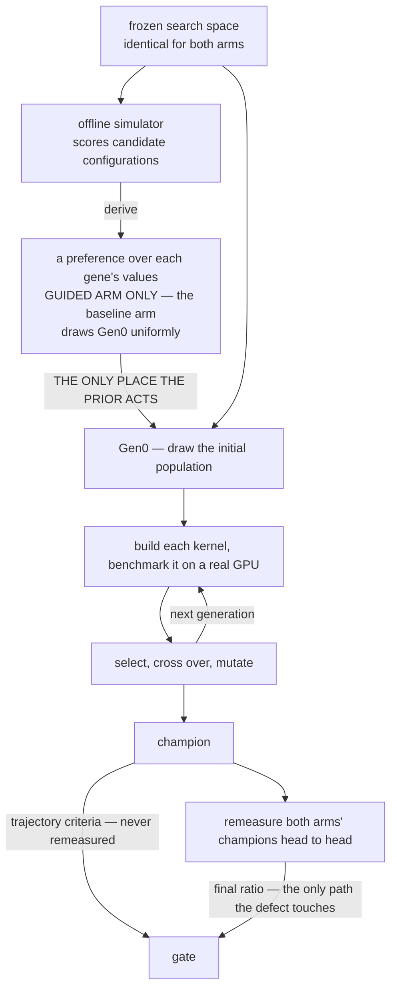

# Presentation outline — S14 closing report (Formocast Gen0 guidance × Ductile GA)

> **Authority.** The gate verdict is carried by `reports/staged/s14-guided-results.md` §5.4 and
> restated in `report-source-index.md` §7.0.1. This file states no verdict of its own.
> `full-ga-baseline-vs-guided-outcome-report.md` was **deauthorised 2026-08-18** — do not cite it.
>
> **Traceability.** Per-number citations live in `report-source-index.md`; figure provenance lives
> in `pic/README.md`. Each page here carries **one** `Sources:` line, not a citation per number.
>
> **Audience.** Internal technical review, ~2026-08-20. GPU / GEMM literate (MFMA, LDS, prefetch,
> occupancy, GFLOP/s), **no** prior knowledge of this study. Every study term defined on first use.
>
> **`outline.zh-Hant.md` mirrors this file** as of 2026-08-18. The SYNC RULE was suspended during
> the rewrite by owner decision and the mirror has since been rebuilt; English remains authoritative
> on conflict.
>
> **Date:** 2026-08-18. **Sources current as of:** `report-source-index.md` 2026-08-18 and the four
> golden documents. Where the index and a golden document disagree, **the golden document wins**.

**Page format.** Each page is: **Claim** (one sentence) · **On the slide** (what is projected —
`outline_compact.md` is generated from these blocks) · **Figure** · **Notes** (speaker notes) ·
**Sources**.

## Sections

| # | section | pages |
|---:|---|---|
| 1 | Question & Verdict | P1–P2 |
| 2 | The Two Tools | P3–P5 |
| 3 | What Can Be Tuned | P6–P7 |
| 4 | Experiment Design | P8–P11 |
| 5 | How Success Was Judged | P12–P14 |
| 6 | What the Search Budget Actually Buys | P15 |
| 7 | Results | P16–P18 |
| 8 | Measurement: the noise problem and the repair | P19–P20 |
| 9 | Insights & Future Work | P21 |

## Standing rules — stated once here, badged thereafter

**Never restate these on individual pages.**

1. **Never write "no effect."** Permitted negative wording: *"the amended sparse prior, as
   configured, did not meet the pre-registered directional gate."*
2. **`NOT MET` ≠ no effect. `NOT_EVALUATED` ≠ no effect.**
3. **Never quote large's 5/5 non-regression on its own.** It is not a gate criterion; the
   restriction hardened, not relaxed, when the fourth conjunct was removed.
4. **No `final ratio` reading may be written as a pass.** It has carried no threshold since
   2026-08-14 and `NULL-AS-NOISE-BASELINE-20260818` deliberately registered no replacement.
5. **`max`-of-7 must not appear in any acceptance or sensitivity table.** Diagnostic use only.
6. **Every dropout figure carries its criterion (`< 0.80` / `< 0.95`), population and campaign.**
   The measurement code implements **only 0.95**; the 0.80 figures are index recomputations.
7. **The four blocks must not be merged or borrow each other's noise scales.**
8. **Every 2026-08-17/18 number covers the fast layer only**; the slow layer is `NOT_EVALUATED`.
9. **No deployment / adoption / generalisation / cross-architecture claim.**

**Scale-provenance badge** — attach to every group of result numbers instead of repeating rules 6–8:

| cell | values |
|---|---|
| instrument | `nw=1400 / RBS=401` (repaired) · `nw=321 / RBS=0` (unmodified) |
| aggregation | 12-window cross-window mean · single-window median-of-7 |
| layer / span | fast layer only · whether the scale is **cross-day** |

---

### P1 — Does a Formocast Gen0 Prior Help Ductile?

**Claim:** We asked whether seeding a genetic kernel search with a model-derived prior beats seeding
it uniformly, measured it on real GPUs, and the answer is no.

**On the slide**
- Per-shape single-objective GA, two arms, 5 paired seeds, MI300X.
- **Arm G (baseline):** Gen0 samples every free gene uniformly.
  **Arm F (guided):** Gen0 samples activated genes from a Formocast-derived, entropy-capped prior.
  Everything else identical.
- All measurement complete: capped `P0 = 512` on three shapes, native `P0 = 11,405` on both
  confirmatory shapes.
- **The answer is no — the prior did not meet the pre-registered directional gate.** The
  interesting part is what it took to be able to say that.

**Figure:** *(none — 3-row status strip; draw in slides)*

**Notes**
- Formocast is a simulator, not a measurement: it returns a predicted latency with no GPU involved.
- Say "did not meet the gate", never "no effect". This page sets the tone for the deck.

**Sources:** index §1, §3.4b.4.

---

### P2 — Verdict: Gate Not Met

**Claim:** Three directional criteria, four blocks, twelve cells — none reaches the required 4/5.

**On the slide**
- The gate is a **conjunction of three** criteria, each needing `F > G` on **≥4/5** seeds.
- Twelve cells across four blocks. **None reaches 4/5.**
- All three criteria are read from the GA trajectory and **never** pass through the 7× remeasure —
  so the medium instrument defect (P19) cannot touch the verdict.
- Permitted wording: *"did not meet the pre-registered directional gate."*
- **What is claimable:** sparsity is real and reducer-independent (0 / 2 / 5 guidable genes of 27);
  the prior does move the Gen0 **centre**, and that half strengthened under a 22× pool (P17).

**Figure:** `pic/p02_gate_matrix.png`

**Notes**
- The two capped rows are the gate; the two native rows are the
  `NATIVE-P0-ROBUSTNESS-20260811` addendum — reported to the same standard, **not** gate components.
  Conflating them is the most likely misreading of the figure.
- The gate was pre-registered as **four** conjuncts. The fourth was removed as a gate component on
  2026-08-14 with no replacement threshold. **The pre-registered design file has not been amended
  and still reads four** (`s14-stage1-full-ga-outcome-design.md:226`). Verdict unaffected: the three
  remaining conjuncts fail on their own. Expect this question.
- Final-ratio readings appear on P18, deliberately not here — see that page for why.

**Sources:** index §7.0.1; `s14-guided-results.md` §5.4.

---

### P3 — Two Tools, Two Input Formats

**Claim:** Formocast answers per config, Ductile asks per gene, and the entire bridge exists to
convert one into the other.

**On the slide**
- **Ductile** — a GA design-space explorer inside TensileLite. Searches kernel configs and
  benchmarks each on a real GPU. Fitness = measured GFLOP/s.
- **Formocast** — an analytic performance simulator. Predicts latency for a **whole config**.
  No GPU involved.
- **The mismatch:** Formocast answers **per config**; Ductile asks **per gene**.
- **Ductile does not take probabilities.** Its field is `weights`, and it applies
  `w → exp(−0.25·(w − w.min()))` — **a lower weight means a higher sampling probability.**
  Feeding the prior in directly would invert the guidance.

**Figure:** *(none — two facing input-format cards; draw in slides)*

**Notes**
- Formocast returns a sentinel `9,999,999.9` when it refuses to model a config — that sentinel is
  why tiny ends up with zero activated genes (P9).
- Sampling is per-individual and independent across genes: every individual draws all 30 keys.

**Sources:** index §3.1.1, §3.6.2, §3.4b.2.

---

### P4 — Ductile's GA: 30 Generations, Two Decay Laws

**Claim:** The population decays under two laws, one of which permanently overwrites the other, and
that forces AUC to be integrated against evaluations rather than generations.

**On the slide**
- Pinned: 30 generations, population 512, tournament selection, uniform crossover (p=0.9),
  5 % elitism, early stop `period = 5`.
- **Gen0 inflation.** If any gene has more candidates than the population, Gen0 inflates to
  `int(max_candidates × 1.15)` = **11,405**. The ×1.15 is undocumented. It buys ~68 % coverage of
  the 9,918-entry pool — do not call it "covering the space".
- **Two decay laws.** Law 1 halves only the *excess* above 512. Law 2 engages the moment diversity
  drops below 0.5, floors at 256, and **permanently overwrites law 1** — no path back.
- Under native settings, **99 % of the decay to law 2's floor is done by generation 14 of 30.**
- **The two arms do not always switch laws at the same generation** — identical on large (5/5
  seeds), differing by up to 2 generations on medium. So **AUC is integrated against evaluations,
  not generation index.**

**Figure:** `pic/p04_population_decay.png`

**Notes**
- Name the unit when quoting decay progress: 99 % by generation 14 is measured to law 2's **256**
  floor; measured to the **512** steady state it is generation 8.
- Fail-open branch: if zero individuals are sampled, Ductile falls back to uniform, silently
  nulling the treatment. It did **not** fire in our runs (`Max iterations reached` ×0 in all 10
  native medium logs) — reported because a silent fail-open on the treatment channel is exactly
  what a closeout must have checked.
- Two `ga.py` copies exist (repo 756 lines, engine 346); the runs used the engine copy. A
  line-by-line divergence map is `NOT_EVALUATED`.

**Sources:** index §3.2, §3.2a, §3.2b.

---

### P5 — The Pipeline, End to End

**Claim:** One file differs between the arms, and two paths reach the gate — only one of which the
instrument defect can touch.

**On the slide**
- Frozen 30-gene space → Formocast predicts latency for 30,490 configs → five locked derivation
  steps → `ga-weights-{shape}.json` → Ductile GA → champion → 7× remeasure → gate.
- **`ga-weights-{shape}.json` is the only file that differs between the two arms.** Seeds, pins,
  evaluation and early stop are identical.
- **The prior acts exactly once, at Gen0.** After the initial population is drawn, the evolution
  loop never refers to it again — mutation picks replacement values uniformly. Everything the two
  arms do after generation 0 runs the same code, with no prior in it.
- **Two paths reach the gate.** The trajectory path (Gen0 / gen-10 / AUC) bypasses the remeasure
  entirely; the remeasure path carries the final ratio. **Only the second is exposed to the defect.**
- Step 5 — inverting Ductile's weight transform — is the step most likely to be got wrong.

**Figure:** the flowchart below, rendered wide.

**Notes**
- **The diagram is deliberately shallow.** Four things to say over it: **(A)** the `derive` edge
  hides five locked derivation steps — they are P10's page, not this one; **(B)** the
  `prior → Gen0` edge is the whole point of the slide, so draw it heaviest; **(C)** and **(D)** the
  two edges into the gate should be in contrasting colours — the trajectory path never touches the
  remeasure, the final-ratio path is the only one the medium instrument defect can reach. That
  contrast is what makes P2's framing true.
- **Where the "acts exactly once" claim comes from.** `ga.py:132-146` turns the weight lists into
  per-gene probability vectors, and their only consumer is `space.sample(p=…)` at `ga.py:626` (plus
  the half-size fallback at `:632`) — which is entered for the initial population only; generations
  2 and later never re-enter it. Mutation replaces a value with `np.random.choice` over the
  remaining candidates, i.e. **uniform** (`core/mutation.py:33`).
  ⚠ Do **not** say "the two arms are identical after Gen0". Their Gen0 populations differ, so the
  RNG streams diverge from there; the contrast is paired **by seed**, not by shared draws.
- Verified: non-activated genes resolve to exactly uniform, so the treatment is confined to the
  activated genes.

**Sources:** index §3.2, §3.4b.1, §3.4b.3; `Tensile/ductile/algorithm/ga.py`, `core/space.py`,
`core/mutation.py`.

---

### P6 — The 27 Tunable Genes

**Claim:** The 27 free genes fall into eight functional families, and **every gene that carries
signal sits in the three families on the data-supply path** — the other 16 genes never clear the
cut on either confirmatory shape.

**On the slide**
- **30 keys = 27 free genes + 3 composite group keys.** That is exactly what `best_params_so_far`
  records on every trajectory row.
- **Eight families, three of which carry all the signal.** ★ = activated for guidance
  (`S_g ≥ 0.05` **and** ≥ 2 trusted values); **0 / 2 / 5** genes on tiny / medium / large.

| category | genes | activated on medium | activated on large | best S_g medium / large |
|---|---:|---|---|---:|
| **loop structure & unrolling** — how the K loop is shaped and unrolled | 3 | `DepthU` | `UnrollLoopSwapGlobalReadOrder` | 0.142 / 0.165 |
| **global → LDS load path** — how operand data is fetched and staged | 6 | — | `PrefetchGlobalRead`, `GlobalReadVectorWidthA`, `GlobalReadVectorWidthB` | 0.039 / 0.192 |
| **LDS layout & buffering** — how LDS is laid out and how many buffers | 2 | `1LDSBuffer` | `TransposeLDS` | 0.113 / 0.057 |
| **tile mapping & DRAM channel** — which workgroup gets which tile, and where in K it starts | 4 | — | — | 0.042 / 0.022 |
| **epilogue / store path** — how results are written back to C/D | 4 | — | — | 0.017 / 0.023 |
| **cache modifiers** — `sc0` / `sc1` / `nt` bits on each operand | 4 | — | — | 0.011 / 0.004 |
| **MFMA & register allocation** — MFMA operand order and Acc-vs-Arch VGPRs | 2 | — | — | 0.022 / 0.003 |
| **instruction scheduling** — extra room for the scheduler | 2 | — | — | 0.005 / 0.006 |

- **The three live families are the data-supply path:** shape the K loop, lay out LDS, fetch the
  operands. **The five silent families are everything downstream of the MFMA** — store, cache
  hints, register allocation, scheduling, tile mapping. Their best gene tops out at `0.042`.
- **What actually shifts from medium to large is narrower than "loop → memory".** Both shapes take
  one loop-structure gene and one LDS gene. What large *adds* is the whole **global → LDS load
  path**, which goes from `0.039` (nothing selected) to `0.192` (three genes selected).

**The full inventory:**

| category | gene | n | candidate values | S_g tiny | S_g medium | S_g large |
|---|---|---:|---|---:|---:|---:|
| **loop structure & unrolling** | `DepthU` | 6 | `32, 64, 128, 256, 512, 1024` | 0.000 | **0.142** ★ | 0.029 |
|  | `UnrollLoopSwapGlobalReadOrder` | 2 | `0, 1` | 0.000 | 0.034 | **0.165** ★ |
|  | `TailloopInNll` | 2 | `false, true` | 0.000 | 0.012 | 0.010 |
| **global → LDS load path** | `PrefetchGlobalRead` | 4 | `1, 2, 3, 4` | 0.000 | 0.024 | **0.192** ★ |
|  | `GlobalReadVectorWidthA` | 7 | `-1, -2, 2, 3, 4, 6, 8` | 0.000 | 0.017 | **0.052** ★ |
|  | `GlobalReadVectorWidthB` | 7 | `-1, -2, 2, 3, 4, 6, 8` | 0.000 | 0.039 | **0.058** ★ |
|  | `WaveSeparateGlobalReadA` | 2 | `0, 2` | 0.000 | 0.001 | 0.015 |
|  | `WaveSeparateGlobalReadB` | 2 | `0, 2` | 0.000 | 0.009 | 0.008 |
|  | `DirectToVgprA` | 2 | `false, true` | — | — | — |
| **LDS layout & buffering** | `1LDSBuffer` | 2 | `0, 1` | 0.000 | **0.113** ★ | 0.022 |
|  | `TransposeLDS` | 4 | `-1, 0, 1, 2` | 0.000 | 0.029 | **0.057** ★ |
| **tile mapping & DRAM channel** | `WorkGroupMapping` | 18 | `-48, -32, -24, -16, -8, -6, -4, -2, -1, 0, 2, 4, 6, 8, 16, 24, 32, 48` | 0.000 | 0.042 | 0.022 |
|  | `WorkGroupMappingXCC` | 5 | `1, 2, 4, 8, 16` | 0.000 | 0.024 | 0.011 |
|  | `StaggerU` | 3 | `0, 8, 16` | 0.000 | 0.005 | 0.015 |
|  | `StaggerUStride` | 4 | `64, 128, 256, 512` | 0.000 | 0.014 | 0.007 |
| **epilogue / store path** | `NumElementsPerBatchStore` | 8 | `0, 2, 4, 8, 10, 12, 14, 16` | 0.000 | 0.017 | 0.023 |
|  | `StoreSyncOpt` | 3 | `0, 1, 4` | 0.000 | 0.011 | 0.011 |
|  | `AdaptiveGemm` | 2 | `0, 1` | 0.000 | 0.010 | 0.002 |
|  | `StorePriorityOpt` | 2 | `false, true` | 0.000 | 0.004 | 0.004 |
| **cache modifiers** | `NonTemporalA` | 2 | `0, 4` | 0.000 | 0.011 | 0.004 |
|  | `NonTemporalB` | 2 | `0, 4` | 0.000 | 0.003 | 0.004 |
|  | `NonTemporalC` | 2 | `0, 4` | 0.000 | 0.002 | 0.000 |
|  | `NonTemporalD` | 2 | `0, 4` | 0.000 | 0.011 | 0.004 |
| **MFMA & register allocation** | `SourceSwap` | 2 | `false, true` | 0.000 | 0.022 | 0.003 |
|  | `MIArchVgpr` | 2 | `false, true` | 0.000 | 0.002 | 0.002 |
| **instruction scheduling** | `ScheduleGROverBarrier` | 2 | `0, 1` | 0.000 | 0.001 | 0.006 |
|  | `ExtraMiLatencyLeft` | 2 | `-1, 0` | 0.000 | 0.005 | 0.003 |

- **The 3 composite group keys.** A group is one gene whose candidates are the *mutually legal
  member combinations*; the GA draws one whole entry. **None is treated in either arm** — say
  "not activated for guidance", never "frozen".

| group | family | member parameters | entries | distinct member values inside |
|---|---|---|---:|---|
| `group_0` | MFMA shape & tiling | `MatrixInstruction` · `GlobalSplitU` · `MIArchVgpr` · `WorkGroup` | **9,918** | 840 · 31 · 1 · 10 |
| `group_1` | global-read register path | `DirectToLds` · `UseSgprForGRO` | **3** of 4 | `(0,0)` `(0,1)` `(1,0)` — `(1,1)` illegal |
| `group_2` | LDS read scheduling | `ClusterLocalRead` · `LDSTrInst` | **2** of 4 | `(0,true)` `(1,false)` |

- **`group_0` is why Gen0 inflates.** 9,918 entries in one key, against 2–18 for every free gene.

**Figure:** *(none — the family summary is the slide; the full inventory is a backup slide)*

**Notes**
- **Where the families come from.** They are grouped by the inline commentary in
  `ValidParameters.py`, not by name. Worth one line out loud: **20 of the 27 genes carry their own
  comment block**; of the remaining 7, `NonTemporalA/B/C/D` are covered by a shared family comment
  (`sc0` / `sc1` / `nt` bits on gfx942) and `GlobalReadVectorWidthB` / `WaveSeparateGlobalReadB` sit
  directly under their `*A` twin's block. **No family below is invented** — but the commentary
  describes *mechanism*, not *importance*, so a family label is not a claim about performance.
- **Two genes straddle their family; say so if pressed.** `UnrollLoopSwapGlobalReadOrder` is filed
  under loop structure because it emits an extra unrolled + NGLL loop, but its stated *motive* is
  memory — "may change the TLB thrashing behaviour". `StaggerU` / `StaggerUStride` are filed under
  tile mapping because they choose *where in K* a workgroup starts, but the reason is DRAM channel
  spread (`StaggerUStride = 256` = one memory-channel width).
- **Two shapes' worth of caveat on the table.** On tiny all 26 estimable genes return exactly
  `0.000` — Formocast emits its sentinel for essentially every tiny config, so tiny's zeros are an
  absence of signal, not a measurement of no effect. `DirectToVgprA` is `—` on all three shapes:
  the estimator raises below two trusted values, so it has **no** estimate. It is not zero.
- **Near misses are worth naming if asked:** `WorkGroupMapping` on medium is `0.042` and
  `GlobalReadVectorWidthB` on medium is `0.039`, both under the `0.05` cut. Post-hoc, any cut in
  `(0.0422, 0.0520]` selects the same genes on both confirmatory shapes.
- **The gene-level crossover still holds** and is the sharpest version of the story: `DepthU` falls
  `0.142 → 0.029` from medium to large while `PrefetchGlobalRead` rises `0.024 → 0.192`. As K grows,
  the binding constraint moves from how the loop is shaped to how fast operands arrive.
- ⚠ **`MIArchVgpr` appears twice** — as a free gene with `false, true`, and inside `group_0`'s
  entries, where it is always `false` (5,448 of 9,918 entries carry it). It is not pinned by that:
  champions record it as a free gene and take `true` on **426 of 910** rows. Flag the duplication;
  the merge precedence is not documented anywhere we could find.
- **Three YAML keys are not genes.** The frozen YAML lists 30 individual keys, but
  `PrefetchLocalRead`, `GlobalSplitUAlgorithm` and `DtlPlusLdsBuf` each have a **single** candidate,
  so they carry no choice and do not appear in `guidance-*.json`. 30 − 3 = the 27 free genes.
- **Candidate values come from the frozen YAML, not from the guidance file.** `guidance-*.json`
  stores `candidate_order` as sha256 digests, so *which* value a gene's `best` and `worst` refer to
  is **not** recoverable from it — only the value *sets* above are, and those come from
  `s10-generated.yaml`.

**Sources:** `protocol/v1/inputs/s10-generated.yaml` (`ForkParameters`);
`agent_run/260809-s14-pershape-guidance/out-capped/guidance-{tiny,medium,large}.json`;
`Tensile/Common/ValidParameters.py` (family assignment); index §3.4a.2, §3.7a.

---

### P7 — What Was Held Fixed

**Claim:** The only difference between arms is the Gen0 weight file; the capped budget is a shared
boundary condition that cancels within a pair.

**On the slide**
- Same shapes, same 5 seeds, same cards (one seed → one physical GPU for both its arms), same dtype
  and architecture, same client settings, same RNG mechanism.
- **`group_0` — 9,918 entries — is outside the treatment.** GEKO-weighted, not Formocast-weighted,
  and byte-identical between arms on all three shapes.
- That matters because `group_0` alone forces the Gen0 inflation — **the whole ×1.15 expansion
  exists to cover a gene that carries no treatment.**
- Capping Gen0 shrinks `group_0` coverage, so it **affects absolute champion quality and external
  validity** — but **cannot bias the paired contrast**, because both arms draw from the same
  untreated table.
- **27 is the free-gene denominator.** Some staged artifacts still say 29; use 27.

**Figure:** *(none — two side-by-side tables; draw in slides)*

**Notes**
- Two phrasings to avoid, both false: **not** "from the same `p0`" (group_0's table is GEKO-derived
  and non-uniform), and **not** "with common Gen0 uniforms" (the arms do not share draws — pairing
  is by seed, not by shared random stream).
- Lock A was edited twice post-seal (GPU renumber, host move), `gpu.*` fields only, hash chain
  preserved and auditable.
- Forward flag: `num-warmups = 321` is identical for all three shapes. That is the defect (P19).

**Sources:** index §3.2a, §3.2c, §3.7.

---

### P8 — Three Shapes, Three Regimes

**Claim:** Three deliberately divergent regimes, not a smooth sweep — the question is whether
guidance reproduces across size diversity.

**On the slide**
- tiny `8×8×1×128` · medium `256×256×1×1024` · large `2304×1024×1×214336`.
  A degenerate toy, a mid-size square, and a deep-K production GEMM.
- **K spans ×1,674 (3.2 orders); measured throughput spans ×239,895 (5.4 orders).**
  Say which quantity you mean.
- **medium and large are confirmatory; tiny is exploratory** and is not in the gate.
- Not a sweep to be co-optimised into one compromise answer — a test of reproduction across scale.

**Figure:** `pic/p08_shape_regimes.png`

**Notes**
- large is main-loop dominated, which is why its baseline arm spans only ±4.4 % across seeds. Little
  seed-to-seed headroom bounds how large any guided effect could be — and it is the shape with the
  **most** activated genes (5).
- tiny is dispatch-bound and insensitive to the whole warm-up mechanism (P19).

**Sources:** index §3.6.1, §3.1.4.

---

### P9 — Gene Selection: Sensitivity, Prior, Guard

**Claim:** Of 27 free genes, at most 5 are guidable, the sparsity is shape-appropriate, and that
bounds what any null result means.

**On the slide**
- Three-stage funnel: **select** genes by sensitivity → **build** a prior → **guard** with an
  entropy floor.
- **Select:** a gene needs sensitivity `S_g ≥ 0.05` and at least 2 trusted values. Sensitivity is
  measured in population rank-percentile points, entirely from the model.
- **Guard:** the entropy floor sits *downstream* of selection. It cannot change which genes carry
  signal — only **how strongly** an already-chosen preference is applied.
- **Outcome: 0 / 2 / 5 genes activated** on tiny / medium / large.
- **The sparsity is shape-appropriate, not random:** `DepthU` (loop structure) passes on medium and
  fails on large; `PrefetchGlobalRead` (memory pipeline) does the exact reverse. As K grows the
  dominant genes shift from loop structure to memory pipeline — what GEMM physics predicts.
  ⚠ Keep this at gene level. Per P6's family table, *both* shapes activate one loop-structure gene
  and one LDS gene; what large **adds** is the global → LDS load path.
- **The limit this puts on any null:** the strongest available guidance was applied at reduced
  strength over 2 of 27 genes on medium. **A null is a null for a prior of that size.**

**Figure:** `pic/p09_gene_sensitivity.png`

**Notes**
- **The chart shows the 27 free genes. The other 3 keys are the composite groups**, which are
  sampled, crossed over and mutated like any other key but **carry no treatment in either arm**:

  | key | member parameters | entries |
  |---|---|---|
  | `group_0` | `MatrixInstruction` · `GlobalSplitU` · `MIArchVgpr` · `WorkGroup` | 9,918 |
  | `group_1` | `DirectToLds` · `UseSgprForGRO` | 3 of 4 legal |
  | `group_2` | `ClusterLocalRead` · `LDSTrInst` | 2 of 4 legal |

  27 free + 3 grouped = the 30 keys in `best_params_so_far`. Say "not activated for guidance",
  never "frozen". `group_0` alone is what forces the Gen0 inflation (P4, P7).
- **How `S_g` is actually computed**, in four steps (`protocol/v1/s11/statistics.py`):
  (1) Formocast predicts a latency per config; (2) within each size, rank all configs and take
  `benefit = 1 − midECDF(latency)` — a **percentile**, so absolute latency never enters, only rank;
  (3) per (gene, value) take a **shrunk** average `m = (Σb + 32·global_mean)/(n + 32)` (`:188`), so a
  value backed by few configs is pulled toward the global mean and cannot manufacture a large
  spread; (4) `S_g = max(m) − min(m)` over **trusted values only** (`:1166`).
  So `S_g = 0.142` means configs using that gene's best value sit ~**14 percentile points** higher
  in the predicted ranking than its worst value, and the `≥ 0.05` cut is 5 percentile points.
- Exactly one gene per shape (`DirectToVgprA`) has **no** sensitivity estimate — the function raises
  below two trusted values. It is not zero; the figure renders it distinctly.
- ⚠ The shipped `guidance-*.json` stores the *result* (`sensitivity`, `best`, `worst`,
  `trusted_count`) but **not the per-cell benefits**, so `S_g` cannot be re-derived from it — only
  read from the sealed source.
- On tiny the other 26 genes come back at exactly 0.000 — Formocast returns its sentinel for
  essentially every tiny config.
- Both thresholds (0.05, 0.80) are undocumented — no derivation, noise model or power analysis
  exists for either. Post-hoc robustness: any threshold in (0.0422, 0.0520] selects the same genes
  on both confirmatory shapes.

**Sources:** index §3.4c.1, §3.4c.4, §3.5.

---

### P10 — The Bridge: Configs → Gene Probabilities

**Claim:** Five locked steps convert per-config predictions into per-gene probabilities, and step 5
is the one that would fail silently.

**On the slide**
- Per-size benefit from predicted-latency rank → shrinkage marginal → softmax over trusted values →
  entropy-capped mixture with the uniform prior → **invert Ductile's weight transform**.
- Ductile's `weights` field is **cost-like, not preference-like**. Emitting the prior directly would
  make the model's best value the **least** likely draw. The derivation emits `w ∝ −4·ln(p1)`.
- **Verified end to end on the shipped file:** untrusted mass equals the uniform share exactly; the
  entropy lands on the floor to 6 decimal places; non-activated genes come out exactly uniform.

**Figure:** `pic/p10_weight_inversion.png`

**Notes**
- This is the page a hostile reviewer attacks first, because the deck itself calls step 5 the step
  most likely to be got wrong. The figure exists to close it: prior `p` → emitted `w` → realised
  sampling probability, shown monotonic and in the right direction.
- The concrete size of the intervention, to state next to any null: a prior over **2 of 27** free
  genes on medium, **5 of 27** on large.

**Sources:** index §3.4b.2, §3.4b.3.

---

### P11 — Why Gen0 Was Capped at 512

**Claim:** 512 is Ductile's own steady-state population, so the cap bounds external validity without
biasing the paired contrast — and the native addendum tests exactly that.

**On the slide**
- **512 is Ductile's own steady-state population**, not an arbitrary floor — it is the decay target
  native Ductile converges back to.
- **It does affect external validity** — the claim is scoped to the "P0-capped = 512 Ductile
  variant", not native Ductile.
- **It does not bias the paired contrast** — the capped resource is untreated and shared by both
  arms, so it cancels within a pair.
- The residual is a **treatment × budget interaction**, which is what the native addendum tests:
  identical in every respect except Gen0 scale, a **22× enlargement**.
- Three pre-registered questions: robustness, dilution, and the Gen0 extreme-value mechanism.

**Figure:** `pic/p11_gen0_pools.png`

**Notes**
- Scheduling rationale: medium first, large second — measured GPU time on seed 24001 is medium
  0.17 h vs large 5.61 h, ~33× cheaper, so medium validates the plumbing before committing days.
- Verified precondition: medium and large configs are byte-identical apart from four `ProblemSizes`
  numbers, so medium inflates to the same 11,405.

**Sources:** index §3.2, §3.3.

---

### P12 — The Gate Is a Conjunction

**Claim:** Three criteria, each ≥4/5 seeds, conjoined three ways — and all three survive the
instrument defect by exposure and monotonicity, not by averaging.

**On the slide**
- Three sub-criteria, each requiring `F > G` on **≥4/5** seeds: **Gen0 best**, **gen-10 best**,
  **AUC**. All three read from the trajectory.
- **A conjunction three times over:** all three must hold within a shape; the claim requires
  medium **and** large; and the Arm-S control only triggers if the gate is cleared somewhere.
- **AUC is integrated against evaluations, not generations** — evaluations per generation are not
  constant, so generation 20 of one arm can represent far fewer evaluations than the other's.
- **Why all three survive the defect:** they are maxima over single measurements, exposed to
  ~1.6 % of evaluations rather than 28–48 %, and one-sided-downward contamination cannot lower a
  running maximum. **Exposure and monotonicity, not averaging.**

**Figure:** `pic/p12_win_loss_per_seed.png`

**Notes**
- The figure answers what the counts cannot: **how much did each seed win or lose by.** Counts and
  magnitudes disagree — read them together.
- Residual risk, stated not buried: a genuinely strong candidate understated at its single in-search
  evaluation never becomes the incumbent, so the running-maximum argument gives no protection there.
  Not quantifiable — per-generation CSVs were not retained. `NOT_EVALUATED`.
- Arm S does not trigger; Lock C need not be sealed for this checkpoint.
- ⚠ **Two descriptions of AUC exist and they are not the same formula.** The design registers
  `A = (1/B*)·∫ log(I(u)/R_s) du` — normalised, in log space; the implementation integrates
  `best_gflops_so_far` directly. Recomputed both ways on 2026-08-18: **the counts are identical in
  all four blocks** (3/5, 3/5, 3/5, 2/5), so the verdict does not depend on which is used. State
  which one produced the reported numbers if asked.

**Sources:** index §5, §5c, §5d.

---

### P13 — Four Quantities, Four Questions

**Claim:** The same comparison read four ways, and the reason we report log-ratios is our own data.

**On the slide**
- **Raw GFLOP/s** — *how fast is this champion?* Not comparable across shapes, nor across
  instrument settings within a shape.
- **`F/G`** — *did the guided arm win on this seed?* Seeds are the experimental units. Five seeds is
  never a significance claim.
- **`ln(F/G)`** — *what is the average multiplicative effect?* On our own medium data, averaging raw
  ratios reports **+5.0 %** where the correct central tendency is **−10.7 %** — one 2.12× seed drags
  the arithmetic mean. GPU throughput noise is multiplicative.
- **A noise baseline** — *is this bigger than the instrument's jitter?* The current rule
  (`NULL-AS-NOISE-BASELINE-20260818`) uses **null cells** as the baseline, reports every available
  scale side by side, and **registers no threshold**.
- **`NOT_EVALUATED` ≠ no effect.** tiny's question is *not evaluated / not activated*, not
  "guidance doesn't work at 8×8".

**Figure:** `pic/p13_four_quantities.png`

**Notes**
- A "null" is a cell where both arms run the same kernel, so the true ratio is exactly 1.0. Two
  constructions: **G/G′** (both baseline) and **F/F′** (both guided). Not interchangeable — see P21.
- tiny is a guaranteed-zero control: byte-identical arms, 0/27 genes activated, and it still
  measures a spread. That is what makes the threshold question answerable at all (P21).

**Sources:** index §5b, §7.0.2; `measurement_design.md` §G.3.1.

---

### P14 — Noise Control, and Why Median-of-7

**Claim:** Six controls, one of which has a demonstrated blind spot, and an estimator that stands.

**On the slide**
- Six controls: G and F **interleaved in one window on one card**; a counterbalanced start arm; a
  fresh client per repeat; hard idle gating; 7 repeats per arm; and the **within-pair ratio** as the
  endpoint, which cancels card-level offsets.
- The remeasure exists because of **winner's curse** — the GA picked the champion *because* it
  measured fastest, so the in-search number is systematically optimistic, and the bias grows with
  search size.
- **The order effect is real, and pairing freezes it rather than averaging it.** On medium the
  guided kernel always runs second and second position reads low, so **the reported numbers are
  conservative, biased against the guided arm.** This reverses sign on native; do not carry it over.
- **A demonstrated blind spot in the idle gate:** it checks GPU utilisation and host load but **not
  disk I/O**. One batch ran 13 % slow, contaminated by a concurrent file copy, while the gate read
  well inside its threshold. **Passing the idle gate does not mean the environment is clean.**
- **`max`-of-7 is banned from publication** — it moves a headline count across the pre-registered
  line toward the treated arm. Diagnostic use only.

**Figure:** *(none — 7× interleaved window timeline; draw in slides)*

**Notes**
- Pre-registered estimator is median-of-7 and it stands.
- Hard counterexample against `max`: one capped campaign-1 arm has **all seven** repeats
  contaminated; `max` under-recovers by 21.4 % against the same config's clean value. Repeats inside
  one window are power-governor-correlated, not independent.
- A clean-mode mean was proposed and **withdrawn by its own proposer** after it was shown to move
  counts. The "≥3 clean repeats" rule survives as a validity classifier, not an estimator.
- Do not put the banned estimator's own count on a slide.

**Sources:** index §5(i), §7.1b.2, §7.6; `measurement_design.md` §G.4.0a.

---

### P15 — What the Search Budget Actually Buys

**Claim:** The search sits in a low-marginal-return regime, and with five seeds and a ≥4/5 rule the
detectable space was bounded before any prior was applied.

**On the slide**
- **Where the gains come from.** Gen0 → generation 10 buys **+21 % to +26 %**. Generation 10 → end
  buys **+2.7 % to +4.9 %**. By generation 10 the champion is already **95–97 %** of its final value.
- **A clean, within-run budget test.** Same seed, same arm, same config: doubling the evaluations
  past generation 10 (47 % → 100 % of the budget) moves the champion **+4.9 %** on medium and
  **+2.7 %** on large. No confound of any kind.
- **Where the budget goes.** Under the capped condition Gen0 is **~5 %** of all evaluations; under
  native it is **34–36 %**, and 82–84 % of the budget is spent by generation 10.
- **What the prior moves, for comparison.** It shifts the Gen0 population centre by **+2.5 %**
  (capped) and **+3.3 %** under a 22× pool, on 5/5 seeds — **the same order as everything a ~3×
  compute increase buys.**
- 🔴 **A 22× bigger Gen0 pool does help — but the size of the help collapses.** Compare each arm
  against *itself* at the two pool sizes, treatment held constant. **native wins on 3/5 to 5/5 seeds
  at every checkpoint, including the endpoint** — it is genuinely the better condition. But the
  *magnitude* does not carry: a Gen0 lead of **+6 % to +27 %** is down to **+1.5 % to +6.0 %** by the
  end, even though native has done **5.4× more evaluations** by generation 10 alone. On large's
  guided arm the lead goes **+27.1 % → +3.6 % → +5.9 %**.
  ⚠ One arm does not shrink at all (medium baseline: +6.0 % → +9.1 % → +6.0 %); report it.
- 🔴 **A separate and stronger result: the gate does not move at all.** The bullet above is a
  within-arm comparison, where the lead shrinks but persists. Across arms it is worse than that —
  enlarging Gen0 22× left the guided arm's gen-10 count at **1/5 on both shapes**. So the
  limitation is not that Gen0 is a small share of the budget; it is that **a Gen0 advantage, of
  either origin, does not convert into a gate-level win.**
- 🔴 **And the gate itself was underpowered.** With 5 seeds, a ≥4/5 rule fires **6/32 = 18.75 %** of
  the time under a coin-flip null; reaching 80 % power needs a per-seed win probability of
  **≈0.83**. Against per-seed noise of 0.15–9.5 % and a target effect of 1–3 %, that is unreachable.

**Figure:** `pic/p15_search_budget.png`

**Notes**
- ⚠ **This bounds the detectable space. It does not explain the null away, and it is not a claim
  that the prior is useless.** It is a power argument — say so.
- Do **not** say "3.2×". The native/capped budget ratio is a median **3.05× on medium, 3.47× on
  large**, range 2.92–4.19 across the 20 runs.
- Do **not** argue from Gen0's share of evaluations alone. An initialisation's leverage is not
  proportional to its cost, and native disproves the share argument directly: it raises Gen0's share
  sevenfold and propagation gets *worse*.
- **Reading panel 4 of the figure:** it plots **native ÷ capped within one arm** — not F vs G — and
  the metric is the **champion value** at each checkpoint, not AUC. (An AUC ratio there would read
  ~2–3× purely from native's longer integration range.) The lines fall, but they stay **above zero**:
  native still wins on 3/5 to 5/5 seeds at every checkpoint. It is the margin that shrinks, not the
  sign.
- The within-arm comparison is the strongest form of this argument because it holds the treatment
  fixed — it is not an F-vs-G contrast at all. ⚠ It is still not a pure pool manipulation: native
  differs from capped in Gen0 size **and** total budget. That cuts the safe way here — native has
  spent *more*, not less, by generation 10, and its lead still shrank.
- Supporting mechanism if pressed: the dispersion of `ln(F/G)` collapses from Gen0 to the endpoint
  (capped large 0.0952 → 0.0556), and the correlation between Gen0 position and final position is
  sign-unstable across blocks. The main loop erases Gen0 differences.
- **How the runs actually terminated — do not overstate this.** Of the 40 runs, **20 early-stopped**
  (the `period = 5` / `tol = 0.0008` criterion fired, i.e. improvement had fallen below 0.08 %) and
  **20 hit the 30-generation horizon**. Only **4 of 40** reached the horizon while still improving.
  So the correct statement is *not* "the searches had not converged" — most stopped because
  improvement had gone below tolerance. What panel 3 shows is the **gap** between the last
  improvement and the stop: median 1.5 generations on capped medium (tight, so the horizon binds)
  versus 7.0 on capped large (the tail after the champion was already fixed).
- ⚠ A run whose last improvement lands on its final generation is **not** evidence it was still
  improving if it early-stopped — on those runs the final tick was **0.03–0.05 %**, below the 0.08 %
  tolerance, which is precisely why the criterion fired.
- `B*` truncation discards up to **23.6 %** of one arm's evaluations on large capped.

**Sources:** `trajectory.jsonl`, all four blocks; index §5c.

---

### P16 — Medium: Gate Not Met, Endpoint Still Not Adjudicated

**Claim:** All three criteria fall short, the repair bought precision rather than a different
answer, and the native block cannot be judged at all.

**On the slide**
- All three trajectory criteria are **3/5** on capped; native is 2/5 · 1/5 · 3/5.
- **The final endpoint is proposed as `NOT_EVALUATED / instrument-invalid`** — neither pass nor fail
  — and is **still awaiting a ruling.** On the defective instrument, 7 repeats of a single fixed
  config spanned 3.6×–6.1×, so the median of 7 was a lottery draw.
- **On the repaired instrument, medium capped is 3/5 positive — the same count as before.**
  The repair bought **precision, not a different conclusion.**
- **Medium native is reported but not judged.** Its effect cell is clean, but *both* null cells in
  that session are out of spec, and one null is 5.7×–47× noisier than the effect it is meant to
  calibrate. A null that noisy cannot calibrate anything.
- **Two of three pre-registered Q3 predictions came back refuted, and are reported as refuted.**

**Figure:** `pic/p16_medium_three_states.png` · `pic/p16_evolution_medium.png`

**Notes**
- Badge every number here: repaired instrument, 12-window cross-window mean, fast layer only.
- These readings are **authorised for presentation, not designated as the measurement of record.**
  The cells are pilot-scope and the replacement campaign was never executed.
- The campaign-1 table is row (ii) of the four-row rule — the pre-registered analysis, unaltered.
  It is never overwritten by the post-repair estimate.
- Guard-rail: the baseline arm alone spans 6,137–13,495 GFLOP/s across seeds, so any guided effect
  sits inside a much larger seed variance. `WinnerGFlops` must never be used as an endpoint.

**Sources:** index §7.1, §7.1c, §7.1d; `s14-medium-report.md` §17, §18.

---

### P17 — Large: Gate Not Met, and Half a Mechanism Refuted

**Claim:** The gate fails in both conditions, and the Gen0 mechanism must now be presented in two
halves because direct manipulation confirmed one and refuted the other.

**On the slide**
- Capped: **1/5 · 2/5 · 3/5.** Native: **3/5 · 1/5 · 2/5.** Gate not met either way.
- **The Gen0 mechanism, in two halves.** Enlarging the pool 22× is the most direct available test of
  "concentrating probability mass shrinks the upper tail":
  - **Centre — confirmed and strengthened.** Large 1.0197 → **1.0208 (5/5)**;
    medium 1.0251 → **1.0331 (5/5)**.
  - **Upper tail — refuted.** Large's guided extreme went 0.9719 (1/5) → **1.0023 (3/5)**: under 22×
    the disadvantage did not widen, it **disappeared**. The cross-shape gradient came out with the
    opposite sign too.
- Two readings remain open and are not adjudicated: the tail effect may decay with pool size, or the
  original 1/5 may simply have been underpowered.
- On native, only one seed is consistently better — and its margin comes largely from a baseline
  champion that did not hold up on remeasure (−11.95 %, the largest winner's curse in the ten runs).
  **This is why native champions were required to run the same 7× protocol — it caught one.**

**Figure:** `pic/p17_centre_extreme.png` · `pic/p17_evolution_large.png`

**Notes**
- ⚠ **Native large's AUC cell is decided by an implementation detail, and this is new (2026-08-18).**
  The AUC integral starts at each arm's *own* Gen0 completion point, and the two arms do not finish
  Gen0 at the same evaluation count. On seed 24001 arm G's integral covers **17 evaluations more**
  than arm F's, and that sliver — multiplied by a full best-so-far value — is what makes the seed
  score AUC-negative. Start both integrals at a common lower bound and **native large's AUC becomes
  3/5 rather than 2/5**. The pre-registered analysis is reported as implemented; the verdict is
  unaffected either way (both are below 4/5). No other cell in any block changes. Disclose if asked.
- What may not be said about the 24002 result: not that GA-recorded values are systematically biased
  high, and not that the diagnostic probe's higher cluster is "the correct" one. Both
  `NOT_EVALUATED`; the report records two prior retractions on exactly that point.
- Do not convert the refuted prediction into "guidance works / does not work on large" — it
  adjudicates a *mechanism prediction*, not the gate.
- large capped's noise scale is separated from its effect cell by ~6 days.

**Sources:** index §7.2, §7.2.1; `s14-large-report.md` §10.7a, §10.7b.2.

---

### P18 — The Four Blocks Side by Side

**Claim:** The four final-ratio readings are not the same quantity, and scoring each seed against
every available noise scale disagrees with the bare counts.

**On the slide**
- **The four median `F/G` values are not the same quantity.** Two instruments, two aggregation
  methods, four different champions, and **opposite arm orders.** Do not compare them horizontally.
- Readings: medium capped **1.0135**, medium native **1.0036**, large capped **1.0006**,
  large native **0.9970**. **None is a pass** — there is no threshold.
- **What the bare counts hide.** Scoring each seed against *every* available noise scale:
  - **large capped** reads 3/5 positive, which sounds neutral — but two seeds are **consistently
    worse under every scale.**
  - **medium capped** has a seed at **39.5× the noise against one null and 3.0× against the other.**
    Not consistently anything — **scale-dependent.** That is a finding about the instrument (P21).
- Three of the four blocks compute their ratios **across days**, so the multiples are
  upper-bound-unknown.

**Figure:** `pic/p18_effect_vs_noise.png`

**Notes**
- The final ratio is here rather than on P2 because putting these four in a verdict-page hero table
  invites exactly the horizontal comparison the index forbids.
- Medium's rows are cross-window means; large's are single-window endpoints — label which is which,
  because the nulls are cross-window on both.
- The shading is the instrument's noise. **Only what protrudes beyond it counts** — upward as a win,
  downward as a loss. Several protrusions are losses.

**Sources:** index §7.0.2, §7.0.3, §7.4.

---

### P19 — The Noise Problem: What It Was, Why, and How We Fixed It

**Claim:** The medium instrument was bimodal because warm-up is specified as an enqueue count rather
than a time; raising the count fixed it, and we disconfirmed our own proposed mechanism along the way.

**On the slide**
- **The symptom.** Remeasuring *one fixed champion* 7×, on one card, in one process, inside a ~22 s
  window should be the most repeatable number in the study. On medium it is **bimodal** — arm F
  spans **6.06×**, arm G **3.61×**, within a single window.
  (A **dropout** is one repeat below **0.95 × that arm's own maximum in that window** — the counter
  used on the next page.)
- **The cause.** The client specifies warm-up as an **enqueue count, not a time**, and the count is
  **identical for all three shapes** whose kernel durations differ by three orders of magnitude.
  The same 321 enqueues buys **~3.2 ms** on medium and **~600 ms** on large — medium was being timed
  before it was warm.
- **The sweep confirms it.** Dropout falls **48 % → 32 % → 12 % → 8 % → 0 %** as warm-up grows from
  3.2 ms to 51 ms, and holds at 0 % at 103 ms. ⚠ It **turns back up to 4 %** at 205 ms — not monotone
  above the knee, and the proposed mechanism does not explain that.
- **The fix.** Warm-up count **321 → 1400**; rotating-buffer size 4096 → 401, chosen so the rotating
  footprint stays **bit-identical to production**. Same instrument, properly warmed up.
- **Which of the two settings did the work — two orthogonal single-variable controls.**
  **Buffer only**, warm-up held at 321: `39.05 % → 40.60 %`, **no reduction at all**.
  **Warm-up only**, buffer held at production 4096 and `sleep-percent` matched at 50 on both sides:
  **`42 % → 0 %`**. ⚠ The same batch at 1637 warm-ups reads **6.00 %**, not 0 % — the non-monotonicity
  again. Direction and order of magnitude are unaffected: 1.55 pp against 42 pp.
- **The honest part: we proposed a mechanism and refuted it ourselves.** The clock-ramp explanation
  predicts dropouts run at low clock. Direct 1 kHz telemetry over 42 traced repeats shows **no
  relationship** (Spearman **−0.045**, p ≈ 0.78); every repeat, clean or contaminated, reached
  ≥ 1585 MHz. **The mechanism is `NOT_EVALUATED`** — an unidentified mechanism is not an absent one.

**Figure:** *(none — this page is the narrative; the evidence figures are backup slides:*
`pic/p19_defect_storyboard.png` *for the symptom and the sweep,*
`pic/apx_clock_disconfirmation.png` *for the refutation)*

**Notes**

- Quote the turn-up, not just the descent. A descent-only reading of the sweep is wrong.
- **Two claims this forced us to retract:** that the contamination cancels in the paired ratio (it
  does not — it is one-sided), and that the search was unaffected because the fitness statistic sat
  in a clean band (that argument was replaced with a valid one).
- The decisive confound test is within-card, within-shape: medium's own pilot ran on the same card
  with 0/21 dropouts while its remeasure records 28 %. The card cannot be the discriminating variable.
- Instrument limit: at ~8 ms effective resolution the trace cannot resolve what the clock did inside
  a 3.2 ms warm-up. The clock account is **disfavoured, not excluded.**
- An earlier draft's "warm-up only: 42 % → 4 %" was **not single-variable** — `sleep-percent` moved
  50 → 0 as well. The matched pair on the slide is the corrected one.

**Sources:** index §7.1a, §7.1b, §7.5; `medium_mechanism_probe_summary.json`;
`medium_warmup_rbs4096_confirm_summary.json`; `medium_pilot401/results/{A,B}/summary.json`.

---

### P20 — What the Repair Bought

**Claim:** The reading got one to two orders of magnitude tighter at pilot scale, and the conclusion
did not move.

**On the slide**
- **The measurement itself got 19× to 100× tighter.** Per-seed cross-window sd of `ln(F/G)` falls
  from **0.25–0.43** to **0.0032–0.0194**, and **every seed improves.** This is the number that
  decides whether an effect is readable at all.
- **The QC counter follows.** Dropout on capped: **45.71 %** (campaign 1) and **24.29 %**
  (campaign 2) → **7.50 %**, confirmed at **6.43 %** on a repeat of the same cell; native
  **47.14 % → 6.55 %**.
- **What it did not buy: the answer.** The directional count is **3/5 before and 3/5 after.** The
  repair bought precision, not a different conclusion.
- **Scope, stated up front:** this is validated at **pilot scale — 12 windows per seed.**
- **A retraction, because it was ours.** An earlier draft claimed the repair "even flipped the
  direction". **Withdrawn** — the baseline cell is 4/5 positive with a standard error far too wide
  to support any direction claim.

**Figure:** `pic/p20_repair_dumbbell.png`

**Notes**

- Why campaign 1 is dirtier than campaign 2 is `NOT_EVALUATED` — that is why both "before" values
  are on the slide rather than only the flattering one.
- Panel 1 compares the two **12-window pilot cells** that differ only in the warm-up count
  (`A` = 321, `C03` = 1400). Panel 2's "before" values are the **1-window** campaign remeasures,
  70 repeats each; its "after" values are the 12-window repaired cells, 840 repeats each. Different
  populations — do not compute a ratio across the two panels.
- Dispersion figures are **capped only**; native has no reference cell and cannot borrow them.
- The canonical tree is in a deliberate mixed state (capped holds campaign 1, native holds
  campaign 2) and is not to be reconciled. Anyone re-deriving numbers will hit it.

**Sources:** index §7.5; `s14-medium-report.md` §18.1–§18.2;
`medium_pilot401/results/{A,C03,C03CONF,STAGE2_NATIVE}/summary.json`.

---

### P21 — One Thing Worth the Tuning Team's Time

**Claim:** We ran the same search forty times and it found a different kernel every time. If the
tile-tuning pipeline behaves the same way, some merge decisions at the 3 % gate are being made by
luck — and one extra tuning run would show whether they are.

**On the slide**

**What we saw**

- We ran the same search **40 times**, changing nothing but the random seed.
- It found a **different kernel every single time.** Not a small variation — a different macro tile.
- Between runs, the kernels they produced differed in performance by up to **7 %**.

**Why that might matter to you**

- Macro tile tuning runs the search **once** per tile, then merges the result if it beats the
  baseline by **3 %**.
- If your tuner is also this inconsistent, then whether a tile clears 3 % depends partly on which run
  you happened to get.
- ⚠ **We cannot tell you your number.** Our search also chose the macro tile. Yours fixes the tile
  first and only tunes the rest, so ours is noisier by an amount we cannot estimate.

**The check, and it is cheap**

- Tune **one** macro tile **twice**, changing only the random seed. Benchmark both the usual way.
  Compare the two uplifts.
- **If they land on opposite sides of 3 %, the merge decision is being made by luck.**
- Cost: one extra tile tuning — 2 to 3 hours.

**Two smaller things**

- **Benchmarking on more sizes will not fix it.** All 100 sizes run the same kernel. So whichever
  kernel that one run happened to find carries straight through to the geomean.
- **The end of a run may be nearly free to cut.** In ours the last fifth of the budget bought
  **0.2 %**. Worth a look in your own logs.

**What we would change in our own design**

- Read the code to confirm where the treatment actually applies, before committing a campaign to it.
- Do not decide anything by counting how many seeds won.
- Get the measurement rig right at full scale before the science run, not after it.

**Figure:** *(none — this page is prose; the null-scale backup slide is* `pic/apx_null_scales.png`*)*

**Notes**

- **The numbers behind "different kernel every time".** Across five seeds the search landed on 3 to 5
  different macro tiles, in every one of the eight block-arm combinations. `group_0` carries
  `MatrixInstruction` and `WorkGroup`, which set the macro tile; `DepthU` is a separate gene.
- **The numbers behind "up to 7 %".** Coefficient of variation of the final champion across the ten
  runs in a block: 7.1 % on medium capped, 3.5 % on large capped, 3.7 % and 2.1 % under native.
- ⚠ **Choosing different tiles does not explain the spread**, so do not offer that as the mechanism.
  On large capped all five seeds picked different tiles and the spread was only 3.5 %; on medium
  capped, also five different tiles, the spread was 7.1 %.
- **On the roadmap's planned fitness-metric comparison** (average vs max-min vs lowest variance):
  budget for repeated runs of each. This study is a worked example of comparing two search
  configurations with five samples each and getting an answer set by luck.
- **We are not proposing to guide tile or instruction choice with an analytical model.** That is
  Origami's own work and already on the roadmap. Our prior deliberately never touched `group_0`.
- **Transferability, stated plainly.** We optimise one problem size; macro tile tuning optimises about
  fifteen jointly with an average fitness. That may well produce a more generic and less variable
  kernel. Every number here is from our setting.
- **If asked whether more compute fixes it:** best-of-3 gives +11.5 % on medium capped and narrows
  the spread, but costs 3×. At equal cost restarting loses. A tighter early stop also fails — it
  saves 4–14 % but the worst run loses 14.6 %.
- **If asked how many seeds would be enough:** we decline to project. Extrapolating from a five-seed
  win rate assumes the seed acts like a coin with a fixed bias, and when luck dominates it does not.
  One number is exempt: `≥ 4/5` fires 18.75 % of the time when the two arms are byte-identical,
  computed under the exact null.
- **There is no admissible significance threshold on this instrument** — tiny's arms are
  byte-identical, true effect exactly zero, and it still measures a 13.3 % envelope. Backup:
  `pic/apx_null_scales.png`.

**Sources:** `trajectory.jsonl`, all four blocks (`best_params_so_far.group_0` and `DepthU` for the
tile counts; run-to-run spread; restart and early-stop simulations);
`protocol/v1/inputs/s10-generated.yaml` (`Groups`); `Tensile/ductile/algorithm/ga.py`,
`core/mutation.py`; `meeting_notes/GEMM-Optimization-Roadmap-Origami-Tile-Selection-摘要.md`
§3.1–§3.3, §7; index §3.4c, §5c, §7.4.

---

## Residual uncertainty — speaker notes

- The mechanism behind the warm-up correlation is `NOT_EVALUATED` (clock disconfirmed, not excluded).
- Cross-window repeatability data exists; **cross-session / cross-day data on the repaired
  instrument does not**, for any block. Three of four blocks compute ratios across days.
- Whether in-search contamination is arm-symmetric: `NOT_EVALUATED`, not retrospectively checkable.
- Why campaign 1 is dirtier than campaign 2: unexplained. Two denominators circulate — pooled
  `n = 140` (46.4 % vs 27.1 %) and capped-only `n = 70` (45.71 % vs 24.29 %). Do not mix them.
- A line-by-line divergence map between the repo and engine copies of `ga.py`: `NOT_EVALUATED`.
  The runs executed the engine copy; every `ga.py:NNN` citation resolves against the repo copy.
- The repair is validated at **pilot scale**, and at the production rotating footprint reached via
  the capped buffer setting rather than at the production buffer setting itself.
- tiny appears as a control on P13 and P21 but in no evolution or win/loss figure — it is
  exploratory and not gated.
- On large capped, `B*` truncation discards **20–24 %** of one arm's evaluations on seeds
  24003/24004/24005, because the arms early-stop at different generations. Stated nowhere else.
- Native large's AUC cell is sensitive to the integral's start point (P17 notes): 2/5 as
  implemented, 3/5 from a common lower bound. Verdict unaffected.
