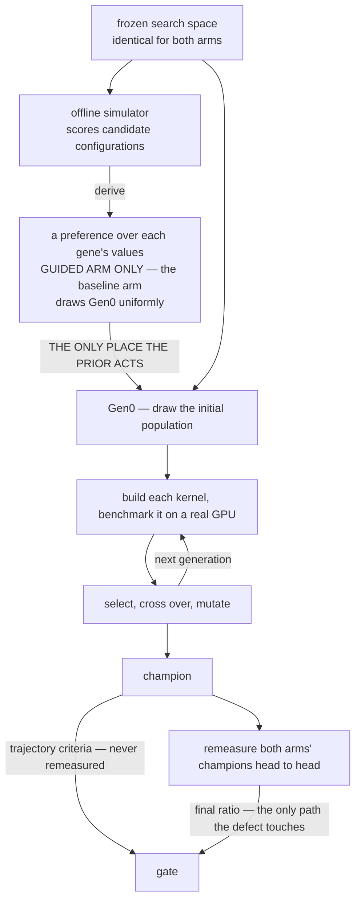

# 簡報大綱(繁中鏡像)— S14 closing report(Formocast Gen0 guidance × Ductile GA)

> **權威。** gate 判定由 `reports/staged/s14-guided-results.md` §5.4 承載,並在
> `report-source-index.md` §7.0.1 複述。本檔不自行給出任何判定。
> `full-ga-baseline-vs-guided-outcome-report.md` 已於 **2026-08-18 解除授權** —— 不得引用。
>
> **可追溯性。** 逐數字的引用放在 `report-source-index.md`;圖表出處放在 `pic/README.md`。
> 本檔每一頁只帶**一條** `Sources:` 行,不是每個數字一條引用。
>
> **聽眾。** 內部技術審查,約 2026-08-20。具備 GPU / GEMM 素養(MFMA、LDS、prefetch、occupancy、
> GFLOP/s),但對本研究**沒有**任何先備知識。每一個研究專屬名詞都在首次出現時定義。
>
> ⚠ **本繁中鏡像已依 2026-08-18 的** `[outline.md](outline.md)` **重建。** 兩份衝突時,一律以英文版
> 為權威。
>
> **日期:** 2026-08-18。**來源截止於:** `report-source-index.md` 2026-08-18,以及四份 golden 文件。
> 當 index 與 golden 文件不一致時,**以 golden 文件為準**。

**頁面格式。** 每一頁依序是:**主張**(一句話)· **投影片上放什麼**(投影出來的東西 ——
`outline_compact.md` 由這些區塊產生)· **圖表** · **講者備忘** · **來源**。

## Sections

| #   | section             | pages   |
| --- | ------------------- | ------- |
| 1   | 問題與判定               | P1–P2   |
| 2   | 兩套工具                | P3–P5   |
| 3   | 什麼可以調               | P6–P7   |
| 4   | 實驗設計                | P8–P11  |
| 5   | 成功如何判定              | P12–P14 |
| 6   | 搜尋預算實際買到了什麼         | P15     |
| 7   | 結果                  | P16–P18 |
| 8   | 量測:噪音問題與修復 | P19–P20 |
| 9   | Insights 與後續工作 | P21     |

## 常設規則 —— 只在這裡陳述一次,之後一律以徽章帶過

**絕對不要在個別頁面上重述這些。**

1. **絕對不要寫「no effect」。** 允許的負面措辭:*「the amended sparse prior, as configured, did not
  meet the pre-registered directional gate.」*
2. `NOT MET` **≠ no effect。**`NOT_EVALUATED` **≠ no effect。**
3. **絕不單獨引用 large 的 5/5 non-regression。** 它不是 gate 準則;第四項連言被移除時,這條限制是
  變嚴而不是放寬。
4. **任何** `final ratio` **讀數都不得寫成 pass。** 它自 2026-08-14 起就不帶門檻,而
  `NULL-AS-NOISE-BASELINE-20260818` 是刻意不登錄替代門檻。
5. `max`**-of-7 不得出現在任何 acceptance 或 sensitivity 表。** 僅供診斷。
6. **每一個 dropout 數字都要帶上它的判準(**`< 0.80` **/** `< 0.95`**)、母體與 campaign。**
  量測程式**只**實作 0.95;0.80 的數字是 index 的重算。
7. **四個區塊不得合併,也不得互借彼此的雜訊尺度。**
8. **每一個 2026-08-17/18 的數字都只涵蓋 fast 層**;slow 層是 `NOT_EVALUATED`。
9. **不得有任何 deployment / adoption / generalisation / cross-architecture 主張。**

**尺度來源徽章** —— 掛在每一組結果數字旁邊,取代重複規則 6–8:

| 格位     | 取值                                              |
| ------ | ----------------------------------------------- |
| 儀器     | `nw=1400 / RBS=401`(修復後)· `nw=321 / RBS=0`(未修改) |
| 彙整     | 12 視窗跨視窗平均 · 單視窗 median-of-7                    |
| 層 / 跨度 | 僅 fast 層 · 該尺度是否**跨日**                          |

---

### P1 — Formocast Gen0 prior 幫得上 Ductile 嗎?

**主張：** 我們問的是,用模型導出的 prior 為基因式 kernel 搜尋播種,是否勝過均勻播種;我們在真實 GPU
上把它量了出來,而答案是否定的。

**投影片內容**

- Per-shape 單目標 GA、兩臂、5 對 paired seed、MI300X。
- **Arm G(baseline):** Gen0 對每一個 free gene 都均勻抽樣。
**Arm F(guided):** Gen0 對被 activate 的 gene 從 Formocast 導出、經 entropy cap 的 prior 抽樣。
其餘一切完全相同。
- 量測全部完成:三個 shape 上的 capped `P0 = 512`,兩個 confirmatory shape 上的 native
`P0 = 11,405`。
- **答案是 No** —— 而有意思的部分是,要能夠這樣說出口,得付出什麼。

**圖表：** *(無 —— 3 列狀態帶;在投影片裡畫)*

**講者備忘**

- Formocast 是模擬器,不是量測:它回傳的是預測延遲,完全沒有 GPU 參與。
- 要說「did not meet the gate」,絕不要說「no effect」。這一頁替整份簡報定調。

**來源：** index §1, §3.4b.4.

---

### P2 — 判定:gate 未達成

**主張：** 三項方向性準則、四個區塊、十二格 —— 沒有任何一格達到要求的 4/5。

**投影片內容**

- 這道 gate 是**三項準則的連言**,每一項都要求在 **≥4/5** 顆 seed 上 `F > G`。
- 四個區塊共十二格。**沒有任何一格達到 4/5。**
- 三項準則全都是從 GA 軌跡讀出來的,**完全不**經過 7× 重測 —— 所以 medium 的儀器缺陷(P19)碰不到
判定。
- 允許的措辭:*「did not meet the pre-registered directional gate.」*
- **什麼是可以宣稱的:** 稀疏性是真的,而且與 reducer 無關(27 個 gene 裡有 0 / 2 / 5 個可被
guidance);這個 prior 確實移動了 Gen0 的**中心**,而那一半在 22× 池之下還變得更強(P17)。

**圖表：** `pic/p02_gate_matrix.png`

**講者備忘**

- 兩個 capped 列才是 gate;兩個 native 列是 `NATIVE-P0-ROBUSTNESS-20260811` addendum ——
以同樣標準報告,但**不是** gate 組成。把兩者混為一談,是這張圖最可能被誤讀的地方。
- 這道 gate 當初是以**四項**連言預先註冊的。第四項於 2026-08-14 被移除其 gate 組成的地位,且未登錄
替代門檻。**預先註冊的設計檔至今未修訂,仍然寫著四項**
(`s14-stage1-full-ga-outcome-design.md:226`)。判定不受影響:剩下三項自己就不通過。這個問題一定
會被問。
- final-ratio 讀數出現在 P18,刻意不放在這一頁 —— 理由見那一頁。

**來源：** index §7.0.1; `s14-guided-results.md` §5.4.

---

### P3 — 兩套工具,兩種輸入格式

**主張：** Formocast 是逐 config 回答,Ductile 是逐 gene 發問,而整座橋接的存在,就只是為了把前者轉成
後者。

**投影片內容**

- **Ductile** —— TensileLite 裡的 GA 設計空間探索器。它搜尋 kernel config,並把每一個放到真實 GPU 上
benchmark。Fitness = 實測 GFLOP/s。
- **Formocast** —— 一個分析式效能模擬器。它為**整個 config** 預測延遲。完全沒有 GPU 參與。
- **不匹配之處:** Formocast **逐 config** 回答;Ductile **逐 gene** 發問。
- **Ductile 不吃機率。** 它的欄位叫 `weights`,而且它套用的是
`w → exp(−0.25·(w − w.min()))` —— **weight 越低,被抽中的機率越高。** 直接把 prior 餵進去,會把
guidance 整個反轉。

**圖表：** *(無 —— 兩張對放的輸入格式卡;在投影片裡畫)*

**講者備忘**

- 當 Formocast 拒絕為某個 config 建模時,它回傳哨兵值 `9,999,999.9` —— 那個哨兵值就是 tiny 最後
activate 到零個 gene 的原因(P9)。
- 抽樣是逐個體、且跨 gene 獨立的:每一個個體都會把全部 30 個 key 抽過一遍。

**來源：** index §3.1.1, §3.6.2, §3.4b.2.

---

### P4 — Ductile 的 GA:30 個世代、兩條衰減律

**主張：** 族群依兩條律衰減,其中一條會永久覆寫另一條,而這件事迫使 AUC 必須對 evaluation 數積分,
而不是對世代積分。

**投影片內容**

- 已固定的設定:30 個世代、族群 512、tournament selection、uniform crossover(p=0.9)、5 %
elitism、early stop `period = 5`。
- **Gen0 膨脹。** 若任一 gene 的候選數多過族群大小,Gen0 就會膨脹到 `int(max_candidates × 1.15)`
= **11,405**。這個 ×1.15 沒有任何文件說明。它買到的是 9,918 筆池子約 68 % 的覆蓋率 —— 不要把它
說成「涵蓋了整個空間」。
- **兩條衰減律。** 律 1 只把超出 512 的*超額部分*減半。律 2 在多樣性一掉到 0.5 以下就啟動,底線是
256,而且**永久覆寫律 1** —— 沒有回頭路。
- 在 native 設定下,**衰減到律 2 底線的進度,有 99 % 在第 30 代裡的第 14 代就走完了。**
- **兩臂並不總是在同一代切換律** —— 在 large 上完全一致(5/5 顆 seed),在 medium 上最多差到 2 個
世代。所以 **AUC 是對 evaluation 積分,不是對世代索引積分。**

**圖表：** `pic/p04_population_decay.png`

**講者備忘**

- 引用衰減進度時要講清楚單位:「第 14 代達到 99 %」是量到律 2 的 **256** 底線;若量到 **512** 穩態,
那是第 8 代。
- Fail-open 分支:若一個個體都沒抽到,Ductile 會退回均勻抽樣,無聲地把處理效果歸零。它在我們的執行
裡**沒有**觸發(10 份 native medium log 裡 `Max iterations reached` 出現 ×0 次)—— 之所以報告,
是因為處理通道上的無聲 fail-open 正是一份 closeout 必須查過的東西。
- 存在兩份 `ga.py`(repo 756 行、engine 346 行);執行時用的是 engine 那一份。逐行差異對照表是
`NOT_EVALUATED`。

**來源：** index §3.2, §3.2a, §3.2b.

---

### P5 — 端到端的流水線

**主張：** 兩臂之間只有一個檔案不同,而通往 gate 的有兩條路徑 —— 其中只有一條會被儀器缺陷碰到。

**投影片內容**

- 凍結的 30-gene 空間 → Formocast 為 30,490 個 config 預測延遲 → 五個鎖定的推導步驟 →
`ga-weights-{shape}.json` → Ductile GA → champion → 7× 重測 → gate。
- `ga-weights-{shape}.json` **是兩臂之間唯一不同的檔案。** Seed、各項 pin、evaluation 與 early stop
全都相同。
- **這個 prior 只作用一次,就在 Gen0。** 初始族群抽完之後,演化迴圈就再也不會參考它 —— 突變挑替
代值是均勻抽的。兩臂在第 0 代之後做的每一件事,跑的都是同一份程式碼,裡面沒有 prior。
- **有兩條路徑通往 gate。** 軌跡路徑(Gen0 / gen-10 / AUC)完全繞過重測;重測路徑承載 final ratio。
**只有第二條暴露在缺陷之下。**
- 第 5 步 —— 反轉 Ductile 的 weight 變換 —— 是最容易做錯的一步。

**圖表：** 下方這張流程圖,拉寬呈現。

**講者備忘**

- **這張圖是刻意畫淺的。** 對著它要講四件事:**(A)** `derive` 這條邊底下藏著五個鎖定的推導步驟
—— 那是 P10 的頁面,不是這一頁;**(B)** `prior → Gen0` 這條邊就是整張投影片的重點,線要畫得最
重;**(C)** 與 **(D)** 兩條進 gate 的邊要用對比色 —— 軌跡那條完全不碰重測,final ratio 那條才
是 medium 儀器缺陷唯一構得到的路徑。這個對比正是讓 P2 的框架成立的東西。
- **「只作用一次」這個說法的出處。** `ga.py:132-146` 把 weight 清單轉成逐 gene 的機率向量,而它
們唯一的消費點是 `ga.py:626` 的 `space.sample(p=…)`(加上 `:632` 的半量 fallback)—— 那裡只有
初始族群會進去,第 2 代以後永遠不再進入。突變挑替代值用的是 `np.random.choice`,在其餘候選值上
是**均勻**的(`core/mutation.py:33`)。
⚠ **不要**說「兩臂在 Gen0 之後完全相同」。它們的 Gen0 族群本來就不同,RNG 串流從那裡就發散了;
這個對比是**依 seed 配對**,不是靠共用的抽樣。
- 已驗證:未被 activate 的 gene 會解析成完全均勻,所以處理效果被侷限在被 activate 的 gene 上。

**來源：** index §3.2, §3.4b.1, §3.4b.3;`Tensile/ductile/algorithm/ga.py`、`core/space.py`、
`core/mutation.py`。

---

### P6 — 27 個可調的 gene

**主張：** 27 個 free gene 可以歸成八個功能族,而**每一個帶訊號的 gene 都落在資料供應路徑上的那三
族** —— 其餘 16 個 gene 在兩個 confirmatory shape 上都沒有通過切點。

**投影片內容**

- **30 個 key = 27 個 free gene + 3 個 composite group key。** 這正是每一列軌跡上
`best_params_so_far` 所記錄的東西。
- **八個族,其中三族吃掉了全部訊號。** ★ = 被 activate 做 guidance(`S_g ≥ 0.05` **而且** trusted
value ≥ 2 個);tiny / medium / large 各為 **0 / 2 / 5** 個 gene。

| 類別 | gene 數 | medium 上被 activate | large 上被 activate | 最高 S_g medium / large |
|---|---:|---|---|---:|
| **迴圈結構與展開** —— K 迴圈怎麼被塑形、怎麼被展開 | 3 | `DepthU` | `UnrollLoopSwapGlobalReadOrder` | 0.142 / 0.165 |
| **global → LDS 載入路徑** —— 運算元資料怎麼被抓進來、怎麼暫存 | 6 | — | `PrefetchGlobalRead`, `GlobalReadVectorWidthA`, `GlobalReadVectorWidthB` | 0.039 / 0.192 |
| **LDS 佈局與緩衝** —— LDS 怎麼排、用幾個 buffer | 2 | `1LDSBuffer` | `TransposeLDS` | 0.113 / 0.057 |
| **tile 對應與 DRAM channel** —— 哪個 workgroup 拿哪一塊 tile,以及從 K 的哪裡起算 | 4 | — | — | 0.042 / 0.022 |
| **收尾與寫回路徑** —— 結果怎麼寫回 C/D | 4 | — | — | 0.017 / 0.023 |
| **cache modifier** —— 每個運算元上的 `sc0` / `sc1` / `nt` 位元 | 4 | — | — | 0.011 / 0.004 |
| **MFMA 與暫存器配置** —— MFMA 運算元順序,以及 Acc 對 Arch VGPR | 2 | — | — | 0.022 / 0.003 |
| **指令排程** —— 給排程器的額外空間 | 2 | — | — | 0.005 / 0.006 |

- **活著的那三族就是資料供應路徑:** 塑形 K 迴圈、鋪好 LDS、把運算元抓進來。**沉默的那五族全都在
MFMA 的下游** —— 寫回、cache 提示、暫存器配置、排程、tile 對應。它們最高的 gene 也只到 `0.042`。
- **從 medium 到 large 真正位移的東西,比「迴圈 → 記憶體」窄。** 兩個 shape 都各取一個迴圈結構
gene 與一個 LDS gene。large 多**加**進來的是整條 **global → LDS 載入路徑**,它從 `0.039`(一個
都沒選)跳到 `0.192`(選了三個)。

**完整清單:**

| 類別 | gene | n | 候選值 | S_g tiny | S_g medium | S_g large |
|---|---|---:|---|---:|---:|---:|
| **迴圈結構與展開** | `DepthU` | 6 | `32, 64, 128, 256, 512, 1024` | 0.000 | **0.142** ★ | 0.029 |
|  | `UnrollLoopSwapGlobalReadOrder` | 2 | `0, 1` | 0.000 | 0.034 | **0.165** ★ |
|  | `TailloopInNll` | 2 | `false, true` | 0.000 | 0.012 | 0.010 |
| **global → LDS 載入路徑** | `PrefetchGlobalRead` | 4 | `1, 2, 3, 4` | 0.000 | 0.024 | **0.192** ★ |
|  | `GlobalReadVectorWidthA` | 7 | `-1, -2, 2, 3, 4, 6, 8` | 0.000 | 0.017 | **0.052** ★ |
|  | `GlobalReadVectorWidthB` | 7 | `-1, -2, 2, 3, 4, 6, 8` | 0.000 | 0.039 | **0.058** ★ |
|  | `WaveSeparateGlobalReadA` | 2 | `0, 2` | 0.000 | 0.001 | 0.015 |
|  | `WaveSeparateGlobalReadB` | 2 | `0, 2` | 0.000 | 0.009 | 0.008 |
|  | `DirectToVgprA` | 2 | `false, true` | — | — | — |
| **LDS 佈局與緩衝** | `1LDSBuffer` | 2 | `0, 1` | 0.000 | **0.113** ★ | 0.022 |
|  | `TransposeLDS` | 4 | `-1, 0, 1, 2` | 0.000 | 0.029 | **0.057** ★ |
| **tile 對應與 DRAM channel** | `WorkGroupMapping` | 18 | `-48, -32, -24, -16, -8, -6, -4, -2, -1, 0, 2, 4, 6, 8, 16, 24, 32, 48` | 0.000 | 0.042 | 0.022 |
|  | `WorkGroupMappingXCC` | 5 | `1, 2, 4, 8, 16` | 0.000 | 0.024 | 0.011 |
|  | `StaggerU` | 3 | `0, 8, 16` | 0.000 | 0.005 | 0.015 |
|  | `StaggerUStride` | 4 | `64, 128, 256, 512` | 0.000 | 0.014 | 0.007 |
| **收尾與寫回路徑** | `NumElementsPerBatchStore` | 8 | `0, 2, 4, 8, 10, 12, 14, 16` | 0.000 | 0.017 | 0.023 |
|  | `StoreSyncOpt` | 3 | `0, 1, 4` | 0.000 | 0.011 | 0.011 |
|  | `AdaptiveGemm` | 2 | `0, 1` | 0.000 | 0.010 | 0.002 |
|  | `StorePriorityOpt` | 2 | `false, true` | 0.000 | 0.004 | 0.004 |
| **cache modifier** | `NonTemporalA` | 2 | `0, 4` | 0.000 | 0.011 | 0.004 |
|  | `NonTemporalB` | 2 | `0, 4` | 0.000 | 0.003 | 0.004 |
|  | `NonTemporalC` | 2 | `0, 4` | 0.000 | 0.002 | 0.000 |
|  | `NonTemporalD` | 2 | `0, 4` | 0.000 | 0.011 | 0.004 |
| **MFMA 與暫存器配置** | `SourceSwap` | 2 | `false, true` | 0.000 | 0.022 | 0.003 |
|  | `MIArchVgpr` | 2 | `false, true` | 0.000 | 0.002 | 0.002 |
| **指令排程** | `ScheduleGROverBarrier` | 2 | `0, 1` | 0.000 | 0.001 | 0.006 |
|  | `ExtraMiLatencyLeft` | 2 | `-1, 0` | 0.000 | 0.005 | 0.003 |

- **那 3 個 composite group key。** 一個 group 是一個 gene,它的候選值是*彼此合法的成員組合*;GA
會抽出一整筆。**兩臂都沒有任何一個被處理** —— 要說「未被 activate 做 guidance」,絕不要說「凍
結」。

| group | 族 | 成員參數 | 條目數 | 條目裡各成員的相異值數 |
|---|---|---|---:|---|
| `group_0` | MFMA 形狀與 tiling | `MatrixInstruction` · `GlobalSplitU` · `MIArchVgpr` · `WorkGroup` | **9,918** | 840 · 31 · 1 · 10 |
| `group_1` | global read 的暫存器路徑 | `DirectToLds` · `UseSgprForGRO` | 4 取 **3** | `(0,0)` `(0,1)` `(1,0)` —— `(1,1)` 不合法 |
| `group_2` | LDS 讀取排程 | `ClusterLocalRead` · `LDSTrInst` | 4 取 **2** | `(0,true)` `(1,false)` |

- **`group_0` 就是 Gen0 膨脹的原因。** 單一個 key 裡有 9,918 筆,對比每個 free gene 只有 2–18 個。

**圖表：** *(無 —— 族的摘要表就是投影片;完整清單當備援投影片)*

**講者備忘**

- **這些族是怎麼來的。** 是依 `ValidParameters.py` 的行內註解歸的,不是依名字。值得口頭講一句:
**27 個 gene 裡有 20 個自己就帶註解區塊**;剩下 7 個之中,`NonTemporalA/B/C/D` 由一段共用的家族
註解涵蓋(gfx942 上的 `sc0` / `sc1` / `nt` 位元),而 `GlobalReadVectorWidthB` 與
`WaveSeparateGlobalReadB` 就直接接在它們 `*A` 雙胞胎的註解區塊底下。**下面沒有任何一族是編出來
的** —— 但註解描述的是*機制*,不是*重要性*,所以族的標籤不是關於效能的主張。
- **有兩個 gene 跨在族的邊界上,被追問就講。** `UnrollLoopSwapGlobalReadOrder` 歸在迴圈結構,因為
它多產生一個 unrolled 加 NGLL 迴圈,但它註解裡寫的*動機*是記憶體 ——「可能改變 TLB thrashing 的
行為」。`StaggerU` / `StaggerUStride` 歸在 tile 對應,因為它們決定一個 workgroup *從 K 的哪裡*
起算,但理由是把流量散到 DRAM channel 上(`StaggerUStride = 256` 就是一個記憶體通道的寬度)。
- **這張表要附上兩個 shape 的但書。** 在 tiny 上,26 個可估計的 gene 全都回傳剛好 `0.000` ——
幾乎每一個 tiny config,Formocast 都吐出它的哨兵值,所以 tiny 的那些零是「沒有訊號」,不是「量
到沒有效果」。`DirectToVgprA` 在三個 shape 上都是 `—`:trusted value 少於兩個時估計式會直接
raise,所以它**沒有**估計值。它不是零。
- **如果被追問,擦邊的值值得點名:** medium 上的 `WorkGroupMapping` 是 `0.042`、
`GlobalReadVectorWidthB` 是 `0.039`,兩個都在 `0.05` 切點之下。事後看,`(0.0422, 0.0520]` 區間
裡的任何切點,在兩個 confirmatory shape 上都會選出同一組 gene。
- **gene 層級的交叉依然成立**,而且是這個故事最銳利的版本:`DepthU` 從 medium 到 large 是
`0.142 → 0.029`,而 `PrefetchGlobalRead` 是 `0.024 → 0.192`。隨著 K 變大,綁住效能的限制從「迴
圈怎麼塑形」移到「運算元多快送到」。
- ⚠ **`MIArchVgpr` 出現了兩次** —— 一次是候選值為 `false, true` 的 free gene,一次在 `group_0` 的
條目裡,而在那裡它永遠是 `false`(9,918 筆中有 5,448 筆帶著它)。它並沒有因此被釘死:champion
是把它當 free gene 記錄的,而且在 **910 列中有 426 列**取 `true`。要把這個重複標出來;這個合併
的優先順序,我們在任何地方都找不到文件。
- **YAML 裡有三個 key 不是 gene。** 凍結的 YAML 列了 30 個個別 key,但 `PrefetchLocalRead`、
`GlobalSplitUAlgorithm` 與 `DtlPlusLdsBuf` 各自只有**一個**候選值,所以它們不承載任何選擇,也
不出現在 `guidance-*.json` 裡。30 − 3 就是那 27 個 free gene。
- **候選值來自凍結的 YAML,不是來自 guidance 檔。** `guidance-*.json` 把 `candidate_order` 存成
sha256 摘要,所以一個 gene 的 `best` 與 `worst` 指的到底是*哪一個值*,從它那裡是**還原不出來**
的 —— 只有上表那些值的*集合*可以,而那些來自 `s10-generated.yaml`。

**來源：** `protocol/v1/inputs/s10-generated.yaml`(`ForkParameters`);
`agent_run/260809-s14-pershape-guidance/out-capped/guidance-{tiny,medium,large}.json`;
`Tensile/Common/ValidParameters.py`(族的歸類);index §3.4a.2, §3.7a。

---

### P7 — 什麼被固定住了

**主張：** 兩臂之間唯一的差別是 Gen0 的 weight 檔;capped 預算是兩臂共用的邊界條件,在配對之內會
抵銷掉。

**投影片內容**

- 相同的 shape、相同的 5 顆 seed、相同的卡(一顆 seed → 兩臂共用同一張實體 GPU)、相同的 dtype 與
架構、相同的 client 設定、相同的 RNG 機制。
- `group_0` **—— 9,918 筆 —— 在處理範圍之外。** 它是 GEKO 加權而不是 Formocast 加權,而且在三個
shape 上兩臂之間都 byte-identical。
- 這件事之所以重要,是因為光是 `group_0` 就迫使 Gen0 膨脹 —— **整個 ×1.15 的擴張,存在的目的就是去
涵蓋一個不帶任何處理的 gene。**
- 把 Gen0 cap 住會縮小 `group_0` 的覆蓋率,所以它**影響絕對的 champion 品質與外部效度** —— 但
**不可能讓配對比較產生偏誤**,因為兩臂是從同一張未被處理的表抽樣。
- **27 才是 free-gene 的分母。** 有些 staged artifact 還寫 29;請用 27。

**圖表：** *(無 —— 兩張並排的表;在投影片裡畫)*

**講者備忘**

- 兩個要避免的說法,兩個都是假的:**不是**「來自同一個 `p0`」(group_0 的表是 GEKO 導出的,而且
非均勻),也**不是**「共用 Gen0 均勻抽樣」(兩臂並不共用抽樣 —— 配對是依 seed,不是依共用的隨機
數流)。
- Lock A 在封存後被編輯過兩次(GPU 重新編號、換 host),只動了 `gpu.*` 欄位,hash chain 保留且可
稽核。
- 向前旗標:`num-warmups = 321` 在三個 shape 上完全相同。那就是那個缺陷(P19)。

**來源：** index §3.2a, §3.2c, §3.7.

---

### P8 — 三個 shape,三種型態

**主張：** 這是三個刻意分歧的型態,不是一條平滑的掃描 —— 問題在於 guidance 能不能跨尺寸多樣性重現。

**投影片內容**

- tiny `8×8×1×128` · medium `256×256×1×1024` · large `2304×1024×1×214336`。一個退化的玩具、一個
中等大小的方陣,以及一個 deep-K 的生產級 GEMM。
- **K 跨了 ×1,674(3.2 個數量級);實測 throughput 跨了 ×239,895(5.4 個數量級)。** 講的時候要說
清楚你指的是哪一個量。
- **medium 與 large 是 confirmatory;tiny 是 exploratory**,而且不在 gate 之內。
- 這不是一條要被共同最佳化成單一折衷答案的掃描 —— 而是一次跨尺度的重現測試。

**圖表：** `pic/p08_shape_regimes.png`

**講者備忘**

- large 由主迴圈主導,所以它的 baseline 臂跨 seed 只有 ±4.4 % 的跨幅。seed 之間幾乎沒有餘裕,這本身
就限制了任何 guided 效果能有多大 —— 而它偏偏是 activate 了**最多** gene(5 個)的那個 shape。
- tiny 受 dispatch 限制,對整套 warm-up 機制完全不敏感(P19)。

**來源：** index §3.6.1, §3.1.4.

---

### P9 — Gene 篩選:敏感度、prior、guard

**主張：** 27 個 free gene 裡最多只有 5 個可被 guidance,這種稀疏性是符合 shape 的,而這件事限定了
任何 null 結果能有什麼意義。

**投影片內容**

- 三階段漏斗:依敏感度**選出** gene → **建立** prior → 用 entropy floor **把關**。
- **選出:** 一個 gene 需要敏感度 `S_g ≥ 0.05`,而且至少要有 2 個 trusted value。敏感度是以族群
rank-percentile 點數衡量,完全來自模型。
- **把關:** entropy floor 位在選擇的*下游*。它改變不了哪些 gene 帶有訊號 —— 只能改變一個已經選定
的偏好被套用得**多強**。
- **結果:tiny / medium / large 上分別 activate 了 0 / 2 / 5 個 gene。**
- **這種稀疏性是符合 shape 的,不是隨機的:** `DepthU`(迴圈結構)在 medium 上通過、在 large 上不
通過;`PrefetchGlobalRead`(記憶體管線)剛好完全相反。隨著 K 變大,主導的 gene 從迴圈結構移向
記憶體管線 —— 這正是 GEMM 物理所預測的。
⚠ 這句話要停在 gene 層級。依 P6 的族表,*兩個* shape 都各 activate 了一個迴圈結構 gene 與一個
LDS gene;large 多**加**進來的是 global → LDS 載入路徑。
- **這對任何 null 設下的限制:** 在 medium 上,可用的最強 guidance 是以被降低過的強度、套在 27 個
gene 中的 2 個上。**一個 null,是「那種大小的 prior」的 null。**

**圖表：** `pic/p09_gene_sensitivity.png`

**講者備忘**

- **圖上畫的是 27 個 free gene。另外 3 個 key 是複合 group**,它們和其他任何 key 一樣會被抽樣、
交配、突變,但**在兩臂都不帶任何 treatment**:

  | key | 成員參數 | 條目數 |
  |---|---|---|
  | `group_0` | `MatrixInstruction` · `GlobalSplitU` · `MIArchVgpr` · `WorkGroup` | 9,918 |
  | `group_1` | `DirectToLds` · `UseSgprForGRO` | 4 個合法中的 3 個 |
  | `group_2` | `ClusterLocalRead` · `LDSTrInst` | 4 個合法中的 2 個 |

  27 個 free 加 3 個 grouped,就是 `best_params_so_far` 裡的 30 個 key。要說「沒有被 activate
  來接受 guidance」,絕對不要說「凍結」。光是 `group_0` 就是逼出 Gen0 膨脹的原因(P4、P7)。
- `S_g` **實際上是怎麼算出來的**,分成四步(`protocol/v1/s11/statistics.py`):(1) Formocast 對
每一個 config 預測一個延遲;(2) 在每一個 size 之內把所有 config 排名,取
`benefit = 1 − midECDF(latency)` —— 這是一個**百分位**,所以絕對延遲從來不會進來,只有排名會
進來;(3) 對每一組 (gene, value) 取一個**收縮過**的平均
`m = (Σb + 32·global_mean)/(n + 32)`(`:188`),所以一個只有少數 config 撐著的值會被拉向全域平
均,製造不出很大的跨幅;(4) **只在 trusted value 上**取 `S_g = max(m) − min(m)`(`:1166`)。
所以 `S_g = 0.142` 的意思是:用那個 gene 最好的值的 config,在預測排名裡比用它最差的值的高出
約 **14 個百分位點**,而 `≥ 0.05` 這道切點是 5 個百分位點。
- 每個 shape 都恰好有一個 gene(`DirectToVgprA`)**沒有**敏感度估計 —— 它的 trusted value 少於兩
個。它不是零;圖裡把它畫得不一樣。
- ⚠ 出貨的 `guidance-*.json` 存的是*結果*(`sensitivity`、`best`、`worst`、`trusted_count`),但
**不存逐格的 benefit**,所以 `S_g` 沒辦法從它反推出來 —— 只能從封存的來源讀。
- 在 tiny 上,其餘 26 個 gene 全都回來剛好是 0.000 —— 幾乎每一個 tiny config,Formocast 都回傳它的
哨兵值。
- 兩個門檻(0.05, 0.80)都沒有文件說明 —— 兩者都不存在推導、雜訊模型或檢定力分析。事後穩健性:
(0.0422, 0.0520] 區間裡的任何門檻,在兩個 confirmatory shape 上都會選出同一組 gene。

**來源：** index §3.4c.1, §3.4c.4, §3.5.

---

### P10 — 橋接:從 config 到 gene 機率

**主張：** 五個鎖定的步驟把逐 config 的預測轉成逐 gene 的機率,而第 5 步是那個會無聲失敗的步驟。

**投影片內容**

- 由預測延遲的排名得出 per-size benefit → shrinkage marginal → 對 trusted value 做 softmax →
與均勻 prior 做 entropy-capped 混合 → **反轉 Ductile 的 weight 變換**。
- Ductile 的 `weights` 欄位是**成本式的,不是偏好式的**。直接把 prior 送出去,會讓模型認為最好的那個
值變成**最不可能**被抽到的值。這套推導送出的是 `w ∝ −4·ln(p1)`。
- **在實際出貨的檔案上做過端到端驗證:** untrusted 的質量剛好等於均勻份額;entropy 落在 floor 上,
精確到小數點後 6 位;未被 activate 的 gene 出來剛好是均勻的。

**圖表：** `pic/p10_weight_inversion.png`

**講者備忘**

- 這是敵意審查者會第一個攻擊的一頁,因為簡報自己就說了第 5 步是最容易做錯的一步。這張圖存在的目的
就是把它關掉:prior `p` → 送出的 `w` → 實際的抽樣機率,畫出來是單調的、而且方向正確。
- 介入的具體規模,要擺在任何 null 旁邊一起講:在 medium 上是 **27 個中的 2 個** free gene 的 prior,
在 large 上是 **27 個中的 5 個**。

**來源：** index §3.4b.2, §3.4b.3.

---

### P11 — 為什麼 Gen0 被 cap 在 512

**主張：** 512 是 Ductile 自己的穩態族群大小,所以這個 cap 限制的是外部效度,而不會讓配對比較產生
偏誤 —— 而 native addendum 測的正是這一點。

**投影片內容**

- **512 是 Ductile 自己的穩態族群大小**,不是隨手挑的底線 —— 它是 native Ductile 衰減後會收斂回去
的目標。
- **它確實影響外部效度** —— 主張的範圍被限定在「P0-capped = 512 的 Ductile 變體」,不是 native
Ductile。
- **它不會讓配對比較產生偏誤** —— 被 cap 的資源未被處理,而且兩臂共用,所以在配對之內就抵銷掉了。
- 殘留下來的是 **treatment × budget 交互作用**,而那正是 native addendum 要測的:除了 Gen0 的規模
之外每一項都相同,規模放大 **22×**。
- 三個預先註冊的問題:穩健性、稀釋,以及 Gen0 極值機制。

**圖表：** `pic/p11_gen0_pools.png`

**講者備忘**

- 排程理由:medium 先、large 後 —— seed 24001 上實測的 GPU 時間是 medium 0.17 h 對 large 5.61 h,
便宜約 33×,所以先用 medium 把整套管路驗過,再投入好幾天的機器時間。
- 已驗證的前提:medium 與 large 的 config 除了四個 `ProblemSizes` 數字之外 byte-identical,所以
medium 也會膨脹到同樣的 11,405。

**來源：** index §3.2, §3.3.

---

### P12 — 這道 gate 是一個連言

**主張：** 三項準則,每一項都要 ≥4/5 顆 seed,而且連言了三次 —— 而前三項之所以撐得過儀器缺陷,靠的
是暴露程度與單調性,不是靠平均。

**投影片內容**

- 三項子準則,每一項都要求在 **≥4/5** 顆 seed 上 `F > G`:**Gen0 best**、**gen-10 best**、**AUC**。
三項全都是從軌跡讀出來的。
- **連言了三次:** 一個 shape 之內三項必須同時成立;主張同時需要 medium **與** large;而 Arm-S 對照
只有在某處通過 gate 時才會啟動。
- **AUC 是對 evaluation 積分,不是對世代積分** —— 每一代的 evaluation 數不是常數,所以某一臂的第 20
代所代表的 evaluation 數,可能遠少於另一臂的。
- **前三項為什麼撐得過這個缺陷:** 它們是對單次量測所取的最大值,暴露到的只有約 1.6 % 的
evaluation,而不是 28–48 %,而且單向朝下的污染不可能把一個 running maximum 拉低。**靠的是暴露
程度與單調性,不是平均。**

**圖表：** `pic/p12_win_loss_per_seed.png`

**講者備忘**

- 這張圖回答的是計數回答不了的事:**每一顆 seed 到底贏多少、輸多少。** 計數與幅度並不一致 —— 要
一起讀。
- 殘留風險,要講出來而不是埋起來:一個真正很強的候選,如果在搜尋中那唯一一次 evaluation 被低估,
它就永遠不會成為在位者,所以 running-maximum 那套論證在這裡完全提供不了保護。這件事無法量化 ——
逐代的 CSV 沒有保留下來。`NOT_EVALUATED`。
- Arm S 沒有啟動;這個 checkpoint 不需要封存 Lock C。
- ⚠ **AUC 存在兩種說法,而它們不是同一條公式。** 設計登錄的是
`A = (1/B*)·∫ log(I(u)/R_s) du` —— 正規化過、在 log 空間裡;實作則是直接對
`best_gflops_so_far` 積分。2026-08-18 用兩種算法都重算過:**四個區塊的計數完全一致**
(3/5, 3/5, 3/5, 2/5),所以判定並不取決於用的是哪一種。若被問到,要講清楚報出來的數字是哪一種
算的。

**來源：** index §5, §5c, §5d.

---

### P13 — 四個量,四個問題

**主張：** 同一個比較的四種讀法,而我們之所以報告 log-ratio,理由來自我們自己的資料。

**投影片內容**

- **原始 GFLOP/s** —— *這個 champion 有多快?* 不能跨 shape 比較,在同一個 shape 之內也不能跨儀器
設定比較。
- `F/G` —— *在這一顆 seed 上,guided 臂贏了嗎?* Seed 才是實驗單位。五顆 seed 從來就不是顯著性
主張。
- `ln(F/G)` —— *平均的乘性效果是多少?* 在我們自己的 medium 資料上,對原始比值取平均會報出
**+5.0 %**,而正確的集中趨勢是 **−10.7 %** —— 一顆 2.12× 的 seed 把算術平均拖走了。GPU throughput
的雜訊是乘性的。
- **一把雜訊基準** —— *這個效果有沒有大過儀器本身的抖動?* 目前的規則
(`NULL-AS-NOISE-BASELINE-20260818`)以 **null 格**作為基準,把每一把可得的尺度並排報出,而且
**不登錄任何門檻**。
- `NOT_EVALUATED` **≠ no effect。** tiny 的問題是*未評估 / 未 activate*,不是「guidance 在 8×8 上
沒有用」。

**圖表：** `pic/p13_four_quantities.png`

**講者備忘**

- 所謂「null」,是指兩臂跑同一個 kernel 的格,所以真實比值剛好是 1.0。有兩種構造:**G/G′**(兩邊
都是 baseline)與 **F/F′**(兩邊都是 guided)。兩者不可互換 —— 見 P21。
- tiny 是一個保證為零的對照:兩臂 byte-identical、0/27 個 gene 被 activate,而它仍然量到一個
離散度。正是這件事,讓門檻這個問題變得可以回答(P21)。

**來源：** index §5b, §7.0.2; `measurement_design.md` §G.3.1.

---

### P14 — 雜訊控制,以及為什麼是 median-of-7

**主張：** 六項控制,其中一項有已被證實的盲點,以及一個站得住腳的估計量。

**投影片內容**

- 六項控制:G 與 F **在同一張卡、同一個視窗內交錯**;起始臂做 counterbalance;每次重複都用全新的
client;硬性 idle gating;每臂 7 次重複;以及把**配對內比值**當作端點,這會抵銷掉卡層級的偏移。
- 重測之所以存在,是因為 **winner's curse** —— GA 之所以挑中這個 champion,*正是因為*它量起來最快,
所以搜尋中的那個數字帶有系統性的樂觀偏誤,而且偏誤會隨搜尋規模變大。
- **順序效應是真的,而配對是把它凍住,不是把它平均掉。** 在 medium 上,guided kernel 總是跑第二,
而第二個位置量起來偏低,所以**報告出來的數字是保守的、對 guided 臂不利的。** 這件事在 native 上
會反號;不要把它套過去。
- **idle gate 有一個已被證實的盲點:** 它檢查 GPU 使用率與 host 負載,但**不檢查 disk I/O**。有一批
跑慢了 13 %,被同時進行的檔案複製污染,而 gate 讀到的值還遠在門檻之內。**通過 idle gate 不代表
環境是乾淨的。**
- `max`**-of-7 禁止出現在發表內容裡** —— 它會把一個頭條計數推過預先註冊的那條線,而且是往受測臂的
方向推。僅供診斷。

**圖表：** *(無 —— 7× 交錯視窗時間軸;在投影片裡畫)*

**講者備忘**

- 預先註冊的估計量是 median-of-7,而它站得住。
- 反對 `max` 的硬性反例:有一個 capped campaign-1 的臂,**七次重複全部**被污染;`max` 相對於同一個
config 的乾淨值低估了 21.4 %。同一個視窗之內的重複之間有 power-governor 相關,並不獨立。
- 曾有人提出 clean-mode 平均,後來在被證明會移動計數之後,**由提案者自己撤回**。「≥3 次乾淨重複」
這條規則以效度分類器的身分留了下來,而不是估計量。
- 不要把那個被禁的估計量自己的計數放上投影片。

**來源：** index §5(i), §7.1b.2, §7.6; `measurement_design.md` §G.4.0a.

---

### P15 — 搜尋預算實際買到了什麼

**主張：** 這場搜尋位在邊際報酬很低的區域,而在五顆 seed 加 ≥4/5 規則之下,可偵測的空間在任何 prior
被套上去之前就已經被限死了。

**投影片內容**

- **增益從哪裡來。** Gen0 → 第 10 代買到 **+21 % 到 +26 %**。第 10 代 → 結束買到 **+2.7 % 到
+4.9 %**。到第 10 代時,champion 已經是它最終值的 **95–97 %**。
- **一個乾淨的、執行之內的預算測試。** 同一顆 seed、同一臂、同一個 config:把第 10 代之後的
evaluation 加倍(從預算的 47 % 到 100 %),在 medium 上把 champion 推高 **+4.9 %**,在 large 上
推高 **+2.7 %**。沒有任何一種混淆。
- **預算花到哪裡去。** 在 capped 條件下,Gen0 佔全部 evaluation 的 **約 5 %**;在 native 下是
**34–36 %**,而且到第 10 代就已經花掉 82–84 % 的預算。
- **這個 prior 移動了什麼,拿來對照。** 它把 Gen0 族群的中心推移了 **+2.5 %**(capped),在 22× 池
之下推移 **+3.3 %**,兩者都是 5/5 顆 seed —— **和一次約 3× 的算力增加所買到的一切,是同一個
量級。**
- 🔴 **大 22× 的 Gen0 池確實有幫助 —— 但幫助的幅度會塌掉。** 把每一臂拿去和*它自己*在兩種池大小
下相比,treatment 保持不變。**native 在每一個 checkpoint 上都贏 3/5 到 5/5 顆 seed,端點也包含
在內** —— 它確實是比較好的那個條件。但*幅度*帶不下去:Gen0 時 **+6 % 到 +27 %** 的領先,到結束
時只剩 **+1.5 % 到 +6.0 %**,即使光是到第 10 代為止,native 就已經多做了 **5.4× 的 evaluation**。
在 large 的 guided 臂上,這個領先是 **+27.1 % → +3.6 % → +5.9 %**。
⚠ 有一臂完全沒有縮小(medium baseline:+6.0 % → +9.1 % → +6.0 %);要把它報出來。
- 🔴 **另一個獨立而且更強的結果:這道 gate 根本沒有被推動。** 上一條是同一臂內的比較,那裡的領先
是縮小但仍然存在。跨臂看則更糟 —— 把 Gen0 放大 22×,guided 臂的 gen-10 計數在**兩個 shape 上都
停在 1/5**。所以限制不在於 Gen0 只佔預算的一小部分,而在於 **無論來源為何,一個 Gen0 的優勢都
沒有轉換成 gate 層級的勝出。**
- 🔴 **而且這道 gate 本身檢定力不足。** 在 5 顆 seed 之下,≥4/5 規則在硬幣翻面的 null 之下會有
**6/32 = 18.75 %** 的機率觸發;要達到 80 % 檢定力,需要每顆 seed 的勝率 **≈0.83**。對照
0.15–9.5 % 的逐 seed 雜訊與 1–3 % 的目標效果,那是達不到的。

**圖表：** `pic/p15_search_budget.png`

**講者備忘**

- ⚠ **這限定的是可偵測的空間。它並沒有把這個 null 解釋掉,也不是在主張這個 prior 沒有用。** 它是一
個檢定力論證 —— 要這樣說出來。
- **不要**說「3.2×」。native/capped 的預算比中位數是 **medium 3.05×、large 3.47×**,在那 20 次執行
裡的範圍是 2.92–4.19。
- **不要**只拿 Gen0 佔 evaluation 的比例來論證。一次初始化的槓桿並不與它的成本成正比,而 native
直接反證了比例論證:它把 Gen0 的佔比拉高七倍,而傳播反而*更差*。
- **這張圖第 4 格怎麼讀:** 它畫的是**同一臂內的 native ÷ capped** —— 不是 F 對 G —— 而且用的指標
是每個 checkpoint 上的 **champion 值**,不是 AUC。(在那裡放 AUC 比值會單純因為 native 的積分
範圍比較長而讀出約 2–3×。)這些線會往下掉,但它們**都待在零以上**:native 在每一個 checkpoint
上都還是贏 3/5 到 5/5 顆 seed。縮掉的是幅度,不是正負號。
- 臂內的比較是這個論證最強的形式,因為它把 treatment 固定住了 —— 它根本不是 F 對 G 的對比。
⚠ 它仍然不是一個純粹的池操作:native 和 capped 的差別在 Gen0 大小**以及**總預算兩件事上。
這裡它是往安全的那一邊切 —— 到第 10 代為止 native 花掉的是*更多*而不是更少,而它的領先還是縮
了。
- 若被追問,可以講的支撐機制:`ln(F/G)` 的離散度從 Gen0 到端點是塌縮的(capped large 0.0952 →
0.0556),而 Gen0 位置與最終位置的相關性在各區塊之間符號不穩定。主迴圈把 Gen0 的差異抹掉了。
- **這些執行實際上是怎麼終止的 —— 不要說過頭。** 40 次執行裡,**20 次是 early stop**
(`period = 5` / `tol = 0.0008` 這個條件觸發,也就是改善已經掉到 0.08 % 以下),另外 **20 次是
撞到第 30 代的天花板**。只有 **40 次裡的 4 次**是還在改善的狀態下被天花板截斷。所以正確的說法
*不是*「這些搜尋還沒收斂」—— 大多數是因為改善已經低於容忍值才停的。第 3 格真正呈現的是最後一
次改善與停下來之間的**間距**:capped medium 的中位數是 1.5 代(很緊,所以是天花板在綁),對比
capped large 的 7.0 代(champion 早就定住之後的那條尾巴)。
- ⚠ 一次執行的最後一次改善落在它的最後一代,**並不**代表它當時還在改善 —— 如果它是 early stop,
那些執行的最後一跳只有 **0.03–0.05 %**,低於 0.08 % 的容忍值,而那正是條件觸發的原因。
- `B*` 截斷在 large capped 上丟掉某一臂多達 **23.6 %** 的 evaluation。

**來源：** `trajectory.jsonl`,四個區塊全部;index §5c.

---

### P16 — Medium:gate 未達成,端點仍未裁定

**主張：** 三項準則全都不足,修復買到的是精度而不是不同的答案,而 native 區塊根本無法被判定。

**投影片內容**

- 三項軌跡準則在 capped 上都是 **3/5**;native 是 2/5 · 1/5 · 3/5。
- **最終端點被提案為** `NOT_EVALUATED / instrument-invalid` —— 既不是通過也不是失敗 —— 而且**仍在
等待裁決。** 在有缺陷的儀器上,單一固定 config 的 7 次重複跨了 3.6×–6.1×,所以那個 median of 7
是抽獎。
- **在修復後的儀器上,medium capped 是 3/5 為正 —— 和修復前同一個計數。** 修復買到的是**精度,
不是不同的結論。**
- **medium native 有報告,但沒有判定。** 它的效應格是乾淨的,但那個 session 裡*兩個* null 格都不合
規格,而其中一個 null 比它本該校準的那個效應還吵 5.7×–47×。這麼吵的 null 校準不了任何東西。
- **三項預先註冊的 Q3 預測裡,有兩項回來是被反駁的,而且就以被反駁報告。**

**圖表：** `pic/p16_medium_three_states.png` · `pic/p16_evolution_medium.png`

**講者備忘**

- 這裡每一個數字都要掛徽章:修復後儀器、12 視窗跨視窗平均、僅 fast 層。
- 這些讀數**獲授權呈現,但未被指定為 measurement of record。** 這些格屬於 pilot 範圍,而替代
campaign 從未執行過。
- campaign-1 那張表是四列規則裡的第 (ii) 列 —— 預先註冊的分析,未經更動。它永遠不會被修復後的估計
覆寫。
- 護欄:光是 baseline 臂跨 seed 就從 6,137 跨到 13,495 GFLOP/s,所以任何 guided 效果都落在一個大得
多的 seed 變異裡面。`WinnerGFlops` 絕不可以拿來當端點。

**來源：** index §7.1, §7.1c, §7.1d; `s14-medium-report.md` §17, §18.

---

### P17 — Large:gate 未達成,而且有半個機制被反駁

**主張：** 兩種條件下 gate 都不成立,而 Gen0 機制現在必須分成兩半來呈現,因為直接操縱證實了其中
一半、反駁了另一半。

**投影片內容**

- Capped:**1/5 · 2/5 · 3/5。** Native:**3/5 · 1/5 · 2/5。** 兩種條件下 gate 都未達成。
- **Gen0 機制,分成兩半。** 把池子放大 22×,是對「把機率質量集中起來會縮小上尾」這個說法最直接
可行的測試:
  - **中心 —— 被證實,而且變強了。** large 1.0197 → **1.0208(5/5)**;
  medium 1.0251 → **1.0331(5/5)**。
  - **上尾 —— 被反駁。** large 的 guided 極值從 0.9719(1/5)變成 **1.0023(3/5)**:在 22× 之下,
  劣勢並沒有擴大,而是**消失了**。跨 shape 的梯度符號也出來是相反的。
- 有兩種讀法仍然開放,而且不予裁定:尾部效應可能隨池子大小衰減,或者原本那個 1/5 本來就只是檢定力
不足。
- 在 native 上只有一顆 seed 是持續較好的 —— 而它的優勢有很大一部分來自一個在重測時沒有撐住的
baseline champion(−11.95 %,十次執行裡最大的 winner's curse)。**這正是為什麼 native champion
也被要求跑同一套 7× 協定 —— 它抓到了一個。**

**圖表：** `pic/p17_centre_extreme.png` · `pic/p17_evolution_large.png`

**講者備忘**

- ⚠ **native large 的 AUC 格是由一個實作細節決定的,而且這是新的(2026-08-18)。** AUC 積分是從每
一臂*自己*的 Gen0 完成點開始的,而兩臂並不是在同一個 evaluation 數上完成 Gen0。在 seed 24001 上,
arm G 的積分比 arm F 多涵蓋了 **17 次 evaluation**,而那一小條 —— 乘上一個完整的 best-so-far
值 —— 就是讓這顆 seed 的 AUC 記成負的原因。若把兩個積分都從一個共同的下界開始,**native large 的
AUC 會變成 3/5 而不是 2/5**。預先註冊的分析就照實作的樣子報告;不論哪一邊,判定都不受影響(兩者
都低於 4/5)。任何區塊裡的其他格都不會變。被問到就揭露。
- 關於 24002 那個結果,不可以說的是:不可以說 GA 記錄的值有系統性偏高,也不可以說診斷探針裡較高的
那一叢是「正確的」那一叢。兩者都是 `NOT_EVALUATED`;報告裡記載了正是在這一點上的兩次先前撤回。
- 不要把那個被反駁的預測轉譯成「guidance 在 large 上有用 / 沒用」 —— 它裁定的是一個*機制預測*,
不是那道 gate。
- large capped 的雜訊尺度與它的效應格相隔約 6 天。

**來源：** index §7.2, §7.2.1; `s14-large-report.md` §10.7a, §10.7b.2.

---

### P18 — 四個區塊並排

**主張：** 這四個 final-ratio 讀數不是同一個量,而把每一顆 seed 對照每一把可得的雜訊尺度計分,結果
與光看計數並不一致。

**投影片內容**

- **四個中位** `F/G` **值不是同一個量。** 兩種儀器、兩種彙整方式、四個不同的 champion,以及**相反的
臂序**。不要橫向比較它們。
- 讀數:medium capped **1.0135**、medium native **1.0036**、large capped **1.0006**、large native
**0.9970**。**沒有任何一個是 pass** —— 根本沒有門檻。
- **光看計數藏起了什麼。** 把每一顆 seed 對照*每一把*可得的雜訊尺度計分:
  - **large capped** 讀起來是 3/5 為正,聽起來像是中性的 —— 但有兩顆 seed 在**每一把尺度之下都持續
  較差。**
  - **medium capped** 有一顆 seed,**對照其中一個 null 是雜訊的 39.5×,對照另一個則是 3.0×。**
  它不持續是任何東西 —— 而是**取決於尺度。** 那是一個關於儀器的發現(P21)。
- 四個區塊裡有三個是**跨日**計算比值的,所以那些倍數的上界是未知的。

**圖表：** `pic/p18_effect_vs_noise.png`

**講者備忘**

- final ratio 放在這一頁而不是 P2,是因為把這四個放進判定頁的頭條表,正好會招來 index 明令禁止的
那種橫向比較。
- medium 的列是跨視窗平均,large 的列是單視窗端點 —— 要標明哪一列是哪一種,因為兩邊的 null 都是
跨視窗的。
- 陰影就是儀器的雜訊。**只有突出到它外面的才算數** —— 往上算贏,往下算輸。有好幾個突出的是輸的。

**來源：** index §7.0.2, §7.0.3, §7.4.

---

### P19 — 噪音問題:是什麼、為什麼、怎麼修的

**主張：** medium 儀器之所以雙峰,是因為 warm-up 是以 enqueue 次數而非時間指定;把次數提高就修好
了,而且我們在過程中親手否證了自己提出的機制。

**投影片內容**
- **症狀。** 把*同一顆固定的 champion* 在同一張卡、同一個 process、~22 s 的視窗內重測 7×,
本該是全研究最可重複的數字。在 medium 上它是**雙峰**的 —— 單一個視窗內,arm F 跨距 **6.06×**、
arm G **3.61×**。
(一個 **dropout** 是單次重複低於**該臂在該視窗自己最大值的 0.95 倍**—— 下一頁用的就是這個計數。)
- **原因。** client 把 warm-up 指定成 **enqueue 次數而不是時間**,而且**三個 shape 用同一個數字**,
但它們的 kernel 時長差三個數量級。同樣 321 次,在 medium 買到 **~3.2 ms**、在 large 買到
**~600 ms** —— medium 是在還沒暖起來的時候就被計時了。
- **掃描佐證。** warm-up 從 3.2 ms 拉到 51 ms,dropout 由 **48 % → 32 % → 12 % → 8 % → 0 %**,
到 103 ms 維持 0 %。⚠ 到 205 ms 又**回升到 4 %** —— 拐點之上並非單調,而所提出的機制解釋不了這件事。
- **修法。** warm-up 次數 **321 → 1400**;rotating-buffer 由 4096 降到 401,這樣選是為了讓
rotating footprint 與 production **位元相同**。同一台儀器,只是被正確暖機。
- **兩個設定裡是哪一個做的事 —— 兩個正交的單變數對照。**
**只改 buffer**、warm-up 固定在 321:`39.05 % → 40.60 %`,**完全沒有下降**。
**只改 warm-up**、buffer 固定在 production 的 4096 且 `sleep-percent` 兩邊都是 50:
**`42 % → 0 %`**。⚠ 同一批在 1637 次讀到的是 **6.00 %**,不是 0 % —— 又是那個非單調。方向與量級
不受影響:1.55 pp 對 42 pp。
- **誠實的那一段:我們提出一個機制,然後自己把它否證掉。** 時脈爬升說預測 dropout 應該跑在低時脈。
直接的 1 kHz 遙測、42 次追蹤重複顯示**毫無關係**(Spearman **−0.045**,p ≈ 0.78);每一次重複,
不論乾淨或汙染,都達到 ≥ 1585 MHz。**機制是 `NOT_EVALUATED`** —— 未查明的機制不是不存在的機制。

**圖表：** *(無 —— 這頁是敘事;證據圖是備援投影片:*`pic/p19_defect_storyboard.png` *放症狀與掃描,*
`pic/apx_clock_disconfirmation.png` *放否證)*

**講者備忘**

- 要把回升講出來,不能只講下降。只讀下降段是錯的。
- **這件事逼我們撤回兩項主張:** 汙染會在配對比值裡抵銷(不會 —— 它是單邊的),以及搜尋不受影響
因為適應度統計量落在乾淨帶內(那個論證已經被一個有效的論證取代)。
- 決定性的混淆檢定是同卡同 shape 的:medium 自己的 pilot 在同一張卡上是 0/21 dropout,而它的重測
記到 28 %。卡不可能是那個區辨變數。
- 儀器極限:在 ~8 ms 的有效解析度下,追蹤無法解析 3.2 ms 暖機期間內部發生了什麼。時脈說是**不利,
但未被排除**。
- 早期草稿的「只改 warm-up:42 % → 4 %」**不是單變數** —— `sleep-percent` 同時從 50 動到 0。
投影片上的配對是更正過的那一組。

**來源：** index §7.1a、§7.1b、§7.5;`medium_mechanism_probe_summary.json`;
`medium_warmup_rbs4096_confirm_summary.json`;`medium_pilot401/results/{A,B}/summary.json`。

---

### P20 — 修復買到了什麼

**主張：** 在 pilot 規模下,讀數緊了一到兩個數量級,而結論沒有移動。

**投影片內容**
- **量測本身緊了 19× 到 100×。** 逐 seed 的跨窗 `ln(F/G)` 標準差從 **0.25–0.43** 掉到
**0.0032–0.0194**,而且**每一顆 seed 都改善**。這正是決定一個效果讀不讀得出來的那個數字。
- **QC 計數器隨之下降。** capped 的 dropout:**45.71 %**(campaign 1)與 **24.29 %**
(campaign 2)→ **7.50 %**,同一格重跑確認 **6.43 %**;native **47.14 % → 6.55 %**。
- **它沒有買到的東西:答案。** 方向計數修復前 **3/5**、修復後 **3/5**。修復買到的是精度,不是一個
不同的結論。
- **範圍先講清楚:** 這是在 **pilot 規模 —— 每顆 seed 12 個視窗**下驗證的。
- **一項撤回,因為那是我們自己寫的。** 早期草稿宣稱修復「甚至翻轉了方向」。**撤回** ——
baseline 那一格是 4/5 正向,而標準誤寬到不足以支撐任何方向主張。

**圖表：** `pic/p20_repair_dumbbell.png`

**講者備忘**

- campaign 1 為什麼比 campaign 2 髒是 `NOT_EVALUATED` —— 所以兩個「修復前」的值都放上投影片,
而不是只放好看的那一個。
- 第 1 格比的是兩個**只差在 warm-up 次數**的 12 視窗 pilot 格(`A` = 321、`C03` = 1400)。
第 2 格的「修復前」是**單視窗**的 campaign 重測、各 70 次重複;「修復後」是 12 視窗的修復格、
各 840 次重複。兩者是不同的母體 —— 不要跨這兩格去算比值。
- 離散度的數字**只限 capped**;native 沒有參考格,不能借用。
- canonical tree 處於刻意的混合狀態(capped 存 campaign 1、native 存 campaign 2),不予調和。
任何人重新推導數字都會撞到它。

**來源：** index §7.5;`s14-medium-report.md` §18.1–§18.2;
`medium_pilot401/results/{A,C03,C03CONF,STAGE2_NATIVE}/summary.json`。

---

### P21 — 一件值得 tuning 團隊花時間的事

**主張：** 我們把同一個搜尋跑了四十次,它每一次都找到不同的 kernel。如果 tile tuning 那條流水線
也是這樣,那有些 merge 判定在 3 % 這道門檻上是靠運氣決定的 —— 而只要多跑一次 tuning 就看得出來
是不是。

**投影片內容**

**我們看到什麼**

- 我們把同一個搜尋跑了 **40 次**,除了亂數 seed 之外什麼都沒改。
- 它**每一次都找到不同的 kernel。** 不是小差異 —— 是不同的 macro tile。
- 這些 kernel 之間的效能,最多差到 **7 %**。

**這為什麼可能跟你們有關**

- macro tile tuning 對每個 tile 只跑**一次**搜尋,然後看結果有沒有比 baseline 好 **3 %**,
好就 merge。
- 如果你們的 tuner 也這麼不一致,那一個 tile 過不過 3 %,有一部分取決於你剛好抽到哪一次執行。
- ⚠ **我們沒辦法告訴你們你們的數字是多少。** 我們的搜尋連 macro tile 也是自己選的;你們是先把
tile 固定住、只 tune 其餘部分。所以我們的比你們吵,吵多少我們估不出來。

**檢查方式,而且很便宜**

- 挑**一個** macro tile,只改亂數 seed **tune 兩次**。兩支 kernel 都照平常的方式 benchmark,
比較兩個 uplift。
- **如果兩個值落在 3 % 的兩側,那道 merge 判定就是運氣在決定。**
- 成本:多 tune 一個 tile —— 2 到 3 小時。

**兩件小一點的事**

- **多跑幾個 benchmark 尺寸救不了這件事。** 那 100 個尺寸跑的都是同一支 kernel。所以那一次執行
剛好找到哪一支,就會原封不動出現在最後的 geomean 上。
- **一次執行的尾巴可能幾乎是免費可以砍掉的。** 在我們這邊,最後五分之一的預算只買到 **0.2 %**。
值得在你們自己的 log 裡看一下。

**我們自己的設計會改什麼**

- 押上一整個 campaign 之前,先讀程式碼確認 treatment 到底作用在哪裡。
- 不要用「數幾顆 seed 贏」來決定任何事。
- 在你打算跑的規模上先把量測設備弄對,而不是跑完才修。

**圖表：** *(無 —— 這頁是文字;null 尺度的備援投影片是* `pic/apx_null_scales.png`*)*

**講者備忘**

- **「每次都找到不同 kernel」背後的數字。** 五顆 seed 落在 3 到 5 個不同的 macro tile,
八個 block-arm 組合每一個都是。`group_0` 裝的 `MatrixInstruction` 與 `WorkGroup` 決定 macro tile;
`DepthU` 是另一個 gene。
- **「最多差到 7 %」背後的數字。** 一個 block 裡十次執行的最終 champion,變異係數在 medium capped
是 7.1 %、large capped 3.5 %、native 兩塊是 3.7 % 與 2.1 %。
- ⚠ **「選到不同 tile」解釋不了這個散佈**,所以不要拿它當機制講。large capped 五顆 seed 選了五個
不同的 tile,散佈只有 3.5 %;medium capped 同樣五個不同的 tile,散佈卻是 7.1 %。
- **關於 roadmap 上那個 fitness metric 的比較**(average 對 max-min 對 lowest variance):
每一種都要編進重複執行的預算。這份研究就是現成例子 —— 用五個樣本比較兩種搜尋設定,
得到的答案是運氣決定的。
- **我們沒有在提議用 analytical model 引導 tile 或 instruction 的選擇。** 那是 Origami 自己的工作,
而且已經在 roadmap 上。我們的 prior 刻意從未碰過 `group_0`。
- **可移轉性,講白。** 我們最佳化的是一個問題尺寸;macro tile tuning 是拿約十五個尺寸一起、
用平均當 fitness。那很可能產出更通用、變異也更小的 kernel。這裡每一個數字都是我們這個設定裡的。
- **如果被問「多給算力能不能解決」:** best-of-3 在 medium capped 是 +11.5 % 而且把散佈收窄,
但成本 3×。等成本下重啟是輸的。把 early stop 收緊也失敗 —— 省 4–14 %,但最差的那一次掉 14.6 %。
- **如果被問「那要幾顆 seed 才夠」:** 我們拒絕外推。用五顆 seed 的勝率外推,前提是 seed 像一枚
偏差固定的硬幣,而當運氣主導時它不成立。只有一個數字例外:兩臂位元完全相同時,`≥ 4/5` 仍有
18.75 % 的機率觸發,那是在嚴格 null 之下算出來的。
- **這台儀器上不存在可採的顯著性門檻** —— tiny 的兩臂位元相同、真實效果恰好是零,而它仍然量到
13.3 % 的包絡。備援:`pic/apx_null_scales.png`。

**來源：** `trajectory.jsonl`,四個區塊全部(tile 計數取自 `best_params_so_far.group_0` 與
`DepthU`;run-to-run 散佈;重啟與 early-stop 模擬);`protocol/v1/inputs/s10-generated.yaml`
(`Groups`);`Tensile/ductile/algorithm/ga.py`、`core/mutation.py`;
`meeting_notes/GEMM-Optimization-Roadmap-Origami-Tile-Selection-摘要.md` §3.1–§3.3、§7;
index §3.4c、§5c、§7.4。

---

## 殘留不確定性 —— 講者備忘

- 暖機相關性背後的機制為 `NOT_EVALUATED`(clock 已被否證,不是被排除)。
- 跨窗重複性資料存在;**修復後儀器上的跨 session / 跨日資料不存在**,任何區塊都沒有。
四塊中有三塊的比值是跨日算出來的。
- 搜尋期汙染是否 arm-symmetric:`NOT_EVALUATED`,且事後不可查證。
- campaign 1 為何比 campaign 2 髒:未解釋。兩個分母並存 —— 併計 `n = 140`(46.4 % 對 27.1 %)
與只計 capped 的 `n = 70`(45.71 % 對 24.29 %)。不得混用。
- repo 與 engine 兩份 `ga.py` 的逐行歧異對照表:`NOT_EVALUATED`。實驗跑的是 engine 那一份,
而每一條 `ga.py:NNN` 引用解析到的是 repo 那一份。
- 修復是在 **pilot scale** 上驗證的,而且是在經由 capped buffer 設定達成的 production rotating
footprint 上,不是在 production buffer 設定本身上。
- tiny 在 P13 與 P21 作為對照出現,但不出現在任何 evolution 或 win/loss 圖中 —— 它是探索性的、
不受 gate。
- 在 large capped 上,`B*` 截斷在 seed 24003/24004/24005 丟掉某一臂 **20–24 %** 的 evaluation,
因為兩臂在不同世代早停。此事別處未載。
- native large 的 AUC 格對積分起點敏感(P17 備忘):照實作是 2/5,以共同下界是 3/5。
verdict 不受影響。
