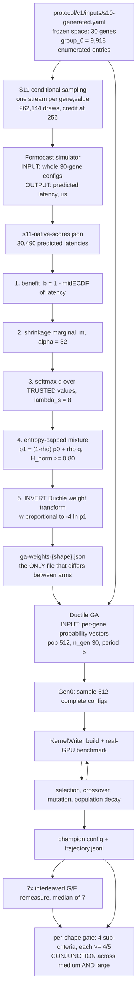

# 簡報大綱(繁中鏡像)— S14 closing report(Formocast Gen0 guidance × Ductile GA)

> **同步規則(SYNC RULE):** 本檔與 [`outline.md`](outline.md) 成對。**任何變動都必須在同一次編輯裡同時
> 套用到兩份** —— slide 標題、頁序、數字、內容都一樣。兩份必須永遠有相同的 `### P<n>` 標題、相同順序。
> **衝突時以英文版為權威**;數字、識別字、路徑、amendment token 與 evidence label 在兩份裡都保留英文。
> (Owner 於 2026-08-13 指示,與 `report-source-index.md` / `.zh-Hant.md` 同一慣例。)

> **這份文件是什麼。** 是 closeout 簡報的**工作大綱**。它**不是** closure report,也**不自行給出任何 gate
> 判定**。`reports/README.md` 規則 3 把 `reports/` 底下的 `*-report.md` 命名保留給 gate closure report
> (每個 `scientific_gate` 一份,檔名 == 該 gate 的 `formal_report_path`);本檔刻意叫 `outline.md`。
> 唯一可以陳述「S14 到底過了沒」的文件是 `reports/staged/full-ga-baseline-vs-guided-outcome-report.md`
> (目前 `report_status: DRAFT-SCAFFOLD`、`scientific_outcome: not_evaluated`)。
>
> **聽眾假設 —— 寫在最前面,方便隨時修正方向。**
> **針對 ~2026-08-20 closeout 的內部技術審查。假設聽眾具備 GPU / GEMM 素養
> (MFMA、LDS、prefetch、occupancy、GFLOP/s),但*完全不熟*這項研究** —— 對 Ductile、Formocast、GEKO、
> S11/S14、各個 lock 或 amendment ledger 都沒有先備知識。每個研究專屬名詞都在首次出現時定義。
>
> **日期:** 2026-08-13。**來源截止於:** `report-source-index.md` 最後更新 2026-08-13。

## Section map —— 若要放 agenda slide,這也就是它的內容

| # | section | pages | 它回答什麼 |
|---:|---|---|---|
| 1 | **問題與判定** | P1–P2 | 問了什麼、答案是什麼,以及*不可以*宣稱什麼 |
| 2 | **兩套工具** | P3–P5 | Ductile 與 Formocast 各是什麼、各吃什麼、彼此怎麼接 |
| 3 | **什麼可以調** | P6–P7 | 27 個 free gene、3 個 grouped gene,以及哪些被固定 |
| 4 | **實驗設計** | P8–P11 | Shape、gene 篩選、橋接,以及 Gen0 cap —— 每一項都附理由 |
| 5 | **成功如何判定** | P12–P14 | 四項連言的 gate、四個被量測的量,以及雜訊控制 |
| 6 | **結果** | P15–P16 | medium 與 large,對照 gate |
| 7 | **問題與後續工作** | P17–P19 | 量測缺陷、覆寫事件,以及還有什麼沒量 |

**排序註記(2026-08-13)。** Section 5 被移到 Section 4 *之後*,而不是之前。原本 gate 定義在被它評分的
結果前面七頁,等於要求聽眾把四個分項準則與一條容忍帶記在腦裡橫跨整個設計區塊。現在它就緊接在 Results
前面。換來一個小小的前向引用:P8 的 shape 表裡出現 `η_s`,而它定義在 P13。

**量測缺陷維持在 Section 7、放在結果之後**(owner 決定)—— 刻畫它的工作仍在進行,所以這段內容維持原樣,
不圍繞一個 provisional 發現去重構。

## 頁數預算 —— 偏離說明

**19 頁**(建議預算是 20)。依請求者指示有一項偏離:**results 區塊是 2 頁而不是 3 頁** —— 專門講
`tiny`-as-null-control 的那一頁被拿掉。Tiny 的 null-control 內容**沒有遺失**:它被折進 **P13(容忍帶)**,
那也正是它在來源裡真正發揮論證作用的地方(§3.8.1 用 tiny 那對逐位元相同的零 treatment 臂去*證偽*實測
margin)。其他區塊都沒變:title+exec 2、Ductile & Formocast 3、parameters 2、metrics 3、experiment
design 4、results 2、problems 2、future work 1。

## 每一頁都適用的常設規則(放講者備忘,不要放上投影片)

1. **每一項量化主張都附來源**(`file § / artifact path`),所以任何一頁都能回溯。來源以 `[...]` 寫在每個
   數字後面,直接記在本大綱裡。
2. **絕對不要寫「no effect」。** 允許的負面措辭是:*「the amended sparse prior, as configured, did not
   meet the pre-registered directional gate.」* [index §4, §3.4c.4]
3. **`NOT_EVALUATED ≠ no effect`** —— 在 P13、P15、P17 明確出現。[index banner, §5c.3]
4. **絕不單獨引用 large 的 5/5 non-regression。** 它是一個失敗連言裡的其中一個分項,而且在實測 margin 下
   只有 3/5。[index §7.2a; design §13.5; large annex §11.2]
5. **不得有任何 deployment / adoption / generalisation / cross-architecture / end-to-end-speedup 主張。**
   [index §4, charter §8.6]
6. **有九項是 `PENDING_HUMAN_DECISION`**(index §9.3)。任何在它們下游的東西都是**provisional**,並在
   投影片上帶一個 `PROVISIONAL — pending owner decision #N` 標記。
7. Evidence label 一致使用:`[MODEL-ONLY]`、`[BASELINE GPU]`、`[GUIDED GPU]`、`[CODE AUDIT]`。
   [index §0]

---

### P1 — Formocast Gen0 prior 幫得上 Ductile 嗎?

**內容**

- 標題:*"Does a Formocast-derived Gen0 prior improve a Ductile GA search on real GPUs? — S14 closeout."*
- 一句話框住這個實驗:**per-shape 單目標 GA、兩臂、5 對 paired seed。**
  - **Arm G(baseline):** Gen0 對每一個 free gene 都從**均勻**的 `p0` 抽樣。
  - **Arm F(guided):** Gen0 對**被 activate 的** free gene 從 Formocast 導出、經 entropy cap 的 `p1`
    抽樣;其餘一切相同。[formal report §1; index §3.4b.4]
- **狀態橫幅框**(逐字放上投影片,因為它決定了後面所有內容該怎麼讀):
  - capped `P0 = 512` campaign 在三個 shape 上都 **COMPLETE** —— baseline 15/15、guided 15/15,medium、
    large、tiny 的 7× 重測都做完了。[index §1, §1 status paragraph]
  - native `P0 = 11,405` addendum:**medium COMPLETE**(5/5 GA + 5/5 重測);**large IN PROGRESS**
    (5 個 baseline seed 在 Gen0 抽樣中,無 trajectory 列;guided 臂尚未開始)。[index §1;
    `s14-large-report.md` §10]
  - 唯一那份正式報告是 **DRAFT-SCAFFOLD**、`scientific_outcome: not_evaluated`;**九項 owner 決定仍未
    裁決**。[formal report frontmatter; index §9.3]
- 講者當場說出口的契約:*「這份簡報報告的是計數、量測與它們的來源。凡是記錄尚未解決的地方,我會說
  `PENDING_HUMAN_DECISION` 或 `NOT_EVALUATED`,而且我不會把它們四捨五入成一個結論。」*

**視覺:** 不用圖表。一條 3 列的狀態帶(capped / native-medium / native-large),配綠–琥珀–灰的狀態晶片。

---

### P2 — 判定:在碰不到的分項上 gate 就 NOT MET

> **這是整份簡報最重要的一頁。如果聽眾只記得一頁,必須是這一頁。不要讓這個框架被壓縮掉。**

**內容 —— 四個區塊,依此順序:**

1. **這道 gate 是連言,而且它是在量測缺陷碰不到的分項上失敗。**
   表格(整份簡報的頭號產出):

   | shape | Gen0 best | gen-10 best | AUC | final champion `F/G>1` | 要求 |
   |---|---:|---:|---:|---:|---|
   | **medium**(capped) | 3/5 | 3/5 | 3/5 | 2/5(campaign 1) | 各 ≥4/5 |
   | **large**(capped) | **1/5** | **2/5** | 3/5 | 3/5 | 各 ≥4/5 |

   [formal report §3.1; index §9.1; `s14-medium-report.md` §5.1/§5.2; `s14-large-report.md` §4.4]
   正式報告自己那一版的同一張表,還帶著 **medium 的 final ratio 為 `NOT_EVALUATED`**,以及一列不受 gate
   的 tiny(3/5 · 2/5 · 2/5 · 1/5,僅供校準)。[formal report §3.1]
   - **Gen0、gen-10 與 AUC 都是從 `trajectory.jsonl` 讀出來的,完全不經過 7× 重測**,所以 medium 的儀器
     缺陷(P17)**碰不到它們**。[index §5c, §9.1; medium annex §5.1]
   - **判定句,逐字取自 formal report §3.1**(原文與譯文都放上投影片):
     「**兩個 confirmatory shape 的四項連言都不成立,且是在三個「量測缺陷碰不到」的分項上
     就不成立。**」—— *"The four-way conjunction fails on both confirmatory shapes, and it fails on three
     sub-criteria the measurement defect cannot reach."*
   - 因此,**無論 medium 的端點最終如何裁決,兩個 confirmatory shape 的 gate 都是 NOT MET。**
     標記:`PROVISIONAL — the claim-ladder wording is owner decision #6 (D3)`。
     **計數本身是量測到的事實**;待決的只是正式措辭。正式報告目前仍帶 `report_status: DRAFT-SCAFFOLD` /
     `scientific_outcome: not_evaluated`,並載明 outcome 標籤要在 closure 時由 `CU-S14-OUTCOME` 填入,
     且**必須等**待決項目裁決之後。[formal report frontmatter, §3.1, §3.4; index §9.2 D3, §9.3]
2. **三件絕對不能說的事。** 放大、講白、直接上投影片:
   - ✗「no effect」→ ✓ *"did not meet the pre-registered directional gate"*。
   - ✗ 說 large「passed」/ 單獨引用 **5/5 non-regression** → 它是一個失敗連言裡 4 個分項中的 1 個,
     **在實測 margin 下是 3/5**,而且它 pin 的 `η_large` 從未對照它所治理的那些量測驗證過。
     [index §7.2a; large annex §5.1, §11.2]
   - ✗ 任何 deployment / adoption / generalisation 的措辭。[index §4]
3. **medium 的最終端點是第三種狀態:`NOT_EVALUATED / instrument-invalid` —— 既不是 pass 也不是 fail。**
   campaign-1 medium 的 repeat 有 46.4 % 是 dropout,所以 median of 7 只是一場模態樂透。
   [medium annex frontmatter + §5.2; index §7.1a, §9.2]
4. **什麼*是*可以正面宣稱的。** 兩項模型空間的發現,它們不依賴那個有爭議的儀器:
   - **稀疏性是真的,而且與 reducer 無關:** 27 個 free gene 裡,在 tiny / medium / large 上分別有
     **0 / 2 / 5** 個可被 guidance;aggregate max-reducer 獨立地也只浮出 26 個可測 gene 裡的 3 個。
     [index §3.5, §7.3.1 item 1]
   - **Gen0 機制:** 這個 prior 把 Gen0 的**中心**往上推(median +2.0 %,4/5 seed),而 GA 選的是 Gen0 的
     **極值**(median −2.8 %,1/5 seed)—— 同一批 run 上的兩個相反方向。
     [index §7.2.1; large annex §6.1]

**視覺:** 那張 2×4 的計數表當主角;一個紅色「絕對不能說」框;一個小的綠色「可以說」框。

---

### P3 — 兩套工具,兩種輸入格式

**內容**

- **Ductile** = TensileLite 裡以 GA 為基礎的 design-space explorer
  (`projects/hipblaslt/tensilelite/Tensile/ductile/`)。它搜尋 kernel configuration,並把每一個都拿到
  **真實 GPU** 上 benchmark。Fitness = 量測到的 GFLOP/s,逐 size 以參考值 `R_s` 正規化。
  [index §3.1.1; `algorithm/ga.py`]
- **Formocast** = 一個分析式的**效能模擬器**(`formocast_simulator.cpp`),對一個 config 回傳
  **以微秒表示的預測延遲**,**完全不動用 GPU**。[index §3.6.2, §5a]
- **輸入格式的對比 —— 這兩欄並排放,它是整套接線的關鍵:**

  | | **Formocast** | **Ductile** |
  |---|---|---|
  | 吃什麼 | **整個 config** —— 一次一份完整的 30-gene kernel config | **per-gene 機率向量** —— 每個 gene 一條分布,然後它自己去抽 config |
  | 回傳什麼 | 預測延遲(µs),或在它拒絕建模時回傳哨兵值 `9,999,999.9` | 一個 champion config + 逐代的 `trajectory.jsonl` |
  | evidence label | `[MODEL-ONLY]` | `[BASELINE GPU]` / `[GUIDED GPU]` |
  | source | `formocast_simulator.cpp:568–645`;`s11-native-scores.json`(30,490 筆預測延遲) | `core/space.py:57`;`algorithm/ga.py:145–146` |

- **這為什麼重要:** Formocast 的答案是*per-config*;Ductile 的問題是*per-gene*。橋接(P10)裡的一切都是
  為了把前者轉成後者而存在,而那個轉換正是 entropy floor、trusted-value gate 與 weight-transform inversion
  所在之處。
- **Ductile 並不直接吃機率。** 它的 config 欄位叫 `weights`,而 `ga.py:145–146` 會套用
  `w → exp(−0.25·(w − w.min()))` 再重新正規化 —— **權重越低,抽樣機率越高**。直接餵 `p1` 進去會把 guidance
  *反轉*。這裡先標出來,在 P10 解決。[index §3.4b.2]
- **抽樣是 per-individual 且跨 gene 獨立的:**
  `ind = Individual({k: rng.choice(s, p=p.get(k, None)) for k, s in sizes.items()})` —— 每一個 individual
  都獨立地為**全部 30 個 gene** 各抽一個值,產出一份完整 config。
  [`core/space.py:57`; index §3.2a]

**視覺:** 兩張面對面的輸入格式卡(Formocast ← 整份 config;Ductile ← 30 條機率向量),把 `weights` 的
符號反轉警告當紅字註腳。

---

### P4 — Ductile 的 GA:30 代,兩條衰減律

> 請求指定的重點:evolution 設計要給比這區塊其他頁更多的篇幅。

**內容**

- **被 pin 住的 horizon 與 population**(全部是來自
  `Tensile/ductile/config/defaults.yaml` + `algorithm/ga.py` 的 `[CODE AUDIT]`):
  `n_gen = 30`、`pop_size = 512`、`soo = False`、native early stop `period = 5`、`tol = 0.0008`、
  `div_thr = 0.5`、`max_iters = 250`、`weight_beta = 0.25`,
  selection = tournament (k=2)、crossover = UX (prob 0.9)、elitism 0.05。
- **Gen0 膨脹。** 若任何 gene 的候選數 `max_sp_sz` 超過 `pop_size`,constructor 會把 Gen0 膨脹到
  `int(max_sp_sz × 1.15)` = `int(9,918 × 1.15)` = **11,405**。[`ga.py:112–118`]
  - 這個 `×1.15` 是一個**沒有文件的 magic constant** —— 整個 ductile 樹裡沒有註解、沒有任何說明。
    離它最近的文字只有 `ga.py:114` 的那條警告字串。[index §3.2a]
  - 它買到的是**每個 group_0 候選約 1.15 次抽取**,亦即 `1 − e^{−1.15}` ≈ **68.3 %** 覆蓋率 —— 要接近完整
    覆蓋需要約 91,266 次抽取(coupon collector)。不要把 11,405 描述成「覆蓋了整個空間」。
- **兩條互相獨立的 population 衰減律 —— 這一頁的頭條。**

  | 律 | code | 何時安裝 | 下限 | 是否黏著? |
  |---|---|---|---:|---|
  | **law 1** | `ga.py:116` `int(_pop_size + (sz − _pop_size)/2)` | 只在 `max_sp_sz > pop_size` 時(膨脹情境) | **512** | 否 |
  | **law 2** | `ga.py:291` `int(_pop_size/2 + (sz − _pop_size/2)/1.25)` | 只要任何一代回報 `diversity < div_thr = 0.5` 就安裝 | **256** | **是 —— 永久覆蓋 law 1,無法回頭** |

  在每一代結束時套用:`ga.py:293`。
- **三個要明講的後果:**
  1. Law 1 **不是**「把 population 砍半」—— 它只砍*超過* 512 的那部分:
     `11,405 → 5,958 → 3,235 → 1,873 → 1,192 → 852 → 682 → 597 → 554 → 533 → 522 → 517 → 514 → 513 → 512`
     —— 約 14 代,也就是在 native 設定下,**30 代 horizon 大約有一半花在把膨脹的 Gen0 收回來**。
     [index §3.2b]
  2. 在我們的 capped run(`DUCTILE_FORCE_P0=1`)裡,law 1 **從未被安裝** —— 但 **law 2 照樣會啟動。**
  3. **量測到的交叉代數 = 6,在每一個 S14 large run、兩臂皆然:**

     | gen | 1 | 5 | **6** | 10 | 15 | 21 |
     |---|---:|---:|---:|---:|---:|---:|
     | diversity, baseline seed 24001 | 0.568 | 0.515 | **0.492** | 0.417 | 0.345 | 0.322 |
     | diversity, guided seed 24001 | 0.560 | 0.508 | **0.491** | 0.412 | 0.329 | 0.316 |
     | 該代的 eval 數 | 489 | 507 | 507 | 349 | 277 | 252 |

     gen-6 之後的 eval 數(457、418、384、349、…、252)在有效候選率的誤差內,吻合 law 2 的序列
     (460、419、386、360、…)。[index §3.2b; `stage3_*/seed_24001/large/*optimization.log`]
     Native medium 從 11,405 → … → 258,到 gen 29。[medium annex §1.6]
  4. **它不是臂層級的 confounder** —— 兩臂同一代、軌跡幾乎相同。但它*確實*意味著
     **AUC 必須對累積 evaluation 積分,而不是對代數積分**(帶到 P13/P12)。
- **Fail-open 砍半 —— 這是治理議題,不是效能註記。** `ga.py:625–632`:
  ```python
  try:    pop = self.space.sample(self.pop_size, p=self.probs)
  except MaxIterationsReached as e:
      n_sampled = e.args[1]
      p = self.probs if n_sampled > 0 else None      # <-- guidance silently dropped if nothing sampled
      pop = self.space.sample(self.pop_size // 2, p=p, iter_mul=4, reuse=True)
  ```
  `MaxIterationsReached` 由 `core/space.py:157` 在產出的有效個體少於 `size` 時拋出。重試會**把 population
  砍半**,而如果抽到*零*個個體,它會**退回 `p = None`,也就是均勻 —— 等於把 treatment 歸零**。要講清楚:
  這個分支在我們的 run 裡**沒有觸發**(全部 10 份 native medium log 中 `Max iterations reached` ×0
  [medium annex §1.4]);之所以報告它,是因為 treatment 通道上的靜默 fail-open,正是 closeout 必須查過的
  那類東西。
- **⚠ 兩份 `ga.py`。** 所有 `ga.py:NNN` 引用都解析到 **repo** 那一份
  (`projects/.../ductile/algorithm/ga.py`,756 行)。實際跑這些 run 的是 **engine** 那一份
  (`agent_run/260807-s14-baseline-run/engine/.../ga.py`,346 行),它在那些行號上的內容並不相同;
  `DUCTILE_FORCE_P0` **只**存在於 engine 那一份(`engine .../ga.py:112`)。逐行差異對照表為
  **`NOT_EVALUATED`**。[index §3 header box]

**視覺:** 一張衰減曲線圖,population vs generation,兩條軌跡(law 1 → 512、law 2 → 256),標出 gen-6
交叉點;fail-open 片段做成 code callout。

---

### P5 — 端到端的完整流程

**內容:** 一張圖加四條註解。這一頁收掉 Ductile/Formocast 區塊。



**要放在圖上的註解:**

- **A.** 步驟 1–3 是**封存的 S11 code**;步驟 4 是 amendment `ENTROPY-CAP-20260810`;**步驟 5 是最容易被
  搞錯的一步,講的時候不能跳過。** [index §3.4b.1]
- **B.** `ga-weights-{shape}.json` 是 Arm G 與 Arm F 之間**唯一**的差異。Seed、pin、`group_0`、評估與
  early stop 全部相同。已驗證:未被 activate 的 gene 解析出來就是完全均勻
  (`WaveSeparateGlobalReadA → [0.5000, 0.5000]`)。[index §3.4b.3/§3.4b.4]
- **C.** `CH → GT`(虛線)是 **AUC / Gen0 / gen-10** 那條路徑 —— 它直接讀 trajectory,**繞過重測**。
  就是這個箭頭讓 P2 的框架成立。
- **D.** `RM → GT` 是 medium 儀器缺陷唯一碰得到的路徑。

**視覺:** mermaid 圖拉寬呈現;四條註解做成編號 callout,C 與 D 用對比色。

---

### P6 — 27 個可調 gene

**內容:** 清單表。`#vals` = **凍結**搜尋空間裡的候選數
(`guidance-medium.json → genes[].candidate_order`,27 筆)—— **不是** `ValidParameters.py` 裡的完整清單。
Purpose 引用/改寫自
`projects/hipblaslt/tensilelite/Tensile/Common/ValidParameters.py` 在所引行號處的行內註解。

| # | gene | #vals | purpose(source: `ValidParameters.py`) |
|---:|---|---:|---|
| 1 | `DepthU` | 6 | `L888–899` —— summation-loop 的 unroll 深度;`DepthU = LoopUnroll × LocalSplitU`;決定每次 main-loop 迭代吃掉多少 K |
| 2 | `1LDSBuffer` | 2 | `L319–330` —— 在 PGR 下強制使用單一 LDS buffer 而非 double-buffering,以節省 LDS / 拉高 occupancy,或讓原本會超過 MaxLDS 的 kernel 塞得下 |
| 3 | `WaveSeparateGlobalReadA` | 2 | `L236–266` —— 在三種 thread/wave global-read 分配模式中擇一(0 stride whole threads · 1 per-wave block, stride 64 · 2 spread evenly in perp)。**效益/理由:`NOT_EVALUATED`** —— 該註解是一張 ASCII 圖,沒有文字說明 |
| 4 | `WaveSeparateGlobalReadB` | 2 | `L267` —— 同一段註解,B 側。**Operand 對應(A vs B)是命名慣例,未載明:`NOT_EVALUATED`** |
| 5 | `NumElementsPerBatchStore` | 8 | `L755–758` —— 節流 store 發出速率;在很短的時間窗內發出 store 會把 kernel 從 compute-bound 翻成 memory-bound;`0` = VGPR 允許多少就發多少 |
| 6 | `NonTemporalA` | 2 | `L927–934` —— global read/write 上的 cache-modifier bit(`glc`/`slc`;在 gfx942 上是 `sc0`/`sc1`/`nt`)。**`A` 後綴指的是哪個 tensor 未載明:`NOT_EVALUATED`** |
| 7 | `NonTemporalB` | 2 | `L936` —— 同一段共用註解。後綴對象 `NOT_EVALUATED` |
| 8 | `NonTemporalC` | 2 | `L933` —— 同一段共用註解。後綴對象 `NOT_EVALUATED` |
| 9 | `NonTemporalD` | 2 | `L932` —— 同一段共用註解。後綴對象 `NOT_EVALUATED` |
| 10 | `PrefetchGlobalRead` | 4 | `L277–289` —— global-load prefetch 的深度:1 = double-buffer global→VGPR→LDS(代價是 2× LDS + VGPR);2 = 在寫 VGPR→LDS 時多做一次 prefetch;≥3 = 僅 DirectToLds,PGR 在 main loop 之前 prefetch |
| 11 | `SourceSwap` | 2 | `L731` —— "optimizes MatrixInstruction store pattern by swapping mfma input order" |
| 12 | `StaggerU` | 3 | `L554–569` —— 把每個 tile 在 summation(U)維度上的起始位置錯開,以避免在 2 的冪次 K 上發生 DRAM/cache/TLB channel 衝突;值越高流量攤得越開但會損失 L2 re-use;與 `WorkGroupMapping` 交互作用;需要 `BufferLoad==1` |
| 13 | `StaggerUStride` | 4 | `L570–580` —— 每一次 stagger「click」的 byte stride;256 = memory-channel 寬度,所以每次 click 都落在新的 channel;內部會向上取整成 `DepthU×BpeAB` 的倍數 |
| 14 | `StorePriorityOpt` | 2 | `L733–754` —— store 排程:相對於 unroll loop 降低 store 的優先權,讓某個 workgroup 的 store 藏在另一個 workgroup 的 loop 後面 |
| 15 | `StoreSyncOpt` | 3 | `L759–764` —— 在每次 batch store 之後插入 sync(連續 store)與 sleep(把 store 攤在 loop 上);"highly depends on size_k";0 = 兩者都不做 |
| 16 | `WorkGroupMapping` | 18 | `L603–629` —— 重新映射 workgroup ID,讓同時 resident 的 workgroup 最能命中 L2;WGM = J 方向的 box 高度,box 寬度由 CU 數決定;`wgSerial = wg0 + (wg1 % WGM)·nwg0` |
| 17 | `WorkGroupMappingXCC` | 5 | `L630–640` —— 重新映射 ID,讓連續的 workgroup 落在同一個 XCC 上。**⚠ 行內圖例只記載了 `0`/`1`,而合法清單是 `[-1,1,2,4,8,16,32]` —— 逐值語意 `NOT_EVALUATED`** |
| 18 | `MIArchVgpr` | 2 | `L769–771` —— `v_mfma_*` 只使用 Arch VGPR,以消除 Acc→Arch VGPR 的搬移;需要 totalVgpr < 256 與 ACC_CD |
| 19 | `TransposeLDS` | 4 | `L918–925` —— 針對 TLU=0 的 MI 路徑,LDS layout 相對於 global-fetch 維度的擺法;各值分別選 tile-coalesced / global-fetch-matching / unroll-coalesced 佈局(NT 在 1 被拒) |
| 20 | `AdaptiveGemm` | 2 | `L1034–1036` —— 0 = 固定 store block(NonEdgeN, ThenN, Then1);1 = 依 runtime problem size 選出的 adaptive store block(…, ThenN/2, …) |
| 21 | `TailloopInNll` | 2 | `L1051–1055` —— 把 tail loop 放進 NoLoadLoop 裡發出,以利用 prefetch、更寬的 global load 與更好的排程 |
| 22 | `ExtraMiLatencyLeft` | 2 | `L1047–1050` —— 為 `miLatencyLeft` 增加餘裕,讓排程器在放 local-read 時有更多空間 |
| 23 | `ScheduleGROverBarrier` | 2 | `L1056–1061` —— 讓 global read 跨越 barrier 排程;只適用於 DirectToLds A+B 且 PGR ≥ 2 |
| 24 | `UnrollLoopSwapGlobalReadOrder` | 2 | `L268–270` —— 額外發出一個 unrolled + NGLL loop,並把 GRA/GRB 順序對調,"which may change the tlb thrashing behavior" |
| 25 | `GlobalReadVectorWidthA` | 7 | `L839–845` —— global→LDS load 的元素寬度;受 bpe 限制(bpe32: 1–4、bpe16: 2–8、bpe8: 4–16) |
| 26 | `GlobalReadVectorWidthB` | 7 | `L846` —— 同一段共用註解,B 側。**Operand 對應 `NOT_EVALUATED`** |
| 27 | `DirectToVgprA` | 2 | `L418–420` —— "attempt to load directly from global memory into Vgpr. Assembly only."(很單薄 —— 沒有載明 trade-off) |

**來源政策框 —— 這段要說出口,它才是這一頁真正的重點:**

- **`study_docs/` 裡沒有任何東西描述個別 gene 在做什麼。** 唯一能佐證的來源是 `ValidParameters.py` 的
  行內註解;上面每一條 purpose 都引到那裡的某一行。
- **依來源判定為 `NOT_EVALUATED` 的有 7 項,逐一點名:** `WaveSeparateGlobalReadA`/`B` 的*理由*;
  `NonTemporalA/B/C/D` 與 `GlobalReadVectorWidthA/B` 上 `A`/`B`/`C`/`D` 後綴的 operand/tensor 對應;
  `WorkGroupMappingXCC` 的逐值語意。
- **大多數 gene 的具體候選*值*,從所引來源看是 `NOT_EVALUATED`。**
  `guidance-*.json` 把 `candidate_order` 存成 **sha256 hash** 而不是字面值,而且凍結空間是
  `ValidParameters.py` 合法清單的一個子集(例如 `PrefetchGlobalRead` 在這裡是 4 個值,合法清單有 17 個)。
  只有兩個 gene 的值集能從所引文字還原:`DepthU ∈ {32,64,128,256,512,1024}` 與
  `PrefetchGlobalRead ∈ {1,2,3,4}` [index §3.4a.2]。
- 二十七條聽起來很篤定但其實是編的描述,比二十七個空格更糟 —— 讀者分不出來,而這份簡報的目的就是要能回溯。

**視覺:** 表格在投影片上分成兩欄;`NOT_EVALUATED` 的儲存格加底色,配一個計數晶片「7 purposes unsourced」。

---

### P7 — 哪些被固定住

**內容**

- **搜尋空間剛好有 30 個 key = 27 個 free gene + 3 個 grouped gene。** 直接從
  `trajectory.jsonl → best_params_so_far`(30 個 key)驗證:

  | group | 成員 | 展開後的基數 | 在 treatment 裡嗎? |
  |---|---|---:|---|
  | `group_0` | `{GlobalSplitU, MatrixInstruction}` | **9,918** | **沒有 —— 兩臂完全相同** |
  | `group_1` | `{DirectToLds, UseSgprForGRO}` | 3 | 沒有(未被 activate) |
  | `group_2` | `{ClusterLocalRead, LDSTrInst}` | 2 | 沒有(未被 activate) |

  [`agent_run/260809-s14-pershape-baseline/.../medium/trajectory.jsonl`;基數取自 s10
  entry-gate report / index §3.2a]
- **27 才是權威的 free-gene 分母**,逐 shape 用算術確認:
  `n_genes_activated + n_genes_fallback` = medium / large / tiny 分別是 **2+25 / 5+22 / 0+27 = 27**。
  [`out-capped/guidance-{medium,large,tiny}.json`]
  ⚠ **要先講明的已知跨檔不一致:** medium annex 把 medium 寫成 **2 of 29**,而 large annex 寫成
  **2 of 27**;index §3.4b.4 也用 29。兩份檔案都沒有調和這件事。
  **請用 27**,而且要在投影片上說明。[medium annex §1.1; large annex §1.1/§6.2]
- **`group_0` 為何在 treatment 之外 —— 三個理由,依此順序:**
  1. 它是 **GEKO 加權**,不是 Formocast 加權:那 9,918 筆是 GEKO 生成的 kernel macro-shape 池,權重來自
     GEKO。[index §3.7]
  2. 它的 weight 檔在兩臂之間**逐位元相同** —— 已驗證。[index §3.4b.4, §3.7]
  3. 它正是 native Ductile 之所以會膨脹 Gen0 的原因:`max_sp_sz = 9,918` 完全由 `group_0` 決定
     (另外 29 個 gene 每個只有 2–18 個值)。所以整個 `×1.15` 膨脹的存在,是為了覆蓋一個
     **不帶任何 treatment** 的 gene。[index §3.2a]
  - 要說明的後果:cap 到 512 會縮小 group_0 的覆蓋率 → 它**影響絕對 champion 品質與外部效度**,但它
    **無法偏誤 paired 的 G-vs-F 對比**,因為兩臂都用共同的 Gen0 uniform 從同一個 `p0` 抽 group_0。
    [index §3.2]
  - 9,918 *不是*什麼:它不是 Ductile 的設計上限(`space.py` 只拒絕空清單),也不是笛卡兒積 —— 只有
    **840 個相異的 MatrixInstruction tuple**、262 個 `WorkGroup:` override、434 種 MacroTile shape。
    它是一個凍結 YAML 裡的**列舉長度**。[index §3.2a]
- **固定條件(「statics」—— 兩臂之間保持不變的一切):**

  | 條件 | 值 | source |
  |---|---|---|
  | shapes `(M,N,batch,K)` | tiny `(8,8,1,128)` · medium `(256,256,1,1024)` · large `(2304,1024,1,214336)` | 封存的 `s11/contract.py:674` |
  | shape 角色 | medium + large **confirmatory**;tiny **exploratory** | `PER-SHAPE-SOO-OUTCOME-20260809` |
  | seeds | **24001–24005**,5 對 paired,全新(無 registry 碰撞) | design §10 |
  | horizon | `n_gen = 30` cap + native early stop `period = 5`;有擷取 gen-10 checkpoint | `defaults.yaml` |
  | `rotating-buffer-size` | **tiny 4096 · medium 4096 · large 0** | `DUCTILE_PERSIZE_RBS = {"4096":[[8,8,1,128],[256,256,1,1024]],"0":[[2304,1024,1,214336]]}` |
  | client | `num-warmups = 321`、`num-enqueues-per-sync = 321`、`sleep-percent = 50`、`NumElementsToValidate = 128` —— **三個 shape 完全相同** | `ClientParameters.ini` |
  | dtype / arch | BFloat16、non-StreamK、單一 dtype+layout、gfx942 / MI300X | index §3.6.1 |
| GPU 卡 | **最多 6 張,絕不用 device index 0**;一個 seed → 一張卡,**該 seed 的 G 與 F 用同一顆實體 GPU UUID**;native 把卡組 pin 在 **2, 3, 4, 6, 7** | design §5.3, §10.2, §12.3 |
| RNG | counter-based stream,以 `(lock_hash, shape, seed, phase ∈ {gen0, evolution, measurement})` 為 key;**paired 的兩臂共用同一批 Gen0 uniform**,再分別經 `p0` 或 `p1` 映射;evolution stream 在 Gen0 之後重置 | design §10.2 |
| locks | **Lock A**(protocol / seed / margin / budget / RNG / measurement)在 baseline 之前封存;**Lock B**(per-shape capped guidance + activation)在 guided 之前封存 | design §10.4 |
  | `R_s`(正規化常數) | tiny 0.75 · medium 3,199.94 · large 180,336.00 | Lock A |
  | guidance 常數 | `λ_s = 8.0`、`α = 32`、`ε = 0.2`、`ρ_max = 0.80`、`ρ_step = 0.0001953125`、`entropy_floor = 0.80`、`weight_beta = 0.25` | `guidance-*.json` |

- 往 P17 預告:`num-warmups = 321` **三個 shape 完全相同**,這正是那個缺陷。

**視覺:** 左邊 = 3-group 表 + 「27, not 29」更正晶片;右邊 = 固定條件表。

---

### P8 — 三個 shape,橫跨五個數量級

**投影片上要陳述的理由:三個刻意分歧的 regime,不是一次平滑掃描。**

**內容**

| shape | M | N | batch | K | FLOPs | `R_s` | `η_s` | 角色 |
|---|---:|---:|---:|---:|---:|---:|---:|---|
| tiny | 8 | 8 | 1 | 128 | 16,384 | 0.75 | 0.4466 | exploratory |
| **medium** | 256 | 256 | 1 | 1,024 | 134,217,728 | 3,199.94 | 0.0042 | **confirmatory** |
| **large** | 2,304 | 1,024 | 1 | 214,336 | 1,011,364,134,912 | 180,336.00 | 0.1229 | **confirmatory** |

> `η_s` = gate 所使用的 per-shape 雜訊容忍帶。**定義在 P13** —— 這裡列出只是為了讓三個 regime 一眼可比。

[封存的 `s11/contract.py:674`; Lock A]

- **理由。** K 從 128 → 1,024 → 214,336(×8,再 ×209):一個退化的玩具、一個中等大小的方陣,以及一個
  非常深 K 的生產規模 GEMM。這三個 shape 的存在是為了測試 **guidance 效應是否能跨尺寸多樣性重現** ——
  不是為了被共同最佳化成一個折衷答案。
  [index §3.6.1, §3.1.5]
- **為什麼要做 per-shape 單目標 —— 它修的是什麼缺陷,分三步講:**
  1. Ductile 的 `soo=False` **不做任何 Pareto / 非支配排序**;全樹搜尋
     `pareto|non-dominated|nsga|crowding` 什麼都找不到。`ga.py:256–273` 用 `np.max` 把 (n_sizes × N)
     的 score 矩陣縮併成 `Q_c = max_s (GFLOPS_{s,c} / R_s)`。[index §3.1.2,
     `REDUCER-FACT-CORRECTION-20260812`]
  2. 於是一個候選是被**它剛好看起來最好的那一個 size** 評分,而 tiny 遠遠是最吵的(η 0.4466 vs medium
     0.0042)。Pilot 中觀察到:**seed-14005 的 champion 在 large 上快約 2×,卻拿到*最低*的 `Q`。**
     [index §3.1.4]
  3. 每個 shape 各跑一個單目標 GA,fitness 矩陣就變成 (1×N),對單一列取 `max` 是恆等運算,根本不會發生
     跨 size 的縮併。[index §3.1.5]
- **tiny 為何永遠承載不了 guidance —— 這是設計事實,不是結果。** `formocast_simulator.cpp:578` 在 MacroTile
  超過某個小問題維度時提早終止,回傳 `microSeconds = 9,999,999.9`。在 8×8 上幾乎整池都會踩到,所以每個
  config 都在哨兵值上打平 ⇒ 每個 per-value marginal 都相同 ⇒ 27 個 gene 全部 `S_g = 0.0000`。
  **tiny 落在 Formocast 建模範圍之外 —— 不是一個「模型試了但失敗」的 shape。**
  [index §3.6.2]
  ⚠ 要帶上來源 caveat:「434 個 MacroTile 中活下來 1 個 / 434 個中活下來 171 個」這些計數是**推導出來的,沒有引用推導
  過程 → 依引用判定為 `NOT_EVALUATED`**;定性結論由 activation log 獨立確認,並不依賴這些數字。
  [index §3.6.2 audit box]
- **誠實的範圍限制:** 單一開發叢集、僅限受測 shape、5 個 seed —— 不做任何一般化。

**視覺:** 一條對數尺度的 K 軸,把三個 shape 標在上面,並按比例畫出 `η_s` 的帶寬 —— 視覺上讓
0.42 % / 11.56 % / 36 % 的落差一目了然。

---

### P9 — Gene 篩選:敏感度、先驗、護欄

**投影片上要陳述的理由:一個三段漏斗 —— 選、建、再護。**

**內容**

- **這個漏斗**(`select genes → build prior → safety check`),以及每個門檻住在哪裡:
  ```
  SELECT :  S_g >= 0.05  AND  >= 2 trusted values
  BUILD  :  q = softmax over trusted values, lambda_s = 8
  GUARD  :  H_norm(p1) >= 0.80        <- the entropy floor lives HERE, downstream of selection
  ```
  這條 floor 完全不參與決定*哪些* gene 帶訊號、也不決定*哪個*值比較好;它只能改變一個已經選定的偏好
  **被套用得多強**。[index §3.4c.1]
- **Stage 1 —— 敏感度 gate `S_g ≥ 0.05`。** `S_g = max_v(m_gv) − min_v(m_gv)`,其中 `m_gv` 是
  `benefit = 1 − midECDF(predicted latency)` 的 shrinkage marginal(`α = 32`)—— 也就是**母體的排名百分位
  點數**,完全是 `[MODEL-ONLY]`。讀法:`S_g = 0.142` 表示使用該 gene 最佳值的 config,在預測延遲排名上比
  它最差值高約 14 個百分位點。
  [index §5a; `statistics.py:102/137/188/1166`]
- **Stage 2 —— trusted-value 支撐度。** 一個值只有在**全部**滿足下列條件時才算 *trusted*:
  `support ≥ 128` 個被接受的 config、可執行(≥1 個 config 編譯並跑過)、coverage ≥ 0.95、無碰撞 confounding。
  要能算出敏感度,至少需要 **≥2 個 trusted 值**。[index §5a; `workflow.py:758–802`]
  - 證據基礎:每一條 (gene, value) 串流抽取了最多 **262,144** 個 config,在 256 處計入。
    `DepthU` 的六個值分別計入 256 / 256 / 38 / 0 / 0 / 0;`PrefetchGlobalRead` 是 256 / 256 / 2 / 0。
    **那些零的意思是「抽了 262,144 次而沒有任何一個被接受」,不是「沒抽過」。** [index §3.4a.2]
  - 誠實地報成「沒有被接受的 config」,**不要**寫成「無法建置」:封存的 ledger 記的是處置結果,不是拒絕
    原因。[index §3.4a.2 terminology caveat]
- **Stage 3 —— entropy cap `ρ`(amendment `ENTROPY-CAP-20260810`)。**
  `p1 = (1−ρ)·p0 + ρ·q`、`ρ = max{ρ ∈ [0,0.80] : H_norm(p1) ≥ 0.80}`,以確定性的向下網格掃描求得
  (步長 `0.80/4096 = 0.0001953125`,4097 個點 —— 可重現,不用 solver)。[index §3.4]
  - **原本的二元規則為何失敗:** 它是在固定的全強度下問 yes/no,所以它**系統性地刪掉訊號最強的 gene** ——
    訊號越強 ⇒ `q` 越尖 ⇒ entropy 越低 ⇒ 越可能通不過一條固定的 floor。`DepthU`(6 個值,2 個 trusted)
    最高只到 `H_norm = 0.6576`,`PrefetchGlobalRead`(4/2)是 `0.7345` —— **在任何 λ、任何資料下都低於
    0.80**。而且因為 `λ` 是**全域的**,一個這樣的 gene 就能決定整條 pipeline
    (`select_global_lambda`,封存的 `s11/guidance.py:95`)。[index §3.4a, §7.3]
  - **這條 floor 實際上量的是什麼:** 不是集中度,而是 **`k/n`**。同樣的 treatment 強度,相反的判定:
    `1LDSBuffer`(2/2)1.0000 過關;`PrefetchGlobalRead`(4/2)0.7345 不過;`DepthU`(6/2)0.6576 不過。
    好懂的重述:`H_norm ≥ 0.80 ⟺ perplexity ≥ n^0.8` —— `DepthU` 被要求提供 4.19 個有效選擇,而它最多
    只能給 3.25。[index §3.4c.3, §3.4c.6]
  - **兩個常數都沒有文件。** `S_g ≥ 0.05` 與 `H_norm ≥ 0.80` 都不存在推導、雜訊模型或 power analysis;
    0.80 硬 pin 在封存 code 裡,拒絕任何其他值。事後穩健性檢查(要明確標成事後):**(0.0422, 0.0520]**
    區間內的任何門檻,在**兩個** shape 上都會選出完全相同的 gene,而 0.05 落在那個窗內。
    [index §3.4c.2, §3.4c.6]
- **結果 —— 漏斗表:**

  | 被刷掉的原因 | tiny | medium | large |
  |---|---:|---:|---:|
  | `S_g < 0.05`(主要原因) | 26 | 24 | 21 |
  | trusted 值少於 2 個(一律是 `DirectToVgprA`,`n_trusted = 1`) | 1 | 1 | 1 |
  | **activated** | **0** | **2** | **5** |

  [`derivation-manifest-capped.json → per_shape_activation_log`; index §3.5, §5a]
- **被 activate 的 gene 及其強度:** medium `{DepthU S_g=0.142 ρ=0.566, 1LDSBuffer S_g=0.113 ρ=0.80}`;
  large `{PrefetchGlobalRead 0.1916/0.586, UnrollLoopSwapGlobalReadOrder 0.1647/0.80,
  GlobalReadVectorWidthB 0.0580/0.80, TransposeLDS 0.0571/0.80, GlobalReadVectorWidthA 0.0520/0.80}`。
  **每個 shape 上只有敏感度最高的那個 gene 被減弱(強度 71 % / 73 %);另外五個較弱的 gene 都跑滿
  100 %。** [index §3.4c.4; large annex §6.2]
- **這對任何虛無結果所強加的詮釋限制** —— 逐字放上投影片:
  *允許:*「the amended sparse prior, as configured, did not meet the pre-registered directional
  gate」;*不允許:*「the model's guidance does not help」—— 當時可得的最強 guidance 是被一個沒有文件化
  推導的常數以降低後的強度套用的。[index §3.4c.4]
- **值得一提的正面效度訊號:** 稀疏性是**與 shape 相稱**的,不是隨機的。`DepthU`(loop 結構)在 medium 上
  以 0.142 過關、在 large 上以 0.029 落選;`PrefetchGlobalRead`(memory pipeline)恰好相反
  (0.024 → 0.192)。K 增大時,主導的 gene 從 loop 結構移向 memory pipeline —— 這正是 GEMM 物理所預測的。
  [index §3.6.3, §3.6.4]

**視覺:** 一張漏斗圖 27 → (S_g) → (trusted) → 0/2/5,把那兩個交叉的 gene
(`DepthU`、`PrefetchGlobalRead`)畫成 medium 與 large 兩欄之間交錯的 X。

---

### P10 — 橋接:config → per-gene 機率

**投影片上要陳述的理由:Formocast 回答的是 per-config,Ductile 問的是 per-gene。這就是那個轉換器,而
步驟 5 是它會靜默反轉的地方。**

**內容 —— 五個被鎖住的步驟**(每一個在 `derivation-manifest-capped.json` 裡都是 `locked_formula` /
`locked_constant`):

```
s11-native-scores.json                      30,490 Formocast predicted latencies
  (1) per-size benefit        b_{c,s} = 1 − midECDF_s(predicted_latency)      rank, not absolute latency
  (2) shrinkage marginal      m_{g,s,v} = (Σb + α·global_mean_s)/(n + α),  α = 32
  (3) softmax over TRUSTED    q = normalize( exp( λ_s·(m − min m) ) ),      λ_s = 8
  (4) entropy-capped mixture  p1 = (1 − ρ_g)·p0 + ρ_g·q,  ρ_g = max{ρ ≤ 0.80 : H_norm(p1) ≥ 0.80}
  (5) INVERT Ductile's weight transform
ga-weights-{shape}.json                     what Arm F injects into the GA config
```

- **對聽眾定義 `H_norm`:** `p1` 的 Shannon entropy 除以 `log n`。`1.0` = 完全均勻(最大多樣性);越小
  越集中。`p0`(均勻)的 `H_norm = 1.0`,而 `H_norm(p1)` 對 ρ **單調遞減**,這正是向下網格掃描有效的原因,
  也保證一定存在可行的 ρ(最差就是 ρ = 0)。[index §3.4, §3.4a.6]
- **步驟 5 細看 —— 最容易被搞錯的一步。** `ga.py:145–146`:
  ```python
  w = np.exp(-weight_beta * (w - w.min()))   # weight_beta = 0.25
  self.probs[k] = w / w.sum()
  ```
  符號是**負的** —— 權重*越低*,抽樣機率*越高*。這個欄位帶的是**成本式**語意,不是偏好式語意。直接送出
  `p1` 會讓模型最看好的值變成**最不可能**被抽到。因此推導改為送出 `w ∝ −4·ln(p1)`。往返檢查
  (`roundtrip_p0_pass`、`roundtrip_p1_pass`,以及 max-abs-error 欄位)逐 gene 記錄。
  [index §3.4b.2]
- **在實際出貨的檔案上端到端驗證過** —— 三項獨立檢查,全部通過:

  | gene | `ga-weights-medium.json` 裡的 weights | ⇒ Ductile 的抽樣機率 |
  |---|---|---|
  | `DepthU` (6) | `[6.251, 2.764, 10.506, 10.506, 10.506, 10.506]` | `[0.2096, 0.5011, 0.0723, 0.0723, 0.0723, 0.0723]` |
  | `1LDSBuffer` (2) | `[1.608, 4.423]` | `[0.6690, 0.3310]` |
  | `WaveSeparateGlobalReadA` (2, **未被 activate**) | `[2.773, 2.773]` | `[0.5000, 0.5000]` |

  1. **非 trusted 的質量精確等於 baseline 的份額:** `(1 − 0.566015625)/6 = 0.0723`。
  2. **Entropy 恰好落在 floor 上:** `H(p1)/ln 6 = 0.8000`,對照 manifest 的 `0.800125`。
  3. **未被 activate 的 gene 出來就是完全均勻** ⇒ treatment 被侷限在被 activate 的 gene 上。
  [index §3.4b.3]
- **這項介入的具體規模 —— 每次講到虛無結果都要並列講出來。** 這是一個涵蓋 medium 上 **27 個 free gene 中
  的 2 個**、large 上 **27 個中的 5 個**的 prior。*一個虛無結果,是對這種規模的 prior 而言的虛無結果。*
  [index §3.4b.4,分母依 P7 更正]
- **減弱強度對 Gen0 具體做了什麼**(medium 上的 `DepthU`,模型偏好 64 勝過 32 約 3:1):

  | | ρ = 0.80(全強度) | ρ = 0.566(實際出貨) |
  |---|---:|---:|
  | P(`DepthU=64`) | 0.6393 | 0.5011 |
  | 4 個無證據值各自 | 0.0333 | 0.0723 |
  | 有效選擇數(perplexity) | 2.93 / 6 | 4.19 / 6 |
  | `H_norm` | 0.6007 | **0.8001** |

  在一個 512 個體的 Gen0 裡:**全強度下約有 327 個個體會帶著模型的首選值,實際出貨版是約 257 個 ——
  少了大約 71 個** —— 同時交給那四個無證據值的質量從 13.3 % 上升到 28.9 %。
  [index §3.4c.7]

**視覺:** 5 步 pipeline 做成橫向流程,步驟 5 高亮,加一個小小的
「weights ≠ probabilities, and the sign is negative」警告圖示。

---

### P11 — Gen0 為何被 cap 在 512

**投影片上要陳述的理由:把預算 cap 在不會偏誤對比的地方,然後再去測這個 cap。**

**內容**

- **`P0` 為何被 cap 在 512 —— 誠實的兩段式框架(不要只講一半):**
  - **512 是 Ductile 自己的穩態 population**,不是隨便挑的下限:它是 config 預設值
    (`ga.py:47`、`defaults.yaml`),也是 native Ductile 會收斂回去的衰減目標 `_pop_size`
    (`ga.py:110`)。跑在 512 = 跑在 Ductile 自己的工作 population 上,只是少了一次性的 Gen0 衝刺。
    [index §3.2; formal report §2.3]
  - **(a) 它確實會影響絕對結果 / 外部效度。** Cap 會縮小 group_0 覆蓋率 ⇒ 主張的範圍被限縮到
    **「P0-capped = 512 的 Ductile 變體」**,而不是 native Ductile。
  - **(b) 它不會偏誤 paired 的 G-vs-F 對比。** 兩臂都用共同的 Gen0 uniform 從同一個 `p0` 抽 group_0,
    所以覆蓋率降低是一個**共享的邊界條件,會在配對內差中相消**,只留下 free-gene 重新加權作為唯一的外生
    差異。
  - **殘留 caveat:** 量到的效應是「P0 = 512 下的效應」—— 一個 **treatment × budget 交互作用**。
    那正是 native addendum 要探的東西。
- **Native 11,405 addendum**(`NATIVE-P0-ROBUSTNESS-20260811`,於 2026-08-12 由 `(b)` 擴充到 medium)。
  除了 Gen0 規模以外一切相同。三個問題:
  - **Q1 穩健性** —— capped 的方向對 Gen0 規模是否穩健(消掉「你把它 cap 掉了」這個 caveat)?
  - **Q2 稀釋** —— 效應在 native 規模下是否縮小(prior 在小 Gen0 時最有用)?
  - **Q3 極值機制** —— §7.2.1 發現 guidance 改善了 Gen0 的**中心**卻劣化了 Gen0 的**極值**;Gen0 池的
    大小正是直接操控 max 能伸進尾端多深的把手,而 512 → 11,405 是**對這個變數本身的 22× 操縱**。
    預註冊的方向性預測寫於 2026-08-12,在執行**之前**。[index §3.3; design §12]
  - 已驗證的前提條件:medium 與 large 的 config 除了四個 `ProblemSizes` 數字之外逐位元相同,而且都嵌入
    同樣的 9,918 筆 `MatrixInstruction`,所以 medium 的 `max_sp_sz` 也是 9,918,同樣膨脹到 11,405
    (它**不會**掉進 `ga.py:119` 的 `max_sp_sz < pop_size/5` 砍半分支)。
  - 排程理由:**medium 先、large 後** —— seed 24001 上量到的 GPU 評估時間,medium 是 **0.17 h**、large 是
    **5.61 h**,便宜約 33×,所以先用 medium 驗證接線,再把數天時間投進 large。
- **⚠ 被撤回的理由 —— 要說出口,這是治理重點。** 當初把 medium 納入的理由(「medium 是唯一兩臂差異可量測
  的 shape」)是 **VOID**:那個 0.36×–2.12× 的離散度是量測缺陷,不是臂差異。真正支撐 medium 納入的是
  **Q3,它讀的是 GA trajectory,完全不依賴 champion 重測。**
  Q2 在 medium 最終端點上的效應量比較是 **`NOT_EVALUATED`**。[index §3.3 retraction;
  design §13.6]
- **誠實的非盲 caveat:** medium 是在看過它的 capped 結果*之後*才加入的,所以它的納入不是盲的。真正仍屬
  預註冊的,是 native-P0 的結果本身。
- **Cap 怎麼被強制執行,以及 native 放棄了什麼。** Runner 設定 `DUCTILE_FORCE_P0=1`,讓 constructor 跳過
  膨脹分支,然後 runner 會**斷言初始 population 剛好是 512**(`ga.py:302–304`)。**Native 沒有這種
  assert** —— 它只繼承了 Ductile 原廠的 fail-open(P4)。這個缺口的預註冊處置(design §12.7):在第一代
  評估時檢查 population;若不是 11,405,就寫出 `native_gen0_degraded.json` 並**中止那個 run**,把它記錄成
  *一項關於 native Ductile 行為的實質發現* —— **絕不**當成基礎設施錯誤吞掉,也絕不靜默重跑。
  [formal report §2.3(d); design §12.7]
- **在 native run 上實際驗證過的 fail-closed pin(10/10):**
  `pop_size_at_construction = 11405`、`_pop_size_at_construction = 512`、
  `decay_type = large_space`、`native_p0_variant = true`、`n_gen/period = 30/5`、
  weights sha256 G `56c34446…` / F `d64ebd34…`,10 份 log 裡原廠膨脹警告 ×1、`Max iterations reached`
  ×0。[medium annex §1.4]

**視覺:** 512 對 11,405 的 Gen0 population 並排圖,疊上衰減曲線(重用 P4 的圖),以及一排 Q1/Q2/Q3 晶片
標示現況(Q1 部分、Q2 在端點上 `NOT_EVALUATED`、Q3 已在 medium 上得到回答)。

---

### P12 — 這道 gate 是連言

> 請求指定:不要把 metric 呈現成六個數字的一份清單。這一頁是 4 個維度中的第 1 個。

**內容**

- **per-shape 的方向一致性 gate**(預註冊,**不是**顯著性檢定 —— 只有 5 個 seed):

  | # | 分項準則 | 量 | 規則 | 讀自 |
  |---:|---|---|---|---|
  | 1 | **Gen0 best** | generation-1 記錄處的 `best_gflops_so_far` | **≥4/5** 對 seed-pair 上 `F > G` | `trajectory.jsonl` |
  | 2 | **gen-10 best** | gen 10 處的 `best_gflops_so_far` | **≥4/5** 上 `F > G` | `trajectory.jsonl` |
  | 3 | **AUC** | `best_gflops_so_far` 對 `cumulative_complete_evals` 的階梯保持積分,積到 `B* = min` of 兩臂最終完成的 eval 數 | **≥4/5** 上 `AUC_F > AUC_G` | `trajectory.jsonl` |
  | 4 | **final ratio** | 7×-median 的 champion GFLOP/s | **≥4/5** 上 `F/G ≥ e^{−η_s}`,且 median 也要在其上 | `champion_interleaved.json` |

  [index §5, §5c; design §10.4]
- **它是三重連言 —— 三層都要講:**
  1. **shape 之內:** 四個分項全部都要成立。任一項不成立,該 shape 就不成立。
  2. **跨 shape:** 合併的 §8.2 claim 措辭要求 **medium ∧ large** —— 這是
     **intersection-union** 規則,**沒有 aggregate 救援**。Tiny 只是描述性的。
     [index §5, charter §8.2]
  3. **Arm S 以此為 gate:** 那個條件式 shuffle control,只有在 F 於 **≥1** 個 confirmatory shape 上過
     gate 時才觸發。兩個都沒過 ⇒ **Arm S 不觸發**;本 checkpoint 不需要封 Lock C。
     [index §1, §3.9, §9.2 D3]
- **AUC 為何對 evaluation 積分而非對代數積分:** 每一代的 evaluation 數並不固定(population 衰減,P4),
  所以一臂的第 20 代可能代表的 evaluation 數遠少於另一臂的第 20 代。`B*` 讓兩臂回答同一個問題:
  *「在同樣的 evaluation 數下,誰的 best-so-far 曲線比較高?」* [index §5c, §3.2b]
  ⚠ closeout 前要對齊的措辭:design §10.2 把 AUC 登記為
  `A = (1/B*)·∫₀^{B*} log(I(u)/R_s) du`,其中 `I(u)` 是右連續的 incumbent、`u` = **Gen0 之後**完成的
  eval 數,且絕不跨 shape 合併;而 index 與各附冊把實作出來的量描述成 `best_gflops_so_far` 的階梯保持
  積分。同一個構造,兩種描述 —— 要講明是哪一個產生了所報告的數字。
- **分項 1–3 為何對 P17 的儀器缺陷免疫** —— 三個理由,由弱到強:
  (i) 暴露量差約 30×(搜尋內的短窗效應每次呼叫只碰到約 510 個解裡的約 1.6 %,而 fresh-process 重測是
  28–48 %);(ii) 被積函數是**運行中的最大值**,而汙染是**單邊向下**的,所以它只可能讓曲線抬不上去;
  (iii) 實測離散度就足以定案 —— AUC 的 `F/G` 落在 **0.9509–1.0461(±5 %)**,而 7× 重測的 `F/G` 落在
  **0.3551–2.1175**,差了一個數量級。[index §5c.1]
- **殘留風險,講出來而不是埋起來:** 一個真正很強的候選,如果在它唯一那次搜尋內評估被低估了,就永遠不會
  成為 incumbent,運行最大值的論證對此毫無保護力。無法量化 —— 逐代的 benchmark CSV 沒有保留(只有
  `00_Final.csv`)。**`NOT_EVALUATED`。** [index §5c.3]

**視覺:** 一張 4 格連言圖配 AND gate;格 1–3 上「trajectory-sourced / defect-immune」色調,格 4 上
「remeasure-sourced / defect-exposed」色調。小插圖:AUC 階梯保持積分的示意。

---

### P13 — 四個量,四個問題

**內容 —— 呈現成四條堆疊帶,每一條配自己的問題:**

1. **原始量測 —— 真實 GFLOP/s。** *「這個 champion 實際上到底多快?」*
   主要 metric 是 champion 的**真實 GFLOP/s**,7× interleaved。跨 shape 的絕對水準橫跨約 5 個數量級
   (`R_s`:0.75 / 3,199.94 / 180,336.00),所以原始數字**不能**跨 shape 比較。即使在同一個 shape 內,跨
   RBS 設定也不能跨 config 比較:光是 RBS 0 vs 4096 就把 medium 的水準從
   **12,430 挪到 14,153(+14 %)**。[index §3.6.1, §7.1b; large annex §2.4]
2. **配對比較 —— `F/G`。** *「在這個 seed 上,guided 臂有贏過 baseline 嗎?」*
   之所以報告它,是因為它是最直觀的數字。**Seed 是實驗單位** —— 絕不要把 5 個 seed 包裝成統計顯著性。
   [index §0]
3. **分析用的量 —— `ln(F/G)`。** *「平均的乘性效應是多少?」* 四個理由
   (§5b),而理由 2 就是我們自己的資料:
   - 對稱性:`ln 2 = +0.693`、`ln 0.5 = −0.693`;在原始尺度上,增益看起來會比同等幅度的退步更大;
   - **在 medium 的 5 個 seed 上量到的:** 原始比值的算術平均 = **1.0499(+5.0 %)**,被一個 2.12× 的 seed
     拉高;而 log-ratio 的平均 = **−0.1130 ⇒ 幾何平均 0.893(−10.7 %)**。對原始比值取平均會報出 +5 % 的
     增益,而正確的集中趨勢是 −10.7 %;
   - 預註冊的門檻本來就**定義**在 log 空間(`η_s = P95(|log y − median log y|)`);
   - GPU 吞吐量的雜訊是**乘性**的,取 log 就變成加性。[index §5b]
4. **容忍帶 —— `η_s`。** *「這個差異有大過儀器抖動嗎?」*
   兩條完全相同的臂永遠不會量到剛好 1.0,所以一條光禿禿的 `F/G < 1` 規則會把每一次閃動都變成一項發現。
   非退步 ⟺ `F ≥ G · e^{−η_s}`。

   | shape | `η_s` | F 至少要是 G 的這個比例 | 容忍的退步幅度 |
   |---|---:|---:|---:|
   | **medium** | 0.0041953 | **99.58 %** | **0.42 %** |
   | large | 0.1228459 | 88.44 % | **11.56 %** |
   | tiny | 0.4465998 | 63.98 % | 36.02 % |

   [index §3.8.1; `noise/per_shape_noise.json`]

**要讓聽眾記住的那一個算術事實:**
**medium 是在一條比 large 窄約 27.6× 的帶上被判定的。** 在談任何汙染論點之前,這就是
*為何同一條非退步準則在 large 上回傳 5/5、在 medium 上只有 3/5* 的原因。
[index §3.8.1]

**tiny 作為意外的 null control —— 折進這裡,因為這才是它發揮作用的地方。**

- tiny 的兩臂**逐位元相同**(同一個 sha256,全部 5 個 seed),且 **0/27 個 gene 被 activate** ——
  Formocast 對幾乎每一個 tiny config 都回傳哨兵值 `9,999,999.9`,所以 27 個 gene 全部 `S_g = 0.0000`。
  這是一個**保證為零的效應**。[index §3.6.2, §3.5; `guidance-tiny.json`]
- 然而它量到的離散度是**非零的**:`F/G` = 0.8828 / 1.0350 / 0.8841 / 0.9953 / 0.9690,
  max `|ln F/G|` = **0.1247**,樣本標準差 **0.0715**。[index §3.8.1]
- **這校準了什麼 —— 兩件事:**
  (a) 它**證偽了「就從重測重算 η 吧」這個修法**:在 tiny 自己的窗內 margin 下(0.0145 ⇒ 門檻 98.56 %),
  一個*被構造出來的零*會被判成 **3/5 退步**。一個會把已知的零判成退步的 margin,沒有資格取代一個不會這樣
  做的 margin。[index §3.8.1, §9.2 D2]
  (b) 它給了 large 一個**參考包絡**(絕不是門檻):large 每一個 seed 的 `|ln F/G| ≤
  0.0749`,都落在 tiny 零 treatment 包絡 0.1247 之內。[index §9.2 D2]
  (c) 它顯示**自己被 pin 的 margin 在結構上是空洞的** —— `η_tiny = 0.4466` 要掉 36 % 才會失敗、要 +56 %
  才會通過,而 tiny 整個 champion 範圍只有 **1.18×**,所以什麼都撼動不了它。[design §13.4/§13.5]
- **三個 `η_s` pin 全都是 pilot 的意外,不是雜訊模型** —— 這句在這裡講一次就好:
  `η_medium` 來自比它所治理的 champion 慢 2.9–6.3× 的 anchor(pilot 0/21 dropout);
  `η_tiny` 是由 pilot tiny anchor 1 裡**單獨一次深掉**製造出來的(0.415 對比 2.128 的模態);
  `η_large` 來自兩個 anchor,其 max/min 是 1.2373 / 1.4201,而 champion 重測(1.024–1.053)重現不出來。
  [design §13.4; index §7.1b.4; large annex §5.3]
- **`NOT_EVALUATED ≠ no effect`** —— 把這句話放上這一頁。tiny 的 guidance 問題是
  *「未評估 / 未啟用」*,**不是***「guidance 在 8×8 上沒用」*。[index §9.2 D3;
  design §13.5]

**視覺:** 四條堆疊帶(raw → ratio → log-ratio → band)。插圖:medium / large / tiny 逐 seed 的
`ln(F/G)`,把兩條 `e^{−η_s}` floor 畫成水平線 —— 寬度差異本身就是論證。

---

### P14 — 雜訊控制,以及為何用 median-of-7

**內容 —— A 部分,六項控制(這是一個 paired GPU 比較;控制就是設計):**

| # | 控制 | 它防的是什麼 | source |
|---:|---|---|---|
| 1 | **G 與 F 在同一張卡、同一個時間窗內 interleave** | 時間漂移 —— G 比 F 早跑數小時/數天,未受控的比較會把*臂*與*時間*混淆在一起 | index §5(ii), §8 |
| 2 | **確定性的 per-shape 平衡起始臂** —— `START_ARM = {medium: G, large: F, tiny: G}` | 首抽 / 順序效應。large 從 F 開始是**設計如此,不是偏離** | `s14_guided_remeasure_driver.py:41`; index §8.4 |
| 3 | **每次 repeat 都重新啟動 client** ⚠ 見下方的張力註記 | 行程內快取 / repeat 之間的狀態帶入 | index §5c.1, §7.1b.1/§7.1b.2 |
| 4 | **對 GPU *與* host 負載都做硬性 idle 把關** —— 卡忙碌 `> 5 %` 或 1 分鐘 loadavg `/ cores > 0.35` 就拒絕量測 ⚠ **這是實作,不是預註冊的 pin** | 同租戶競爭。遙測 campaign 期間觀察到的 gate 狀態:GPU 0 %,host load 在 224 核上是 0.031–0.079 | `s14_native_remeasure_driver.py:100–101,124–135`; index §7.1b |
| 5 | **7× repeat 協定**(`REPEATS = 7`,每對 14 次單一量測) | 單發雜訊:per-shape 的重複性在 medium 上是 ±0.42 %、在 large 上卻是 ±12.3 %,所以單次量測分不開兩個很接近的 champion | `remeasure_interleaved_champion.py:35`; index §5(iii) |
| 6 | **以配對內比值作為端點** | 卡層級的偏移 —— medium 因為 2/3/4/6/7 都被佔用,只能改在 GPU 5 上重測(`--gpu-uuid-override`),而比值會把偏移消掉 | index §8.3 |

再加上重測之所以存在的理由:**winner's curse。** GA 之所以選中那個 champion,*就是因為*它量起來最快,
所以搜尋內的數字系統性偏樂觀 —— 而且這個偏誤在兩臂之間不一定相等,因為 benchmark 過較多相異候選的那一臂
會拿到較多幸運抽樣。偏誤也會隨搜尋規模成長,這正是為什麼 **native addendum 必須使用完全相同的 7× 協定**:
native 跑約 30,600 次 eval,capped 約 7,689 次(≈4×),不這麼做的話,Q2 比較的會是「真實效應差 +
量測協定差」。[index §5(i); design §12.3]

**⚠ closeout 前要解決的兩處來源張力 —— 不要在投影片上打馬虎眼:**

- **控制 3。** Design §13.1 與 formal report §3.3 把那 7 次 repeat 描述成在**一個行程**、一張卡、一個
  ~21–25 s 的窗內完成;index §5c.1 / §7.1b.1 / §7.1b.2 卻把同一次重測描述成
  **「fresh-process … restarts the clock on every single draw」**。最可能的讀法是:*driver* 是同一個行程,
  而 *client binary* 每次 repeat 都重新呼叫 —— 但文件並沒有這樣寫,而 §7.1b.1 的整套暴露量論證都取決於
  這個答案。**標記為已載明的張力。**
- **控制 4。** 那些 idle 門檻的數值住在 **native** driver 的原始碼裡;*預註冊*的政策只有定性的
  「在 idle GPU 上量測、絕不用 device index 0、以 `HIP_VISIBLE_DEVICES` 綁定、把 UUID/arch 記進 lock」
  (design §5.3)。要標成**實作**。

**內容 —— B 部分,估計量(明確標為 `PENDING_HUMAN_DECISION`):**

- **預註冊的估計量 = median-of-7。** `max`-of-7 **只能作為清楚標示的敏感度列**出現,且對三個 shape 一致
  套用。[index §9.2 D1]
- 狀態:**`PENDING_HUMAN_DECISION`,§9.2 D1 / §9.3 item 4** —— design-discussion 仍未關閉
  (兩位獨立審查者、兩輪交叉詰問加一輪有證據支持的最終回合,兩位都回 `AGREE`,無保留異議;用掉允許的 60
  agent 分鐘中的約 43 分鐘;**沒有任何東西被核准**)。
  [index §9 provenance box]
- **`max` 為何沒有被升為主要估計量** —— 四個理由,而理由 4 是一個硬性反例:
  1. 它**買不到任何結論上的改變** —— `median → max` 在**任何 campaign 的任何 shape 上都沒有改變任何方向
     計數**;[index §9.1]
  2. 它是**事後的**,在 unblinding 之後才選;
  3. 它**偏袒受測臂**,光是這一點依 governance §4 就足以取消資格;
  4. **反例:** capped campaign-1 seed 24005 的 arm F 是 `4685, 7164, 2944, 2870, 10535, 2166, 5456`
     —— **七次 repeat 全部被汙染**。`max` 回傳 **10,535**,對照同一個 config 的乾淨值 **13,407**,
     **少回收了 21.4 %**。這同時也駁倒了先前「沒有任何一臂 7 次全掉」的主張,以及 i.i.d. 的
     `0.48⁷ = 0.6 %` 算術 —— 同一個窗內的 repeat 是
     **受 power-governor 相關的,不是獨立的**。[index §7.1b.2, §9.2 D1]
- 曾有人提議 **clean-mode mean**,而在驗證出它會把 campaign-1 的非退步從 3/5 挪到 4/5、正向從 2/5 挪到
  3/5 之後,**由提議者自己撤回**。Reviewer B 的「≥3 clean repeats」規則被保留為**效度分類器,不是估計量**;
  套用到 campaign 1 時,它標出 seed 24004 的 arm G 與 seed 24005 的 arm F 為任何再分析都救不回來。
  [index §9.2 D1]
- **真正該修的是儀器,不是統計量**(帶到 P17/P19)。

**視覺:** 一條 7× interleaved 窗的時間帶(G F G F …,含平衡起始),標註 idle gate 與 fresh-client 標記;
B 部分掛一個 `PENDING_HUMAN_DECISION` 徽章。

---

### P15 — medium:gate NOT MET,端點無效

**內容 —— 從 trajectory 分項開場,因為決定 gate 的就是它們。**

1. **分項準則(capped / native),全部讀自 `trajectory.jsonl`:**

   | 分項準則 | capped 512 | native 11,405 | 要求 |
   |---|---:|---:|---|
   | Gen0 best | **3/5** | 2/5 | ≥4/5 |
   | gen-10 best | **3/5** | 1/5 | ≥4/5 |
   | AUC | **3/5** | 3/5 | ≥4/5 |
   | final champion `F/G > 1` | 2/5 (C1) · 3/5 (C2) | 3/5 (C1) · 3/5 (C2) | ≥4/5 |
   | final non-regression | 3/5(兩個 campaign 皆是) | 3/5(兩個皆是) | ≥4/5 |

   [medium annex §5.1, §5.2]
   **AUC 3/5 是真正的差距,不是差一點:** 那兩個負向分別是 **−2.17 %** 與 **−4.91 %**,
   對一個整體範圍只有 ±5 % 的量而言,遠遠超出合理抖動(逐 seed 的 AUC `F/G`:1.0358、
   1.0210、0.9783、1.0461、0.9509;`B*` = 8,522 / 10,011 / 10,592 / 10,469 / 9,837)。[index §5c.2]
2. **最終端點 —— campaign 1,被提議作為 measurement of record:**

   | seed | G median | F median | `F/G` | `ln(F/G)` |
   |---|---:|---:|---:|---:|
   | 24001 | 13,495.3 | 13,456.3 | 0.9971 | −0.0029 |
   | 24002 | 12,349.9 | 8,710.9 | 0.7053 | −0.3491 |
   | 24003 | 6,137.5 | 6,595.3 | 1.0746 | +0.0719 |
   | 24004 | 6,283.1 | 13,304.5 | 2.1175 | +0.7502 |
   | 24005 | 13,192.3 | 4,684.9 | 0.3551 | −1.0353 |
   | **median** | — | — | **0.9971** | **−0.0029** |

   [index §7.1; medium annex §3.2]
3. **⚠ 不要把第 2 列讀成效應量。** medium 最終端點的判定是:
   **`NOT_EVALUATED / instrument-invalid` —— 既不是 pass 也不是 fail**,兩個 campaign 都是。
   [medium annex frontmatter, §5.2; index §9.2] 把 **`NOT_EVALUATED ≠ no effect`** 放上這一頁。
   - 對*同一個固定 config* 的 7 次 repeat,在一張卡、一個行程、一個 ~27 s 的窗內,跨度達
     **3.61×–6.06×**(例如 seed 24001 的 G:`13,561 · 3,771 · 13,495 · 13,598 · 13,454 · 13,549 · 13,487`)。
     Median of 7 本身就是一次樂透抽獎。[index §7.1a]
   - Campaign 1 上的實測 P95 log-residual = **1.2098**,對比被 pin 的 `η_medium = 0.0041953` —— 差了
     **288×**,而且是往危險的方向(過緊的 margin 會製造偽陽性)。
     [index §7.1a; medium annex §7.3]
   - **那次撤回:** 較早的一份草稿主張這些是真實的 champion 差異,理由是它們相對於 η 很大。
     **2026-08-12 撤回,被原始 artifact 推翻。** 把這次撤回放上投影片 —— 它是記錄的一部分。[index §7.1]
4. **medium(native)上的 Q3 結果,預註冊預測 vs 結果 —— 這才是 medium 真正的產出:**
   - (i) guided 的 Gen0 **極值**劣勢應該在 11,405 下*擴大* → **`REFUTED`**:平均
     `ln(extreme F/G)` 從 **−0.0227 移到 +0.0154**,4/5 個 seed 往反方向走。[medium annex §13.2]
   - (ii) guided 的 Gen0 **中心**優勢應該維持或擴大 → **`SUPPORTED`**:median
     **1.0251 → 1.0331**,正向 seed **3/5 → 5/5**。[medium annex §13.3]
   - (iii) large 上的擴大幅度應大於 medium → **`NOT_EVALUATED`**(native large 尚未完成)。
   - 一個預註冊的方向性預測回來被推翻、而且如實報成被推翻,是這項研究裡最乾淨的一項科學衛生。
     要把這句話說出來。
5. **medium 專屬的護欄:** 光是 baseline 臂跨 seed 就橫跨 6,137–13,495 GFLOP/s,所以任何 guided 效應都
   坐在一個大得多的 seed 變異裡;`original_final_gflops` /
   `WinnerGFlops` **絕不可**作為端點使用(median G 8,846 vs F 13,360,純粹來自汙染)。
   [index §7.1, §7.1b.3]

**視覺:** 雙面板。左:三個 trajectory 分項(免疫)的逐 seed `ln(F/G)` 點圖 —— 很緊,±5 %。右:同樣的東西
但用 7× 重測(暴露)—— 散得亂七八糟,底下再放 seed 24001 那七次原始 repeat 的 strip plot。
這個視覺對比本身*就是*論證。

---

### P16 — large:gate NOT MET

**內容**

1. **分項準則,capped `P0 = 512`:**

   | 分項準則 | 正向 seed 數 | 要求 |
   |---|---:|---|
   | Gen0 best | **1/5** | ≥4/5 |
   | gen-10 best | **2/5** | ≥4/5 |
   | AUC | 3/5 | ≥4/5 |
   | final champion `F/G > 1` | 3/5 | ≥4/5 |
   | final **non-regression** `F ≥ G·e^{−η}` | **5/5(pinned η)** · **3/5(實測 η)** | ≥4/5 |
   | final **improvement** `F > G·(1+δ)` | 0/5 | — |

   [large annex §4.4, §5.1]
2. **這一列 non-regression 是整份簡報裡最危險的數字。要嘛連同它的三個限定條件一起呈現,要嘛就不要呈現:**
   - 它是**一個失敗連言裡的其中一個分項** —— 沒有任何其他分項達到 ≥4/5;
   - 在 large 自己的窗內重複性下它是 **3/5**(`η = 0.0269` ⇒ 門檻 0.9735):seed
     **24001(0.9279)** 與 **24004(0.9526)** 翻成 FAIL;
   - 被 pin 的 `η_large = 0.1228459` **從未對照它所治理的那些量測驗證過** —— 它建立在一些 pilot anchor 上,
     而那些 anchor 自己的 max/min 是 **1.2373 與 1.4201**,champion 重測(max/min **1.024–1.053**)
     重現不出來。誤差方向:**鬆了 4.6×**,這會製造**偽通過**。[index §7.2a; large annex §5.1, §5.3]
   - **同一道預註冊 gate 裡,兩個 confirmatory shape 上、因為同一個原因,margin 誤差的兩個方向都出現了:**
     medium 緊了 288×,large 鬆了 4.6×。[index §7.2a]
3. **最終端點,以及 large 為何是那個*好*量測:**
   逐 seed 的 `F/G` = 0.9279 / 1.0120 / 1.0622 / 0.9526 / 1.0006,median **1.0006(+0.1 %)**;每一臂的
   7 次 repeat 只跨 **1.024×–1.053×**,而且 **0/70 dropout** —— 「這項研究裡重複性最好的量測」。
   [large annex §4.3, §7.2]
4. **Gen0 機制 —— 這是 large 的頭條發現,而且它對缺陷免疫:**

   | seed | Gen0 中心 `F/G` | Gen0 極值 `F/G` | valid/512 G | valid/512 F |
   |---|---:|---:|---:|---:|
   | 24001 | **1.0186** | 0.8299 | 489 | 483 |
   | 24002 | **1.0197** | 1.0660 | 480 | 488 |
   | 24003 | 0.9471 | 0.9719 | 485 | 487 |
   | 24004 | **1.0229** | 0.8440 | 485 | 480 |
   | 24005 | **1.0390** | 0.9771 | 486 | 491 |
   | **median / 正向** | **1.0197 · 4/5** | **0.9719 · 1/5** | — | — |

   - **Guidance 在它被設計來移動的那個量上確實有效**(中心,median +2.0 %,4/5)。
   - **但 GA 消費的不是那個量** —— selection 讀的是 `best_gflops_so_far`,那是**約 485 次有效抽樣上的
     最大值**,而極值是由**離散度**、不是由中心決定的。把質量集中起來會抬高平均值,卻縮小上尾
     (極值 median −2.8 %,1/5)。
   - **不是效度假象:** 有效候選數是 480–489(G)vs 480–491(F)—— 統計上分不出來,所以這不是
     「guidance 產生了更多無法建置的 kernel」。
   - **這正是 entropy cap 被建來限制的那個機制,而且它正朝著 cap 原本要防的方向運作** —— 而 cap 並沒有
     消除它:一個 entropy 損失 ≤20 %、涵蓋 27 個 gene 中 5 個的 prior,仍然要付出約 2.8 % 的 Gen0 最大值
     代價,才換到 median 上約 2.0 % 的增益。
   - **誠實的限制:** n=5 之下,4/5 與 1/5 個別都不顯著(一枚公正硬幣拿到 ≥4/5 的機率是
     p = 3/16 ≈ 0.19)。存活下來的主張是那個**配對對比** —— 中心與極值在同一批 run 上往相反方向移動,
     兩個統計量都是 5 個 seed 中的 4 個。要確認它需要一次針對性的量測(完整的 Gen0 fitness 分布,或一次
     Arm-S shuffle):**`NOT_EVALUATED`**。
   [index §7.2.1; large annex §6.1–§6.3]
5. **為什麼這裡的天花板本來就很低:** large 的 baseline 臂只橫跨 527,060–575,916 GFLOP/s
   (±4.4 %),因為 2304×1024×214336 的 GEMM 是 **main-loop 主導**的 —— 不管什麼 seed,GA 基本上都落進
   同一個盆地。Seed 之間的餘裕很小,這就限制了任何 guided 效應能有多大。而且這還是被 activate 的 gene
   **最多**的那個 shape(5 個)。[index §7.2]
6. **Native large:`NOT_EVALUATED`。** 5 個 baseline seed 在 Gen0 抽樣中,沒有任何 `trajectory.jsonl` 列;
   5 個 guided 目錄全部 `FRESH`、尚未開始;`completion = {done: 0, total: 10}`。表 N1–N5 是空的 scaffold。
   [large annex §10]

**視覺:** 中心 vs 極值的配對斜率圖(5 個 seed,每個兩條線彼此交叉)—— 整份簡報裡最有解釋力的一張圖。
次要:把 non-regression 那一列在 pinned 與實測 margin 下並排各畫一次。

---

### P17 — Warm-up 是次數,不是時間

> 依請求者指示,伺服器重開機**排除**在這個區塊之外。(native-large 的 Gen0 範圍限制移到 P19,Future work。)

**內容 —— 症狀 → 根因 → 誠實的否證,依此順序。**

1. **症狀。** 對**一個固定 champion** 的 7× 重測,在一張卡、一個行程、一個 ~27 s 的窗內,在 medium 上
   呈**雙峰**。Seed 24001 arm F:`13,456 · 2,234 · 13,535 · 13,404 · 13,547 · 13,456 ·
   13,527` —— 6.06× 的跨度。它本來應該是這項研究裡重複性最好的數字。
   [index §7.1a; medium annex §3.3]
   - **汙染率,並且要把門檻講明**(當一次 repeat 低於它自己 `(seed, arm)` 最大值的指定比例時,就算 dropout):

     | shape | campaign | `< 0.80` | `< 0.95` |
     |---|---|---:|---:|
     | medium | **campaign 1**(被提議的 measurement of record) | **65/140 = 46.4 %** | 65/140 = 46.4 % |
     | medium | campaign 2 | 43/140 = 30.7 % | 44/140 = 31.4 % |
     | tiny | — | 0/70 | 1/70 |
     | large | — | 0/70 | 1/70 |

     [index §7.1a corrected box] 引用比率時一定要講明門檻 —— 較早的那個 `39/140` 數字在兩種門檻下
     **都重現不出來**,而且它的定義從來沒有被釘死過。
   - **不是只有某一張卡或某一個 shape 才有:** tiny seed 24004 arm G 在 hip 7 上顯示
     `3.82, 3.81, 3.78, 3.84, 3.79, 3.80, **0.30**` —— 有一次 repeat 只有其他次的 8 %。跨 shape 不同的
     是*比率*,不是存在與否。P95 這種統計量看不見 70 分之 1 的事件。
2. **根因(存活下來的那部分)。** `[CODE AUDIT]` `ClientParameters.ini` 把 warm-up 指定為
   **enqueue 次數**,而不是**時間**:`num-warmups = 321`,**三個 shape 完全相同**。Kernel 時長差了三個
   數量級,所以同樣的次數買到的 wall time 天差地遠:

   | shape | kernel 時長 | warm-up wall time | dropouts |
   |---|---:|---:|---:|
   | **medium** | ~10 µs | **~3.2 ms** | 28–46 % |
   | large | ~1.87 ms | ~599 ms(≈11.7× 那個轉折點) | 0/70 |
   | tiny | dispatch-bound | 對 warm-up 長度不敏感 | 1/70 |

   [index §7.1b; large annex §7.1]
   - **決定性的證據是一次 warm-up 掃描**(同一份 binary、同一個編譯好的 champion、只動一個旋鈕、每個變體
     25 個全新行程、有 idle 把關):dropout 率在 3.2 / 6.4 / 13 / 26 / **51 ms** 下為
     **48 % → 32 % → 12 % → 8 % → 0 %**。
   - **兩個 caveat,兩個都很實質:** 掃描在轉折點以上**不是單調的**(20,544 次 warm-up /
     205 ms 仍然回傳 1/25),而且**每一個點都跑在 `rotating-buffer-size = 0`,不是被 pin 的
     4096** —— 光是 RBS 0 就把水準挪高 +14 %,所以它是一個**不同的 estimand**;那兩個 RBS-4096 的長
     warm-up 變體**25/25 全部 crash**(`hipModuleLoad rc=-6`)。**因此這個修法在生產設定下尚未被驗證。**
     [index §7.1b]
   - **被排除的 confounder,而且順序很重要:** *跨 shape* 的檢驗(tiny 在 hip 5 上)幾乎是空的,因為 tiny
     已被獨立證明對整個機制不敏感。**決定性**的檢驗是*同卡、同 shape*:medium 自己的
     **pilot 跑在 hip 5 上,0/21 dropout**,而 medium 的重測在同一張 hip 5 上記錄到 28 %。同一張卡、同一個
     shape、同一個 kernel —— 卡不可能是那個區辨變數。**hip 5 是在第二個檢驗上被洗清的,不是第一個。**
     Host CPU 負載、量測間 sleep 與 config 專屬性也都以探測排除了。
     ⚠ **要帶上這個 caveat:** 2026-08-10 的重開機**把 GPU 重新編號了**,所以 08-07 的 device index 5 未必
     和 08-12 的 index 5 是同一顆實體晶片 —— 同卡控制很強,但不是滴水不漏。
     [index §7.1b; design §13.6]
3. **誠實的那一部分 —— 被提出的機制在 2026-08-13 被我們自己否證了。**
   把這段完整放上投影片;它是整份簡報裡最攸關可信度的內容。
   - **Clock-ramp 解釋**(閒置的 MI300X 在 132–180 MHz,需要數十毫秒才能升頻,所以 3.2 ms 的 warm-up 會
     在一顆只升到一半的 GPU 上打開計時窗)**曾是被提出的解釋,而它現在被否證了** —— 依據是在 GPU 5 上一次
     實際進行的 medium 重測期間所取的 **1 kHz `sclk` + `busy` 遙測** —— 3 個 seed × 14 筆記錄,idle gate
     乾淨,現象有重現(25/42 dropout,所以它追到的是真實效應,不是一張很安靜的卡):
     - clock↔throughput 的相關是**負的**,Spearman **−0.32**;
     - dropout 跑在**較高**的 median clock(**1798 MHz**),高過乾淨的 repeat(**1689 MHz**);
     - **每一次** repeat,不論乾淨或被汙染,都達到 **1512–2065 MHz** —— 沒有一次待在 132 或 500 附近;
     - 兩個方向都有反例:在 2065 MHz 的峰值*上*卻只有最大值的 0.470;只在 1674 MHz 卻有最大值的 0.997;
     - dropout **耗時更久** —— kernel 是真的跑得比較慢,不是回報上的假象。
   - 必須一併陳述的**連帶更正**:GPU 5 在持續負載下最高只到約 1770–1810 MHz,所以「乾淨 = 2100 MHz」是
     錯的參考點,任何對 2100 做的比值算術都作廢;sysfs 節點在負載下並沒有暴露三個離散的 DPM level;
     2026-08-12 那次 clock 探測的虛無結果是**沒有資訊量的,不是弱證據**(`--setperflevel high` 從未生效)。
   - **要講明的儀器限制:** 在約 8 ms 的有效解析度下,這條軌跡**無法**解析 clock 在那 3.2 ms warm-up 內
     做了什麼。Clock 說法是**被降低可信度,不是被排除**。
   - **什麼存活、什麼沒有 —— 投影片上要用的確切句子:**
     **「The correlation with warm-up duration survives. The mechanism is `NOT_EVALUATED`.」**
     仍未被檢驗的存活候選:XCD/CU 指派、MALL/L2 residency、GSU-4 workspace 競爭,以及任何能解釋
     *在更高 clock 下 kernel 反而更慢*的東西。這一頁也要放上 **`NOT_EVALUATED ≠ no effect`**:
     一個尚未被辨識出來的機制,不等於不存在的機制 —— 這個缺陷是量測到的,而且可重現。
   [index §7.1b head block, §9.4]
   - **warm-up 說法解釋不了的一個殘留:** 把掃描結果內插到 pilot anchor 的 warm-up 時間
     (9.31 / 13.46 / 20.26 ms)上,預測 21 次中會有 **≈3.1 次 dropout**;pilot 實際觀察到 **0/21**
     (`P(0 | λ=3.1) ≈ 4.3 %`)。這個說法解釋了方向與大部分現象,但在 **9–20 ms 帶上高估了**。
     不要把這次掃描當成預測模型來呈現。[index §7.1b.4]
4. **這逼出的兩次撤回,兩次都是報告出來而不是偷偷修掉:**
   - 「它會在配對比值裡相消」—— **錯的**。medium 的單發 `WinnerGFlops` median 是
     **G 8,846 vs F 13,360**;baseline 臂被劣化的次數多得多。汙染是**單邊**的;
     它**是否對兩臂對稱是 `NOT_EVALUATED`**,而且**無法回溯檢查**
     (逐代 CSV 沒有保留)。[index §7.1b.3]
   - 「GA 搜尋不受影響,因為 `best_fitness` 落在乾淨帶裡」—— **論證已被替換**。
     `best_fitness` 是一個*最大值*,正好是對單邊向下汙染最穩健的統計量。有效的證據改為
     `generation_Q_median_any_valid`(每代約 510 次評估上的中位數,其中 medium 代間平均 |Δ| 的
     5.58 % / 4.61 % 落在那兩個免疫 shape 的範圍**之內**),再加上約 1.6 % 的暴露量上界。Champion 的
     *解析*在**記錄上**是未受汙染的:`selection_candidates` 在 **40/40** 個臂條目中都剛好只有一筆,而解析
     出的 hash 在 **40/40** 中都與 `best_individual_hashes` 相符。[index §7.1b.1]

**視覺:** 三面板故事板 ——(1)雙峰 strip plot;(2)warm-up 掃描的轉折曲線,橫貫其上一條 RBS-0 caveat
橫幅;(3)1 kHz clock 軌跡散點圖(clock vs throughput),標註負的 Spearman,並蓋一個大大的
「MECHANISM DISCONFIRMED」戳章。

---

### P18 — 覆寫事件,以及它逼出了什麼

**內容**

1. **發生了什麼。** 2026-08-12,第二次診斷性重測 campaign **在 unblinding 之後就地覆寫了 campaign 1**:
   - capped medium 的正規 artifact 在 **14:01–14:04Z** 被覆寫;
   - native medium 的正規 artifact 在 **14:05:07–14:08:18Z** 被覆寫 —— 而且**這一半在 2026-08-13 稽核
     發現之前完全沒有被記錄下來**。`superseded_*` 標記只存在於 seed 24001 與 24005 上,而那些是
     **更早的重試殘骸,不是 campaign 標記**;seed 24002/24003/24004 完全沒有。[index §9.2 correction box]
2. **它為什麼重要 —— 以及它為什麼不是一個「數字變好了」的故事。**

   | level | campaign | median `F/G` | 正向 | non-regression |
   |---|---|---:|---:|---:|
   | capped | C1 | 0.9971 | 2/5 | 3/5 |
   | capped | C2 | **1.0274** | 3/5 | 3/5 |
   | native | C1 | **1.1391** | 3/5 | 3/5 |
   | native | C2 | 1.0041 | 3/5 | 3/5 |

   [index §9.2; medium annex §3.2/§4.2]
   - 在 capped 上,C2 對受測臂比較有利;**在 native 上,反而是 C1。** 因此
     **「這次覆寫一致地偏袒了受測臂」是一個站不住腳的陳述,不得寫出來。** [index §9.2 correction box]
   - **方向計數沒有改變**(native 上兩種算法都是 3/5、3/5),所以**下游沒有任何東西會動。**
3. **它是怎麼被處理的 —— 四項措施,全部可稽核:**
   - **Campaign 1 被保存下來**,沒有遺失:
     `medium_recheck_control/{capped,native}/seed_*/preserved_campaign1_20260812T135613Z/`。index 裡每一張
     campaign-1 表格都能從那個路徑精確重現;引用是被**重新指向**,而不是重新陳述。
     [index §7.1a source note]
   - **Campaign 1 被提議作為 measurement of record**(它是 unblinding 之前的那個 campaign,而且是
     *比較髒*的那個 —— 46.4 % vs 27.9 % —— 所以選它是不利己的選擇)。
     狀態:**`PENDING_HUMAN_DECISION` §9.3 item 3。**
   - **兩個都要報告;兩個都不產生等第。它們不得被平均,也不得擇一取代另一個。** [index §9.2 D1]
   - **那個現行的隱患已被關閉:** `analyze_medium.py` 過去會靜默地讀正規路徑(也就是 C2),而輸出裡完全
     沒有任何地方說明這件事。它現在**要求**明確的 `--campaign {1,2}`,沒有就拒絕執行,既不預設也不平均,
     並在標頭印出解析到的路徑。
4. **這件事催生的四列報告規則 —— 逐字放上投影片,它可以重複使用:**
   凡是要報告一個預註冊預測、但其儀器有疑慮時,就用**四列,絕不合併**:(i) 預測原文與其登記日期;
   (ii) **完全依預註冊、未經改動**計算出來的分析;(iii) 儀器判定、其證據,以及其發現日期
   **相對於 unblinding** 的位置;(iv) 任何修復後的估計,並明確標為事後。**(ii) 絕不會被 (iv) 覆寫。**
   [index §9.2 D3]
5. **稽核找出並修掉的其他記錄缺陷 —— 簡短列出來,因為一份藏起自己勘誤的 closeout 是無法稽核的:**
   - 一個重測 pre-flight 守門錯誤地斷言「已達 `n_gen=30`」與「存在一行 early-stop」互斥;它們並不互斥
     (`period: 5` 可以與 `n_gen: 30` cap 並存)。它**拒絕了三個符合設計的 run**,然後一個陳舊的 FAIL
     artifact 又擋掉了 7 次重試。由 `DEVIATION-REMEASURE-STOPLINE-20260812` 修正 ——
     **只動 pre-flight 斷言,量測邏輯未變**;那三筆 FAIL 記錄連同一份 README 被隔離;
     **沒有任何成功的 artifact 被覆寫。** [index §8.4]
   - 量測腳本的 **hash chain 有一段缺口**(三次後續編輯,全都是關於引數處理與 pre-flight 驗證,沒有一次
     動到量測邏輯)—— 已於 2026-08-13 補完,因為「一個 provenance chain 接不到它所產出 artifact 的量測
     腳本」是不可接受的。
   - `checkpoint_resume_ledger.json` **從來就不存在** —— 一行讀起來像引用的文字,其實是寫給未來自己的
     指示。**究竟哪些 seed 真的 resume 過,作為一份持久 artifact 是 `NOT_EVALUATED`**;
     只有 `checkpoint_deviation.md` 存在。[index §8.2]
   - closeout 前要修掉、目前仍留在來源裡的陳舊列:index §7 那張表關於 tiny 的一列仍寫著
     「3/5 remeasured; 24002/24003 pending」,而 §1 與 §3.8.1 都已帶著完整的 5/5;index §7.1c 是一個
     **壞掉的交叉引用**;activated-gene 分母的 `2/29` vs `2/27`(見 P7);formal
     report §3.4 仍把 `rocm-smi --setperflevel high` 這個 clock pin 列為 owner 要親手做的項目,而
     design §13.7 已在 **2026-08-13 把它降級**;還有 `medium_remeasure_root_cause.md` 帶了兩個錯誤數字
     (「2,962 = GA fitness」—— `best_fitness` 是 13,679.1,而 2,961.87 是 champion-validation 值;
     以及「25/70」應該是 **23/70**)。另外有一個殘留的編輯器暫存檔
     `s14-stage1-full-ga-outcome-design.md.tmp.579306.…` 必須刪掉,免得 closure 歸檔把它誤認為權威。
     [design §13.6]

**視覺:** 一條 2026-08-11 → 08-13 的時間軸,標出 campaign 1、unblinding、campaign 2 覆寫,以及 08-13 的
各次稽核;四列報告規則做成方框 callout。

---

### P19 — 後續工作

**內容 —— 五項,每一項都附上為何還沒做,以及它會解決什麼。**

1. **Native large(進行中)。** 5 個 baseline seed 在 Gen0 抽樣中;guided 臂尚未開始;
   `completion = {done: 0, total: 10}`。**範圍限制,寫在這裡而不是 Problems:** Ductile
   **在 generation 1 完成之前不寫任何 checkpoint**,而 11,405 樣本的 Gen0 **從來沒有塞進任何一個
   重開機之間的視窗**(~4–5.5 h)—— 連續四次 Gen0 損失。**Native large 在這台主機上是否可達,是一個開放的
   owner 決定。** 它是通往 Q3 預測 (iii)(large-vs-medium 梯度)的唯一路徑,而該預測目前是
   `NOT_EVALUATED`。[index §1; large annex §10; medium annex §13.4]
   - **為何那個不受保護的視窗這麼長 —— 已量測到的機制,值得在投影片上寫一行:**
     `space.sample(11405)` 是**單執行緒 CPU 拒絕抽樣,約 1.1 it/s**,而且 **GPU 使用率 0 %**,所以在任何
     GPU 評估開始之前就已經過了約 **2.9 h/臂**。不受保護的視窗(抽樣 + Gen0 評估,無 checkpoint)=
     medium 約 3.4 h、**large 約 25.5 h**;native large 的總成本是約 42 h/臂 ≈ 3.5 天。這是 Ductile 抽樣器
     的性質,不是我們基礎設施的問題。
     [design §12.6]
2. **尚未嘗試的 `5,136 warm-ups @ RBS-4096` 修復探測**(≈58 ms,越過掃描的 51 ms 轉折點)。
   這是**唯一一個能定案 warm-up 修法在生產設定下是否有效**的配置 —— 整次掃描都跑在 RBS 0,而目前試過的
   兩個 RBS-4096 長 warm-up 變體用的是 32,100 次 warm-up,而且 **25/25 全部 crash**。
   `MEASUREMENT-WARMUP-AMENDMENT`(把 warm-up 從次數重新定義為 ≥ 50 ms 的 wall-clock 時間,三個 shape
   一致套用,在執行**之前**登記,並事先承諾把新舊結果並列公布)是**以這次探測為條件**的。
   [index §7.1b, §9.2 D1, §9.3 item 2]
3. **合併的 A/A 跨窗實驗** —— 這個設計比「A/A」聽起來更有資訊量:
   **一個 large seed、12–15 個窗散布在 12–24 h 內,每個窗量三臂 —— G、F,以及第二個獨立的 G 實例
   (G′)**。約 **50 GPU-分鐘,可逐窗中斷**。[design §13.7 item 1]
   - 它一次回傳兩樣東西:真實 `F/G` 統計量的**跨窗離散度**,以及一個
     **中心已知恰為 1.0 的 G/G′ 虛無對照**,於是偏誤*與*離散度都變成可檢驗的。
   - **為何需要它:** 任何 shape 都不存在跨窗或跨日的重複性資料,所以窗內的 `η` 是一個
     **鬆緊程度未知的下界** —— 這正是為什麼 large 上 pinned 對實測 margin 的爭議(**5/5 vs 3/5**)
     目前無法裁決。它處理的更深層問題:`η` 量的是**一個 config** 的窗內重複性,而
     estimand 是**兩個不同 champion** 的比值(臂間離散度在 large 上是窗內值的 2.0×,在 tiny 上是 4.9×)。
     [index §3.8.1, §7.2a; design §13.4]
   - **值得一提的預註冊證偽:** 若 G/G′ 虛無對照回來**中心偏離 1.0**,那麼臂序不對稱就是真的,
     **interleaved 設計本身需要重新檢視**。[design §13.8]
   - 針對第 2 項的配套證偽:若 5,136 @ RBS-4096 的探測**crash**,那麼**在被 pin 的 estimand 下就不存在
     捨棄重測的路徑**,medium 的端點就維持 `NOT_EVALUATED`,並記下原因。若它通過*而且*那 10 對修復後的
     medium 配對在 clean-mode 離散度之內與 max-of-7 一致,則修復後的數字可以報告 —— 但要作為
     **清楚標示的事後修復**,絕不能被代入四列規則的 (ii) 列。[design §13.8]
4. **Arm S —— 不觸發。** 這個 same-entropy shuffle control 被預註冊為**條件式**:條件是 F 在 ≥1 個
   confirmatory shape 上通過方向性 gate,**而且**剩餘的 deadline 預算 ≥ wave-3 的成本
   (約 9–13 h,large 是瓶頸)。medium 與 large 都沒通過 ⇒ **它不會跑**,而且
   **因此本 checkpoint 不需要封 Lock C**。[design §10.2, §13.5; formal report §3.5]
   - 要說明因此**不能**歸因的是什麼:沒有 Arm S,任何 F>G 都只能歸因於
     *「capped factorized initialization bundle vs baseline」* —— **不能**歸因於 Formocast 的物理方向。
     [design §10.5]
   - ⚠ closeout 前要整理掉的小內部張力:formal report §2.1 說 shuffle bundle 要先封成 Lock C
     (label firewall),§3.5 說本 checkpoint 不需要封 Lock C,而 §4 仍把 Lock C 列為「待封 / pending seal」。
5. **S20 —— 物理方向歸因。** 這是 F-vs-G-vs-S 對比登記在案的歸屬地(S20-H1 字面上就是
   「F beats both G and S」)。它目前 **SUSPENDED**,而且一個*正面*的 S14 **不會**自動解鎖它 ——
   這正是為什麼 **S14 目前是 Stage-1 的終端 outcome report**。在這裡跑 Arm S 等於重複一個已凍結的下游
   設計,而且 5 對 paired seed 對 3-way 對比本來就 underpowered。
   [design §3, §7, §8, §10.2, §10.5]
5b. **同樣預註冊但沒跑的:P0 敏感度檢查** —— medium 在 `P0 ∈ {256, 512, 1024}` 下、每個各幾個 seed、
   兩臂都跑,以證明結論不是 512 cap 的假象。它與 native run 並列被列為選擇性的強化項目;
   最後只執行了 native run。
   [formal report §2.3(f)]
6. **收尾投影片的內容 —— 九項 `PENDING_HUMAN_DECISION`**,連同它們的
   「若延後會有什麼後果」欄一起列出,因為 closeout 會議正是它們被裁決的地方:
   (1) 機制探測的優先序 —— *已降級*,clock pin 不再被建議;(2) 核准
   `MEASUREMENT-WARMUP-AMENDMENT`,條件式;(3) 批准**以 campaign 1 作為 measurement of record**,並
   歸檔那份 operational-correction record;(4) 確認 **median-of-7 維持不變**;(5) 確認**由被 pin 的
   `η_s` 治理**,並做雙 margin 揭露;(6) 核准 **per-shape claim ladder**;(7) 核准
   **A/A 跨窗實驗**;(8) 核准**記錄更正**;(9) 確認 **medium 的端點是
   `NOT_EVALUATED / instrument-invalid`,而不是 fail**。[index §9.3]
   ⚠ 給這份簡報的來源註記:design §13 **並沒有把這九項列成一份編號清單** —— formal report §3.4 說了
   「九項」並指向 design §13,而這份列舉只存在於**鏡像** index §9.3,而它明確是非權威的。要嘛引用鏡像,
   要嘛在 closeout 之前把這份清單寫進權威文件裡。

**視覺:** 一個 2×3 的卡片格,每張卡 = 一項後續工作,附一行「它能解決什麼」與一個狀態晶片
(`in progress` / `untried` / `unapproved` / `does not trigger` / `frozen`);九項決定的清單做成底部的
一條編號帶。

---

## 要在講者備忘裡保持可見的殘留不確定性

- Warm-up 相關性背後的機制是 `NOT_EVALUATED`(clock 被否證,不是被排除)。
- 任何 shape 都不存在跨窗或跨日的重複性資料。
- tiny 那唯一一次 dropout(7 次中的第 7 次,在 37.8 s 的窗中第 34.7 s)是 `NOT_EVALUATED`。
- 搜尋內汙染是否對兩臂對稱:`NOT_EVALUATED`,而且無法回溯檢查。
- Campaign 1 為何比 campaign 2 髒 1.7×:未有解釋。
- 跨 campaign 的可重現性對比建立在 **n = 2** 個 campaign 上。
- repo 與 engine 兩份 `ga.py` 之間的逐行差異對照表:`NOT_EVALUATED`。

[index §9.4, §3 header box]
