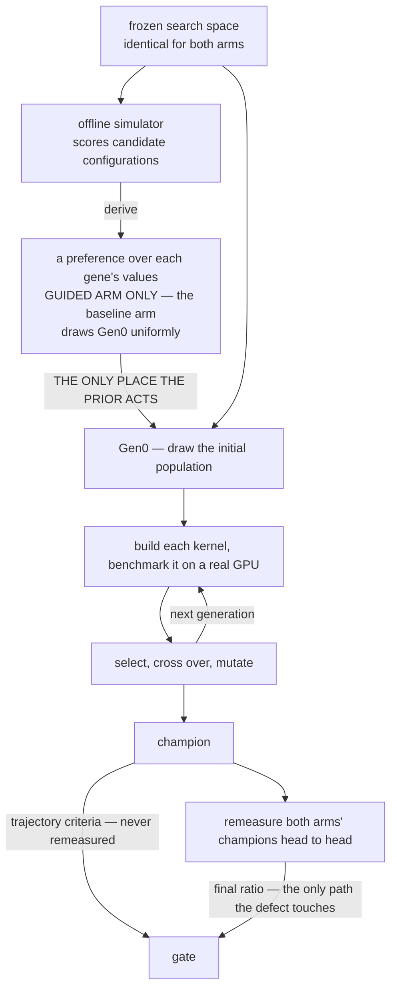

# S14 closeout — slide content

Generated from the **On the slide** blocks of `outline.md`. This file contains only what is
projected. Claims, caveats, speaker notes and sources live in `outline.md`; figure provenance
lives in `pic/README.md`.

Pages map 1:1 to `outline.md`. Pages marked *(draw in slides)* are conceptual diagrams best
made in the slide tool.

**Audience:** internal technical review, ~2026-08-20. GPU/GEMM literate, no prior knowledge of
this study.

---

## P1 — Does a Formocast Gen0 Prior Help Ductile?

> We asked whether seeding a genetic kernel search with a model-derived prior beats seeding it uniformly, measured it on real GPUs, and the answer is no.

- Per-shape single-objective GA, two arms, 5 paired seeds, MI300X.
- **Arm G (baseline):** Gen0 samples every free gene uniformly.
  **Arm F (guided):** Gen0 samples activated genes from a Formocast-derived, entropy-capped prior.
  Everything else identical.
- All measurement complete: capped `P0 = 512` on three shapes, native `P0 = 11,405` on both
  confirmatory shapes.
- **The answer is no — the prior did not meet the pre-registered directional gate.** The
  interesting part is what it took to be able to say that.

**Figure:** *(none — 3-row status strip; draw in slides)*

---

## P2 — Verdict: Gate Not Met

> Three directional criteria, four blocks, twelve cells — none reaches the required 4/5.

- The gate is a **conjunction of three** criteria, each needing `F > G` on **≥4/5** seeds.
- Twelve cells across four blocks. **None reaches 4/5.**
- All three criteria are read from the GA trajectory and **never** pass through the 7× remeasure —
  so the medium instrument defect (P19) cannot touch the verdict.
- Permitted wording: *"did not meet the pre-registered directional gate."*
- **What is claimable:** sparsity is real and reducer-independent (0 / 2 / 5 guidable genes of 27);
  the prior does move the Gen0 **centre**, and that half strengthened under a 22× pool (P17).

**Figure:** `pic/p02_gate_matrix.png`

---

## P3 — Two Tools, Two Input Formats

> Formocast answers per config, Ductile asks per gene, and the entire bridge exists to convert one into the other.

- **Ductile** — a GA design-space explorer inside TensileLite. Searches kernel configs and
  benchmarks each on a real GPU. Fitness = measured GFLOP/s.
- **Formocast** — an analytic performance simulator. Predicts latency for a **whole config**.
  No GPU involved.
- **The mismatch:** Formocast answers **per config**; Ductile asks **per gene**.
- **Ductile does not take probabilities.** Its field is `weights`, and it applies
  `w → exp(−0.25·(w − w.min()))` — **a lower weight means a higher sampling probability.**
  Feeding the prior in directly would invert the guidance.

**Figure:** *(none — two facing input-format cards; draw in slides)*

---

## P4 — Ductile's GA: 30 Generations, Two Decay Laws

> The population decays under two laws, one of which permanently overwrites the other, and that forces AUC to be integrated against evaluations rather than generations.

- Pinned: 30 generations, population 512, tournament selection, uniform crossover (p=0.9),
  5 % elitism, early stop `period = 5`.
- **Gen0 inflation.** If any gene has more candidates than the population, Gen0 inflates to
  `int(max_candidates × 1.15)` = **11,405**. The ×1.15 is undocumented. It buys ~68 % coverage of
  the 9,918-entry pool — do not call it "covering the space".
- **Two decay laws.** Law 1 halves only the *excess* above 512. Law 2 engages the moment diversity
  drops below 0.5, floors at 256, and **permanently overwrites law 1** — no path back.
- Under native settings, **99 % of the decay to law 2's floor is done by generation 14 of 30.**
- **The two arms do not always switch laws at the same generation** — identical on large (5/5
  seeds), differing by up to 2 generations on medium. So **AUC is integrated against evaluations,
  not generation index.**

**Figure:** `pic/p04_population_decay.png`

---

## P5 — The Pipeline, End to End

> One file differs between the arms, and two paths reach the gate — only one of which the instrument defect can touch.

- Frozen 30-gene space → Formocast predicts latency for 30,490 configs → five locked derivation
  steps → `ga-weights-{shape}.json` → Ductile GA → champion → 7× remeasure → gate.
- **`ga-weights-{shape}.json` is the only file that differs between the two arms.** Seeds, pins,
  evaluation and early stop are identical.
- **The prior acts exactly once, at Gen0.** After the initial population is drawn, the evolution
  loop never refers to it again — mutation picks replacement values uniformly. Everything the two
  arms do after generation 0 runs the same code, with no prior in it.
- **Two paths reach the gate.** The trajectory path (Gen0 / gen-10 / AUC) bypasses the remeasure
  entirely; the remeasure path carries the final ratio. **Only the second is exposed to the defect.**
- Step 5 — inverting Ductile's weight transform — is the step most likely to be got wrong.

**Figure:** the flowchart below, rendered wide.

---

## P6 — The 27 Tunable Genes

> The 27 free genes fall into eight functional families, and **every gene that carries signal sits in the three families on the data-supply path** — the other 16 genes never clear the cut on either confirmatory shape.

- **30 keys = 27 free genes + 3 composite group keys.** That is exactly what `best_params_so_far`
  records on every trajectory row.
- **Eight families, three of which carry all the signal.** ★ = activated for guidance
  (`S_g ≥ 0.05` **and** ≥ 2 trusted values); **0 / 2 / 5** genes on tiny / medium / large.

| category | genes | activated on medium | activated on large | best S_g medium / large |
|---|---:|---|---|---:|
| **loop structure & unrolling** — how the K loop is shaped and unrolled | 3 | `DepthU` | `UnrollLoopSwapGlobalReadOrder` | 0.142 / 0.165 |
| **global → LDS load path** — how operand data is fetched and staged | 6 | — | `PrefetchGlobalRead`, `GlobalReadVectorWidthA`, `GlobalReadVectorWidthB` | 0.039 / 0.192 |
| **LDS layout & buffering** — how LDS is laid out and how many buffers | 2 | `1LDSBuffer` | `TransposeLDS` | 0.113 / 0.057 |
| **tile mapping & DRAM channel** — which workgroup gets which tile, and where in K it starts | 4 | — | — | 0.042 / 0.022 |
| **epilogue / store path** — how results are written back to C/D | 4 | — | — | 0.017 / 0.023 |
| **cache modifiers** — `sc0` / `sc1` / `nt` bits on each operand | 4 | — | — | 0.011 / 0.004 |
| **MFMA & register allocation** — MFMA operand order and Acc-vs-Arch VGPRs | 2 | — | — | 0.022 / 0.003 |
| **instruction scheduling** — extra room for the scheduler | 2 | — | — | 0.005 / 0.006 |

- **The three live families are the data-supply path:** shape the K loop, lay out LDS, fetch the
  operands. **The five silent families are everything downstream of the MFMA** — store, cache
  hints, register allocation, scheduling, tile mapping. Their best gene tops out at `0.042`.
- **What actually shifts from medium to large is narrower than "loop → memory".** Both shapes take
  one loop-structure gene and one LDS gene. What large *adds* is the whole **global → LDS load
  path**, which goes from `0.039` (nothing selected) to `0.192` (three genes selected).

**The full inventory:**

| category | gene | n | candidate values | S_g tiny | S_g medium | S_g large |
|---|---|---:|---|---:|---:|---:|
| **loop structure & unrolling** | `DepthU` | 6 | `32, 64, 128, 256, 512, 1024` | 0.000 | **0.142** ★ | 0.029 |
|  | `UnrollLoopSwapGlobalReadOrder` | 2 | `0, 1` | 0.000 | 0.034 | **0.165** ★ |
|  | `TailloopInNll` | 2 | `false, true` | 0.000 | 0.012 | 0.010 |
| **global → LDS load path** | `PrefetchGlobalRead` | 4 | `1, 2, 3, 4` | 0.000 | 0.024 | **0.192** ★ |
|  | `GlobalReadVectorWidthA` | 7 | `-1, -2, 2, 3, 4, 6, 8` | 0.000 | 0.017 | **0.052** ★ |
|  | `GlobalReadVectorWidthB` | 7 | `-1, -2, 2, 3, 4, 6, 8` | 0.000 | 0.039 | **0.058** ★ |
|  | `WaveSeparateGlobalReadA` | 2 | `0, 2` | 0.000 | 0.001 | 0.015 |
|  | `WaveSeparateGlobalReadB` | 2 | `0, 2` | 0.000 | 0.009 | 0.008 |
|  | `DirectToVgprA` | 2 | `false, true` | — | — | — |
| **LDS layout & buffering** | `1LDSBuffer` | 2 | `0, 1` | 0.000 | **0.113** ★ | 0.022 |
|  | `TransposeLDS` | 4 | `-1, 0, 1, 2` | 0.000 | 0.029 | **0.057** ★ |
| **tile mapping & DRAM channel** | `WorkGroupMapping` | 18 | `-48, -32, -24, -16, -8, -6, -4, -2, -1, 0, 2, 4, 6, 8, 16, 24, 32, 48` | 0.000 | 0.042 | 0.022 |
|  | `WorkGroupMappingXCC` | 5 | `1, 2, 4, 8, 16` | 0.000 | 0.024 | 0.011 |
|  | `StaggerU` | 3 | `0, 8, 16` | 0.000 | 0.005 | 0.015 |
|  | `StaggerUStride` | 4 | `64, 128, 256, 512` | 0.000 | 0.014 | 0.007 |
| **epilogue / store path** | `NumElementsPerBatchStore` | 8 | `0, 2, 4, 8, 10, 12, 14, 16` | 0.000 | 0.017 | 0.023 |
|  | `StoreSyncOpt` | 3 | `0, 1, 4` | 0.000 | 0.011 | 0.011 |
|  | `AdaptiveGemm` | 2 | `0, 1` | 0.000 | 0.010 | 0.002 |
|  | `StorePriorityOpt` | 2 | `false, true` | 0.000 | 0.004 | 0.004 |
| **cache modifiers** | `NonTemporalA` | 2 | `0, 4` | 0.000 | 0.011 | 0.004 |
|  | `NonTemporalB` | 2 | `0, 4` | 0.000 | 0.003 | 0.004 |
|  | `NonTemporalC` | 2 | `0, 4` | 0.000 | 0.002 | 0.000 |
|  | `NonTemporalD` | 2 | `0, 4` | 0.000 | 0.011 | 0.004 |
| **MFMA & register allocation** | `SourceSwap` | 2 | `false, true` | 0.000 | 0.022 | 0.003 |
|  | `MIArchVgpr` | 2 | `false, true` | 0.000 | 0.002 | 0.002 |
| **instruction scheduling** | `ScheduleGROverBarrier` | 2 | `0, 1` | 0.000 | 0.001 | 0.006 |
|  | `ExtraMiLatencyLeft` | 2 | `-1, 0` | 0.000 | 0.005 | 0.003 |

- **The 3 composite group keys.** A group is one gene whose candidates are the *mutually legal
  member combinations*; the GA draws one whole entry. **None is treated in either arm** — say
  "not activated for guidance", never "frozen".

| group | family | member parameters | entries | distinct member values inside |
|---|---|---|---:|---|
| `group_0` | MFMA shape & tiling | `MatrixInstruction` · `GlobalSplitU` · `MIArchVgpr` · `WorkGroup` | **9,918** | 840 · 31 · 1 · 10 |
| `group_1` | global-read register path | `DirectToLds` · `UseSgprForGRO` | **3** of 4 | `(0,0)` `(0,1)` `(1,0)` — `(1,1)` illegal |
| `group_2` | LDS read scheduling | `ClusterLocalRead` · `LDSTrInst` | **2** of 4 | `(0,true)` `(1,false)` |

- **`group_0` is why Gen0 inflates.** 9,918 entries in one key, against 2–18 for every free gene.

**Figure:** *(none — the family summary is the slide; the full inventory is a backup slide)*

---

## P7 — What Was Held Fixed

> The only difference between arms is the Gen0 weight file; the capped budget is a shared boundary condition that cancels within a pair.

- Same shapes, same 5 seeds, same cards (one seed → one physical GPU for both its arms), same dtype
  and architecture, same client settings, same RNG mechanism.
- **`group_0` — 9,918 entries — is outside the treatment.** GEKO-weighted, not Formocast-weighted,
  and byte-identical between arms on all three shapes.
- That matters because `group_0` alone forces the Gen0 inflation — **the whole ×1.15 expansion
  exists to cover a gene that carries no treatment.**
- Capping Gen0 shrinks `group_0` coverage, so it **affects absolute champion quality and external
  validity** — but **cannot bias the paired contrast**, because both arms draw from the same
  untreated table.
- **27 is the free-gene denominator.** Some staged artifacts still say 29; use 27.

**Figure:** *(none — two side-by-side tables; draw in slides)*

---

## P8 — Three Shapes, Three Regimes

> Three deliberately divergent regimes, not a smooth sweep — the question is whether guidance reproduces across size diversity.

- tiny `8×8×1×128` · medium `256×256×1×1024` · large `2304×1024×1×214336`.
  A degenerate toy, a mid-size square, and a deep-K production GEMM.
- **K spans ×1,674 (3.2 orders); measured throughput spans ×239,895 (5.4 orders).**
  Say which quantity you mean.
- **medium and large are confirmatory; tiny is exploratory** and is not in the gate.
- Not a sweep to be co-optimised into one compromise answer — a test of reproduction across scale.

**Figure:** `pic/p08_shape_regimes.png`

---

## P9 — Gene Selection: Sensitivity, Prior, Guard

> Of 27 free genes, at most 5 are guidable, the sparsity is shape-appropriate, and that bounds what any null result means.

- Three-stage funnel: **select** genes by sensitivity → **build** a prior → **guard** with an
  entropy floor.
- **Select:** a gene needs sensitivity `S_g ≥ 0.05` and at least 2 trusted values. Sensitivity is
  measured in population rank-percentile points, entirely from the model.
- **Guard:** the entropy floor sits *downstream* of selection. It cannot change which genes carry
  signal — only **how strongly** an already-chosen preference is applied.
- **Outcome: 0 / 2 / 5 genes activated** on tiny / medium / large.
- **The sparsity is shape-appropriate, not random:** `DepthU` (loop structure) passes on medium and
  fails on large; `PrefetchGlobalRead` (memory pipeline) does the exact reverse. As K grows the
  dominant genes shift from loop structure to memory pipeline — what GEMM physics predicts.
  ⚠ Keep this at gene level. Per P6's family table, *both* shapes activate one loop-structure gene
  and one LDS gene; what large **adds** is the global → LDS load path.
- **The limit this puts on any null:** the strongest available guidance was applied at reduced
  strength over 2 of 27 genes on medium. **A null is a null for a prior of that size.**

**Figure:** `pic/p09_gene_sensitivity.png`

---

## P10 — The Bridge: Configs → Gene Probabilities

> Five locked steps convert per-config predictions into per-gene probabilities, and step 5 is the one that would fail silently.

- Per-size benefit from predicted-latency rank → shrinkage marginal → softmax over trusted values →
  entropy-capped mixture with the uniform prior → **invert Ductile's weight transform**.
- Ductile's `weights` field is **cost-like, not preference-like**. Emitting the prior directly would
  make the model's best value the **least** likely draw. The derivation emits `w ∝ −4·ln(p1)`.
- **Verified end to end on the shipped file:** untrusted mass equals the uniform share exactly; the
  entropy lands on the floor to 6 decimal places; non-activated genes come out exactly uniform.

**Figure:** `pic/p10_weight_inversion.png`

---

## P11 — Why Gen0 Was Capped at 512

> 512 is Ductile's own steady-state population, so the cap bounds external validity without biasing the paired contrast — and the native addendum tests exactly that.

- **512 is Ductile's own steady-state population**, not an arbitrary floor — it is the decay target
  native Ductile converges back to.
- **It does affect external validity** — the claim is scoped to the "P0-capped = 512 Ductile
  variant", not native Ductile.
- **It does not bias the paired contrast** — the capped resource is untreated and shared by both
  arms, so it cancels within a pair.
- The residual is a **treatment × budget interaction**, which is what the native addendum tests:
  identical in every respect except Gen0 scale, a **22× enlargement**.
- Three pre-registered questions: robustness, dilution, and the Gen0 extreme-value mechanism.

**Figure:** `pic/p11_gen0_pools.png`

---

## P12 — The Gate Is a Conjunction

> Three criteria, each ≥4/5 seeds, conjoined three ways — and all three survive the instrument defect by exposure and monotonicity, not by averaging.

- Three sub-criteria, each requiring `F > G` on **≥4/5** seeds: **Gen0 best**, **gen-10 best**,
  **AUC**. All three read from the trajectory.
- **A conjunction three times over:** all three must hold within a shape; the claim requires
  medium **and** large; and the Arm-S control only triggers if the gate is cleared somewhere.
- **AUC is integrated against evaluations, not generations** — evaluations per generation are not
  constant, so generation 20 of one arm can represent far fewer evaluations than the other's.
- **Why all three survive the defect:** they are maxima over single measurements, exposed to
  ~1.6 % of evaluations rather than 28–48 %, and one-sided-downward contamination cannot lower a
  running maximum. **Exposure and monotonicity, not averaging.**

**Figure:** `pic/p12_win_loss_per_seed.png`

---

## P13 — Four Quantities, Four Questions

> The same comparison read four ways, and the reason we report log-ratios is our own data.

- **Raw GFLOP/s** — *how fast is this champion?* Not comparable across shapes, nor across
  instrument settings within a shape.
- **`F/G`** — *did the guided arm win on this seed?* Seeds are the experimental units. Five seeds is
  never a significance claim.
- **`ln(F/G)`** — *what is the average multiplicative effect?* On our own medium data, averaging raw
  ratios reports **+5.0 %** where the correct central tendency is **−10.7 %** — one 2.12× seed drags
  the arithmetic mean. GPU throughput noise is multiplicative.
- **A noise baseline** — *is this bigger than the instrument's jitter?* The current rule
  (`NULL-AS-NOISE-BASELINE-20260818`) uses **null cells** as the baseline, reports every available
  scale side by side, and **registers no threshold**.
- **`NOT_EVALUATED` ≠ no effect.** tiny's question is *not evaluated / not activated*, not
  "guidance doesn't work at 8×8".

**Figure:** `pic/p13_four_quantities.png`

---

## P14 — Noise Control, and Why Median-of-7

> Six controls, one of which has a demonstrated blind spot, and an estimator that stands.

- Six controls: G and F **interleaved in one window on one card**; a counterbalanced start arm; a
  fresh client per repeat; hard idle gating; 7 repeats per arm; and the **within-pair ratio** as the
  endpoint, which cancels card-level offsets.
- The remeasure exists because of **winner's curse** — the GA picked the champion *because* it
  measured fastest, so the in-search number is systematically optimistic, and the bias grows with
  search size.
- **The order effect is real, and pairing freezes it rather than averaging it.** On medium the
  guided kernel always runs second and second position reads low, so **the reported numbers are
  conservative, biased against the guided arm.** This reverses sign on native; do not carry it over.
- **A demonstrated blind spot in the idle gate:** it checks GPU utilisation and host load but **not
  disk I/O**. One batch ran 13 % slow, contaminated by a concurrent file copy, while the gate read
  well inside its threshold. **Passing the idle gate does not mean the environment is clean.**
- **`max`-of-7 is banned from publication** — it moves a headline count across the pre-registered
  line toward the treated arm. Diagnostic use only.

**Figure:** *(none — 7× interleaved window timeline; draw in slides)*

---

## P15 — What the Search Budget Actually Buys

> The search sits in a low-marginal-return regime, and with five seeds and a ≥4/5 rule the detectable space was bounded before any prior was applied.

- **Where the gains come from.** Gen0 → generation 10 buys **+21 % to +26 %**. Generation 10 → end
  buys **+2.7 % to +4.9 %**. By generation 10 the champion is already **95–97 %** of its final value.
- **A clean, within-run budget test.** Same seed, same arm, same config: doubling the evaluations
  past generation 10 (47 % → 100 % of the budget) moves the champion **+4.9 %** on medium and
  **+2.7 %** on large. No confound of any kind.
- **Where the budget goes.** Under the capped condition Gen0 is **~5 %** of all evaluations; under
  native it is **34–36 %**, and 82–84 % of the budget is spent by generation 10.
- **What the prior moves, for comparison.** It shifts the Gen0 population centre by **+2.5 %**
  (capped) and **+3.3 %** under a 22× pool, on 5/5 seeds — **the same order as everything a ~3×
  compute increase buys.**
- 🔴 **A 22× bigger Gen0 pool does help — but the size of the help collapses.** Compare each arm
  against *itself* at the two pool sizes, treatment held constant. **native wins on 3/5 to 5/5 seeds
  at every checkpoint, including the endpoint** — it is genuinely the better condition. But the
  *magnitude* does not carry: a Gen0 lead of **+6 % to +27 %** is down to **+1.5 % to +6.0 %** by the
  end, even though native has done **5.4× more evaluations** by generation 10 alone. On large's
  guided arm the lead goes **+27.1 % → +3.6 % → +5.9 %**.
  ⚠ One arm does not shrink at all (medium baseline: +6.0 % → +9.1 % → +6.0 %); report it.
- 🔴 **A separate and stronger result: the gate does not move at all.** The bullet above is a
  within-arm comparison, where the lead shrinks but persists. Across arms it is worse than that —
  enlarging Gen0 22× left the guided arm's gen-10 count at **1/5 on both shapes**. So the
  limitation is not that Gen0 is a small share of the budget; it is that **a Gen0 advantage, of
  either origin, does not convert into a gate-level win.**
- 🔴 **And the gate itself was underpowered.** With 5 seeds, a ≥4/5 rule fires **6/32 = 18.75 %** of
  the time under a coin-flip null; reaching 80 % power needs a per-seed win probability of
  **≈0.83**. Against per-seed noise of 0.15–9.5 % and a target effect of 1–3 %, that is unreachable.

**Figure:** `pic/p15_search_budget.png`

---

## P16 — Medium: Gate Not Met, Endpoint Still Not Adjudicated

> All three criteria fall short, the repair bought precision rather than a different answer, and the native block cannot be judged at all.

- All three trajectory criteria are **3/5** on capped; native is 2/5 · 1/5 · 3/5.
- **The final endpoint is proposed as `NOT_EVALUATED / instrument-invalid`** — neither pass nor fail
  — and is **still awaiting a ruling.** On the defective instrument, 7 repeats of a single fixed
  config spanned 3.6×–6.1×, so the median of 7 was a lottery draw.
- **On the repaired instrument, medium capped is 3/5 positive — the same count as before.**
  The repair bought **precision, not a different conclusion.**
- **Medium native is reported but not judged.** Its effect cell is clean, but *both* null cells in
  that session are out of spec, and one null is 5.7×–47× noisier than the effect it is meant to
  calibrate. A null that noisy cannot calibrate anything.
- **Two of three pre-registered Q3 predictions came back refuted, and are reported as refuted.**

**Figure:** `pic/p16_medium_three_states.png` · `pic/p16_evolution_medium.png`

---

## P17 — Large: Gate Not Met, and Half a Mechanism Refuted

> The gate fails in both conditions, and the Gen0 mechanism must now be presented in two halves because direct manipulation confirmed one and refuted the other.

- Capped: **1/5 · 2/5 · 3/5.** Native: **3/5 · 1/5 · 2/5.** Gate not met either way.
- **The Gen0 mechanism, in two halves.** Enlarging the pool 22× is the most direct available test of
  "concentrating probability mass shrinks the upper tail":
  - **Centre — confirmed and strengthened.** Large 1.0197 → **1.0208 (5/5)**;
    medium 1.0251 → **1.0331 (5/5)**.
  - **Upper tail — refuted.** Large's guided extreme went 0.9719 (1/5) → **1.0023 (3/5)**: under 22×
    the disadvantage did not widen, it **disappeared**. The cross-shape gradient came out with the
    opposite sign too.
- Two readings remain open and are not adjudicated: the tail effect may decay with pool size, or the
  original 1/5 may simply have been underpowered.
- On native, only one seed is consistently better — and its margin comes largely from a baseline
  champion that did not hold up on remeasure (−11.95 %, the largest winner's curse in the ten runs).
  **This is why native champions were required to run the same 7× protocol — it caught one.**

**Figure:** `pic/p17_centre_extreme.png` · `pic/p17_evolution_large.png`

---

## P18 — The Four Blocks Side by Side

> The four final-ratio readings are not the same quantity, and scoring each seed against every available noise scale disagrees with the bare counts.

- **The four median `F/G` values are not the same quantity.** Two instruments, two aggregation
  methods, four different champions, and **opposite arm orders.** Do not compare them horizontally.
- Readings: medium capped **1.0135**, medium native **1.0036**, large capped **1.0006**,
  large native **0.9970**. **None is a pass** — there is no threshold.
- **What the bare counts hide.** Scoring each seed against *every* available noise scale:
  - **large capped** reads 3/5 positive, which sounds neutral — but two seeds are **consistently
    worse under every scale.**
  - **medium capped** has a seed at **39.5× the noise against one null and 3.0× against the other.**
    Not consistently anything — **scale-dependent.** That is a finding about the instrument (P21).
- Three of the four blocks compute their ratios **across days**, so the multiples are
  upper-bound-unknown.

**Figure:** `pic/p18_effect_vs_noise.png`

---

## P19 — The Noise Problem: What It Was, Why, and How We Fixed It

> The medium instrument was bimodal because warm-up is specified as an enqueue count rather than a time; raising the count fixed it, and we disconfirmed our own proposed mechanism along the way.

- **The symptom.** Remeasuring *one fixed champion* 7×, on one card, in one process, inside a ~22 s
  window should be the most repeatable number in the study. On medium it is **bimodal** — arm F
  spans **6.06×**, arm G **3.61×**, within a single window.
  (A **dropout** is one repeat below **0.95 × that arm's own maximum in that window** — the counter
  used on the next page.)
- **The cause.** The client specifies warm-up as an **enqueue count, not a time**, and the count is
  **identical for all three shapes** whose kernel durations differ by three orders of magnitude.
  The same 321 enqueues buys **~3.2 ms** on medium and **~600 ms** on large — medium was being timed
  before it was warm.
- **The sweep confirms it.** Dropout falls **48 % → 32 % → 12 % → 8 % → 0 %** as warm-up grows from
  3.2 ms to 51 ms, and holds at 0 % at 103 ms. ⚠ It **turns back up to 4 %** at 205 ms — not monotone
  above the knee, and the proposed mechanism does not explain that.
- **The fix.** Warm-up count **321 → 1400**; rotating-buffer size 4096 → 401, chosen so the rotating
  footprint stays **bit-identical to production**. Same instrument, properly warmed up.
- **Which of the two settings did the work — two orthogonal single-variable controls.**
  **Buffer only**, warm-up held at 321: `39.05 % → 40.60 %`, **no reduction at all**.
  **Warm-up only**, buffer held at production 4096 and `sleep-percent` matched at 50 on both sides:
  **`42 % → 0 %`**. ⚠ The same batch at 1637 warm-ups reads **6.00 %**, not 0 % — the non-monotonicity
  again. Direction and order of magnitude are unaffected: 1.55 pp against 42 pp.
- **The honest part: we proposed a mechanism and refuted it ourselves.** The clock-ramp explanation
  predicts dropouts run at low clock. Direct 1 kHz telemetry over 42 traced repeats shows **no
  relationship** (Spearman **−0.045**, p ≈ 0.78); every repeat, clean or contaminated, reached
  ≥ 1585 MHz. **The mechanism is `NOT_EVALUATED`** — an unidentified mechanism is not an absent one.

**Figure:** *(none — this page is the narrative; the evidence figures are backup slides:*
`pic/p19_defect_storyboard.png` *for the symptom and the sweep,*
`pic/apx_clock_disconfirmation.png` *for the refutation)*

---

## P20 — What the Repair Bought

> The reading got one to two orders of magnitude tighter at pilot scale, and the conclusion did not move.

- **The measurement itself got 19× to 100× tighter.** Per-seed cross-window sd of `ln(F/G)` falls
  from **0.25–0.43** to **0.0032–0.0194**, and **every seed improves.** This is the number that
  decides whether an effect is readable at all.
- **The QC counter follows.** Dropout on capped: **45.71 %** (campaign 1) and **24.29 %**
  (campaign 2) → **7.50 %**, confirmed at **6.43 %** on a repeat of the same cell; native
  **47.14 % → 6.55 %**.
- **What it did not buy: the answer.** The directional count is **3/5 before and 3/5 after.** The
  repair bought precision, not a different conclusion.
- **Scope, stated up front:** this is validated at **pilot scale — 12 windows per seed.**
- **A retraction, because it was ours.** An earlier draft claimed the repair "even flipped the
  direction". **Withdrawn** — the baseline cell is 4/5 positive with a standard error far too wide
  to support any direction claim.

**Figure:** `pic/p20_repair_dumbbell.png`

---

## P21 — One Thing Worth the Tuning Team's Time

> We ran the same search forty times and it found a different kernel every time. If the tile-tuning pipeline behaves the same way, some merge decisions at the 3 % gate are being made by luck — and one extra tuning run would show whether they are.

**What we saw**

- We ran the same search **40 times**, changing nothing but the random seed.
- It found a **different kernel every single time.** Not a small variation — a different macro tile.
- Between runs, the kernels they produced differed in performance by up to **7 %**.

**Why that might matter to you**

- Macro tile tuning runs the search **once** per tile, then merges the result if it beats the
  baseline by **3 %**.
- If your tuner is also this inconsistent, then whether a tile clears 3 % depends partly on which run
  you happened to get.
- ⚠ **We cannot tell you your number.** Our search also chose the macro tile. Yours fixes the tile
  first and only tunes the rest, so ours is noisier by an amount we cannot estimate.

**The check, and it is cheap**

- Tune **one** macro tile **twice**, changing only the random seed. Benchmark both the usual way.
  Compare the two uplifts.
- **If they land on opposite sides of 3 %, the merge decision is being made by luck.**
- Cost: one extra tile tuning — 2 to 3 hours.

**Two smaller things**

- **Benchmarking on more sizes will not fix it.** All 100 sizes run the same kernel. So whichever
  kernel that one run happened to find carries straight through to the geomean.
- **The end of a run may be nearly free to cut.** In ours the last fifth of the budget bought
  **0.2 %**. Worth a look in your own logs.

**What we would change in our own design**

- Read the code to confirm where the treatment actually applies, before committing a campaign to it.
- Do not decide anything by counting how many seeds won.
- Get the measurement rig right at full scale before the science run, not after it.

**Figure:** *(none — this page is prose; the null-scale backup slide is* `pic/apx_null_scales.png`*)*
