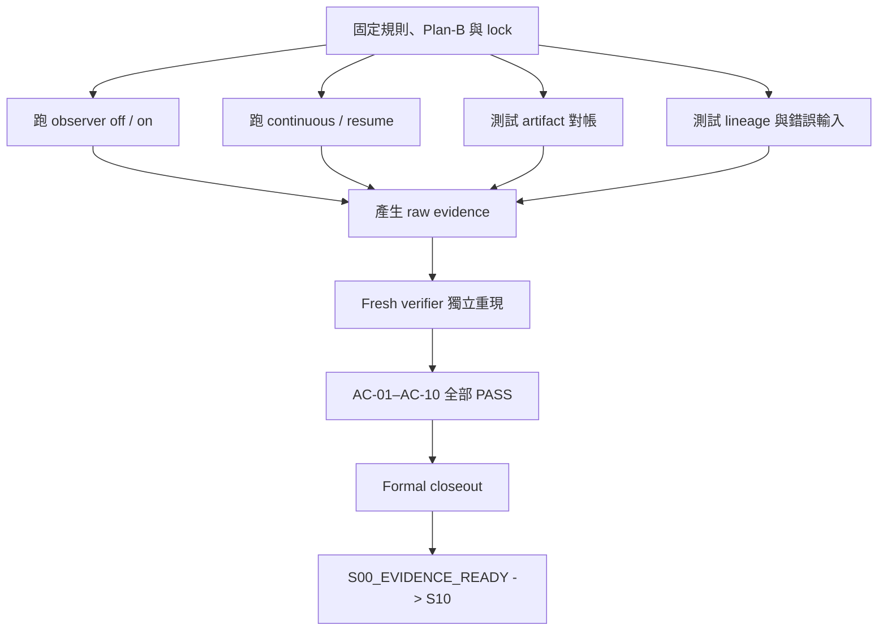

# S00 證據基礎：驗證與結案報告

> 這是 post-closeout editorial revision；只改善說明方式，不改實驗、證據或判決。

## 文件版本與歷史證據

- 原始 closeout commit：`8d1be2af3e5033ee74a1a8e3b31536f132a014cb`
- 原始 report SHA-256：`7a5ef5015d219c007c9cb1109d0f2579846239e5ee76f087a62e7ecd3c9feeb7`
- 原始 bytes 保存在 Git history，才是當時 staged-byte `CLOSEOUT_ACK` 與 historical validator 的重現邊界。
- 本次只重整文字與 Markdown 結構，沒有重新執行 S00，也沒有更新舊 lock、runner、schema 或 evidence。

相關文件：

- [S00 設計](../../s00-evidence-contract-lineage-observability-design.md)
- [研究 checkpoint 索引](../../README.md)
- [完整實驗計畫](../../../ductile-origami-warmstart-experiment-plan.md)

## 1. 30 秒白話結論

S00 的工作不是測 GPU 快不快，而是先確認「記錄實驗的工具」可信。
可以把它想成正式比賽前先驗收碼表、攝影機與封條：

- 開啟觀察紀錄不能改變搜尋結果。
- 暫停後再繼續，必須和不中斷地跑得到同一結果。
- 每筆輸入、輸出與摘要都必須能互相對帳。
- 證據必須綁定正確版本；資料缺少或被替換時，要拒絕判決。

| 問題 | 結果 |
| --- | --- |
| Technical verification | `PASS` |
| Scientific outcome | `positive` |
| Positive criterion | `S00_EVIDENCE_READY` |
| Acceptance criteria | `AC-01`–`AC-10` 全部 `PASS` |
| Checkpoint state | 原始 report 撰寫時為 `VERIFIED_PENDING_CLOSEOUT`；原始 commit 與 post-commit audit 後為 `CHECKPOINT_COMPLETE` |
| Verified edge | `S00_EVIDENCE_READY -> S10` |
| 測量邊界 | CPU-only synthetic evidence semantics |

一句話說，S00 證明了「後續實驗的證據可以被相信」，但沒有證明任何 GPU 效能或模型品質。

## 2. 這一關要回答什麼

後續 checkpoint 會產生許多候選設定、分數、checkpoint files 與判決。
如果記錄機制本身會影響搜尋，或 resume 後得到不同結果，那麼再漂亮的效能數字也不可靠。
因此 S00 先回答四個基礎問題：

1. **Observer neutrality：**觀察器只負責記錄，不能改變 GA 搜尋的 proposal、fitness、population 或 RNG 狀態。
2. **Checkpoint/resume parity：**中途保存再恢復，必須和 continuous run 沿著同一條 trajectory 前進。
3. **Artifact reconciliation：**generated input、backend result、observation 與 summary 必須一一對得起來。
4. **Lineage 與 fail-closed：**每份 evidence 都能追到唯一 effective lock；缺資料、版本不符或 lineage 錯誤時，系統必須停止而不是猜測。

這裡的 `lock` 是「把實驗版本、輸入與規則封住的紀錄」；`fail-closed` 是「不確定時拒絕通過」。

## 3. 實驗與判決流程



流程刻意先鎖定 authority，再產生 outcome-bearing evidence。
這能避免看完結果後才改規則，或拿錯版本的資料補成想要的結論。

## 4. 為什麼結果是 positive

### 4.1 Observer 沒有改變搜尋

同一個 seed 分別在 observer 關閉與開啟時執行。
兩側的 proposal、fitness、population、survivor、offspring、termination 與三類 RNG identity 都相同，`first divergence` 為 `no_divergence`。
Observer 開啟時雖然記錄了 23 個 events，甚至刻意消耗 Python／NumPy global RNG，但 GA 自己的結果仍沒有改變。

### 4.2 Resume 與不中斷執行相同

Continuous run 和 interrupted-resumed run 的完整 trajectory 相同，canonical hash 也相同。
兩側 events 與 checkpoint manifests 都能重新計算，沒有遺失、重複或跨 trajectory 混用的 identity。

### 4.3 對帳機制會拒絕不完整資料

合法 success 與 explicit backend failure 都能完成 reconciliation。
`in_progress`、`timeout`、`killed`、重複 record ID 或 summary 不一致等狀況，都被具名拒絕，且不會留下 partial decision。

### 4.4 錯誤 lineage 不會被當成有效證據

Lock substitution、缺少 evidence、語義上失敗的 evidence，以及錯誤 current-lock lineage 都會在產生 outcome 前停止。
這表示系統不是「能讀到 JSON 就算成功」，而是會確認內容、來源與版本都一致。

## 5. Technical PASS 和 scientific positive 有何不同

- Technical `PASS` 表示實作、測試、evidence 與 gate decision 符合 frozen Plan-B。
- Scientific `positive` 表示 S00-H1 在這個 CPU-only synthetic boundary 內獲得支持。
- `CHECKPOINT_COMPLETE` 還需要 formal report、parent projection、`CLOSEOUT_ACK`、closure commit 與 post-commit audit。

原始 report 是在 commit 前寫成，所以保留了 `VERIFIED_PENDING_CLOSEOUT` 的歷史視角。
原始 closeout commit 完成後，S00 才正式成為 `CHECKPOINT_COMPLETE`，並解鎖 S10。

## 6. E view 與 C view：為什麼同一份實驗有兩種畫面

S00 closeout 後，三份 lifecycle 文件需要更新成完成狀態，但原始 lock 又必須繼續綁定執行當時的 bytes。
因此報告區分兩個視圖：

| 視圖 | 白話說法 | 用途 |
| --- | --- | --- |
| Execution-authority view（E） | 封存的歷史實驗快照 | 重新執行 AC-01–AC-10，必須使用當時的 authority bytes |
| Closeout-projection view（C） | 結案後給人閱讀的目前狀態 | 顯示 checkpoint 已完成，以及下一條 dependency edge |

C view 直接呼叫 historical outcome writer 會得到 `bound_hash_mismatch`，這是預期的安全行為。
要重現 green execution，必須依附錄的 E reconstruction recipe 建立隔離視圖，不能修改 lock 或偷偷替換路徑。

## 7. 這份證據能與不能支持什麼

可以支持：

- Observer 不會改變這組 synthetic GA 搜尋。
- Checkpoint/resume 與 continuous execution 在預註冊邊界內等價。
- Runtime artifacts 可以對帳。
- Lineage 與 current-lock 檢查會 fail closed。

不能支持：

- GPU 是否可用。
- Formocast mapping 是否正確。
- Kernel performance、GFLOPS 或 speedup。
- Model quality 或 Stage 1 已可開始。
- 超出本次 fixtures、seeds 與 measurement boundary 的普遍結論。

## 8. 下一步

S00 的 positive closeout 只解除了 S10 的 dependency，沒有替 S10 預先建立 lock 或 outcome。
S10 後來完成為 mapping-negative；詳情見 [S10 entry gate report](s10-stage1-entry-gate-report.md)。
目前另有獨立的 [S10R1 valid-support recovery 設計](../../archive/s10r1-stage1-valid-support-entry-recovery-design.md)，它不會追溯改寫 S00 或 S10 的歷史判決。

## 9. 術語速查

| 術語 | 白話解釋 |
| --- | --- |
| `observer` | 旁路記錄實驗事件的元件 |
| `neutrality` | 開關記錄元件不改變實驗結果 |
| `checkpoint/resume parity` | 暫停再繼續和不中斷執行得到同一結果 |
| `reconciliation` | 確認輸入、執行結果、觀察值與摘要彼此一致 |
| `lineage` | 證據從哪個版本、輸入與 parent lock 產生 |
| `effective lock` | 目前唯一有效的實驗版本封條 |
| `fail-closed` | 資料不完整或不一致時拒絕通過 |
| `canonical hash` | 排除無關格式差異後的內容指紋 |

---

## 稽核附錄

以下保留 frozen authority、raw hashes、完整 commands、repair history 與 closeout recipe。
第一次閱讀只需先看主文；需要重現或稽核時再依附錄操作。

## 附錄 A. 原始 closeout 當下的結論與狀態邊界

S00 在 frozen CPU-only synthetic boundary 下得到：

- technical verification：`PASS`
- technical state：`VERIFIED_PENDING_CLOSEOUT`
- scientific outcome：`positive`
- criterion：`S00_EVIDENCE_READY`
- `AC-01`–`AC-10`：全部 `PASS`
- blockers／evidence requests／required unverified：皆無

這個 positive 結果支持 observer neutrality、durable checkpoint/resume parity、artifact reconciliation、lineage 與 current-lock fail-closed semantics。
它不支持 GPU availability、Formocast mapping、GFLOPS／kernel performance、model quality、Stage 1 readiness 或任何較廣的研究結論。
本報告是 AC-11 closeout delivery 的一部分。
只有本報告、三份 authority projection、原 verifier 對 exact staged bytes 的 `CLOSEOUT_ACK`、exact 33-path closure commit 及 post-commit audit 全部成功後，S00 才是 `CHECKPOINT_COMPLETE`，且 `S00_EVIDENCE_READY -> S10` 才從 machine candidate edge 成為 verified edge。
本報告不嵌入包含自己的 commit SHA，也不以 placeholder 或預填 manifest identity 冒充該 post-commit 事實。

## 附錄 B. Frozen oracle 與 authority

- Baseline branch：`users/perlee/doc-study`
- Baseline commit：`60775f12843bee9f95cb0bef4e91de8bc4dc9dc3`
- Original Plan-B：`agent_run/260725-ductile-factorized-guidance-s0-s2/milestones/S00/plan_b.md`
- Original Plan-B raw SHA-256：`b8e7a458bb6cb6fa103e92c50eed5c11b2e964c354dd71d629c61cdeecc571d9`
- Recovery Plan-B：`agent_run/260725-ductile-factorized-guidance-s0-s2/milestones/S00/recovery/plan_b.md`
- Recovery Plan-B raw SHA-256：`3f64ec77def3960b67756b0af576bdb5d4f28683ed11a1df55956fe87c0e34c2`
- Exact implementation whitelist：29 paths
- Implementation-list canonical SHA-256：`9686eab5037145252bc2233e514e5a050b2662352c78d4dcd3ce7ecb716f6aa6`
- Exact delivery whitelist：33 paths
- Delivery-list canonical SHA-256：`0632d43fafc8bf583d0ebdad60f1c832d7be4a0022f08602bcff61ec135deb5e`

Recovery authority 來自 2026-07-25 standing delegation，以及兩位 fresh design reviewers `/root/s00_recovery_design_a`、`/root/s00_recovery_design_b` 完整 cross-examination 後的 `AGREE`／`AGREE`。
該共識只把六個 `successor-001` paths append 到原 exact authority，形成 29/33 lists，並授權原 implementer/verifier resume loop 與一個 expanded closure commit；未授權 snapshot、intermediate commit、push、dependency install、container mutation、GPU/ROCm probe 或 S10 work。

## 附錄 C. Amendment 與兩代 lock

原 verifier iteration 1 找到三個 technical blockers：

1. `BLOCK-S00-LOCK-SUBSTITUTION`
2. `BLOCK-S00-RECONCILIATION-FAILOPEN`
3. `BLOCK-S00-RAW-DIRECT-EVIDENCE`

在任何 recovery bound source mutation 前，Main append 唯一一筆 amendment：

- amendment ID：`s00-successor-recovery-001`
- `previous_entry_sha256`：JSON `null`
- canonical entry/head SHA-256：`ec0e72c60aaa2d4ea1b54545aa1c9cbd2039401447bcca6d0d374e1866ee77b2`
- appended ledger raw SHA-256：`92da8dde11de879c573018a1f968648cef6f328ba44cee06e83f3b379ce81619`

Predecessor generation 永久保留且 bytes 未改：

| Artifact | Raw SHA-256 |
| --- | --- |
| genesis lock | `35d0c98cd9f6058fe21cd8723288d5bc34d68b87c3bf9e4bc9a0b7c488a0691c` |
| neutrality | `ada294f5cbf62643490564e52b8cb88092c8b6c07ad09ab7e8030f2bf436a315` |
| resume parity | `fe447f49989ad4996358cbeae60918c3209eebce314154ec022ad1e95b402281` |
| reconciliation | `bf6b83e739c6fc4c8dd437675f6b8f2cbeeceb31c3c287c71a877318cf04597a` |
| lineage fail-closed | `05a0fa9be80174a560de180ceb8bfe0399bb7ca01d625b0961910b97d1e46a82` |
| decision | `e73601ba108c31ac15d3372b8b951b8f5b50110071a5d74f8c5f982f5ac101c0` |

Genesis identity 為 `s00-lock-6c9bc5c909f46d287cada9e8b8a3b74d51e6a36dabc50ab98218d7d4ac0c1946`，parent 為 `null`。
它與五份 old evidence／decision 保留作 superseded provenance；old decision 不能成為 current authority。
Effective successor：

- lock ID：`s00-lock-51744fdaf66b580118189ed0027b025eff2f67d733a0f6b06059df6dfe3b0ef3`
- lock raw SHA-256：`a68653a4edbf4a00228231b74ad944a2437e0aae1773c74df12db146d3265a4e`
- parent：上述 genesis exact ID/raw hash
- generation/state：`successor-001`／`effective`

Verifier 由 raw bytes 重算兩份 Plan-B、29/33 literal lists 與 hash、baseline、contract、六 authorities、十一 sources、六 schemas、四 fixtures、四 seeds、formal-report target、ledger、recovery authority、immutable predecessor bindings 及 lock body/self ID；全部與 successor lock 一致。

## 附錄 D. Recovery 實作與 deviation 紀錄

Recovery shared mutation 只有 amendment ledger 加下列七個 paths：

| Path | Pre-recovery raw SHA-256 | Recovery raw SHA-256 |
| --- | --- | --- |
| `projects/hipblaslt/tensilelite/Tensile/ductile/evidence.py` | `f6cbee12097dcc1caf3f30ab8b7be780fbb8ab47775cb85cbeaf08801ec83c59` | `d55f14d0fe184974c7397c345a4d40b87132393578115375d1f24523a1d3b4bf` |
| `projects/hipblaslt/tensilelite/Tensile/Tests/unit/test_ductile_s00_foundation.py` | `3c85d03ed8985d37d14992a73d84bc87febed03bcf31cbf5e258d86df9c6db35` | `63daeb5f8c788b763d3920e7c8dce978ff6934cd467c2f55cb2b23a994c35ad1` |
| `protocol/v1/README.md` | `9bc761eab13261ca86d055998bbbe8dafea40255543f83ef44af30d0ddad7bbf` | `fd5fc03cdd3128befb2c573490df104510011c4328dceea181ed16ffe49ed8b9` |
| `protocol/v1/study-contract.yaml` | `2974f1fa3e0ce82fd34648c66b5636bfe8512d3f54f252245d17651ebb2c2b46` | `914cda8051406dc44dda6381f094ab91852c391b78f3f2b86226192925abf549` |
| `protocol/v1/amendment-ledger.jsonl` | `e3b0c44298fc1c149afbf4c8996fb92427ae41e4649b934ca495991b7852b855` | `92da8dde11de879c573018a1f968648cef6f328ba44cee06e83f3b379ce81619` |
| `protocol/v1/run_s00_foundation.py` | `543e1eaa00ab985f80358968dee33145f4427625b17f904e667aebe91ce92810` | `09441df0e1568ce572f017742c3cc35c258aa3f9273145586688ee48b713ee91` |
| `protocol/v1/schemas/study-contract.schema.json` | `264c9cf5a197166786c7ca1ce451d3b2c866e3fb14920f87923876e0116e75b5` | `d400c75d6321265f12db3955693359d295ca9c98434e6c1fd69943ebf033c355` |
| `protocol/v1/schemas/lock.schema.json` | `51392766846c912e1bf96f620da1315b83450554efee1edaf9b28657a9c81844` | `a4f2b345705f265c4b58c3f509b1542d0efad51a76a838964379bba068f60c7e` |

`ga.py` 保持 `5633a79b8e068137000dfcc2382124d3da1bd441d7049955799cd1f8f929aa35`；amendment/event/checkpoint/lineage schemas、四 fixtures 及 pinned operator/core sources 均保持 frozen bytes。
特別是 `space.py` 與 `mutation.py` 分別維持 `7f63af21d82c0f5942f3824ecb484956c2ff27a834e8ee696afc1e28a414f69e`、`c9a759f5d0c8be607cf4d3d4c52592d1a345ecb5edbcb38f28e3cff9bc631696`。
Plan-preserving repair iterations 依序修正：

1. canonical-equal Python scalar type 與 swapped-kind expected error；
2. canonical JSON object key order 不應成為 identity；
3. schema exact-const 及 temp successor amendment bindings；
4. non-object observation payload 明確 fail closed；
5. continuous/resumed event namespaces 與 global identity proof；
6. lineage current-lock raw probes；
7. population raw state/hash 逐欄重算。

Recorded deviations／corrections：

- Plan-B exact-byte preflight 依 role separation 由 Main 執行，implementer 只做 opaque identity dry validation；沒有改 acceptance 或 shared bytes。
- Main 第一次 status 清單誤抄四個 fixture 名稱；以 frozen Plan-B literal list 重算後為 exact 23，未發生 worktree 越權。
- Main 第一次 native validation 把 immutable legacy lock 套用 successor-only schema，得到預期 rejection；修正適用 instance 後 Draft 2020-12 驗證通過，old bytes 未改。
- Host 沒有 bare `python` 命令。

Verifier 記錄 exit 127 後，以同一既有 `python3` interpreter 執行相同 unit 參數；未安裝或改變環境。
除此之外沒有 unresolved deviation、partial output、timeout、killed/background run、dependency install、container mutation、GPU/ROCm probe 或 S10 work。

## 附錄 E. Authoritative successor evidence

| Artifact | Raw SHA-256 | Canonical outcome SHA-256 |
| --- | --- | --- |
| neutrality | `c55e1cf4cd87d70839fe93f5c2eea633ed0acb40030996bf7435b67579697317` | `fe3a36be2c626ee1d59bb4d33be57fee96848384651efa11beac48d94c3505e7` |
| resume parity | `1cf232065b814efec5a32c0b06307eb6953a92ca7e0ff8694573a21ea038ec9b` | `1d9e3860e87d22e8a69f50091a7a1d1d759b081ef5dea721a14f651c66f9dca5` |
| reconciliation | `705cec7c374f7e15c5f10da195c08a9cb267d3e1034c6e3a39cc861a062bdb24` | `2911a8079e53635dc30ec92115f791ca445c3af4110c7910fc31d87be829cba4` |
| lineage fail-closed | `5209937a45521b1caa10c2a29d4cfb3e16c898028019dccfe04ce83306af0743` | `145c291e3806cf0b6eb183a0127b75a8b95c11566738cea4a6594a77a6cddae0` |
| decision | `56fa4beacadbb8990c0716c9ccc5c2f0a9bba886cb0f5db12ee2b846576d31a7` | `5945136ecb446c3cbb6c6bac761c36d0606a259c695c1a79cc9966d71af2a991` |

Neutrality 的 observer-off／adversarial-observer-on 完整 raw runs 逐欄相同：4 evaluation batches、24 evaluations、4 generations，完整保存 proposal、fitness、updated/old population、survivors、offspring、champion、stats、population decay、termination 與三類 RNG identity。
Off events 為 0；on events 為 23；callbacks 消耗 Python global RNG 391 次、NumPy global RNG 391 次，23 份 payload 保持 immutable。
Raw-run canonical hash 兩側皆為 `f8bdd18fd7ba99b45fe57ceaa23e3b7727c6fdea4bd517a57ef513ca763592ce`，first divergence 為 `no_divergence`。
Continuous／interrupted-resumed 完整 raw runs 逐欄相同，canonical hash 兩側皆為 `b25abae0489aaee6db4f6cdc32f48bb0f1ddff03ed08f66de3860eae8321ee89`。
Events 為 27／28，兩側 sequence contiguous、IDs unique 且跨 trajectory disjoint；兩側各 4 份 checkpoint manifests 及 external journals 皆可重算。
Interrupt generation 為 2，selected checkpoint 為 `ga-checkpoint-1ea5e782e4c5c03789caa0d922b6ff67de205952647b3aafb1c89eddc2406614`，saved cursor 為 13，first divergence 為 `no_divergence`。
Reconciliation 從 raw records 重算合法 success 及 explicit backend failure state machines。
五個 recovery named probes 精確拒絕：

| Probe | Error |
| --- | --- |
| generated input 仍 `in_progress` | `record_status_in_progress` |
| observation `timeout` | `record_status_timeout` |
| observation `killed` | `record_status_killed` |
| cross-kind conflicting `record_id` | `duplicate_record_id` |
| success status 配 backend-failure summary | `summary_payload_mismatch` |

另四個 original negatives 與 13 個 lineage matrix cases 均由 production validators 具名拒絕。
四類 evidence 各做 removal 與語義完整的 FAIL artifact，共 8 個 decision gates：removal 均為 `decision_evidence_missing`，failure 均為 `decision_evidence_failed`；全部無 decision、partial output 或 edge。

## 附錄 F. Exact commands、環境與結果

除特別註明外，host CWD 為 `/data1/perlee/rocm-libraries`，所有成功命令 exit 0。

### F.1 Unit suites

Host unit CWD：`/data1/perlee/rocm-libraries/projects/hipblaslt/tensilelite`。
Host 首次執行下列 frozen literal command 時，bare `python` 不存在，exit 127，測試未開始：

```bash
PYTHONDONTWRITEBYTECODE=1 python -m unittest discover -s Tensile/Tests/unit -p 'test_ductile_s00_foundation.py' -v
```

既有 `python3` route 及 shell-function 重放 frozen literal route 均 exit 0、30/30：

```bash
PYTHONDONTWRITEBYTECODE=1 python3 -m unittest discover -s Tensile/Tests/unit -p 'test_ductile_s00_foundation.py' -v
```

```bash
python() { python3 "$@"; }
export -f python
PYTHONDONTWRITEBYTECODE=1 python -m unittest discover -s Tensile/Tests/unit -p 'test_ductile_s00_foundation.py' -v
```

Container route 的 host CWD 為 repo root，container CWD 為 `/src/rocm-libraries/projects/hipblaslt/tensilelite`；exit 0、30/30：

```bash
docker exec perlee sh -lc 'command -v python || true; command -v python3; cd /src/rocm-libraries/projects/hipblaslt/tensilelite && PYTHONDONTWRITEBYTECODE=1 python -m unittest discover -s Tensile/Tests/unit -p "test_ductile_s00_foundation.py" -v'
```

### F.2 Main lifecycle commands

下列五個命令的 CWD 都是 repo root，依序 exit 0：

```bash
PYTHONPATH=projects/hipblaslt/tensilelite python3 -B study_docs/research/ductile-origami-warmstart/protocol/v1/run_s00_foundation.py preflight-successor --original-plan-b agent_run/260725-ductile-factorized-guidance-s0-s2/milestones/S00/plan_b.md --recovery-plan-b agent_run/260725-ductile-factorized-guidance-s0-s2/milestones/S00/recovery/plan_b.md
```

```bash
PYTHONPATH=projects/hipblaslt/tensilelite python3 -B study_docs/research/ductile-origami-warmstart/protocol/v1/run_s00_foundation.py lock-successor --original-plan-b agent_run/260725-ductile-factorized-guidance-s0-s2/milestones/S00/plan_b.md --recovery-plan-b agent_run/260725-ductile-factorized-guidance-s0-s2/milestones/S00/recovery/plan_b.md
```

```bash
PYTHONPATH=projects/hipblaslt/tensilelite python3 -B study_docs/research/ductile-origami-warmstart/protocol/v1/run_s00_foundation.py evidence-successor
```

```bash
PYTHONPATH=projects/hipblaslt/tensilelite python3 -B study_docs/research/ductile-origami-warmstart/protocol/v1/run_s00_foundation.py decision-successor
```

```bash
PYTHONPATH=projects/hipblaslt/tensilelite python3 -B study_docs/research/ductile-origami-warmstart/protocol/v1/run_s00_foundation.py reproduce-successor --output-dir agent_run/260725-ductile-factorized-guidance-s0-s2/milestones/S00/recovery/main-reproduce.leoQoA
```

依序觀察到 `S00_SUCCESSOR_PREFLIGHT_OK`、`S00_SUCCESSOR_LOCK_EFFECTIVE`、四份 exclusive-write evidence、`S00_SUCCESSOR_EVIDENCE_READY` 及 `S00_SUCCESSOR_REPRODUCTION_OK`。

### F.3 Native Draft 2020-12 validation

Host CWD 為 repo root；既有 `perlee` container repo 為 `/src/rocm-libraries`。
完整命令：

```bash
docker exec -i perlee sh -lc 'cd /src/rocm-libraries && python3 -B -' <<'PY'
import json
from pathlib import Path
import yaml
from jsonschema import Draft202012Validator

root = Path('/src/rocm-libraries')
p = root / 'study_docs/research/ductile-origami-warmstart/protocol/v1'
schema_names = ['study-contract', 'amendment', 'lock', 'event', 'checkpoint', 'lineage']
schemas = {}
for name in schema_names:
    path = p / 'schemas' / f'{name}.schema.json'
    schema = json.loads(path.read_text())
    Draft202012Validator.check_schema(schema)
    schemas[name] = schema
    print(f'METASCHEMA_OK {name}')

contract = yaml.safe_load((p / 'study-contract.yaml').read_text())
Draft202012Validator(schemas['study-contract']).validate(contract)
print('INSTANCE_OK study-contract.yaml')

entries = [json.loads(line) for line in (p / 'amendment-ledger.jsonl').read_text().splitlines() if line.strip()]
assert len(entries) == 1, len(entries)
Draft202012Validator(schemas['amendment']).validate(entries[0])
print('INSTANCE_OK amendment-ledger.jsonl entries=1')

lock = json.loads((p / 'locks/s00-foundation-lock-successor-001.json').read_text())
Draft202012Validator(schemas['lock']).validate(lock)
print('INSTANCE_OK successor-lock')

valid = json.loads((p / 'fixtures/valid-run.json').read_text())
Draft202012Validator(schemas['lineage']).validate(valid['lineage'])
for event in valid['events']:
    Draft202012Validator(schemas['event']).validate(event)
print(f'INSTANCE_OK valid-fixture lineage=1 events={len(valid["events"])}')

neutral = json.loads((p / 'evidence/s00-neutrality-successor-001.json').read_text())
neutral_events = neutral['observation']['observer_on']['events']
for event in neutral_events:
    Draft202012Validator(schemas['event']).validate(event)
assert neutral['observation']['observer_off']['events'] == []
print(f'INSTANCE_OK neutrality-events on={len(neutral_events)} off=0')

resume = json.loads((p / 'evidence/s00-resume-parity-successor-001.json').read_text())
for branch in ('continuous', 'resumed'):
    events = resume['observation'][branch]['events']
    for event in events:
        Draft202012Validator(schemas['event']).validate(event)
    manifests = resume['observation']['checkpoint_evidence'][branch]
    for wrapped in manifests:
        Draft202012Validator(schemas['checkpoint']).validate(wrapped['manifest'])
        Draft202012Validator(schemas['lineage']).validate(wrapped['manifest']['lineage'])
    print(f'INSTANCE_OK resume-{branch} events={len(events)} checkpoints={len(manifests)}')
print('DRAFT202012_NATIVE_VALIDATION_OK')
PY
```

Exit 0；六份 metaschema、contract、one-entry ledger、successor lock、valid fixture lineage／3 events、neutrality 23/0 events、resume 27/28 events 及兩側各 4 checkpoints 全部 valid。

### F.4 Verifier fresh reproductions

兩個命令的 CWD 都是 repo root，皆 exit 0：

```bash
PYTHONPATH=projects/hipblaslt/tensilelite python3 -B study_docs/research/ductile-origami-warmstart/protocol/v1/run_s00_foundation.py reproduce-successor --output-dir agent_run/260725-ductile-factorized-guidance-s0-s2/milestones/S00/recovery/verifier-reproduce-iteration2-a
```

```bash
PYTHONPATH=projects/hipblaslt/tensilelite python3 -B study_docs/research/ductile-origami-warmstart/protocol/v1/run_s00_foundation.py reproduce-successor --output-dir agent_run/260725-ductile-factorized-guidance-s0-s2/milestones/S00/recovery/verifier-reproduce-iteration2-b
```

兩次皆為 `S00_SUCCESSOR_REPRODUCTION_OK`，canonical decision 皆為 `5945136ecb446c3cbb6c6bac761c36d0606a259c695c1a79cc9966d71af2a991`，且 authoritative old/current bytes unchanged。

### F.5 Invalid-lock production-writer probes

Host CWD 為 repo root。
完整命令：

```bash
set -euo pipefail
probe=agent_run/260725-ductile-factorized-guidance-s0-s2/milestones/S00/recovery/verifier-lock-writers-iteration2
test ! -e "$probe"
git check-ignore -v "$probe/probe.json"
PYTHONPATH=projects/hipblaslt/tensilelite python3 -B - <<'PY'
import importlib.util,json
from collections import Counter
from pathlib import Path
root=Path('/data1/perlee/rocm-libraries');probe=root/'agent_run/260725-ductile-factorized-guidance-s0-s2/milestones/S00/recovery/verifier-lock-writers-iteration2'
test_path=root/'projects/hipblaslt/tensilelite/Tensile/Tests/unit/test_ductile_s00_foundation.py';spec=importlib.util.spec_from_file_location('s00tests_lockwriters',test_path);t=importlib.util.module_from_spec(spec);spec.loader.exec_module(t);m=t.RUNNER
probe.mkdir(parents=True);_,contract_path,_,valid,_=t._write_temp_contract_and_lock(probe);cases=m._single_substitution_cases(valid)+[('combined-substitution',m._combined_substituted_lock(valid))];codes=Counter();names=[]
for index,(name,candidate) in enumerate(cases):
 lock_path=probe/f'candidate-{index:03d}.json';m.atomic_write_json(lock_path,candidate);output=probe/f'output-{index:03d}'
 try:m._write_successor_evidence_to(output,command='verifier-iteration2-invalid-lock',lock_path=lock_path,contract_path=contract_path,verify_plan_bytes=False)
 except m.EvidenceValidationError as e:codes[e.code]+=1
 else:raise AssertionError(f'invalid lock accepted: {name}')
 assert not output.exists(),(name,'partial output');names.append(name)
required={'original-plan-b-path','original-plan-b-sha256','recovery-plan-b-path','recovery-plan-b-sha256','amendment-path','amendment-raw_sha256','amendment-head_sha256','amendment-amendment_id','parent-null','parent-wrong-id','parent-wrong-hash','parent-self','lock-id-derived','body-sha256-derived','combined-substitution'}
assert required<=set(names),required-set(names)
print('ALL_INVALID_LOCK_WRITERS_FAIL_BEFORE_OUTPUT_OK')
print('CASES',len(cases),'CODES',json.dumps(dict(sorted(codes.items())),sort_keys=True))
print('REQUIRED_CASES',json.dumps(sorted(required)))
PY
```

Exit 0；223/223 pre-output rejection：148 `schema_validation_failed`、73 `lock_binding_mismatch`、2 `lock_hash_mismatch`。

### F.6 Raw recomputation、reconciliation 與 lineage probes

Host CWD 為 repo root。
完整命令：

```bash
PYTHONPATH=projects/hipblaslt/tensilelite python3 -B - <<'PY'
import importlib.util, json
from collections import Counter
from pathlib import Path

root=Path('/data1/perlee/rocm-libraries')
script=root/'study_docs/research/ductile-origami-warmstart/protocol/v1/run_s00_foundation.py'
spec=importlib.util.spec_from_file_location('s00runner_verify2',script); m=importlib.util.module_from_spec(spec);spec.loader.exec_module(m)
lock=m.strict_load_json(m.SUCCESSOR_LOCK_PATH)

failures=[]; codes=Counter()
for name,candidate in m._single_substitution_cases(lock):
    try:
        m._validate_successor_lock(candidate,verify_bound_bytes=False,verify_plan_bytes=False)
    except m.EvidenceValidationError as e:
        codes[e.code]+=1
    else:
        failures.append(name)
assert not failures, failures
single_count=sum(codes.values())
combined=m._combined_substituted_lock(lock)
try:
    m._validate_successor_lock(combined,verify_bound_bytes=False,verify_plan_bytes=False)
except m.EvidenceValidationError as e:
    combined_code=e.code
else:
    raise AssertionError('combined substitution accepted')

lock_sha=m.sha256_file(m.SUCCESSOR_LOCK_PATH)
auth={
 'neutrality':m.strict_load_json(m.SUCCESSOR_EVIDENCE_PATHS[0])['observation'],
 'resume-parity':m.strict_load_json(m.SUCCESSOR_EVIDENCE_PATHS[1])['observation'],
 'reconciliation':m.strict_load_json(m.SUCCESSOR_EVIDENCE_PATHS[2])['observation'],
 'lineage-fail-closed':m.strict_load_json(m.SUCCESSOR_EVIDENCE_PATHS[3])['observation'],
}
m._validate_neutrality_observation(auth['neutrality'])
m._validate_resume_observation(auth['resume-parity'])
m._validate_reconciliation_observation(auth['reconciliation'])
m._validate_lineage_observation(auth['lineage-fail-closed'])
fresh={
 'neutrality':m.run_neutrality(lock,effective_lock_sha256=lock_sha),
 'resume-parity':m.run_resume(lock,effective_lock_sha256=lock_sha),
 'reconciliation':m.run_reconciliation(),
 'lineage-fail-closed':m.run_lineage(lock,lock_path=m.SUCCESSOR_LOCK_PATH),
}
assert fresh==auth

for kind,path in zip(('neutrality','resume-parity','reconciliation','lineage-fail-closed'),m.SUCCESSOR_EVIDENCE_PATHS):
    m._validate_artifact(path,lock,kind,lock_path=m.SUCCESSOR_LOCK_PATH)
m._validate_decision(m.SUCCESSOR_DECISION_PATH,lock,lock_path=m.SUCCESSOR_LOCK_PATH,evidence_dir=m.EVIDENCE_DIR)

old_evidence=m.EVIDENCE_DIR/'s00-neutrality.json'
try:
    m._validate_artifact(old_evidence,lock,'neutrality',lock_path=m.SUCCESSOR_LOCK_PATH)
except m.EvidenceValidationError as e:
    old_evidence_code=e.code
else: raise AssertionError('old evidence accepted under successor lock')
try:
    m._validate_decision(m.EVIDENCE_DIR/'s00-decision.json',lock,lock_path=m.SUCCESSOR_LOCK_PATH,evidence_dir=m.EVIDENCE_DIR)
except m.EvidenceValidationError as e:
    old_decision_code=e.code
else: raise AssertionError('old decision accepted as current')

recon=auth['reconciliation']; named={x['case_id']:x for x in recon['invalid_cases'] if x['case_id'] in {
 'generated-input-in-progress','observation-timeout','observation-killed','cross-kind-conflicting-record-id','success-status-backend-failure-summary'}}
assert set(named)=={'generated-input-in-progress','observation-timeout','observation-killed','cross-kind-conflicting-record-id','success-status-backend-failure-summary'}
assert all(x['observed_error']==x['expected_error'] and x['no_ready_edge'] is True for x in named.values())
lin=auth['lineage-fail-closed']; current={x['case_id']:x for x in lin['current_lock_cases']}
assert {'missing-current-successor-lock','superseded-old-lock-is-not-current','successor-lock-substitution','illegal-null-successor-parent','mismatched-successor-parent'}<=set(current)
assert all(x['observed_error']==x['expected_error'] and x['no_ready_edge'] is True for x in current.values())
assert {x['kind'] for x in lin['evidence_class_matrix']}=={'neutrality','resume-parity','reconciliation','lineage-fail-closed'}
assert all(x['removal_error']=='decision_evidence_missing' and x['failure_error']=='decision_evidence_failed' and x['outgoing_edges']==[] for x in lin['evidence_class_matrix'])
assert all(x['observed_error']==x['expected_error'] and x['no_ready_edge'] is True for x in lin['cases'])
print('FULL_NEGATIVE_AND_RAW_RECOMPUTATION_OK')
print('LOCK_SINGLE_SUBSTITUTIONS',single_count,dict(sorted(codes.items())))
print('LOCK_COMBINED',combined_code)
print('RAW_FRESH_EQUAL',','.join(fresh))
print('NEUTRALITY_RAW',len(auth['neutrality']['observer_on']['events']),len(auth['neutrality']['observer_off']['events']),auth['neutrality']['criterion_status'],auth['neutrality']['first_divergence'])
print('RESUME_RAW',len(auth['resume-parity']['continuous']['events']),len(auth['resume-parity']['resumed']['events']),len(auth['resume-parity']['checkpoint_evidence']['continuous']),len(auth['resume-parity']['checkpoint_evidence']['resumed']),auth['resume-parity']['criterion_status'],auth['resume-parity']['first_divergence'])
print('RECON_INVALID',len(recon['invalid_cases']),'NAMED',json.dumps({k:v['observed_error'] for k,v in sorted(named.items())},sort_keys=True))
print('LINEAGE_AC07_CASES',len(lin['cases']),'CURRENT_LOCK_CASES',json.dumps({k:v['observed_error'] for k,v in sorted(current.items())},sort_keys=True))
print('EVIDENCE_CLASS_MATRIX',json.dumps(lin['evidence_class_matrix'],sort_keys=True))
print('HISTORICAL_REJECT',old_evidence_code,old_decision_code)
PY
```

Exit 0；`FULL_NEGATIVE_AND_RAW_RECOMPUTATION_OK`、222 single＋1 combined validator rejection、fresh raw observations 逐項相等、9 reconciliation cases、13 AC-07 lineage cases 與 historical current-selection rejection 皆匹配。

### F.7 Evidence removal／semantic-failure decision gates

Host CWD 為 repo root。
完整命令：

```bash
set -euo pipefail
probe=agent_run/260725-ductile-factorized-guidance-s0-s2/milestones/S00/recovery/verifier-decision-gates-iteration2c
test ! -e "$probe"
git check-ignore -v "$probe/probe.json"
PYTHONPATH=projects/hipblaslt/tensilelite python3 -B - <<'PY'
import copy, importlib.util, json
from pathlib import Path
root=Path('/data1/perlee/rocm-libraries')
probe=root/'agent_run/260725-ductile-factorized-guidance-s0-s2/milestones/S00/recovery/verifier-decision-gates-iteration2c'
test_path=root/'projects/hipblaslt/tensilelite/Tensile/Tests/unit/test_ductile_s00_foundation.py'
spec=importlib.util.spec_from_file_location('s00tests_verify2c',test_path);t=importlib.util.module_from_spec(spec);spec.loader.exec_module(t);m=t.RUNNER
probe.mkdir(parents=True)
_,contract_path,_,lock,lock_path=t._write_temp_contract_and_lock(probe)
base=probe/'base-evidence';m._write_successor_evidence_to(base,command='verifier-iteration2-decision-gate',lock_path=lock_path,contract_path=contract_path,verify_plan_bytes=False)
lock_sha=m.sha256_file(lock_path); kinds=('neutrality','resume-parity','reconciliation','lineage-fail-closed')
validators={'neutrality':m._validate_neutrality_observation,'resume-parity':m._validate_resume_observation,'reconciliation':m._validate_reconciliation_observation,'lineage-fail-closed':m._validate_lineage_observation}
baseobs={k:m.strict_load_json(base/f's00-{k}-successor-001.json')['observation'] for k in kinds}
def failed_observation(kind):
 obs=copy.deepcopy(baseobs[kind])
 if kind=='neutrality': obs['callback_counts']['python']=0
 elif kind=='resume-parity': obs['resumed']['raw_run']['python_rng_sha256']='0'*64;obs['raw_run_sha256']['resumed']=m.canonical_sha256(obs['resumed']['raw_run']);obs['first_divergence']=m._first_divergence(obs['continuous']['raw_run'],obs['resumed']['raw_run'])
 elif kind=='reconciliation': obs['invalid_cases'][0]['no_ready_edge']=False
 elif kind=='lineage-fail-closed': obs['evidence_class_matrix'][0]['outgoing_edges']=['S10']
 obs['criterion_status']='FAIL';validators[kind](obs);return obs
results=[]
for target in kinds:
 for mode in ('remove','fail'):
  candidate=probe/f'{target}-{mode}';candidate.mkdir();prior=[]
  for kind in kinds:
   obs=failed_observation(kind) if kind==target and mode=='fail' else copy.deepcopy(baseobs[kind])
   artifact=m._artifact(kind,lock,lock_sha,prior,obs,'verifier-iteration2-semantic-gate')
   path=candidate/f's00-{kind}-successor-001.json';m.atomic_write_json(path,artifact)
   prior=[{'artifact_id':artifact['artifact_id'],'path':str(path.relative_to(root)),'sha256':m.sha256_file(path)}]
  if mode=='remove': (candidate/f's00-{target}-successor-001.json').unlink()
  output=probe/f'decision-{target}-{mode}'
  try: m._write_successor_decision_to(output,candidate,command='verifier-iteration2-negative',lock_path=lock_path,contract_path=contract_path,verify_plan_bytes=False,independent_reproduction=False)
  except m.EvidenceValidationError as e: code=e.code
  else: raise AssertionError(f'accepted {target} {mode}')
  expected='decision_evidence_missing' if mode=='remove' else 'decision_evidence_failed';assert code==expected,(target,mode,code);assert not output.exists(),(target,mode,'partial output')
  results.append({'kind':target,'mode':mode,'error':code,'output_absent':True})
print('EIGHT_SEMANTIC_DECISION_GATES_OK')
print(json.dumps(results,sort_keys=True))
PY
```

Exit 0；四類 removal 均為 `decision_evidence_missing`，四類 semantic failure 均為 `decision_evidence_failed`，8/8 decision/output absent。

### F.8 Scope/status commands

Repo-root commands：

```bash
git diff --check
```

```bash
git status --porcelain=v1 -uall
```

加上從 frozen Recovery Plan-B literal list 解析的 exact comparison，exit 0；technical verification 結束時 implementation 29/29、missing/extra 皆空、staged 0。
Reproduction 的 raw artifact hashes 因 invocation output path 屬 volatile provenance 而不同，但兩次 fresh 與 authoritative 的完整 observations 及五個 canonical outcomes 逐項相同；reproduction 前後 predecessor 及 authoritative successor bytes 都未改。
Native Draft route 只使用既有 `perlee` container 與 already-provisioned `jsonschema` 4.25.1；沒有 install 或持久 container mutation。
全部有效命令自然完成，無 timeout、killed、still-running 或 background work。

## 附錄 G. Acceptance disposition

| Criterion | Status | Direct basis |
| --- | --- | --- |
| AC-01 | PASS | 六 schemas 原生 validation、amended contract、ledger、successor lock、fixtures 及無 retired runtime dependency。|
| AC-02 | PASS | 兩代 lock、兩份 Plan-B、29/33 lists 與全部 bindings 重算；222 single＋1 combined substitutions 全拒。|
| AC-03 | PASS | Amendment 先於 mutation、old six immutable、exclusive writes、wrong/stale/current-selection cases 無 partial output。|
| AC-04 | PASS | Adversarial observer off/on 完整 raw trajectories、events、RNG identities 逐欄 no divergence。|
| AC-05 | PASS | Continuous/resumed 完整 raw trajectories、27/28 events、8 manifests、boundary mapping 逐欄 no divergence。|
| AC-06 | PASS | Exact state machines 與 joins 重算；原有 4 個加上 5 個具名 negative cases，共 9 個案例皆精確拒絕。|
| AC-07 | PASS | 13 lineage cases、223 lock-writer probes、strict event/checkpoint cases 及 8 evidence gates 全部 fail closed。|
| AC-08 | PASS | 四份 successor chain 與 decision join 重算；old decision 排除；removal/failure 均 no-edge。|
| AC-09 | PASS | Main 一次＋verifier 兩次 fresh reproduction canonical match，volatile provenance 邊界正確。|
| AC-10 | PASS | Ordinary GA default route、operator/core hashes、exact scope 與 CPU-only/no-S10 邊界通過。|
| AC-11 | Closeout transaction | 本報告與三份 projection 需經原 verifier staged-byte ACK、exact commit 及 post-audit。|

`completion_correctness` 與 `scientific_outcome` 分離：前者確認 protocol、驗證與 closeout 交易是否正確；後者確認 S00-H1 在可信 evidence 下是否被支持。
這次兩者分別為 technical `PASS` 與 scientific `positive`，但 technical PASS 本身不跳過 AC-11。

## 附錄 H. Iteration、finding closure 與保留限制

- Original implementation 建立 genesis protocol 與第一代 evidence；原 verifier iteration 1 為 `CHANGES_REQUIRED`，AC-02–AC-09 未通過，scientific outcome 為 `NOT_ESTABLISHED`，不是 negative。
- Dual-review recovery consensus 選擇 append-only successor，不覆寫失敗世代，也不建 snapshot/intermediate commit。
- Recovery implementer 關閉三個 findings；Main 完成 exact preflight、successor generation 與 raw audit；原 verifier iteration 2 作 FULL 重驗，沒有只驗 patch points。
- Iteration 2 verifier artifact identities：

  - report raw SHA-256：`a8b4ebeb0a7e00b1b4d74a952af94195da61e9be210ae62b25fe5b7072fcf4dd`
  - verdict raw SHA-256：`d8feb2ae68e483d76a88962d9286f0b2a3387c55d35b27da12ce12f3ae2af60b`

Base recovery 完整保留六份 failed-generation raw artifacts，並在 predecessor lock／amendment 中保留原 17 個 shared paths 的 old hashes；它**沒有**保存那 17 份 shared old raw contents 的 snapshot，因此不能宣稱可只靠 final tree 重建完整 old 23-path workspace。
這是已審查且明示的 provenance 限制，不影響六份 immutable old artifacts 或 current successor evidence 的可驗證性。

## 附錄 I. Immutable execution view 與 closeout projection view

### I.1 兩個合法視圖

Technical PASS 之後，Recovery Plan-B §11 要求 exact 三份 authority projection 改成 verified lifecycle 狀態；successor lock 則正確地拒絕這三份 authority bytes 改動。
Closeout iteration 1 修正報告的 exact commands 後，iteration 2 因此發現：

- **Execution-authority view（E）**：baseline commit `60775f12843bee9f95cb0bef4e91de8bc4dc9dc3` 加 exact 29 implementation blobs，以及兩份 exact ignored Plan-B blobs；parent plan、active README 與 S00 design 保持 baseline bytes。

`protocol/v1/README.md` 是這個 immutable E view 的 runbook。
E 是 AC-01–AC-10 與 fresh reproduction 的執行邊界。

- **Closeout-projection view（C）**：final exact 33-path closure tree；同一 29 個 implementation blobs 加本 formal report 及 exact 三份 post-PASS projections。

C 是 AC-11 完成後供使用者閱讀的 active lifecycle view，不是 historical outcome writer 的執行 view。
兩位 fresh closeout-binding reviewers `/root/s00_closeout_binding_a` 與 `/root/s00_closeout_binding_b` 反覆交互詰問後皆 `AGREE`：保留 successor-001、兩個 immutable generations、one-entry amendment、29/33 authority 與 validator semantics；不新增 successor-002、不再 append amendment、不改 test／lock／contract，也不把 C 標成 green execution view。
三份 authority 的 raw E→C mapping 如下。
E hashes 由 baseline Git object 直接重算；C hashes 在三份 projection 達到 final bytes 後計算，且 projection 只單向連到本 report，不嵌入 report hash：

| Authority projection | E raw SHA-256 | C raw SHA-256 |
| --- | --- | --- |
| `study_docs/research/ductile-origami-warmstart-experiment-plan.md` | `48e64a29c559e130c02fe60e61adc630d676df41cf5ec92a2d6156eb68ea5e73` | `ac080763ef82fe49c2944170803b5ed3531c0249c86faef2744df3f15588efe3` |
| `study_docs/research/ductile-origami-warmstart/README.md` | `b63f37b5a9ada937b8c67f337b604c74b6682ec513cb77984634dbb01bbc82e5` | `cc6cca1a681a509b6c4b17f13bc0d007132aa98b985d112b654e98d5132e83da` |
| `study_docs/research/ductile-origami-warmstart/s00-evidence-contract-lineage-observability-design.md` | `c3698947fbb58bb34b4f346848f8aa5a33c8ef3a18a46c3f864ed28b08914fc1` | `920c9b65445bdd29ea751c02e99d03fb720d17475bf3026cdb57aea29eca4150` |

### I.2 Exact E reconstruction recipe

下列 repo-root Bash route 只讀 baseline／index 或 closure commit，建立 isolated temp tree；不修改 main tracked tree 或 index。
Pre-commit closeout audit 令 `s00_source_mode=index`；post-commit audit 令 `s00_source_mode=commit`，並由 formal-report introduction identity 解析唯一 closure commit。
初版配方把完整 baseline archive 放在 `/tmp`；原 verifier 獨立重跑時該 8.9 GiB tree 使 `/tmp` 耗盡，`tar` exit 2，未開始 test、未改 main tree/index，也未給 `CLOSEOUT_ACK`。
經兩位 closeout-binding reviewers 再次 `AGREE`，durable route 固定使用有容量 gate 的 `/data1/perlee/s00-closeout-tmp`，禁止 fallback 至 `/tmp`。
Array 是 Recovery Plan-B exact ordered 29-path list，不可改成 glob：

```bash
set -euo pipefail
s00_repo=/data1/perlee/rocm-libraries
s00_baseline=60775f12843bee9f95cb0bef4e91de8bc4dc9dc3
s00_source_mode=index
s00_temp_parent=/data1/perlee/s00-closeout-tmp
mkdir -p "$s00_temp_parent"
s00_data1_available_kib=$(df -Pk /data1 | awk 'NR == 2 {print $4}')
test "$s00_data1_available_kib" -ge 20971520
s00_tmp=$(mktemp -d \
  "$s00_temp_parent/execution-view.XXXXXX")
case "$s00_tmp" in
  "$s00_temp_parent"/execution-view.*) ;;
  *) exit 2 ;;
esac
s00_e_root="$s00_tmp/e"
mkdir -p "$s00_e_root"
s00_index_before=$(git write-tree)
s00_status_before=$(git status --porcelain=v1 -uall | sha256sum | awk '{print $1}')
git archive "$s00_baseline" | tar -x -C "$s00_e_root"

s00_e_paths=(
'projects/hipblaslt/tensilelite/Tensile/ductile/algorithm/ga.py'
'projects/hipblaslt/tensilelite/Tensile/ductile/evidence.py'
'projects/hipblaslt/tensilelite/Tensile/Tests/unit/test_ductile_s00_foundation.py'
'study_docs/research/ductile-origami-warmstart/protocol/v1/README.md'
'study_docs/research/ductile-origami-warmstart/protocol/v1/study-contract.yaml'
'study_docs/research/ductile-origami-warmstart/protocol/v1/amendment-ledger.jsonl'
'study_docs/research/ductile-origami-warmstart/protocol/v1/run_s00_foundation.py'
'study_docs/research/ductile-origami-warmstart/protocol/v1/schemas/study-contract.schema.json'
'study_docs/research/ductile-origami-warmstart/protocol/v1/schemas/amendment.schema.json'
'study_docs/research/ductile-origami-warmstart/protocol/v1/schemas/lock.schema.json'
'study_docs/research/ductile-origami-warmstart/protocol/v1/schemas/event.schema.json'
'study_docs/research/ductile-origami-warmstart/protocol/v1/schemas/checkpoint.schema.json'
'study_docs/research/ductile-origami-warmstart/protocol/v1/schemas/lineage.schema.json'
'study_docs/research/ductile-origami-warmstart/protocol/v1/fixtures/valid-run.json'
'study_docs/research/ductile-origami-warmstart/protocol/v1/fixtures/invalid-lineage.json'
'study_docs/research/ductile-origami-warmstart/protocol/v1/fixtures/duplicate-events.json'
'study_docs/research/ductile-origami-warmstart/protocol/v1/fixtures/backend-failure.json'
'study_docs/research/ductile-origami-warmstart/protocol/v1/locks/s00-foundation-lock.json'
'study_docs/research/ductile-origami-warmstart/protocol/v1/evidence/s00-neutrality.json'
'study_docs/research/ductile-origami-warmstart/protocol/v1/evidence/s00-resume-parity.json'
'study_docs/research/ductile-origami-warmstart/protocol/v1/evidence/s00-reconciliation.json'
'study_docs/research/ductile-origami-warmstart/protocol/v1/evidence/s00-lineage-fail-closed.json'
'study_docs/research/ductile-origami-warmstart/protocol/v1/evidence/s00-decision.json'
'study_docs/research/ductile-origami-warmstart/protocol/v1/locks/s00-foundation-lock-successor-001.json'
'study_docs/research/ductile-origami-warmstart/protocol/v1/evidence/s00-neutrality-successor-001.json'
'study_docs/research/ductile-origami-warmstart/protocol/v1/evidence/s00-resume-parity-successor-001.json'
'study_docs/research/ductile-origami-warmstart/protocol/v1/evidence/s00-reconciliation-successor-001.json'
'study_docs/research/ductile-origami-warmstart/protocol/v1/evidence/s00-lineage-fail-closed-successor-001.json'
'study_docs/research/ductile-origami-warmstart/protocol/v1/evidence/s00-decision-successor-001.json'
)
test "${#s00_e_paths[@]}" -eq 29

case "$s00_source_mode" in
  index)
    git checkout-index -f --prefix="$s00_e_root/" -- "${s00_e_paths[@]}"
    ;;
  commit)
    s00_report=study_docs/research/ductile-origami-warmstart/reports/staged/s00-foundation-verification-report.md
    s00_closure=$(git log --diff-filter=A --format=%H -n1 -- "$s00_report")
    test -n "$s00_closure"
    s00_temp_index="$s00_tmp/closure.index"
    GIT_INDEX_FILE="$s00_temp_index" git read-tree "$s00_closure"
    GIT_INDEX_FILE="$s00_temp_index" git checkout-index -f \
      --prefix="$s00_e_root/" -- "${s00_e_paths[@]}"
    ;;
  *)
    exit 2
    ;;
esac

s00_original=agent_run/260725-ductile-factorized-guidance-s0-s2/milestones/S00/plan_b.md
s00_recovery=agent_run/260725-ductile-factorized-guidance-s0-s2/milestones/S00/recovery/plan_b.md
mkdir -p \
  "$s00_e_root/$(dirname "$s00_original")" \
  "$s00_e_root/$(dirname "$s00_recovery")"
cp -- "$s00_repo/$s00_original" "$s00_e_root/$s00_original"
cp -- "$s00_repo/$s00_recovery" "$s00_e_root/$s00_recovery"
test "$(sha256sum "$s00_e_root/$s00_original" | awk '{print $1}')" = \
  b8e7a458bb6cb6fa103e92c50eed5c11b2e964c354dd71d629c61cdeecc571d9
test "$(sha256sum "$s00_e_root/$s00_recovery" | awk '{print $1}')" = \
  3f64ec77def3960b67756b0af576bdb5d4f28683ed11a1df55956fe87c0e34c2
```

Successor lock 也把 creation CWD `/data1/perlee/rocm-libraries` 納入 frozen body。
普通 temp path 雖然 content 相同，仍會正確得到 `lock_binding_mismatch: successor lock frozen binding substitution`；不得忽略、monkeypatch 或重算此 binding。
下列 already-provisioned Linux `unshare -Urnm` route 只在 child user/mount namespace 內把 E 呈現於 frozen absolute path；child 退出後 mount 消失，不改 global mount、container、main tree 或 validator：

```bash
s00_durable=(
'study_docs/research/ductile-origami-warmstart/protocol/v1/locks/s00-foundation-lock.json'
'study_docs/research/ductile-origami-warmstart/protocol/v1/evidence/s00-neutrality.json'
'study_docs/research/ductile-origami-warmstart/protocol/v1/evidence/s00-resume-parity.json'
'study_docs/research/ductile-origami-warmstart/protocol/v1/evidence/s00-reconciliation.json'
'study_docs/research/ductile-origami-warmstart/protocol/v1/evidence/s00-lineage-fail-closed.json'
'study_docs/research/ductile-origami-warmstart/protocol/v1/evidence/s00-decision.json'
'study_docs/research/ductile-origami-warmstart/protocol/v1/locks/s00-foundation-lock-successor-001.json'
'study_docs/research/ductile-origami-warmstart/protocol/v1/evidence/s00-neutrality-successor-001.json'
'study_docs/research/ductile-origami-warmstart/protocol/v1/evidence/s00-resume-parity-successor-001.json'
'study_docs/research/ductile-origami-warmstart/protocol/v1/evidence/s00-reconciliation-successor-001.json'
'study_docs/research/ductile-origami-warmstart/protocol/v1/evidence/s00-lineage-fail-closed-successor-001.json'
'study_docs/research/ductile-origami-warmstart/protocol/v1/evidence/s00-decision-successor-001.json'
)
sha256sum "${s00_durable[@]}" >"$s00_tmp/durable-before.sha256"

s00_e_run() {
  unshare -Urnm sh -lc '
    set -eu
    mount --make-rprivate /
    mount --bind "$1" /data1/perlee/rocm-libraries
    cd "$2"
    shift 2
    exec "$@"
  ' sh "$s00_e_root" "$@"
}

s00_e_run \
  /data1/perlee/rocm-libraries/projects/hipblaslt/tensilelite \
  env PYTHONDONTWRITEBYTECODE=1 \
  python3 -m unittest discover -s Tensile/Tests/unit \
  -p 'test_ductile_s00_foundation.py' -v

for s00_label in a b; do
  s00_out="$s00_tmp/reproduce-$s00_label"
  test ! -e "$s00_out"
  s00_e_run /data1/perlee/rocm-libraries \
    env PYTHONPATH=projects/hipblaslt/tensilelite \
    python3 -B \
    study_docs/research/ductile-origami-warmstart/protocol/v1/run_s00_foundation.py \
    reproduce-successor --output-dir "$s00_out"
done

test "$(git write-tree)" = "$s00_index_before"
test "$(git status --porcelain=v1 -uall | sha256sum | awk '{print $1}')" = \
  "$s00_status_before"
sha256sum "${s00_durable[@]}" >"$s00_tmp/durable-after.sha256"
cmp "$s00_tmp/durable-before.sha256" "$s00_tmp/durable-after.sha256"
test "$(sha256sum \
  study_docs/research/ductile-origami-warmstart-experiment-plan.md |
  awk '{print $1}')" = \
  ac080763ef82fe49c2944170803b5ed3531c0249c86faef2744df3f15588efe3

# 只在全部結果／hash已保存且namespace child結束後清除本次exact temp root。
case "$s00_tmp" in
  /data1/perlee/s00-closeout-tmp/execution-view.*)
    find "$s00_tmp" -depth -delete
    ;;
  *)
    exit 2
    ;;
esac
test ! -e "$s00_tmp"
test -d "$s00_temp_parent"
```

Pre-closeout Main 實際執行結果：

- namespace E unit：exit 0，`Ran 30 tests`、`OK`；
- fresh E reproduction A/B：各 exit 0、各 `S00_SUCCESSOR_REPRODUCTION_OK`；
- A/B canonical decision 皆為 `5945136ecb446c3cbb6c6bac761c36d0606a259c695c1a79cc9966d71af2a991`；
- 兩次皆明示 `authoritative_old_and_successor: unchanged`；
- child 退出後 host 仍顯示 C bytes，沒有 global mount、main tracked/index drift 或 container mutation；
- exact temp root 只在 evidence capture 後清除；固定 parent 保留，且 `/data1` free-space 再檢查成功。

若 baseline Git object、任一 exact Plan-B byte 或 unprivileged user/mount namespace 能力不可取得，或 `/data1` 低於 20 GiB conservative floor，E reproduction 不可用，closeout 必須 fail closed；不得改 `ROOT`、`creation.cwd`、lock、validator、改用 symlink／path substitution 或 fallback 至 `/tmp`。
這個重建保證目前 workspace／Git-history 環境的可重現性，不宣稱 standalone source-tarball portability。

### I.3 Exact C rejection probes

從 C 的 TensileLite CWD 執行：

```bash
PYTHONDONTWRITEBYTECODE=1 python3 -m unittest discover \
  -s Tensile/Tests/unit \
  -p 'test_ductile_s00_foundation.py' \
  -v
```

實際 exit 1，`Ran 30 tests`、`FAILED (errors=2)`；exact 兩個 errors 為：

1. `TestEffectiveLockLifecycle.test_amendment_successor_preserves_and_invalidates_prior_bytes`
2. `TestSuccessorRecovery.test_decision_requires_each_successor_evidence_class`

兩者都在任何 outcome write 前得到：

```text
bound_hash_mismatch: authorities bytes changed: study_docs/research/ductile-origami-warmstart-experiment-plan.md
```

其他 28 tests 通過。
從 C repo root 以 fresh absent target 執行：

```bash
s00_c_probe=$(mktemp -d /tmp/s00-c-view.XXXXXX)
s00_c_output="$s00_c_probe/output"
test ! -e "$s00_c_output"
set +e
PYTHONPATH=projects/hipblaslt/tensilelite python3 -B \
  study_docs/research/ductile-origami-warmstart/protocol/v1/run_s00_foundation.py \
  reproduce-successor --output-dir "$s00_c_output" \
  >"$s00_c_probe/stdout" 2>"$s00_c_probe/stderr"
s00_c_rc=$?
set -e
test "$s00_c_rc" -eq 2
test ! -e "$s00_c_output"
cat "$s00_c_probe/stderr"
```

實際 exit 2、target 保持 absent，exact stderr 為：

```text
S00_ERROR[bound_hash_mismatch]: bound_hash_mismatch: authorities bytes changed: study_docs/research/ductile-origami-warmstart-experiment-plan.md
```

因此 C 不能默默用 E authority 名義產生新 evidence；這是預註冊的 fail-closed safety evidence，不是把 C 的兩個 errors 重新標成 green test。

## 附錄 J. Gate 與 closeout projection

Machine decision 在同一 effective successor lineage 下記錄 `S00_EVIDENCE_READY`、scientific `positive` 及 candidate `["S10"]`。
在本 closeout transaction 完成前，orchestrator edge 仍是 `NOT_ELIGIBLE_PENDING_CLOSEOUT`。
本 delivery 只同步：

- S00：`completed / CHECKPOINT_COMPLETE / positive / effective successor-001`
- S10：dependency 解除，回到 `not_started / DESIGN_APPROVED / not_evaluated / lock absent`

它不建立 S10 lock、不執行 S10 discovery、不預寫 S10 outcome，也不改研究 goal、criteria、thresholds、strict DAG、failure taxonomy 或 claim authority。
Push 未授權。
