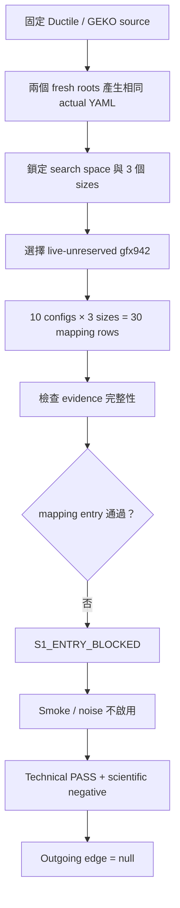

# S10 Stage 1 進入門檻：驗證與結案報告

> 這是 post-closeout editorial revision；只改善說明方式，不改實驗、證據或判決。

## 文件版本與歷史證據

- 原始 closeout commit：`48c26297fc6815e6edfcc89b8503e47370fedc53`
- 原始 report SHA-256：`c90e741dd9a6a1aec0c0ff360937bce6d8a3084a0c5444a05d5d6c0d90a0be58`
- 原始 bytes 保存在 Git history，才是當時 staged-byte `CLOSEOUT_ACK` 與 historical validator 的重現邊界。
- 本次只重整文字與 Markdown 結構，沒有重新執行 S10，也沒有更新舊 lock、runner、schema 或 evidence。

相關文件：

- [S10 設計](../../s10-stage1-entry-access-mapping-gate-design.md)
- [研究 checkpoint 索引](../../README.md)
- [完整實驗計畫](../../../ductile-origami-warmstart-experiment-plan.md)

## 1. 30 秒白話結論

S10 是一道「能不能合法開始下一階段」的門，不是效能競賽。
這一關先確認 actual YAML、source provenance、GPU 環境、candidate mapping 與後續測量條件是否可信。
結果是：實驗流程正確地完成並做出判決，但 mapping 條件沒有通過，所以不能進入 S11。

| 問題 | 結果 |
| --- | --- |
| Technical verification | `PASS` |
| Scientific outcome | `negative` |
| Criterion | `S1_ENTRY_BLOCKED` |
| Failure taxonomy | `FT-BLOCKED-MAPPING` |
| Mapping entry | `FAIL / S10-MAPPING-ENTRY-FAIL` |
| Checkpoint state | `CHECKPOINT_COMPLETE` |
| Outgoing edge | `null` |
| 下一個可能工作 | 獨立的 S10R1 recovery；不是重開 S10 |

最容易誤解的地方是：technical `PASS` 不代表 mapping 成功。
它表示 protocol、evidence 與 verifier 都正確運作，並且誠實地判定這次 scientific outcome 是 negative。

## 2. 這一關要回答什麼

後續研究想用 Ductile 的搜尋空間與 Formocast 做 candidate 評估。
在真正比較效能前，S10 必須先證明：

1. 使用的是可追溯、由 pinned generator 產生的 actual YAML。
2. Ductile 與 GEKO 各自來自正確的 source branch 和 commit。
3. 三個測試 sizes 屬於同一個 search space。
4. Candidate config 能轉成 Formocast／runtime 可理解的設定，不靠猜 metadata。
5. 有符合條件的 `gfx942` 可供後續 smoke、correctness 與 noise 測量。

`entry gate` 是「開始後續研究前的資格檢查」。
`mapping` 是「把搜尋空間中的 candidate 設定轉成後端能驗證或執行的形式」。

## 3. 實驗與判決流程

流程在 mapping gate 失敗後立即停止。
因此 smoke/correctness 與 noise evidence 不存在是預註冊的 negative-stop 行為，不是漏跑。

## 4. 實際看到什麼

### 4.1 輸入與環境準備成功

- 兩個 fresh materialization roots 各自建立 Ductile／GEKO integration。
- 兩側產生的 actual YAML byte-identical。
- Groups、candidate order、weights 與 16 個 generated sizes 一致。
- 三個 selected sizes 都來自同一個 search space。
- 三次 live samples 後，依 frozen selection key 選到 `gfx942 / SPX / NPS1` 的 visible card 0。

這些項目表示「拿到可信輸入與環境」已通過，但尚未表示 mapping gate 通過。

### 4.2 Mapping evidence 完整，但 entry criterion 失敗

預註冊的 10 個 configs 各自套到 3 個 sizes，共形成 30 rows：

| Mapping 結果 | 數量 | 代表意義 |
| --- | ---: | --- |
| Accepted | 3 | 同一個 config 在三個 sizes 上被接受 |
| Typed rejection | 27 | Candidate 在 pinned validation boundary 被拒絕 |
| Unexpected exception | 0 | Harness 沒有未分類崩潰 |
| Genuine Formocast rejection | 0 | 沒有出現預註冊所要求的 rejection 類型 |

另外，兩個 locked anchors 都沒有通過 mapping prerequisite。
因此：

- `mapping_evidence_integrity` 是 `PASS / complete`：資料完整、可重現。
- `mapping_entry` 是 `FAIL / complete / S10-MAPPING-ENTRY-FAIL`：完整資料顯示進入條件不成立。

這不是「資料不足所以不知道」，而是「資料足夠，而且答案是否定的」。

## 5. 為什麼 technical PASS 和 scientific negative 不矛盾

可以把 S10 想成驗票系統：

- Technical verification 問的是「驗票機有沒有照規則檢查」。
- Scientific outcome 問的是「這張票有沒有符合進場條件」。

這次驗票機工作正常，所以 technical result 是 `PASS`。
票本身沒有符合 mapping entry 條件，所以 scientific result 是 `negative`，criterion 是 `S1_ENTRY_BLOCKED`。
硬把 negative 改寫成 positive，或繼續跑 smoke/noise，反而會違反 frozen protocol。

## 6. 為什麼有三個 successor generations

Successor 不是重複嘗試到得到想要的答案，而是每次發現 harness／schema 缺陷時，保留舊 generation 並建立可追溯的新 generation。

- `successor-001` 發現 `.duplicate` 缺失造成 harness exception；這不是 scientific rejection。
- `successor-002` 修正 mapping harness，但 verifier 發現 schema 會誤收九種非法 documents。
- `successor-003` 只修正 schema／test boundary，九種非法 mutations 全部被拒絕，並重跑完整 mapping。

三代都保留 lineage，只有 `successor-003` 是 active canonical leaf。
最終 negative outcome 在修正技術缺陷後仍相同，因此不是 harness accident。

## 7. 這份證據能與不能支持什麼

可以支持：

- Actual YAML、source pins、search space、sizes 與環境 provenance 完整。
- 30-row mapping evidence 完整且可獨立重現。
- Frozen S10 gate 正確得到 `S1_ENTRY_BLOCKED`。
- Smoke/noise 依 negative-stop 合法保持不存在。

不能支持：

- Formocast ranking 品質。
- Factorization 或 Gen0 mechanism。
- GFLOPS、speedup、convergence 或 generalization。
- Deployment／production readiness。
- GPU reservation、exclusivity 或未來 availability。

## 8. 下一步：S10R1 是獨立 recovery

S10 本身已完成為 negative checkpoint，outgoing edge 永遠是 `null`。
Post-closeout 分析後，研究另外核准 [S10R1 valid-support recovery 設計](../../archive/s10r1-stage1-valid-support-entry-recovery-design.md)。
S10R1 使用獨立 checkpoint、lock、evidence、report 與 closeout：

- 它可以引用 S10 的 terminal provenance。
- 它不能把 S10 的 negative 結果改成 positive。
- 只有 S10R1 自己 post-audited 的 `S1_ENTRY_GO` 才可能解鎖 S11。

## 9. 術語速查

| 術語 | 白話解釋 |
| --- | --- |
| `actual YAML` | 由 pinned generator 實際產生的搜尋設定 |
| `provenance` | 檔案來自哪個 source、commit 與產生流程 |
| `entry gate` | 開始下一階段前必須通過的資格檢查 |
| `mapping` | 把 candidate config 轉成後端可驗證的設定 |
| `anchor` | 預先鎖定、必須滿足特定條件的代表 candidate |
| `typed rejection` | 有明確分類原因的拒絕，不是未處理 exception |
| `negative-stop` | 前置 gate 失敗後，按規則停止後續測量 |
| `successor` | 保留舊 evidence 後建立的新有效 lock generation |
| `outgoing edge` | 允許啟動下一個 checkpoint 的條件 |

---

## 稽核附錄

以下保留 frozen authority、raw hashes、完整 command ledger、repair history 與 closeout adjudication。
第一次閱讀只需先看主文；需要重現或稽核時再依附錄操作。

## 附錄 A. 原始 closeout 當下的結論與狀態邊界

S10 在 frozen actual-guidance boundary 下完成，結果為：

- technical verification：`PASS`
- technical goal alignment：`FULL`
- scientific outcome：`negative`
- criterion：`S1_ENTRY_BLOCKED`
- failure taxonomy：`FT-BLOCKED-MAPPING`
- outgoing edge：`null`
- verifier blockers／evidence requests／required unverified：皆為 `0`

Actual YAML、三個 same-space sizes、live-unreserved `gfx942` 環境及 30-row mapping evidence 均完整；但兩個 locked anchors 無法通過 mapping prerequisite，而且三個 accepted rows 沒有產生預註冊要求的 genuine Formocast rejection。
因此 `mapping_entry` 是完整、可重現的 `FAIL / S10-MAPPING-ENTRY-FAIL`。
Smoke 與 noise 依 negative-stop 規則未啟用，並非缺漏；S11 沒有 eligibility。
這個結果只支持「S10 正確得到 mapping-negative entry decision」。
它不支持 Formocast ranking、factorization、Gen0、speedup、convergence、generalization、deployment 或 production claim，也不宣稱 GPU reservation、exclusivity 或 future availability。
本報告是 closeout delivery 的一部分。
只有本報告、三份 authority projection、原 verifier 對 exact staged bytes 的 `CLOSEOUT_ACK`、exact-path commit 及 post-commit audit 全部成功後，S10 才是 `CHECKPOINT_COMPLETE`。
本報告不嵌入包含自己的 commit SHA，也不預填 post-commit 事實。

## 附錄 B. Frozen authority 與 exact boundary

- Branch：`users/perlee/doc-study`
- Baseline HEAD：`a9de9111be7d11090bd2404ef9e2e5a1c60a2285`
- S00 incoming edge commit：`8d1be2af3e5033ee74a1a8e3b31536f132a014cb`
- Frozen Plan-B SHA-256：`3cb50d05c3481e4fb6d2a0fd9b23cb0e6876d2b9b0582af17a7220710e2a40d7`
- R10 adjudication SHA-256：`d0166dd259b9227df440e124afc49da1baba36e5dbfc66bd7796c0cbff0118df`
- Pinned Ductile：`refs/remotes/origin/ductile_integration` at `5d6bdc8a6438b5fc73a96e46a907f9a5b1cd4e39`
- Pinned GEKO：`refs/remotes/origin/users/pkamd/geko_pr` at `d32abacfd13579d1f523f035b7a10b0734c4ac47`
- Exact implementation whitelist：13 paths
- Exact delivery whitelist：17 paths

GEKO 與 Ductile 是兩個獨立 branch authorities；兩個 exact commits 分別 materialize 後才形成 ignored integration roots。
Current checkout、GEKO branch 附帶的 Ductile files、cache、installed module、build output 或 container 內容都沒有取代任一 source authority。
本次 negative-stop branch 有 11 個 present implementation paths。
Whitelist 中的 `s10-smoke-correctness.json` 與 `s10-noise-pilot.json` 依決策必須保持不存在。
因此 closeout 是 17-path whitelist 內的 15 個 present paths：11 個 implementation/evidence、formal report 與三份 projection；prior blocker memo 保持 read-only historical evidence。

## 附錄 C. Source、actual input 與 effective lock

兩個 fresh roots 各自完成：

1. 從 pinned Git objects materialize Ductile 與 GEKO；
2. offline native `_rocisa` build 與 dependency/import audit；
3. pinned generator 執行及 complete output manifest；
4. strict raw witness、independent source model 與 actual Ductile runtime 三層 consume；
5. groups、candidate order、weights、sizes 及兩 root byte/semantic parity。

鎖定事實：

- actual generated YAML SHA-256：`faaa8d65014d30646b89b84a8e97395539e52684bef7b430804a63ef2d64cf36`
- expanded groups SHA-256：`0526a9b3c1d8a1bbe1db2cb03616bfda6e5a1f2dfad3826c0747d8dcb3ab9140`
- axis-order SHA-256：`926a6d9502546dda22ea2edc483c0f61ef74b3e378bcf32f222f17130bb668a3`
- search-space map SHA-256：`5785871bc0779fb67627943ef2ed5fde8e96647be7e0bb0db4f770473cd7a1a0`
- weights SHA-256：`56c34446385e93138944082b1801649271fd6a49df948aa41017cb05d012f34f`
- 30 indexed axes；expanded group cardinalities 為 `9918 / 3 / 2`
- 16 個 distinct generated sizes
- selected sizes：`[8,8,1,128]`、`[256,256,1,1024]`、`[2304,1024,1,214336]`

H4/R5 依使用者 standing rule 直接在 existing `perlee` 做三次 live samples，不預約。
Card 6 有 foreign KFD process 且約 65% VRAM allocation，因此不合格；deterministic selection key 選到 visible card 0：

- architecture／partition：`gfx942 / SPX / NPS1`
- PCI：`0000:13:00.0`
- unique ID：`0x2e5e9f248283700d`
- serial：`692348002343`

有效 lock：

- ID：`s10-lock-9fefc341a765885a03d07c00aba5fffd8bb1f2fe9333043d9d564140257c1115`
- raw SHA-256：`6e119788305913bcf0e69244c2c190d345cb1d360c6dc1f49323ddffcdd397f6`
- generation：`successor-003`
- ancestry：`successor-003 -> successor-002 -> successor-001 -> genesis`
- `evidence_reuse=false`

Lock 是 final pre-lock write；mapping、decision 及其他 outcome-bearing evidence 都在 lock 生效後才建立。

## 附錄 D. Iterations、repairs 與 deviations

### D.1 Historical early blocker

最早 read-only discovery 因當時沒有可用 actual YAML/provenance 而產生 `reports/gen0-factorization-blocker-memo.md`。
後續在不降低 claim 的前提下取得並 fresh 生成 actual artifact，故該 memo 只保留為 historical recovery evidence，不再是 current terminal record，也未在本次修改或 stage。

### D.2 Retired generations

- Genesis／R7 建立 fresh dual-root pre-lock closure，但後續 lifecycle recovery 將它封存為 ancestor。
- Successor-001 第一次跑完 30 rows 時，3 rows 因缺少 `.duplicate` 屬性而例外；R9 兩位 fresh reviewers 交互詰問後一致判定這是 harness defect，不是 scientific rejection。

該代被 single-use claim 並完整封存。

- Successor-002 修正 canonical duplicate prepass、typed validation boundary、role-aware gates、negative-stop 與 recursive lineage，得到 3 accepted／27 typed rejections 及同一 mapping-negative outcome。

Fresh verifier 仍找到 `S10-R9-SCHEMA-001`：九種非法 cross-field documents 會被 schema 誤收，因此技術 verdict 為 `CHANGES_REQUIRED`，該代也被 single-use claim 並封存。

- Successor-003 只修正該 plan-preserving schema／test boundary，重新 fresh prepare、lock、mapping 及 decision。

九種非法 mutation 現在 9/9 拒絕，scientific outcome 沒有被改寫。
封存完整性由原 verifier 以 recursive rehash 重算：

| Generation | Raw tree | Entries | Regular bytes | Tree SHA-256 |
| --- | --- | ---: | ---: | --- |
| successor-001 | `r9-successor-001-lock/` | 11,788 | 12,279,134,329 | `bc99fb3a13ee74a118c3f75fff1d18387b1738e8a99cd1af34e660441c88bf65` |
| successor-002 | `r10-successor-002-lock/` | 11,792 | 12,279,373,335 | `088fd008995448bd3d99538acb0bc5e60391ff05e0da51ece6adae14a1dd1e19` |

每個 successor transition 只有一份 claim；former canonical roots 保持不存在，只有 successor-003 是 active canonical leaf。

### D.3 Workspace 與 verifier corrections

- 兩次意外 Python bytecode 均立即停止並以 no-clobber 方式移到 ignored quarantine；hashes 為 `f47cf0a23bae744cec628252f2d6833acc9135d90d69719b94b541b0bb3d32d2` 與 `f1e141102800cdedfb4c633824b6c1001e2145c39388b738819ac94441102676`。

Active protocol path 沒有 `.pyc`。

- Verifier 第一次 semantic/lifecycle audit 誤把「sealed archive raw root 存在」當成 failure。

這只影響 verifier-owned ignored script/result；修正為檢查 former canonical roots 後 v2 全部 PASS，tracked implementation 與 canonical evidence 未變。

- User-owned 兩份 `implement-verify-loop/SKILL.md` 及兩份 `authority-gates.md` 保持原 hash 且排除於 S10 delivery。

沒有未解 deviation、partial result、network fetch、dependency install、new/other container、container start/stop/recreate、credential write、S11+ work 或 push。

### D.4 Closeout generated-YAML whitespace adjudication

Technical PASS 後，exact YAML 首次進入 index 時，`LC_ALL=C git -c color.ui=false diff --cached --check` exit `2`，且只回報 `s10-generated.yaml` lines `49 / 24870 / 24894 / 24902` 四個 `trailing whitespace` diagnostics。
兩份 pinned generator raw outputs、tracked worktree 與 index bytes 全都維持 SHA-256 `faaa8d65014d30646b89b84a8e97395539e52684bef7b430804a63ef2d64cf36` 及 Git blob `1fd6fb401d5baebd4665a87e9002687fb725b2dc`；這四個 bytes 不是 closeout 手工寫入。
這造成兩個 frozen requirements 的衝突：full cached check 原預期 exit `0`，但 Plan-A 同時要求 generated YAML 只能是 exclusive raw byte copy，禁止 normalize、手改或 reserialize。
Main 因此啟動兩位 fresh `gpt-5.6-sol/xhigh` reviewers `/root/s10_closeout_ws_a2` 及 `/root/s10_closeout_ws_b2`。
雙方獨立立場、互相詰問及同一 candidate consensus 的結論如下：

- 採用 exact-bound closeout check-harness adjudication；不改任何 YAML byte；
- 捨棄 manual normalization，因其會破壞 lock/provenance/size bindings；
- 捨棄 new successor，因同一 pinned generator 只會重現同一 bytes；修改 generator 或 serializer 則改變 source authority；
- 捨棄 attributes、filters、whitespace config 與 ignore options，因其擴張或隱藏 state 並可能遮蔽第五個 error；
- technical verdict 仍為 `PASS`，pre-commit lifecycle 仍為 `VERIFIED_PENDING_CLOSEOUT`；不新增 formal state；
- raw cached command 必須誠實記為 `EXPECTED_GENERATOR_DIAGNOSTIC / exit 2`，不能稱為 PASS。

只有完整 aggregate whitespace predicate 可 PASS。
Reviewer A 的主要 objection 是不可發明 `PASS_WITH_EXPECTED_GENERATOR_DIAGNOSTIC` vocabulary；Reviewer B 的主要 objection 是不能宣稱 literal exit-zero 已達成。
Candidate consensus 吸收兩點，最後兩位均 `AGREE`。
Final report restage 後的 aggregate predicate：

1. Run-A、Run-B、worktree、index 四份 YAML byte-identical，SHA/blob 與 provenance、size registry、effective lock bindings 全數一致；postlock validation PASS。
2. Fixed-locale full cached check 只出現上述四個 semantic tuples，zero unexpected；raw transcript SHA-256 `cb1f59f0593b306d69091fa08603536e387579894adcbf7caddc063b1c937344` 是 secondary evidence。
3. Target-only check 重現相同四項；target-excluded cached、full worktree 及 combined target-excluded checks 都 exit `0` 且無 output。
4. Target 的 `whitespace / filter / text / eol` attributes 全為 `unspecified`；不使用 suppression、filter、attribute、config override 或 hook bypass。
5. Final stage 只能是 15 個 present delivery paths；smoke/noise 維持不存在，沒有 blocker memo、rule/skill、S11+或 whitelist-external path。
6. 任一 hash/blob/diagnostic/path/mode/OID/absence/validation 漂移都使裁決失效並停止。

任一 restage 都必須重建 manifest 並重新取得 ACK。
Original verifier 只需 fresh 重驗上述 closeout predicate 與 read-only postlock validation；若 canonical hash 漂移才回完整 technical loop。
Post-commit 固定 locale range check 也必須只重現相同四項，target-excluded range 必須完全 clean。
若更高 authority 或 commit hook 硬性要求 raw exit `0`，必須停止並 human review，不得用 `--no-verify` 繞過。
此裁決不改 scientific result、source、lock、measurement、gate、DAG、claim、whitelist 或 report target；其唯一 residual uncertainty 是未測的 remote/server policy，而 push 本來就不在 authority 內。
兩位 reviewers 均確認它保留 frozen goal、acceptance purpose、planned evidence、report target、checkpoint order/gates、whitelist/authority invariants 與 claim boundary；因此依 repository 的 consensus-first 治理不需要重複 user review。
若更高 authority 或 commit hook 要求 literal exit `0`，上述 plan-preserving 前提即失效，仍必須停止並交回 human review。

## 附錄 E. Authoritative tracked artifacts

| Path | Raw SHA-256 / state |
| --- | --- |
| `projects/hipblaslt/tensilelite/Tensile/Tests/unit/test_ductile_s10_entry.py` | `fdfe5a6a087d7ae580889766cf3a657e98a9ca9dda2b6a1095d44a1c1aae0717` |
| `protocol/v1/run_s10_entry.py` | `4c286ac6001d696bae19b688975531dfbbdc30074807e109578689d78113a051` |
| `protocol/v1/schemas/s10-entry.schema.json` | `22676831f8e889f6033cc2ed7d8a20dfd4a8ea049f840375d69e29cd22cc4c7f` |
| `protocol/v1/s10-entry-contract.yaml` | `029de2493df60318f2f3ba6ab656e6d85211eee67de7a28e1be2a3310b288a10` |
| `protocol/v1/inputs/s10-generated.yaml` | `faaa8d65014d30646b89b84a8e97395539e52684bef7b430804a63ef2d64cf36` |
| `protocol/v1/manifests/s10-yaml-provenance.json` | `2d120b41d38787c5888304f3e8fda6a033b22f554162d4a500d4d9150be24917` |
| `protocol/v1/manifests/s10-size-registry.json` | `71f253fc4d3ab7e23b078f14b254bf65d591f762b6f28aae32e24c87bab536be` |
| `protocol/v1/manifests/s10-environment.json` | `54bf91932023f9a261631d594a5cfb914ff4963c4faee60d2ae20f3b16e3f5d0` |
| `protocol/v1/locks/s10-stage1-entry-lock.json` | `6e119788305913bcf0e69244c2c190d345cb1d360c6dc1f49323ddffcdd397f6` |
| `protocol/v1/manifests/s10-mapping-corpus.json` | `9cd9429b79d6f2502741a454c8a8c0bb46de986fee79b6e2d6d762f86ca377ec` |
| `protocol/v1/evidence/s10-smoke-correctness.json` | absent by negative stop |
| `protocol/v1/evidence/s10-noise-pilot.json` | absent by negative stop |
| `protocol/v1/evidence/s10-decision.json` | `0dae417396c7565515f29e0dbd03fcade865c16fdf6bbcb6644581cbee1cc802` |

Contract semantic SHA-256 為 `c2de2b08b837f1d9fd6590fb8f0c2aa2f3169db7fd134c76d89c6c24843f43d0`。
Successor-003 raw mapping 及 negative-stop hashes 分別為 `06db88b1ef7e47e1ce7975de9192d35e1452687412b0912ed07c4ffd7c48c5bf` 與 `795ff86e20a49a78d66211216c4035cbc66a71fc9f0279bdad7259624f6c8473`。

## 附錄 F. Mapping、decision 與 stop semantics

Fresh mapping passes A/B 均產生 exact 30 rows：

- 3 accepted rows：同一 config `83398232f63ccd4d6a7cc59520e8fb5096a62be9701c2e94aaa0a706430ff857` 跨三個 locked sizes；
- 27 rejected rows：`solution_resolution / pinned_validation_boundary_none / internal_subreason_unknown`；
- unexpected exception：`0`；
- genuine Formocast rejection：`0`；
- `mapping_evidence_integrity`：`PASS / complete`；
- `mapping_entry`：`FAIL / complete / S10-MAPPING-ENTRY-FAIL`。

兩個 exact failed anchors：

- `00bf3b8b377414d01f1a92a5aa1aecf8ac4ed98fcd93ae54686df3aa1c42556a`
- `c57f853ddfb62e7150c36dced5f1c1774859aa46f459e8cb0b9d6049b7793c1a`

Ordered decision gates 為：

| Gate | Role | Status | Execution |
| --- | --- | --- | --- |
| actual guidance | prerequisite | PASS | complete |
| three sizes | prerequisite | PASS | complete |
| H4 and environment | prerequisite | PASS | complete |
| mapping evidence integrity | evidence integrity | PASS | complete |
| mapping entry | entry gate | FAIL | complete |
| smoke/correctness | blocked absent | BLOCKED | not activated |
| noise stable | blocked absent | BLOCKED | not activated |

Decision 是 `negative / S1_ENTRY_BLOCKED / FT-BLOCKED-MAPPING / edge=null`。
`study_mode=ready_actual_yaml_guidance` 只表示 actual input 分支成立，不表示 entry GO。
Terminal audit 重叫 `mapping`、`smoke`、`noise`，三者皆 exit `49` 且回 `terminal_command_refused`；重叫 `decision` exit `2` 且回 `already_exists`。
Provenance、size registry、environment、lock、mapping 及 decision 六個 canonical hashes 前後完全不變。

## 附錄 G. Independent verification

原 fresh verifier 簽出：

- verdict：`PASS`
- goal alignment：`FULL`
- blockers：`0`
- report SHA-256：`cbd4de132904a6be421cd29b871faec249c9e951641f707347be7b91f0d674d8`
- verdict SHA-256：`3a37d44b29f7650f126e52d1b2e3d9b17bc73f01081a98e34f8271b7c406be1c`

主要 direct checks：

1. Exact `perlee` focused suite：`61 passed in 11.06s`。
2. R9 九種 invalid role/cross-field mutations：9/9 以 `schema_validation_failed` 拒絕；canonical documents PASS。
3. Successor-001／002 完整 archive recursive rehash 及 active successor-003 ancestry PASS。
4. Verifier-owned clean root fresh build helper 並 reproduce mapping；八個 controlled fields 與 canonical evidence exact semantic equality。
5. `validate --phase postlock` 回 `POSTLOCK_VALID`。
6. Terminal refusal、blocked absence 及六-hash invariance PASS。
7. 26 個 tracked S00 `protocol/v1` paths 與 HEAD byte-identical；staging 空、unrelated hashes 不變、無 S11+ status path。

Fresh reproduction mapping SHA-256 為 `152cfff642c4c0c76afed387b6cf94e0d4f4ddf9067cd18142b9e9ae01b3a9b1`。

## 附錄 H. Command ledger

所有 GPU/ROCm、native build、generation、mapping 及 protocol checks 都在 exact existing `perlee`、cwd `/src/rocm-libraries` 執行；Python 使用 `PYTHONDONTWRITEBYTECODE=1` 與 `-B`。
下列每行都是 cwd `/src/rocm-libraries` 中的 exact runnable argv；共同 env 為 `PYTHONDONTWRITEBYTECODE=1` 及 `PYTHONPATH=projects/hipblaslt/tensilelite`。
Implementer terminal sequence：

1. `/opt/venv/bin/python3 -B study_docs/research/ductile-origami-warmstart/protocol/v1/run_s10_entry.py prepare --scratch-root agent_run/260725-ductile-factorized-guidance-s0-s1-recovery/milestones/S10/final-prelock-r10-successor-003` → exit `0`，`PRELOCK_PREPARED`。
2. `/opt/venv/bin/python3 -B study_docs/research/ductile-origami-warmstart/protocol/v1/run_s10_entry.py prelock-check --scratch-root agent_run/260725-ductile-factorized-guidance-s0-s1-recovery/milestones/S10/final-prelock-r10-successor-003` → exit `0`，`PRELOCK_PASS`，所有 postlock targets absent。
3. `/opt/venv/bin/python3 -B study_docs/research/ductile-origami-warmstart/protocol/v1/run_s10_entry.py lock --plan-b agent_run/260725-ductile-factorized-guidance-s0-s1-recovery/milestones/S10/plan_b.md` → exit `0`，`LOCK_EFFECTIVE`，live-unreserved card 0。
4. `/opt/venv/bin/python3 -B study_docs/research/ductile-origami-warmstart/protocol/v1/run_s10_entry.py mapping` → exit `0`，`MAPPING_COMPLETE`，30 rows。
5. `/opt/venv/bin/python3 -B study_docs/research/ductile-origami-warmstart/protocol/v1/run_s10_entry.py decision` → exit `0`，`S1_ENTRY_BLOCKED`，edge null。
6. `/opt/venv/bin/python3 -B study_docs/research/ductile-origami-warmstart/protocol/v1/run_s10_entry.py validate --phase postlock` → exit `0`，`POSTLOCK_VALID`。

Verifier commands：

1. `/opt/venv/bin/python3 -B -m pytest -q projects/hipblaslt/tensilelite/Tensile/Tests/unit/test_ductile_s10_entry.py` → exit `0`，61 passed。
2. `/opt/venv/bin/python3 -B agent_run/260725-ductile-factorized-guidance-s0-s1-recovery/milestones/S10/r10-verifier-successor-003/audit_schema_archive.py` → exit `0`，9/9 rejection 與 recursive rehash PASS。
3. `/opt/venv/bin/python3 -B study_docs/research/ductile-origami-warmstart/protocol/v1/run_s10_entry.py reproduce-mapping --output-dir agent_run/260725-ductile-factorized-guidance-s0-s1-recovery/milestones/S10/r10-verifier-successor-003/reproduce-mapping-001` → exit `0`，`MAPPING_REPRODUCED`、semantic parity true。
4. `/opt/venv/bin/python3 -B study_docs/research/ductile-origami-warmstart/protocol/v1/run_s10_entry.py validate --phase postlock` → exit `0`，`POSTLOCK_VALID`。
5. `/opt/venv/bin/python3 -B agent_run/260725-ductile-factorized-guidance-s0-s1-recovery/milestones/S10/r10-verifier-successor-003/audit_terminal.py` → exit `0`，terminal refusal 與 six-hash invariance PASS。
6. `/opt/venv/bin/python3 -B agent_run/260725-ductile-factorized-guidance-s0-s1-recovery/milestones/S10/r10-verifier-successor-003/audit_semantics_lifecycle.py` → corrected v2 exit `0`，全部 semantic/lifecycle criteria PASS。
7. `/opt/venv/bin/python3 -B agent_run/260725-ductile-factorized-guidance-s0-s1-recovery/milestones/S10/r10-verifier-successor-003/audit_boundary.py` → exit `0`，boundary/source hygiene/staging PASS。

Exact argv、cwd、environment、timestamps、exit codes、stdout/stderr hashes 及 complete raw manifests 由 effective lock 與 ignored `agent_run/260725-ductile-factorized-guidance-s0-s1-recovery/milestones/S10/` closure 保存。

## 附錄 I. Acceptance 與 claim boundary

| Oracle | Result | Verified conclusion |
| --- | --- | --- |
| O1 authority/scope/workspace | PASS | baseline、S00、exact scope、unrelated changes 及 empty stage 正確 |
| O2 source/import/native lineage | PASS | pinned dual-source integration 與 offline native lineage 可重現 |
| O3 actual input/dual generation | PASS | actual YAML 與完整 provenance identity 成立 |
| O4 Ductile space/sizes | PASS | groups/order/weights 與三個 same-space sizes 成立 |
| O5 live H4 | PASS | `perlee` 即時選到符合條件的 card 0；沒有 reservation claim |
| O6 schema/contract/lock | PASS | 61 tests、9/9 negative matrix、recursive lock validation 通過 |
| O7 mapping/Formocast | PASS | evidence 完整且正確得到 mapping-entry negative |
| O8 smoke/correctness branch | PASS | 因 mapping FAIL 而合法不啟用並保持不存在 |
| O9 noise branch | PASS | 因 mapping FAIL 而合法不啟用並保持不存在 |
| O10 decision/lifecycle | PASS | negative-stop、null edge、successor lineage 與 terminal immutability 成立 |

沒有 proxy、two-size/reduced mode、replacement candidate、synthetic rejection、guessed metadata、threshold relaxation、partial result、source substitution 或 whitelist expansion。
S10 完成的是 negative checkpoint，不是 positive study。
S11 維持 `not_activated`，沒有任何 verified outgoing edge。
