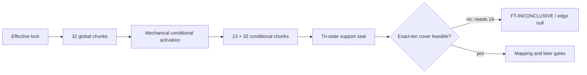

# S10R2 Stage 1 Support-Aware Entry Recovery — Verification and Closeout Report

## 1. 白話結論

S10R2 的程式與證據驗證通過，但科學結果是 `inconclusive`，不是 positive。

原因很直接：固定 discovery schedule 找到 156 個 valid configs，也觀察到 90 個
mandatory supported atoms；可是 deterministic set-cover 至少需要 18 個 configs 才能
覆蓋它們。Protocol 只允許剛好 10 個，而且不得第 11 筆、replacement 或 proxy，
所以 mapping、Formocast、GPU correctness 與 noise 都依法沒有啟動。

| 欄位 | 結果 |
| --- | --- |
| Technical verification | `PASS` |
| Technical goal alignment | `FULL` |
| Scientific outcome | `inconclusive` |
| Failure ID | `FT-INCONCLUSIVE` |
| Checkpoint state before terminal commit | `VERIFIED_PENDING_CLOSEOUT` |
| Outgoing edge | `null` |
| S11 authorization | `false` |
| Resource finding | A36 `non-blocking technical caveat` |

這份證據支持「S10R2 在 observed operational valid support 中無法用 frozen
exact-ten 規則建立 entry corpus」。它不支持未觀察 candidate 不存在，也不支持
Formocast ranking、factorization、prior-mass、Gen0、GFLOPS、speedup、generalization
或 production claim。

本報告是 closure delivery 的一部分。只有 staged bytes 取得
`CLOSEOUT_ACK`、exact-path commit 與 post-commit audit 後，S10R2 才能標成
`CHECKPOINT_COMPLETE`。本報告不預填包含自己的 closure commit SHA。

## 2. 問題、假設與判定邊界

S10R2 要回答：

> 在保留 S10 source pins、actual YAML、groups、candidate order、weights、三個
> sizes、correctness 與 noise 要求時，能否在 observed operational valid support 內
> 建立可信且可重現的 Stage-1 entry boundary？

執行順序在任何 Formocast、GFLOPS 或 GPU evidence 前固定：



Support classification 的三態意義：

- `supported_witnessed`：至少有一個完整 config 通過 pinned validator；
- `support_unobserved`：固定 stochastic cap 內沒有 witness，但沒有 absence proof；
- `support_proven_absent`：只有 complete proof 才能成立。

本次沒有把 stochastic zero 轉成 absence，也沒有改 actual YAML 或 baseline sampling
semantics。

## 3. Frozen authority 與 identity

### 3.1 Source 與 input

- Ductile：
  `refs/remotes/origin/ductile_integration` at
  `5d6bdc8a6438b5fc73a96e46a907f9a5b1cd4e39`
- GEKO：
  `refs/remotes/origin/users/pkamd/geko_pr` at
  `d32abacfd13579d1f523f035b7a10b0734c4ac47`
- Actual YAML SHA-256：
  `faaa8d65014d30646b89b84a8e97395539e52684bef7b430804a63ef2d64cf36`
- Candidate-order SHA-256：
  `926a6d9502546dda22ea2edc483c0f61ef74b3e378bcf32f222f17130bb668a3`
- Expanded-groups SHA-256：
  `0526a9b3c1d8a1bbe1db2cb03616bfda6e5a1f2dfad3826c0747d8dcb3ab9140`
- Search-space-map SHA-256：
  `5785871bc0779fb67627943ef2ed5fde8e96647be7e0bb0db4f770473cd7a1a0`
- Baseline-weights SHA-256：
  `56c34446385e93138944082b1801649271fd6a49df948aa41017cb05d012f34f`

GEKO 與 Ductile 仍是兩個獨立 branch authorities；current checkout、cache、build
output 或 container contents 都不替代其 exact source identities。

### 3.2 Contract、lock 與 authority

- S10R2 authority commit：
  `24d9ef2ba165b51c6de8da18eba56058fb00a7c0`
- Numeric resource authority commit：
  `f29ace79110cecd64a57b5beba0d6233da5ac41c`
- R2 repair-cap authority commit：
  `bfe700ca76a17bd65509f3afff70abaf0ad125f4`
- Effective seal commit：
  `51c7667212bf40f0e893fc026ee65450d06d72ff`
- A36 resource-materiality authority commit：
  `132072f0a20a40b554976cd35451915d64c98135`
- Contract semantic digest：
  `4cc630a9f285807727cf901b6f0c1a2350d8dc7ce7f1297bf31a6de027a7b691`
- Contract file SHA-256：
  `2ba75698683529a96e07ead413930c38aabaa2e0bd990e9f276cde0fe8232099`
- Effective lock digest：
  `c356f7f9053518b96f8fd9a58481750ac86ca1f93e6ad5ba3515187296cc80e8`
- Lock file SHA-256：
  `f49c24f9a673290df277e301659123df212ef655a43db558d6f2c9eabc48a130`

`verify-lock` 與 `validate-contract` 都以 exit 0 重現 exact identities；
human/machine parity 為 `PASS`，formal evidence authorization 為 `true`。

## 4. Fixed discovery schedule

執行沒有 early stop、extension、target replacement 或 outcome-driven priority：

| Stream | Chunks | Draws |
| --- | ---: | ---: |
| Global | 32 | 16,384 |
| 13 mechanically activated conditional streams | 416 | 212,992 |
| Total | 448 | 229,376 |

Global 完成後，依 frozen priority 機械式啟用 13 個未觀察 targets；contract 上限為
15，但不是必須湊滿 15。每個 activated target 都完整執行 32 chunks，每 chunk 固定
512 draws。

Append-only ledger 共 453 events：

- `LOCK_SEALED`：1
- `PRE_DRAW_REGISTRY_FROZEN`：1
- `GLOBAL_DISCOVERY`：32
- `CONDITIONAL_ACTIVATION`：1
- `CONDITIONAL_DISCOVERY`：416
- `SUPPORT_CLASSIFICATION_SEALED`：1
- `TERMINAL_INCONCLUSIVE`：1

Fresh raw audit 重算 event IDs、filenames、event／parent digests、contract／lock
identities、chunk references、seeds 與 draw intervals，全部通過。最後 event digest
為：

`35dee2bb2b25f4523f66f03f718ffb43c8f8115b981c98c633185821225e6196`

Formal shell argv 沒有另建一份 durable transcript；可重建的 outcome authority 是
453-event append-only ledger，而不是 invocation 分段。這不影響固定 schedule 或
resume parity，但屬 command-observability 限制。

## 5. Support classification

| 指標 | 結果 |
| --- | ---: |
| Accepted occurrences | 156 |
| Distinct valid config hashes | 156 |
| `supported_witnessed` atoms | 155 |
| `support_unobserved` atoms | 9,869 |
| `support_proven_absent` atoms | 0 |
| Complete absence proofs | 0 |

27 個 residual candidate genes 中，23 個的所有 candidate values 都被 witnessed；
以下 4 個 genes 因至少一個 value 未觀察而不具 S11 guidance eligibility：

- `GlobalReadVectorWidthA`
- `GlobalReadVectorWidthB`
- `PrefetchGlobalRead`
- `DepthU`

這只判斷 mapping／guidance eligibility，不會移除 YAML candidates，也不改原 sampling
semantics。尤其 `DepthU=1024` 的 stochastic non-discovery 仍不是 absence proof。

Support file：

- File SHA-256：
  `060051dad1faf2da68e32350d8e371fe4d266ad7df157cfcb179d05ea6cdacd2`
- Semantic digest：
  `365416e81888eb29d234e28f388d999e5b83358fa67a82d2f30663c044c0a472`

## 6. Exact-ten failure 與 terminal decision

Mapping mandatory set 只由
`prelocked_candidate_atoms ∩ supported_witnessed` 機械式產生。Fresh verifier 從 raw
accepted rows 重建：

- witnessed mandatory atoms：90；
- deterministic greedy full cover：18 configs；
- frozen corpus limit：exactly 10 configs。

18 大於 10，因此沒有合法 exact-ten corpus。Runner 依 frozen outcome matrix
terminalize：

- classification：`inconclusive`
- failure ID：`FT-INCONCLUSIVE`
- reason：`mandatory cover requires more than ten configs`
- edge：`null`

Decision file：

- File SHA-256：
  `8b420539307c0b35b269d1ac7843b604fda346e70de294fd63c9b174cd75af4d`
- Semantic digest：
  `62df3543b3c4cc4135ce7b32d6266ebd42f9a14a89f865ac337a29a3bed6d976`

Independent-process reproduction：

- status：`PASS`
- support：`PASS`
- exact-ten：`REPRODUCED_FT_INCONCLUSIVE`
- reproduction digest：
  `41114676026b9adfacbe066b6a9b18cdfb99308550739ccd7636ddd0932d4a3e`
- file SHA-256：
  `04e5fe770b88327892833db3b9463708ba2100730db52ac528182688b1e386c1`

## 7. 合法未啟動的 downstream work

Exact-ten gate 已 terminalize，因此以下 artifacts／workloads 必須不存在：

- mapping corpus 與 30-row A/B parity；
- native sentinel/runtime conformance；
- GPU environment evidence；
- three-anchor smoke／correctness；
- 63-cell noise evidence；
- positive compact gate record；
- S11 evidence。

這些是 `not_activated_by_gate`，不是遺漏。沒有讀取 Formocast score、GFLOPS 或 GPU
correctness label 來形成本次 decision。

## 8. A36 resource-accounting caveat

原 fresh verifier 正確發現 ledger 只完整記錄 validator-child wall／CPU：

- ledger selection wall：`3561.4237106395885 s`
- external selection wall：`8924.894379 s`
- unrecorded wall gap：`5363.470668360411 s`
- parent-process CPU：`UNKNOWN`
- post-hoc full-panel wall projection：`11010.038318274363 s`
- frozen wall cap：`11827 s`
- wall margin：`816.9616817256374 s`

這表示資源 telemetry 不完整；本報告不宣稱完整 inclusive CPU lineage。

使用者在 outcome 後以 A36 明確修正 governance：resource telemetry 預設是
operational safety／planning control。只有 cap exceed、unsafe continuation、
label-dependent stopping／selection、required workload 不完整或 scientific evidence
不可驗證時才 blocking。

Fresh re-verification 確認：

- fixed workload 完整；
- append-only chain 與 independent reproduction 通過；
- chunk-6 reforecast 明列 `support_labels_read=false`；
- 沒有 early stop、extension、schedule drift 或 label-driven selection；
- 沒有 direct/material cap-exceed evidence。

因此 `S10R2-VER-RESOURCE-001` 降為
`non_blocking_technical_caveat_under_A36`。A36 明確禁止只為完善記帳重跑
outcome-bearing workload；未來 genuinely resource-critical run 再 prospective 改善
inclusive parent＋child telemetry。

A36 沒有修改 contract、lock、ledger、support、decision、scientific criterion、
outcome 或 edge，也沒有授權 S11。

## 9. Implementation、repairs 與 deviations

### 9.1 Pre-label repairs

累計完成 5 個 R2 repair rounds：

1. 將 GPU allocation preflight 移到 deterministic fixture compilation 前；
2. 修正 noise aggregation、PID-aware GPU isolation 與 resource-stop lifecycle；
3. 強化 registry／size cross-binding 與 allocation-window enforcement；
4. 依 A35 修正 JSON typed-exact allocation binding；
5. 修正 lifecycle-stale tests 與 adversarial-audit identity，再 reseal。

Offline suite 最終為 65 tests 全過。第一個 seal commit
`8b94bb7db1d5373ce5a1cd10e6e4df5de6edbb66`保留在 Git history；current effective
reseal 是 `51c7667212bf40f0e893fc026ee65450d06d72ff`。

### 9.2 Post-label A36

第一份 fresh verdict 對 resource lineage 給
`CHANGES_REQUIRED / S10R2-VER-RESOURCE-001`，但同時確認 scientific reconstruction
正確。使用者沒有要求把 inconclusive 改成 positive，而是要求不要讓 non-material
resource accounting 阻擋整體進度。

A36 以 R3 post-label authority：

- 保留 hard cap、安全、optional-stopping 與 evidence-integrity gates；
- 將本次符合全部 materiality prerequisites 的 accounting gap 改列 caveat；
- 禁止 resource-only rerun；
- 禁止創造 scientific edge。

Adversarial audit 先找到 Claude reference mirror 缺漏；同步後回
`AUDIT_PASS`，11-path authority commit 的 post-commit audit 也通過。

## 10. Fresh verification

A36 後 fresh verifier 結果：

- verdict：`PASS`
- goal alignment：`FULL`
- blocking findings：0
- evidence requests：0
- required unverified：0
- unacceptable fallback：none
- non-blocking caveat：1

Verifier artifacts：

- `verify-report-a36.md` SHA-256：
  `22c65a4d0ef631406c2b73afa0940e41f42293a7fb9d85cb8d6087f56aaec06d`
- `verdict-a36.json` SHA-256：
  `77d14bdf243cd708c4bfb9e47d9c864b9c12fee2982c335e5800b7c608a4df3f`

## 11. Evidence boundary 與下一步

已確認：

- fixed discovery schedule 完整；
- support tri-state semantics 正確；
- exact-ten infeasibility 可獨立重現；
- terminal outcome 為 `inconclusive / FT-INCONCLUSIVE / edge=null`；
- A36 resource gap 是已揭露、non-blocking 的 technical caveat。

未確認且不能宣稱：

- unobserved candidate 不在 valid support；
- Formocast mapping、ranking 或 helper conformance；
- GPU correctness、noise 或 performance；
- factorized guidance 有效；
- S11／S12／S13 任何結果。

因 outgoing edge 是 `null`，S11 維持 `not_activated`。要繼續 formal research，必須
建立新的 entry recovery authority／checkpoint；不能把 resource caveat 或 diagnostic
S11 run 冒充 `S1_ENTRY_GO`。

## 12. Audit appendix

### 12.1 Durable evidence

| Artifact | SHA-256／digest |
| --- | --- |
| Candidate atom registry file | `948126648dd9e34d19b115a080ce2c69c752c3750d9d6727eade3ae5addca203` |
| Support classification file | `060051dad1faf2da68e32350d8e371fe4d266ad7df157cfcb179d05ea6cdacd2` |
| Support semantic digest | `365416e81888eb29d234e28f388d999e5b83358fa67a82d2f30663c044c0a472` |
| Decision file | `8b420539307c0b35b269d1ac7843b604fda346e70de294fd63c9b174cd75af4d` |
| Decision semantic digest | `62df3543b3c4cc4135ce7b32d6266ebd42f9a14a89f865ac337a29a3bed6d976` |
| A36 amendment file | `2af43b036898809cab6f4b84c5c7cda0ac288ac714e47841eaad482da7dcff56` |
| Fresh reproduction file | `04e5fe770b88327892833db3b9463708ba2100730db52ac528182688b1e386c1` |
| A36 fresh verdict | `77d14bdf243cd708c4bfb9e47d9c864b9c12fee2982c335e5800b7c608a4df3f` |

### 12.2 Exact verification commands

Lock／contract validation，cwd
`/data1/perlee/rocm-libraries`，exit 0：

```bash
docker exec perlee bash -lc 'cd /src/rocm-libraries && PYTHONDONTWRITEBYTECODE=1 S10R2_CONTAINER_NAME=perlee PYTHONPATH=projects/hipblaslt/tensilelite python3 -B study_docs/research/ductile-origami-warmstart/protocol/v1/run_s10r2_entry.py verify-lock && PYTHONDONTWRITEBYTECODE=1 S10R2_CONTAINER_NAME=perlee PYTHONPATH=projects/hipblaslt/tensilelite python3 -B study_docs/research/ductile-origami-warmstart/protocol/v1/run_s10r2_entry.py validate-contract'
```

Observable：`LOCK_VERIFIED`、`human_machine_parity=PASS`、
`formal_evidence_authorized=true`。

Fresh raw-chain audit，cwd
`/data1/perlee/rocm-libraries`，exit 0：

```bash
docker exec perlee bash -lc 'cd /src/rocm-libraries && PYTHONDONTWRITEBYTECODE=1 python3 -B agent_run/260728-ductile-factorized-guidance-s10r2/gates/S10R2/verifier-thread5-raw-audit.py'
```

Observable：453 events、448 chunks、229,376 draws、18-config cover、
`PASS_RAW_SCIENCE_WITH_RESOURCE_GAP`。

Independent reproduction，cwd
`/data1/perlee/rocm-libraries`，exit 0：

```bash
docker exec perlee bash -lc 'cd /src/rocm-libraries && S10R2_CONTAINER_NAME=perlee PYTHONPATH=projects/hipblaslt/tensilelite python3 -B study_docs/research/ductile-origami-warmstart/protocol/v1/run_s10r2_entry.py formal-reproduce --output agent_run/260728-ductile-factorized-guidance-s10r2/formal/verifier-thread5-reproduction.json'
```

Observable：`support=PASS`、`exact_ten=REPRODUCED_FT_INCONCLUSIVE`、
`status=PASS`。

Unit tests，cwd `/data1/perlee/rocm-libraries`，exit 0：

```bash
docker exec perlee bash -lc 'cd /src/rocm-libraries && PYTHONDONTWRITEBYTECODE=1 PYTHONPATH=projects/hipblaslt/tensilelite python3 -B -m pytest -q -p no:cacheprovider projects/hipblaslt/tensilelite/Tensile/Tests/unit/test_ductile_s10r2_entry.py'
```

Observable：`65 passed in 22.33s`。

S10R1 reference scan，cwd
`/data1/perlee/rocm-libraries`，exit 0：

```bash
docker exec perlee bash -lc 'cd /src/rocm-libraries && if grep -Rni "s10r1" agent_run/260728-ductile-factorized-guidance-s10r2/formal/ledger study_docs/research/ductile-origami-warmstart/protocol/v1/manifests/s10r2-support-classification.json study_docs/research/ductile-origami-warmstart/protocol/v1/evidence/s10r2-decision.json; then exit 9; else echo S10R1_REFERENCE_SCAN_NONE; fi'
```

Observable：`S10R1_REFERENCE_SCAN_NONE`。
