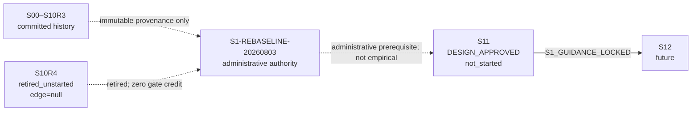

# S10R4 退役與 S11 support-aware rebaseline 權威

> **白話結論：**這次只改「未來實驗怎麼設計與由誰進場」，沒有跑 S10R4 或 S11，沒有產生新實驗結果，也沒有補造任何 scientific edge。S10R4 與 B01–B07 全部退出 active gate；S11 取得一條由本 amendment 提供的虛線 administrative prerequisite，但仍必須另建自己的 contract、lock、evidence、fresh verification 與 commit。

本檔是 `S1-REBASELINE-20260803` 的 prospective Layer-A authority 候選；只有 final exact-path two-parent merge commit 才會把所選 bytes seal 成有效權威。本檔不是 S11 experiment lock，也不是 scientific report。讀者版說明見 [S10R4 → S11 實驗計畫變更指南](s10r4-to-s11-experiment-plan-change-guide.md)。

## 1. 權威效果與不可推導事項

- Authority gate：`AUTH-S1-REBASELINE-20260803`，risk tier `R3`；這表示它改變 post-observation prospective authority／measurement boundary，而不是執行一般 checkpoint。
- Scientific gate：`N/A`。本 closure 不執行 experiment，scientific outcome 固定為 `not_evaluated`，outgoing edge 固定為 `null`。
- 它退役未啟動的 S10R4 hard entry gate，並核准 S11 的 support-aware measurement rebaseline。
- 它不改 S00–S10R3 的 committed outcomes、decision artifacts、reports 或 edges。
- 它不授權 S10R4/S11 evidence、Formocast、KernelWriter、compile、GPU、correctness、noise、GFLOPS、dependency installation、container mutation、push 或 publication。
- 它不把 administrative prerequisite 畫成或描述成 empirical success edge。

## 2. 不可變的 completed history

`criterion` 是 checkpoint 實際判定的條件；`edge` 是 verified outcome 唯一可解鎖的下一個 scientific checkpoint。下表只重述既有 committed history。

| Checkpoint | Checkpoint state | Scientific outcome | Criterion／failure | Outgoing edge | Decision／record | Report |
| --- | --- | --- | --- | --- | --- | --- |
| S00 | `CHECKPOINT_COMPLETE` | `positive` | `S00_EVIDENCE_READY` | `S00_EVIDENCE_READY -> S10` | [decision](protocol/v1/evidence/s00-decision-successor-001.json) | [report](reports/staged/s00-foundation-verification-report.md) |
| S10 | `CHECKPOINT_COMPLETE` | `negative` | `S1_ENTRY_BLOCKED / FT-BLOCKED-MAPPING` | `null` | [decision](protocol/v1/evidence/s10-decision.json) | [report](reports/staged/s10-stage1-entry-gate-report.md) |
| S10R1 | `BLOCKED`；execution `cancelled`；lock `superseded` | `not_evaluated` | A32 operational cancellation | `null` | [historical design/tombstone](s10r1-stage1-valid-support-entry-recovery-design.md) | none |
| S10R2 | `CHECKPOINT_COMPLETE` | `inconclusive` | `FT-INCONCLUSIVE` | `null` | [decision](protocol/v1/evidence/s10r2-decision.json) | [report](reports/staged/s10r2-stage1-support-aware-entry-report.md) |
| S10R3 | `CHECKPOINT_COMPLETE` | `negative` | `S1_ENTRY_BLOCKED / FT-BLOCKED-MAPPING` | `null` | [decision](protocol/v1/evidence/s10r3-decision.json) | [report](reports/staged/s10r3-stage1-bounded-cover-entry-report.md) |

S10、S10R1、S10R2 與 S10R3 都沒有通往 S11 的 scientific edge。任何後來的 amendment 都不得把其 rows、diagnostics 或 absence/non-discovery 重新解讀為 S11 trust、support、score、model 或 gate credit。

## 3. S10R4 與 B01–B07 退役矩陣

S10R4 checkpoint 的 exact after-amendment state 是：

| Field | Value |
| --- | --- |
| retirement state | `retired_unstarted` |
| design status | `superseded` |
| execution status | `cancelled` |
| checkpoint state | `BLOCKED` |
| scientific outcome | `not_evaluated` |
| lock state | `absent` |
| formal scientific report | `null`；不得建立 |
| outgoing edge | `null` |
| gate credit | `0` |

各 binding 的 bytes 留在 first-parent history，角色如下：

| Binding | Binding／execution state | Technical state | Lock | Scientific outcome／edge | After-amendment authority effect |
| --- | --- | --- | --- | --- | --- |
| B01 | `retired_after_preterminal_changes_required` | historical preterminal only | `superseded` | `not_evaluated / null` | immutable diagnostic provenance only |
| B02 | `superseded / cancelled / BLOCKED` | historical | `superseded` | `not_evaluated / null` | immutable diagnostic provenance only |
| B03 | `superseded_prelock / cancelled / BLOCKED` | historical | `absent`；never created | `not_evaluated / null` | immutable diagnostic provenance only |
| B04 | `superseded_prelock / cancelled / BLOCKED` | `CHANGES_REQUIRED` | `absent`；never created | `not_evaluated / null` | immutable diagnostic provenance only |
| B05 | `superseded_prelock / cancelled / BLOCKED` | `CHANGES_REQUIRED` | `absent`；never created | `not_evaluated / null` | immutable diagnostic provenance only |
| B06 | `retired_unstarted / superseded / cancelled / BLOCKED` | no execution | `absent`；never created | `not_evaluated / null` | immutable historical design provenance only |
| B07 | `not_admitted / no_committed_authority / not_started / N/A` | dirty draft only | `absent` | `not_evaluated / null` | forbidden input；zero authority／gate credit |

B01–B06 可被讀作歷史診斷與設計 provenance，但不可作 S11 formal input。B07 dirty worktree bytes 禁止讀作 authority 或 evidence。沒有 S10R4 report、result、lock 或 edge。

## 4. S11 的 after-amendment lifecycle 與 DAG

S11 的 exact state 是：

| Field | Value |
| --- | --- |
| `design_status` | `approved` |
| `execution_status` | `not_started` |
| `checkpoint_state` | `DESIGN_APPROVED` |
| `scientific_outcome` | `not_evaluated` |
| `lock_state` | `absent` |
| formal evidence／report | `absent / absent` |
| `incoming_scientific_edge` | `null` |
| entry authority | administrative `S1-REBASELINE-20260803` |



唯一未來 scientific edge 是 `S11:S1_GUIDANCE_LOCKED -> S12`。只有 S11 自己的 effective contract、lock、evidence、fresh verifier PASS、terminal commit 與 post-audit 都依未來設計成立後，這條 edge 才能存在。本 amendment 只授權下一步 S11 design discussion／contract workflow，不授權立即產生 evidence。

## 5. 三個 population object

這三個名字不是檔案，而是 future S11 runner 在 real labels 前建立的 occurrence populations。`Occurrence` 是 pinned sampler 的一次 accepted draw；同一 config 被抽到兩次就是兩個 occurrences。`Unique identity` 是把 aliases 依 consumer-relevant operational semantics deduplicate 後的一個 identity；它不是 occurrence，也不是 size/repeat。

### 5.1 `Fraw`

- Object／purpose：fresh S11 validator-accepted raw occurrence multiset，位於 `IndividualSet` deduplication 之前；它保存完整 sampling mass。
- Membership：future S11 pinned sampler draw 通過 pinned Ductile `valid_fn` 就成為一個 member；接受後沒有其他 exclusion。
- Producer／time：future S11 runner 用 fresh S11 seeds、actual YAML、pinned sampler 與 `valid_fn`，在 Formocast 與 real label 之前產生。
- Unit／multiplicity：cardinality unit 是 accepted raw occurrence；duplicates 保持多筆。保存 occurrence ID、seed、chunk、raw config/hash 與後來的 resolver alias。
- Consumer：execution-yield denominator、value support、alias-weighted S11 analysis，以及 S12 raw-denominator prior mass。
- Not implied：membership 不證明 resolver success、KernelWriter generation、compilation、Formocast score、GPU correctness 或 performance。

### 5.2 `Fexec`

- Object／purpose：`Fraw` 中可被唯一 deterministic resolver 投影到 stable operational identity，且 pinned normal KernelWriter generation 與 pinned-toolchain compilation 都成功的 occurrence submultiset。
- Membership：resolver output 必須 unique、complete；normal non-proxy KernelWriter 必須產生 required source；compile 必須 success；canonical consumer-relevant operational identity 必須 stable。
- Nonmembership：resolver-none、exception、ambiguous/mixed identity、generation failure、timeout 或 compile failure。每個原因都要記 taxonomy；不能把它叫做 Formocast missingness。
- Producer／time：future S11 resolver/codegen/compile qualification，在 Formocast model evidence 與 real labels 前。
- Unit／multiplicity：mass formula 仍以 occurrence 計；`Uexec` 是 deduplicated stable operational-identity catalog。Dedup 只節省 execution/scoring，不能改 occurrence mass。
- Consumer：Formocast mapping/scoring frame，以及固定 S12 D5 identity frame。
- Not implied：membership 不證明 Formocast scoreability、GPU correctness、low noise 或 good performance。

### 5.3 `Fscore`

- Object／purpose：`Fexec` 中，deduplicated operational identity 可在不猜 required fields 下映射，且每個 locked size 都收到 finite native Formocast output 的 occurrence submultiset。
- Membership：所有 required sizes 都要經 pinned native Formocast path 取得 finite score 與完整 provenance。
- Nonmembership：任一 mapping failure、missing size、non-finite score、exception 或 partial result。這些 occurrences 留在 `Fexec`，並進入 D5 executable-unscored stratum。
- Producer／time：future S11 native Formocast scoring，在 `Fexec` sealed 後、real labels 前。
- Unit／multiplicity：coverage／mass 以 occurrence 計；`Uscore` 是 deduplicated scoreable operational-identity catalog。分析時恢復全部 aliases 與 multiplicity。
- Consumer：S11 model marginals、trusted-value tests、ranking strata 與 model-score diagnostics。
- Not implied：membership 不證明 real ranking accuracy、operational representativeness、GPU correctness 或 performance benefit。

### 5.4 Population formulas 與 100-occurrence 例子

```text
Y_exec = sum_{o in Fraw} I[o in Fexec] / |Fraw|
C_score_occ = sum_{o in Fexec} I[o in Fscore] / |Fexec|
C_score_unique = |Uscore| / |Uexec|        # secondary only
N_exec = |Uexec|; N_score = |Uscore|
```

- `o` 是一個 occurrence；`I[...]` 是條件成立時為 1、否則為 0 的 indicator。
- `Y_exec` 是 raw accepted occurrences 可執行的比例，範圍 0–1，越大表示 execution attrition 越少。
- `C_score_occ` 是 executable occurrence mass 的 complete Formocast coverage，範圍 0–1，越大越好；required threshold 是 `>=0.95`。
- `C_score_unique` 只作 secondary identity diagnostic，不能代替 primary occurrence denominator。

例：100 個 `Fraw` occurrences 中，80 個映射至 60 個 `Uexec` identities 並成功 compile；20 個在 resolver/codegen/compile 失敗。80 個 executable occurrences 中，76 個 complete finite score、4 個 executable-but-unscored：

```text
Y_exec = 80 / 100 = 0.80
C_score_occ = 76 / 80 = 0.95
```

20 個 nonexecutable occurrences 不是 model missingness；它們留在 raw prior-mass denominator 且 numerator credit 為零。4 個 executable-but-unscored occurrences 進 D5 第 11 stratum，實測後仍可能取得 top-decile numerator credit。

## 6. 固定 D5 frame 與 raw-denominator prior mass

- `Uexec` 是 unique executable identities。D5 必須從 `Uexec` 無 replacement 固定抽 exactly 256 identities；`|Uexec|<256` 時 S11 是 `inconclusive / FT-INCONCLUSIVE / edge=null`，不能降低門檻。
- `Uscore` 是其中 scoreable identities。以 occurrence mass 把 `Uscore` 分成 10 個 weighted score deciles；`Uexec \ Uscore` 是第 11 個 executable-unscored stratum。每個非空 stratum 依既有 largest-remainder rule 至少抽 1 identity。
- 每個 selected identity 的 locked sizes 是同一 identity 的 repeated observations，不是新的 unique identities 或 independent configs。
- 每個 selected identity 必須在任何 GFLOPS label 前通過 pinned native/runtime conformance、normal generate/compile、correctness 與 noise readiness；failure 依 S12 frozen no-replacement matrix處理。

對 arm `a` 與 real top-decile set `T`：

```text
r_a(o) = pi_nominal,a(o) / pi_nominal,0(o)
M_a(T) = [sum_{j in D5} ((sum_{o aliases j} r_a(o)) / rho_j)
          * I[j in real_top_decile_T]]
         / [sum_{o in Fraw} r_a(o)]
```

- `pi_nominal,a(o)` 是 arm `a` 對 raw occurrence configuration 的 nominal probability；`r_a(o)` 是相對 baseline arm `0` 的 density ratio。
- `j` 是 selected `Uexec` identity；`o aliases j` 是投影到 `j` 的 raw occurrences；`rho_j` 是該 identity 的 D5 inclusion probability。
- `I[j in real_top_decile_T]` 表示 `j` 的 real measurement 是否落在預鎖 top-decile set `T`。
- `M_a(T)` 是完整 `Fraw` occurrence mass 中，arm `a` 放進 real top decile 的 prior mass；範圍 0–1，越大越好。
- `Fraw \ Fexec` 留在 denominator、numerator 為零。`Fexec \ Fscore` 經第 11 stratum 取得 real measurement，若落入 `T` 就可取得 numerator credit。

## 7. Trusted-value guidance policy

### 7.1 Trust states 與 activation

一個 residual gene 只有在 frozen actual YAML 中 free、ungrouped、currently unweighted、cardinality >1，且保持原 candidate order 時才可能被引導。Existing groups 與 weights 不變。

對 gene `g` 的 candidate value `v`：

- `trusted`：fresh S11 evidence 至少有 128 個 accepted conditional `Fraw` occurrences、至少 1 個 `Fexec` occurrence、unique value-preserving raw-to-operational relation（沒有 normalization/context/collision ambiguity）、`C_score_occ(value)>=0.95`，且 complete model-only statistics。
- `support_unobserved`：固定 cap 內沒有 accepted witness；只能說沒觀察到，不能說 absence。
- `support_proven_absent`：只有 finite exhaustive sound constraint 或 independently verified equivalent complete proof 才成立；本 amendment 仍不給 Formocast upweighting，也不刪 YAML value。
- normalized-away、collision-confounded、context-dependent、unresolved、execution-attrited 或 score-attrited value 都是 untrusted，直到 exact fresh criteria 成立。

`T_g` 是 gene `g` 的 trusted-value set。只有 `|T_g|>=2`，而且 unchanged model-sensitivity、stability、entropy、round-trip、order 與 label-firewall criteria 都在 `T_g` 通過時，gene 才可 guided。Untrusted values 不再讓完整可信的其他 values 整個失去資格。

### 7.2 `p0`、`q`、`p1`、shrinkage 與 entropy

```text
mu_gv = (sum_i b_i + 32 * global_mean_g) / (n_gv + 32)
q_g(v) = exp(lambda * (mu_gv - min_{u in T_g} mu_gu)) / Z,  v in T_g
q_g(v) = 0,                                                v not in T_g
p1_g(v) = 0.20 * p0_g(v) + 0.80 * q_g(v)
Hnorm_g = H(p1_g) / log(|V_g|)
```

- `p0_g(v)` 是 frozen actual-YAML baseline probability；目前 eligible unweighted residual genes 為 `1/|V_g|`。
- `b_i` 是 accepted occurrence `i` 的 model-only benefit；`n_gv` 是 trusted value `v` 的 accepted occurrence count；`global_mean_g` 是 gene 的 global mean。Shrinkage constant `alpha=32`，避免小 cell 過度極端。
- `mu_gv` 越大代表 model-only benefit 越好；`q_g` 把 trusted values 正規化成 guided component，`Z` 是讓 trusted `q` 合計為 1 的 normalizer。
- `epsilon=0.20` 是 baseline mixture constant；所以 `p1=epsilon*p0+(1-epsilon)*q`。Untrusted value 保持 `0.20*p0>0`，不被 Formocast upweight，也不被叫做 absent。
- `lambda` 固定 grid `{0, 0.25, 0.50, ..., 8.00}`；選使所有 guided genes `Hnorm>=0.80` 的最大值。越大越偏向高 `mu`，但 entropy floor 防止 collapse。若沒有 positive lambda、沒有 guided gene 或 global `lambda=0`，S11 不能 emit `S1_GUIDANCE_LOCKED`。

不變的 model tests：`S_g>=0.05`；2,000 within-gene permutations 且 observed `S_g>null P95`；2,000 bootstraps 且 best-vs-worst 95% interval half-width `<=0.025`；best/worst recurrence `>=0.90`（`[0.80,0.90)` borderline，不 guided）；size direction 至少 2/3，two-regime 為 2/2；每個 trusted value support `>=128` 且 `C_score_occ(value)>=0.95`。

Same-entropy shuffle 把每個 untrusted value 固定為 `0.20*p0_g(v)`，只對 `T_g` 上的 `q_g` 做 prelocked deterministic nonidentity permutation。因 eligible residual genes 是 unweighted 且 `p0` uniform，它保持完整 `p1` probability multiset 與 nominal entropy。

### 7.3 六值例子

六個 uniform candidates 有 `p0=1/6`；`v1..v5` trusted，`v6` untrusted；若
`q=(0.30,0.25,0.20,0.15,0.10,0)`，則：

```text
p1=(41/150, 7/30, 29/150, 23/150, 17/150, 1/30)
```

這個精確 fraction tuple 合計為 1。Untrusted `v6` 精確保留
`1/30 = 0.20/6 ≈ 0.033333...`，沒有 guided mass，也沒有被稱為 absent。

### 7.4 Schedules 與 label firewall

- Global frame：fresh accepted `Fraw` occurrences；第一次 decision boundary 是 4,096，hard cap 8,192。4,096 時兩個 prelocked disjoint halves 必須對 `T_g`、guided-gene set、best/worst/direction、global lambda 與 final guidance identity/hash 全部一致，否則繼續至 8,192。
- Conditional frame：prelocked candidate-value registry；每個 activated value 至少 128 accepted conditional `Fraw` occurrences，最多 256。它不能 pool 到 global frame。Cap 後 unresolved 就保持 untrusted，不能延長到成功，也不能把 stochastic zero 變成 absence。
- Label firewall：real GFLOPS、S12 label、D5 outcome 或 downstream result 都不能選 `T_g`、gene、`epsilon`、`alpha`、`lambda`、support branch、shuffle 或 sensitivity rule。

## 8. Preserved S11/S12 science

| Checkpoint | Preserved exact science | Approved change only |
| --- | --- | --- |
| S11 | 4,096/8,192 global occurrences；128/256 conditional schedule；`alpha=32`；`epsilon=0.20`；lambda 0..8 step 0.25；entropy `>=0.80`；`S_g>=0.05`；2,000 permutations；2,000 bootstraps；half-width `<=0.025`；recurrence `>=0.90`；2/3 size direction；coverage `>=0.95`；same label firewall、actual YAML groups/weights/order 與 `S1_GUIDANCE_LOCKED` edge | whole-gene all-or-nothing 改成 trusted-value guidance；分離 raw/executable/scoreable populations 與 denominators |
| S12 | exactly 256 `Uexec` identities；no replacement／label-driven expansion；10 `Uscore` deciles + 1 executable-unscored stratum；每非空 stratum至少1；3 sizes 是同 identity repeats；Spearman pass `>=0.25`、borderline `[0.20,0.25)`；lift pass `>=2.0`、borderline `[1.5,2.0)`；direction 2/3；prior mass勝 baseline 與 shuffle；ESS `>=25`；real coverage `>=0.95`；correctness；five-fold config-level oracle；existing bootstrap/permutation/tie rules | primary prior mass 使用完整 `Fraw` alias denominator；nonexecutable mass零 numerator；executable-unscored 留在第 11 stratum 實測 |

S13、S20、S31 的 arms、seeds、horizons、samples、D6/H10/replication criteria、no-replacement rules 與 outgoing edges 全部不變；只允許必要 terminology 消費新 sealed S11/S12 identities。

## 9. S30、S40、S41 的 exact correction

### 9.1 S30 — Layer-C planning，不是 scientific outcome

Scientific invariant 保留：兩個 primary independent clusters、每 cluster exactly 2 個 same-space sizes、最多 1 個 prelocked technical reserve、fixed priority/cutover、fixed two-slot denominator 與 frozen Stage1/2 procedure。

七工作日、report day、failure buffer、CPU/GPU/storage 與 availability estimates 改為 Layer-C planning telemetry：record + notify；只有實際 safety、availability、full-workload 或 evidence-integrity risk 才 safe-pause。它們不能形成 S30 scientific negative 或 edge criterion。Single-cluster downgrade 仍在 original edge 外，必須新 user design decision。

### 9.2 S40 — activation before instantiation

S40 只有在 legal predictor-specific + oracle-positive trigger 與完整 data readiness 同時存在時才 instantiated／locked。Data floor 保持：4 independent clusters、每 cluster `>=256` unique configs 且 `>=2` sizes、total `>=1024` configs 與 `>=2048` config-size labels、完整 inclusion/correctness/mapping/coverage；已有 3 個 qualified clusters 時最多 1 個 prospectively sealed fourth cluster。

- 無 trigger：`not_activated`；不建立 S40 report、lock 或 commit。
- Trigger 有效但 data incomplete：`data_pending / not_activated / not_evaluated`；不建立 S40 report、decision、lock，也不形成 learned-surrogate negative。只有新的 prelabel-qualified data 出現時才重查。
- `FT-SURROGATE-DATA-INSUFFICIENT` 只作 operational readiness provenance，不是 scientific outcome。
- Instantiated 後才執行 forbidden-cause audit、data floor、`S4_ACTIVATE` 與 no-training boundary。五日是 planning telemetry，不是 scientific result gate。

### 9.3 S41 — finite-frame point-direction claim

Model、target、grid、split、weights、strict comparisons、tie handling 與 no-GA 全保留：single inclusion-weighted ridge；residual target；grid `{1e-4,1e-3,1e-2,1e-1,1,10,100}`；unpenalized intercept；training-only preprocessing／unknown bucket；cluster-held-out outer split；cluster-grouped inner selection；equal-cluster MSE；larger-lambda tie-break；per-primary-unit ranking/prior-mass/oracle-gap strict comparisons；tie 不 positive。

Positive 只支持 frozen finite held-out frame 內實際觀察到的 point-direction comparisons。它不證明 practical effect、stability、significance、population generalization、prospective replication、production readiness 或 actual-GA benefit。更強 claim 需要未來 prospectively locked design、effect margins 與 uncertainty rules。

## 10. Evidence protection、artifact layers 與 governance

### 10.1 Evidence reuse

- S00–S10R3 completed outcomes、decisions、report identities 與 edges 不變。
- S10R4 B01–B06 是 immutable historical diagnostic/design provenance；對 S11 trust、support、score、model 或 gate credit 全為零。
- B07 dirty draft 是 forbidden input。
- S11 必須用 fresh S11 seeds；S10R3/S10R4 empirical rows 不得補入它的 populations。
- Codegen/compile failure 是 execution attrition；不是 Formocast missingness。Stochastic zero 永遠不證明 absence。

### 10.2 Artifact layers

- Layer A：final commit 選中的本 authority、charter、parent plan 與 checkpoint designs；它們是 prospective scientific authority，不是 empirical evidence。
- Layer B：merge seal 前的本次 document candidates，以及 ignored contract、plans、audits、manifests；可在 pre-evidence repair，但不能當 science。
- Layer C：role routing、resource telemetry、command summaries、repair history 與 reader bookkeeping；可依 governance 做 traceable correction，但不能改 sample、measurement、outcome、claim 或 edge。
- Standalone guide 與 superseded proposal seal 後仍是 durable non-authoritative explanation/history；衝突時輸給 Layer-A authority。

### 10.3 Gate、tranche、closure 與 no-push

`scientific_gate` 是不能繞過的 outcome/claim edge；本 authority closure 沒有 scientific experiment gate。`execution_tranche=T-AUTH-S1-REBASELINE-20260803` 可共享 implementation context；`closure_unit=CU-AUTH-S1-REBASELINE-20260803` 只有 exact-path two-parent merge commit 與 post-audit 才能 complete。這個 commit 不授權 push。

## 11. Design-discussion 與使用者核准紀錄

- Reviewer A：`/root/full_research_design_audit_a`。
- Reviewer B：`/root/full_research_design_audit_b`。
- 程序：兩輪 cross-examination，加一輪 evidence-backed final positions。
- 結果：`AGREE / AGREE`，沒有 material dissent。
- 採納：退役未啟動 S10R4；S11 行政重基線；fresh S11 `Fraw/Fexec/Fscore`；trusted-value baseline mixture；raw-denominator S12；S30 Layer-C correction；S40 activation-before-instantiation；S41 claim narrowing。
- 拒絕：補造 S10R4 result/edge、重用 B07 或舊 rows、把 nonexecutable 當 Formocast missingness、stochastic zero→absence、把 data shortage／time budget當 scientific negative、S41 broad generalization claim。
- 使用者收到共同結論後核准 prospective amendment、exact merge commit 與 no-push boundary。

## 12. Authority hierarchy 與下一個合法動作

衝突順序：

1. [Research charter](../surrogate-dse-plan.md) — scope／claim；
2. [Experiment parent plan](../ductile-origami-warmstart-experiment-plan.md) — numeric criteria／DAG；
3. 本 authority 與 amended checkpoint designs — 本次 exact prospective change；
4. 未來 durable machine-readable contract／effective lock — exact S11 execution instance；
5. [Reader guide](s10r4-to-s11-experiment-plan-change-guide.md) 與 [historical proposal](../s10r3-s11-value-level-guidance-amendment-proposal.md) — explanation/history only。

下一個合法動作不是執行 S11 evidence，而是針對 S11 建立新的 `design-discussion`／authoritative design、durable contract、Plan-B、Plan-A、fresh implementation、effective lock 與 prelabel audit。沒有這些步驟，就沒有 `S11:S1_GUIDANCE_LOCKED -> S12`。
