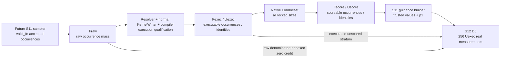

# S10R4 → S11 實驗計畫變更指南

> **一句話：**我們沒有跑出一個新的好或壞結果；我們把尚未開始、已陷入多輪 execution-binding 修復的 S10R4 正式退役，改由一份 administrative authority 讓 S11 重新設計自己的 fresh、support-aware 實驗。

本指南用白話解釋計畫，但**不是 runner、contract 或 lock authority**。若文字衝突，依序以 [research charter](../surrogate-dse-plan.md)、[experiment parent plan](../ductile-origami-warmstart-experiment-plan.md)、[new authority](s10r4-retirement-s11-rebaseline-authority.md) 與各 checkpoint design 為準。本指南不能授權執行，也不能創造 scientific edge。

## 1. 白話摘要

舊流程把 S10R4 當成 S11 必須先通過的科學入口：S10R4 若沒有 positive edge，S11 就不能開始。可是 S10R4 從未產生 scientific result；B01–B06 分別停在 preterminal、prelock 或未開始狀態，B07 更只是未被接納的 dirty draft。

新流程保留全部歷史 bytes 與失敗紀錄，但不再要求一個沒有跑完的 checkpoint 先「變成成功」。`S1-REBASELINE-20260803` 只是一個 administrative prerequisite：它說明 S11 可以另做自己的設計與 contract；它不是實驗成功證據。S11 仍是 `DESIGN_APPROVED / not_started / not_evaluated / lock absent`，不能立即跑 evidence。

這個 rebaseline 同時把三種不同 populations 分清楚：validator accepted raw occurrences、真正能 generate+compile 的 executable occurrences，以及能完整取得 Formocast score 的 scoreable occurrences。這避免把 codegen failure 誤叫做 model missingness，也避免因一個不可信 candidate value 讓整個 gene 的可信 values 全部失去 guidance。

## 2. 到目前為止真正完成了什麼

`Technical PASS` 代表工程檢查符合條件；`scientific outcome` 才表示 positive、negative 或 inconclusive 科學判讀。下表只列 committed history，不把本文件的 planned changes 當成結果。

| Checkpoint | Durable state | Scientific outcome | Criterion／failure | Verified outgoing edge |
| --- | --- | --- | --- | --- |
| S00 | `CHECKPOINT_COMPLETE` | positive | `S00_EVIDENCE_READY` | `S00_EVIDENCE_READY -> S10` |
| S10 | `CHECKPOINT_COMPLETE` | negative | `S1_ENTRY_BLOCKED / FT-BLOCKED-MAPPING` | `null` |
| S10R1 | `cancelled / BLOCKED` | not evaluated | A32 cancellation | `null` |
| S10R2 | `CHECKPOINT_COMPLETE` | inconclusive | `FT-INCONCLUSIVE` | `null` |
| S10R3 | `CHECKPOINT_COMPLETE` | negative | `S1_ENTRY_BLOCKED / FT-BLOCKED-MAPPING` | `null` |

對應 evidence／reports 可從 [active checkpoint index](README.md) 查到。表中只有 S00 有 outgoing scientific edge；S10–S10R3 都不能被改寫成 S11 predecessor success。

## 3. 為什麼 S10R4 退役，以及「沒有結果」的意思

S10R4 的原問題是：在一個既有 raw frame 中，normal resolver、KernelWriter、mapping、correctness 與 noise 能否形成可重現的 operational entry fixture。B01–B06 暴露不同的 execution／lineage defects，但沒有一個 binding 完成 S10R4 scientific outcome；B07 沒有 committed authority。

因此「retired」的意思是：

- S10R4：`retired_unstarted / superseded / cancelled / BLOCKED / not_evaluated / lock absent / edge=null`。
- B01–B06：保留 immutable historical diagnostic/design provenance；zero S11 gate credit。
- B07：`not_admitted` dirty draft；禁止作 authority 或 evidence。
- 不建立 S10R4 formal scientific report、result、lock 或 edge。

「沒有結果」不是 negative，也不是 inconclusive。它表示該 checkpoint 沒有完成有效的 scientific measurement 與 decision，故只能記 `not_evaluated`。

本文後面會用到 **Layer C**。它是 runner／agents 產生、由 operators／auditors 消費的
operational bookkeeping 與 planning telemetry，記錄 live state、resource forecasts、
routing 與 repair history。Layer C 只能協助操作與稽核，不能決定 sample inclusion、
measurement、scientific outcome、claim 或 edge。

## 4. 舊流程與新流程

| 問題 | 舊 active 規則 | 新 active 規則 |
| --- | --- | --- |
| S11 怎麼取得進場資格？ | 需要 `S10R4:S1_ENTRY_GO_EXACT_FRAME` positive edge | 由 `S1-REBASELINE-20260803` 提供虛線 administrative prerequisite；`incoming_scientific_edge=null` |
| S10R4 狀態 | active approved／not started gate | retired unstarted、superseded、cancelled、no report／lock／edge |
| Raw 到 model population | `F_valid(raw) -> F_effective -> F_codegen`，舊文容易混淆 coverage | Exact `Fraw -> Fexec -> Fscore`，execution attrition 與 model missingness 分開 |
| Gene eligibility | 任一 value 不完整，whole gene fail closed | `T_g` trusted values 可接受 guidance；untrusted values 保留 baseline mixture mass |
| S12 D5 frame | scoreable operational catalog 的 256 identities | exactly 256 `Uexec` identities；10 `Uscore` deciles + 1 executable-unscored stratum |
| S12 primary prior mass | selected／scoreable frame 容易變成 denominator | 完整 `Fraw` alias mass 作 denominator；nonexecutable 零 credit |
| S30 resource/time | 曾被寫入 positive criterion／stop matrix | Layer-C planning telemetry；不形成 scientific negative |
| S40 data shortage | trigger 後可能直接寫 negative report | data 不完整時 `data_pending / not_activated / not_evaluated`；無 report／decision／lock |
| S41 claim | 容易讀成 general／stable improvement | 只支持 frozen finite held-out frame 的 observed point-direction comparison |

## 5. 從 raw occurrence 到 S12：誰產生、誰消費



逐步讀法：

1. Future S11 sampler 執行 pinned `valid_fn`；input 是 actual YAML 與 fresh seeds，output 是 accepted raw occurrences，下一個 consumer 是 `Fraw` ledger。
2. Resolver／KernelWriter／compiler 消費每個 `Fraw` occurrence，產生 execution qualification 與 stable operational identity；下一個 consumer 是 `Fexec/Uexec` catalog。
3. Native Formocast 消費每個 `Uexec` identity 的 locked-size inputs，輸出 finite scores 或 explicit unscored reason；下一個 consumer 是 `Fscore/Uscore` 與 S11 guidance builder。
4. S11 guidance builder 消費 fresh occurrence support、execution mapping、scores 與 model-only statistics，輸出 trusted sets、weights、shuffle 與 future guidance lock；這不能使用 real labels。
5. S12 sampler 消費 `Uexec`，無 replacement 抽 exactly 256 identities；S12 measurement 才產生 real labels，並以完整 `Fraw` mass 判 prior mass。

## 6. 三個 populations：誰算、誰不算

### 6.1 `Fraw`

`Fraw` 是 future S11 在 `IndividualSet` dedup 前的 validator-accepted occurrence multiset。一次 accepted sampler draw 是一個 member；同一 config 抽到兩次算兩個 occurrences。Producer 是 future S11 sampler，consumer 是 execution-yield、value support 與 S12 raw denominator。

- Membership：pinned `valid_fn` accepts。
- Nonmembership：`valid_fn` rejects；接受後不能因後續失敗刪除。
- Denominator：`Y_exec` 與 S12 `M_a(T)` 的 complete raw occurrence mass。
- Example：同一 config 在 chunk 2、chunk 7 各被接受一次，就是兩個 `Fraw` occurrences。
- Not implied：不證明 resolver、generation、compile、Formocast、correctness 或 performance success。

### 6.2 `Fexec` 與 `Uexec`

`Fexec` 是 `Fraw` 中 unique resolver projection、normal KernelWriter generation、pinned compilation 與 stable operational identity 全部成功的 occurrence submultiset。`Uexec` 是把這些 occurrences 依 stable operational identity deduplicate 後的 unique catalog。

- Membership：resolver unique/complete + source emitted + compile success + identity stable。
- Nonmembership：resolver-none／ambiguous、exception、generation／compile failure 或 timeout。
- Denominator：`C_score_occ` 的 denominator 是 `Fexec` occurrence mass；D5 256-frame 從 `Uexec` identities 抽。
- Example：三個 raw aliases resolve 到同一 stable executable identity，`Fexec` 保留三個 occurrences，但 `Uexec` 只有一個 identity。
- Not implied：不證明 Formocast 可打分、GPU correctness、noise 或 performance。

### 6.3 `Fscore` 與 `Uscore`

`Fscore` 是 `Fexec` 中，在每個 locked size 都完成 native Formocast mapping 且得到 finite output 的 occurrences；`Uscore` 是對應 unique identities。

- Membership：all locked sizes mapped + finite native scores + complete provenance。
- Nonmembership：mapping failure、missing size、non-finite score、exception 或 partial result。
- Denominator：primary model coverage 是 `Fscore/Fexec` occurrence mass；不是 `Fscore/Fraw`，也不是只看 unique ratio。
- Example：一個 executable identity 在三個 required sizes 中有一個 non-finite score，它不在 `Uscore`，但仍在 `Uexec` 第 11 stratum。
- Not implied：不證明 real ranking accuracy、correctness、representativeness 或 benefit。

## 7. Population formulas 與 worked example

```text
Y_exec = sum_{o in Fraw} I[o in Fexec] / |Fraw|
C_score_occ = sum_{o in Fexec} I[o in Fscore] / |Fexec|
```

`o` 是 occurrence；`I` 是 0/1 indicator。`Y_exec` 是 accepted raw mass 中可執行的比例，越大表示 execution attrition 越少。`C_score_occ` 是 executable occurrence mass 中 complete Formocast coverage，越大越好，required threshold 是 0.95。

100-occurrence 例子：80 occurrences executable，20 resolver/codegen/compile fail；80 executable 中 76 scoreable、4 executable-unscored。

```text
Y_exec = 80/100 = 0.80
C_score_occ = 76/80 = 0.95
```

20 nonexecutable occurrences 留在 S12 raw denominator、top-decile credit 為零；4 executable-unscored occurrences 進第 11 stratum，實測後可以因 real top-decile result 取得 credit。

## 8. `p0`、`q`、`p1`：可信值怎麼被引導

`T_g` 是 gene `g` 的 trusted-value set。Value 只有在 fresh S11 evidence 有至少 128 accepted conditional `Fraw` occurrences、至少 1 個 `Fexec` occurrence、unique value-preserving relation、`C_score_occ(value)>=0.95` 與完整 model-only statistics時才 trusted。Unobserved、normalized-away、collision/context-confounded、execution/score attrited 或 unresolved values 都是 untrusted；unobserved 不等於 absent。

公式中的 `g` 是 residual gene，`V_g` 是它按原順序保存的 candidate-value set，`v` 是
其中一個 value，`T_g` 是 trusted values 的 subset，`u` 則是只在 `T_g` 內取值的 dummy
value。每個 eligible residual gene 都是 unweighted，因此對 preserved candidate set 的
每個 value，baseline probability 精確為 `p0_g(v)=1/|V_g|`，不是近似或通常規則。

```text
mu_gv = (sum_i b_i + 32 * global_mean_g) / (n_gv + 32)
q_g(v) = exp(lambda * (mu_gv - min_{u in T_g} mu_gu)) / Z, v in T_g
q_g(v) = 0,                                               v not in T_g
p1_g(v) = 0.20 * p0_g(v) + 0.80 * q_g(v)
```

- `p0_g(v)` 是 actual-YAML baseline probability；由 preserved YAML candidate set 與
  unweighted rule 得到精確的 `1/|V_g|`，是 dimensionless probability。
- `i` 索引支持 value `v` 的 accepted occurrences；`b_i` 是 occurrence `i` 的
  dimensionless pinned model-only benefit，數值越大越好。
- `n_gv` 是 gene `g`、value `v` 的 accepted-occurrence count；unit 是 occurrence。
- `global_mean_g` 是 gene `g` 依 accepted-occurrence multiplicity 加權的 dimensionless
  mean benefit；`mu_gv` 是把 value cell 拉向該 mean 後的 dimensionless shrinkage mean，
  越大代表 model-only benefit 越好。
- `32` 是 preserved S11 shrinkage constant `alpha`，不是 mixture constant。
- `q_g(v)` 是只在 `T_g` 上正規化的 dimensionless guided probability；`exp` 是標準
  exponential function，`mu_gu` 是把同一 shrinkage mean 公式套到 dummy value `u`；
  `Z` 是 trusted-set normalizer，使 `sum_{v in T_g} q_g(v)=1`。Trusted value 的 `q`
  越大，guided mass 越多。
- `lambda` 使用 preserved S11 grid `{0, 0.25, 0.50, ..., 8.00}`；它是 exponent 中的
  dimensionless tilt constant，越大越偏向高 `mu`，但 normalized entropy 必須
  `>=0.80`。
- `0.20` 是 preserved S11 baseline mixture `epsilon`；`0.80=1-epsilon`。Untrusted value
  永遠保留 `0.20*p0>0`。
- `p1_g(v)` 是 treatment 的 dimensionless final sampling probability；較高表示 future
  sampler 較常抽該 value，不代表它一定有效或更快。

六值例子：`p0=1/6`，`v1..v5` trusted、`v6` untrusted，且 `q=(0.30,0.25,0.20,0.15,0.10,0)`：

```text
p1=(41/150, 7/30, 29/150, 23/150, 17/150, 1/30)
```

這個精確 fraction tuple 總和為 1；untrusted `v6` 精確是
`1/30 = 0.20/6 ≈ 0.033333...`，沒有 model upweighting，也沒有被叫做 absent。

## 9. 4096／8192、128／256 與 fixed 256 到底在數什麼

| 數字 | Object／unit | 用途 | 不是什麼 |
| --- | --- | --- | --- |
| 4,096 | global accepted `Fraw` occurrences | first model-only stability decision boundary | 不是 4,096 unique identities，也不是 repetitions |
| 8,192 | global accepted `Fraw` occurrences | hard cap；4,096 halves不一致時繼續 | 不是 outcome-driven extension target |
| 128 | 每 activated candidate value 的 accepted conditional `Fraw` occurrences | trusted-value minimum support | 不能 pool 進 global 4,096／8,192 |
| 256 | 每 activated value 的 conditional occurrence cap | precision/stability rule允許的上限 | 不是 D5 identity count |
| fixed 256 | unique `Uexec` identities、without replacement | S12 D5 real-measurement frame | 不是 occurrences、sizes 或 timing repeats |

若 D5 有 256 identities 且每個測 3 sizes，會有 768 config-size rows；這仍是 256 個 independent identity units，每個 identity 的 3 sizes 是 repeated observations。Timing repeats 又是另一個計數，不能拿來補 identities。

D5 由 10 個 `Uscore` weighted score deciles，加 `Uexec\Uscore` 第 11 stratum 組成；每個非空 stratum 至少一個 identity。`|Uexec|<256` 時是 `inconclusive / FT-INCONCLUSIVE / edge=null`，不能用 aliases、sizes 或 repeats 補到 256。

## 10. Raw-denominator prior mass

```text
r_a(o) = pi_nominal,a(o) / pi_nominal,0(o)
M_a(T) = [sum_{j in D5} ((sum_{o aliases j} r_a(o))/rho_j)
          * I[j in real_top_decile_T]]
         / [sum_{o in Fraw} r_a(o)]
```

`a` 是 sampling arm。`pi_nominal,a(o)` 是 arm `a` 對 occurrence `o` 所代表 raw config
的 frozen pre-validity product probability，由 preserved YAML groups／weights 與該 arm
的 locked guidance 推得；arm `0` 是 actual-YAML baseline。`r_a(o)` 是 dimensionless
density ratio；arm 與 baseline 在該 raw config 給相同 probability 時為 1。

`o` 是 `Fraw` occurrence；`j` 是 selected `Uexec` identity；`o aliases j` 包含每個
resolve 到 identity `j` 的 `Fraw` occurrence，因此 duplicates／aliases 都保留。
`rho_j` 是 identity `j` 的 prelocked D5 inclusion probability，是 0–1 的 dimensionless
probability。`T` 是 frozen real top-decile identity set；indicator 只有在 selected
identity `j` 屬於 `T` 時為 1，否則為 0。`M_a(T)` 是 dimensionless prior-mass estimate，
越大表示 arm 把更多完整 raw prior mass 放到 frozen real top decile。

關鍵是 denominator 使用完整 `Fraw`。Nonexecutable raw occurrences仍算 mass但 numerator 為零；executable-unscored identities進第 11 stratum取得 real measurement，若實際在 `T` 就能取得 numerator credit。這既不把 execution attrition藏掉，也不預先把 model-unscored identities判負。

以下是只為手算公式而設的 toy example，**不取代 fixed D5=256**。共有 5 個 `Fraw`
occurrences：兩個 aliases resolve 到 `j1`，一個 occurrence resolve 到 `j2`，另外兩個
nonexecutable。取 baseline arm `a=0`，所以五個 `r_0(o)` 都是 1。Toy sampling 在兩個
executable identities 中抽一個，因此 `rho_j1=rho_j2=1/2`。若抽到的 `j1` 屬於 frozen
`T`，則：

```text
numerator = (1 + 1) / (1/2) = 4
denominator = 1 + 1 + 1 + 1 + 1 = 5
M_0(T) = 4/5 = 0.80
```

兩個 nonexecutable occurrences 仍各提供 1 單位 denominator mass，但 numerator credit
都是 0。

## 11. S30／S40／S41 before-and-after

| Checkpoint | Before | After |
| --- | --- | --- |
| S30 | 7 days、report day、failure/resource budget曾寫成 positive/stop條件 | 它們是 Layer-C planning telemetry：record+notify；只有 real safety/availability/full-workload/evidence risk 才 pause。Two clusters、two sizes、one reserve、cutover、two-slot denominator與procedure仍是 hard science |
| S40 | Trigger 後 data insufficiency 可 terminalize為 scientific negative／report | S40 只有 trigger + complete data readiness 同時存在才 instantiated；trigger但data不足為 `data_pending / not_activated / not_evaluated`，無 report／decision／lock；有新 prelabel-qualified data才重查 |
| S41 | 「改善／穩定」容易被讀成 broad effect | Positive 只支持 frozen finite held-out frame 的 strict observed point-direction comparisons；不支持 practical effect、stability、significance、population generalization、replication、production 或 actual-GA benefit |

S40 data floor 本身沒降級：4 independent clusters；每 cluster至少 256 unique configs與2 sizes；總計至少1,024 configs／2,048 config-size labels；完整 inclusion、correctness、mapping、coverage；已有3 clusters時最多一個 prospective fourth cluster。

## 12. 哪些事保持不變

- S00–S10R3 outcomes、decisions、report identities與edges。
- Actual YAML groups、weights、candidate order。
- S11：4,096/8,192、128/256、`alpha=32`、`epsilon=0.20`、lambda grid、entropy、spread、permutation/bootstrap、recurrence、size direction、coverage與label firewall。
- S12：fixed 256、no replacement、thresholds、ESS、coverage、correctness、five-fold oracle、bootstrap/permutation/ties。
- S13、S20、S31 的 arms、seeds、horizons、samples、criteria與edges。
- S30 two-primary／two-size／reserve／cutover／two-slot denominator science。
- S41 exact ridge model、target、grid、preprocessing、split、weights與strict comparisons。

## 13. Protected history 與禁止重用

- S10R4 B01–B06 files保留在 first-parent history；只能作 diagnostic/design provenance，不能作 S11 trust、support、score、model 或 gate credit。
- B07 dirty draft禁止讀作 authority/evidence。
- S11 必須用 fresh/disjoint S11 seeds；S10R3/S10R4 rows 不能補它的 formal population。
- Codegen/compile failure是 execution attrition，不是 Formocast missingness。
- Stochastic non-observation不是 absence proof。
- 本 rebaseline 不建立 S10R4/S11 process、lock、evidence、result、formal report 或 fabricated edge。

## 14. 現在可以與不可以下什麼結論

可以說：

- S10R4 已依 approved R3 authority 退役，scientific outcome仍是 `not_evaluated`。
- S11 可開始新的 design/contract planning，而且 incoming scientific edge 為 `null`。
- Future S11/S12 的 population、denominator、trusted-value、S30/S40/S41 lifecycle/claim boundaries已 prospective 定義。

不可以說：

- S10R4 positive、negative或inconclusive。
- S11 guidance有效、Formocast ranking準、GPU performance變好。
- S11/S12已 lock、已執行、已驗證或已產生 report。
- `S1-REBASELINE-20260803 -> S11` 是 scientific success edge。
- S41 對未觀察 population、production 或 actual GA 有改善。

最短版本：**no experiment、no result、no fabricated edge**。

## 15. 下一個合法動作與 authority links

下一步是新的 S11 design discussion／contract workflow，而不是直接跑 evidence。它至少需要：

1. 依本 authority 與 [S11 design](s11-stage1-model-only-factorization-design.md)建立 exact machine-readable frozen contract；
2. Main 先 freeze goal/oracle Plan-B，再寫 decision-complete Plan-A；
3. Fresh implementer 完成 exact whitelist implementation；
4. 建立 effective S11 lock並做 prelabel audit；
5. 才能執行 future S11 evidence，由 fresh verifier依 contract判斷；
6. 只有完整 `S11:S1_GUIDANCE_LOCKED` verified／committed／post-audited，S12 才能開始。

權威入口：

- [Research charter](../surrogate-dse-plan.md)
- [Experiment parent plan](../ductile-origami-warmstart-experiment-plan.md)
- [S1 rebaseline authority](s10r4-retirement-s11-rebaseline-authority.md)
- [Active checkpoint index](README.md)
- [S11 design](s11-stage1-model-only-factorization-design.md)
- [S12 design](s12-stage1-real-score-ranking-oracle-audit-design.md)

## 16. Reader self-audit

- [ ] 我能說出 `Fraw`、`Fexec`、`Fscore` 的 membership、nonmembership、producer、consumer、denominator 與不支持的結論。
- [ ] 我知道 occurrence、unique identity、size row 與 timing repeat 是四種不同計數。
- [ ] 我能重算 100-occurrence example 的 `Y_exec=0.80` 與 `C_score_occ=0.95`。
- [ ] 我能用六值例子說明 untrusted value 為何仍保留 `0.20/6`。
- [ ] 我知道 fixed 256 從 `Uexec` 無 replacement 抽，而不是只從 `Uscore` 抽。
- [ ] 我知道 nonexecutable mass留在 raw denominator且零 numerator；executable-unscored 可由 real measurement取得 credit。
- [ ] 我知道 S10R4 是 retired `not_evaluated`，不是 negative／positive，也沒有 report／edge。
- [ ] 我知道 S11 現在仍沒有 contract、lock、evidence、result 或 report。
- [ ] 我知道 S30 time/resource 是 planning、S40 data pending不是 scientific negative、S41只允許 finite-frame point-direction claim。
- [ ] 我會在衝突時回到 authority files，不把本 guide 當 runner contract。
