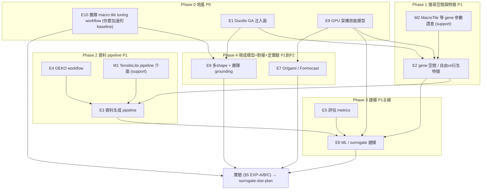

# 研究線知識計畫：surrogate 輔助 GA 暖啟動（聚焦版 TODO）

> **這份文件取代 [../learning-roadmap.md](../learning-roadmap.md)。** 原 roadmap 是「8 週實習通用學習計畫」，把 HIP / ISA / codegen 前置當必修；但方向已收斂到**單一研究目標**（見下），關鍵路徑改變——原 roadmap 中大量 HIP/ISA/asm/codegen 內容對這個目標已降為 **optional**。本檔只列「為了做成這個研究，你真正需要的知識」。
>
> **本檔已改為依「相依階段」組織**：§2 是**唯一的順序主線**（依相依關係排成 Phase 0→4，照著讀即可）。每項知識掛兩個標籤——`[優先級]`（`P0 地基`／`P1 主線`／`P2 收尾`）與 `[工時]`（`S`/`M`/`L`，粗略 T-shirt、避免假精確）。
>
> 相關研究文件：執行面（方向、方法、實驗、metric、紀律）在 [surrogate-dse-plan.md](surrogate-dse-plan.md)，本檔只管「學什麼·順序·優先級」；生態背景 [ductile-geko-notes.md](ductile-geko-notes.md)；GA 機制細節 [../geko-ductile/ga-algorithm-implementation.md](../geko-ductile/ga-algorithm-implementation.md)、觀念澄清 [../geko-ductile/ga-faq-clarifications.md](../geko-ductile/ga-faq-clarifications.md)。

## 0. 研究目標（一句話 + 具體化）

> **用一個便宜的分析／surrogate 模型「指導」GA 的搜尋（偏重採樣、pre-screen 候選），在保住 top-1/top-k 的前提下大幅減少實測 benchmark 次數，降低 tuning 成本。**

具體對接（見 [surrogate-dse-plan.md](surrogate-dse-plan.md) 的 §2 方法（把模型接進 GA）與 §3 對接團隊 pipeline 兩節）：

- **要打敗的 baseline**：團隊 **macro tile tuning workflow**（固定 tile、多尺寸 GA tune）——一個 tile 約 15 尺寸、單 GPU **2–3 小時**（會議 §3.2）。先讀懂這個 workflow：見 §2 的 **E10**。
- **注入方式（先做 B）**：用模型預測設 GA 的 sampling `weights`/`probs`（[../geko-ductile/ga-algorithm-implementation.md](../geko-ductile/ga-algorithm-implementation.md) §6.4 現成 hook），**biasing not pruning**。
- **兩個低成本實驗**：(1) max-min／加權 fitness ↔ regression 保護；(2) 用 rank-corr／top-1 量化「Origami 選到最佳 tile」假設。

> 這是**離線、資料驅動**的建模與分析任務——**不寫 kernel、不改 codegen、不動 Ductile/GEKO 核心**。這決定了下面「什麼必修、什麼 optional」。

## 1. 目前狀態 → 缺口對照

| 你目前的狀態 | 對這個研究的意義 | 該補什麼（Phase·優先級） |
| --- | --- | --- |
| 熟 hipBLASLt overall workflow（各元件職責） | ✅ 夠用，不用再深追 | — |
| TensileLite overall 懂、細節（rocisa/`MacroTile` 參數）沒深入 | 🟡 **參數**只需介面級；但團隊的 **macro tile tuning workflow** 是必修 grounding（你要加速的 baseline） | 參數：M2（Phase1）/M1（Phase2）介面級；workflow：**E10（Phase0·P0，必修）** |
| Origami 懂一點、沒看完；Formocast 不熟 | 🟡 研究可能拿 Origami 當「便宜模型」，需懂其角色/API | E7（Phase4·P1） |
| Ductile 大致懂、正在 trace 完整演算法 | ✅ 關鍵路徑，**繼續但聚焦注入面** | E1（Phase0·P0） |
| AMD GPU top-level 懂、正深入 CDNA3/4 HW | ✅ **方向對且是必修**——架構效能模型（occupancy/roofline/頻寬/MFMA）是 Origami/Formocast 與 feature engineering 的基礎 | E9（Phase0·P0）；更深微架構 M3（平行·選做） |
| CDNA3/4 ISA 幾乎不熟、asm 還沒碰 | 🔵 **指令級/組語**對本研究非關鍵路徑（注意：這≠E9 的架構效能知識） | O1（選做，可暫緩） |
| 在看 HIP/ROCm 影片（8×1hr，第 1 部） | 🔵 大多背景 | O5（選相關的看，別追求看完） |

## 2. 學習主線：依相依關係的階段（唯一順序來源）

> 這一節同時是「必修清單」與「學習順序」——依相依關係排成 Phase 0→4，照著讀即可。每個 item 標 `[優先級 · 工時]`；**Phase 0 是地基，擋住後面全部，最先做**。標 `(support)` 的介面級 item 是為了支撐同階段的主 item，夠用即可。

### 2.0 相依關係圖

### 2.1 Phase 0 — 地基（先搞懂「你要加速什麼」＋「你在動的那台機器」）[P0]

#### E10. 團隊 macro tile tuning workflow——你要加速的 baseline（grounding）`[P0 · S]`

> ⚠️ **名詞澄清（很重要）**：「macro tile tuning」在會議裡有兩個意思，別混：(1) **團隊的 workflow**（本項）＝「**固定一個 macro tile，用 GA 對多個尺寸一起 tune 出代表 kernel**」，一個 tile 約 15 尺寸、單 GPU 2–3 小時（會議 §3）——**這就是你研究要加速的 baseline**；(2) **`MacroTile` 這個 gene 參數**（見 M2）＝ tile 幾何的可調值。**前者是必修 grounding（本項 E10），後者才是介面級（M2）。**

- [ ] 讀懂團隊 workflow：[../meeting_notes/GEMM-Optimization-Roadmap-Origami-Tile-Selection-摘要.md](../meeting_notes/GEMM-Optimization-Roadmap-Origami-Tile-Selection-摘要.md) §3（macro tile tuning：固定 tile、多尺寸 GA tune、geomean uplift>3% 才 merge）、§4（tile selection policy）。
- [ ] 對齊本研究：你的 warm-start（注入點 B）就是插在這個 workflow 的「**GA tune 代表 kernel**」那一步（§0）；要打敗的 baseline 就是它的 2–3 小時/tile。
- 為什麼：不先搞懂「你要加速的到底是哪個流程、baseline 多貴」，後面 E1–E9 會像散落的零件。**這項無前置、最先讀，用來框定整個研究**（讀 meeting 摘要即可，很快）。

#### E1. Ductile GA 完整演算法——聚焦「注入面」 `[P0 · M（進行中）]`

- [ ] 讀完 [../geko-ductile/ga-algorithm-implementation.md](../geko-ductile/ga-algorithm-implementation.md) 全文（你正在做）。
- [ ] **重點吃透注入面**（研究要改的就是這裡）：
  - [ ] `weights`/`weight_beta → probs`（§6.4）＋ mutation weights（§11.2）＝模型偏重採樣的接入點。
  - [ ] fitness / `reduce_fn`（§5，`np.max` 保專精 / `np.mean` 通才）＝之後 max-min 實驗要動的地方。
  - [ ] `_evaluate` 如何產 GFLOPS（§8.2）、`sample` 如何採樣（§3.3）＝資料與評估的來源。
- [ ] 讀 [../geko-ductile/ga-faq-clarifications.md](../geko-ductile/ga-faq-clarifications.md) Q16–Q18（diversity 不觸發停止、hard boundary、暖啟動注入點）。
- 為什麼：注入點 B 直接改採樣權重；不懂這幾個函式就無從下手。

#### E9. GPU 架構「效能模型」知識——Origami/Formocast 與 feature engineering 的基礎 `[P0 · M–L]`

> ⚠️ 這項是**必修**，不是背景。先劃清界線：這裡指的是**架構效能模型知識**（memory hierarchy / occupancy / roofline / MFMA 吞吐…），**不是** ISA/組語（讀寫 assembly，那在 O1，仍 optional）。**Origami/Formocast 的模型整個就建立在這些概念上**——不懂它們，就無法「解釋 Origami 為何準/不準、在哪個 regime 崩」，也沒法替 surrogate 挑對特徵。

- [ ] **執行模型 / occupancy**：wave/workgroup、VGPR/SGPR/LDS 限制如何決定 occupancy、occupancy 如何影響延遲隱藏 → [../gpu_knowledge/execution-model.md](../gpu_knowledge/execution-model.md)。
- [ ] **記憶體階層 / chiplet**：HBM 頻寬、L2/L1/LDS、cache 行為、MI300 的 XCD/chiplet → [../gpu_knowledge/memory-hierarchy-and-chiplet.md](../gpu_knowledge/memory-hierarchy-and-chiplet.md)。
- [ ] **roofline 直覺**：arithmetic intensity、compute-bound vs memory-bound——判斷某 shape/config 的瓶頸在算力還是頻寬（也是 Roofline 級模型能/不能做什麼的界線，見 [surrogate-dse-plan.md](surrogate-dse-plan.md) §1.4 研究問題#3「模型要多細」）。
- [ ] **MFMA 吞吐 / peak FLOPs**：MFMA 指令的吞吐與峰值（決定 compute-bound 上界）→ [../isa/mfma-deep-dive.md](../isa/mfma-deep-dive.md)（讀「吞吐/資源」層面即可，不必到指令編碼）、[../internal_docs/cdna3-mi300-architecture-and-isa.md](../internal_docs/cdna3-mi300-architecture-and-isa.md)。
- 為什麼：(a) **解釋/驗證 Origami**——它把 kernel 拆成 init/prefetch/loop/tail/LSU/GSU/store 的成本、Formocast 有 L1/L2/L3 命中率模型，你要判斷它們哪裡失準就得懂這些機制；(b) **feature engineering**——知道 occupancy/LDS 壓力/roofline 才知道哪些 gene 特徵重要、為何重要。**深度到「能推理效能」即可，不需到微架構逐拍或 ISA。**

### 2.2 Phase 1 — 搜尋空間與特徵（predictor 的輸入）[P1]

#### E2. gene 空間 / SearchSpace——predictor 的輸入特徵 `[P1 · S–M]`

- [ ] 讀 [../geko-ductile/ga-algorithm-implementation.md](../geko-ductile/ga-algorithm-implementation.md) §3、§3.5（gene 從 `forkParams` 來、`--convert-config` 值域、gene 表）。
- [ ] 分清**自由 gene（可獨立調）vs 衍生特徵（由 gene 算出）**——predictor 只該用自由 gene 當特徵，避免共線性。
  - [ ] 讀 `Tensile/SolutionStructs/Solution.py` 的 `assignDerivedParameters`（`MacroTile0=SubGroup0*ThreadTile0`、`NumThreads` 怎麼來）；`Problem.py` 的 `ProblemType`。
- [ ] 參數速查：[../hipblaslt/tuning-config-reference.md](../hipblaslt/tuning-config-reference.md)。
- 為什麼：surrogate 的輸入特徵＝gene；特徵設計對不對直接決定模型準度。（依賴 E1 的 gene 編碼、E9 的「為何 gene 重要」直覺。）

#### M2. `MacroTile` 等 gene 參數的語意（介面級，支援 E2）`[P1 support · S]`

- [ ] `MacroTile`/`DepthU`/`WorkGroupMapping` 的語意與對效能的影響（gene 意義）。→ [../hipblaslt/macrotile-tuning.md](../hipblaslt/macrotile-tuning.md)。
- 注意：這是理解「**參數** `MacroTile`」；團隊會議講的「**macro tile tuning workflow**」是另一回事（那是你要加速的 baseline，見 **E10**，屬必修 grounding）。

### 2.3 Phase 2 — 資料 pipeline（surrogate 的燃料）[P1]

#### E4. GEKO workflow——資料來源與 warm-start 的 harness `[P1 · S–M]`

- [ ] 搞懂 `--tune`（configure→optimize，GA via Ductile）、`--search`（dense benchmark 既有 solutions）、`--bench`；輸出 `build_*/3_LibraryLogic/*.yaml` → `final_libs/`。
- [ ] 讀 [../internal_docs/gemm-kernel-optimization-geko.md](../internal_docs/gemm-kernel-optimization-geko.md)、背景 [ductile-geko-notes.md](ductile-geko-notes.md)。
- 為什麼：`--search` 是現成的 offline 資料來源；未來 warm-start 也是在這條 harness 上接。

#### M1. TensileLite pipeline 介面級（支援 E3）`[P1 support · S]`

- [ ] YAML→kernel→library、`ForkParameters`、`2_BenchmarkData` 輸出。夠產資料 + 理解 gene→kernel 映射即可。→ [../hipblaslt/](../hipblaslt/) 相關檔（tensilelite-pipeline / build-and-tuning）。

#### E3. 資料生成 pipeline——surrogate 的訓練資料 + ground truth `[P1 · M]`

- [ ] 跑一次 grid search 產資料：複製 `Tensile/Tests/common/gsu/f32_gsu.yaml`、擴一點 fork 值域，`Tensile/bin/Tensile <config> out/`。
- [ ] 看懂 `out/2_BenchmarkData/*.csv`：一列＝一個 candidate 的 `(gene 參數, shape, GFLOPS)`，確認「fitness = GFLOPS」怎麼讀、CSV 欄位 ↔ gene 對應。
- [ ] 工程化成**可重複 pipeline**：輸出統一 `dataset.csv`（欄位 `gene..., M,N,K,batch, dtype, GFLOPS[, counters]`）；記錄環境（GPU/ROCm/driver/iteration）；過濾 invalid（超 VGPR/LDS）與離群、取中位數降噪。
- [ ] 切 train/val**按 shape 或 config 分組**（避免 leakage，切勿隨機切列）。
- 為什麼：沒有乾淨、可重現、無 leakage 的資料集，後面所有建模都不成立。schema 見 [surrogate-dse-plan.md](surrogate-dse-plan.md) §4.1 資料集 schema。（依賴 E2 的欄位、M1 的 pipeline 介面、E4 的資料來源。）

### 2.4 Phase 3 — 建模（surrogate 本體）[P1 主線]

#### E5. 評估 metrics——怎麼算「贏了沒」 `[P1 · S]`

- [ ] 吃透：**rank correlation（Spearman/Kendall）、top-k 命中率、省下的評估次數、efficiency vs ideal（best-of-pool）、tuning-time vs quality 取捨曲線**。
- [ ] 讀 [surrogate-dse-plan.md](surrogate-dse-plan.md) §4.2 評估 metric ＋ [../internal_docs/solution-selection-metrics.md](../internal_docs/solution-selection-metrics.md)。
- 為什麼：tuning 用的 predictor 重點是「把好的 gene 排前面／選中 top-k」，**不是最小化絕對 GFLOPS 誤差**——metric 選錯整個研究會歪。

#### E6. ML / surrogate 建模基礎——研究的核心技能 `[P1 核心 · M–L]`

- [ ] baseline predictor：線性 / RandomForest / XGBoost（gene[+shape] → GFLOPS 或排序）。
- [ ] 特徵工程（只用自由 gene + problem 特徵 M,N,K,dtype,transpose）、避免 leakage、避免過擬合、held-out validation。
- [ ] ranking vs regression 的取捨（下游只需排序對）。
- 為什麼：這是「surrogate」本體。roadmap 幾乎沒教這塊，但它是關鍵路徑，需自行補（sklearn/xgboost 文件即可）。（依賴 E3 的資料、E5 的 metric、E2/E9 的特徵。）

### 2.5 Phase 4 — 現成模型 + 對接 + 定實驗 [P1→P2]

#### E7. Origami / Formocast——現成的「便宜模型」與對照 `[P1 · M]`

- [ ] 看完 Origami 設計：[../origami/README.md](../origami/README.md)、[../origami/api-and-usage.md](../origami/api-and-usage.md)（`rank_configs` 吃什麼、回什麼）、[../origami/latency-model.md](../origami/latency-model.md)。
- [ ] Formocast 定位：[../origami/ecosystem-and-formocast.md](../origami/ecosystem-and-formocast.md)、[../internal_docs/formocast-design-rfc.md](../internal_docs/formocast-design-rfc.md)（模擬式、`PredictionThreshold` 縮短 tuning）。
- 為什麼：injection B 的「便宜模型」很可能就用 Origami；Formocast 是 physics-based 的近親/對照。也要理解**循環依賴風險**（見 [surrogate-dse-plan.md](surrogate-dse-plan.md) §3.2 循環依賴，含初步解法）。（依賴 E9 才看得懂它為何準/在哪崩。）

#### E8. 多 shape 語意 + 團隊 pipeline grounding `[P2 · S–M]`

- [ ] 多 shape 聚合（`reduce_fn`、per-shape champion）：[../geko-ductile/ga-algorithm-implementation.md](../geko-ductile/ga-algorithm-implementation.md) §5、§6.3。
- [ ] 團隊 workflow 的 grounding 已在 **E10（Phase 0）** 讀過；此處**聚焦 §4.3「Origami 選到最佳 tile」假設** → 對應實驗 2（假設驗證）。
- 為什麼：兩個實驗（max-min↔regression、Origami 假設驗證）都建立在這；`reduce_fn` 需先有 E1，故 grounding 早讀（E10）、聚合語意這半留到這裡。
- → **交棒**：實驗規格（§5）、研究迭代日紀律（§6）見 [surrogate-dse-plan.md](surrogate-dse-plan.md)（本檔到此為止只負責「知識就緒」）。

### 2.6 一條線總結（速查）

> **E10（先搞懂要加速的 baseline）→ E1 · E9（地基）→ E2（+M2）→ E4 · M1 · E3（資料）→ E5 · E6（建模）→ E7 · E8（現成模型 + 對接）→ 實驗（見 surrogate-dse-plan §5 EXP-A/B/C）。**

## 3. 平行 / 選做（非關鍵路徑）

> 你現在正要碰的 ISA/asm、以及 HIP 影片，對這個**離線資料驅動**研究**不在關鍵路徑**上。先把 §2 主線做起來，這些有空再補。
>
> ⚠️ **別把 O1 與 E9 搞混**：「架構效能模型知識」（occupancy/roofline/頻寬/MFMA 吞吐）是**必修（E9，Phase 0）**；這裡 optional 的是**更低層的 ISA——逐行讀 `.s`、指令編碼、手寫組語**。前者是 Origami/Formocast 的基礎，後者對離線建模非必要。

- [ ] **M3. 超出 E9 的更深微架構細節**（平行·邊際遞減）：E9 的架構效能模型知識是**必修下限**；比它更深的微架構（逐拍排程、指令 latency 表、bank conflict 細節…）屬 moderate——**有助直覺但邊際遞減，別無限深入**。夠解釋 predictor 特徵與 Origami 行為就停。
- [ ] **(optional) O1. CDNA3/CDNA4 ISA 指令級 + asm practice**：指讀寫**組語指令本身**（非 E9 的架構效能概念）。研究不需手寫/逐行讀組語；**可暫緩**，除非之後要對某個 feature 做到指令級的物理解釋才回來補。
- [ ] **(optional) O2. rocisa / codegen 內部**：只需介面級 gene→kernel，不必深入。
- [ ] **(optional) O3. StinkyTofu**：codegen 重構基礎，與本研究無直接關係。
- [ ] **(optional) O4. HIP C++ 寫 kernel / 反組譯練習**：grid/GEKO 已能產資料，不必自寫 kernel。
- [ ] **(optional) O5. HIP/ROCm 訓練影片（8×1hr）**：大多背景。若要挑，優先 **HIP 201（Performance Tuning）**、**HIP 103（GPU 架構）**、**HIP 203（rocBLAS）**；其餘可略。別為「看完」而看完。
- [ ] **(optional) O6. 深 codegen 手改 / kernel 手工優化**：方向已轉研究線，非必要。

## 4. 明確排除（不在本研究 scope，避免誤投時間）

這些在團隊會議出現、但**不是**本（data-driven）研究線該碰的（詳見 [surrogate-dse-plan.md](surrogate-dse-plan.md) §3.3 邊界）：

- **regression 分級政策**：產品/客戶判斷，非演算法。
- **新架構 cold-start 推導 tile**：無資料 → data-driven 失效，需物理模型。
- **greedy tile selection / pruning**：次模集合覆蓋問題，greedy 已是對的工具，不套 GA。

## 5. 參考資源（從 learning-roadmap 遷移並重新排序）

### 5.1 研究線核心參考（必修相關）

| 參考 | 用途 |
| --- | --- |
| [../internal_docs/ductile-tensilelite-tuning.md](../internal_docs/ductile-tensilelite-tuning.md)（`1772982240`） | GA 染色體 / fitness / `--convert-config`、grid vs GA 取捨 |
| [../internal_docs/gemm-kernel-optimization-geko.md](../internal_docs/gemm-kernel-optimization-geko.md)（`1186895430`） | GEKO 編排、`--tune`/`--search`、tuning→merge |
| [../internal_docs/formocast-design-rfc.md](../internal_docs/formocast-design-rfc.md)（`1304232451`） | 模擬式效能預測——「用預測減少 benchmark」的近親／對照 |
| [../internal_docs/origami-vs-formocast.md](../internal_docs/origami-vs-formocast.md)（`1304199634`） | selection 層兩個預測 heuristic 的差別 |
| [../internal_docs/solution-selection-metrics.md](../internal_docs/solution-selection-metrics.md)（`744174730`） | efficiency vs ideal ＝ 研究成果評估 metric |
| JIRA `SWDEV-477426`（GA-driven search for solution libraries；William Gilmartin） | 研究對接的 feature（scope 2 completeness、scope 4 analytics） |
| [../internal_docs/hipblaslt-tensilelite-reference.md](../internal_docs/hipblaslt-tensilelite-reference.md) Module B/C | solution selection + codegen 總索引（查用） |

### 5.2 選做補充 (optional)

| 資源 | 為何 optional |
| --- | --- |
| HIP 課程（[../internal_docs/hip-training-at-amd.md](../internal_docs/hip-training-at-amd.md)） | 背景；本研究不寫 kernel。若挑：HIP 201/103/203 |
| GCN（gfx9）架構 talk（[../internal_docs/gcn-architecture-training-resources.md](../internal_docs/gcn-architecture-training-resources.md)） | 架構背景；夠做 feature 直覺即可 |
| CDNA3/4 ISA 官方規格（[../isa/](../isa/)） | 離線建模非關鍵路徑；有空再補直覺 |
