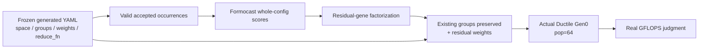
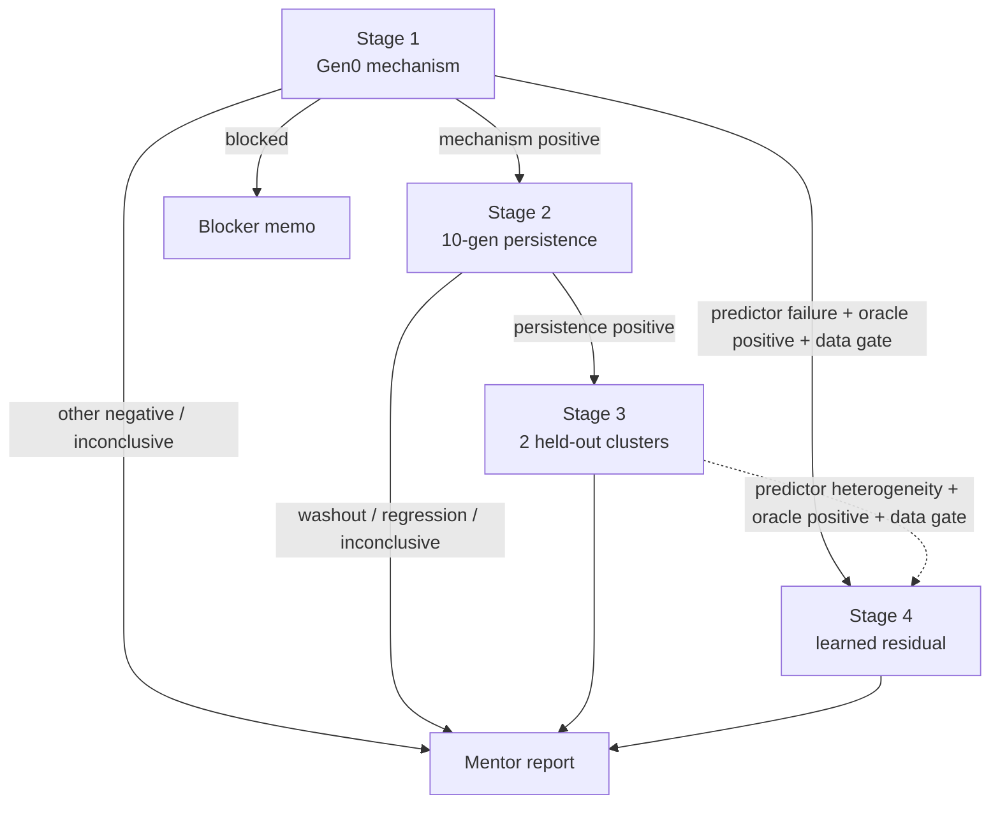

# Formocast-Factorized Ductile Guidance — Stage-Gated Internship Research Charter

> **文件角色：**研究 charter（研究問題、範圍、證據邊界與可宣稱結論的唯一權威）。
>
> **設計核准基線（2026-07-24）：**`stage_gated_roadmap_approved / pre_empirical / zero_lock / zero_completion`。當時十份checkpoint design已完成設計審查；S00尚未開始，其餘全部dependency-gated，且沒有active runtime protocol、effective lock、formal report或empirical outcome。
>
> **Current lifecycle：**以[active checkpoint index](ductile-origami-warmstart/README.md)與[experiment plan](ductile-origami-warmstart-experiment-plan.md)為準；本charter不重複維護易變的checkpoint current state。
>
> **檔名說明：**`surrogate-dse-plan.md` 是為維持既有連結而保留的歷史檔名。Stage 1–3不訓練 self-trained surrogate；主要模型是 **Formocast**。Learned residual只有 Stage 4 trigger與data gate同時通過才啟動。
>
> **執行規格：**所有sample counts、公式、門檻、seeds、artifacts與Stage 1–4 stop rules只以[ductile-origami-warmstart-experiment-plan.md](ductile-origami-warmstart-experiment-plan.md)為準。若兩份文件衝突，本charter決定研究scope／claim，experiment plan決定數值與checkpoint DAG。
>
> **Legacy override：**`ductile-origami-warmstart/legacy/`下的M00–M09全部是dead-protocol archive，統一為`legacy / design_authority:none / do_not_execute`。任何active-looking欄位都只保留為`historical_*`；不得重用其artifact、schema、hash、lock、registry、criterion、fixture或test。

---

## 0. 一句話定位與 north star

先在一個由 **frozen generated YAML** 鎖定的 gfx942 non-StreamK Ductile residual search space 中，檢驗：

> **Formocast 對 whole config 的 physics-based 效能訊號，經過 per-gene factorization 後，能否在保留既有 YAML groups／weights 的前提下，為尚未加權的 residual genes 提供額外的第 0 代（Gen0）候選品質；若不能，訊號究竟消失在哪一層？**

Stage 1 回答上述 **factorization／initialization mechanism**。只有它通過後，研究才依序擴張到：

1. **Stage 2 — short-horizon persistence：**Gen0 優勢能否保留到固定 10-generation horizon；
2. **Stage 3 — bounded held-out replication：**凍結的 guidance procedure 能否在兩個新 fixed-tile regimes重現；
3. **Stage 4 — conditional learned residual surrogate：**只有 predictor-specific failure、oracle-positive 且資料足夠時，才研究 learned residual能否補足 Formocast。

因此完整研究不是只做 Gen0，但也不是完整 GA speedup、production integration 或 deployment 專案。

白話說：Formocast 會替「整組 kernel 參數」打分，但 Ductile 現成 hook 只能分別替「每個 gene 的每個值」設定初始抽樣機率。本研究要回答的是：**把整體評分拆成各 gene 偏好後，還剩多少真的有用的資訊？**

---

## 1. Pivot 與 supersession record

### 1.1 被取代的舊命題

本檔舊版與舊實驗計畫曾同時包含：

- self-trained surrogate／Origami／Formocast 暖啟動 GA；
- Injection A 候選範圍 widening；
- non-StreamK 與 StreamK 雙 cohort；
- 完整 GA headroom、長 horizon、multi-tile 與 held-out confirmation；
- 「減少 tuning evaluations／端到端 speedup」作主要成果。

這些方向不是都沒有研究價值，而是**對短期 internship 過大，且其中數項已與核心團隊既有或正在規劃的工作相鄰**。繼續把它們包成單一主線，會讓研究問題、baseline 與可宣稱結果失真。

### 1.2 促成 pivot 的新證據

1. **GEKO 已有 problem-dependent Gen0 heuristic**
   - `origin/users/pkamd/geko_pr` 的 pinned commit `ce7b5e7754a342c464cd0470a9a3c9009b9a8fe4` 中，`config_sections_generator.py::_build_ductile()` 已依 problem sizes、TilesPerCU、granularity 與 GSU 產生 `group_0` costs，寫入 Ductile `weights`。
   - 這證明「problem-dependent initial guidance」已存在；但 branch code 存在**不等於**目標 gfx942 workflow 已部署。

2. **Formocast whole-config pre-screen 已存在**
   - `SolutionIterator.cpp` 已用 Formocast ranking 與 `PredictionThreshold` 決定哪些 solutions 進入 benchmark。
   - 因此本研究不能再宣稱「首次用模型降低 tuning 成本」。

3. **核心團隊另有 active GA 改善項目**
   - [AIHPBLAS-2810](https://amd-hub.atlassian.net/browse/AIHPBLAS-2810)：Open/P1，size sampling 與 multiple-size iteration allocation。
   - [AIHPBLAS-2791](https://amd-hub.atlassian.net/browse/AIHPBLAS-2791)：Open/P1，hierarchical／iterative MT/CMS tuning。
   - 它們不是本研究的 factorized residual guidance，但構成必須避開的 scope boundary。

4. **舊完整驗證超出目前 access 與時間條件**
   - 目前尚未由本研究 artifact 證明可用 gfx942 slot、actual generated YAML 與完整 Formocast mapping。
   - 在這些 gate 未過前，24 shapes、multi-seed confirmation 與 deployment claim 都不合理。

### 1.3 新決策

本研究保留「physics model 能否幫助 Ductile initialization」的核心興趣，並採 stage-gated 擴張：

- Stage 1：一個 gfx942、non-StreamK、單一 dtype/layout 的 bounded residual space；
- Stage 2：同一 development cluster 的 10-generation persistence；
- Stage 3：兩個預註冊新 clusters 的 bounded replication；
- Stage 4：嚴格條件式 predictor-substitution branch；
- 每一階段都有獨立 stop、failure 與 mentor-facing claim，不把後續 stages 當無條件承諾。

### 1.4 決策產生方式

2026-07-24 依 `/design-discussion` 進行：

1. 兩個 fresh GPT-5.6 Sol subagents 以相同 prompt 獨立提案；
2. 三輪交互詰問，處理文件 authority、sampling estimand、leakage、oracle 與 Gen0 重現性；
3. 修正 set-backed population 不應依賴 iteration order 的問題；
4. 兩方對同一份 candidate consensus 明確 `AGREE`。

代理共識是降低盲點的 process metadata；技術權威仍來自 repo code、frozen artifacts、真實 benchmark 與預註冊 protocol。

### 1.5 Scope expansion review

同日再次依 `/design-discussion` 檢討「七日 MVP 是否被誤寫成整個 internship 終點」：

1. 兩個 fresh subagents 獨立提出完整 staged roadmap；
2. 交互詰問 5 vs 10 generations、fresh-seed conditioning、held-out denominator 與 surrogate data floor；
3. 統一採用 Stage 1 → Stage 2 → Stage 3 主線，以及 oracle-positive 才能啟動的 Stage 4；
4. 兩方對修正後共識明確 `AGREE`。

這次修正不推翻 Stage 1 嚴謹性，而是把它恢復成**第一道 gate**，不再當成整份研究的天花板。

### 1.6 From-scratch governance reset

同日的最新bundle-level`design-discussion`對十個checkpoint做完整交叉詰問，兩位reviewers對同一份S00／S10–S13／S20／S30–S31／S40–S41方案明確`AGREE`。本次reset：

- 退役舊`protocol/`而不做migration；
- 一次建立十份`approved` design，不保留planned-but-missing slots；
- 採strict S00→S10→S11→S12→S13→S20→S30→S31主線與S12/S31→S40→S41條件分支；
- 將design、execution、checkpoint、scientific outcome與lock狀態分離；
- 把technical PASS與formal report、closeout、isolated commit明確分開；
- 將S41固定為單一ridge residual analysis與cluster-held-out strict gates。

各checkpoint的objections、採納／捨棄方案、理由與雙方`AGREE`保存在其active design。這是design approval，不是effective lock或empirical outcome。

### 1.7 Post-closeout Stage 1 entry recovery

2026-07-26，S10已durable closeout為frozen raw-boundary fixture下的
`negative / S1_ENTRY_BLOCKED / edge=null`後，唯讀diagnostics確認兩個新的
measurement-design問題：

- 十組fixture未先對齊Ductile operational `valid_fn` accepted support；
- non-finite-only Formocast rejection沒有區分finite early-terminate sentinel與
  whole-cohort runtime threshold queue。

兩個fresh GPT-5.6 Sol/xhigh reviewers依`design-discussion`獨立判讀、交換完整
立場並交互詰問，最後共同核准獨立S10R1 checkpoint。S10及其negative保持
immutable；S10R1只在相同source pins、byte-identical YAML、space／groups／weights、
三sizes、correctness與noise要求下修正selection及measurement semantics。這是當時的
approved design；後續A32已取消其execution，沒有產生scientific edge。

### 1.8 A32 diagnostic cancellation與S10R2

2026-07-28，使用者依append-only S10R1 governance chain的A32 event核准在safe
boundary停止S10R1：

- operational state固定為`cancelled / BLOCKED`，scientific outcome為
  `not_evaluated`、edge為`null`，不是`CHECKPOINT_COMPLETE`；
- 不建立S10R1 scientific report；generation 0／1只作diagnostic lineage，
  所有empirical／repair artifacts禁止重用；
- stochastic non-discovery（包含DepthU=1024 diagnostic）不證明support absent，
  也不是scientific inconclusive；
- 新建sibling S10R2，在actual S10 pins／YAML／groups／weights／三sizes不變下，
  先做CPU validity-only support classification，再分離exact-ten mapping與
  deterministic sentinel/helper conformance；
- 只有post-audited `S10R2:S1_ENTRY_GO`可進S11。S11–S41 roadmap、criteria、
  numerical timeboxes與claim ladder全部保留。

Execution治理以commit
`b0561d2c9216a58a9d71b8e839c47efaa51f9c00`為floor；S10R2是R2 standalone
tranche／closure，後續tranches為S11+S12+S13、S20、S30+S31、S40+S41。這只改
authority／orchestration，不改scientific gates。

### 1.9 A33 identity-only diagnostic retirement

2026-07-28，使用者要求只保留新版研究真正需要的內容並清除S10R1 bulk artifacts。
兩位fresh reviewers完成一輪交互詰問並共同`AGREE`：

- S10R1約34 GB ignored run tree與19個untracked implementation／protocol／test paths
  對S10R2／S11沒有合法consumer，且明文禁止作gate evidence；
- current S10R1文件壓縮為取消tombstone，A30–A32、source／YAML／L0／selection
  identities、resource known／unknown與清理稽核由
  [retirement manifest](ductile-origami-warmstart/retirements/s10r1-diagnostic-retirement.json)
  保存；完整舊protocol只留在Git history；
- physical bytes可依exact allowlist退休；immutable的是lifecycle、outcome、edge與
  digest-level lineage，不是bulk copies；
- cleanup不改S10R1的`cancelled / not_evaluated / edge=null`，也不reset任何歷史
  resource消耗。

S10R2在retirement post-audit及durable resource relock前保持operational
`BLOCKED / not_evaluated / edge=null`。本次沒有降低任何scientific workload、
threshold、gate、claim或downstream dependency。

### 1.10 A34 prospective resource boundary

2026-07-28，使用者要求resource relock先由`design-discussion`形成統一共識，再以
`implement-verify-loop`執行S10R2。兩位fresh `gpt-5.6-sol / xhigh` reviewers
`/root/s10r2_next_plan_a`與`/root/s10r2_next_plan_b`完成獨立審查、一輪
cross-examination與一輪final positions，兩方均`AGREE`：

- historical resource record不重寫：cutoff
  `d66edf7ac81cb76825b988e1ea9a65264dfeb0f6`前的3151 chunks、
  threads`>=10`、repairs`>=11`與其餘`UNKNOWN`全部保留；
- authority commit post-audit後，只向前建立`T-S10R2`與reserved
  `T-S1-MECHANISM`各5 new threads／3 new repairs的enforcement counters；
  S13仍受R1最多2 repairs，internal edges與new roots都不再reset；這些A34
  prospective repair caps後由A44統一supersede為6；
- S10R2→S13共享新的prospective 7 hands-on days、最多1.4 pre-empirical days與
  5 GiB transient ceiling；
- 先做不接觸actual validity/support、Formocast、GFLOPS、correctness/noise labels或
  S10R1 artifacts的outcome-blind calibration，再把具單位wall／CPU／GPU caps、
  confirmed allocation與buffer seal進durable contract／lock；
- final numeric relock與preflight完成前，S10R2仍是
  `BLOCKED / not_evaluated / edge=null`。

本決策只修resource authority，不改research question、scientific criteria、
samples、sizes、DAG、claim或downgrade gate；A33釋放的physical capacity仍不是
historical accounting reset。

### 1.11 A36 resource-accounting materiality amendment

2026-07-29，使用者明確要求不要讓對整體科學實驗沒有實質影響的resource-accounting
缺口阻礙研究進度。此R3 post-label authority將resource telemetry重新釐清為
operational safety／planning control，而不是默認scientific estimand：

- 只有direct evidence顯示或實質指向frozen cap exceed、unsafe continuation、
  label-dependent stopping／selection、required workload不完整或scientific evidence
  不可驗證時，resource-accounting finding才是blocking；
- fixed workload完整、schedule／append-only evidence chain通過、headline result由
  independent process重現、沒有label-driven stopping且沒有direct cap-exceed evidence
  時，缺少fine-grained或parent-process telemetry只記non-blocking technical caveat；
- 不得只為完善資源記帳重跑outcome-bearing workload；後續在真正
  resource-critical的run中prospective改善telemetry；
- 本amendment不能創造或改寫scientific outcome／edge。S10R2的
  `inconclusive / FT-INCONCLUSIVE / edge=null`仍不啟動S11。

### 1.12 A37 prospective resource-progress priority

2026-07-29，使用者進一步要求不要讓resource ledger、內部timebox或估算偏差阻礙
完整研究。Fresh reviewers`/root/resource_rule_review_a`與
`/root/resource_rule_review_b`以相同`gpt-5.6-sol / xhigh`、相同repo evidence
獨立審查，完成一輪cross-examination及一輪evidence-backed final；兩方均
`AGREE`：

- 本研究的resource usage預設是operational planning metadata，不是scientific
  estimand、acceptance criterion或successor-entry debit。Known usage及其
  parent／child／inclusive boundary以best effort保留；`UNKNOWN`不補造也不寫成0；
- missing telemetry、`>2x` projection、internal day／wall／CPU／GPU／storage／
  throughput／pre-empirical target crossing或historical cumulative consumption只需
  record＋notify，不自動pause、rerun、阻止entry或縮減fixed workload。Long-running
  work開始前通知，但通知不是approval gate；
- 只有direct或materially indicative operational evidence連到unsafe continuation、
  external／platform／allocation限制、實際資源不足、完整workload／verification／
  closure／artifact preservation無法完成、label-dependent stopping／selection、
  workload／claim change、evidence不可驗證，或labels前明確凍結的scientific
  resource／comparability boundary時，才在safe boundary暫停。Bare `UNKNOWN`、內部
  cap crossing或cumulative total不能單獨構成material evidence；
- scientific sample／draw／seed／arm／population／generation／repetition與thread
  caps、downgrade gate及evidence／claim boundary全部不變；repair history只作
  append-only provenance。

A37 prospectively supersedes本charter及parent plan中把internal resource planning
target一律當hard pause或cumulative successor debit的文字。Future machine contract
必須採相同語意；若resource quantity本身要成為hard scientific／external boundary，
必須在labels前明列exact quantity、measurement boundary與理由。S10R2的A36、
contract、lock、ledger、report、artifacts及
`inconclusive / FT-INCONCLUSIVE / edge=null`完全immutable，不做resource-only rerun。

### 1.13 A38 S10R3 bounded-cover entry recovery

2026-07-29，S10R2已post-audited closeout為
`CHECKPOINT_COMPLETE / inconclusive / FT-INCONCLUSIVE / edge=null`；其fresh
support discovery觀察到90個mandatory atoms，而frozen deterministic greedy
exact-ten selector需要18個configs才能full cover。這是合法的S10R2 result，不可
重開或重標。

兩位fresh `gpt-5.6-sol / xhigh` reviewers完成兩輪cross-examination與一輪
evidence-backed final。兩方共同支持新的post-label R3 sibling
[S10R3](ductile-origami-warmstart/s10r3-stage1-bounded-cover-entry-recovery-design.md)：

- S10R3使用fresh registry、與舊runs disjoint的seed namespace及fresh append-only
  ledger；S10R1 artifacts與S10R2 accepted rows、support states、activated targets、
  cover、seeds、mapping／GPU／noise及decision都禁止作S10R3 gate evidence；
- support schedule、three-state classification及mandatory mapping set
  `prelocked_candidate_atoms ∩ supported_witnessed`保持不變；
- prelocked selector改為
  `deterministic_greedy_set_cover_v2_bounded_k20`，令
  `K=max(10,C_greedy)`、`K_max=20`。`C_greedy`只表示frozen greedy full-cover
  cardinality，不宣稱mathematical minimum；
- fresh witnesses少於10或`C_greedy>20`時誠實結束為
  `inconclusive / FT-INCONCLUSIVE / edge=null`，不得事後加solver、draw、seed、
  selector或提高cap；
- mapping改為每pass exact `3K` rows，最多60 rows/pass；anchors為sorted hashes的
  `{0,floor((K-1)/2),K-1}`。Correctness仍是9 cells，noise仍是63 cells，所有
  native helper/fault、correctness、`CV P95 <= 0.5%`與`delta_noise` criteria不變；
- S11–S13 samples、seeds、thresholds、workloads、claims與internal edges不變。
  只有post-audited `S10R3:S1_ENTRY_GO -> S11`可啟動mechanism tranche。

舊`C_greedy=18`只作post-label design diagnostic，用來說明為何事前選
`K_max=20`；它不是S10R3 formal evidence或成功保證。Non-gating
`L_axis=max witnessed mandatory values on one residual axis`可提供cover lower bound；
若`L_axis<=20`但greedy over-cap，必須明寫沒有排除其他20筆內cover。

Reviewers保留的planner count、resource projection與GPU availability dissent，已由
Codex adapter、A37及使用者既有free-card指示解析。使用者以「全部核准」明確核准：
two planners＋one adversarial auditor＋Main implementation＋one fresh verifier（連同
design reviewers共R3 `6/6` threads）、A37 planning semantics、只在existing
`perlee`內直接使用目前free eligible gfx942且不需reservation，以及五路徑authority
commit與後續`implement-verify-loop`。不授權push。Initial
`12669 wall-s / 65285 CPU-s / 2901 GPU-s / 2 GiB`只作planning estimates；
scientific draw／cell與thread caps仍是hard boundaries；repair count依A46只作
provenance。

### 1.14 A44 universal six-round repair與goal persistence

2026-07-30，使用者將所有prospective R0–R3 repair cap統一為6 rounds；既有消耗完整
carry over，不能由generation、successor、replacement、restart或new root歸零，
第7輪仍需新的human authority。S10R3因此從`3/3`擴為`3/6`，下一輪是round 4。

Experiment-design議題仍必須由兩個獨立agents完成bounded cross-examination，並把
unified recommendation或preserved dissent交使用者決定。非設計阻塞、多個
contract-preserving修復方向或同一finding兩輪無material progress，則可由兩個
獨立agents裁決；其共同non-destructive、contract/authority-preserving結論已預授權
直接執行。普通`CHANGES_REQUIRED`、可修復test/process failure與nonmaterial
resource-accounting variance不得提前terminalize可依既有authority完成的goal。

A44只改execution governance，不改任何scientific hypothesis、search space、workload、
seed、threshold、criterion、outcome／edge matrix、claim或evidence boundary，也不授權
push、downgrade、destructive operation、dependency install或container mutation。

### 1.15 A45 S10R3 clean-restart execution alignment

2026-07-30，使用者要求刪除S10R3全部未提交implementation、tests、manifests、
contract draft、cache與舊`agent_run`，保留本charter、parent、active index與S10R3
design的committed scientific authority，並依current `.agents`
`implement-verify-loop`從clean execution baseline重啟。刪除時沒有effective lock、
formal evidence、outcome、report或edge；scientific state保持
`not_evaluated / edge=null`，且舊bytes、舊verdict與S10R1／S10R2 empirical evidence
全部禁止重用。

Current workflow要求Main先建立並freeze goal/oracle Plan-B、再建立decision-complete
Plan-A，且Main不得實作source；每個gate使用fresh implementer與fresh verifier。
這和A38歷史two-planner／Main-implementation配置，以及「同一pre-plan seal已包含final
implementation hashes」形成execution sequencing衝突。Fresh reviewers
`/root/s10r3_restart_design_a`與`/root/s10r3_restart_design_b`完成一輪
cross-examination與一輪evidence-backed final，兩方均`AGREE`採用不改scientific
plan的雙seal alignment：

1. Phase 1先seal完整scientific/oracle contract；final implementation binding保持
   `required_pending`且`outcome_access=false`。Seal後Main才依序建立Plan-B與Plan-A。
2. Fresh implementer只做label-blind implementation、tests、build、registry與fixture。
3. Phase 2使用既有effective-lock path綁定exact implementation/runtime identities；
   auditor pass、tracked seal與post-seal audit全過後才可產生formal evidence。
4. Execution-artifact boundary不授權整個run root；control-plane逐path列出，只有
   具名artifact-only子目錄可用explicit descendant semantics，且不進delivery。
   Phase 1並完整固定Phase 2 lock property/type/cardinality/null/unknown-field
   rejection、path-mode-hash records、state／audit與canonical self-hash schema。
5. A37 material condition的唯一durable lifecycle packet固定為
   `protocol/v1/evidence/s10r3-operational-blocker.json`；它以Main-only append events
   保存blocked／resumed與既有evidence，不是scientific report、completion或edge。
   Safe resume及exact parent projection／isolated commit policy在Phase 1預鎖。

S10R3 thread cap由使用者明確提高為`9`；cleanup前已知`5`個歷史threads，本次兩位
reviewers後為`7/9`，只保留一位fresh implementer與一位fresh verifier。Repair
`4/6`完整carry over。Restart、new root與刪除transient bytes都不重置計數。
Phase 1首次audit findings使用cycle 5補machine-contract completeness；fresh re-audit
關閉artifact boundary，但反例仍要求補audit cross-field、fixed source/projection
digest、formal-scope absence與resume lineage。Cycle 5以`CHANGES_REQUIRED`完成；最後
cycle 6 fresh re-audit通過時sealed counter為`6/6`，不改任何scientific criteria或
edge。

使用者另澄清：只有實驗結果導致必須更動原實驗計畫並選擇新scientific方向時才中斷
交由使用者決定；同一commit／feature內、pre-evidence且不改hypothesis、workload、
threshold、outcome matrix、claim或edge的implementation／verification／lifecycle
alignment不需重複介入。所有非設計、non-destructive、contract／authority-preserving
blocker已預授權持續處理到本輪implementation與verification結束。A45不授權push、
downgrade、dependency install、額外container mutation或scientific change。

### 1.16 A46 reviewer-governed uncapped repair

2026-07-30，使用者明確supersede A44的numeric repair stop cap。所有R0–R3 repair
cycle仍須append-only記錄finding、修復、驗證與結果，但次數只作provenance，不再是
停止、再次核准、成功或完成條件，也不能因generation、successor、replacement、
restart或new root而抹除。

Responsible verifier／auditor提出具體finding且只有一個non-destructive、
contract／authority-preserving修復時，可直接修復並重驗；存在多個具實質差異的
修復方向、authority classification有歧義，或同一finding連續兩輪沒有material
progress時，由兩個獨立operational reviewers交互檢查。兩者同意需要修復且方案不改
scientific design時，Main可直接執行，不需要user介入。只有實驗結果迫使原實驗計畫
的measurement、claim、scientific authority或方向改變，才回到user decision。

S10R3 cycles 1–6保留為歷史；Phase 2 finding `S10R3-P2-AUD-001`記為cycle 7，
依兩位獨立reviewers的一致判斷，僅修正threshold `0.0` native queue的oracle／fixture
parity與受影響binding。這不開啟formal evidence，outcome仍是
`not_evaluated / edge=null`。Scientific sample／draw／seed／cell／repetition與thread
caps、downgrade／evidence／safety／external／destructive／container／push gates均不變。
Durable workflow baseline為`10b7d10ca7e197f7d93e1afd821805d4a65b1684`。

### 1.17 A46.1 uncapped plan-revision lifecycle repair

2026-07-30，Phase-1後的Plan-A repair到達Revision 6時，fresh auditor確認effective-lock
schema仍把Plan-A revision限制為`maximum: 6`。這會把plan revision count變相當成A46
已取消的repair stop cap，且阻止修正stale Plan-A identity。

A46.1只移除Plan-A revision的numeric maximum，保留`integer >= 1`、current-revision
hash／freeze binding、append-only prefix／successor provenance與fresh parity audit。
Future effective lock的`repair_rounds_used`必須等於lock建立當下完整append-only repair
history；contract floor `>=9`只作最低歷史保護，不是live count。這不改任何scientific
hypothesis、search space、schedule、criterion、outcome／edge、claim或evidence
boundary，也不授權formal evidence、push或其他原本禁止的動作。

### 1.18 A46.2 experiment-scoped external workspace drift

2026-07-30，使用者核准以experiment-scoped workspace audit取代global unrelated
worktree equality。Pre-existing path的外部變動只有在direct evidence確認它完全位於
active implementation／execution／delivery／authority／source／input／evidence／lock／
report／run-root boundaries之外、未進index或current exact commit、沒有current
workflow touch、無reproducibility或scientific impact，且continuation不需更動該path
時，才分類為`external_unrelated_drift`。

符合者保留原baseline為historical observation，另append successor observation，
attribution記為`UNKNOWN_EXTERNAL`，通知後繼續；不得restore、delete、quarantine、
stage、commit或以disappearance推定owner授權刪除。Scope overlap、agent attribution、
index／commit collision、evidence impact、qualification不足或需要path mutation時，
原human／destructive gate不變。

S10R3的current incident只涉及三個pre-existing untracked
`implement-verify-loop-origin/` files。它們不在任何S10R3 whitelist／authority／
evidence／run boundary，未被A46.1 exact-five commit修改，current workflow沒有可追溯
touch，且S10R3不需其bytes；因此保存unknown-attribution successor observation後，
該external drift不再阻止Phase-1 post-commit audit。Scientific projection、
`not_evaluated / edge=null`與formal-evidence prohibition均不變。

### 1.19 A46.3 S10R3 predecessor-capsule lineage recovery

2026-07-31，S10R3在predecessor effective lock下完成固定512個CPU chunks後，
Mapping Pass A因bound worker將pinned `DataType.state`／`ActivationType.state` method
當作data而fail closed。沒有mapping corpus、Pass B、native、GPU、decision或scientific
outcome；狀態固定為`CHANGES_REQUIRED / not_evaluated / edge=null`。

兩位獨立reviewers以一輪cross-examination與一輪evidence-backed final一致`AGREE`：
採用A46.3 predecessor capsule。使用者明確授權S10R3 execution期間的blocker由兩位
reviewers無重大異議後由Main直接核准，不再要求逐案user approval；這不授權改變
scientific projection、criteria、formal order、claim、edge、cumulative resource／
repair lineage、push或刪除predecessor evidence。

A46.3只新增精確artifact-lineage authority：一個以predecessor lock完整SHA-256命名的
local tamper-evident capsule、staging／journal、stable-inode admission lock、四項
no-replace same-filesystem relocation、Git-tracked durable lineage seal，以及future
`S10R3-A46.3-G2` successor-lock binding。舊CPU ledger、classification、witnesses、
`K=19`與mapping attempt只作diagnostic provenance，禁止滿足successor gate。
Successor取得post-audited `LOCKED_READY`後必須從global draw 0完整重跑。

Scientific/oracle 17-property projection必須逐位元保持
`185c6ae6c7b255c1330b4723b8a241ba111c0d23715bdb28149b024f78729e1e`；
任何不相等都fail closed。A46.3不建立新checkpoint／run root，不terminalize
`CHANGES_REQUIRED`，也不改S11唯一dependency。

同日A46.3 pre-seal review發現role、thread provenance、Phase-2 audit parity、capsule
inventory／journal／seal、stable admission inode與resource lineage六項缺口。使用者隨後
明確追認本輪S10R3所有必要authority並要求不中斷至完整結束；fresh-role lineage因此
固定為實際`11/11`，後續禁止再建立新role，只resume既有independent roles。Main仍不得
實作source；原fresh implementer與fresh verifier保持角色隔離。Successor lock必須綁定
完整predecessor inventory、同一admission-lock inode、合法forward journal、tracked seal及
保留`KNOWN/UNKNOWN` boundary的cumulative resource record。這些修正都是execution／
provenance hardening，不改上述scientific projection或任何outcome criterion。

### 1.20 A46.4 S10R3 one-time staging-manifest repair

2026-07-31，A46.3四項relocation完成且journal仍是合法五事件`MOVING` prefix時，
Main發現staging內已存在由舊builder建立、尚未`staging_verified`的manifest。它的
4,129筆entries、component core inventory與predecessor payload均通過generic validation，
但缺少contract已凍結的support-classification與effective-lock auxiliary digests，因而
無法通過frozen schema。這份檔案不是sealed predecessor evidence，也未產生scientific
label；直接覆寫或quarantine都不在A46.3 authority內。

既有adversarial auditor與Plan-A-blind fresh verifier依`design-discussion`完成bounded
review，最終皆`AGREE` A46.4：先保持journal、四個staging components與manifest bytes
不動，提交exact-five tracked authority amendment；audit通過後，才允許在exclusive
admission／scope locks下對該一個exact manifest identity執行一次same-parent、fsynced
atomic replacement。舊raw/document identity與新expected identity都必須進入durable
lineage seal與successor binding；任何identity、inventory、journal或lock drift都fail
closed。不得rollback、重做relocation、建立quarantine或把例外擴張到其他artifact。

使用者最新明確指示本輪S10R3在完整結束前所需authority預設核准，且所有blocker由
既有reviewers形成方案後直接續行；這構成此exact reviewer-agreed A46.4的human
approval。A46.4只補artifact-lineage／lifecycle authority，scientific/oracle projection
仍逐位元等於`185c6ae6c7b255c1330b4723b8a241ba111c0d23715bdb28149b024f78729e1e`，
successor generation仍是`S10R3-A46.3-G2`，不改hypothesis、workload、threshold、
outcome、claim、edge或S11 dependency，也不授權push。

### 1.21 A46.5 S10R3 reproducible mapping-failure recovery

2026-07-31，`S10R3-A46.3-G2`在固定512 chunks／262,144 draws、fresh support
classification與`K=C_greedy=19`selection後，Mapping A的第六個required config
`4ffcecf6…`在pinned KernelWriter code generation穩定觸發resource error 5。第一個
attempt是G2 lock下的formal fail-closed evidence；之後誤建立且立即中止的一個fresh
diagnostic thread使實際role provenance由`11/11`成為`12/11`，所以其後的第二個
byte-identical attempt只作diagnostic，不得形成G2 scientific outcome。G2固定為
`CHANGES_REQUIRED / not_evaluated / edge=null`，不得建立formal report或重用其
empirical bytes作successor gate evidence。

使用者明確指定的新建independent Reviewer A
`/root/s10r3_a46_5_reviewer_a`與既有independent adversarial auditor
`/root/s10r3_a46_3_reviewer_a`完成A46.5 pre-seal cross-examination與evidence-backed
final；兩者一致`AGREE`且沒有material dissent。參與實作的
implementer不計入兩位reviewers。這個使用者指定的exact reviewer thread使實際fresh
role provenance由`12/12`成為`13/13`，除此之外不得再新建role。修復只補齊已預鎖的
`reproducibly_fails` lifecycle：每個mapping attempt使用
獨立append-only working directory；worker輸出allowlisted categorical failure
signature；同一required config在同一full-K request/order下兩次一致hard failure後，
runner建立完整mapping-failure corpus與
`negative / S1_ENTRY_BLOCKED / FT-BLOCKED-MAPPING / edge=null` decision。禁止第三次
attempt、replacement、掃描剩餘configs、Pass B或後段GPU。這不新增或放寬negative
criterion，也不把G2 diagnostic attempt冒充formal evidence。
Allowlist只接受`KernelWriterAssembly_overflowedResources`、error code `5`、worker
return code `23`與`processKernelSource` result `-2`的完整structured signature；
failure→success、success→failure、signature不同、missing／partial／timeout、其他code或
unknown field一律`CHANGES_REQUIRED / not_evaluated / edge=null`，不得判negative。

因修復會改bound implementation，A46.5依既有invalidation matrix建立forward-only
`S10R3-A46.5-G2-RETIREMENT`與successor `S10R3-A46.5-G3`。G2 formal CPU、formal
mapping、support classification及effective lock移入以G2 raw lock digest命名的新
immutable capsule；舊G1 capsule、journal與lineage seal保持逐位元不變。G3 effective
lock須綁定新capsule／seal、實際累積`13/13`role provenance、完整resource lineage與
outcome absence，並從global draw 0完整重跑。Scientific/oracle projection仍逐位元等於
`185c6ae6c7b255c1330b4723b8a241ba111c0d23715bdb28149b024f78729e1e`；hypothesis、
source/YAML、search space、schedule、selector、mapping fields、correctness/noise、
outcome matrix、claim、唯一S11 edge與不授權push全部不變。

### 1.22 S10R3 G3 terminal result與closure

2026-08-01，`S10R3-A46.5-G3`在post-audited effective lock下完成固定
512 chunks／262,144 draws，得到114個distinct valid configs。Fresh tri-state
classification保留205個`supported_witnessed`、9,819個`support_unobserved`與0個
`support_proven_absent`；stochastic zero沒有被改寫成absence，`DepthU=1024`維持
unobserved。Deterministic cover重建90個mandatory atoms、`C_greedy=K=19<=20`與
non-gating `L_axis=18`。

Mapping Pass A在slot 5、同一required config `4ffcecf6…`兩次完整重現A46.5 allowlist
內的`KernelWriterAssembly_overflowedResources / error 5 / worker 23 /
processKernelSource -2`signature。依outcome matrix，唯一合法結果是
`negative / S1_ENTRY_BLOCKED / FT-BLOCKED-MAPPING / edge=null`；第三次retry、
replacement、Pass B、native、GPU、correctness與noise均被frozen gate禁止。
Independent reproduction與Plan-A-blind fresh verifier通過；exact-path closure commit及
post-commit audit完成後，S10R3為`CHECKPOINT_COMPLETE`。本結果不改寫S10／S10R2，
不建立positive gate record，也不啟動S11或授權push。

### 1.23 A47 S10R4 exact-frame operational entry recovery

2026-08-02，使用者要求先釐清normal workflow是否會把Ductile-validator accepted
configs交給KernelWriter，以及S10R3同一config為何穩定codegen失敗。Code trace確認：
normal benchmark workflow確實先接受solution，再以error-tolerant KernelWriter建立
operational kernel pool；resource-constrained codegen failures會被移出pool。因此
validator acceptance與operational codegen survival是兩個不同證據層級。

Fresh Reviewer A `/root/pipeline_rebaseline_reviewer_a`與Reviewer B
`/root/pipeline_rebaseline_reviewer_b`使用相同current bytes/direct evidence獨立分析，
完成兩輪cross-examination及一輪evidence-backed final，均`AGREE`。使用者選擇並核准
[S10R4 exact-frame design](ductile-origami-warmstart/s10r4-stage1-exact-frame-operational-entry-design.md)：

- S10R3 negative/null完全immutable；S10R4不redraw、不resume conditional streams；
- 只窄重用S10R3完整sealed 114-config discovery frame，不重用其K=19 selection、
  mapping failure、decision或verifier result；
- 對全部114 configs做兩次完整normal codegen census；stable attrition保留在exact-frame
  denominator，stable survivors才提供operational atoms；
- Census後以prelocked intersection與greedy
  `K=max(10,C_greedy)`, `K_max=20`建立fixture，再fresh完成mapping/native/correctness/noise；
- 唯一qualified edge是`S10R4:S1_ENTRY_GO_EXACT_FRAME -> S11`；positive claim只限該
  exact sealed frame含bounded reproducible fixture，不宣稱general support或independent
  replication；
- A47當時要求S11 fresh建立multiplicity-preserving `F_valid -> F_codegen` frame；A51
  後續擴充為`F_valid(raw) -> F_effective -> F_codegen`。Codegen rejects保留在global
  raw occurrence-mass coverage denominator，只對survivors mapping/scoring；whole-gene
  fail-closed不變，value-level guidance proposal延後。

這是post-observation但pre-S10R4-outcome的prospective sibling design。它不修改本charter
north star、Stage 1–4 claim ladder或S10R3歷史結果，不授權push。

### 1.24 A48 S10R4 binding-02 execution recovery authority

2026-08-02，S10R4 binding-01的第一個formal census child在進入Ductile、Tensile或
KernelWriter前即fail closed。Direct evidence證明parent依frozen design在child root啟動
worker，但runner在parse command前錯誤要求repository-root cwd；另由current code證實
lock verifier把historical activation absence錯誤重算成live absence，將必然阻止下一個
top-level formal stage。兩者都是execution harness／lineage缺陷，不是scientific result。

兩位獨立reviewers完成交叉詰問並一致拒絕改寫舊commit或以少數path overlay假裝原lock
仍有效。使用者核准
[binding-02 recovery authority](ductile-origami-warmstart/s10r4-binding-02-execution-recovery-authority.md)：

- binding-01的commit、lock、ledgers、Plan與partial原地保留為immutable diagnostic，
  `scientific_outcome=not_evaluated / edge=null`；
- 原S10R4 scientific design、contract criteria、114×2 workload、outcome matrix、claim及
  唯一outgoing edge完全不變；
- binding-02使用revisioned run／raw／prelabel／ledger／lock namespace、fresh contract
  supplement與fresh exact-19 seal；
- 修復worker cwd admission與historical/live absence混用後，從config 0執行完整228-child
  census，禁止讀取或計入binding-01 partial；
- successor不重置role、repair或resource provenance，且不授權push。

這是measurement-lineage／execution-binding authority amendment，不改本charter的scientific
estimand或claim ladder。它是historical A48 projection，後由A50/A51 supersede；沒有形成
positive edge。

### 1.25 A51 S10R4 binding-04 resolver-effective dual-lineage authority

Binding-02曾完成effective lock與`LOCKED_READY`，但第一個Census-A child在backend
factory留下partial後fail closed；它已退休為
`cancelled / BLOCKED / not_evaluated / edge=null / lock=superseded`。A50 binding-03只
修復`Backend.Name: Exhaustive -> Tensile`，其prelock row-0 diagnostic接著證明normal
resolver會把raw declaration轉成不同effective state：MI9→MI4可精確反演，但
`ScheduleGROverBarrier`、`StaggerU`及`StaggerUStride`發生behavior-changing
resolution。原始write、KernelWriter、GPU與GFLOPS未到達。Binding-03因此固定為
`execution_status=cancelled / checkpoint_state=BLOCKED /
criterion_status=CHANGES_REQUIRED / scientific_outcome=not_evaluated / edge=null /
lock_state=absent / lock_never_created=true`。

兩位fresh reviewers以相同evidence完成一輪cross-examination與一輪evidence-backed
final並均`AGREE`；使用者核准
[binding-04 authority](ductile-origami-warmstart/s10r4-binding-04-resolver-effective-recovery-authority.md)
與[active design](ductile-origami-warmstart/s10r4-stage1-resolver-effective-operational-entry-design.md)：

- exact 114 raw occurrences／hashes及multiplicity仍是immutable sampling population與
  denominator；resolver collision或codegen attrition不刪除raw mass；
- 在其餘113 rows evidence前，以source-only／synthetic／known-row0 evidence prelock
  declaration、resolver semantic/evidence、effective atom、codegen semantic/evidence及
  mapping identities；
- `operational_identity`只由consumer-relevant resolver/atom/codegen semantic bytes構成；
  raw association、pass、cwd/path與artifact digests只留在evidence identity；
- formal census仍是ordered 114×2；complete resolver partition multiplicity總和114，
  stable-survivor subset的raw mass可小於114；mixed terminal或same-resolver/different-codegen
  fail closed；
- deterministic selector只要求存在`10 <= K=max(10,C_greedy) <= 20` fixture，不限制
  整個survivor pool至多20；mapping/native/correctness/noise與outcome matrix保持；
- positive claim只限固定raw frame經pinned resolver與normal KernelWriter形成bounded
  reproducible distinct-effective-state entry fixture，不支持raw injectivity、value-level
  causal effect、general support、ranking、factorization或production claims；
- S11必須fresh/disjoint建立`F_valid(raw) -> F_effective -> F_codegen`。Operational
  model catalog保留全部raw aliases/multiplicity；normalized-away、context-dependent或
  collision-confounded raw value沒有guidance credit，whole-gene fail-closed保持。

A51當時只允許binding-04 post-audited `S10R4:S1_ENTRY_GO_EXACT_FRAME`啟動S11；
該execution projection先由B05 supersede，現再由下節B06 clean successor supersede。
A51不改本charter north star或Stage 1–4
claim ladder，也不授權push。

### 1.26 S10R4 binding-06 clean provenance-successor authority

Binding-04在effective lock與任何formal row前，由source-closure audit發現一個新的
non-scientific defect：`KernelWriter.getTensorParameters`的literal
`tensorIdx in {0,1}`不是TDM consumer實際使用的selector；ordinary與wave-separated
TDM讀取的是`ProblemType.Index{tensorIdx}`產生的`idx/ti`，再形成
`MacroTile{ti}`。因此只證明`tensorIdx` domain不足以關閉actual consumer key。
Binding-04固定為
`superseded_prelock / cancelled / BLOCKED / CHANGES_REQUIRED / not_evaluated /
edge=null / lock=absent / lock_never_created=true`，沒有scientific outcome或formal
report。Binding-05保留相同science並完成standalone contract與fresh plans，但其ignored
ledger在implementation前的seq 54/55違反sorted-canonical event-hash規則，因此固定為
`superseded_prelock / cancelled / BLOCKED / CHANGES_REQUIRED / not_evaluated /
edge=null / lock=absent / lock_never_created=true`。B05沒有tracked implementation delta、
formal result或outgoing edge，且提供zero B06 gate credit。

使用者核准
[binding-06 authority](ductile-origami-warmstart/s10r4-binding-06-provenance-recovery-authority.md)
與[B06 clean-successor design](ductile-origami-warmstart/s10r4-stage1-relational-selector-binding-06-clean-successor-design.md)：

- 在fresh worktree/root中禁止讀取或重用B02-B05 formal/run-root artifacts；B05 design與
  contract只作byte-immutable preserved-science input，沒有B06 criterion credit；
- 以pinned actual YAML/default/override、`initGEMM`與`assignDerivedParameters`逐步證明
  `Index0=0 / Index1=1`，再證明A/B ordinary及wave-separated TDM只要求
  `MacroTile0/1`；唯一新增named rule是`problemtype_index_to_macrotile_v1`；
- whole pinned Tensile subtree以canonical AST＋key-carrier def-use census固定exact 89個
  dynamic
  `MacroTile*` subscript nodes；Reviewer A/B必須獨立author/traverse closure，canonical
  records完全相同且terminal unresolved count exact 0；
- 114 raw denominator、ordered 114x2 census、dual-lineage identities、
  `K=max(10,C_greedy)`且`10<=K<=20`、mapping/native/correctness/noise、outcome matrix、
  claim及唯一S11 edge完全不變；
- cumulative S10R4 role cap為9：七個historical roles、clean successor Main為第8、唯一
  remaining slot保留fresh terminal verifier。其他工作只能resume既有roles。

只有binding-06 terminal commit及postcommit audit後的positive
`S10R4:S1_ENTRY_GO_EXACT_FRAME`可啟動S11。本amendment不改charter north star、claim
ladder或S11 science，也不授權push或S11 implementation。

---

## 2. 研究問題與假設

### RQ1 — Whole-config model signal 是否存在？

在 frozen residual space 與指定 sizes 上，Formocast ranking 是否和真實 GFLOPS ranking 有足夠一致性，值得繼續做 factorization？

### RQ2 — Factorization 保留了多少訊號？

將 whole-config model benefit 邊際化成 per-gene probabilities 後，是否仍能提高真實高品質 config 的 prior mass？

### RQ3 — 是否有超越 existing heuristic 的增量？

在所有 existing YAML `group_i` 結構與 weights 完全保留時，只對 ungrouped、currently-unweighted residual genes 加 Formocast guidance，是否優於：

- existing guidance 本身；
- 相同 entropy、但 candidate labels 被打亂的 control？

### RQ4 — Offline prior 能否穿過真實 sampler？

即使 offline factorized prior 對準高品質區，經過 validity rejection、population 內去重與有限 `pop=64` 抽樣後，actual Gen0 是否仍有方向性改善？

### RQ5 — Gen0 訊號是否具有短期 persistence？

在同一 development cluster、固定 candidate space 與五個全新 paired seeds 下，Formocast residual guidance 是否能改善 Gen0 後固定 10 generations 的 quality-vs-complete-evaluations，而不被 existing guidance迅速追平？

### RQ6 — Frozen procedure 是否能 bounded replication？

不改 eligibility、hyperparameters、factorization、metrics 與 gates，只讓 label-blind algorithm在新 cluster產生自己的 genes／weights時，能否在兩個預註冊 held-out fixed-MT／MTDU regimes重現 short-horizon directional benefit？

### RQ7 — Predictor failure 是否可由 learned residual補足？

只有當 cross-fitted oracle證明 factorized main effects存在、但 Formocast predictor未捕捉時，cluster-held-out learned residual是否能縮小與 oracle的差距？

### 假設階梯

> 在至少一個 bounded gfx942 non-StreamK residual space 中，Formocast whole-config signal 能經 factorization 與 actual Ductile Gen0 sampler 保留，並提供超越 existing guidance 與 same-entropy shuffled control 的候選品質訊號。

若上述 Stage 1 假設成立，再依序檢驗：

- 訊號可保留到10-generation early-search horizon；
- 凍結後 procedure 可在兩個新 regimes重現；
- predictor-specific failure可由 learned residual補足。

每一層都是獨立假設，不是預期結果；上層失敗時不得直接沿用下層 claim。

---

## 3. 機制與模型角色



### 3.1 Formocast

- **Primary physics model**。
- 適用 non-StreamK。
- 可見較多 Tensile-specific metadata，因此有機會區分 fixed tile 後的 residual configs。
- 「看得到欄位」不代表 ranking 必然準；必須通過 model coverage、sensitivity 與 real-score gate。

### 3.2 Origami estimation

- 只作 sensitivity／ranking reference。
- estimation model 忽略多個 `tensile_params_t` backend-specific fields；fixed tile 後可能缺乏 residual-gene 辨識力。
- 本輪不替 Origami 建正式 treatment arm。

### 3.3 GEKO／actual YAML guidance

- 所有 existing `group_i` 結構、candidate order 與 YAML-provided weights 都是受保護 baseline。
- 本研究不拆 group、不重排、不覆寫 existing weights。
- Formocast 只可新增 manifest 明列的 ungrouped、currently-unweighted residual-gene entries。

### 3.4 Self-trained surrogate

- 不是 Stage 1–3 treatment，只保留為嚴格條件式 Stage 4。
- 原因是短期內還沒有足夠 gfx942 labels、shape-level holdout 與 leakage 防線。
- 只有 Formocast predictor失敗、cross-fitted oracle顯示 factorized main effects存在，且四-cluster data floor可滿足時，learned residual才成為有證據支持的分支。

### 3.5 Guidance 與 judgment 分離

- Formocast 與 model-only samples只能建立 guidance。
- 真實 GFLOPS 只用於 D5 judgment、cross-fitted diagnostic oracle 與 D6 evaluation。
- 一旦 real-score pool 建立或解封，gene list、hyperparameters 與 weights 都不得修改；否則必須開新 protocol version 與獨立 judgment pool。

---

## 4. Scope 與 non-goals

### 4.1 In scope

- gfx942／MI300X。
- non-StreamK。
- 一種由 frozen YAML 決定的 dtype/layout。
- 同一 frozen search space 中兩或三個 sizes。
- Whole-config Formocast ranking。
- Per-gene factorization。
- Existing heuristic + residual guidance。
- Stage 1：`n_gen=1` actual Gen0 directional pilot。
- Stage 2：同一 development cluster、`n_gen=10` 的 short-horizon persistence。
- Stage 3：兩個新 fixed-MT／MTDU clusters 的 bounded held-out replication。
- Stage 4：oracle-positive、data-sufficient 時的 learned residual predictor analysis。
- Failure mechanism localization。

### 4.2 Explicitly out of scope

- Injection A、候選 widening／hard pruning。
- StreamK cohort。
- 跨 codegen／跨架構 transfer。
- Fitness、mutation、selection、survival 或 GA core 修改。
- Kernel、codegen、IR 修改。
- Natural-stop formal panel、basin 或完整 convergence study。
- 24-shape／production-scale multi-cluster confirmation。
- Production deployment、owner adoption 或 merge 建議。
- Regression tier policy、tile-selection policy 或 Origami heuristic 修改。

### 4.3 Stage-gated timeboxes

- Stage 1：planning target最多七個hands-on工作日。
- Stage 2：target四日、planning threshold五日。
- Stage 3：planning threshold七日。
- Stage 4：planning threshold五日，且不是必跑stage。
- Timebox不是完成承諾或successor-entry debit。Entry先估完整panel、report與buffer；
  若只超過internal target，record＋notify後繼續完整frozen workload。
- 每個stage entry前評估完整arms／seeds／clusters、report工作與failure buffer。只有
  A37 material condition成立時才safe-boundary pause；不得從bare `UNKNOWN`或
  cumulative total推定不足。
- 實際資源不足時輸出partial／inconclusive，不靠縮seeds、arms、horizon或clusters
  保留原claim。
- D1–D2 access／artifact／mapping gate 未過：停止 empirical work，不以 CPU-only 結果冒充效能研究。
- 同stage／gate lineage的known wall-time、CPU/GPU、storage、throughput與
  pre-empirical usage跨generation、successor、sibling、replacement與new root保留作
  best-effort provenance，不刪除、不補造；不單獨debit successor entry。Repair rounds
  與fresh role threads仍依governance hard caps累計。
- 首1% throughput後重估；20% pre-empirical share、2x projection與5 GiB transient
  target crossing只觸發record＋notify。Scientific sample/execution caps與A37 material
  boundary仍是hard gates。

---

## 5. 與核心團隊工作的邊界

### 5.1 Active scope boundaries

- [AIHPBLAS-2810](https://amd-hub.atlassian.net/browse/AIHPBLAS-2810)：size sampling、minimum set、multiple-size iteration allocation。
- [AIHPBLAS-2791](https://amd-hub.atlassian.net/browse/AIHPBLAS-2791)：hierarchical／iterative MT/CMS tuning。

本研究固定這些搜尋策略，不重作其 intervention；只問 residual-gene physics prior 是否能穿過現成 Gen0 hook。

### 5.2 Existing／historical related work

- [AIHPBLAS-1922](https://amd-hub.atlassian.net/browse/AIHPBLAS-1922)：Done，`PredictionThreshold`。
- [Tuning with Formocast](https://amd.atlassian.net/wiki/spaces/MLSE/pages/1308395122)：TensileLite whole-config model-assisted tuning 流程。
- [Difference between Origami and Formocast](https://amd.atlassian.net/wiki/spaces/MLSE/pages/1304199634)：Formocast／Origami 模型角色與 integration。
- [AIHPBLAS-2572](https://amd-hub.atlassian.net/browse/AIHPBLAS-2572)：Discarded，Ductile tile prioritization during initialization。
- [AIHPBLAS-2864](https://amd-hub.atlassian.net/browse/AIHPBLAS-2864)：Discarded，MTTuning initial population sampling flexibility。

Discarded 不等於 active plan；Done 不應由本研究重新實作。

### 5.3 Bounded absence

- [NA GEMM Tech Exchange/Sync](https://amd.atlassian.net/wiki/spaces/MLSE/pages/1694009253)、[Q2 Roadmap](https://amd.atlassian.net/wiki/spaces/AIG/pages/1687743031) 與 [meeting 摘要](../meeting_notes/GEMM-Optimization-Roadmap-Origami-Tile-Selection-摘要.md) 在已檢查內容中未明列「Formocast whole-config score → residual-gene factorization → Ductile Gen0」。
- 這只能寫成「在已審查 artifacts 中未明列」，不能推導「核心團隊絕對沒有人做」。

---

## 6. Stage-gated internship roadmap

數值與公式只以[experiment plan](ductile-origami-warmstart-experiment-plan.md)為準。



### 6.1 Stage 1 — Gen0 mechanism

- 保留現有七日 D1–D7 exact protocol。
- 回答 model signal、factorization 與 actual Gen0。
- 只有 `D6_MECHANISM_POSITIVE` 可進 Stage 2。

### 6.2 Stage 2 — Short-horizon persistence

- 同一 development cluster，G／F／S 三臂。
- 固定 `n_gen=10, period=0`。
- 五個全部 fresh paired seeds；Stage 1 seeds只作 selected-seed diagnostic。
- Primary 是 Gen0 後、事前固定 complete-evaluation support上的 best-so-far log-quality AUC。
- 第五代只作 blinded operational checkpoint；不依結果決定是否延長到第十代。

### 6.3 Stage 3 — Bounded held-out replication

- 兩個預註冊新 fixed-MT／MTDU clusters，每 cluster兩個 sizes。
- Stage 1／2 cluster是 development，不進 held-out denominator。
- Guidance algorithm與所有 thresholds凍結；只允許 label-blind deterministic output隨 cluster改變。
- 每 cluster先做 D5-equivalent audit，通過才跑10-generation G／F／S。
- 兩個 clusters都保留在成功分母，不能只報通過者。

### 6.4 Stage 4 — Conditional learned residual

只在以下條件同時成立時啟動：

- Formocast predictor failure；
- cross-fitted oracle穩定支持 factorized main effects；
- existing／shuffled controls顯示仍有可學增量；
- 已有至少三個合格 clusters，且能在五日 cap內取得一個 prospective sealed fourth cluster。

預設只做 cluster-held-out ranking／factorization，不跑 actual GA。若不足四 clusters，直接記 `FT-SURROGATE-DATA-INSUFFICIENT`。

任何 stage失敗都停止該 branch；只有明確的 oracle-positive predictor failure可轉 Stage 4。不得靠降低門檻、改 genes或重調 weights重用同一 judgment pool。

---

## 7. Canonical failure taxonomy

以下 ID 與語意由本 charter 唯一定義；experiment report 必須選用，而不可自行改名。

### `FT-BLOCKED-ACCESS`

無已排定 gfx942 slot、可信 frozen YAML 或可執行環境。這是 blocker，不是模型失敗。

### `FT-BLOCKED-MAPPING`

必要 metadata 只能靠猜、sentinel 未解析、candidate order／field parity 無法確認。這是 mapping blocker。

上述是historical/general taxonomy description；S10R4 binding-04依A51採更嚴格的唯一
decision table，current B06完整繼承。對historical B04/B05及current B06，metadata猜測、
sentinel/consumer/projection未解析、A/B identity
drift、partial或unknown一律是`CHANGES_REQUIRED / not_evaluated / edge=null`，不得分配
failure ID。只有同一個prelocked allowlisted native mapping failure在exactly兩個complete
attempts重現，才可使用`FT-BLOCKED-MAPPING`形成scientific negative；first-attempt success
禁止retry，failure→success、signature不同或第三次attempt也都是`CHANGES_REQUIRED`。

### `FT-BLOCKED-CORRECTNESS`

在frozen valid corpus、source／mapping identity、environment與measurement contract都
完整時，locked generate、compile、smoke或nonzero correctness可重現失敗。這是
correctness entry blocker／scientific negative，形成`S1_ENTRY_BLOCKED`與
`edge=null`；若根因是harness、adapter、schema或path substitution defect，必須走
`CHANGES_REQUIRED`，不得誤用本ID。

### `FT-MODEL-RANK`

Whole-config Formocast ranking 無法通過 bounded real-score gate。結論只限該 frozen regime。

### `FT-MODEL-MARGINAL`

Whole ranking 有訊號，model marginals 失敗，但 cross-fitted oracle marginals成功：模型 attribution／marginalization 沒有保留真實 main effects。

### `FT-HOOK-EXPRESSIVENESS`

Cross-fitted oracle factorized marginals也失敗：真實優勢可能主要來自 epistasis，現有獨立 per-gene hook 表達力不足。

### `FT-PLUMBING`

Target weights 與 actual realized frequencies／canonical proposal set 不一致，或 `SearchSpace.map` 與 weight vector 對齊錯誤。

### `FT-GEN0-MECHANISM`

Sampler realization 正常、offline gate也通過，但 actual Gen0 品質沒有改善。這是有限抽樣或 Gen0 mechanism failure，不自動歸因 plumbing。

### `FT-HEURISTIC-SATURATION`

Formocast residual guidance 不勝 existing YAML guidance／GEKO branch proxy：既有 heuristic 已捕捉主要訊號，額外模型沒有增量。

### `FT-ENTROPY-ONLY`

Formocast 不勝 same-entropy shuffled：效果只能歸因於集中機率，而非 physics direction。

### `FT-WASHOUT-UNTESTED`

Stage 1 Gen0 有改善，但 Stage 2 尚未完成。這是暫態狀態，Stage 2結束後必須改成更具體結果。

### `FT-PERSISTENCE-WASHOUT`

Stage 1 Gen0 positive，但 Stage 2 的 post-Gen0 AUC、late retention或 Formocast-vs-shuffled gate失敗。

### `FT-SHORT-HORIZON-REGRESSION`

Stage 2 early-search AUC正向，但第十代獨立重測品質未通過 noise-derived non-inferiority。

### `FT-EVALUATION-SUPPORT`

Stage 2／3 formal run無法達到事前鎖定的 complete-evaluation support，且不符合 technical replacement規則。

### `FT-REGIME-HETEROGENEITY`

Stage 3兩個 held-out clusters結果不一致；只能報適用邊界，不能平均成 replication success。

### `FT-BOUNDED-REPLICATION`

Stage 3凍結 procedure在兩個預註冊 clusters均重現 short-horizon directional benefit。

### `FT-SURROGATE-DATA-INSUFFICIENT`

Stage 4少於四個合格 independent clusters，或 prospective fourth cluster無法在 cap內取得。

### `FT-SURROGATE-NO-GAIN`

Nested cluster-held-out learned residual未穩定優於 Formocast／shuffled，或未縮小與 oracle的差距。

### `FT-INCONCLUSIVE`

Noise、support、coverage、importance ESS、unique configs 或兩-regime evidence 不足。不得用 point estimate 強判。

---

## 8. Claim ladder、success 與 falsification

### 8.1 Stage 1 — Gen0 mechanism

只有全部 pre-registered gates 通過，才能寫：

> 在指定 frozen YAML、gfx942 non-StreamK、一種 dtype/layout、指定 sizes、bounded real-score pool 與三個 paired sampler seeds 下，Formocast-factorized residual prior 對 Gen0 candidate quality 提供超越 existing guidance／proxy 與 same-entropy shuffled control 的方向性增量，值得進一步驗證。

### 8.2 Stage 2 — Short-horizon persistence

只有 Stage 2 gate通過，才能寫：

> 在同一 development cluster與五個全新 paired seeds下，Formocast-factorized initialization的增量保留到固定10-generation horizon，並改善 Gen0後 early-search quality-vs-complete-evaluations，且 final quality未超出 noise-based退步界線。

這仍不是 system speedup或 convergence confirmation。

### 8.3 Stage 3 — Bounded replication

只有兩個預註冊 held-out clusters都通過，才能寫：

> 凍結後的 guidance procedure在兩個新 gfx942 non-StreamK fixed-tile regimes中重現方向性 short-horizon benefit。

必須使用「bounded replication」，不得寫成 MI300X workload generalization。

### 8.4 Stage 4 — Predictor substitution

只有 prospective fourth-cluster或合格 nested cluster-held-out結果通過，才能寫：

> Learned residual predictor在 cluster-held-out judgment中，比 Formocast更能恢復 oracle顯示可 factorize的效能訊號。

### 8.5 允許的負向結論

負向結果必須指出 §7 中的層次，例如：

- 模型 ranking 不足；
- factorization 丟失 main effect；
- epistasis 超出 hook 表達力；
- GEKO heuristic 已飽和；
- 模型效果只是 entropy concentration。

「模型沒用」不是合格結論。

### 8.6 禁止的措辭

本 internship roadmap 不得宣稱：

- 加速 Ductile tuning；
- 改善 GA convergence；
- production／deployment ready；
- 對 MI300X workloads 一般化；
- 勝過 native `PredictionThreshold`；
- 跨架構有效；
- owner／核心團隊應採用。

### 8.7 Study modes 對 claim 的限制

- `ready_actual_yaml_guidance`：可回答完整 bounded RQ，但仍不得稱 deployed incumbent，除非另有部署證據。
- `degraded_branch_proxy_only`：只能寫 branch-proxy mechanism evidence；完整 RQ 記為 `not evaluated under actual YAML`。
- `blocked_no_comparable_heuristic`：不可判 `FT-HEURISTIC-SATURATION`。

---

## 9. Evidence boundary 與 open dependencies

尚未由 empirical artifacts 解決：

- actual generated YAML 的位置、hash、來源與 generator revision；
- actual weights 是否存在及其 provenance；
- fixed MT 還是 MTDU、DepthU 是否自由；
- dtype/layout 與可共用同一 search space 的 sizes；
- Formocast mapping coverage、score ties 與 throughput；
- `F_valid(raw)`在cap內經`F_effective -> F_codegen`後的unique stable operational catalog
  大小、resolver collisions與raw multiplicity concentration；
- gfx942 slot、measurement noise 與可用 GPU-hours；
- branch proxy 是否能只改 weights、不改 candidate space；
- Stage 2十代完整 panel的實際 evaluation／GPU成本；
- 兩個同 dtype/layout、可預註冊且真正不同的 held-out clusters；
- Stage 4是否已有三個具 inclusion metadata的合格 clusters；
- 剩餘 internship工作日是否足以完成下一個完整 stage；
- 核心團隊是否有未公開的相同 prototype。

所有未解項都必須由 D1–D2 contract 決定；不得由舊文件 defaults 或研究者猜測代填。

---

## 10. Active checkpoint authority 與 legacy archive

唯一active入口是[checkpoint index](ductile-origami-warmstart/README.md)。2026-07-24設計核准時，十份design全部是`approved / lock_state:absent / scientific_outcome:not_evaluated`；只有S00是`execution_status:not_started`，其餘都是`gated`。後續current lifecycle只由active index與experiment plan的verified closeout projection維護。

Current strict scientific DAG與administrative recovery prerequisites：

```text
S00 -> S10 [terminal negative; edge=null]
  \          \
   +----------+-- administrative/provenance only --> S10R2
                                                     |
                                                     +-- terminal inconclusive; edge=null --> S10R3
                                                                                              |
                                                                                              +-- terminal negative; sealed frame --> S10R4
                                                                                                                              |
                                                                                                                              +-- S1_ENTRY_GO_EXACT_FRAME --> S11

S11 -> S12 -> S13 -> S20 -> S30 -> S31
  [not activated until post-audited S10R4 qualified edge]
                                  \
                                   +---- conditional ------> S40 -> S41

S10R1 [A32 cancelled; A33 identity-only tombstone; edge=null; reuse forbidden]
```

S00／S10到S10R2的關係不是scientific outgoing edge。S10R1是sibling diagnostic
record，不是S10R2 parent或evidence source；A32固定它為
`cancelled / not_evaluated / edge=null`，A33只退休physical artifacts。
S10R2已terminalize為inconclusive/null；它對S10R3只提供immutable terminal
provenance，不提供formal evidence或scientific edge。S10R3現已terminalize為
`CHECKPOINT_COMPLETE / negative / S1_ENTRY_BLOCKED / FT-BLOCKED-MAPPING /
edge=null`，因此沒有啟動S11。A47新增S10R4；A48 binding-02與A50 binding-03均已
退休為immutable non-scientific provenance。A51核准的binding-04 dual-lineage
science保留，但B04 execution已因prelock relational-selector closure gap superseded。
Current B06為`DESIGN_APPROVED / not_started / not_evaluated / edge=null`、
binding-06 lock absent，只有binding-06 post-audited
`S10R4:S1_ENTRY_GO_EXACT_FRAME`可啟動S11。

M00–M09移入`ductile-origami-warmstart/legacy/`，只保留歷史正文：

- [M00](ductile-origami-warmstart/legacy/m00-study-contract-observability-design.md)
- [M01](ductile-origami-warmstart/legacy/m01-step0-integration-gate-design.md)
- [M02](ductile-origami-warmstart/legacy/m02-guidance-plumbing-design.md)
- [M03](ductile-origami-warmstart/legacy/m03-exp0a-cold-headroom-design.md)
- [M04](ductile-origami-warmstart/legacy/m04-exp0b-widening-gate-design.md)
- [M05](ductile-origami-warmstart/legacy/m05-expc-ranking-oracle-design.md)
- [M06](ductile-origami-warmstart/legacy/m06-exp1-injection-b-design.md)
- [M07](ductile-origami-warmstart/legacy/m07-exp2-a-safe-b-factorial-design.md)
- [M08](ductile-origami-warmstart/legacy/m08-exp3-multishape-design.md)
- [M09](ductile-origami-warmstart/legacy/m09-overall-confirmation-design.md)

它們統一是`design_authority:none / lifecycle:legacy / do_not_execute`。Successor只表示主題關聯，不表示artifact、criterion、schema、hash、lock、registry、fixture、test或outcome migration。

---

## 11. Document、lock、report 與 closeout lifecycle

- 本charter是研究scope／claim唯一權威。
- [Experiment plan](ductile-origami-warmstart-experiment-plan.md)是數值、DAG、criteria與stop rules唯一權威。
- Checkpoint design只給maximum boundary與evidence binding；future planning必須縮成exact whitelists。
- Governance baseline
  `b0561d2c9216a58a9d71b8e839c47efaa51f9c00`是risk、resource、tranche與closure
  floor，但不能改scientific authority。
- Future outcome evidence前必須先建立durable machine-readable frozen contract、
  驗證human/machine parity並seal effective lock。
- S10R3依A45使用雙seal：先以tracked contract commit固定scientific/oracle
  projection與final-binding requirement，再於fresh label-blind implementation後以
  既有effective-lock path綁定exact execution bytes。第二seal與post-seal audit前禁止
  formal evidence；這不改其他checkpoint的scientific lifecycle。
- S10 hard access／artifact／mapping blocker才使用：
  - `ductile-origami-warmstart/reports/gen0-factorization-blocker-memo.md`
- S10R1沒有scientific report；current bytes只保留A32 cancellation tombstone與A33
  retirement manifest。
- S10R2唯一formal report是
  [S10R2 Stage 1 support-aware entry report](ductile-origami-warmstart/reports/staged/s10r2-stage1-support-aware-entry-report.md)。
  S10R2 technical verification為`PASS`，scientific outcome為
  `inconclusive / FT-INCONCLUSIVE / edge=null`；不覆寫S10 report，也不啟動S11。
- S10R3唯一formal report是
  [S10R3 Stage 1 bounded-cover entry report](ductile-origami-warmstart/reports/staged/s10r3-stage1-bounded-cover-entry-report.md)。
  它記錄sealed G3 execution的
  `negative / S1_ENTRY_BLOCKED / FT-BLOCKED-MAPPING / edge=null`，不啟動S11。
- S40 data insufficiency是formal scientific negative，寫入`reports/staged/s40-stage4-activation-report.md`；不建立data-insufficiency blocker memo。
- `skipped_by_gate`／`not_activated`由上游report與closeout記錄，不建立自己的report或commit。
- Internal positive scientific gate使用compact durable record並在同tranche繼續；
  internal terminal negative／inconclusive產生planned report；final gate report整合
  prior records。Tranches固定為historical S10R2、S10R3，active standalone
  `T-S10R4-B06 / CU-S10R4`，以及future S11+S12+S13、S20、S30+S31、S40+S41。
- Positive、negative與inconclusive在evidence integrity完整時都需durable outcome
  closure、parent update、`CLOSEOUT_ACK`、isolated commit與post-commit audit。
- Technical`PASS`只是`VERIFIED_PENDING_CLOSEOUT`；完成全部closeout後才是`CHECKPOINT_COMPLETE`。
- `live_run_state`與`committed_projection_state`分離；只有closure commit與
  post-commit audit後才更新後者。
- 現在不建立空白report、placeholder lock、fake hash或compatibility stub。

任何`DEGRADED_PROXY`、two-size／reduced-regime、H5 pilot、single-cluster pilot或其他縮減workloads/runs/seeds/metrics/validation/acceptance/scope的方案，必須先產生decision packet並停在`blocked-awaiting-user-decision`。Diagnostic partial run不會完成checkpoint或解鎖下游。

---

## 12. 設計核准時的下一步與 current lifecycle

2026-07-24設計核准時不是執行Stage 1 D1–D2；第一個可開始的checkpoint是S00。
2026-07-25 authority amendment與後續S00／S10 durable closeout保持有效。
2026-07-26 R12曾核准S10R1，但2026-07-28 user-authorized A32已在safe boundary取消
該execution，沒有scientific outcome或edge。S10R2完成固定support discovery後，
exact-ten cover需要18 configs，故terminalize為
`inconclusive / FT-INCONCLUSIVE / edge=null`。A36只把non-material resource
accounting缺口降為technical caveat，不改scientific result。Closure commit與
post-audit完成後，S10R2 projection為`CHECKPOINT_COMPLETE`；因沒有positive edge，
S11維持`not_activated`。A38已核准S10R3 bounded-cover sibling；A46.2 predecessor
execution在Mapping A harness repair gate停為`CHANGES_REQUIRED / not_evaluated`。
A46.3保留該evidence為diagnostic capsule並要求successor從draw 0重跑；只有successor
post-audited positive才啟動S11。A46.5 G3 successor已完成fresh固定512-chunk schedule、
`C_greedy=K=19`與兩次可重現required mapping failure，最終closeout為
`negative / S1_ENTRY_BLOCKED / FT-BLOCKED-MAPPING / edge=null`。因此S11仍是
`not_activated`，後續不得把G2 diagnostics或G3合法未到達的後段工作補升為edge。
A47已核准S10R4 exact-frame sibling；A51進一步核准binding-04 resolver-effective
dual-lineage science，但其execution現已immutable prelock superseded，不能產生qualified
evidence。Binding-05另因preimplementation provenance-chain failure immutable
superseded。Current binding-06 authority保留該science，且只有B06能在
完整sealed 114-occurrence raw frame上依fresh contract與lock產生qualified evidence；
它不能借用S10R3 decision或binding-02/03/04/05 formal artifacts或diagnostics補升結果。
本authority不授權push。
