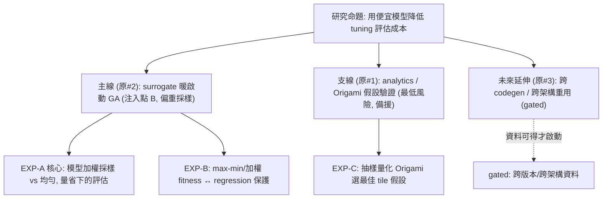

# Surrogate-assisted DSE 研究計畫（執行計畫）

> **狀態：方向已收斂**——主線＝用便宜模型暖啟動 GA 搜尋以減少 tuning 評估（見 §1）。本檔是**執行計畫**（方向、方法、實驗、metric、紀律）；**知識前置**（要先學什麼、順序、優先級）見 [knowledge-plan.md](knowledge-plan.md)。（原本綁定的 8 週 roadmap 時程已 deprecated，本檔不再引用其日期。）
>
> **平台範圍：** 資料集、predictor、analytics 全部**鎖定 MI300（gfx942 / CDNA3）**——所有 benchmark 資料都在這顆卡上生成。**MI350（gfx950 / CDNA4）為後續 migrate 目標**，跨架構泛化屬未來延伸（§1.3）。官方規格見 [../isa/spec-sources.md](../isa/spec-sources.md)。

## 0. 研究命題與定位

**命題**：GEMM tuning 現行靠 grid search 笛卡兒積窮舉 benchmark 建表；每次 codegen / config 一改就要重跑，成本高、擴展慢。**用 prediction / surrogate 降低評估成本、加快 DSE**，並量化「省下多少評估、DSE 加速多少」。（與 NPU tile-level DSE 的 profiling-reuse 命題同構。）

**定位**：本研究是**離線、資料驅動**的建模與分析——**不寫 kernel、不改 codegen、不動正職維護的 Ductile/GEKO 核心**，只用既有 / 自產 benchmark 資料做 offline 建模。知識前置與學習順序見 [knowledge-plan.md](knowledge-plan.md)。

## 1. 方向：主線 / 支線 / 未來延伸

> 方向已收斂（原本「三切角 + 決策樹、kickoff 選一個」已定案）：**主線做原切角 #2**、**支線用原切角 #1 當最低風險備援**、**原切角 #3 為未來延伸**。mentor kickoff 仍會確認假設與 metric，但工作方向已定。

### 1.1 主線（原 #2）— surrogate-assisted warm-start of GA `已選定`

- 用便宜模型（analytical / surrogate）指導 GA 的採樣（偏重、pre-screen），在保住 top-1/top-k 前提下減少實測評估。**方法見 §2、落地見 §3、實驗見 §5（EXP-A/B）**。
- 為何選它：最貼近命題、可行性高，且正對準團隊「2–3 小時/tile」痛點（§3）。

### 1.2 支線（原 #1）— 搜尋空間 analytics / completeness `備援 · 最低風險`

- 純分析：feature importance、landscape 平滑度、completeness 指標（`SWDEV-477426` scope 2/4），以及「Origami 選到最佳 tile」假設驗證（§5 EXP-C）。
- 定位：主線若卡住（資料不足 / 雜訊太大）可退到這條**純分析**，風險最低；產出也能回饋主線的 feature 設計。

### 1.3 未來延伸（原 #3）— 跨 codegen / 跨架構 profiling 重用 `gated`

- codegen 改版前後效能排序保留度 → correction / transfer model → 量「重用舊 profiling 能省多少 re-profiling」；同一套思路可延伸 **gfx942 → gfx950 / MI350** 的跨架構重用。
- 前提：**能取得跨 codegen 版本的 benchmark 資料**才啟動（kickoff 確認）；本階段仍鎖定 gfx942 單一架構。

### 1.4 研究問題

1. 能否用便宜的分析 / surrogate 模型「指導」GA，在**保住 top-1 / top-k** 的前提下顯著**減少實測評估次數**？
2. 注入方式該用「**硬縮範圍**」還是「**軟性偏重**」？在**模型出錯時**，如何仍保留 GA 逃脫能力（不被模型偏誤鎖死）？
3. 模型要多細才夠？Roofline 級（只給 compute/memory-bound regime 與上界）夠不夠，還是要 Origami analytical / Formocast simulation / learned surrogate 才能真的縮到 config 粒度？

## 2. 方法：把模型接進 GA（暖啟動）

### 2.1 現狀 gap（為什麼這塊是開放的）

- 目前 **tuning 層（Ductile GA）與 selection 層（Origami/Formocast）是解耦的**：Origami/Formocast 的效能模型只用來「從既有 kernel 挑一個」，**沒有回饋給 GA「該在哪個範圍、往哪偏重搜」**（見 [../geko-ductile/ga-faq-clarifications.md](../geko-ductile/ga-faq-clarifications.md) Q18、[../origami/ecosystem-and-formocast.md](../origami/ecosystem-and-formocast.md)）。
- Ductile 的搜尋範圍來自 `--convert-config` 的**靜態規則** + 專家 **hw profile**，**不是 per-shape 的模型預測**（見 [../geko-ductile/ga-algorithm-implementation.md](../geko-ductile/ga-algorithm-implementation.md) §3.5）。
- → 「用便宜模型指導 GA 搜尋、減少實測評估」在 production **尚未走過**，正是研究線的切入點。

### 2.2 兩個注入點

| 注入點 | 做法 | 風險 / 評估 |
| --- | --- | --- |
| **A. 改候選清單（硬縮/擴範圍）** | 用模型預測後直接砍/加每個 gene 的候選值，像「更聰明的 `--convert-config`」 | **高風險**：模型錯 → 剪掉真最佳值 → GA 永遠拿不到（hard boundary，見 [../geko-ductile/ga-faq-clarifications.md](../geko-ductile/ga-faq-clarifications.md) Q17）。適合先做「只擴不砍」的保守版 |
| **B. 軟性偏重採樣權重（推薦先做）** | 用模型預測設 sampling `weights`/`probs`（[../geko-ductile/ga-algorithm-implementation.md](../geko-ductile/ga-algorithm-implementation.md) §6.4 的現成 hook），甚至偏重 mutation（§11.2） | **較安全**：只「偏重」不「硬剪」，模型錯了 GA 仍能靠 mutation 逃出。改動最小、不動 GA 核心 |

### 2.3 設計原則

- **biasing not pruning（偏重而非硬剪）**：warm-start metaheuristic 的黃金原則。因為 gene 是硬邊界（Q17），硬剪會把模型誤差直接變成 GA 的天花板；軟性偏重則保留「模型看走眼時」的探索能力。
- **最小改動接入**：`weights` / `weight_beta → probs` 這個 hook **已存在**，predictor 只要輸出「每個 gene 各候選的偏好權重」即可餵入，**不必改 GA 核心**——符合研究線「不動正職維護的 Ductile / GEKO 核心」的邊界。

## 3. 對接團隊 pipeline：切入點 / 循環依賴 / 邊界

> 來源：對照 [../meeting_notes/GEMM-Optimization-Roadmap-Origami-Tile-Selection-摘要.md](../meeting_notes/GEMM-Optimization-Roadmap-Origami-Tile-Selection-摘要.md)（performance team roadmap 會議），把 §2 的抽象方向落到團隊**實際 pipeline** 上。

### 3.1 他們用 Origami 在哪、我們的切入點在哪（重要區分）

- 團隊**已是 model-assisted 範式**，但 Origami 用在兩個**上游/下游**位置，都**不是**「暖啟動 GA 的參數搜索」：
  - **尺寸 → tile 的 mapping**（會議 §3.3 step 2）：決定「tune 哪些尺寸、固定哪個 tile」。
  - **tile selection 的 100k×1k 效能矩陣**（會議 §4.2 step 2）：決定「library 放哪些 tile」。
- 一旦 tile 固定、尺寸選定，進到「用 GA tune 代表 kernel」（會議 §3.3 step 4）時，**GA 對其餘 kernel 參數的搜索仍是「完整搜索 + 真實 benchmark 當 fitness」，沒有用 Origami 去 pre-screen 或偏重採樣**。
- → **本研究線的注入點 B（§2.2）正好落在他們「還沒用模型」的這一段**，直接對準他們自陳的成本 baseline：這條「macro tile tuning workflow」＝固定 tile、多尺寸 GA tune，**單 GPU 約 2–3 小時/tile**（會議 §3.2；workflow grounding 見 [knowledge-plan.md](knowledge-plan.md) E10）。

### 3.2 循環依賴警告 + 初步解法

**警告**：Origami 已被用在 mapping + tile selection；若再塞進 GA warm-start，同一模型的偏誤會被**第三次放大**。故務必守 §2.3 的 biasing-not-pruning，並保留真實 bench 抽樣當防線（與會議 §3.3 step 5 的獨立 benchmark、Q2 的 tiered 驗證同精神）。

> **關鍵洞察（為什麼這 issue 沒有想像中致命）**：GA 的 fitness 是**實測 GFLOPS**——模型只影響「**往哪找**（採樣偏重）」，不決定「**留下誰**（survival/selection）」。所以循環依賴主要傷的是**效率**（浪費評估在模型偏好區、少探盲區），**不是正確性**；只要不硬剪（biasing not pruning），實測 fitness 最終會糾正模型的錯誤偏重。真正致命的是「用模型**同時指導搜尋又評判結果**」，下面第 2 點就是在切斷這條。

**初步可能解法（先記著，做到這塊時再細化、可再討論）**：

1. **用自訓 surrogate、而非重用 Origami 做 warm-start**（最乾淨）：本研究本來就會訓一個 data-driven surrogate；用它偏重 GA，而 Origami 只留在上游 mapping/selection，**兩者非同一模型，循環就不成立**。
2. **guidance 與 judgment 分離**：無論用哪個模型偏重搜尋，**驗證一律用 held-out 的真實 benchmark**，絕不用模型評判自己的結果（避免自我確認迴圈）。
3. **保底探索（ε-uniform）**：強制固定比例（如 10–20%）的採樣維持均勻/隨機，不受模型權重影響——保證模型盲區永遠有覆蓋。是 biasing-not-pruning 的一個具體旋鈕。
4. **模型影響力隨世代退火**：前期強偏重（快速起步）、後期退回均勻，讓實測驅動的演化接手、把模型偏誤甩掉。
5. **自適應信任**：跑的過程監控「模型 top 候選 vs 實測 GFLOPS」的落差；若模型推薦持續在實測落敗，就自動調降模型權重。
6. **以 §5 EXP-C 圈出可信 regime**：EXP-C（抽樣量化 Origami 假設）本身就是這個 issue 的天然解——**只在 EXP-C 驗證過 Origami 可信的 regime 套用偏重，在已知不可信的 regime 退回均勻**。這把 EXP-C 從「支線分析」接成「循環依賴的緩解手段」。

### 3.3 邊界：哪些團隊問題**不在**本研究線（scoping guardrail）

- **regression 分級政策**（會議 Q2）：屬產品 / 客戶 context 的價值判斷，非演算法問題；我方最多提供「帶硬約束的加權多目標 fitness」**機制**（見 EXP-B），但分幾層、閾值多少要團隊拍板。
- **新架構 cold-start 推導 tile**（會議 Q3，Grimlock）：無 benchmark 資料 → data-driven surrogate 直接失效；需要**不吃 per-arch 資料的物理 / 硬體模型**（Origami/Formocast 類），不是本（data-driven）研究線的範圍。也正是 Q17「hard boundary」的極端案例——連候選範圍本身都未知。
- **greedy tile selection**（會議 §4）：屬**次模集合覆蓋**問題，greedy 已是對的工具（有近似保證），**不該硬套 GA**。

## 4. 資料集與評估

### 4.1 資料集 schema（三方向共用地基）

來源：`Tensile/bin/Tensile` 產出的 `2_BenchmarkData/*.csv`，經 pipeline 正規化（也可用 GEKO `--search`）。

| 欄位群 | 內容 | 備註 |
| --- | --- | --- |
| gene（特徵） | `DepthU`、`MatrixInstruction`、`WorkGroup(Mapping)`、`GlobalReadVectorWidth`、`StaggerU`、`PrefetchGlobalRead/LocalRead`、`GlobalSplitU`… | 只取**自由 gene**，避免用衍生量造成共線性（見 knowledge-plan E2） |
| problem | `M,N,K,batch`、`dtype`、transpose | shape 描述 |
| label | `GFLOPS`（fitness） | 取中位數、固定 iteration 降噪 |
| （選配）counter | rocprof-compute 抓的 HBM BW%、VALU busy… | 供 feature / 分析 |
| 環境 | GPU（固定 **gfx942 / MI300**）、ROCm、driver、iteration、config 版本 | 可重現、避免跨環境不可比 |

切分原則：**按 shape / config 分組切 train/val**（避免 leakage），非隨機切列。

### 4.2 評估 metric（單一來源，全檔共用）

- **rank correlation**（Spearman / Kendall）：predictor 排序 gene 的能力。
- **top-k 命中率**：pre-screen / 加權後保住真正 top-1 / top-k 的比例。
- **省下的評估次數**：達到同等 quality 下，比純窮舉 / 均勻採樣少跑多少 benchmark。
- **efficiency vs ideal**（Solution Selection Metrics `744174730`）：相對 best-of-pool 的效率。
- **tuning-time vs quality 取捨曲線**：研究主線的核心圖。
- 對照參考：Formocast 的 `PredictionThreshold`（用模型縮短 tuning）——本研究偏「用模型**偏重 GA 採樣**」，而非「用模型**直接取代** benchmark」。

## 5. 實驗（主線第一批，full-spec）

> 每個實驗規格：**假設 / 要用的資料 / 步驟 / 評估 metric / baseline / 風險**。metric 定義一律見 §4.2。前置知識（E1/E5/E6/E7）見 [knowledge-plan.md](knowledge-plan.md)。

### EXP-A（核心）— 模型加權採樣暖啟動 GA

- **假設**：用模型預測設 GA sampling `weights`，可在**保住 top-1** 的前提下，比均勻採樣**少 X% 評估 / 世代**達到同等 `best`。
- **要用的資料**：§4 dataset（gene[+problem] → GFLOPS）訓 predictor；GA 在**留出的 shape**上跑（勿與訓練 shape 重疊，避免 leakage）。
- **步驟**：(1) 訓 predictor（knowledge-plan E6）；(2) 把預測轉成「每個 gene 各候選的偏好權重」餵 §6.4 的 `weights`/`probs` hook（注入點 B，§2.2）；(3) 跑「均勻採樣 GA」vs「模型加權 GA」兩組；(4) 記錄兩組達到同等 `best` 所需的評估數 / 世代數。
- **評估 metric**：省下的評估次數、top-k 命中率、tuning-time vs quality 取捨曲線。
- **baseline**：均勻採樣 GA（＝現況 Ductile）。
- **風險**：predictor 偏誤 → 守 biasing-not-pruning（軟性偏重、保留 mutation 逃脫，§2.3）；若拿 Origami 當模型，注意循環依賴（§3.2）。

### EXP-B — max-min / 加權 fitness ↔ regression 保護

- **假設**：把 GA 的 fitness 從 average（`np.mean`）換成 **max-min（minimax）或保護尺寸加權**，能**天生保護最差尺寸**，把團隊最頭痛的 regression 保護（會議 Q2「uncharted territory」）**部分內化進 fitness**，且對平均 uplift 的犧牲可接受。
- **要用的資料**：一個含**多尺寸**的 config 的 benchmark 結果（§4），能算「每個尺寸相對 best-of-pool 的效率」。
- **步驟**：(1) 在同一族群/資料上，分別用 average、max-min、加權三種 `reduce_fn`（[../geko-ductile/ga-algorithm-implementation.md](../geko-ductile/ga-algorithm-implementation.md) §5、§6.3）；(2) 比較各自選出的解在「最差尺寸」與「平均」上的表現。
- **評估 metric**：最差尺寸的保護程度（min efficiency vs ideal）對比平均 uplift 的取捨曲線。
- **baseline**：average fitness（＝團隊現況；他們明說「只需改 fitness function 就能換」）。
- **風險**：max-min 可能過度保守（壓低平均）；需用取捨曲線呈現，而非單點。

### EXP-C（支線 / analytics）— 量化「Origami 選到最佳 tile」假設

- **假設**：團隊 tile selection / mapping 的地基假設「runtime Origami 會選到最佳 tile」（會議 §4.3）**在多數 regime 成立、但在某些 regime 會崩**，且可被抽樣量化。
- **要用的資料**：一個**可負擔的抽樣子集**（無法跑完整 100k×1k），對這些點同時有 Origami 預測與真實 bench。
- **步驟**：(1) 抽樣一批 (problem, tile)；(2) 真實 bench 得 ground truth；(3) 算 Origami 相對 ground truth 的 rank correlation / top-1 命中率；(4) 分 regime（size 級距、compute/memory-bound）畫出假設成立/崩壞地圖。
- **評估 metric**：rank correlation、top-1 命中率（分 regime）。
- **baseline**：假設「Origami＝完美」時的 top-1（即 100%）作對照，量化落差。
- **風險**：抽樣偏差 → 抽樣要涵蓋多種 regime；此實驗只**量化**假設，不改 Origami（改 heuristics 屬正職）。

## 6. 研究迭代日紀律

一次只改一個變因（特徵 / 模型 / 資料切分 / pre-screen 比例）→ 在 held-out validation 算 metric（§4.2）→ 對照 baseline → 記錄 hypothesis / 改動 / 數字 / 結論。避免 leakage 與過擬合。

- **每日自我檢核**：(1) 這次改善是在按 shape/config 分組切的 validation 上、且非 leakage 造成的嗎？(2) metric 是否真的對應下游用途（tuning 只需排序 / 選 top-k 對，不是最小化絕對 GFLOPS 誤差）？

## 7. 需自己產出（empirical，無法代填）

> 以下要**實跑**才會有，不在本計畫代填：

- [ ] pipeline 的可貼指令 + `dataset.csv` 的實際欄位（跑過 grid / GEKO `--search` 後補）。
- [ ] baseline predictor（線性 / RF / xgboost）的初始數字（rank-corr / top-k）。
- [ ] 三個實驗的結果圖表（取捨曲線、feature importance、Origami 假設 regime 地圖）。
- [ ] mentor kickoff 敲定的假設 / 成功 metric 定案（若與 §1/§5 有出入，以 kickoff 為準）。
