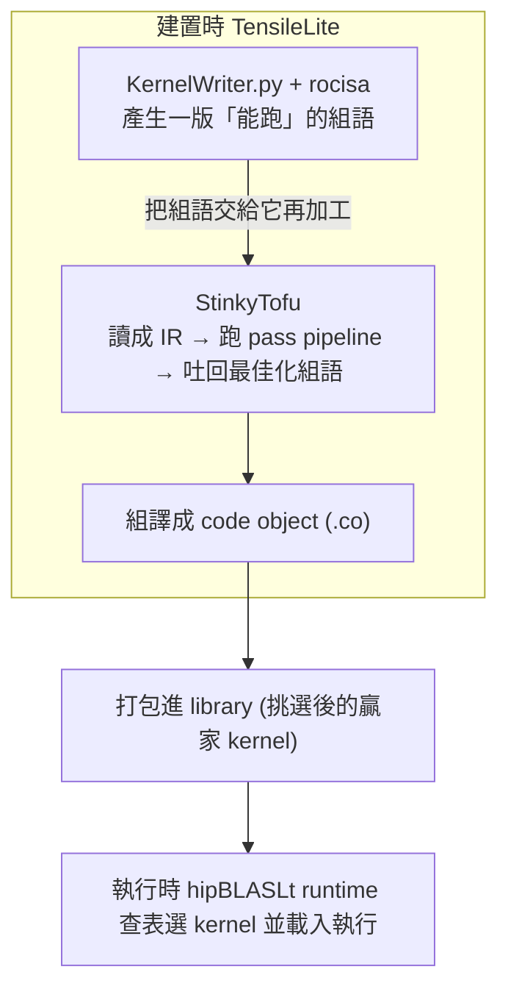

# StinkyTofu 白話總覽：GPU 組語的「小型最佳化編譯器」

路徑說明：本檔在 repo 內的 `study_docs/stinkytofu/`。連到 study_docs 其他文件用相對路徑（如 `../hipblaslt/tensilelite-pipeline.md`）；連到原始碼與官方文件用 `../../shared/...`、`../../projects/...`（往上兩層回到 repo root 再往下）。行號可能隨 commit 漂移，對不上時以符號名稱為準。

> 這一組文件是**寫給沒有 compiler 背景的讀者**。每個編譯器名詞第一次出現都會先用一句白話解釋，再往下講細節。看不懂任何一段，先回到本檔「名詞小抄」對照。

## 一句話總結（先看這句）

> **StinkyTofu 是一個「專門把 AMD GPU 組合語言排得更快、補上正確等待指令」的小型最佳化器。** TensileLite 產生 kernel 的組語之後，把組語交給它「再加工」一輪，讓同一支 kernel 跑得更快。

## 30 秒總覽：它在解決什麼問題？

先回憶 [../hipblaslt/tensilelite-pipeline.md](../hipblaslt/tensilelite-pipeline.md)：TensileLite 在**建置時**用 `KernelWriter.py` 透過 `rocisa`（一個「組裝 AMDGPU 指令」的 C++ 工具庫）**程式化產生**每支候選 kernel 的組合語言。

問題是：**「產生一堆能跑的指令」和「把這些指令排到最快」是兩件不同的事**。

- 早期做法：兩件事都塞在一個叫 `KernelWriterAssembly.py` 的檔案裡，它有約 **1.4 萬行**、還帶大量共享狀態，改一個地方很容易弄壞別處，人跟 AI 都難以安全修改。
- StinkyTofu 的做法：把「最佳化指令」這件事**抽出來**，做成一個**獨立、像小型編譯器的模組**。`KernelWriter`/`rocisa` 只負責先產生一版「能跑」的組語，最佳化就整包丟給 StinkyTofu。

可以用一個類比：

- **rocisa / KernelWriter**＝一個把菜「先炒出來」的廚師（能吃，但擺盤和上菜順序還沒最佳化）。
- **StinkyTofu**＝一位專門的「出菜總管」，接手後重新安排上菜順序（排程）、在該等的地方插上「等這道好了再上下一道」的提示（等待指令），讓整桌菜更快更順地上齊。

還有一個更深的理由（很多人會忽略）：**TensileLite 的 kernel 是用 Python 直接「拼」出組語的，完全沒經過 Clang / LLVM。** 一般 HIP kernel 會走 LLVM，享受到 LLVM 後端成熟的排程、`SIInsertWaitcnts`（自動插等待指令）等最佳化；但這些繞過 LLVM 的 kernel **吃不到那一段**——LLVM 根本看不到它們。StinkyTofu 就是專門來補這個缺口的後端最佳化器。這條「為什麼」與 ROCm 整體定位、與 LLVM/rocisa/rocRoller 的比較，完整整理在 [ecosystem-and-impact.md](ecosystem-and-impact.md)（改寫自 [Confluence 頁面](https://amd.atlassian.net/wiki/spaces/~7120204c779face96d403c9783064701435635/pages/1784143498)）。

> 名詞：
> - **組合語言（assembly, 組語）**＝最貼近硬體、一行一個動作的低階程式；GPU 真正執行的就是它編譯出來的機器碼。
> - **kernel**＝在 GPU 上實際跑的那段運算程式。
> - **最佳化器 / optimizer**＝不改變「算出來的結果」，只讓它「跑得更快或更省」的程式。

## 為什麼叫「LLVM 風格、以 pass 為基礎」？

官方一句話描述是：*「StinkyTofu is an LLVM-inspired pass-based IR optimizer for AMD GPU assembly kernels」*（見 [../../shared/stinkytofu/docs/developer/architecture.md](../../shared/stinkytofu/docs/developer/architecture.md)）。拆開來講：

- **IR（Intermediate Representation，中間表示）**＝一種介於「原始碼」和「最終機器碼」之間的**中繼格式**。它比組語多了一些結構資訊（哪個值從哪來、指令之間的相依關係），方便程式去分析與改寫。StinkyTofu 先把組語讀進成 IR，改完再吐回組語。
- **pass（優化步驟）**＝一道「把整份 IR 讀一遍、改一遍」的處理。每個 pass 只專心做一件事，例如「重排指令順序」「插入等待指令」「刪掉沒用的指令」。
- **pass-based（以 pass 為基礎）**＝把很多個小 pass **串起來依序執行**（這條生產線就叫 **pipeline**）。好處是每一步都小、可單獨測試、可自由增減，遠比一個 1.4 萬行的大函式好維護。
- **LLVM-inspired（受 LLVM 啟發）**＝LLVM 是業界最有名的編譯器框架，它就是用「IR + 一堆 pass」這套設計。StinkyTofu 借用同一套思路，只是專門服務 AMD GPU 的 GEMM kernel。

> 一句話：**StinkyTofu = 把組語變成好分析的 IR → 讓一連串小 pass 依序把它改好 → 再吐回組語。**

## 它在整條 GEMM 流程的哪個位置？

重點：**StinkyTofu 全程在建置時（產生 kernel 的階段）運作，不在執行時**。runtime 只是查表、載入已經最佳化好的 `.co`，跟 StinkyTofu 沒有直接互動。

## 這組文件怎麼讀（導讀順序）

1. 本檔（README）— 先建立「它是什麼、為什麼、在哪裡」的直覺。
2. [ir-and-pipeline.md](ir-and-pipeline.md) — 兩層 IR（Logical / Asm）、pass pipeline、最佳化等級 `OptLevel`，以及「新增一個 GPU 架構只要加一份表格檔」的 build 機制（TableGen）。
3. [key-passes.md](key-passes.md) — 逐一白話拆解重點 pass 在做什麼（排程、插等待指令、刪冗餘…），並解釋兩個最容易卡住的觀念：def-use chain 與 pseudo-PHI。
4. [tensilelite-integration.md](tensilelite-integration.md) — StinkyTofu 實際上是怎麼被 TensileLite 呼叫、用哪個開關打開、有哪些除錯旋鈕、以及「哪些 GPU 架構才走 StinkyTofu」。
5. [ecosystem-and-impact.md](ecosystem-and-impact.md) — 拉遠一點看：它在整個 ROCm 堆疊的定位、跟 LLVM/rocisa/rocRoller 的比較、對一般 App 開發者 vs 系統開發者的實際影響、測試工作流，以及「何時該打開黑盒」。

## 名詞小抄（compiler 用語 → 白話）

| 名詞 | 白話解釋 |
|------|---------|
| **IR（中間表示）** | 介於原始碼與機器碼之間、方便程式分析改寫的中繼格式。 |
| **pass** | 一道「讀一遍 IR、改一遍」的最佳化步驟；只做一件事。 |
| **pipeline** | 把很多 pass 串起來依序跑的生產線。 |
| **lowering（降級）** | 把高層、抽象的表示「翻譯」成更貼近硬體的低層形式。 |
| **backend** | 針對某個特定 GPU 架構、負責產出最終指令的部分。 |
| **CFG（控制流程圖）** | 程式「會跳到哪、迴圈怎麼繞」的地圖，由一塊塊 basic block 用箭頭連起來。 |
| **basic block（基本區塊）** | 一段「從頭跑到尾、中間不會跳走」的連續指令。 |
| **DAG scheduling（排程）** | 依「指令之間的相依關係圖」重排執行順序，用不相關的工作填滿等待空檔來藏延遲。 |
| **def-use chain** | 某個暫存器「在哪裡被寫入（def）、在哪裡被讀取（use）」的關係鏈。 |
| **PHI node** | 在多條路徑匯流處，表示「這個值可能來自不同來源」的一種假指令；最後不會出現在真正的組語裡。 |
| **peephole** | 只看「小範圍幾條相鄰指令」就能做的局部替換最佳化。 |
| **waitcnt（等待指令）** | AMD GPU 用來「等某類記憶體/計算結果就緒」再往下做的 `s_wait_*` 指令。 |
| **register（暫存器）** | GPU 上跑得最快的一小塊儲存；`v`=向量暫存器、`s`=純量暫存器、`acc`=累加暫存器。 |

## 交叉連結

- 上游：kernel 組語怎麼被產生（KernelWriter + rocisa 三層分工）→ [../hipblaslt/kernelwriter-implementation.md](../hipblaslt/kernelwriter-implementation.md)
- 上游脈絡：TensileLite 三階段 pipeline → [../hipblaslt/tensilelite-pipeline.md](../hipblaslt/tensilelite-pipeline.md)
- repo 位置與資料夾角色 → [../architecture/shared-and-build.md](../architecture/shared-and-build.md)
- 跨文件名詞彙總 → [../glossary.md](../glossary.md)
- StinkyTofu 官方文件（英文、假設有 compiler 背景）→ [../../shared/stinkytofu/docs/README.md](../../shared/stinkytofu/docs/README.md)
- 生態定位 / 比較 / 開發者影響（本組第 5 篇）→ [ecosystem-and-impact.md](ecosystem-and-impact.md)
- 原始整理（Confluence，給一般開發者的完整說明）→ [ROCm 中的 StinkyTofu](https://amd.atlassian.net/wiki/spaces/~7120204c779face96d403c9783064701435635/pages/1784143498)
