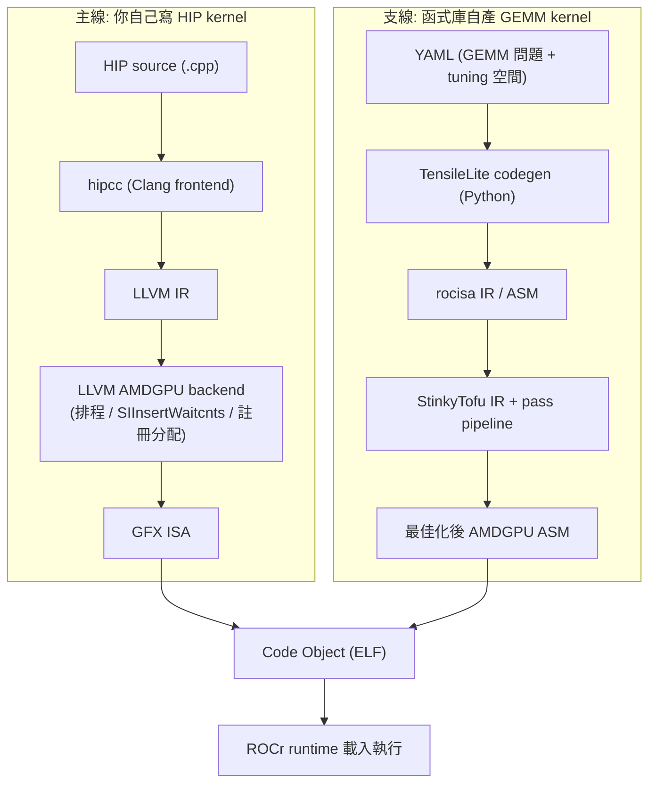

# StinkyTofu 在 ROCm 生態的定位、比較與對開發者的影響

路徑說明：本檔在 `study_docs/stinkytofu/`。原始碼連結用 `../../projects/...`、官方文件用 `../../shared/...`。行號會漂移，以符號名稱為準。建議先讀 [README.md](README.md)。

> 本檔改寫並補充自使用者整理的 Confluence 頁面 [ROCm 中的 StinkyTofu：給一般開發者的完整說明](https://amd.atlassian.net/wiki/spaces/~7120204c779face96d403c9783064701435635/pages/1784143498)。前四份文件講「StinkyTofu 內部怎麼運作」；本檔補上**它在整個 ROCm 堆疊的位置、跟其他工具的取捨、以及對你日常開發的實際影響**。

## 一、先把地圖畫出來：StinkyTofu 長在 ROCm 哪裡？

先複習 **ROCm** 是什麼：它是 AMD 的開放 GPU 運算軟體堆疊，從最底層的 kernel driver 一路到 PyTorch/TensorFlow，讓 AMD GPU 能當運算加速器用。由下而上大致是：driver（amdgpu/KFD）→ ROCr runtime（HSA runtime）→ HIP runtime → 數學/ML 函式庫（rocBLAS、hipBLASLt、MIOpen…）。

> 名詞：
> - **hipcc**＝ROCm 給一般人用的 C++/HIP 編譯器，內部包了 **Clang + LLVM AMDGPU backend**。你自己寫 HIP kernel 時用的就是它。
> - **ROCr runtime（HSA runtime）**＝執行期系統：管理 command queue、記憶體、把 code object（ELF）載入 GPU 並 dispatch。
> - **backend**＝編譯器裡「接手中間表示、負責最佳化與產出目標機器碼/組語」的後半段。

關鍵是要分清楚 ROCm 裡有**兩條**產生 GPU kernel 的路線：

**StinkyTofu 只出現在支線的「rocisa → 最終 ASM」這一段**，服務對象是 hipBLASLt / TensileLite 產生的 GEMM / Attention 類 kernel（特別是 gfx1250 之後）。你寫 HIP kernel 或跑 PyTorch 時不會直接碰到它，但你呼叫的 GEMM/Attention kernel 很可能是被它「加工過」的。

## 二、最關鍵的「為什麼」：這些 kernel 繞過了 LLVM

這是 Confluence 頁面點出、而值得放大的核心理由：

**TensileLite 的 kernel 是用 Python 腳本「直接拼出」rocisa IR / 組語的，完全沒有經過 Clang / LLVM IR。** 這代表——

- LLVM AMDGPU backend 那些成熟的後端 pass（指令排程、`SIInsertWaitcnts` 自動插等待指令、註冊分配…）**根本看不到這些 kernel**，自然也幫不上忙。
- 如果沒有人補這一段，這些 kernel 就只能靠 rocisa 產出「能跑但沒精細最佳化」的組語。

所以 StinkyTofu 的存在有**兩個動機**（比 [README.md](README.md) 只講「拆 14k 行巨石」更完整）：

1. **補 LLVM 完全沒碰到的那塊後端最佳化**：專門為「繞過 LLVM 的 ASM kernel」提供類似 LLVM backend 等級的排程、等待指令插入、peephole 等。
2. **簡化維護與新硬體支援**：把舊的 `KernelWriterAssembly`（約 1.4 萬行、滿是共享狀態的 Python 巨石）改成「snippet + StinkyTofu」——codegen 負責拼 snippet，最佳化交給一個現代化、可測試的 IR 框架。

> 一句話：**別的 kernel 有 LLVM backend 罩，TensileLite 這些繞過 LLVM 的 kernel 沒有，StinkyTofu 就是它們專屬的後端最佳化器。**

## 三、跟 LLVM backend / rocisa / rocRoller 比較

先認識另外兩個名字：

- **rocisa**＝Tensile 原本用來「表示並吐出 AMDGPU 組語」的 IR 與 emit 工具庫；沒有 StinkyTofu 時，它直接輸出最終 ASM。
- **rocRoller**＝另一套「用 compiler-like passes 描述 GEMM、能做排程與註冊分配」的框架，曾用於 gfx908/90a/942/950/120x，**現已標為 discontinued（停用）**。

| 面向 | LLVM pass（AMDGPU backend） | StinkyTofu pass |
|------|---------------------------|-----------------|
| 操作 IR 層級 | LLVM IR / Machine IR | AMDGPU Logical IR / Asm IR（接近 ISA） |
| 適用範圍 | 所有經過 HIP/Clang 的 GPU kernel | **只**限 TensileLite/rocisa 產生、未經 LLVM 的 GEMM/ASM kernel |
| 功能焦點 | 通用最佳化（inlining、loop 轉換、通用排程、註冊分配、SIInsertWaitcnts…） | 針對 AMDGPU ASM 微調（含 MFMA/WMMA 的 DAG 排程、精細 waitcnt/DelayAlu、peephole…） |
| 可見資訊 | 還保有較多高階語意（型別、部分控制流） | 完全知道實際 opcode 與暫存器編號，可處理極細節硬體特性 |

**「為什麼不乾脆全部走 LLVM backend、少一套 StinkyTofu？」** 三個實務阻礙：

1. **歷史包袱**：TensileLite/hipBLASLt 長年用 Python 直接產 rocisa/ASM，全部拉回 LLVM IR 是巨大的重寫工程。
2. **新 ASIC 支援節奏**：新架構的實驗性指令（gfx1250 的 MREG、特定 MXFP4/8 WMMA opcode）在 LLVM upstream 的支援往往慢於內部需求；用「table-driven + 自家 IR」能更快驗證。
3. **GEMM 結構高度固定**：GEMM/Attention 的 pattern 很固定，用專門的 micro-compiler 反而更好控制、測試覆蓋更完整。

**取捨小結**（相對 rocisa / rocRoller）：StinkyTofu 走現代 IR + pass 架構、聚焦 hipBLASLt/TensileLite 的 gfx1250+ kernel；靠 TableGen 把新架構支援局部化在 `.def` 檔（少改 C++），並提供 `HardwareCaps` / `isSupportedByStinkyTofu` 讓 TensileLite 查詢支援度，加速 porting。代價是「又多一套 IR + pass 要學」，且覆蓋範圍有限（自訂 HIP kernel 仍全由 LLVM backend 決定）。

## 四、一次 GEMM kernel 的資料流與型態轉換

用一個典型 GEMM tuning（例如 MXFP8 GEMM）看它一路怎麼變形：

| 階段 | 來源 / 工具 | 主要資料型態 | 說明 |
|------|------------|-------------|------|
| 1. 問題描述 | YAML | 文字 YAML | GEMM 形狀（M,N,K,batch）、datatype、tuning 空間。 |
| 2. 高層 codegen | TensileLite（Python） | Python 物件 / rocisa IR | YAML → kernel 結構（macro tile、loop nest、local read/write），建立 rocisa module。 |
| 3. IR 降階 | `ToStinkyTofuUtils` / `toStinkyTofuModule` | `StinkyAsmModule`（Logical IR + Asm IR） | 把 `rocisa::Module` 降階成 StinkyTofu IR，建立 Function/BasicBlock/Instruction；`ValueSet`/`Macro` 轉成 `AsmDirective`。 |
| 4. IR 最佳化 | StinkyTofu pass pipeline | 同上 | DAG 排程、DelayAlu/WaitAlu、WaitCntInsertion、Peephole… 改指令順序與屬性。 |
| 5. ASM 輸出 | `StinkyAsmEmitter` | 文字 AMDGPU ASM（`.s`） | 產出 kernel header + 指令序列，需與 TensileLite golden ASM 對齊以確保正確性。 |
| 6. 組譯封裝 | assembler + linker | Code Object（ELF） | 組成 code object（含 metadata、kernel arguments），供 ROCr 載入。 |

> 名詞：**`StinkyAsmModule`**＝StinkyTofu 用來「裝整支 kernel」的容器（持有一串低階 `StinkyInstruction`，並組織成 Function/BasicBlock/Instruction 的層級）；**`AsmDirective`**＝把 rocisa 那些非指令結構（`ValueSet`、`Macro` 等）表示進 IR 的一種 type。

這個分層的最大好處是**每一層都能獨立測試與演進**（見下面第六節的測試工作流）。

## 五、對開發者的實際影響

Confluence 頁面把讀者分成兩類，這裡照樣分：

### 一般應用開發者：不用管，但會吃到它的好處

如果你只是用 PyTorch/TensorFlow/ONNX Runtime（底層 ROCm + hipBLASLt/MIOpen），或偶爾寫點 HIP 但重負載都來自函式庫 kernel——**你幾乎不會直接碰 StinkyTofu**（不 import 它的 Python、不 link 它的 C++、不手動加 `stinkytofu-opt` target）。但你會被它影響：

- **kernel 效能**：hipBLASLt 的 GEMM（含 MXFP8/FP8）能否在 MI300X/MI350X 上逼近競品，多半靠它的排程與 waitcnt 策略。
- **新 ASIC 支援速度**：新一代 GPU（gfx1250/gfx13xx）出現時，若 StinkyTofu 已加好指令定義與排程，函式庫能更快給出 out-of-box 效能。
- **穩定性 / 正確性**：像 memory token / `off` VGPR 誤發這類問題，有一個集中處理 ASM emit 的框架才好統一修正。

> 只要記住一件事：**當你發現「同模型、同 datatype、新版本突然快了幾 %」，背後很可能就是某個 StinkyTofu pass 或指令表的改進。**

### 系統 / 編譯器開發者：要懂 pass pipeline 與測試工具

如果你要維護 hipBLASLt/TensileLite、為新 ASIC bring-up、或 debug 某支 GEMM 在 ASM 層的行為，就得深入它的 IR、pass pipeline 與測試工具。幾個實務重點：

- **pass 順序有陷阱**：例如 remove-nop pass 要排在 waitcnt insertion **之後**，否則可能刪掉對齊/正確性所需的 `s_nop`；DelayAlu/WaitAlu 與排程互動，若沒有其他 wave 可排卻插太多 delay，效能反而變差。
- **責任邊界**：要能讀 IR、用 FileCheck 描述想要的行為、清楚每個 pass 負責什麼——把它當一個「以測試驅動演進的 IR 編譯器專案」，而不是黑盒。

## 六、測試工作流（怎麼在不跑 kernel 的情況下驗證）

| 工具 | 用途 |
|------|------|
| `stinkytofu-check` | 用 FileCheck 測**單一 pass** 的行為（跑 `RUN:` 指令，比對 stdout 與 `CHECK:`）。 |
| `st-codegen-test` / `scripts/diff-asm.sh` | 對所有 gfx1250 kernel（dense/sparse/hipBLASLt-install）**只做 codegen、只 diff ASM、不跑 kernel**，方便在兩個 commit 間看哪些 kernel 的 ASM 變了。 |
| `extract-kernel-asm` | 抓出某支 hot kernel 的 ASM / StinkyTofu IR 來分析。 |
| tuning pipeline（SIA / ScheduleIterAlg 比較，如 local-sia3cmp） | 觀察不同 `ScheduleIterAlg` 設定下的 kernel 執行時間變化。 |

一個典型「用 StinkyTofu 做 kernel 調校」的流程：tuning 找出 hot kernel → `extract-kernel-asm`/`st-codegen-test` 抓 ASM/IR → 用 rocprofv3 PMC（Occupancy、MemUnitBusy、L2 hit…）鎖瓶頸 → 在對應 pass（排程/waitcnt/DelayAlu）做針對性改動 → 用 stinkytofu-check/codegen diff 確認沒弄壞別的 kernel → 回 tuning pipeline 重跑觀察 kernel time 與 E2E 指標。

> 延伸：profiling 指標與 bench 流程見 [../hipblaslt/profiling-rocprof.md](../hipblaslt/profiling-rocprof.md)。

## 七、具體效能案例（它到底幫上多少忙）

- **`s_delay_alu`（DelayAlu pass）對 packed datatype 約 +6%**：利用硬體「`s_delay_*` 可與 VALU 指令 co-issue」的特性，把 delay 插在不搶 issue slot 的位置。實務上常得插在 loop epilogue / postamble——因為 loop body 的 issue slot 已被 MFMA/VALU 塞滿，沒空間可插。
- **新指令帶來的可能性**：支援像 `v_wmma_f32_32x64x128_f8f6f4` 這類新 WMMA opcode 後，同樣工作量可用更少 cycle 完成（例如 16 vs 32 cycle）；這需要 StinkyTofu 正確理解新 register 型態（**MREG**）與調度規則。
- **靠測試抓到的 correctness bug**：PGR1 + TDM 的 memory token bug 就是透過 StinkyTofu + TensileLite 測試流程發現並修正，避免大規模 GEMM 執行時踩到隱藏的 race。

## 八、何時該「打開黑盒」？＋學習路徑

對多數人，**把 StinkyTofu 當黑盒即可**：不必會寫它的 IR、不必懂 DelayAlu 演算法、不必手動跑 `stinkytofu-opt`。只有這幾種情境才需要打開：

- **為新 ASIC bring-up 效能基準**：判斷 GEMM/Attention 的瓶頸是硬體、LLVM backend、還是 StinkyTofu 排程。
- **追查怪異錯誤 / hang**：例如某 MXFP8 GEMM 在某 ASIC 上 soft-hang 或 invalid page fault，要檢查 ASM 是否缺 waitcnt/barrier 或用錯 memory token。
- **極限 tuning**：前端與框架都最佳化到位後，只剩「把單支 GEMM 再快 5~10%」這招。

建議學習順序：

1. **ROCm / HIP 基礎** — 見 [../gpu_knowledge/README.md](../gpu_knowledge/README.md) 與本 repo 的 HIP 教材。
2. **GEMM 生態與 TensileLite** — [../hipblaslt/tensilelite-pipeline.md](../hipblaslt/tensilelite-pipeline.md)、[../internal_docs/hipblaslt-tensilelite-reference.md](../internal_docs/hipblaslt-tensilelite-reference.md)。
3. **StinkyTofu 專題** — 本資料夾 [README.md](README.md) → [ir-and-pipeline.md](ir-and-pipeline.md) → [key-passes.md](key-passes.md) → [tensilelite-integration.md](tensilelite-integration.md)。
4. **（選修）LLVM backend 基礎** — 若要自己寫 pass 或深入排程/註冊分配，概念與 StinkyTofu 高度相通。

## 一句話總結

> **StinkyTofu 補的是「繞過 LLVM 的 TensileLite kernel」缺的那段後端最佳化——站在 rocisa 與 ROCr runtime 之間，對最高價值的 GEMM/Attention kernel 做「最後一哩路」的專門化最佳化。** 對一般開發者它是黑盒（但你吃得到效能紅利）；只有新 ASIC bring-up、追怪 bug、極限 tuning 時才需要打開它。內部運作細節見同資料夾其餘四篇；完整原始整理見 [Confluence 頁面](https://amd.atlassian.net/wiki/spaces/~7120204c779face96d403c9783064701435635/pages/1784143498)。
