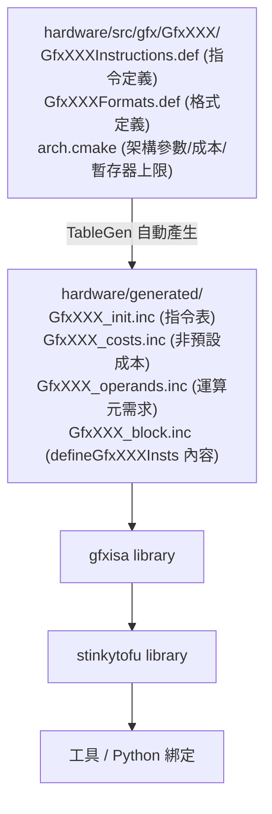

# 兩層 IR、pass pipeline 與 build 機制

路徑說明：本檔在 `study_docs/stinkytofu/`。原始碼與官方文件連結用 `../../shared/...`。行號會漂移，以符號名稱為準。建議先讀 [README.md](README.md) 建立直覺。

> 本檔回答三個問題：(1) StinkyTofu 內部把程式表示成什麼樣子（**兩層 IR**）？(2) 它怎麼一步步把程式改好（**pass pipeline** 與 **OptLevel**）？(3) 它怎麼支援不同 GPU 架構而不用一直改 C++（**TableGen build 機制**）？

## 一、兩層 IR：先寫通用草稿，再翻成某台 GPU 的方言

先複習：**IR（中間表示）** 是介於原始碼與機器碼之間、方便程式分析與改寫的中繼格式。StinkyTofu 有**兩層** IR，由高到低：

| 層級 | 位置 | 白話定位 |
|------|------|---------|
| **Logical IR**（邏輯層） | `include/stinkytofu/ir/logical/`、`src/ir/logical/` | **跟架構無關**的高層表示。像「先寫一份不綁定特定 GPU 的通用草稿」，描述「要做什麼運算」，還沒決定「在哪台 GPU 上用哪條指令」。 |
| **Asm IR**（組語層） | `include/stinkytofu/ir/asm/`、`src/ir/asm/` | **具體、架構相關**的表示，貼近真正的 GPU 組語。這是**絕大多數 pass 真正動手改的對象**。 |

從 Logical 變成 Asm 的過程叫 **lowering（降級）**＝把「通用草稿」翻譯成「某台 GPU 聽得懂的方言」。

> 類比：Logical IR 像用「標準中文」寫的一份食譜（誰都看得懂大意）；Asm IR 像把它翻成「這間廚房的行話 + 這台爐具的操作步驟」。真正在爐前照著做（被 pass 反覆調整）的是後者。

> 這兩層 IR 實際上被裝在一個叫 **`StinkyAsmModule`** 的容器裡（「裝整支 kernel」的盒子，持有一串低階 `StinkyInstruction`，並組織成 Function / BasicBlock / Instruction 的層級）。從 rocisa 進來時，由 `ToStinkyTofuUtils` / `toStinkyTofuModule` 負責降階：連指令一起，把 rocisa 的 `ValueSet`、`Macro` 這類「非指令結構」轉成一種叫 **`AsmDirective`** 的 IR type。整段轉換與資料流見 [ecosystem-and-impact.md](ecosystem-and-impact.md) 第四節（改寫自 [Confluence 頁面](https://amd.atlassian.net/wiki/spaces/~7120204c779face96d403c9783064701435635/pages/1784143498)）。

### Asm IR 長什麼樣子（文字格式）

StinkyTofu 有一種人類可讀的文字格式，工具 `stinkytofu-opt` 和測試都用它。長這樣（取自官方 [architecture.md](../../shared/stinkytofu/docs/developer/architecture.md)）：

```
st.func @name() {
^entry:
  v0 = "st.v_mul_f32"(v1, v2) { issueCycles = 1, latencyCycles = 5 }
}
```

一行行拆給你看：

- `st.func @name()`＝一個函式（一支 kernel）的開頭，`@name` 是它的名字。
- `^entry:`＝一個 **basic block**（基本區塊，一段從頭跑到尾、中間不跳走的連續指令）的標籤。
- `v0 = "st.v_mul_f32"(v1, v2)`＝一條指令：把 `v1`、`v2` 兩個向量暫存器相乘，結果寫進 `v0`。`st.` 前綴是 StinkyTofu 對指令的命名。
- `{ issueCycles = 1, latencyCycles = 5 }`＝這條指令的**時間成本**標註：
  - **issueCycles（發射週期）**＝這條指令「佔用發射器」幾個週期（大致是「多久才能發下一條」）。
  - **latencyCycles（延遲週期）**＝從發射到「結果真的可用」要等幾個週期。
  - 排程 pass 就是靠這兩個數字，把不相關的指令塞進「等結果」的空檔裡藏延遲。

> 名詞：**register（暫存器）** 是 GPU 上最快的一小塊儲存。`v[0:3]` 代表連續 4 個向量暫存器 v0~v3（常見於一次搬 128 bits 的 `ds_load_b128`）；`s10` 是純量暫存器；`acc[0:15]` 是給矩陣乘加累加用的累加暫存器。

### 組語進出 IR 的入口（大方向，先知道有這回事）

- **把字串組語讀進 IR**：`StinkyIRConverter`（見 [user/ir-converter.md](../../shared/stinkytofu/docs/user/ir-converter.md)）。給它一段 MLIR 風格的指令字串，回傳一個 `IRList`（一串指令）。
- **把 IR 吐回組語**：`StinkyAsmEmitter`（見 [user/asm-emitter.md](../../shared/stinkytofu/docs/user/asm-emitter.md)）。可選擇是否附上註解與 cycle 資訊，方便 debug。

一個最小往返流程（讀進 → 選擇性跑 pass → 吐回）：

```
組語字串 --convertToIRList--> IRList --(PassManager 跑 pass)--> IRList --emit--> 最佳化後組語字串
```

## 二、pass pipeline 與 OptLevel：一條可調強度的最佳化生產線

先複習：**pass** 是一道「讀一遍 IR、改一遍」的最佳化步驟；把多個 pass 串起來依序跑就是 **pipeline**。

- 執行者叫 **`PassManager`**：它照順序一個接一個跑 pass。
- 每個 pass 前後會觸發 **`PassInstrumentation`** 回呼（callback），用來做除錯列印、存 JSON 快照——你在 [tensilelite-integration.md](tensilelite-integration.md) 會看到的 `PrintBeforePass` / `PrintAfterPass` 就是靠它。

### ScopeAdaptor：把「一段區域」單獨拉出來排程

有時候只想針對「主迴圈」這種特定區段做重度最佳化，而不是整支 kernel。`ScopeAdaptor` 就是做這件事：它把被命名的指令區域（例如叫 `loopWithPrefetch` 的群組）**抽出來變成一個暫時的小函式**，單獨跑排程 pass，跑完再把結果**接回原處**。好處是排程器能專注在最關鍵的迴圈，不被其他部分干擾。

### OptLevel（最佳化等級）：O0 ~ O3

**OptLevel** 決定「這條 pipeline 要跑得多用力」，對應 `O0`~`O3`（數字越大越積極），由參數 `StinkyTofuOptLevel` 控制（細節見 [tensilelite-integration.md](tensilelite-integration.md)）：

- **O0**＝幾乎不最佳化（或只做必要的正確性處理）。用來當「對照組」或除錯，確認問題不是最佳化造成的。
- **O3**＝火力全開，跑完整的排程、等待指令插入、peephole 等 pass。TensileLite 用 `ScheduleIterAlg=4` 打開 StinkyTofu 時，就是設成 O3。
- 在 YAML 把它設成 `None` 代表**完全關閉** StinkyTofu 這個功能。

> 一句話：**OptLevel 像音響的音量鈕**——同一套 pass pipeline，O0 是靜音（只保正確），O3 是開到最大（全套最佳化）。

## 三、TableGen build 機制：新增 GPU 架構只要加一份表格檔

這是 StinkyTofu 設計上很聰明的一點，也是「為什麼它容易支援新 GPU」的關鍵。

**問題**：每個 GPU 架構（gfx942、gfx950、gfx1250…）都有**成百上千條指令**，每條都要登記「名字、有幾個運算元、成本多少、暫存器上限」等資訊。如果全部用手寫 C++，會是海量重複程式碼，且加一個架構就要大改。

**解法：TableGen**。先解釋名詞——**TableGen** 是「用一份**表格式的定義檔**，自動產生大量重複 C++ 程式碼」的工具（同樣源自 LLVM 生態）。你只要把指令資訊寫成好維護的表格（`.def` 檔），建置時由 TableGen **自動長出**對應的 C++。

build 相依鏈（由官方 [architecture.md](../../shared/stinkytofu/docs/developer/architecture.md) 整理）：



重點結論（官方原話）：**新增一個架構「只需要」加一個 `hardware/src/gfx/GfxXXX/` 目錄放 `.def` 檔——指令定義不用改任何 C++**。詳細步驟見官方 [adding-architecture.md](../../shared/stinkytofu/docs/developer/adding-architecture.md)。

> 名詞：`.def` / `.inc` 檔＝這裡分別是「手寫的表格定義」與「TableGen 自動生出的 C++ 片段」。`.inc` 是產物，通常不該手改。

### 補充：Intrinsic（預先定義的高階運算）

有些常用的高階運算（例如 ReLU、Clamp 這類 activation）會被預先定義在 `src/ir/logical/Intrinsics.intrinsic`，建置時編成二進位 `intrinsics.st.bc`，執行時由 `IntrinsicRegistry` 載入。你可以把 **intrinsic** 理解成「一個取好名字、可重複使用的高階積木」，用的時候不必每次重寫底層指令。細節見官方 [adding-intrinsics.md](../../shared/stinkytofu/docs/developer/adding-intrinsics.md)。

## 一句話總結

> **StinkyTofu 用「兩層 IR（通用草稿 → GPU 方言）」表示程式，靠一條可用 OptLevel 調強度的「pass pipeline」把它改好，而支援新 GPU 只要加一份 TableGen 表格檔、不用改 C++。** 想知道 pipeline 裡每個 pass 具體做什麼，接著看 [key-passes.md](key-passes.md)。
