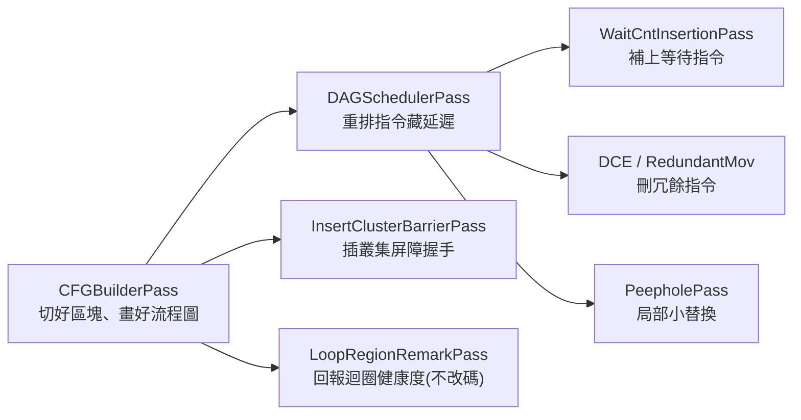

# 重點 passes 白話拆解

路徑說明：本檔在 `study_docs/stinkytofu/`。原始碼與官方文件連結用 `../../shared/...`。行號會漂移，以符號名稱為準。建議先讀 [README.md](README.md) 與 [ir-and-pipeline.md](ir-and-pipeline.md)。

> 先複習：**pass** 是一道「讀一遍 IR、改一遍」的最佳化步驟；`PassManager` 把很多 pass 串起來依序跑（就是 pipeline）。本檔逐一用白話說明**每個關鍵 pass 解決什麼問題、輸入什麼、輸出什麼**，最後專門解釋兩個最容易卡住的觀念：**def-use chain** 與 **pseudo-PHI**。

## 先看全景：一條 pipeline 大致這樣跑



> 實際順序與是否啟用由 OptLevel 與架構 backend 決定（例如 gfx1250 的 `buildGfx1250Pipeline`），上圖只是幫你建立「誰負責什麼」的分工感。

## 重點 pass 一覽（速查表）

下表整理自官方 [architecture.md](../../shared/stinkytofu/docs/developer/architecture.md) 的 Key Passes 表，白話重寫：

| Pass | 白話：它在解決什麼問題 |
|------|----------------------|
| `CFGBuilderPass` | 把指令流**切成一塊塊 basic block**，並依 label / 跳躍畫出 **CFG（控制流程圖）**。後面很多分析都靠這張圖。 |
| `StinkyDAGSchedulerPass` | **重排指令順序**藏延遲（核心最佳化）。排程前會先建 def-use chain（並插入 pseudo-PHI）。 |
| `StinkyWaitCntInsertionPass` | 在「非同步記憶體操作」和「要用它結果的指令」之間，**補上剛好夠的等待指令**（`s_wait_*`）。 |
| `DeadCodeEliminationPass`（DCE） | 刪掉「算了卻沒人用」的指令（結果在被讀之前就被覆蓋）。反覆做到不能再刪為止。 |
| `RedundantMovEliminationPass` | 刪掉**重複的搬移指令**（同樣的 `mov`，來源中間沒被改過，就不用搬第二次）。 |
| `PeepholeOptimizationPass` | 只看小範圍幾條相鄰指令做**局部替換**（例如把 `mul` + `add` 融合成一條 `fma`）。規則寫在 `.pattern` 檔。 |
| `InsertClusterBarrierPass` | 在主迴圈/尾迴圈的固定位置插入**叢集屏障（cluster-barrier）握手**，協調多個 workgroup。 |
| `LoopRegionRemarkPass` | **不改任何指令**，只「回報」迴圈健康度指標（區域數、s_nop 浪費、分支數…）給開發者看。 |

下面挑幾個最重要的展開講。

## DAG Scheduler：重排指令來「藏延遲」

這是 StinkyTofu 最核心的最佳化，也是最需要白話解釋的。

**要解決的痛點**：GPU 指令有 latency（延遲）——例如「從記憶體讀資料」發出去後，要等很多週期資料才真的到。如果下一條指令馬上就要用這筆資料，就只能**乾等**，硬體閒置、變慢。

**做法：DAG scheduling（依相依圖排程）**。先解釋名詞：

- **DAG（Directed Acyclic Graph，有向無環圖）**＝一張「誰必須在誰之前」的關係圖。指令 B 用到指令 A 的結果，就畫一條 A→B 的箭頭；因為「相依」不會繞回自己，所以無環。
- **排程（scheduling）**＝在**不違反這些箭頭**（不破壞相依關係）的前提下，重新安排指令的先後順序。

**核心技巧**：把「跟這筆等待無關的其他指令」搬進等待空檔。例如：發出讀取後，不要乾等，先去做幾條「不需要那筆資料」的計算，等回頭要用時資料剛好到位。這就是「**藏延遲（hide latency）**」。

> 類比：你把衣服丟進洗衣機（延遲很長），聰明的做法不是站著等，而是趁洗衣時去摺昨天的衣服、煮飯。DAG scheduler 幫指令做的就是這種「趁空檔安排不相關的事」。

排程前，它會先呼叫 `buildUseDefChain` 建立相依資訊（並插入 pseudo-PHI，見本檔最後一節）。

## WaitCnt Insertion：補上「剛好夠」的等待指令

**背景（硬體）**：AMD GPU 的非同步記憶體操作（LDS 的 `ds_read`/`ds_write`、global/buffer 的 load/store、`tensor_load_to_lds`）**會亂序完成**。硬體為「每一類」這種操作各準備一個計數器（FIFO）。要用某筆結果前，程式必須插入對應的 `s_wait_*` 指令，把它「等出來」。

四類計數器與對應等待指令（整理自官方 [stinky-waitcnt-insertion-pass.md](../../shared/stinkytofu/docs/user/stinky-waitcnt-insertion-pass.md)）：

| 這一類記憶體操作 | 對應等待指令 |
|-----------------|-------------|
| LDS：`ds_read` / `ds_write` / `ds_atomic` | `s_wait_dscnt N` |
| global / buffer 的 load、store | `s_wait_loadcnt N` |
| 純量記憶體 load（`s_load_*`） | `s_wait_kmcnt N` |
| `tensor_load_to_lds` | `s_wait_tensorcnt N` |

**`N` 的意思**：`s_wait_*cnt N` 會**擋住，直到該類還在飛的操作「最多剩 N 個」**（保留最近發出的 N 個，把更舊的都等完）。所以 `N=0` 代表「全部等完」，`N` 越大代表「可以先放行、少等一點」。

**為什麼不能亂等？** 這正是這個 pass 有價值的地方：

- **等太少（少插 wait）**＝資料還沒到就拿去用 → **結果錯**（正確性 bug）。
- **等太多（動不動 `wait 0`）**＝明明可以邊等邊做別的，卻全停下來 → **變慢**（浪費效能）。

所以這個 pass 的目標是「**插上剛好夠、不多不少的等待**」。它怎麼知道「誰依賴誰」？靠的就是下一節的 **def-use chain**：讀出「這條指令的來源是哪幾個記憶體操作」，再算出「要等到剩幾個」。一個直觀例子（同一份官方文件）：

```
連續發出 4 個 ds_read（v[0:3] / v[4:7] / v[8:11] / v[12:15]）
第 1 個 v_wmma 只需要前兩個 read  -> 插 s_wait_dscnt 2（等到只剩最新的 2 個在飛）
第 2 個 v_wmma 需要後兩個 read    -> 插 s_wait_dscnt 0（剩下的全等完）
```

> 一句話：**WaitCnt Insertion＝在「亂序完成的記憶體操作」和「要用它的指令」之間，插上剛好夠的等待，既不算錯也不空等。**

### 補充：`s_delay_alu`（DelayAlu pass）——小指令、大效益

除了「等記憶體」的 `s_wait_*`，AMD GPU 還有一種「等 ALU 計算」的提示指令 **`s_delay_alu`**：告訴硬體「這個結果還要幾個週期才好，先別急著發下一條依賴它的指令」。負責插它的就是 **DelayAlu pass**。

- **為什麼值得做**：它利用硬體「`s_delay_*` 可以跟 VALU 指令**同時發射（co-issue）**」的特性，把 delay 插在不搶 issue slot 的位置，換來實際加速。依 Confluence 整理，正確插入 `s_delay_alu` 對 **packed datatype（如 MXFP8/FP8）約 +6%** 效能。
- **常插在哪**：通常在 loop epilogue / postamble——因為 loop body 的 issue slot 已被 MFMA/VALU 塞滿，沒空間可插。
- **陷阱（給改 pass 的人）**：DelayAlu/WaitAlu 與排程互動，若在「沒有其他 wave 可排」的情況下插太多 delay，效能反而會下降；要謹慎。

> 這類「懂硬體 co-issue 規則、找出安全又有利的插入點」正是 StinkyTofu 擅長的細節。更多效能案例（新 WMMA opcode、memory token bug）見 [ecosystem-and-impact.md](ecosystem-and-impact.md) 第七節（改寫自 [Confluence 頁面](https://amd.atlassian.net/wiki/spaces/~7120204c779face96d403c9783064701435635/pages/1784143498)）。

> pass 順序也有陷阱：例如「刪 nop」的 pass 要排在 **waitcnt insertion 之後**，否則可能刪掉對齊/正確性所需的 `s_nop`。

## DCE 與 RedundantMov：清掉沒必要的指令

這兩個是比較好懂的「清潔工」pass：

- **DeadCodeEliminationPass（死碼消除）**：在區塊內從前往後掃，找出「算了一個結果，但在有人讀它之前就被覆蓋掉」的指令——既然沒人用，就刪掉。會反覆做到「不能再刪」（術語叫 **fixpoint，不動點**）。它會**保留**有副作用的東西（記憶體操作、barrier、就地運算等），避免刪錯。
- **RedundantMovEliminationPass（冗餘搬移消除）**：在區塊內往回找「重複的搬移指令」——同一個 `mov`（相同 opcode + 目的 + 來源），而且來源在兩次之間沒被改過，第二次就是多餘的，刪掉。

> 名詞：**side effect（副作用）**＝一條指令除了「算出一個值」以外，還會影響外界的行為（例如寫入記憶體、設定屏障）。有副作用的指令即使「結果看似沒人用」也不能亂刪。

## Peephole：小範圍的局部替換

**peephole（直譯「透過小窺孔看」）**＝只看**相鄰幾條指令**這個小窗口，就能安全替換的最佳化。經典例子是把 `a = x * y` 後面接 `b = a + z` 融合成一條 **FMA（fused multiply-add，乘加融合）**指令，省一條指令也更快。

StinkyTofu 的 peephole 特別之處：規則不是寫死在 C++，而是用**宣告式的 `.pattern` 檔**描述「看到這個形狀 → 換成那個形狀」，建置時再編進 pass。想加新規則不必動核心程式，寫進 pattern 檔即可。語法見官方 [pattern-grammar.md](../../shared/stinkytofu/docs/developer/pattern-grammar.md)、[adding-peephole-patterns.md](../../shared/stinkytofu/docs/developer/adding-peephole-patterns.md)。

## InsertClusterBarrier：協調多個 workgroup 的「握手」

新一代架構（如 gfx1250）支援把多個 workgroup 組成 **cluster（叢集）** 一起合作。要合作就得**同步**——A 還沒把資料放好，B 不能先讀。這個 pass 就是在主迴圈/尾迴圈的**五個固定規則點**，插入「signal / wait 握手」：

- **workgroup 範圍**：`s_barrier_signal -1` / `s_barrier_wait -1`
- **cluster 範圍**：`s_barrier_signal -3` / `s_barrier_wait -3`

> 名詞：**barrier（屏障）**＝一個「大家都到齊才能繼續」的集合點；**signal/wait 握手**＝一邊「我好了」發訊號、另一邊「我等你」再放行。細節與五條規則見官方 [cluster-barrier.md](../../shared/stinkytofu/docs/developer/cluster-barrier.md)。

## LoopRegionRemark：只「回報」不改碼的健康檢查

這個 pass 特別，它**不動任何指令**，只把迴圈的「健康度」報告到 stderr 給人看，由 `StinkyTofuEnableRemarks` 打開。它面向的是 **kernel 開發者**（想知道「產出的碼好不好」但不想讀原始 IR 的人）。它回報：

| 指標 | 白話意思 |
|------|---------|
| **Region count（區域數）** | 迴圈被「不可移動的副作用」切成幾段。段越少＝排程越自由＝通常越快。 |
| **Boundary causes（切割原因）** | 每一刀是被什麼切開的：`[wait]`（等待指令）、`[store]`、`[barrier]`、`[branch]`、`[untokenized_mem]`（沒掛 token 的記憶體操作，之後補 token 就可能變得可移動）。 |
| **s_nop count** | 塞了幾個 `s_nop`（空指令）＝排程沒能藏住的延遲，等於浪費的週期。 |
| **Branch count** | 迴圈裡的分支數。太多分支會拖累硬體的指令預取。 |

> 用途：region 太多就看 `[untokenized_mem]`（補 token 能合併區域）；s_nop 多代表沒藏住延遲、可考慮重排；分支多可考慮重構迴圈。細節與範例見官方 [global-parameters.md](../../shared/stinkytofu/docs/user/global-parameters.md)。

## 兩個最容易卡住的觀念

排程與等待指令這兩個 pass，底層都靠這兩個觀念，值得單獨講清楚。

### def-use chain：某個值「哪裡被寫、哪裡被讀」的關係鏈

- **def（definition，定義）**＝「寫入」某個暫存器的那一條指令（產生這個值的地方）。
- **use（使用）**＝「讀取」那個暫存器的指令（用到這個值的地方）。
- **def-use chain**＝把「這個值在哪產生、又在哪些地方被用」串起來的關係。

為什麼重要？因為**排程**要靠它判斷「誰依賴誰、能不能重排」；**等待指令**要靠它判斷「這條指令的來源是哪幾個記憶體操作、要等到剩幾個」。StinkyTofu 用 `buildUseDefChain()` 建立這條鏈。

一個關鍵難點：GPU 的記憶體相依**不一定透過真的暫存器流動**。例如 `tensor_load_to_lds` 把資料寫進一塊 LDS 區域，之後的 `ds_read` 讀同一塊 LDS——兩者有相依，但中間**沒有一個共用暫存器**把它們連起來。StinkyTofu 的解法是給這些記憶體操作掛上 **memtoken（記憶體代幣）** 這種「假暫存器」，讓相依也能被 def-use chain 追蹤到（TensileLite 端怎麼掛 token 見 [tensilelite-integration.md](tensilelite-integration.md)）。

### pseudo-PHI：在「路徑匯流處」表示「值可能來自不同來源」

先想像一個 if/else 之後匯流的情況：

```
        v = ds_read (路徑 A)     v = ds_read (路徑 B)
                     \           /
                      v         v
                     這裡（匯流點）：v 到底來自 A 還是 B？
```

匯流之後要用 `v`，但 `v` 可能來自 A、也可能來自 B（看實際跑了哪條路）。編譯器界處理這種情形的經典工具就是 **PHI node**：一個放在匯流點的**假指令**，意思是「這個值＝視來路而定的其中一個來源」。

StinkyTofu 用 `buildUseDefChain()` 在 CFG 的匯流點自動插入 **pseudo-PHI**（pseudo＝假的），好讓 def-use chain 能**跨區塊**正確連起相依（「匯流後用到的 v，其實依賴 A 和 B 兩邊的 ds_read」）。

**最重要的一點**：PHI 只是分析用的假指令，**永遠不會被吐進真正的組語**——AsmEmitter 會跳過它，等待指令 pass 完成後也會呼叫 `removePHIs` 把它們清掉。所以任何「數指令數」或「拍快照」的程式碼都必須記得略過 `GFX::PHI`，否則會多算。

> 一句話：**pseudo-PHI 是「幫編譯器在分岔匯流處把相依接起來」的臨時記號，用完即丟，不會出現在最終 kernel 裡。**

## 一句話總結

> **這些 pass 各司其職：CFGBuilder 畫地圖、DAGScheduler 重排藏延遲、WaitCntInsertion 補剛好夠的等待、DCE/RedundantMov 清冗餘、Peephole 做局部融合、ClusterBarrier 協調多 workgroup、LoopRegionRemark 只回報不改碼；而排程與等待都建立在 def-use chain 與 pseudo-PHI 這兩個「追蹤相依」的基礎上。** 想知道整包東西怎麼被 TensileLite 呼叫，看 [tensilelite-integration.md](tensilelite-integration.md)。
