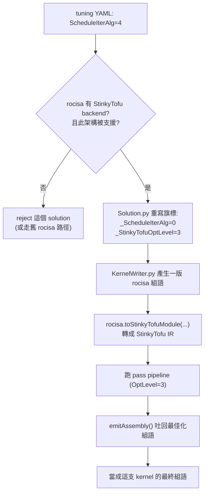

# StinkyTofu 在 TensileLite 裡怎麼被呼叫

路徑說明：本檔在 `study_docs/stinkytofu/`。原始碼連結用 `../../projects/...`、官方文件用 `../../shared/...`。行號會漂移，以符號名稱為準。建議先讀 [README.md](README.md) 與 [key-passes.md](key-passes.md)。

> 前三份文件講「StinkyTofu 是什麼、內部怎麼運作」；本檔講**實務**：它到底是怎麼被 TensileLite 觸發？用哪個開關打開？有哪些除錯旋鈕？哪些 GPU 架構才會走它？

## 一分鐘版本

1. **開關**：在 tuning 設定裡把 `ScheduleIterAlg=4`（SIA=4），就代表「這支 kernel 用 StinkyTofu、全開最佳化（OptLevel=3）」。
2. **前提**：只有 `rocisa` 有編進 StinkyTofu backend、且**該 GPU 架構被支援**（目前 gfx1250 及之後）才會生效；否則這支 solution 會被拒絕（或改走舊的 rocisa 路徑）。
3. **流程**：`KernelWriter.py` 先照舊用 rocisa 產出一版組語 → 呼叫 `rocisa.toStinkyTofuModule(...)` 轉成 StinkyTofu IR → 跑 pass pipeline → `emitAssembly()` 吐回最佳化後的組語字串，當成這支 kernel 的最終組語。



## 一、開關：`ScheduleIterAlg=4` 與 `_StinkyTofuOptLevel`

**`ScheduleIterAlg`（SIA，逐迭代排程演算法）** 是 TensileLite 既有的參數，決定「主迴圈裡的指令用哪種方式排程」。這裡多加了一個值 **`4`**，語意是「**改用 StinkyTofu、全開最佳化**」。

處理邏輯在 [Solution.py](../../projects/hipblaslt/tensilelite/Tensile/SolutionStructs/Solution.py#L626-L645)。白話拆解那段程式：

- 若 `ScheduleIterAlg == 4`：
  - 先檢查 `rocisa.hasStinkyTofuBackend()`——`rocisa` 這次 build 有沒有把 StinkyTofu 編進去。沒有就 `reject`（拒絕這個 solution，並印原因）。
  - 再檢查 `rocisa.isSupportedByStinkyTofu(state["ISA"])`——**這個 GPU 架構**有沒有 StinkyTofu backend。沒有也 `reject`，並列出目前支援哪些架構。
  - 通過檢查後，把旗標**重寫（remap）**成：`_ScheduleIterAlg = 0`、`_StinkyTofuOptLevel = 3`。
- 否則（SIA 不是 4）：`_ScheduleIterAlg = 原值`、`_StinkyTofuOptLevel = 0`。

**為什麼要 remap 成 `_ScheduleIterAlg=0`？** 這是很聰明的相容設計：把對外的「SIA=4」翻譯成「內部照舊用 SIA=0 的既有排程邏輯產生一版組語，額外記一個 `_StinkyTofuOptLevel=3` 表示『之後再交給 StinkyTofu 加工』」。這樣**既有的排程程式碼完全不受影響**，StinkyTofu 是「疊在上面」的一層，而不是把舊路徑整個換掉。

> 名詞：`state` 是一支 solution（候選 kernel）的參數字典；`reject(...)` 代表這組參數組合無效、不產生這支 kernel（可用 `printRejectionReason` 印出被拒原因，方便除錯）。

## 二、轉換路徑：KernelWriter 怎麼把組語交給 StinkyTofu

真正的接手發生在 [KernelWriter.py](../../projects/hipblaslt/tensilelite/Tensile/KernelWriter.py#L6558-L6680)。流程（白話）：

1. 讀出 `_StinkyTofuOptLevel`；若它有值、且 `rocisa.isSupportedByStinkyTofu(version)` 為真，才啟動 StinkyTofu 路徑。
2. 組出一份 **module options**（要傳給 StinkyTofu 的設定），關鍵欄位對應到後面第三節的 GlobalParameters 旋鈕，例如 `OptLevel`、`EnableRemarks`、`DebugLevel`、`PrintBeforePass/AfterPass`、`DebugPass`、`EnableWaitCntInsertion`、`EnableESM2`、tile 尺寸（`TileA0` 等）。
3. 呼叫 **`rocisa.toStinkyTofuModule(moduleKernelBody.body, version, "kernel_name", signature=fs, ...)`**：把前面 rocisa 產出的組語主體，連同函式簽章，轉成一個 StinkyTofu module（就是它的 IR）。
4. 跑 StinkyTofu 的 pipeline（內部依 OptLevel 與架構 backend 決定跑哪些 pass，見 [key-passes.md](key-passes.md)）。
5. 呼叫 **`emitAssembly()`** 把最佳化後的 IR 吐回組語字串，這支 kernel 最終就用這份組語（`return (error, st_asm)`）。

過程中還會用 `print2(...)` 印出各階段耗時（`(1a) toStinkyTofuModule`、`(1b) pipeline`、`(2) emitAssembly`…），方便觀察 StinkyTofu 花了多少時間。

### memtoken：讓 waitcnt pass 追得到 LDS 相依

還記得 [key-passes.md](key-passes.md) 說過：LDS 的相依「不透過真的暫存器流動」，所以要掛 **memtoken（記憶體代幣）** 這種假暫存器，等待指令 pass 才追得到。這件事就發生在 TensileLite 端——[KernelWriterAssembly.py](../../projects/hipblaslt/tensilelite/Tensile/KernelWriterAssembly.py#L12585) 在產生 local write 指令時呼叫 `writeInst.setMemToken(MemTokenData(localWriteMemToken))`，替 local write 掛上 token，讓下游的 StinkyTofu waitcnt pass 能追蹤到 local write 的相依。

## 三、除錯與行為旋鈕（GlobalParameters）

透過 Tensile 的 `GlobalParameters`（CLI `--global-parameters` 或 YAML）可以控制 StinkyTofu。整理自官方 [global-parameters.md](../../shared/stinkytofu/docs/user/global-parameters.md)：

| 參數 | 值 | 白話用途 |
|------|----|---------|
| `StinkyTofuOptLevel` | `0`~`3` | 最佳化強度（見 [ir-and-pipeline.md](ir-and-pipeline.md) 的 OptLevel）；設 `None` 完全關閉 StinkyTofu。 |
| `StinkyTofuDebugLevel` | `0`/`1`/`2` | 除錯輸出多寡：`1` 印 pass 執行順序；`2` 把「跑每個 pass 前後的 IR」寫成檔。 |
| `StinkyTofuPrintBeforePass` | pass 名字（逗號分隔） | 只在**指定 pass 之前**把 IR 印出來（精準看某一步的輸入）。 |
| `StinkyTofuPrintAfterPass` | pass 名字（逗號分隔） | 只在**指定 pass 之後**把 IR 印出來（看某一步的成果）。 |
| `StinkyTofuDebugPass` | pass 名字（逗號分隔） | 打開該 pass 的**內部**除錯訊息（如 DAG 圖、排程決策）到 stderr。 |
| `StinkyTofuVerifyEach` | `0`/`1` | 每跑完一個 pass 就驗證 IR 是否仍合法（抓 pass 弄壞 IR 的 bug）。 |
| `StinkyTofuEnableRemarks` | `0`/`1` | 打開迴圈健康度回報（`LoopRegionRemarkPass`，見 [key-passes.md](key-passes.md)）。 |

用法範例（CLI；字串值要「外單引號＋內雙引號」讓 Python 的 `eval()` 正確解析）：

```bash
Tensile.sh config.yaml output/ --global-parameters StinkyTofuOptLevel=3 StinkyTofuDebugLevel=2
Tensile.sh config.yaml output/ --global-parameters StinkyTofuOptLevel=3 'StinkyTofuPrintAfterPass="CFG Builder, StinkyDAGSchedulerPass"'
Tensile.sh config.yaml output/ --global-parameters StinkyTofuOptLevel=3 StinkyTofuEnableRemarks=1
```

YAML 寫法：

```yaml
GlobalParameters:
  StinkyTofuOptLevel: 3
  StinkyTofuDebugLevel: 2
  StinkyTofuPrintAfterPass: "CFG Builder, StinkyDAGSchedulerPass"
  StinkyTofuEnableRemarks: 1
```

> 注意：這些參數走的是 **Tensile/KernelWriter 整合路徑**。如果你是用獨立工具 `stinkytofu-opt` 直接跑 IR，改用它的等效 CLI 旗標（如 `--remarks`），見官方 [stinkytofu-opt README](../../shared/stinkytofu/tools/stinkytofu-opt/README.md)。

## 四、依架構切分：誰走 StinkyTofu、誰走 rocisa

這是常見疑問的關鍵答案：**不是所有 kernel 都走 StinkyTofu**。切分標準是**GPU 架構**（見官方 [architecture.md](../../shared/stinkytofu/docs/developer/architecture.md) 的 "rocisa vs StinkyTofu"）：

- **較新架構（gfx1250 及之後）**：走 **StinkyTofu**。
- **較舊架構**：仍走 **rocisa**（既有路徑）。
- 兩者之間由 `src/conversion/rocisa/` 當**橋接**：把 rocisa IR 轉成 StinkyTofu 的 Asm IR（就是前面 `toStinkyTofuModule` 背後做的事）。

所以在較舊 GPU 上，就算你寫 `ScheduleIterAlg=4`，`isSupportedByStinkyTofu` 會回 false，這支 solution 會被拒（見第一節）。想確認某架構是否支援，程式端可查 `rocisa.getRegisteredArchKeys()`。

> 這也呼應整個 codegen 的演進方向：舊的 `KernelWriterAssembly.py` 巨石逐步被「snippet 架構 + StinkyTofu」取代，新架構先落地、舊架構維持相容。生態脈絡見 [../internal_docs/hipblaslt-tensilelite-reference.md](../internal_docs/hipblaslt-tensilelite-reference.md) Module C.2。

定位對照（誰負責產出最終 ASM）：

- **rocisa**：Tensile 原本的組語 IR / emit backend；沒有 StinkyTofu 時直接吐最終 ASM，較少系統性的 pass-based 最佳化。
- **rocRoller**：另一套 compiler-like、能做排程與註冊分配的 GEMM 框架，曾用於 gfx908/90a/942/950/120x，**現已停用（discontinued）**。
- **StinkyTofu**：走現代 IR + pass 架構，聚焦 hipBLASLt/TensileLite 的 **gfx1250+** kernel，靠 TableGen 把新架構支援局部化在 `.def` 檔。

完整的「為何不全走 LLVM backend」與三者取捨比較，見 [ecosystem-and-impact.md](ecosystem-and-impact.md) 第二、三節（改寫自 [Confluence 頁面](https://amd.atlassian.net/wiki/spaces/~7120204c779face96d403c9783064701435635/pages/1784143498)）。

## 一句話總結

> **在 tuning 設定寫 `ScheduleIterAlg=4` 就是「這支 kernel 用 StinkyTofu、OptLevel 全開」；TensileLite 會先照舊產一版 rocisa 組語，再 `toStinkyTofuModule` 轉成 IR、跑 pass、`emitAssembly` 吐回最佳化組語；但只有支援的新架構（gfx1250+）才會真的走這條路，舊架構仍走 rocisa。** 想回頭看 pass 在做什麼，見 [key-passes.md](key-passes.md)。
